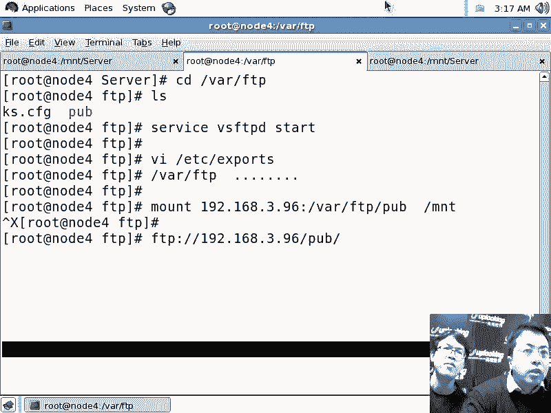
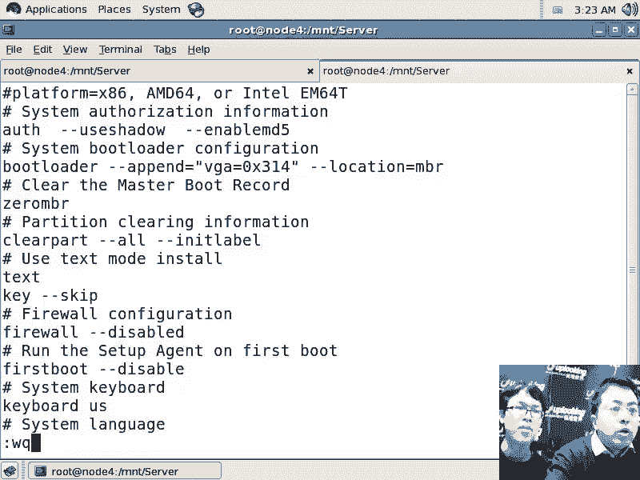
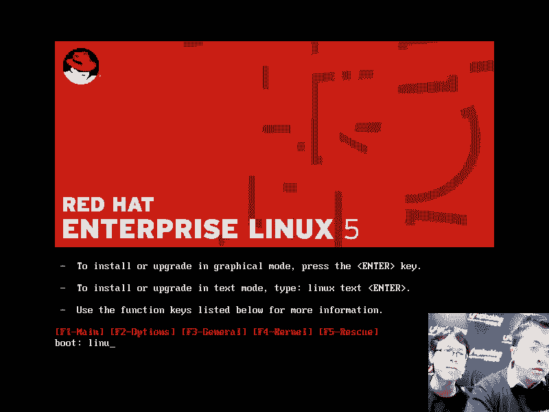

# 尚观Linux视频教程RHCE 精品课程 - P31：RH133-ULE115-0-2-RHEL-kickstart-无人职守安装 - 爱笑的程序狗 - BV1ax411o7VD

好，小明嗯，那个咱们的这个kickstar的话呢，刚才HEL4的那个KS点CFG文件，其实H15的KS点CFG文件和H16都是差不多的啊，那我们看一下HEL5的话呢。

这个kickstar的话呢该怎么样去启动一个界面，是吧？呃，我们如果要是看这个。

就是看这个任何的一个已经装好的一个lininux系统是吧？任何已经装好的一个lininux系统在它的就是ro特的目录下，如特的主目录像，然后呢你CD直接回车。

嗯那么都会有一个under杠KS点CFG的文件啊，对吧？Yeah。这个还是中文的话还是不太对劲啊，然后我先把它关掉好了，嗯，关掉，然后VI啊主目录下的点dash，我想用英文啊作为这个，因为刚才中文的话。

你看到那个字字体的话太太细啊。

他fi啊。在哪里设置的呢？哎你是在哪说的？我看啊。多了。嗯。他X嗯。我看一下是中文还是英文啊嗯。这个可能大家也经常常用还是中文啊还是中文。而中文的原因在哪里呢？VIETC下面的。X11。

X11当中的XNIT。X。Input。这个地方看看是不是。这是刚改的是吧？嗯。刚才就是改了一下这个，然后star X每次都启动成那个中文了，是吧？我现在在看star x，因为它字体的话呢。

我还要再去调调那个文本界面的字体。嗯嗯，我就想用英文就好了嗯。

然后呢，在这里面。如果要是VI呃就是CD直接回车回到自己的如特的主目路VI康da杠KS点CFG打开它以后，跟HEL4HEL5HL呃跟HL4也差不多。嗯，那HEL6的话呢。也没什么太大区别啊。

只是说的话呢，加密的时候，我们说这个地方的话呢，doller dollar之间变成6啊，好跟6了以后的话呢，你的这个MD5加密啊，应该不是H11呃，不是MD6的加密了。

我以为是H126的MD6加密还是RMD5的加密，只不过它的位数的话呢更长了。啊啊，那这个地方有点差别。其他地方的话呢，HEL6里面的话呢会有1个REPO的定义，就是给亚m的话呢在定义的地方哦。

定义定位的地方。那在我们的HEHEL5里面的话呢，就没有那么多嗯啊，当然不管怎么样，我们说自己去改这个文件，它是有风险的啊，这个文件首先是不能不能直接去用是吧？嗯，在HEL4里面也是一样。

那么你要把这个clean part part这几个地方，前面的注释取消掉啊，但是呢真正要改一些东西的时候，心里面还是没谱。嗯，那怎么办呢？system杠confi杠 kick star。

这个的话呢在HEL5里面也有HEL4里面也有HEL6里面也有。嗯，那HEL5的话呢，你就是打开这个文件啊，如果没有的话，那就呃我看一眼啊，没有的话呢，就装一下这个包。在我里提交。MNT的是R715是吧？

嗯，然后RPM杠IVH啊。System。杠咖啡噶。个kickstar啊，把它装上去。啊，这边要装。PY kickstar啊PY kickstar PY就是tysononen，然后呢再把这个包再装上去。

那手动解决依层关系啊。装完了以后啊，然后你再去执行什么呢？system杠 confi杠。那这个时候的话呢。啊，这个时候的话呢。

你可以看到这个整个的这个呃kickstar的这样的一个就跟安装一样的这样的一个一级级各种问题。嗯啊，只不过你这边设置完以后，你比方说设置很多选项，设置完了以后，最后把它保存成1个KS的文件啊啊。

我们看一下。时区还是一定要选择对对吧？嗯，时区还是一定要选。嗯。对吧嗯，然后密码。输入好。😔，然后呢，在安装完以后重启执行一个文本安装，对吧？

这就相当于在那个KS就是KS文件里面上面加了个textTEXT哦。然后接着安装的方法，那么有NFSFTP1样的是吧？那事先的话要设置好，19168点，比如3点95是吧？嗯，目录是洼下的。

PR的POB目录啊啊如果要是你还有后面的目录。如果HCE考试的话，一般就是这个目录啊那如果要是你自己平时的话，像我的话习惯就是再加上一个M号。

那么当然你要把光盘上所有的东西copy过去光盘上所有东西co。也就是说把光盘下的所有的文件和文件夹子文件夹里面的所有文件全部都copy到的PRPOB当中的HEL6。

那么也就是说要求218395这台机器啊，就变成了一个install tree的一个镜像服务器，就是所有的PM包都在里面，那如果是H15，那你就自己在那个H15的目录对吧？

那么把H15的光盘里面的所有的文件全部都copy到这里面去啊就相当于访问它访问这个目录就相当于访问光盘的根是一样的这个要记住这个东西的话，叫做stall tree。税安装术啊。

install tree安装数。执行一次全新的安装是吧？然后再看下面 loader，那我要装一个全新load，一般在IDC机房的机器，那么你全部都要设置什么呢？波loader密码啊啊设置好以后。

那比方说装到MBR里面那么参数是吧？以前说的那样，加上一个什么VG等于0X314，这个是测试用的啊，就是说我是测试这个内核参数有没有加上去啊，那这样的话呢就是800乘600的分辨率啊。

就是说你不不是starX。那么在就是命令行模式下就是800乘600的分辨率，那么0X315的话呢，就是好像是1024乘768啊。那这边的话呢就是添加一些，比方说。跟分区是吧，大小是。实际啊。

当然根据实际情况来了，然后呢再去添加一个什么呢？再去添加一个波特分区是吧？嗯，那么是。200兆。然再去添加一个。Spe。最大呃swipe的话呢是。2G啊。如果你还有其他需求，我们再去添加。嗯。

那还是一样，这里面的话呢还是不支持LVM。但是呢LVM还是可以用啊，你如果现在的机器是用LVM来安装的，你把LVM那几行复制下来，然后呢co在这里面来就OK了。就说你找一台用LVM来安装的这种机器。

把它那个康da杠KS点CFG里面记录下来的那个选项放到这里面来。那它也能支持LVM当然你保存完了以后，然后你自己再替换啊，那现在的话呢，你就只能去添加普通的分区和软锐的。

然后呢网络参数这个跟H16也很像，是不是嗯啊？Oh，Fable。那么这个。HCE考试的话，一般是什么呢？就是说SEinux词都是要打开的啊，那这个显就是X windowX window的话呢。

我就不配了。包的话呢都给他选定是吧？等我争取装的时候是，我要根据自己那个需求来选这个包是吧？对，然后呢这个postinst安装完之后，你比方说你要执行S，并且的缺卡这个。

杠杠呃缺config说NFS啊是吧？嗯呃S并下的缺config是吧？嗯，cos。off啊，对吧？然后呢还要加上还要打几个补丁啊，或者想去安装什么东西啊，就是需脚本就添加上去了。嗯，但是要注意什么呢？

输入完整路径啊，这个是安装之前的脚本啊，这是安装之后的脚本。啊，然后呢接下来的话我们这个fill这个地方点击下save file保存成一个呃KS点CFG的文件是吧？嗯，这边放在哪个目录下呢？

放在如此目录下吧。嗯。保存完了。保存完了以后退出是吧？然后现在的话呢，再去VEI如图目录下的KS点CFG你会发觉这个文件的话就是井井有条啊，是吧？井井有条的。嗯，对吧？对。

这边是NFS放式来安装啊啊等等。那看一下后面。安装这些包对吧？嗯，然后呢安装之后的话呢，post你看它跟HEL6的这个文件的区别在于它没有个百分号end哦啊没有百之end。那HER6的话呢。

H16的KS文件啊，这是H716。H716的话，这是。这样的是吧？对，有这个net manager的话就是2716啊。嗯那这里面的话呢，你看2716的这个文件。这边会有个end啊啊百分 end，然后呢。

你的这个post的话呢，也有个版分号and，这是它的区别，对吧？还有一个区别就在于刚才我说的啊，那个呃有一个ym的那个配置啊，ym那个安装员的配置啊，但是呢在那个图形界面里面，图形界面没有升级。

那有可能在HEL6。16。2里面可能有这个图形界面呢，就是sstem杠fi杠kickstar这个程序的升级啊，这个程序没有升级，它自然就不会生成那个选项。但是这个选项的话呢。

在啊con里面已经可以识别了。嗯，好吧，好的，就这个意思，HL6啊，刚才那是HL5，它们的主要的区别之一是吧？嗯，然后接下来的话呢。你这个文件你把它复制到一个指定的位置上去。

然后copy啊root下面的KSDSCFG然后copy到Y下的FTP当中去啊，假如说就copy到这个目录下了嗯。咦。啊，没章HB什么的。啊。

copyroot下面的KS点CFGcopy到外的FTP目录下去啊，对吧？然后呢，同时刚才我补是把。啊。我不是在这边创建这样的目录嘛？嗯对吧？呃，我不是把这个目录当成自己的安装区嘛，然后呢我再去把。

copy啊，那么我当前的话呢，比如说我把当前的R715的光盘，比如说DV下面的SR0哎。啊，CDro啊嗯CDromon在MNT目录下是吧？嗯，然后呢copy。啊，copyMNT下的星。

加上个杠R嗯啊靠背星，然后靠背到哪呢？挂下到FTPR的POB当中的HEL5。啊啊，就是把这个光盘下的所有的文件全部都co到这个目录线嗯。那么这个目录就跟我们的HEL5那个光盘里面的所有东西是一模一样的。

啊，那个这个目录就变成了一个install tree，就是安装数的目录啊，安装数的。对，然后我copy过去了以后啊，我假如copy过去了以后，因为我现在硬盘空间不够啊，嗯，那我就这样的。

mountt啊低下的C roommount在挖来记下的POB当中的HEL5，对吧？我冒了一下。我忘得到27。5。对吧嗯是完整的吗？按理说应该是copy啊对按按理说应该copy。

那我刚才的话呢应该是这样的一个步骤，我先创建一个目录嗯。然后再去copy啊我的光盘下的所有的文件和文件夹子文件夹啊copy杠号2嗯，copy到wa的FTP下的POB当中的RTR5这样的话呢。

这个inst tree就搞定了啊，同时的话呢我把KS点CFG这个文件copy到了什么呢？wa的FTP目录下去。嗯啊或者其他目录像也可以。嗯，这个时候的话呢。

你就要选择了你的这些inst tree是怎么给人家共享出去，是用OFS方式共享，还是FTP方式共享。那我这边的话呢用NFS方式来共享一下。那我就这样做啊，那NFS的话呢比较简单，对吧？VI。

ETC下的X破了。啊，非常简单，这是NF的配置文件。嗯，回车打开它以后啊Y下的FTP嗯，然后呢共享给谁呢？共享给。192168点。3。0。这个网段啊，然后呢以。RO的方式去共享。SNC啊啊共享出去。嗯。

对吧？这样就共享了是吧？共享了呀。😊，共享出去了以后啊，这个目录共享出去了以后，然后输入一个什么呢？service NFS。Start。啊，供享出去了吧。这样的话我的这个服务器就搞定了啊。

那在服务器上这个KS点CFG的文件，我是通过stem杠config杠kickstar，然后把它生成的。是吧嗯然后呢copy过去了以后KS点CFG这个文件就可以作为一个应答文件，就按照con的应答文件。

然后呢，现在我在另外一端啊。嗯，另外一段，然后的话呢来就是使用这个文件来执行无人之手安装。啊，我先准备一下啊嗯。啊，还有一个的话呢，就是这个IP地址的话呢，刚才我好像指定的是错的啊。啊。IF咖是吧。

因为每一个版本R716出来以后，你们发觉R715还是蛮简单的。R7115出来的时候，R7你觉得R7114好，总之一个版本比一个版本复杂，特别烦啊，你看3。244是吧嗯。😊，RF杠fi的啊。

然后呢ETH0那找要了8点。3点96吧啊，然后我这样的输入一个。n卖n卡这个没有是吧？原来是net咖费的，那现在就是stem。啊。

直接改文件吧VIETC下载s copy当中的呃nightwork杠scripts是吧？RFRF。CFGEGH嗯嗯。我把它改成90。96。这样的话呢geta咱可低是吧？好，改完了。然后呢。

现在他的IP地址也是96是吧？嗯，然后呢，我再去改一下刚才那个文件啊，那个文件是Y下的FTP下的KS点CFG是吧？嗯，这里面他到哪去找镜像呢？他找95。哦，对吧我们说打6啊。对吧然后呢。

现在我再找另外一台机器啊，这个刚才这个步骤的话就相当于没有变是吧？嗯，现在我再找另外一台机器。嗯，这台机器的话呢，我把光盘的话呢，用HEL。HEL5的光盘啊嗯。嗯。

啊。这暂停的啊，嗯然后把这个废虚拟机废掉是吧嗯。

嗯。现在我要用R7R5的光盘，这个做镜像了吧。嗯，对。啊，按照4noS嘛那。啊，下面那个这个啊。这2725U4啊对4是吧？O。然后呢去运行一下嗯。

你是摁哪个键，然后进入这个F2啊啊，开机的时候摁那个F2。对它就跟普通的一台计算机是一样的，是吧？当然普通计算机的话有很多的话是按delete啊。你看他的提示嗯。

啊，进这个VNV尔的这个不要的话呢，这个是R715啊，它就不像H16那样要摁两下ESC，然后再出现一个不提示服，它直接下面它就让你输入了。嗯，你输入linux。KS你要加KS就懂那个安装程序就知道了哦。

原来我是要进行kickstar安装啊，无人指手安装，那KS文件放在哪儿呢？放在NFS服务器上。NFS服务器的191的8。6呃点3。96这机器96台机器的什么呢？wa到FTP目录线。

然后呢有个KS点CFG的文件啊，这样的话呢，你一回车啊，你看一下嗯。

我们的这个光盘它是一个启动的介指，嗯，这个启动介指里面首先要有个bo loader啊，然后还有bo loader要抓载 kernelel。

抓这个 kernelel kernelel的话呢会启动一个loader，像刚才那个conda之类的这样的一个安装程序。呃，一般的话呢哟。

老是找不到呢。

我看一下啊，这边看一下。哎呀，我看一下，我用H116这台机器啊，嗯mount191的8。

3点96嗯。下来TPR的POB当中的HEL5是吧？嗯，HL5梦子的MN team目录像。啊，难怪啊。难怪。因为我不是一个普通的目录。看一下这样行不行。那这样是没有问题的。

嗯啊其实就是说刚才遇到的两次的问题都是来来源于什么呢？就是我是把一个光盘mo似在这个目录下，嗯，然后我去就是我在服务器端啊，就是我刚才的话呢配置这台机器的时候，不是配置个服务器吗？对，不是做了这些操作。

按理说应该是copy过来的。嗯，但是因为我硬盘空间不够啊，所以我就把这个光盘mo似在这个目录下啊，光盘mo似在这个目录下了以后。我把它用NFS给它共享出去。嗯，那这个时候的话呢客户端想去mount我嗯。

mount这个服务器，就是另外一台机器想mount这台服务器的什么呢？这个目录嗯，结果就遭到拒绝，为什么呢？你看一下吗？我直接冒他这个目录，就被拒绝了。对，但其实如果这个目录是一个普通文件夹的话。

它就可以啊。所以现在啊你看这边的话呢，它实际上应该是已经是可以的，是可以的是吧？只不过是因为我偷工减料，没有把那个光盘下载那个目录复制过去。因为我硬盘空间不够，嗯，我就直接把光盘骂了过去。

所以你这时候用FTP应该是可以的啊。

明白吧？因为NF它是另外一种文件系统FTP只是一个服务而已，清楚吧？那你看他不上去。那我刚才用另外一台就是第三台机器，这是一台R715的服务器，这是一台什么R715的客户端是吧？

就没有装操作系统的用R715光盘启动的客户端啊，那我现在用第三台机器，一台R716去加载的时候也遭到了拒绝啊，而加载它的上一级是没有问题的。上一级是一个普通目录，而这一集的话呢是一个加载点。

所以这样的话也被拒绝了，所以问题原来出现在这里哦，对吧？那如果要说我是直接真正话呢那样去copy过去的，就刚才这样copy过去的，应该就没有问题，就没有问题了，所以的话呢现在我们还是改策略了。

用什么用TP是吧TP好了，是吧？所以这边的话呢我先把它停掉，然后呢我在R715这边然后呢我重新啊再去输入一个什么呢？😊。

System。杠fi杠嗯杠kickstar啊啊27。5G的。然后呢，我在这个地方我输入一个什么呢？load。As he。open file啊open file的话呢，我去找到文件系统的哇下的。

FTP当中的KS点CFG啊啊openopen过来以后，我就可以对它进行刚才的这种再次的更改。那么安装的方法的话，我用FTP方式嗯用的191的8。3。96是吧，96。那么这边用的目录是。嗯。

POB下的HEL5。啊，你P不P写前面用写杠没有？呃，反正我刚才也在想写不写，实际上都无所谓啊，因为的话呢你在浏览器里面，如果要是有两杠的话，它会当成一杠啊啊，也就是说你写了以后的话。

它就相当于呃如果要是他给你自动加一杠的话，就是多一杠，但是。反正没有写的话也是可以的。嗯，没有写可以。保险起见你说的非常对，就是还是应该写上去啊。那我在这边的话呢，再去点点击什么呢？save file。

嗯，就是我有一个问题，是不是我拿那个。就是s system configurefi k star就是这个软件的时候，是不是必须把样务源先配好？嗯啊。呃，对，那个我这台机器的话呢是已经是配好的啊。

就是你刚才看啊。那这边是已经配好了啊。我的光盘被冒出在MNT目录像了嗯。就说你要没配好的话。😡，你再去执行那个stem杠fi杠 kick star的时候，他拿不到那些包的名字啊，他通过压的话呢。

去找到那些group installstore那个安装那个包的名字是吧？对啊，你像我先这样保存一下啊，嗯，我这边设置完了是吧？嗯，我这边点击s。保存了是吧？嗯保存完了，那我再重新输入一下，你再看一下。

输入ssstem杠fi杠Kstar啊，直接回车，你看一下。你看就刚才那个一闪而过的那个界面。那如果要是你没有去配置好的话，这些东西就不会出来啊，就没有这些东西。嗯，啊你说的观察很仔细啊，确实是这样。

如果要是把那个刚才这个文件，就是我这个ym的这个按照ym的这个文件的话呢，没有配置过，没配过的话，那它就不会出现那个包的名字哦。啊，现在的话呢我就把那个安装的方式又改了，对吧？然后呢。

现在我要把VSFTPD启动起来啊，那么比方说我这样的RPM杠IVHVSFPD这就是我们的就是FP服务器是吧？servPVSFTPDstar啊，我把VSFPD启动起来嗯，我把NFS的话呢。

stop其实像刚才这样的操作NFS仍然是可以可以操作的啊，只不过是因为我没有执行这一步，我是直接冒上去的。嗯，那现在的话呢我就用FTP来操作，我把NFS的话呢，就给它关掉了那FTP有什么好处呢？

你在互联网络上也可以进行。就是比方说你们上海有个同时你在北京的话呢给它搭了一个源kstar文件也放kickstar文件的话呢，必须得要命名能访问到其他的这种方式就是安装源的话呢可。你要身份认证啊，嗯。

那么你在北京给他搭这个圆，那他可以在互联网络上来从你的这个北京的服务器上安装的上海的服务器，安装一个上海的服务器，从你这边获得所有的RPM包啊啊，那这边我把VSIGPD的话呢，启动起来。嗯。

我可以测试一下啊啊，我可测试一下，我打开这个就是说这个浏览器啊，就是这个fi这现在还是某Z了啊。我可以这样的LFTP1918点3。96啊，回车LS啊，有KS点CFG文件啊，还有个POB嘛，嗯，对吧？

PIT退出。那现在的话呢，我通过这台机器啊，这个机器。现在假如说让他话呢用无人之手的无人指安装来做。

啊，KS哎linuxKS等于。

FTP冒号2杠192168点。3点96杠KS点CFG。啊，是吧因为我是KS点CFG，我是放在wa的FTP目录下嗯。那么FTP和HTTP它都是虚拟路径。

而NFS一定是实际的路径就你用OFS服务是把wa的FTP目录共享出去的。当你加载的时候，还是要输入什么mount19168。3。95冒号Y下载FTP下的POB当中的什么什么文件啊。

但是呢我们说FTP的话呢，不用FTP端只要输入它的虚拟路径就好那FTP默认的路径是wa的FTP目录。嗯，那KS文件在wa的FTP的KS点C。嗯，你这个明白了吗？嗯，还我明白是啊，有点晕。🤧系。这是。

实际的路径啊都是放在外西的FTP目录下。嗯，对吧？对，那我当我用serviceVSFTPD。了以后啊，那么启动完了以后，那我的FTP服务就启动起来了。对别人的话呢访问我这个FTP服务的时候。嗯。

根目录是在哪？根目录就是在。这个目录下对就是在这个目录下啊，也就是说你可能不可能到Y目录下去呢，不可能不可能可能可能不可能到根下面呢，也不可能啊，而NFS的话呢不一样。NFS的话呢。

我是VIETC下的X或。啊，嗯，那么在这里面我是把外界的FTP目录共享给谁是谁了，对吧？但是呢你再去加载的时候，比方说客户端加载的时候，要加载1118。3。96冒号。

下的FTP的屏蔽啊那你必须得把这个前面的目录也输入对。这个整个的目录你一点都不能省啊，而如果要是你去访问啊，比方说忘在呃MNT目录下啊，嗯，如果你要是通过FTP去访问的话。

那FTP冒号2杠同样是访问这个POB目录，你是192168。3。96杠PUB啊。呃，尽管他们都是以外的FTP目录作为自己的这个就是共享目录的。嗯，他们他们有一个区别，一个是虚拟路径。

另外一个就是必须是完整的路径。啊，明白了明白了啊，嗯所以访问的时候的话呢，不要访问不到。嗯啊现在的话呢再看这边那我这样输入完，你能理解了，嗯，对吧K为什么这边输入的是KS点CFG啊。

然后呢直接回车看一眼嗯。

这个loader啊看这个loader，最后这个loader runningning这个loader，这个的话就是安装程序。

哦，这就是安装程序，它会去启动at count啊。他就是那个bo loader吗？不是loader的话呢，是but loader是刚才那个红色的界面啊，让你输入linux kS等于什么什么的？

那是but load boot loader boot loader会加载 kernel嗯， kernel启动完以后加载完根分区以后，它会去运行loaderloader的话呢，根据你选择的安装程序。

安装方式或者说升级方式不同，那么它会去进行不同的这种就是说这个安装过程。那么如果你进行安装的话，就是按con，它就再去运行under嗯哎呀。

，这个是咱们刚才没有输入这个序列号啊，就是如果要是你在那个KS点CFG里面，你去添加一个什么呢？跳过序列号的输入啊，它的话呢就不要你去再去做一遍了。嗯，明白吧？这边的话呢。

就是说咱们刚才那个跳过序列号这个输入的话，没有去输没有选是吧啊，OK那他应该是。

如果要是选的话，那就不用你去再去做了。啊，没有这种。没有足够的空间，可能是没有clean part，没有删除掉所有的分区啊。这边的话我们还是要。

我再看一眼。We are。System。靠唔靠飞噶。Com kick star。你看你该remo删除掉所有已经存在的分区嗯，清除掉分区表。嗯。序列号的选择在呢？这从网上还必须得弄个序列号。

R16刚才就没有问题啊，没有这个问题。从网上的话呢搜一个序列号去。然后呢，把它弄一下嗯。要要搜个序列号，嗯，我看搜个序列号。啊，搜一个序列号，我看啊这边的话是没有跳过序列号的选项是吧？嗯，然后呢。

但是我这样我先我刚才把那个删就是删除掉所有的分区，我那个。一个错误先修正一下，嗯，然后呢我再去呦。哦。我看一下啊，嗯来看一下VI。如此目录下的under康杠KS点CFG。啊，这样啊。嗯，就直接的话呢。

复制一下，copy一下是吧？嗯，然后呢我们直接去毕业。这是under杠KS点CFG。因为这台机器的话呢，在安装的时候，序列号就是被跳过的。呃，那么我就把这个under杠KS点CFG的这块copy过来。

尽管那个sstem杠杠Q star不提供嗯，我们把它。我加上去是吧。然后呢。这样吧。ピチ？好关是是。其实号码都一样嗯。就是T杠杠杠t是嗯。

把他并退出。然后这个服器还是不变。嗯，那在这边的话呢，在重击下是吧，重击下。

但是这些都是值得的，因为你是劳动一次啊。以后就装的情况是就方便是吧？对。90元。还是那个过程。我们接下来的话呢，再看一下他的那个无人制安装能不能进行嗯。

他会去用哎，我加了text了吗？嗯加了哈嗯。这是running under，你看那是loader先运行，再去运行undercon。对那conda的话就是你看啊哦，直接正常了，就现在就再开始安装。对啊。

这边就开始安装了啊，先解决一层关系，然后再安装。嗯，其实接下来的话呢就是你自己去定制了啊，好吧，嗯好的。

