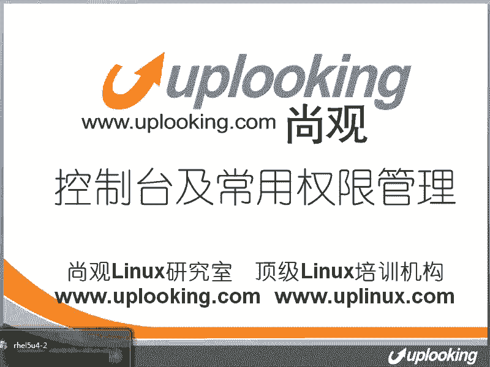
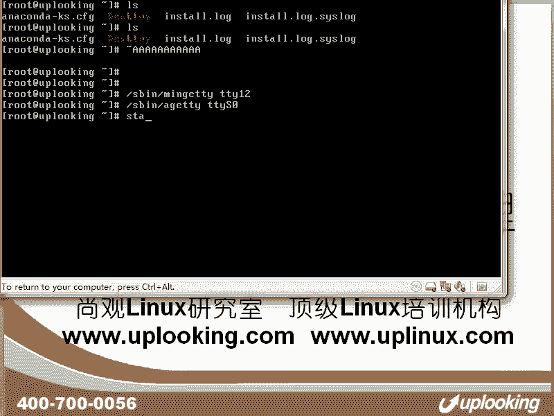
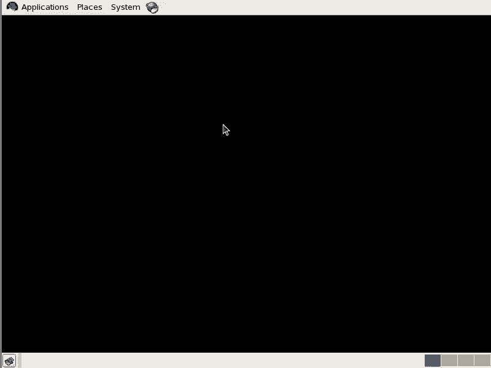
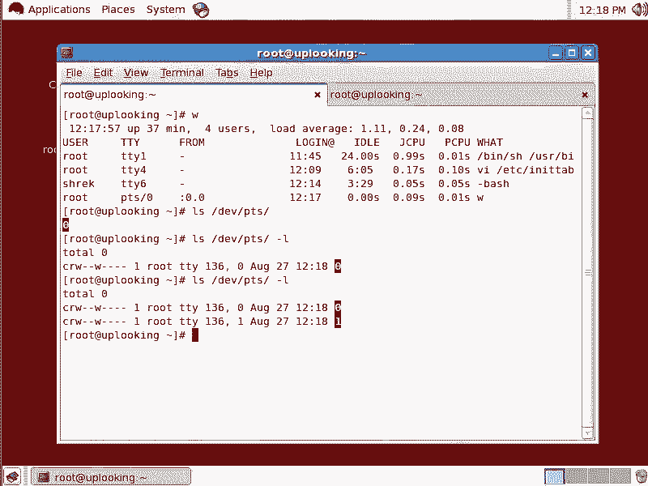

# 尚观Linux视频教程RHCE 精品课程 - P32：RH133-ULE115-1-1-tty-ttyS0-pts-terminal - 爱笑的程序狗 - BV1ax411o7VD

我们来开始lininux的控制台和常常见的这个权限管理的这一章。那这张里面的内容主要是把原来啊我们所不习惯的管理控制台或者文本的这种操作方式给大家解释一下。同时告诉大家哦，这个东西它为什么要这样来？

那你知道他为什么的话，肯定是要用，是不是这样的话呢，大家就能在lininux里面的这种操作方式啊，你就可以有很多的这种呃深入的理解啊，我们来看一眼，那肯定很多人的话都是这样的，现在这样的控制台，对不对？

啊，然后呢outt接加F2F3这样的情换控制台，那我们在这里面的话，比方说输入。

啊，用户名和密码登录进来，那这是我们常见的一种操作，这是另外空白，这是outt加F4，就是第四个空白。这个时候的话呢，我去。输入1个W是不是我能看到我在TTY1和TTY4上都登录了，对不对？

这种方式的话呢，它可以说是我们在inux linux里面最常用的方式，甚至有很多网络的存储，还有什么呢？路由器也是一种方式，对吧？但是呢可惜的是，大家现在都习惯所使用的是图形界面啊。

它并不是在这个里面标配的东西。那个东西的话呢，是在我们文本控制台出现了20年之后啊，它才出现的。所以大家要知道这个东西反而是什么正宗。反而是正宗OK我们现在看一下，那这种控制台到底有什么渊源呢？

大家会发现啊，它用到的设备文件。比方说我们icical啊一串值输出到什么呢？DV下的TTY1是不是这串值跑到哪去了？我摁一下alt加F1是吧？就是第一个控制台，对不对？那我再回来啊。

那我再e这串值的话呢，到TTY4TTY4就是我自己的这个控制台对不对？一回车哎，我自己就收到了。其实我们现在看到的这个控制台，实际上啊说的官方一点，就是说给它归纳一下，它叫做什么呢？它叫做虚拟控制台啊。

叫TTY虚拟控制台，那么实际上的话呢还有什么呢？DEV下的TTYS啊零，这是我们的com零这样的一个什么串行口的控制台。😊，那么本来的话呢，我们的大型机啊大型机它的操作的话应该是怎么样？

应该是用一个文本啊，就是应该是用一个终端去连接，直接连接。那么这种控制台的话呢，就叫做什么真正的控制台。所以它呢串行控制台虚拟控制台。咱们现在已经经经过三种啊，我们如果要是在之后的话呢。

给大家讲lininux系统结构的时候，我们知道有一个程序，这个程序叫做啊INIT是吧？我们给大家介绍过，我们说PST啊，我们说所有进程的母进程是谁啊？

所有进程的这个母进程叫做INIT是不是INIT在启动的时候，它的配置文件是哪个呢？是ETC下的IITTAB对吧？IIT table它就是什么S并下的。IIT的配置文件是吧？那我现在打开它的配置文件。

对吧打开它以后，我们看一下它是怎么处理控台的。我们现在的话呢往下翻啊，这个文件的话往下翻翻到这个地方的话，你会发现在运行级别为2345的时候，也就是只要运行级别为2为3为4为5啊，为2345的时候。

它就是以respond的方式，respond方式的话，就是反复打开一个紫禁程。也就是说有一个程序啊，它要打开一个紫禁程。比方说呃。有一个程序，他要打开紫禁程。那这种方式呢就有点像什么？

有点像有一个监工啊，监工就是IITIIT的话呢，他要打开下面的紫禁城。比方说这个监工的话呢，是说一大队是人在给他修那个马路是吧？说哎看一个紫禁城。这个紫禁城的话，是其中的一个什么一个工人啊。

那他去看一下这个紫禁城的话有没有累趴下啊，一看呢他累趴下了，他再稀里呼出把它弄醒给我继续干给我继续干那他一会儿又趴下了不行，给我继续干，也就是说这个程序的话呢，始终是处于运行状态。

那我们的IIT他的话呢会看他的紫禁程一看是以respon方式去运行的，那他总是要让他的禁程运行起来啊，这个respon方式，那他运行的叫做什么呢？

S下的什么 getTY啊 getTYMIGETTY这个程序的话呢就是打开一个控台。打开一个虚拟控制台，这个虚拟控制台用到的设备文件就是DV下的什么TTY1啊TTY1这个的话就是它的这个由来啊。

也就是说之所以你有6个控制台可以用是吧？你看我按alt加F6啊，这是第六个控制台，那么我登录一下，方说用户来登录输入账号，然后输入一个W，那你会发觉我登录在TTY6上，为什么会有6个控制台呢？

就是因为我们在这个IIT table里面，这个地方什么打开了TTY6，对不对？你如果想打开TTY那太简单了。你看我现在把这段复制一下，然后呢，在什么在比方说以root商身份它去运行啊。

我以ro此身份去运行，这个时候我运行的是什么TTY12啊，我在执行这个命令之前啊，我按alt加F12，大家看一下。我在摁啊，没有任何反应。为什么没有任何反应呢？因为你现在按alt加F12的话。

那个控制台并没有打开。也就alt加F12给我们内核下命令以后，我们内核说哎内个虚拟控制台并没有人使用，我根本就没有为它使用什么呢？初始化任何的资源，对不对？现在我这样的回车。

我们说minTYTTY12这样一回车啊，我再按alt加F12。哎，你看这边的话是有反应。你在这边的话呢，回车啊，它是有反应的，只不过不能去接受你的更多的命令啊，所以这个时候内核已经把TTY这个驱动啊。

告诉TTY驱动说什么TTY12啊，已经要用了，所以分配了资源，它也可以开始在这边响应你的什么输入然后呢有结果的话呢会给你输出出来，所以的话呢，这就是我们打开6个控制台的原因啊，之所以你能打开6个控制台。

就是因为在什么这个地方有这六行啊，那么我们现在的话呢知道了用的是什么呢？啊MINGETTY那么当然了SB目录下还会有什么AGETTY啊，这个时候的话呢，它跟的就是什么？

跟的就是TTYS0或者S1这个串口，也就是说有很多呃前段时间我拿一个开发版啊，很多同学的话说哎，这个怎么有那么多串口是吧？它有的时候用的是串口进行什么进行控制。你比方说我们的路由器。

后cisco路由器是吧？你就是呃tenet到它的什么串口上去，那个时候它打开的这个终端是通过串口来进行连接，你需要配置的是什么串口的波特率，实际上就是说你就相当于网卡的什么速度配置好匹配好了以后。

那么你能针对它的串口输出一个东西，它的话呢有回应以后给你输出到你的什么超级终端上啊，这就是所谓的什么第二种控制台了。那当然了，大型机里面还会直接加什么呢？那种终端专门的终端。不是专门的这种终端的话呢。

那它就是呃肯定咱们现在的话呢很少去用。那么你如果要是到机房里面，较老的机房里面，你还可以看到什么呢？有那种小推车。小推车的话呢有一个。显示器，然后有键盘啊，这个时候的话呢。

他把这个终端插到这个小型机后面去，就可以对这个小型机进行配置了。那就是专门的终端啊，所以的话你这三种终端。那还有没有？大家想一下还有没有你看一下，我现在这样的start X对吧？star X以后。

我们看一下啊。3X以后，我们是不是打开了一个图形界面，对不对？

啊，那这个图形界面的话，我们进去看一眼。

现在我在这里面打开一个终端，是不是打开这个终端的时候，我再摁一下W，你会发觉有个叫做PTS杠0的东西，是不是PTS杠0PTS杠0的话呢，它实际上就是虚拟出来的图形的这种终端。这种终端的话呢。

它实际上是什么？实际上是叫做伪终端啊，PTS这个目录啊，你给大家看一下，比方说我们这样的LSDV下的PTS啊，在这里面的话呢，如果你有一个地方登录，它就会有多一个设备文件。

这个设备文件的话实际上也是一个自符性设备文件。但是呢它是有什么？它是由我们的有有一个驱动啊，就PTS的这个驱动动态生成。也就是现在你看我现在有一个是吧。

我con呃呃contl shift加T再打开一个终端，这第二个终端了。你看刚才那个终端在这儿是吧，这是第二个终端。那么现在我再去输入什么LSPTS呃杠L啊，第一个下子PTS杠L再看一下。

那现在是不是两个。

啊又多了一个文件，那么相肯定了你按W那刚才打开的那个叫PTS杠1，是不是？第一个是PTS杠0这个第一个尾终端叫PTS杠0。第二个尾终端是PTS杠1，它就是由另外一种驱动，它既不是串口的驱动。

也就是不是TTYS零的驱动，也不是TTY的驱动，而是由什么呢？PTS的驱动来做的。我们可以看一下啊，输入一个什么mount命令，你可以看到mount命令这边有个叫做DVPTS是吧？

mount在D片的PTS这里面去，每当你创建一个虚拟终端的时候，那它就在这里面就会多一个什么设备文件出来自动多出来的。这是什么呢？呃远程的或者是图形界面下连接你的时候用到的什么伪终端这种终端的话呢。

其实不是照着终端去写，它是完全什么虚拟出来的。它跟那个TTY类似啊，跟TTY类似，但是呢它是由另外的一套程序搞搞的。你看白了吧？就是搞出来的那就是DVPTS这个驱动啊，所以的话呢大家呃就是说仔细想一想。

哦，一开始的话我拿一个设备直接插上去，这叫做终端，对吧？后来的话呢我们可以用串口用一台机器的tnet或者用串口的这个专门的串口终端，插到这个机器的串口上去。

用到的是TTYS0或者TTY呃S1这样的串口设备作为我们的终端。那它的话呢用到的是什么AGETTY是吧？那么后来的话呢，我们在这个本机上登录的时候，逐渐的话呢，这些大型机小型化了以后。

或者变成PC了以后，或者变成S86的服务器了以后，我们的话呢需要非常方便的去进行登录。那这个时候我们就用到什么呃TTY这种虚拟终端啊，所以的话呢这是什么呃终端啊串口终端虚拟终端的由览。

后来的话呢我们又需要图形界面需要远程登录。这个时候用到的什么呢？PTS这种伪终端啊这。就是几种终端的由来啊，我们SSH一下你看看一下，比如SSH啊，我在另外一台机器上吧，我在另外一台机器上。

我看一下这台机器的IP地址IP地址是0。231啊，我在另外一台机器。这台机器的话呢是这台机器是另外一台虚拟机啊，我这边的话呢访问啊F那这边是uplook to啊，look to那这台机器的话呢。

它的IP是232啊，SSH19218。0。231。那么我从远程的话呢连接它输入它的密码进去了以后啊，那么我在另外一台机器上，我在刚才那台机器上，刚才那台机器上再输入个W。

你会发觉又多了一个什么PTSR是不是PTS2这就是什么呢？多了一个为终端是从0。232来的。也就是你想看有人有没有连接你对不对？有没有人连接你，那你就可以看到啊有人。它是从0。232来的啊。

所以这个时候的话呢，有很多同学问我，哎，我怎么样把它踢掉，我怎么我怎么样把它就是不让他连接我，或者说他现在连接我，我想怎么样让他走一边去啊，这时候怎么办呢？你可以用什么SQ啊，杠9-9啊，非需这个程序。

你只有用杠9才能杀掉。不好意思啊。打冒。PTS杠2这样的话呢，杀掉这个控制栏下的所有的程序，包括什么呢？子禁程啊，这个程序和它的下面的子禁程。因为进程的话呢，它有所属的终端啊，它有所属的终端。

我们现在把这个进程就是所属终端为什么PTS杠2下的所有进程全部都Q掉，你这样一Q掉。然后呢，我现在啊移到另外一台机器，一到那个uplook2上去，你看一下啊，是uplook2，对不对？uplook2。

现在的话你看它已经被231所终止了，对吧？这就是我们的什么，这就是我们的刚才的这个。呃，伪终端的这个操作过程啊，OK我不知道大家有没有明白，如果没有明白的话呢，再仔细思考一下，其实的话就是操作方式。

其实它给我们提供的都是一个文本的操作方式。这个文本的操作方式，它所用到的驱动程序，也就是说我们键盘输入一个命令，然后呢，他给我个回应，这个这个过程的驱动是由谁来完成的呢，有几样东西，比方终端啊。

虚拟终端伪终端这些方式，这些驱动的话给我们完成的啊，这就是我们需要了解的东西。好，我们看一下。这就是有关终端的东西了啊。

