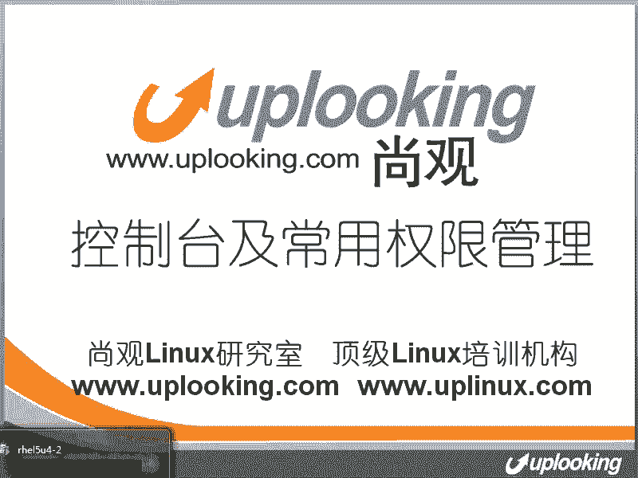
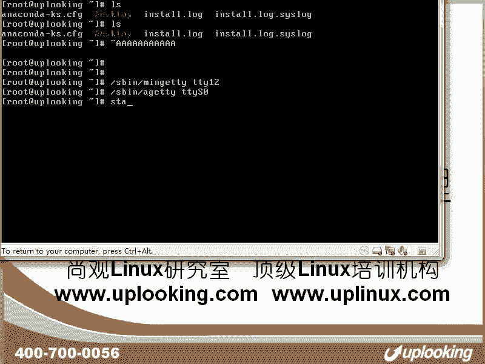
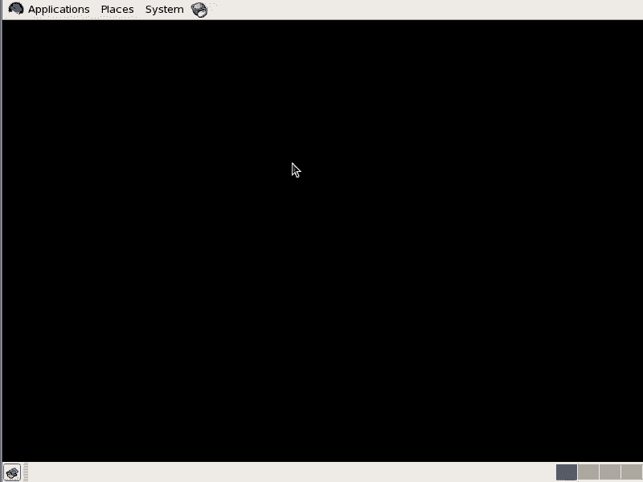
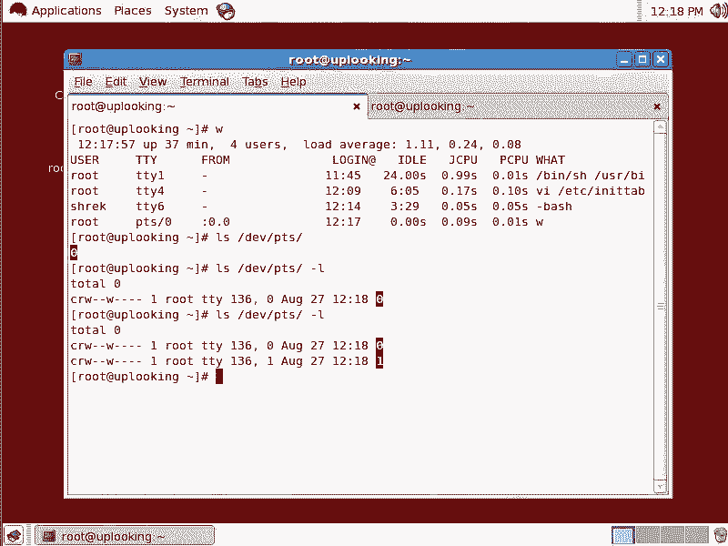

# Linux终端管理：P32：终端类型与设备文件详解 🖥️



在本节课中，我们将学习Linux系统中不同类型的终端（控制台），包括它们的设备文件、工作原理以及历史渊源。理解这些概念有助于你深入掌握Linux的文本操作方式。

## 虚拟控制台（TTY）

上一节我们介绍了课程概述，本节中我们来看看最常见的终端类型——虚拟控制台。

在Linux系统中，按下 `Alt + F1` 到 `Alt + F6` 切换的文本界面就是虚拟控制台。它们对应的设备文件是 `/dev/tty1` 到 `/dev/tty6`。

例如，向 `/dev/tty1` 发送信息，该信息会显示在第一个虚拟控制台上：
```bash
echo "Hello" > /dev/tty1
```
虚拟控制台是Linux系统“正宗”的文本操作界面，其历史比图形界面更久远。

## 虚拟控制台的由来

了解了虚拟控制台是什么之后，我们来看看系统是如何创建和管理它们的。

系统启动时，由 `init` 进程（所有进程的父进程）根据其配置文件 `/etc/inittab` 来初始化虚拟控制台。

在运行级别2、3、4、5下，`init` 会以 `respawn` 方式运行 `/sbin/mingetty` 程序。`respawn` 意味着如果该进程结束，`init` 会立即重新启动它，确保控制台始终可用。

以下是 `/etc/inittab` 中典型的配置行，它负责打开6个虚拟控制台：
```
1:2345:respawn:/sbin/mingetty tty1
2:2345:respawn:/sbin/mingetty tty2
3:2345:respawn:/sbin/mingetty tty3
4:2345:respawn:/sbin/mingetty tty4
5:2345:respawn:/sbin/mingetty tty5
6:2345:respawn:/sbin/mingetty tty6
```
你可以手动为第12个控制台启动 `mingetty`：
```bash
/sbin/mingetty tty12
```
执行后，按下 `Alt + F12` 即可切换到该控制台。

## 串行控制台（TTYS）

除了本机的虚拟控制台，Linux还支持通过串口连接的终端，这在服务器、路由器或嵌入式开发板中很常见。

串行控制台对应的设备文件是 `/dev/ttyS0`、`/dev/ttyS1` 等。系统使用 `/sbin/agetty` 程序来管理串口终端，你需要配置正确的波特率等参数才能连接。

## 伪终端（PTS）



随着图形界面和远程登录的普及，出现了另一种终端——伪终端。




当你在图形界面（如GNOME或KDE）中打开一个终端模拟器，或通过SSH远程登录系统时，使用的就是伪终端。它们对应的设备文件位于 `/dev/pts/` 目录下。

例如，打开第一个图形终端会创建 `/dev/pts/0`，打开第二个会创建 `/dev/pts/1`，以此类推。你可以使用 `ls /dev/pts` 命令查看当前活动的伪终端。



伪终端由一套独立的驱动（`devpts` 文件系统）动态管理，它与TTY类似，但完全虚拟化，专为图形界面和网络连接设计。

## 终端类型总结

现在我们已经了解了三种主要的终端类型，以下是它们的核心对比：

*   **物理终端**：早期大型机直接连接的专用终端设备，现已少见。
*   **串行控制台**：通过串口（COM）连接的终端，设备文件为 `/dev/ttyS*`，由 `agetty` 管理。
*   **虚拟控制台**：本机文本控制台，设备文件为 `/dev/tty*`，由 `mingetty` 管理，通过 `Alt + Fn` 切换。
*   **伪终端**：为图形界面或网络连接（如SSH）虚拟化的终端，设备文件为 `/dev/pts/*`，由 `devpts` 驱动管理。

## 查看与管理登录会话

理解了终端类型，我们就可以查看和管理系统上的登录会话了。

使用 `w` 或 `who` 命令可以查看当前所有登录的用户及其使用的终端。
```bash
w
```
输出会显示用户从哪个终端（如 `tty2` 或 `pts/0`）登录，以及来源IP地址（对于SSH连接）。

如果你想终止某个远程登录会话（例如来自 `pts/2` 的SSH连接），可以使用 `pkill` 命令杀死该终端下的所有进程：
```bash
pkill -9 -t pts/2
```
参数 `-9` 表示强制终止，`-t pts/2` 指定了终端。

## 总结


本节课中我们一起学习了Linux系统中终端的核心知识。我们了解了**虚拟控制台（TTY）**、**串行控制台（TTYS）** 和**伪终端（PTS）** 这三种终端类型的设备文件、管理程序及其应用场景。终端本质上为用户提供了文本操作界面，而不同的驱动程序和设备文件实现了本地、串口和网络等多种接入方式。掌握这些概念，能帮助你更好地理解Linux的系统结构和管理多用户登录会话。