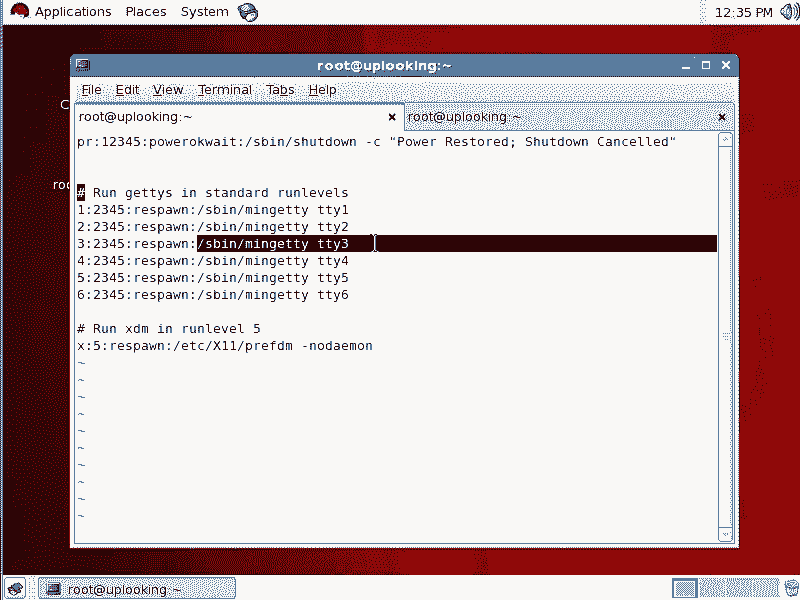
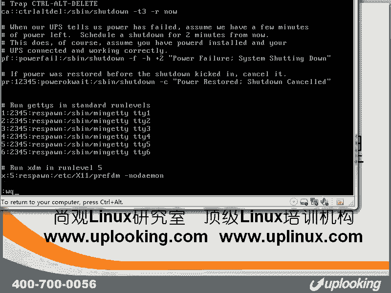

# 尚观Linux视频教程RHCE 精品课程 - P33：RH133-ULE115-1-2autologin-respawn - 爱笑的程序狗 - BV1ax411o7VD

好，我们来看一下的话呢，就是控制台的另外的一些用法啊另外一些用法。也就说控台的话呢，我们都知道它就是这样的一个样子啊，一个文本前面是提示符是不是？那么你如果要是想定制前面的提示符，我给大家再说一下。

原来不是说过一个叫做PSPSE这样一个变量嘛，对吧？那这里面的这些变量的这些意义啊，就杠U是什么杠H什么杠W什么，我们都原来给大家介绍过，那你怎么去查，对吧？怎么去查啊。

如果还有一些其他比方说想显示时间该怎么办？那你可以怎么样man啊。

查这里面的什么，比方说杠U的作用是不是杠U作用，你这样的一查杠U，那它没有出来真正的东西。你这样的杠杠U把前面那个杠的特殊意义脱去，是不是？这样的话呢告诉你哦，杠U是用户名是吧？

当前的用户名杠T的话呢是时间，对不对？杠W是当前的路径，对吧？这是我们常见的一些呃定制当前的这个ba shell的一些东西，对吧？那么为什么我们系统在启动的时候啊，它会去给你打开6个空台？

这个原来我们跟大家说过VIETC下面的IRTTAB对不对？IIRTTAB这个时候我们看在下面的话呢，也就是说在运行级别为2345的时候，它会帮你打6个空这6个空的话呢，TTYT2T3TTY6。

你如果要是想把它定制的话，没有问题，随便的话，你删几个啊，你说我就打开第一个和第二空台，我觉得我要省内存，它其实的话也占用不了多少内存。那这个过程的话呢，呃定制完以后，只要重启以后它就会生效。

这个我们给大家讲过就respon的方式的话呢，表示它这个母进程会监视后面的子禁程是否成功执行。如果要是它正在运行。也就是说没有呃也就是没有任何人干扰，它就在那边运行，一直干着活，它什么都不管。

但是每当它什么累的趴下的时候，或者说被别人Q掉的时候，那这时候母禁程就会把它怎么样再去。拿起来，然后再去运行。所以的话IIT它就会监视这6个空难。那么这这就是我们看一下啊，我嗯。

我现在切换到第一空台下去，我呃切换切换到第二空台下去。那现在的话我输入个root是吧？用户名呃，再输入一下密码。现在我在TTY2上登录，是不是？那么我现在来TTY4上，我到TTY4上去了以后，然后呢。

我输入一个什么输入一个说啊SQ，我想把什么？我想把TTY2上的所有的进程全部都干掉，对不对？现在一回车一回车，然后你再摁outt加F2，你会发觉它回到这个状态。啊，那再来一遍。

我说root账号登录是不是输入它的密码，这是alt加F2，是不是？然后在alt加F4上这样的去输入啊，我现在那边给大家看一眼，然后在这边啊LS一下。这个时候的话呢。

我把那个进程那个TTY2上面的所有的进程全部都Q掉，看一下，然后alt加F2。你说这个你想说什么？不是很正常吗？这个说明什么mini getY这个程序又执行了又自动执行了。也就是说IIT发觉。

你把这个min getY和下面打开到这个ba这些东西全部都干掉的时候，是不是全部都干掉了以后，那它怎么办？那它就又给你打开一下min啊，这就是什么？这就是我们所说的这个啊IIT的respon方式啊。

这样的话呢，你再去看这个东西啊，你再去看这个东西，就是VI这个文件，你再看最后最后这个东西，最后这个东西说在运行级别V5的时候，对不对？运行级别为5的时候。

那么你respond的方式去打开pre fM这实际上是一个脚本脚本，它会自动帮你打开这些DMM就是desktop manager也就是说我们它我们的这个程序啊，它会自动分辨你用的是还是KDE如果是的话。

它会帮你打开什么。如果能的话，它会自动帮你打开GDM啊，如果是KDE的话，打开KDM如果两个东西啊都没有装，打开XDM这三个DM就是pre fDM它要打开的对象啊，这个进程这个程序啊。

就是我们所说的这个脚本的话呢，它会自动判断，并且帮你打开后面这个这个就是这个DM这种DM一旦打开以后，你看它是以什么respond方式去运行的。这就意味着你把这个程序Q掉以后。

就是你把这个图形界面Q掉以后，或者退出以后，它会帮你再次打开。当他会帮你再次打，这就是所谓的什么？这就是所谓的这个IIT table啊，它的这个作用。所以的话呢明白了没有啊，明白了没有？这就是这种方式。

那么当然了，我们在这里面有很多绝活可以玩，对不对？我们在这里面看一下，你既然是min getDY，那么我可不可以看它的帮助呢？你看他帮助里面有很多好玩的东西啊，我给大家看一眼。😊。

manmin getTY啊，看一眼看一下。out to啊 logbin看到啊。看到out to log看到了吧？如果让你加这个参数的话，会怎么样呢？我们看一眼。啊，现在的话呢我学习你怎么样去呃。

我学我学习。比方说刚才我听完以后，我学习老师啊，这样来做，我随便的话呢起个名字啊。然后呢，在这样的呃情况下，比方说这是TTY16是吧？我给打开十，第1个空盘，然后加上一个什么呢？加上一个。又错了。

杠杠啊all to log in是吧，加上一个什么str啊，也就是我在TTY时上让shack账号自动登录啊，这样的按下。WQ保存并退出它是以res式去运行什么它有个参数是什么au是吧？所以这个out话。

我让你的话呢，自动登录到TY1上去。保存并退出输入一个什么呢？你现在按加10啊，没任何反应，当然没反应？因为你没有重载，记不记得我们给大家介绍过原则，如果你不把程序啊啊，不是你你当时去运行个程序。

然后呢加了个参数这个程序的话呢，只是在这次运行的时候生效。如果你不把这个改动保存在它的配置文件里面去，它下次启动肯定不生效，是不是所以的话呢反过来讲，如果你改到了什么改到了这个配置文件里面。

但是它当次生效不生效呢，当次不生效。所以你必须得让IIT把这个配置文件重载一下ITQ就是重载这个配置文件一回撤。然后再输入一下什么alt加F10。哎，你看奥GF10，它这边就登录了。

登录在uplooking这台机器上是吧？上官这台机器上stripe账号登录在uplooking上了，自动登录。自动登录了，现在我这样的啊。EXIT退出是吧，你再回车再看哎，他又登录了。

这是respond方式。看EXIT再退出，哎，它又登录了，对不对？它这个的话就是以respond方式去outto log帮你打个控制台以后自动登录。其实的话呢。这个很好理解啊。

也就是说当你在这个控台下的时候，你输入一个什么用户名，然后呢再输入一下密码。之所以这样。之所以这样啊，我们的。呃，就是IIT它并不在乎它只是打开一个进程。这个进程叫做什么S。

并且呢MIGETTY是不是他打开这个进程，这个进程他也不在乎。也就是这个进程的话呢，它的作用是开一个控制台，并且的话呢让我们的这个呃就是让我们的系统在这个里面运行一个程序，运行个程序名字叫什么呢？

login这个程序。也就是明天TY它是打开一个控制台，并且在这个里面运行个login这个程序，而login这个程序就是这个样子的。你看就这个样子的，你要想改这些你要想改这些什么banner什么的话呢。

很简单啊，随便可以改。改这些banner之类的话呢，随便可以改。你说换一个呃这个提示服务。但是呢那是什么呃log in它会去运行的。也就是这个进程被啊IIT运行了。然后呢。

它会又打开一个什么log in这个程序，但是呢那个login程序，它是要输入用户名的密码。那如果要是我给他加参数的话，我给他加这样的参数的话，意思就是告诉我们的login说什么，你直接让他登录嘛。

不知道密码也没关系，也就是这个程序，它就直接运行个ba shell，它运行ba shell以后用要不要输入密码，这都是什么上级决定事情。也就是它的母进程决定事情。那么这时候我们打开ba shell。

谁要打开ba shell，它打开ba shell之前要不要输入用户名密码，完全是由什么由我们这个程序决定的。也就是说我们告诉这个程序说什么不要让人家输入密码了，对不对？直接打开ba shell就好了。

加这样个参数就ok了。这样的话呢，我们 get，它就会打开login这个程序，告诉in说什么。哥们，你让账号直接登录，不要让他输入密码了啊，这样的话呢我们就看到的是这个情况。我们再再看一眼。

这时候你EXIT输出呃，退出这个ba shell是吧？退出背 shell了以后，ba shell被关掉。同时的话打开也会被关掉也会被关掉。

但是呢我们的呃T这个程序它会把呃就说这个min重新打开话又会把ing重新打开一看哦，min的话给我传递这个参数让我自动让账号登录，那它就自动打开账号就是这样结果啊，看一眼EXI是不是这样的。😊。

明TTY先把什么login打开login的话呢又会把什么ba shell打开啊，login又会有自动exstruct份的话打开ba shell这就是这样的一个过程啊。

所以的话呢你想去定制IIT table的时候，很简单啊很简单IITQ它就可以重载你刚才改的配置文件啊。现在的话我把这个删除掉啊，我把这个删除掉。注意啊，就是说前面这个行号啊不要不要混在一起。

就是这边的话呢一定要跟上面不一样啊，跟上面不一样。好，这就是我们的什么这个控制台的一些使用。当然了，你如果想在这里面打开什么你的串口的控制台，那你可以用什么AGETTY啊。

你可以把这些控制台全部都删除掉，只打开个串口的控制台。那这样的话，你的机器就变成一个什么，这变成一个路由器了。那真正的cisco路由器也是这么配置的啊，它只不过用的是另外一种系统，什么freeBSD。

但是体系是跟这个体系是一样的啊，这就是我们所谓的这个TTY终端啊，打开终端，还有IIT table里面的这些应用啊，希望大家的话能学到东西。

