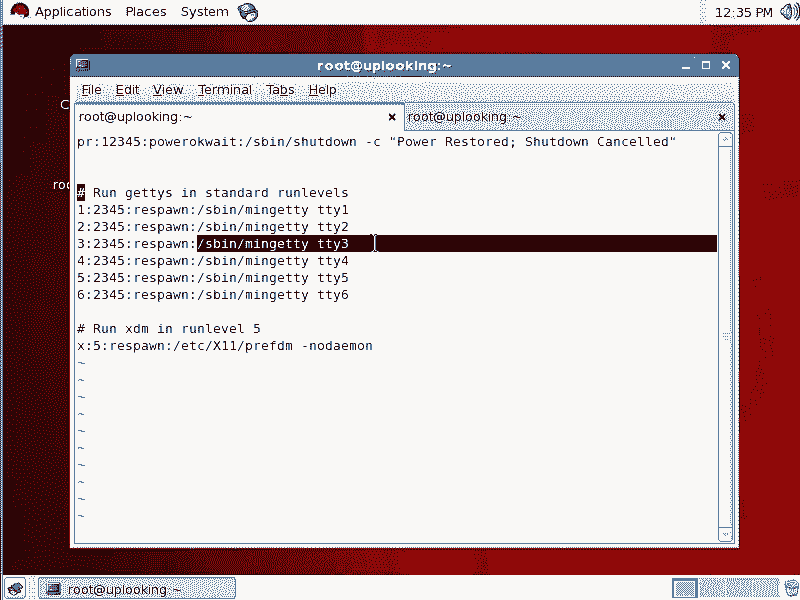
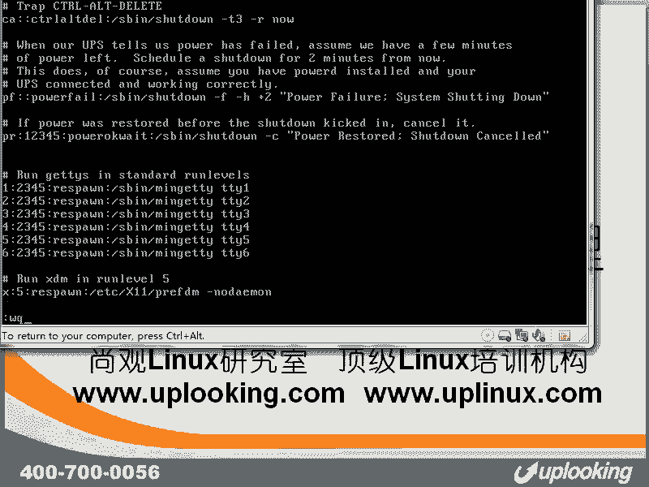

# 尚观Linux视频教程RHCE精品课程：P33：RH133-ULE115-1-2autologin-respawn


在本节课中，我们将学习Linux系统中控制台（TTY）的高级用法，包括如何定制控制台提示符、理解`/etc/inittab`文件的作用，以及如何配置控制台自动登录（autologin）和进程重生（respawn）机制。

## 定制Shell提示符

上一节我们介绍了控制台的基本概念。本节中我们来看看如何定制控制台前的Shell提示符。

我们知道，Shell提示符的样式由一个名为`PS1`的环境变量控制。这个变量中包含一些特殊字符，用于显示特定信息。



以下是`PS1`变量中一些常见参数的含义：
*   `\u`：显示当前用户名。
*   `\h`：显示主机名。
*   `\w`：显示当前工作目录的完整路径。
*   `\t`：显示24小时制的时间（HH:MM:SS格式）。

如果你想了解所有可用的参数及其含义，可以使用`man bash`命令，并在手册中搜索`PROMPTING`章节。例如，要查找`\u`的具体说明，可以在手册页内搜索`\\u`（使用两个反斜杠来转义特殊含义）。

## 理解 /etc/inittab 与进程重生（respawn）

系统启动时，默认会打开6个文本控制台（tty1到tty6）。这个行为是由`/etc/inittab`配置文件定义的。

查看`/etc/inittab`文件，你会发现在运行级别（runlevel）2、3、4、5下，都有类似下面的配置行：
```
1:2345:respawn:/sbin/mingetty tty1
2:2345:respawn:/sbin/mingetty tty2
...
6:2345:respawn:/sbin/mingetty tty6
```
这些行指示`init`进程（PID 1）以`respawn`方式运行`mingetty`程序，从而打开对应的控制台。

`respawn`是关键。它表示**父进程（init）会监视其后运行的子进程**。只要子进程（如`mingetty`）在正常运行，父进程就不干预。一旦子进程被终止（无论是正常退出还是被强制杀死），父进程会立即重新启动它。

我们可以通过一个实验来验证：
1.  切换到`tty2`（按`Alt+F2`），用root账号登录。
2.  切换到`tty4`（按`Alt+F4`），同样登录。
3.  在`tty4`上，执行命令`kill -9 -1`。这个命令会杀死当前终端（`tty2`）上的所有进程。
4.  再次切换回`tty2`（按`Alt+F2`），你会发现系统并没有卡住或黑屏，而是重新回到了登录提示界面。

这说明`init`进程检测到`tty2`上的`mingetty`进程被杀死后，立即重新执行了它。这就是`respawn`机制的作用。

图形界面的启动也利用了相同的机制。在运行级别5的配置中，通常会有一行：
```
x:5:respawn:/etc/X11/prefdm -nodaemon
```
`prefdm`是一个脚本，它会根据系统安装的桌面环境，自动启动对应的显示管理器（如GDM、KDM或XDM）。以`respawn`方式运行意味着，如果你退出了图形界面，系统会自动为你重新启动它。

## 配置控制台自动登录（autologin）

理解了`/etc/inittab`和`respawn`机制后，我们可以玩一些“花样”，比如实现控制台的自动登录。

`mingetty`程序支持一个参数`--autologin`。查阅其手册（`man mingetty`）可以看到，使用`--autologin <username>`参数可以让指定用户在对应的控制台上自动登录，无需输入密码。

以下是配置`tty10`为`student`用户自动登录的步骤：

1.  **编辑 `/etc/inittab` 文件**：
    ```bash
    vi /etc/inittab
    ```
2.  **添加自动登录配置行**：
    在文件末尾添加一行（注意行号`10`不能与已有行重复）：
    ```
    10:2345:respawn:/sbin/mingetty --autologin student tty10
    ```
    这行配置表示：在运行级别2、3、4、5下，以`respawn`方式在`tty10`上运行`mingetty`，并自动登录`student`用户。
3.  **保存并退出编辑器**。
4.  **让init进程重新加载配置**：
    修改配置文件不会立即生效。需要通知`init`进程重新读取`/etc/inittab`文件：
    ```bash
    init q
    ```
5.  **验证效果**：
    切换到`tty10`（按`Alt+F10`）。你会发现终端没有出现登录提示，而是直接以`student`用户身份进入了Shell。
    输入`exit`退出Shell后，系统会瞬间自动重新登录`student`账户。这正是`respawn`和`--autologin`参数共同作用的结果。

### 原理简述

这个过程可以这样理解：
1.  `init`进程根据配置，运行`/sbin/mingetty --autologin student tty10`。
2.  `mingetty`程序负责打开`tty10`这个终端，并执行`login`程序。
3.  由于传递了`--autologin student`参数，`login`程序跳过了询问用户名和密码的步骤，直接为`student`用户启动了一个Shell。
4.  当用户退出Shell（`exit`）时，`login`和`mingetty`进程也随之结束。
5.  `init`进程检测到`mingetty`进程终止，立即根据`respawn`指令重新执行它，于是又回到了第1步，实现了自动登录的循环。

若要取消自动登录，只需删除`/etc/inittab`中添加的那行配置，并再次执行`init q`即可。

## 其他应用与总结

除了上述功能，你还可以通过`/etc/inittab`配置串口控制台（使用`agetty`），这在嵌入式系统或网络设备（如路由器）中很常见。一些路由器操作系统（如基于FreeBSD的）也采用类似的体系来管理终端。

本节课中我们一起学习了：
1.  如何通过`PS1`变量定制Shell提示符，并使用`man`命令查询更多参数。
2.  Linux系统如何通过`/etc/inittab`文件和`respawn`机制管理控制台及关键进程的生命周期。
3.  如何利用`mingetty`的`--autologin`参数，为特定控制台配置自动登录功能，并理解了其背后的工作原理。



这些知识有助于你更深入地理解Linux系统的初始化过程和多用户终端管理机制。