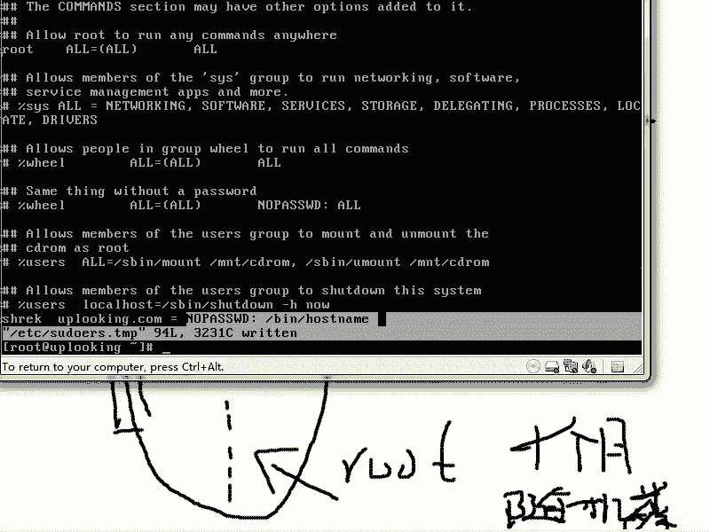

# 尚观Linux视频教程RHCE 精品课程 - P34：RH133-ULE115-1-3-用户权限体系及sudo - 爱笑的程序狗 - BV1ax411o7VD

OK那么常见啊就是我们对权限的管理是怎么样，这是我们接下来要介绍的内容。也就是说我们一般控制一个计算机的时候，控制一个服务器的时候，我们是怎么样去处理它的这个就是说我该用什么身份登录。

我该怎么样去管理这些账号啊，一般都是这样的。我们现在的话在系统里面很少用如此账号来登录。这点的话，做这个公司做的非常不错啊。5班。

wo啊 to5 to这个公司啊，它非常好玩。你如果装5班的话，就会清楚它是用普通账号来登录。当你做任何事情的时候，你都需要输入一个什么SU do，然后呢输入一个什么什么东西。

比方说把想把这个IP地址改掉啊，IF configETH0啊，192168。0。192168。0。1。那他为什么要这样做呢？就是因为里面的话呢，它呃已经做到了就是说权限通常情况的这种管理。

因为我们是如此账号。我们给大家说过如此账号，它可以威胁到你什么呢？就是说甚至他把整个的硬盘全部都怎么样归零啊，就是归零以后的话呢，就相当于啊把陈冠希这个照片偷走的那个人都没有办法把你数据再恢复回来。

也就是说你去这个数据恢复公司想去恢复的话，也没有办法呃，你别看那个什么24小时反恐啊之类的地方，他什么拿到一个芯片，把里面数据恢复出来。那是说在获得的这个芯片，这个芯片是在软件层次上删除一个文件的时候。

那么如果要是你这样的，你方说你是吧，从哪来呢？DEV下的zero来是吧？输出重下的DEV下千万不要执行啊，SDA千万不要执行，你这样一回车啊，这下可热闹了。怎么热闹？你这个数据。

你这个硬盘的话就直接怎么样，全部都贵，我没有执行过啊，我没有执行过。那比方说我这样的啊，TTY呃TMP下的AAA啊这样的一回车。那么这个时候我们看了一下TMP目录下的AA啊。全都是一堆空的东西啊。

一堆空的东西不是ca，用DD。DD是吧，从这个地方来，然后呢，苏州重定向到呃DV下的呃SDA去。那这样的话，你整个硬盘就全都完了，是不是？也就是说你的如特账号。

我这边当然说的是一个非常非常强的这样的一个假设啊，就是说。你如果要是要做一件愚蠢的事情的时候，你真的能把这个系统搞得是非常烂，对不对？所以为了避免的话呢，你无意中做到这样的事情，那么怎么办呢？

你平时的话呢，应该创建一个什么普通账号，让普通账号的话呢，做任何事情的时候运行什么呢？SU do啊，然后呢做这些事情。那么也就是你运行SU do，你会想我这个命令是不是能。损坏。

这个自己的系统会不会给你带来灾难。所以这就是我们常见的这种呃管理方式。所以5班 two的话呢，它是强制使用这种方式。也就是说你5班 two登录在里面的账号，所有的人全部都是什么普通账号。

我们说系统当中除了普通账号以外，就是什么呢？就是呃管理账号就是如此账号，如此账号就是UID为0的，其他UID不为零的，所有账号全部都是一模一样的，对不对？那么也就是一般的管理，就是这么管理。

当然了，在大型的这个企业环境里面的话呢，管理可能是另外一回事。也就说现在的话呢，我们比方说举个例子啊，我们现在的话呢有一个公司这个公司的话呢有一大堆的服务器，这些服务器的话呢多达上千台成千上万台啊。

这些服务器里面假如说都是网络游戏的什么代码，是不是？那么公司里面的话有很多人啊，卖一个网络游戏的这个服务器端代码，那卖出去以后就变成私服了。这个公司一定要特别强烈的避免所以这样的一套东西啊。

如果卖掉了以后啊，被卖掉以后，公司会受很大的损失。所以公司的话必须严格去什么去控制，说登录在这里面的人不要把这个代码拿出来，然后完全就卖掉，是不是？所以的话我们呃必须得要这样控制。当然控制的话，你想。

你们公司的话呢，有1个DBA啊，或者说有两个系统管理员，他们之间的话呢，互相之间什么，互相之间还值班或者三班倒三个人去值班是吧？那突然这台机器出现问题，你能不给他如的权限，让他去做这个相应的操作吗？啊。

另外一台机器出现问题。那么这个时候这一台机器的话呢，要呃三个人去访问，至少三个人访问，突然网上出现一个什么出现一个私伏这个代码到底谁卖的啊，我们说现在的话呢有3个人。是吧小A啊，还有什么呢？小B啊。

还有小C。这三个人到底谁干的？所以的话呢在真正的公司里面的话呢，不会让你直接用root账号的话来登录这些服务器维护。他一般的话呢都有非常呃严格的这种规定，怎么严格的规定呢？你说怎么样去严格。

那么让他们去登录的时候，都必须得要怎么样，都必须得要有root权限是吧？那么要有root权限的话呢，他就可以抹去自己的所有的痕迹。比方说他明明copy了一个东西，结果的话呢。

他就怎么样把自己的这个日志删除掉，对不对？所以的话我们需要这样来做啊，就是在企业里面他是这样做的，找一台什么呢？真正大家登录的服务器。那么大家登录的时候的话呢，全部都是以各自的用户身份。

也就是说你比方说这是啊，长得真丑是吧？账号来登录。的话，在这台机像就是普通账号。他在这台普通账号上，这台普通账号上的话呢，这个机器啊启动了audit。也就是说启动了审计这个服务audit服务的话。

能审计所有啊在这个机器上运行的所有的进程的所有操作。那么我们让auudit的话呢记入日志。然后呢，这个所有的人登录上来以后，不是都是普通账号吗？就这台机器的root账号是被一些人管理起来。

那么这些人的话呢是管理员或者说这个管理员的管理员，对不对？就是管理员的头了，他的话呢可以看这个日志，而这些日志的话呢，他们是没有任何权利去碰的。是其中一个，他的话呢，假如说想干坏事，他登录在这台机器。

他又什么呢？在这台机器登录这台机器，以root身份去登录他所做的操作全部都在什么整个的这个日志服务器上进行了。就是说记录，所以的话呢他copy了一个什么东西，或者是做了一些什么操作。

全部都能显示在auuddit这里面。所以这个时候它代码一出去，那我们就可以找他的麻烦，对不对？当然了，这些服务器的话呢，对外都是对外都是连接什么internet。啊。

internet那么这当然线下的话有很多的很多客户端去连接了，这个就是企业里面一般管理的方式。也就是说他们在。自己机器上以普通身份的话登录在一个日志呃。

就是记录日志记录严格审核的这样的一个呃登录服务器上。在这个机器上的话，他们就是普通账号。他们以普通账号的话呢，再去登录什么呃，这个以普通账号登录的这个。这个登录服务器上去以后。

然后再以root账号的话去登录什么呢？其他机器，他们以root真身份去登录的其他机器上做的所有操作都记录在什么？这台服务器上，这样的话呢，他们就不敢为所欲为了啊，这就是我们所谓的什么。

就是我们所谓的这种呃，就是稍微好一些的这种管理方式啊，当然这些所有的机器啊，他们如果要是以root身份呃，以root账号的话呢去登录。他们这个root账号必须是什么呢？最长啊最长是一个月换次密码。啊。

最长一个月换次密码，他们的密码的话必须是什么呢？随机数。啊，随机数随机数的话呢，还必须包含着什么呢？必须包含着数字大小写，然后的话呢还有大小写的字符啊，字母这样的一些东西就是说非呃。

像那个就是这种阿斯克玛的这些东西的话呢，轮流去换。这随机数的话呢，一般会肯定要什么16倍以上啊，一个月的话呢，换一次，一个月换一次。通过我们的一台服务器的话呢，整个去处理。通过一台服务器整个去处理。

这就是什么呢？企业里面一般常见的这种呃就是大型企业里面管理的方式。那么在一台机上启用什么呢？audit审计是吧？审计这个机器上登录的所有账号。那么他们的话在登录其他机器上的时候。

必须得要记录他们运行的所有的命令合理不合理啊，这就是什么呢？这就是这种管理方式。那么我们回过头来的话呢，再看一下SU do啊，我们再回过头来再看一下SU do。那么我们以普通账号来登录。

然后的话呢去SSH别人是不是比方说SSH现在的话呢，我去呃，你比方说我是以。

这个如的身份来登录的。大家可以看到，我前面的话是以如的身份来登录，对不对？那么这个时候我去SSH啊。192。168。0。232是不是？19268。0。232我去SSH的时候，我前面没有加任何东西。

那这个时候的话呢，我就是默认以我如特的身份去登录了，是不是？这个时候啊，我第一次访问，他说两边要协商一个密钥啊，SSH为什么安全，因为它要什么生成一个什么RSSA的密钥。对这个密钥对的话呢。

公钥在你这边私钥哎公私钥在你这边公钥给对方啊，这个时候的话呢，你去输入一个什么呢？输入一个呃对方的密码，然后呢这样登录进去。那你看我现在远程登录到了呃loing2这台机器上去，对不对？1234的啊啊。

那EXIT就退出出来了。这就是我们刚才那个过程。那么我们在等机上啊，如果要是以另外一个身份去登录，比方说以s身份去登录。然后再去SSH1918。0点啊。232的时候，那这时候默认就是以什么呢？

shack身份他去访问了。所以这个时候如果要是你想以其他身份，那就是什么什么at什么什么？也就是说SIC对方是吧，然后加上一个什么shck at。啊，这样的话呢，你就可以以另外的身份。

比方说以root at啊sha at或者以什么其他身份去登录，这是远程登录的时候一般的做法。那么当然了，你也可以以普通账号来登录进去，是不是比方说啊。陈是吧。

陈tom陈tom登录陈tom登录进去以后的话呢，在他的机器上再去什么as you do啊任何东西比方说改一下呃改一下永久的改一下IP地址，或者说改一下这个。主机名等等啊。

system杠费杠杠network对吧？SU do这样的SU do就是登录过去了以后的话呢，以对方机器上的什么root账号来呃，就是来执行。但是呢这边又有问题，就是说呃我当然我在我本机上的话。

我可以这SU do啊执行一个什么呢？好。name对不对？那这时候的话他需要输入我的密码。比方说我输入shack的密码。那这时候如果要是个账号啊，如果要是我被配置成什么。

任何人都可以去就是说都可以让我去任何命令都可以让我这个普通账号去执行。那么他就可以执行。否则的话他说不行的啊，我们看一眼。就是说我直接我直接以普通账号来登录以后，我就可以执行任任何命令嘛，那肯定不行。

那必须得要事先去。呃，去事先去设置啊事先去设置。你看啊也就是说我这样一个普通账号，他想运行任何管理员运行的命令都可以运行吗。那不是世界不是乱套了吗啊，那普通账号说啊，把我变成管理员吧，那肯定不行，是吧？

所以这个机制是什么呢？就是VISU do啊，VIS you do。

我们刚才的话呢画那个图的意思跟大家说清楚什么，就是说系统当中就是说在大型的这个网站里面应该是怎么样去管理的，是不是？然后现在的话我们说到了一个细节，就是什么细节呢？就是说我在本机上以普通账号来登录。

那这个时候我想提成什么管理员的身份的时候，那这时候我要运行一个什么SU do啊，这个SU do的话，它是怎么配置的这是一个问题。那么我是12个账号，那我肯定不能运行VISU do，对不对？

那么我以一个什么普通的呃就是我以如的身份去运行VISU do这个时候的话，我可以配置任何的普通账号，它可以运行什么呢？运行我们的这个呃就是问就是配置任何的一个普通账号，它可以运行的任何的这个命令。

我把它列出来。如果要是我让它运行一个命令啊，那我就加一行是吧？或者说把那个命令放上去，那非常简单，就是跟我们的什么跟我们的呃VI打开一个文件是一样的。实际上这个文件就是在。

下的哎as you do啊那个文件。那这里面你看它这边的话呢是一个呃是一个这种就是写法啊，这个写法的话，你看它把一些比方networknetworking这个资源啊。

networking这样的资源命名成什么呢？networking这样名字用什么呢？CM呃CMND就是说命令的什么别名，这些命令的别名的话呢，这些别名全部都叫什么呢？叫样networking这样名字。

然后呢，software然后叫什么RPMup up to。dta啊什么YUM之类的啊，那么他把这些名字的话呢都起别名。那么刚才的话是命令的别名，命令的别名，对不对？那么下面的话呢，还有其他的。

比方说默认的啊，或者说用户啊等等啊。这些设置你也可以的话呢用其他的命令的话呢设置这种别名。那我现在的话呢，比方说你看这边我是说shack账号从所有的地方来可以运行什么，并且的呃ho name，对不对？

那我可以运行个什么呢？呃，从所有的地方可以运行一个，比方说并且的。嗯。还是并且的。S并下的，比方说LV呃，就是VG scan。啊，这样的一个命令这个命令的话，我这样设置好以后，保存命令退出。

那么shack账号的话呢，它就可以运行什么呢？啊，VG scan啊或者什么呢？关机啊，关机比方说。嗯，杀当。对吧杀档从所有的地方来可以运行这个命令。我这样写完了以后的话呢，保存并退出，你看保存并退出。

那这时候的话呢，我们再到这里面来运行什么SU doho name。那这样的话呢输入shack密码，这时候它就不允许运用这个了。但是我可以运行什么SU do。收到。账。H now对不对？

我这样的话呢可以去直接执行。如果要找不到这个命令的话呢，就把它的全部的路径啊显示出来。把它全部的路径显示出来。比方说S并且的杀档啊，那么这样一回撤以后，它就可以运行了。因为我现在的话还不想关机啊。

那这个命令的话，我想告诉大家什么呢？大家看到刚才在执行的时候，是不是要输入一下shack的密码。对吧他要输个1X的密码，那么你不想让它来回这么麻烦，那怎么办呢？你可以再运行VISU do的时候。

在后面的话呢可以加上一些参数啊，比方说。啊，比方no password。马哈奥。no password out啊，我这边的话呢把这个命令加在后面，比方说加上一个。啊。逗号啊，并且呢。并且个host。累。

啊，保存病退出。那么现在这样。啊，他说有错误啊，这边他是说有错误。看一眼啊。怎么回事呢？我看一下啊，可能是这样的，就是说呃这边的话前面啊这个结构啊，大家看前面是一个用户名，是不是？前面是个用户名。

或者是组的名字。你看如果组的名字就是百分号什么什么。那比方说我这边是想要shack组的人都怎么样那就是百分号什么那最前面的话呢是说用户名或者组名，那当然了，也可以把一组用户全部都命名成一个别名。

就刚才我们看到那个什么nwork代表着一组命令是不是？当然你可以把一组人的话呢，全部叫做什么administs是吧？

或把这一组人的话呢全部都叫成什么呃什么manag或者说什么呃sstemadmins是吧？那这样的话呢，可以把那个名字，别名写在这边。

也可以把用户名和组的名字写在这边现在这种表示方式就是ck组这个组的人啊都是这样那现在的话比方说我就是说ck这个用户从所有地方out的话呢所有地方当然了我可以把当前这个机器的名字比方说叫做uplook点com写在这边up点它可以在up点 co这台机器。

去no password，就不需要输入任何密码，然后呢输入所有的命令，执行所有的命令。那这样的话呢，就是说它可以直接加个SU do，后面加命令就OK了。那比方说我这边加上一个什么呢？呃。

并且的post name。啊，这样我保存并退出。大看这样的话没有报错，对不对？这样没有报错。那么我输入的是说从哪台机器奥就是从所有的地方，然后它远程登录也是一样啊，out就是所有的地方所有地方来。

然后呢，不需要输入密码，执行这个命令啊，那我现在的话呢在outt加F2，我们看一下设备账号，我输入一个什么S you do啊，ho name，我看要不要输入pa错了，刚才是什么呀。

要不要刚才要的是不是你现在看一回出那没有输入pa错了，直接就执行出来。那当然了，我去执行其他命令是不行的。比方说 down。

到Hno。那么因为它我们没有定义什么？就是说这个是no password no password执行的，所以他还要输入什么呢？密码。那么我输入完密码以后啊，输入完密码以后，它还是不允许。那还是不允许。

命令没有发现啊，我这样输入什么S，并且呢删量杠H闹是吧？然后再输入一个什么呢？自己的密码。那这时候他说不允许你执行。因为他刚才看到什么noPASS。啊。WD啊，这个后面的话没有跟这个命令。

他就想看还有没有其他命令。所以的话这个时候呃你既然这个命令就是不需要输入他做的这个命令里面不包含着这个命令，那我就让你输入密码，输入完密码以后，他再去查，发觉哎也没有地方什么呃，就是允许这个命令执行。

所以他就是说不允许执行这个命令。所以的话最后你输入了密码，他也不允许执行啊，这就是SU do啊，所以通常情况下，你会发现在系统里面它的这个命令啊，就是系统本身的这个权限，它是非常弱智的，他怎么弱呢？

就是说你要么是ro此，要么不是root，对不对？也就是说你要么可以执行所有的命令，要么什么呀，要么就是说只能去执行什么啊，就是普通用户都可以执行命令，其他管理员的命令你都不能执行，就这两种权限。

但是呢有个SU do以后啊，我们可以看一下VI呃。VIS you do以后，它是这样来的，你可你可以的话呢，把主机，你看可以把主机的名字是不是给它起很多名字，比方第一个呃第一个主机，第二个主机等等。

fill system，你看fill server，它叫做FS1FS2等等，它可以起这个主机的名字，它可以起用户的别名。

比方说你叫admin或者administrs给这样一组人全部都加了一个什么加了一个呃就是说加到这个。用户的别名里面来，比方说三个用户想让他们成为管理员，那你给他把它加到什么管理员这个呃别名当中来。

那之后的话呢，你可以在最后的时候去定义什么呢？管理员可以运运行什么什么命令，对不对？管理员可以运行什么什么命令。那你可以在这边，比方说啊。哎，对他这边的话有。

你看这边如的账号是可以从所有地方运行所有的命令。那么你可以在这边的话去把这个地方改成什么？ad means是不是ad the means从所有的地方可以运行。比方说所有的命令，然后呢。呃。

就是说执行所有的命令，然后呢是那种运行。普通的这种运行方式啊，普通运行方式。比方说我现在的话呢想怎么样，想让它运行。从所有的地方运行什么呢？网络管理等。还有什么呢？

back up是不是或者说software，那我就把它添加到后面，这样的话呢，我就像windows里面那样让一个用户可以去关机啊，比方说管理员组的人可以关机啊，或者说谁谁谁可以关机。

这样的话呢就是我们可以做到更细节的去控制。也就是说这个SU do的话呢，其实windows它可能也有这种机制，只不过windows它可能在内核里面，或者说不像对外开放。

但是lindowux里面这个的话呢，简单到什么？就是用文本文件的这种方式啊，那这个文本文件的话呢。在哪儿呢？在这个地方就是什么？就是ETC下的SU do。啊，ERSS啊这个文件。

那么还有就是VISU do这是个命令是吧？还SU do这是一个什么这是一套东西啊，这是一套东西。所以的话呢刚才我们讲讲了一下VISU do和SU do这样一些东西，还给大家讲的就是SU do的时候。

你可以不加密码，就可以执行这个命令，对吧？那么通常我们在windows里面想实现。比方说谁谁谁可以关机，谁谁谁可以备份，谁谁可以做什么？那你可以用SU do来控制，只不过这种控制机制的话呢。

并不是内核级别的内核级别只区分两种人，而你用这种机制的话，你可以区分无数的人，比方说有一些人可以改网络的呃相关的东西。有一些人可以什么呢？备份，有一些人可以关机，那你可以创造出无数组。

只不过这个组的话呢，并不是用户的组，而是什么呢？而是我们系统的话呢，你自己通过改一个文本文件，然后来创造出来的角色，当然你可以用系统的组来赋予这个组可以做什么。对那个组可以做什么？

这就是它的这个呃细节的管理体系啊，所以的话呢承接我们第一本书所讲的那样，就是说系统当中只有两种账号，一种是UID为零的，你可以轻松的把一个人用户然后变成UID为零了以后，他就可以做任何事情。

还有一种的话就是说UID不为零的所有账号。那现在的话我们可以通过SU do可以区分出各种各样的账号，可以让他做各种各样的事情。那么都是通过什么呢？这套机制就是SU do的这套机制啊。

希望大家的话呢能仔细了解一下，看一下网上的话呢，众多的这种例子。

好，SU度的这个部分的话，我给大家讲讲。