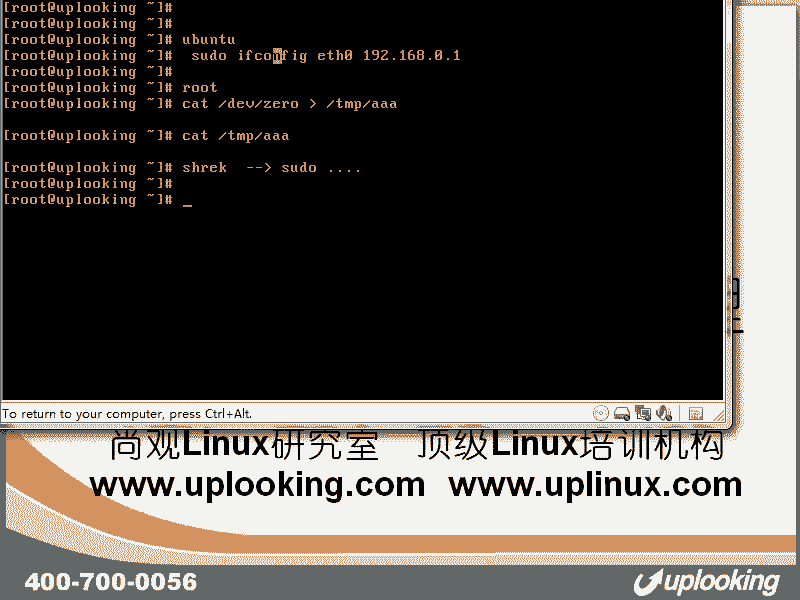
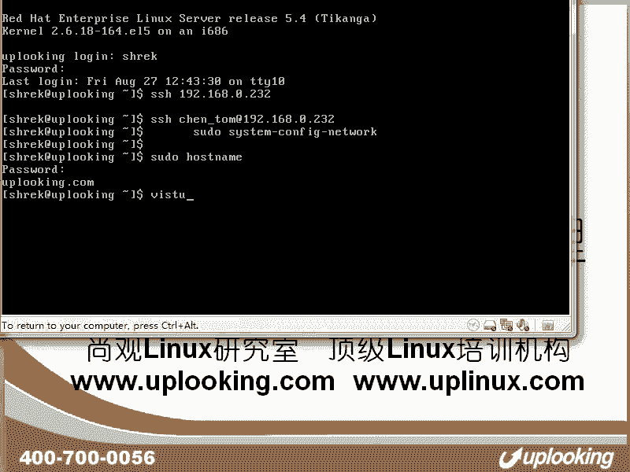
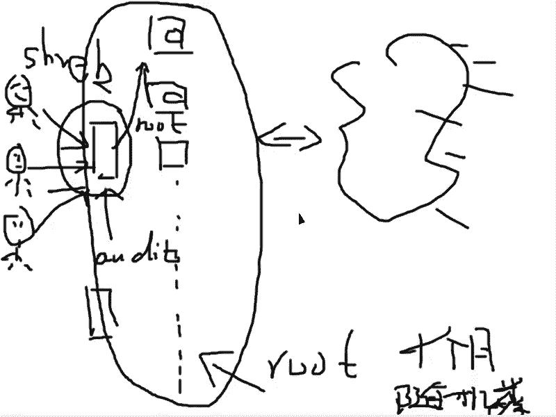
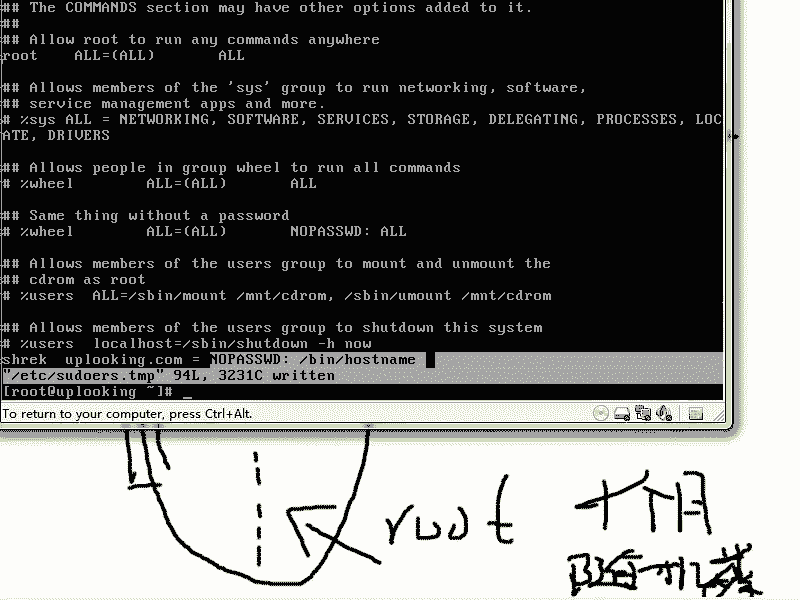
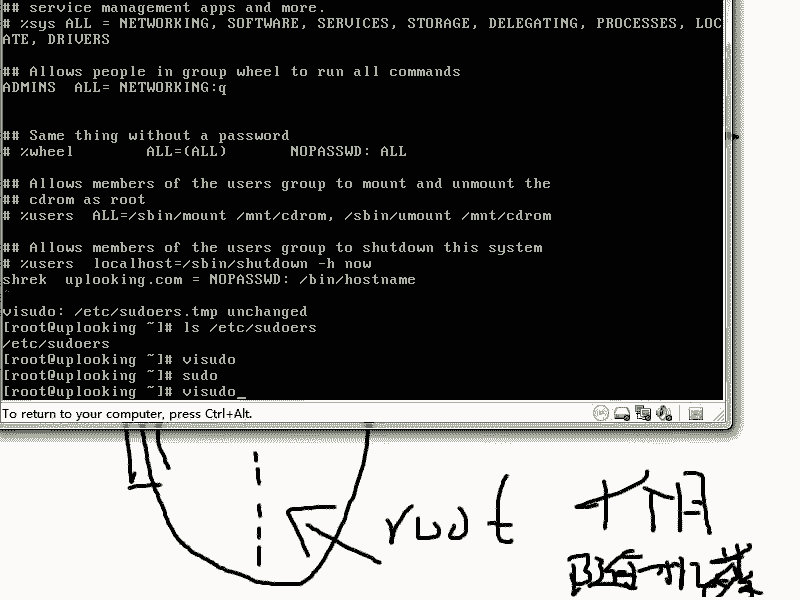

# Linux用户权限管理：P34：用户权限体系及sudo 🛡️


在本节课中，我们将要学习Linux系统中的用户权限管理体系，特别是`sudo`命令的配置和使用。我们将了解为何要避免直接使用root账号，以及如何通过精细的权限控制来安全地管理系统。

## 权限管理的重要性 🔐

上一节我们介绍了Linux的基本用户概念，本节中我们来看看权限管理的必要性。



在Linux系统中，root账号拥有至高无上的权限。这意味着它可以执行任何操作，包括一些极具破坏性的命令。例如，执行以下命令会清空整个硬盘的数据，导致无法恢复：

```bash
dd if=/dev/zero of=/dev/sda
```

为了避免因误操作或恶意行为导致系统灾难，最佳实践是**避免直接使用root账号登录**。日常操作应使用普通用户账号，当需要执行管理任务时，再通过`sudo`命令临时提升权限。Ubuntu系统就强制采用了这种管理模式。

## 企业级权限管理模型 🏢

理解了基础权限风险后，我们来看看在拥有成千上万台服务器的大型企业中，如何实施更严格、可审计的权限管理。

企业环境（例如游戏公司管理核心代码服务器）需要严格防止内部人员窃取数据。如果直接给管理员root权限，他们可以轻易抹去自己的操作日志。因此，企业通常采用以下架构：

1.  **专用登录/审计服务器**：所有管理员通过各自的普通用户账号登录到一台专门的服务器。
2.  **启用审计服务**：在这台服务器上启用`auditd`等审计服务，记录所有用户执行的命令和操作。
3.  **权限分离**：审计服务器的root权限由更高级别的管理员（或安全团队）控制，普通管理员无法修改审计日志。
4.  **跳板访问**：管理员从审计服务器上，使用动态生成的、高强度的复杂密码（通常每月更换），以root身份登录到目标业务服务器进行操作。

这样，所有管理员在目标服务器上的操作都会被完整记录在独立的审计服务器上，实现了权限的**可控**与**可追溯**。


## sudo命令详解与配置 ⚙️

从宏观的企业管理回到单机，`sudo`是实现普通用户执行特权命令的核心工具。它允许系统管理员精细地控制谁可以执行什么命令。

### sudo的基本使用

当以普通用户身份登录后，直接执行系统管理命令（如修改主机名）会被拒绝：



```bash
hostname newname # 权限被拒绝
```



此时，需要在命令前添加`sudo`：

```bash
sudo hostname newname
```

系统会提示输入**当前普通用户的密码**进行验证。验证通过后，命令将以root权限执行。

### 配置sudo权限（visudo）

普通用户默认不能使用`sudo`。权限规则在`/etc/sudoers`文件中定义。**严禁直接使用文本编辑器修改此文件**，必须使用`visudo`命令，该命令会在保存时进行语法检查，防止配置错误导致所有sudo权限失效。

以下是`/etc/sudoers`文件中的一些配置示例：



1.  **允许特定用户执行特定命令**：
    允许用户`zhangsan`从任何主机（`ALL`）执行`/sbin/shutdown`命令。
    ```
    zhangsan ALL=/sbin/shutdown
    ```

2.  **允许用户执行命令时无需密码**：
    允许用户`lisi`无需密码即可执行`/bin/hostname`命令。
    ```
    lisi ALL=NOPASSWD: /bin/hostname
    ```

3.  **允许用户组执行所有命令**：
    允许属于`wheel`组的所有用户执行任何命令（需要密码）。
    ```
    %wheel ALL=(ALL) ALL
    ```

4.  **使用别名进行分组管理（更清晰）**：
    可以定义命令别名、用户别名等，使配置更易管理。
    ```
    # 定义命令别名
    Cmnd_Alias NETWORKING = /sbin/route, /sbin/ifconfig
    # 定义用户别名
    User_Alias ADMINS = zhangsan, lisi
    # 授权
    ADMINS ALL=NETWORKING
    ```

**关键点**：`sudo`的权限检查是精确匹配的。如果为用户配置了无密码执行`/bin/hostname`，那么他执行`sudo hostname`时无需密码，但执行`sudo shutdown`时仍会被要求输入密码，并且如果该命令未在授权列表中，最终会被拒绝。

## 总结 📚

本节课中我们一起学习了Linux的权限管理体系：
1.  **核心原则**：应避免直接使用root账号，以降低误操作风险。
2.  **管理模型**：企业通过**专用审计服务器**和**sudo**结合，实现权限的分离与操作的可追溯。
3.  **核心工具**：`sudo`命令允许普通用户临时提升权限执行特定命令。
4.  **配置方法**：通过`visudo`编辑`/etc/sudoers`文件，可以精细控制**哪个用户/组**、**从哪台主机**、**能否免密码**、**执行哪些命令**。
5.  **权限本质**：Linux内核只识别UID（0或非0）。`sudo`机制是在此基础上，通过外部配置实现更灵活、更细粒度的“角色”与“权限”管理，增强了系统的安全性。



通过合理配置`sudo`，我们可以在便利性和安全性之间取得良好的平衡。