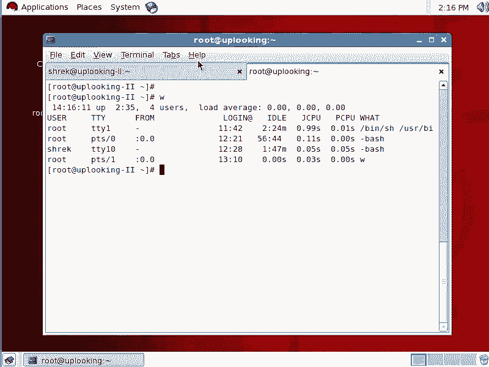

# 尚观Linux视频教程RHCE 精品课程 - P35：RH133-ULE115-1-4-screen-文本控制台的窗口操作 - 爱笑的程序狗 - BV1ax411o7VD

咱们来看一个特别好玩的东西啊，就是文本控制台下的这个窗口管理。这东西的话呢是在咱们H7R5U4的这个之后的数据当中的话呢，出现的这东西的话呢，我个人的话呢，因为我自己有一些这个管理方面的这样的一些需求。

就是管理服务器方面的需求。但是我就觉得这东西啊特别好玩，大家看一眼。

就是它比较有用啊，最重要是比较有用。看一下啊。咱们现在的话呢看到的这个窗体就是一个文本控制，就是就是没有所谓窗体的概念。因为咱们现在就是在文本控制台下去操作嘛，是不是？这样的啊。我先清一下所有的东西。

清一下那个刚才我打开的一些东西。那就是screen啊screen这个东西的话呢，它是一个就是说窗口管理器，在文本下面的所有文本控制台下的这种窗口管理啊，大家看一下。

假如说你看假如说我在这边的话呢要做一个特别大的工作。比方说啊备份啊或者恢复啊或者怎么样，它时间很长啊，你比方说我在这边运行一个啊update。DB啊这样的特别长的时间，它需要特别长的时间。

但是呢我在这个整个执行的过程当中，我要离开这个就是离开这个终端，或者是说呢我现在远程连接到这台机器上。而这台机器的话呢，随时就是说它的网络不是特别稳定，它随时的话会跟我断开。那一旦的话断开了以后。

我我你看我如果要是远程连接到一台机器1928。0。231啊，232这台机效。我远程连接过去了以后，输入它的密码啊，远程。连接到uplook2这台机器上去了以后啊，这第二台服务器上去以后。

那么现在我要执行一个update DB。这个时间是很长的，对不对？这个时间很长，然后呢我在连接的时候突然网速特别慢，哎，怎么反应的话都就是特别慢。然后突然的话呢就断了。

那么我已经是updatedDB的一段时间。那么我远程连接，你看从我这边的话运行SSH开始到。在对方的机器上运行完一个ba shell是吧？它的这个ba shell的话，实际上是在0。

232这台机上运行的对吧？up date DB的话呢是这台这个ba shell下面的紫禁程。对不对？也就是说232这台机上运行了个ba shell shell话运行upDB。

那么当我的话呢没有办法连接过去超时了以后，那么我这个机器会怎么样呢？我就是232这台机器上会把我的进程全部都关掉，Q掉。一Q掉以后，那你说upDB它需要很长时间，它执行了一段是不是就不行了。

就突然就怎么样就挂了，是不是？也就它的话呢也会被Q掉。所以它作为ba shell的一个子进程。所以这个时候的话呢，我如果要是远程网络不稳定，那我这样呢输入一个screen。啊，str。

screen也就是我打开窗体，这个窗体的话呢运行什么呢？update。DB啊，运行up DB或者说我这样的，我这样不知道行不行，那么我这样加上一个双引号吧，然后呢运行完up B以后什么呢？

再去ele一个呃ANA啊这样的双引号。那么一回车啊，它就开始唉不能运行。No such file director。那你好好看行不行。不行啊。那么现在的话呢。

我我们就假如说是在这台机相去运行的什么update DB是吧？现在的话我这个控台的话就已经打开了，就是updateupdate DB的话已经是在执行了。刚才。真的是不行了。

这是另外一台服务器啊，我看看这台服务器现在干嘛。

这是。这是他父器cttrol加D。没反应。要拿重新拿一遍。现在我远程连接这台机器。啊，这个网络可能是不太好。网络可能不太好，那输入它的密码啊，然后呢这样的在它的机器上去。

本来的话直接运行updateDB是不是？假设说这是一个非常长的这样的一个动作。比方说我去执行一个。嗯。😊，这样吧呃，update DB的话呢，它刚才的话也是有点问题，是因为它执行完就完事儿了。

所以的话呢我没有办法接下来对它控制。那我这样的呃screen。啊，update DB screen update DB。那这样的话呢，我去呃screen，然后呢直接执行个bash啊。

其实的话你不输入bsh，它就执行bsh了。那么这样的一回车，那现在我还是在这台机下运行程序。那么我现在运行个up date。DB也就是说现在的话呢，我也是相当于远程连接到对方的迹象运行upateDB。

但是我在执行upate地B之前，我先运行个spring。也就是screen updateB这样的话有什么好处呢？假如说现在网络的话呢呃不稳定啊，我现在运行个什么呢？

比方说我在这个screen里面的话运行了几行命令啊，然后呢我还 touch了一个文件AAA这样文件，然后再LS啊，我现在执行的这样几行命令，正在执行的过程当中突然死机了。不是死机啊。

就是像刚才那样网络的话呢，不通畅，导致的话呢，我没有办法连接上去啊，就直接被Q掉了。那么我现在模拟一下这个过程，比方说我现在的话呢，在另外一边啊，我现在在另外就是刚才那个呃就是screen当中的。

那么现在我假设说因为我这边的问题啊，我这样的SQ杠。呃，杠9TTY2，也就我把刚才那个控制台下所有的进程，包括SSH进程这些进程全部都Q掉。假设说网络不稳，那么它这个进程的话呢就被Q掉了。

那么你看这是我TTY2TTY2上刚才那个打开那进程全部都没有了，全部都失败了，就是已经。连接不上了是吧？那么按理说，如果正常情况下，那么这时候你打开的那个upate DB也好，或者正在进行的操作也好。

就全部都会被什么终止掉。那这样的话你就会有损失啊。你说我刚才执行了一半的upDB或者执行了一半的。呃，马斯库达朗普正在导出等等，全部都失效了。所以这时候的话呢你看假如说呃。TT82上已经完蛋了。

那我现在不得不重新登录是吧？重新登录，然后再远程连接1928。0。呃232是吧？然后呢连接上去，那么输入一下什么呢？密码。那这时候的话呢还是连接上去。但是刚才我执行的一些命令都看不到了，是不是？

但是实际上这时候你运行个PS tree啊，然后呢加上一个GREP screen。也就是你刚才打开那个窗口的话呢，还是在的还是存在的。你看它是在这个地方，还是存在。那你想再重新连接刚才窗口怎么办呢？

你输一个screen啊杠R啊杠R恢复。你看我就恢复到刚才这个状态，还是touch aA啊，还是在执行。这样的话呢，你不管怎么样去失败的，那就是连接的时候突然失败，它不会造成你正在执行的任务终止掉，啊。

这是非常有用的，真的非常有用。因为的话你比方说我在备份一个文件，这个备份这个文件要半个小时，你不可能一直的话盯在那个地方，你在网吧上网是吧？然后呢，你上了两下，然后维护了两下，你赶快要走。

那么我现在的话呢，要我再走了以后，这个程序仍然正常执行。以前的话我是用什么呢？no。然后呢，执行一个什么什么命令，然后加上一个and符号。这个其实的话呢不如那个不如这个好用。你看我刚才的话呢。

把那个整个进程Q掉，中断了以后，什么都看不到了以后，我又把刚才那个绘画有什么接回来。对吧这样的话就非常好用。那么想退出就是想结束，就是说我现在打开这个窗口嘛，这个窗口我想保存在那个内存当中去。

我就不想我现在不想再连了。那我输一个什么，就是还是保这个绘画还是存在的，输1个DR啊，这样的话呢就把它怎么样终终止了。那么现在的话我还是在这台机上。那么PS tree啊。你像我现在在这台机器上就是。

假如说在一起机上连接这个服务器，那么我现在的话呢在另外一个地方。啊，在SS取消交18。0。232，我再连接过去啊，输入它的密码。输入完它的密码以后的话，我再把那个刚才那个界面的话再接过来。再接过来啊。

又接过来了。是不是也就是说我。登录了第一次，那么我现在退出了一下，我退出了一下，我还想保存就保持着刚才那些绘画。我想再次登录的时候，还是想获得刚才的那些东西，就是刚才正在执行的那些命令。

还是正常在执行的那这时候我再去screen杠R啊，杠DR的话呢，就是。我现在连接着这个窗口，我现在杠DR的话，我就说终止跟他连接。但是呢这个绘画还是在那个目标机器上，是不是？那么现在话呢。

我在另外一台机器上，假如说登录，我在另外一台机器上。然，在另外一台机上登录。然后这台机器这台机器的话呢，up looking啊不是up looking to这台机器了。

up looking就是叫uplook是吧？现在我再去SSH过192个8。0。232。那么我想接着刚才那个活来干，那我输一个什么screen啊，杠R恢复，是不是？如果你默认只有一个screen。

就是一个窗体的话。啊，那他就是杠R，他就直接连那个默认创底。如果你有多个的话呢，他让你选啊，你后面加上一个什么呢？比后哪个PID比方说332啊。3322这个PID啊，那它就会直接连接。

那我现在直接一回车，它就连接到默认那个。呃，就是那个screen当中去了，所以这个是非常有用的啊非常有用。那我这样一回车又连回来了。我这个screen的话呢又连接过来，对吧？那我现在在这里面的话呢。

我想去呃开新的窗体，我想开好几个窗体，我可摁一下ctrl加A全部都是ctrl加A。比如你在这个screen里面。

你摁下ctrl加A就是用运行screen的什么这个快捷键screen杠呃ctrl加A摁完了以后摁一下C，这边表示screen的话呢，又开了第二个窗体了，又开了第二个窗体。那你在这里面的话呢。

你可以输入一个什么？比方说。VIM是吧，打开的状态。那么现在再按下crl加A啊，再按下crl加A。然后再按下D。这样的话呢就离开了这两个窗体，就我就离开这两个窗体。然后这时候的话呢，我EXIT退出来。

那么我就从那个刚才那台机上离开了，是不是？然后呢，现在我再去连接，现在再去连接输入一下密码。那这个时候的话我可以输入一个screen啊，然后呢杠X你看一眼。啊，它就回到了恢到恢复了。

就是刚才最后一个连接的那个screen当中。我这时候再按一下ctrl加呃，cttrol加A，然后呢再输入一个D，又跟它分离了。那我这时候screen。就说我的话这样的PS啊。

screen话PS tree呃PS。啊，AUXGIP。那这时候你看到哎还是。啊，就现在是在。嗯。怎么全部都Q掉了？😔，我看一下screen screen现在打开了两个是吧，一个ba shell。

一个ba shell什么什么，就是说这个screen的话，它现在有两个，相当于相当于这个控谈。那我现在screen。杠2。就是还是跟杠X一样，还是恢复到什么呢？就是。还是默认的那个啊。

我这边的话呢加上1个DR。See。嗯。因为我现在是想获得一下，我看这个screen。稍等啊。😔，嗯，怎么会显示不出来呢？怎么会显示不出来这个screen呢？PSOEX减EP。PS区里面有啊。

PS区里面有。这样吧。😔，呃，这样吧，就是说呃我给大家的话呢，就直接就是screen啊，然后呢杠R，它就可以恢复到刚才的那个呃就是刚才的那个screen当中，是不是恢复到这个screen当中以后。

我本来想给大家看那个列表啊，就说你看现在我现在这个窗体的话呢，是有两个啊，就是我这个screen下面的话呢，窗体大家看到是有两个一个是VM一个是ba shell是吧？

那我怎么样回到刚才那个ba shell当中，我就用快捷键来了啊，这快捷键的话，我这边摁下cttrol加A，然后呢摁下N，这样的话呢，就回复到第一个这个这个窗体当中了。ctrol加A，然后再摁下N。

这边就回到第二个啊，那ctrl加A再加N，那就是第一个就这样来回循环了。如果要是你有三个的话，它就来回切换。那么想往回的话，就是conttrol加A就摁下P，它就回来了啊。

这就是我们的这个screen下面的这个窗体。也就是screen下面的话，两个窗体怎么样去切换呢？加A，然后加个N。那现在的话呢我这样的啊，我ctrl加A，然后输入一个D。

然后我又从刚才这个窗体当中的话呢，分离出来，我就从刚才那个窗体当中分离出来。因为我现在这个窗体的话呢，还是只有一个，然后我输入这样的str。啊，然后我再去运行一个命令。

比方说还是baase shell啊还是ba shell。那么或者是我去执行一个其他的命令，比方说screen加上一个。啊。我想一下。加上哪个命令会比较好呢？加上一个C shell啊。

又打开了个s shell screen shell。那么现在的话呢，这个 shell的话就是C shell，我们叫ele啊，dora SHELL这是一个变量是吧唉。哦，他打开的是盖sh。

这是退出刚才那个screen啊。TC shell。还不行。😔，嗯，我想打开一个进程，这个进程的话一直还在执行着啊这样的VI吧啊。VIETC下的帕索尔。这样的话呢。

它就直接打开这个就相当于我又打开了一个screen。这个screen跟刚才那个screen的话呢，就是两个啊，我下ctrl加A加上D，那我就又从这个screen当中的话呢分离出来了。

也就是说我们现在这样的，刚才的话那个screen啊，它相当于打开了一个什么是不是它又打开了一个什么，它又打开了一个VIM，对不对？那么我现在又打开了一个什么screen，然后呢。

又打开了一个什么呢VIETC下的password，这样总共的话呢是有两个screen。第一个screen的话有两个窗体，那窗体之间切换的话是嗯cttrol加A，然后再加个N，对吧？你要想再打开窗口体。

就是ctl加A，再加上一个C，啊，它就再打窗体。如果想离开当前的screen，那就是cttrol加A加上一个D，它就离开当前的screen。那现在的话呢，我想去怎么样恢复回来，那我这样的screen。

杠R恢复，那么这样的一恢复的时候，你看它就不能自动回复回来了。因为我现在的话呢有两个screen，是不是这两个screen到底想回复成哪个screen。那这时候他告诉你有两个进程ID啊，一个是4410。

一个是4131啊，这两个的话呢，PTS5PTSR这边的话相当于它的控制排，然后呢呃uplook什么杠to啊，这边的话呢是它的主机名，所以你想回复成哪个的话呢，你要后面要加上一个完整的东西。你比方说这样。

screen啊，然后呢杠。诶。R恢复，那么我想恢复成什么？441呃，第一个吧？4131就是有两个有两个窗体的那个就是一个screen，有两个窗体的这个。那么杠R4131啊，我这样的一回复，回复回来以后。

那么我就回复到这里面，那我这边按一下ctrl加A，然后再加上N这边不是又到那个VIM里面了吗？你再摁一下ctl加A再加N这边又回复回来了，对吧？当然你想退出它就EXIT啊。

EXID那这个VIM想退出话呢，就是呃Q加上根号，这两个都退出了啊，那么你的这个screen啊，你这个screen就没有了啊，这个screen的话呢就没有了。你想从这个screen当中去退出出来。

那么就是呃screen。杠DR，那么就退出出来了啊，这样的话你还是有两个screen。但是呢第一个screen的话呢没有任何的窗体，没有任何窗体。第二个screen的话呢，有一个什么那个VM。

那么我想恢复成screen。杠2是吧？然后呢，4410，那这样一回复那个VI的话呢也有了。那你这边ctrorl加呃感叹号，那么就退出这个退出这个以后的话，窗体还就是screen还在，但是窗体已经没有了。

你要想再打开一个ctrol加A，然后再加上一个什么呢？C啊，这样的话就打开这个screen里面又打开另外一个窗体啊，这就是刚才那些操作啊，这就刚才那些操作。

OK我希望大家的话能通过这个screen的话呢，有一些这个认识啊，就是说你要知道当你远程连接的时候，你一退出或者你一中断，人家就可以能把你的子禁程干掉，是不是？那么你有没有种方法。

就相当于你打开了这个程序以后，你就把它那个放在服务器那边，它就自动运行了，然后呢，你什么时候回到那个机器旁边，还是原来那个状态，能不能做到这一点。因为你又不能物理接触到那个计算机，你只能什么？

你就是相当于你原来是在那个计算机上进行操作嘛。然后你离开了一会儿，你再回来那个界面还是那个界面，但是你现在又物理接触不到那在计算机，你怎么想实现这个功能，怎么实现呢？那你就用screen。

你相当于远程连接过去，用screen的话再执行，就相当于你在那个本机上再去执行了。然后你离开了以后，那么就相当于你断线了，断线了以后，那个窗口还是在的，还是存在的。

你可以随时的话你再去连接当时的那个绘画，就恢复成那个状态了。啊，它是一个screen啊，还可以有多个窗体啊，就这么来的。OK那么就是说最后的话呢，就是说你打开screen，大家看到刚才就是非常简单了。

打开screen的话呢，你比方说在。咦。打开screen的话呢，你就直接输入一个screen是吧？直接回车，它就打开一个screen了。或者说你去打个screen，你比方说update。

啊DB那么就是打开一个窗体，然后呢在里面执行这个打开一个screen，在里面执行什么updateB对不对？那现在我有几个screen呢，我这边加上一个杠R，我想恢复，那有两个screen是吧？

那我想恢复到其中某一个比方说444131，那么我想恢复过来，他告诉我说这个地方的话呢，就是说这个连接上来了，但是呢呃没有任何的没有任任何的这个窗体在这里面，那么我现在control加A然后呢。

加上一个C啊，那么也没有反应，因为刚才那个下面的两个4131这两个就是窗体的话，都已经什么都已经被我杀掉了，都已经关掉了，就是cttrol加A，然后加了一个什么呃，不是就是我VM什冒号Q感叹号。

就是说退出了退出以后VM就没有了嘛。然后呢我又运行的什么呢？我又在那个背 shell里面又运行了EXIT是吧？所以那个screen的话呢就应该。是没有了啊，那么也就是说4131这个的话呢。

就已经是应该是没有了啊，应该是没有了。那么现在的话呢，我这样的。嗯，杠R。4131连接不上，那么这时候你可以把它什么Q掉啊，Q掉。那么我现在的话呢连接什么呢？4410啊4410。那么我在。啊。

他现在说4410的话呢，已经是呃已经还是有人被，还是就是说还是。被连接的状态，我就让ctrl加A，然后加上个D。是哪个空台？cttrorl加。ct住加A输入一个D啊，这边的话就离开了。恢复啊。

我现在恢恢复到这里面了。ctrl加A，加上一个D，这边就离开。就回复到这里面来了，对吧？这边这是那个screen里面的一个东西，我还可以按cttrol加A，然后再加上C，我再开一个窗体，然后呢。

在这里面输入VIEETC下的password对吧？这样的。打开另外一个你先筛到我。那么现在我打开了这样的文件，然后conttrol加A，然后再加上一个什么D。我从这个screen当中的话呢。呃。

脱离出来screen呃加R又恢复回去，是不是？那么现在的话我想把现在screen下的所有的窗口全部都干掉，并且退出这个screen。那我去ctrol加A，然后再ctrol加什么呢？cttrol加斜杠。

ctrl加A啊。O。没有反应是吧？ctrl加A加ctrl加斜杠。那么摁完以后的话呢，没有反应。然后呢，不管你怎么敲键盘是吧，已经没有反应了。那么为什么没有反应呢？这个时候你到另外一边去，你会发现啊。

那么你再去回恢复回复回来啊，你再去回复回来。那么因维话呢，他刚才自己已经把自己什么呢干掉了啊。啊，自己已经把自己干掉了。所以的话呢就是说那边就没有反应，没有任何的这个响应了啊，是这样的。

我这边再按一下这些地方。我刚才在这个地方的话呢，回复回来回复回来的是是什么呢？是那个呃password的那个啊password那个，那么不是那个shadow的shadow的下面的这个所有的东西的话呢。

已经被就是你看都已经被什么termin了啊，都已经被terminal了。所以的话呢。被退回了被退回了。那现在我还是在这个机巧，那么我输一个screen啊，杠2回复回来。

41314131的话呢已经连接不上，它的所有窗口都已经刚才被我们的Q掉了。它的这个格式的话是这么写啊，你看到的话呢，就是刚才本来我又新添加了一个screen，但那个screen的话呢。

是摁下cttrol加A，然后在ctl加什么斜杠，就是呃回车那个附近的那个斜杠，就是说呃不是问号的那个斜杠，是那个呃就是管道那个符号的那个斜杠，摁下那个斜杠以后的话呢，它就把所有的窗口全部都Q掉了。

它Q掉了以后的话，就没有人响应你的任何的输出，所以你的输你的输入的话呢，它就没有任何反应，所以的话呢，它就直接过了一会以后就会出现这样的一个就是退出的这样的一个界面啊，就出现这样的一个界面。

它就回到了最初的这个状态。总之呢这个screen啊，如果大家的话呢有一些就是说实际的用的这个呃就是实际操作服务器的这个呃就是一些需求的时候，你会首先的话呢想到这个screen。确实是特别有用啊。

如果有问题的话呢，到时候大家再仔细看一下书，好吧。

