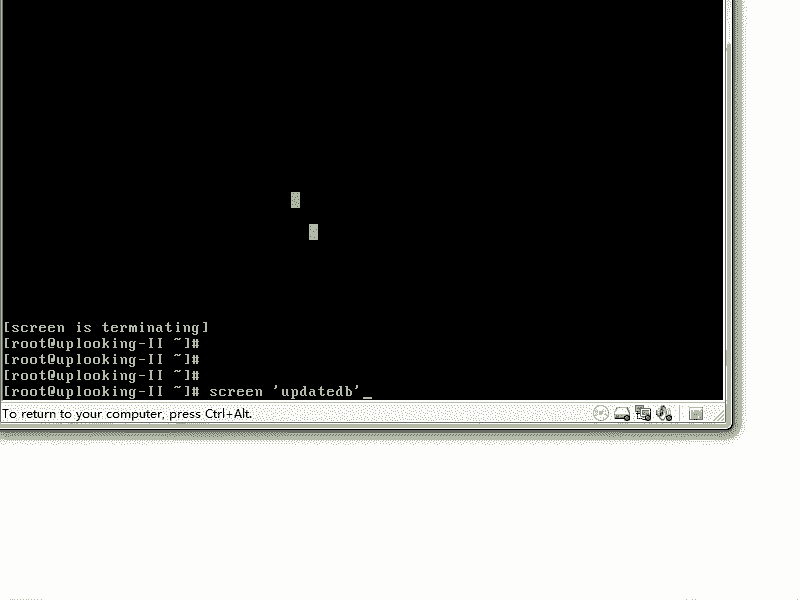
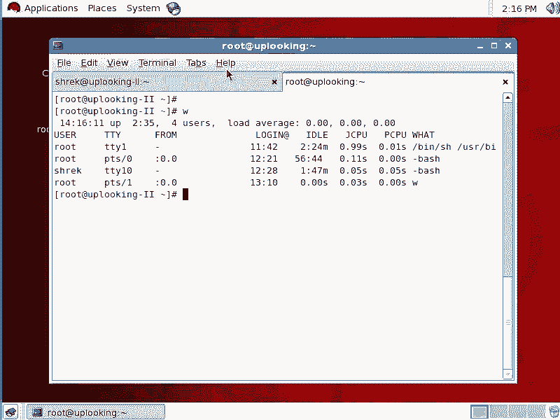
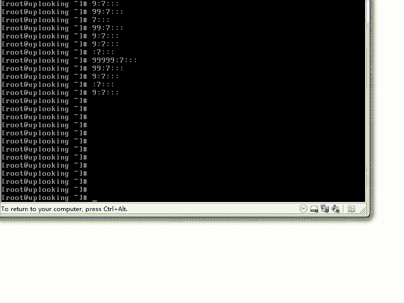

# 尚观Linux视频教程RHCE：P35：RH133-ULE115-1-4-screen-文本控制台的窗口操作 🖥️


## 概述
在本节课中，我们将要学习一个在Linux文本控制台下非常实用的工具——`screen`。它是一个终端窗口管理器，允许你在一个终端会话中创建多个虚拟窗口，并且最重要的是，它能让你的会话在断开连接后依然在后台运行。这对于管理远程服务器或执行长时间任务至关重要。





## 为什么需要Screen？🤔
上一节我们介绍了基本的文本控制台操作。本节中我们来看看一个常见的问题：当你通过SSH远程连接到一台服务器并执行一个耗时很长的命令（例如数据库备份 `updatedb`）时，如果网络突然中断，你的SSH连接会断开。作为SSH shell子进程的那个长任务也会被终止，导致任务失败。`screen` 就是为了解决这个问题而生的。

**核心概念**：`screen` 创建一个**独立于当前登录会话的持久化终端环境**。即使你断开连接，在这个环境中运行的进程也会继续执行。

## Screen的基本使用 🚀
以下是启动和管理一个基本screen会话的步骤。

### 1. 启动Screen
要启动一个新的screen会话，只需在终端中输入 `screen` 命令。
```bash
screen
```
执行后，你会感觉进入了一个新的终端界面，这实际上是一个screen管理的虚拟窗口。

你也可以在启动screen时直接让它执行一个命令：
```bash
screen -S "任务名称" bash -c "你的长命令; exec bash"
```
但更常见的做法是先进入screen，再执行命令。

### 2. 从Screen会话中分离（Detach）
这是screen的核心功能。你可以随时离开当前的screen会话，而让其中的程序继续运行。
**快捷键**：按下 `Ctrl + a`，然后松开，再按 `d`。
这个操作会将你从当前的screen窗口“分离”出来，回到启动screen之前的终端界面。但screen会话及其内部进程仍在后台运行。

### 3. 恢复Screen会话（Reattach）
当你需要重新连接到一个后台运行的screen会话时，使用以下命令：
```bash
screen -r
```
如果只有一个screen会话，它会直接恢复。如果有多个，它会列出所有可恢复的会话，你需要指定会话ID或名称。

### 4. 列出所有Screen会话
如果你想查看当前有哪些screen会话在运行，可以使用：
```bash
screen -ls
```
这会显示类似 `1234.pts-0.hostname` 的列表，其中 `1234` 是会话的PID。

### 5. 恢复到指定的Screen会话
当有多个会话时，使用 `screen -r [PID或名称]` 来恢复特定的会话。
```bash
screen -r 1234
```

## 在Screen会话内管理多个窗口 🪟
一个screen会话内部可以创建多个窗口（类似于图形界面下的多个标签页），这在进行多任务操作时非常方便。

以下是管理screen内部窗口的常用快捷键（所有快捷键都以 `Ctrl + a` 作为前缀触发）：

*   **`Ctrl + a` 然后 `c`**：**C**reate，创建一个新的窗口。
*   **`Ctrl + a` 然后 `n`**：**N**ext，切换到下一个窗口。
*   **`Ctrl + a` 然后 `p`**：**P**revious，切换到上一个窗口。
*   **`Ctrl + a` 然后 `0-9`**：直接切换到第0到第9个窗口。
*   **`Ctrl + a` 然后 `d`**：**D**etach，从当前会话中分离（注意，这是分离整个screen会话，不是关闭单个窗口）。
*   **`Ctrl + a` 然后 `k`**：**K**ill，关闭当前的窗口。会提示确认。
*   **`Ctrl + a` 然后 `\`**（反斜杠）：终止整个screen会话及其所有窗口。

## 实际应用场景示例 💡
假设你需要远程编译一个大型软件：
1.  SSH连接到服务器：`ssh user@192.168.1.100`
2.  启动一个screen会话：`screen -S compile`
3.  在screen中开始编译：`make -j4`
4.  按下 `Ctrl + a`，再按 `d` 分离会话。现在你可以关闭终端，甚至断开网络。
5.  几小时后，重新SSH连接到服务器。
6.  恢复之前的编译会话：`screen -r compile`。你会看到编译进程仍在进行或已经完成。




## 总结
本节课中我们一起学习了Linux下强大的终端复用工具 `screen`。我们了解了它如何解决远程任务因连接中断而失败的问题，学习了启动会话、分离、恢复以及管理内部多窗口的基本操作。记住核心的 `Ctrl + a` 快捷键前缀和 `-r`、`-ls` 等命令参数。对于系统管理员和开发者来说，熟练使用 `screen` 是提高远程工作效率、保证任务稳定执行的必备技能。