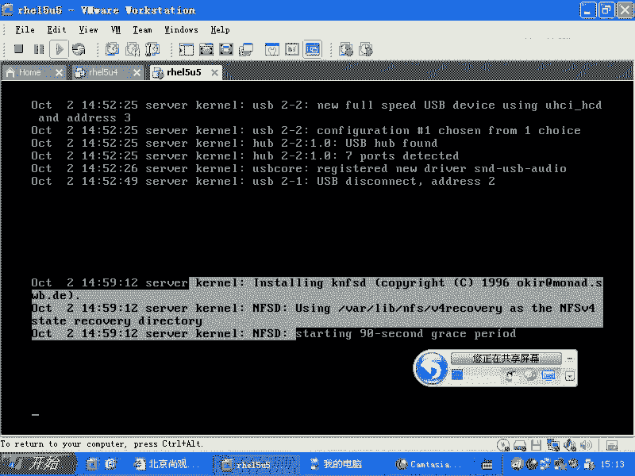
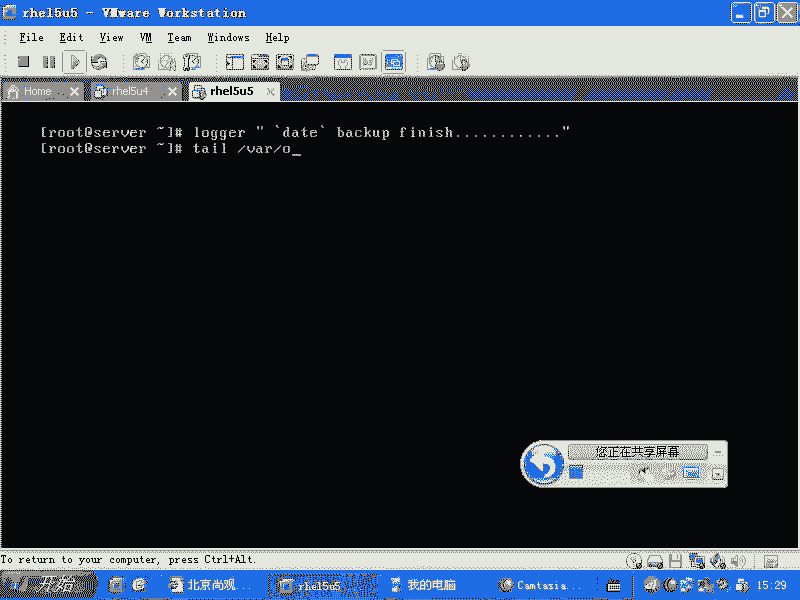
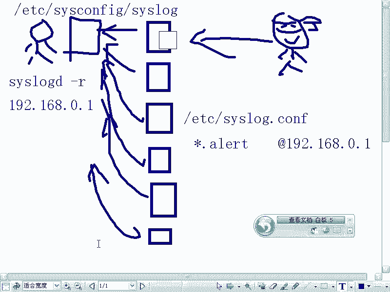
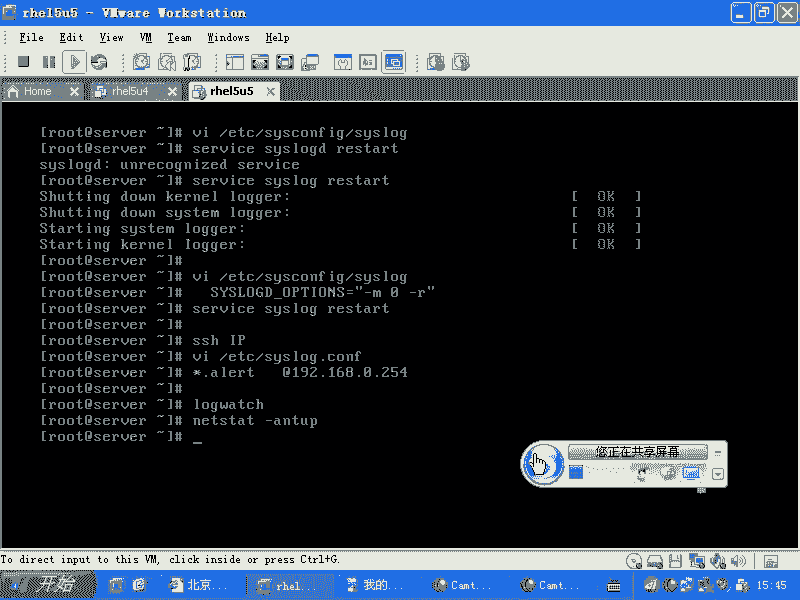

# 尚观Linux视频教程RHCE 精品课程 - P36：RH133-ULE115-3-1-syslog - 爱笑的程序狗 - BV1ax411o7VD

O我们现在开始的话呢，就是介绍一下。深入一下，就是我们lininux系统的各个子系统。就是我们刚才说过了，windows，你如果要是拿到一个windows以后，最习惯的是什么？最习惯的是。😡。

图形界面是不是点控制面板。进行这些控制，进行那些控制，是不是？现在假如说你拿到一个windows7啊，windows因为windows2008serv好像是可以不用什么，不用启动同讯界面的，对不对？

那当你不用启动通讯界面的时候，你再拿到一个windows，你在干什么？想去管理用户是吧？用户系统想去管理什么呢？包，那就是包管理系统，也就是RPM或EM系统，是不是你要想管理什么呢？

网络有网络子系统是吧？记录日志日志子系统。这些东西的话呢，就是我们在这章的话呢要讲到的内容。也就是说我们现在的RP就是我们的这个linux话，我们现在看我们想管理这个linux系统。

有一些子系统是必须要熟悉的。而且的话呢，针对服务器的话呢，你要有针对性的什么针对性的这种这个呃就是加强。你比方说我们在windows里面我们可能从来不考虑计划任务，是不是？

在windows里面从来不考虑计划，因为什么呢？你的机器的话呢，三天两头的话，谁知道你什么时候开呢？有时候开有时候关是吧？但是服务器你说我今天想起来我开一下，明天想起来我关一下，那这服务器就不叫服务器。

所以它必然有些周期性执行的东西，这就是计划任务系统。😊，还有的话呢服务器。突然的话呢有人攻击你是吧？那你你如果要是再维护一个windows的机器，或者你就在windows机器旁边，你的机器很慢。你说。

谁拷我文件呢，是不是或者谁攻击我呢，对不对？😡，杀毒软件怎么又不正常？但是呢服务器是放在机房，你怎么知道什么时候出现什么问题，是不是？这个时候的话你自然就要求要要做什么呢？你自然的话就要看一个什么呢？

它整个的一个过程，整个的一个状态。所以这时候的话就要什么呢？日志系统，是不是？所以这两个系统的话呢，就是我们要介绍一下啊，OK我们看一下，如果要是你现在看到这个日志的话。

我们知道哇下的log目录下有大量的什么这种日志。这种日志的话呢，我们。😊，从我们应用的角度，我们不考虑这些文件到底干什么的啊，我们现在有一个需求，我想看我这个服务为什么没有起来。😡，看哪个文件。

我们一般看日志的话是tail是吧，就是看这个文件的最后几行。如果要是你想一直监视的话，就是tell杠F是不是哇下到log当中的messages。那么如果这样的一回撤以后，那么别人有什么操作？

就是说对这个对这个系统化有什么样的操作啊，我现在的话呢在另外一端，我重启一个服务，service是吧？serviceHTTPD star。😊，刚才没有共享啊。

就是说我现在的话呢service hTTPD restartstar是吧？我再重启这个服务。而呢我另外一端的话是怎么样呢？我另外一端用telllnet。😊，啊，用tail偶啊，不是特代。

用tailll命令，然后呢tailll杠F的话呢来看这个mesages这个文件。那么它应该的话呢会有响应。这样怎么没有响应，我看一眼service啊。HTTVD star。对，现在我重启了一个服务以后。

这边的话呢就实时有消息，是不是？这就是我们同常查看日志的方式，就tll杠F。而我们tll杠F后面的跟的这个message这个文件的话，基本上是所有的话呢，这种系统信息首选的一个发泄窗口。

他们有什么问题的话呢，他们首先会记录在这里面，这是首选的一个日志日志文件。那么message这个文件的话呢，我们一般我的话我会看什么呢？服务有问题。

服务启动有问题，我首先会看这个文件明白吧？那么我们以前的话会给大家讲到过什么？假如说你这个系统的话呢，有人不断的进行暴力破解，或者SSH登录有问题。记不记得我在排除SSH的问题的时候。

我看message里面没有东西，对不对？那我看的是什么呢？secre是吧？这是跟安全相关的验证相关的，还有什么pm相关的，就是验证机制相关的这些东西，对吧？这是特权使用验证机制啊。

添加账号等等这些东西相关的。那么还有什么呢？如果要是你现在在排除的是mail方面的问题。那毫无疑问是么？外下的log当中的mail log。😊，是不是发邮件怎么发不出去？发这个邮件，我在调试的过程当中。

它总是出问题是吧？什么原因啊，就是这样的一些东西。😡，还有什么呢？😡，大家还有些什么样的需求？像剩下的话呢，我们有很多的日志啊，就是子系统的日志mail实际上就是一个子系统是不是？email子系统。

那现在的话呢，apache服务器出现问题了，appache服务器出现问题了啊，那么我一般会看什么呢？我会看如果要是RPM安装的。

那么就是下的呃log当中的什么HTTP当中的什么arrow logarrow下下log，对不对？是ache的出现问题。那么如果要是我们另外的一个就是RPM啊就是。😊。

就是默认就是我们用那个点杠confi makeake making store编译安装的方式。安装出来的这种apartache。那它的话呢就是在那个相应的目录下是吧？你安装到哪了，这个我就不管了。

安装到了那个目录下的什么log目录下啊，log目录下也是有什么arrow。😊，下不线log。那么如果要是你想去排除my circlecle的问题。买 circlercle的问题的话呢。

一般是在它的什么安装目录下的什么呢？安装目录下，它的安装目录下的话呢，如果要是不同版本，它的目录是不一样的，一般是在它的安装目录下的什么呢？就是哇目录下会有一个什么呢？会有一个叫做。

以你的文呃以你的这个呃主机名命名的。比方说你的主机名叫什么呢？uplook是吧？点com这是你的主机名uplooking点com点什么ERR，这是它的什么arrow啊，就是错误的日志，明白吧？

这是my circlercle的子系统，它的这个错日志，这都是很有用的。你很多时候的话，你去启动myscle哎启动不起来。钻耳挠腮的是吧？在网上搜啊搜啊搜，就是看日志，这是我们习惯的方式，对不对？

那么大家注意的一点就是什么呢？像这些日志啊，这些日志都是通过他们自己的独立的日志系统去写的。也就是我买思克我自己去写日志，是不是？但是我不是通过什么系统日志。而上面的这种系统日志的话呢，有很多。

你看往下的log下面的话呢，很多都是。通过公用的日志系统，这个公用的日志系统的话呢，它是叫做什么呢？就叫做ss log机制啊，ss log机制。这个ss log机制的话呢，它包含着两个组件。

一个组件叫做什么呢？K。Lock。啊，D另外一个叫做什么？ss logD啊，那么K log d相应的东西的话，你可以通过man。Rs log来看到啊，那么s logD的话是什么？man。三啊slog。

啊，这样的来看到。所以的话呢这个就是两这一个日志系统包含着两个程序是吧？一个程序KK开头的是表示什么？大家要敏感起来，P开头表示什么？可开头的。科do是不是，也就科do的日志。那大家知道啊。嗯。

假如说给我们一个软件，这个软件呢要运行，它是不是必然要基于很多很多的库啊？是不是？那么如果要是我现在这个软件的名字啊，不是普通的软件，而是就叫做什么操作系统本身的内核。你觉得他能基于库吗？

操作系统本身在运行的时候，是不是他连文件系统都没有找到，对不对？它何来酷啊？所以的话呢所有的话呢，科l相关的东西，它都是不依存于库的。所以它这个时候的话呢用到的是key logD的话。

它就不是sslog那一套体系。它是由kl直接往里面去写东西，明白吧？所以他们两个必然要两个文件，明白不明白？所以知道这个体系以后的话呢，我们知道啊K logD。K logD它会写到哪儿呢？

你可以通过一个程序的话呢，看kil的日志叫做de messages。啊，D message啊D message你可以直接输入什么呢？D message啊，直接回车看日志的缓存。

也就是说在内核当中的日志缓存。而K logD的话，实际上就把那个日志缓存记录在一个文件里。这里面会放什么东西呢？设备的情况。比方说有一个人说老师啊。😊，我这个网卡怎么不能用是吧？我好几次的话都不能用。

突然就坏了。这种信息的话呢，你到什么K logD当中，因为那是设备相关的是吧？哎，我这个USB的U盘插上去以后，怎么没有反应？你想看你想问我，老师，我这个USB插上去以后，内核到底有没有响应啊？😡。

看谁呀，看D message啊，那么所以的话呢D message还有一个配置文件叫什么呢？啊，还有一个日志文件叫什么呢？Y下的log当中的什么D message明白吧？这就是记录，一个是产生。

直接把缓存显示出来，另外一个是把缓存写到一个文件里面，明白了吗？啊，这个机制清楚了没有？😊，清楚了，那么我们如果要是想去看s dog。Dss logD它所对应的配置文件是什么呢？

ETC下面的ss log。点com。是slo点com是吧？还是slocom点com啊，我这样试一下就知道了。😊，ss log点com是不是？这是ss logD独有的配置文件。

也就是说我们现在看到的上面的这些东西啊，比方说messages。😊，seecure还有什么呢？me log等等这些东西，它是写到什么？他是谁写的呢？sslogDslog它是通过哪个文件去配置呢？

通过这个slog去配置的，明白了吗？那么他们两个共同的文件啊，就是K。落个地。和ss log它们两个的共同的配置文件是谁呢？是ETC下面的。😊，SYSC呃s卡 fake当中的什么？Slog。啊。

他们两个的共同配置应该是这个明白了没有？明白了啊，那么这里面的话呢，我们就要就是给大家做一个这种呃，就是说相当于把他那个详详细细的信息的话，全部都给大家弄出来啊，给大家说一下。好。

我们搞清楚这个体系结构了以后啊，我们来看一下slogD它到底是怎么回事的。这个不管是你们做开发也好，还是做什么也好，都需要知道。😊，ss logs log它本身的话呢是一个库。也就是说呢。

当你想去写日志的时候，那么你的应程序就要调用这个库。但是呢我们ss logD的话呢，就相当于在法庭上的一个书记员啊，这个时候的话呢，被告说什么被告说。12345。

这时候呢这个书记员就开始写写在一个本子上。这个本子的话呢，就是我事先约定好了，说被告说的东西全部都放在什么呢？那个本子上。然后呢，这时候原告说什么什么东西，这个时候我放在原告的本子上。

这是不是有个原约定的俗成，是不是？那么s log的话就负责接收这个信息，并且要把它写到文件里面，这就是它的作用，那他该怎么去写呢？所以它的配置文件的话。

我们要看一下VIETC下的什么ss log点com。啊，ss log点com的话呢，这就是它的配置文件。ETC下的ss log点com啊，在下面的话有啊在下面有。s点com呢这里面的格式的话呢。

大家就看到了。当有一个人去写这个日志的时候啊，写这个日志的时候，他的话呢有权利告诉呃，就是他他有必要告诉这个sslog两样东西，一样是这个内容，就是它的类别是什么？比方说我。让书记员去写，我说。原告。

级别是什么呢？还有个第二个属性是级别，级别是什么呢？记录啊，就是普通的记录。那这个这个时候的话呢，就是呃你说看。特权相关的是不是？点星就是所有的内容全部都记录在哪。

Y下的log当中的什么seecure这个目录当中，在这个文件当中是吧？这就是为什么我们看到seecure里面它的信息怎么那么丰富，而且全都是跟什么认证相关的原因是吧？那么这个格式是什么呢？

首先这是什么什么啊，内容是什么，然后这边是级别，级别是什么？级别的话呢是有很多级别的，典型的话呢表示所有的级别，明白吧？所有的级别。😊，那么这个级别有哪些呢？你可以看一下啊，可以看一下。

我们看一下man是吧，ss log啊，我们看一下man3吧啊。3slog在这里面的话，我们看一下啊。日志的级别的话呢，我们看它这是日志的内容，日志的级别在下面。这是这个级别的话呢，大家看一下。

有最最啰嗦的级别是debug级别啊，最紧急的级别的话merge级别。这个表示说有一个程序，它因为遭受到了致命的错误，导致它有问题。他最后发出了一个消息是什么呢？说。啊。文件找不到了。

或者说我的这个这个数据文件。比方我这个数据库啊发出个消息，说什么我的数据库文件都丢了，我不得不什么终止，他发出了最后这个消息，是不是？这个话是最紧急的消息，表示导致它已经没有办法继续进行。这个安全呢。

就是就是这个紧急的情况紧急到这种程度程度。那么当然了，还有什么报警，说什么呢？啊，你的这个硬盘容量是吧？已经到了什么？就是已经使用了95%了，那么这是个报警，对不对？还会有什么呢？就是。

像什么呃值得注意的信息，错误警告是吧？还有一些什么呢？标记或者说呢信息，还有就是说debugdebug是什么呢？就是一般我们不会用。那么普通的级别就是info啊，debug级别是什么呢？就是我们。😊。

有一个人的话呢做喜欢做笔记是吧？比方说我做笔记，我的话呢喜欢说我到商场买了一件东西是吧？我坐上了公共汽车是吧？然后呢，我想去什么呢？我想去吃饭，然后吃的什么饭，这是我记笔记。

那么这都是info级别以上的是吧？突然。啊，我摔了一跤，我说好疼啊，是吧？这是一个什么？这是一个报警是吧，或者一个事件啊，那么结果的话呢，小明的话呢，他记笔记这样记。

左腿卖了左腿卖了右腿卖了左腿卖了右腿。也就是他的话呢在路上走，他不是说我在走的路上，我说卖左腿卖右腿，这是分析神经病的日志，是不是？所以的话呢这是在你最最需要分析这个程序到底有什么细节的问题的时候。

需要debug级别的，对不对？那一般情况下的话呢，这日志你是没有必要用debug级别。你说我去中午吃了什么饭是吧？然后呢，我去坐坐车回家是吧？这都是很正常的。那么这是小张记的笔记。那么小明的话呢。

因为刚从精神病院出来，我们要分析他到底有没有什么问题的时候，那么我们这时候用debug级别，明白了吧？😊，所以我们现在回过头来再看啊，也就是说我要产生一个日志的话呢，必须是什么？你比方说我是计划任务。

计划任务的这个呃程序的话叫做Cown D是吧？Cown D要产生一个任务，它执行一个任务的时候没有成功，那么它就是什么呢？Cown相关的什么日志啊。😊，你word级别的是吧？😡，基一，我忘了啊。

该怎么写？就是em级别的，就是说我们的就比较紧急的这种情况。然后这个日志的内容是什么呢？它就是比方说ABC这样的一串东西，它就发送出来。所以这个日志总是这个样子啊，总是这个样子。所以回过头来以后。

他让我们再去看啊，那么当我们的这个书记员接到这个日志了以后，他怎么写呢？你看星点info表示什么呢？所有的。😊，不管是谁发出的信息，只要是什么info级别及info级别以上的。😡，日志明白吧？

那个点的话就表示什么？😡，这个日志级别哈之上的所有的级别日志。是吧实际上的话就是说。所有人写出来的info级别以上的日志及info级别的日志全部都写在哪儿？message这个文件里面。

所以这就是message里面为什么那么综合看那么多东西的原因，明白了吧？就是message4咱们可以看到很多很多信息，就是因为所有人的info级别以上的日志的话，全部都写在里面啊，全部都写在里面。

也就是说我们debug级别不写，其他都写。但是除了什么？😡，除了什么呢？😡，除了mail的日志，mail点呢。除了特权使用，除了Cown啊，其他全都写了，明白了吧？就是这样。然后还有的话呢就是什么？

还有的话呢就是说特权使用的写在这个里面md写在这个里面，然后呢，Cown的写在Cown这个日志里面啊，所有的inin级就是emode级别的这个日志写在所有的地方，是不是实际上的话就是说写在哪呢？

写到我们的这个所有的控白里面。😊，都写出来，这就是我们的这个日志啊，它的这个内容写法明白吧？好，我们现在这个清楚了。那么现在你想不想自己记录一条日志啊，然让我这样的loger。是吧说OK来看。😊，哎。

finish怎么写的？这样呢。我们总是感觉。给本金有了。比方说你写了一个备份的脚本是吧，写在需要脚本里面是不是？然后呢，你这边的话呢，加上一个什么呢？😊，是不是？对的。这样的写完了，那这样的话。

你的系统日志当中就会多这样的一条东西啊，我们看一眼tailil one下的log当中的什么？

你看到说这个时间是不是大家看完成了，是不是？嗯那当然你可以用这次的话呢去产生分钟啊，什么小时分钟这样的给它显示出来，是不是？然后这个如果要是备份出现问题了，经过一个判断说。😊，完蛋了是吧，不行了。

那这时候他报错，那么你可以让日志的话呢写出来，明白吧？这就相当于让用loger这个进程，然后调用什么呢？slog这个数据源，让他去记一个什么东西，明白了吧？这个的就是loger。

最好玩的并不是这个东西啊，最好玩的并不是这个东西，好玩的是什么呢？就是它可以进行远程日志啊，进行远程日志。我给大家画下。我给大家画一下啊。看一下。那么我先停止共享啊。你企业通流了。ok。

假如说现在的话呢，有一个有一个这种呃。机器啊，那么比方说现在这种情况。你们公司的话呢大约有20多台机器。二台机器这二台机器的话呢，只有一个人。就是你。啊，去维护。这20台机箱，每一个机箱有4块硬盘。

是吧嗯然后哪块硬盘他满了以后你有办法吗？你怎么知道？那我每天的话呢，我尽心尽责是吧？我每天的话呢，看二台机器上，那个硬盘有没有满，是不是？然后呢，我再看二台机器上的话呢，什么有没有入侵的痕迹，对不对？

我用RPM杠D看一下，是不是基本上你一上午的话呢，能干成这些事情就不错了。是不是所以他一般的公司不是这样玩的。假如说有一个公司，这个公司的话呢，他。在新浪上做广告，他花了一天啊。

花了2万块钱在新浪做了广告。还有呢还是这个公司，他又做了一个广告。他这个广告的话呢。在。我自己的个人主页上是吧，做了广告，然后他给我1万块钱，我给他做了20年。是吧。哪个地方点击过来的流量多啊？

是不是我要分析啊？我分析的时候，它呢可能就有日志分析或者这些用户在这上面点击了哪些网页啊，这个时候的话呢，我要日志分析的时候，就是特定的应用程序的日志。这种日志的话呢，它就不是这样的机制了，明白吧？

你方说这种机制的话呢，一般如果特别大量。比方说你是新浪或者搜狐的话，那你的这个日志分析的话呢，都是在当地进行，在当地进行，然后再把结果汇总在一台机上，它跟这个slogg是完全没有关系的。明白了吧？

千万不要做的一件什么事呢？就说我这个日志我明明知道一天的话，访问量大约是1亿或者说几千万是吧？结果我把这些日志全部都写到后面日志服务器上。那你整个的这个网络简直是慢的，就是这个系统上慢的是一塌糊涂。

因为网络传输是不是耗费你的CPU啊？因为CPU最耗费，就是最费CPU的是什么呢？让CPU在那边等。CPU可太快了是吧？一秒钟进行什么3G次的什么运算是吧？结果的话呢，你让他去通过网络去传入数据。

他要等很长时间。这个时候你CPU的消耗是非常高的，明白了吧？别管你的网络速度多快，它都是消耗非常高的。所以这边的话呢，千万不要把大量的数据往后面去写，你可以写一些什么呢？

比较紧急的或者报警的这种消息写到后面去，不要想着把应用程序产生的大量数据往后面去写，明白了吧？就是远程日志体系，清楚楚没有？😊，清楚了啊，然后我们再看。😊。

啊。前端有验证。在差23。啊，没有验证。对，那么现在的话呢，我来我唉你们的机器的IP地址是多少？我现在应该哎呀我现在还。😊，还拼不通大家。还拼不通是吧？那么如果要是我是一台服务器的话呢。

我这样的VIETC下我是日志服务器ss confi当中的什么ss log。😊，在这里面。别把杠R加到杠M和零之间啊，很多人都喜欢这样加。跳完以后，人家杠M0是表示什么呢？不要进行mark。不要进行骂。

什么骂呢？就是44到和假属。不是你会不会认为？他不会认痕是吧，结果一个月都没有产生任何。话的话，所以。他吃东西吧。没。た。我不。不是不要等。他就。

