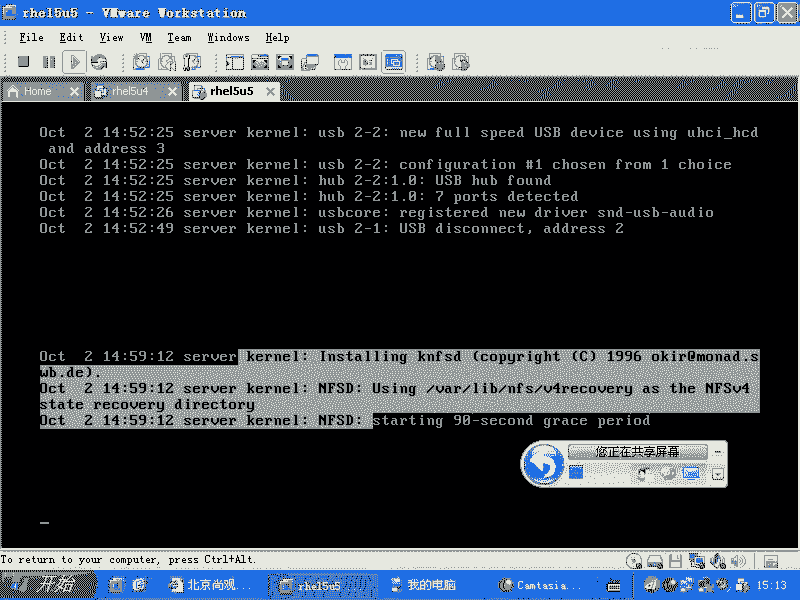
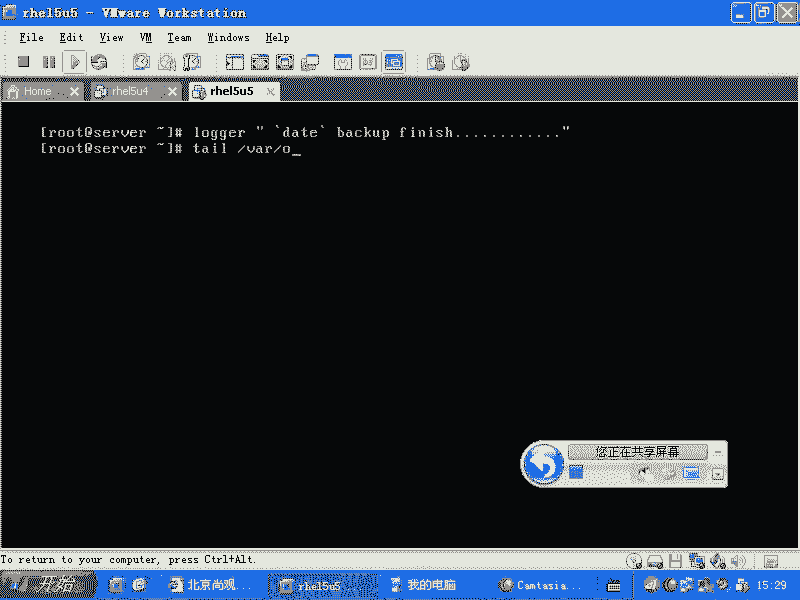
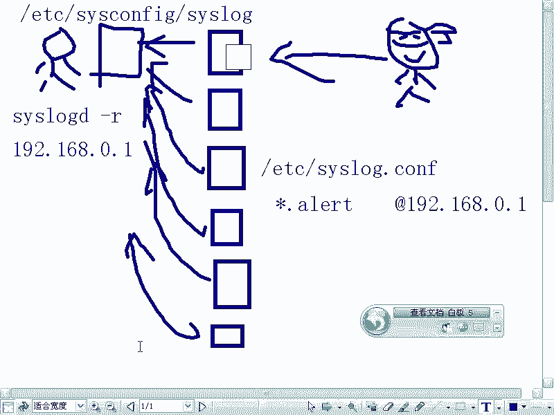
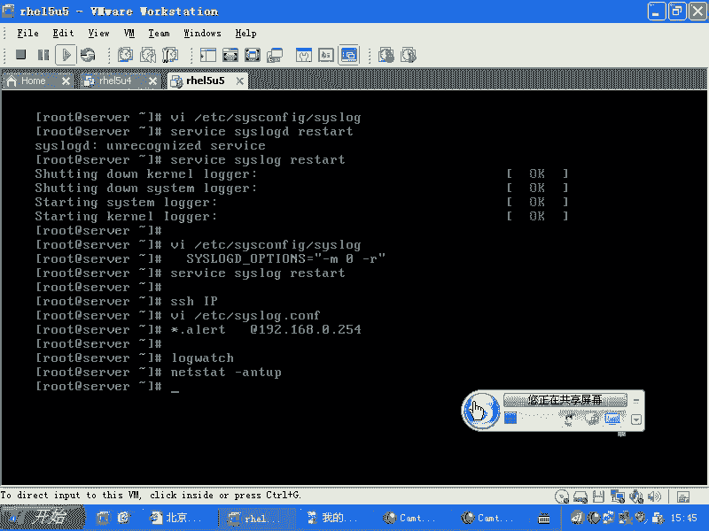

# Linux系统管理：P36：日志系统syslog详解 📝


在本节课中，我们将深入学习Linux系统的一个重要子系统——日志系统。日志是系统管理员的眼睛，它记录了系统运行过程中的各种事件，帮助我们诊断问题、分析性能和安全审计。我们将重点介绍syslog机制，了解其工作原理、配置方法以及如何在实际工作中使用它。

---

## 日志系统概述

上一节我们介绍了Linux系统的各个子系统，本节中我们来看看日志子系统。对于服务器而言，日志系统至关重要。服务器通常放置在机房，管理员无法实时感知其状态。当服务器遭受攻击或服务异常时，日志系统能记录下整个过程和状态，为故障排查提供依据。



在Linux系统中，`/var/log`目录下存放着大量的日志文件。我们通常使用`tail`命令查看日志的末尾，或者使用`tail -f`命令实时监视日志文件的变化。

## 核心日志文件

以下是几个关键的日志文件及其作用：

*   **`/var/log/messages`**：这是系统信息的首选记录文件。服务启动问题、系统级事件通常会记录在这里。
*   **`/var/log/secure`**：记录与安全认证相关的信息，如SSH登录尝试、特权使用验证等。
*   **`/var/log/maillog`**：记录邮件子系统（如Postfix, Sendmail）的相关日志。
*   **`/var/log/httpd/`**（RPM安装）或Apache安装目录下的`logs/`：记录Apache Web服务器的访问日志和错误日志。
*   **MySQL日志**：通常位于MySQL安装目录下，文件名格式为主机名`.err`，记录数据库的错误信息。

需要注意的是，像MySQL、编译安装的Apache等服务的日志，通常由它们自己的独立日志机制写入。而上面提到的`messages`、`secure`等文件，则是由一个公共的日志系统——**syslog机制**来管理的。

## syslog机制架构

syslog机制包含两个核心组件：

1.  **`klogd`**：内核日志守护进程。内核在启动初期，文件系统尚未就绪，无法依赖外部库。`klogd`负责捕获内核的日志消息（如设备驱动信息、硬件状态），并将其写入文件。查看内核日志可以使用`dmesg`命令（查看内核环缓冲区）或查看文件`/var/log/dmesg`。
2.  **`syslogd`**：系统日志守护进程。这是一个依赖库的应用程序，负责接收来自用户空间各种程序（通过调用`syslog`库）的日志消息，并根据配置规则将它们写入不同的文件。

它们的配置文件如下：
*   `syslogd`的配置文件：`/etc/syslog.conf`
*   两者共同的配置文件：`/etc/sysconfig/syslog`

## 理解syslog配置

`syslogd`就像一个法庭书记员。应用程序（原告或被告）产生日志时，需要告诉书记员两件事：**设施（facility）**和**优先级（priority）**。书记员根据预先约定的规则（配置文件），将不同设施和优先级的陈述记录到不同的本子（日志文件）上。

我们通过查看配置文件来理解这个规则：
```bash
vi /etc/syslog.conf
```
配置行的基本格式为：
```
设施.优先级         动作（通常是文件路径）
```
*   **设施**：标识日志消息的来源，如`auth`（认证相关）、`mail`（邮件）、`cron`（计划任务）、`*`（所有设施）。
*   **优先级**：定义消息的紧急程度，从低到高依次为：
    *   `debug`：最详细的调试信息。
    *   `info`：一般性信息。
    *   `notice`：需要注意但非错误的情况。
    *   `warning`或`warn`：警告信息。
    *   `err`或`error`：错误信息。
    *   `crit`：严重情况。
    *   `alert`：需要立即采取行动。
    *   `emerg`或`panic`：系统不可用，最紧急。
    使用`.=`表示只记录该优先级，`.=`表示记录该优先级及以上的所有优先级。
*   **动作**：通常是指定日志文件的绝对路径。

例如，配置行：
```
*.info;mail.none;authpriv.none;cron.none                /var/log/messages
```
表示：将所有设施（`*`）的`info`及以上优先级的日志，写入`/var/log/messages`文件，但排除（`none`）来自`mail`、`authpriv`、`cron`设施的日志。

## 手动记录日志

我们可以使用`logger`命令手动向syslog系统添加一条日志记录。这在脚本中非常有用，可以记录脚本的执行状态。

例如，在备份脚本成功完成后，可以添加：
```bash
logger “Backup job finished successfully.”
```
执行后，这条信息会根据其设施（默认为`user.notice`）和优先级，被写入相应的日志文件（如`/var/log/messages`）。

## 配置远程日志



在企业环境中，管理数十上百台服务器时，逐一登录查看日志效率极低。syslog支持将日志发送到远程的中央日志服务器进行统一存储和分析。

配置分为客户端和服务器端：

1.  **日志服务器端**：编辑`/etc/sysconfig/syslog`文件，在`SYSLOGD_OPTIONS`变量中添加`-r`选项，以允许接收远程日志。然后重启`syslogd`服务。
    ```bash
    # 修改配置，例如：SYSLOGD_OPTIONS=“-r -m 0”
    service syslog restart
    ```
2.  **客户端**：编辑`/etc/syslog.conf`文件，在任意配置行的动作部分，使用`@`符号指定日志服务器的IP地址或主机名。
    ```
    *.emerg @192.168.1.100
    ```
    这会将所有`emerg`级别的日志发送到IP为`192.168.1.100`的服务器。修改后需要重启客户端的`syslogd`服务。

**重要提示**：远程日志适用于传输关键的、数据量不大的报警或审计信息。切勿将应用程序产生的大量访问日志（如Web访问日志）通过syslog实时传输到远程服务器，这会给网络和中央服务器CPU带来巨大压力。大数据量的日志应在本地处理或使用专用的日志收集工具（如Fluentd, Logstash）进行异步传输和聚合。



---



本节课中我们一起学习了Linux的syslog日志系统。我们了解了`/var/log`目录下常见日志文件的作用，剖析了`klogd`和`syslogd`协同工作的架构，学习了`/etc/syslog.conf`配置文件的语法和规则，掌握了使用`logger`命令记录日志以及配置客户端-服务器模式的远程日志集中管理的方法。理解并熟练运用日志系统，是进行系统运维和故障排查的必备技能。