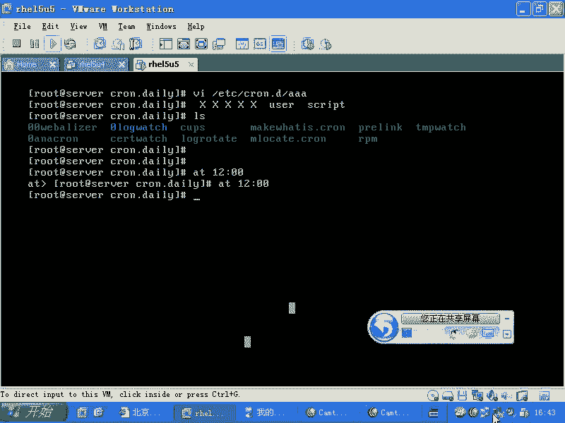

# 尚观Linux视频教程RHCE 精品课程 - P37：RH133-ULE115-3-2-cron-anacron - 爱笑的程序狗 - BV1ax411o7VD

好，现在我们看一下计划任务。计划任务的话呢，在lininux里面的话，实际上是有呃两个体系。然后呢总共三种啊，一种的话呢是什么呢？一种是艾D，就是非常简单的艾D的话呢，一般我一上装完了工装完了机器以后。

我就直接怎么样check on这个艾D什么off，我就直接把它关掉。因为我从来不用啊，因为我从来不用。那么为什么不用它呢？因为的话呢它是一次性的，或者说它执行这个任务的话呢，太轻量级。

没有那么多可以控制的东西啊，我们的话呢对艾来说是可有可无。但是呢我们另外一个的话呢，就非常的重要，就是什么呢？cro。😊，Cown的话呢它叫Cown D在后台有个进程叫做Cown D啊。

那么我的话呢肯定要用它Cown的话呢，它是这样的两个体系。第一的话呢叫做什么呢？CD第二个的话呢叫做an crown啊。这两个的话呢，一个是什么呢？就是周期性的执行计划任务。另外一个是什么呢？

另外就是说当我。本来要去执行它的时候，结果却没有执行的时候，他就帮我什么把前面那次补回来啊，就是an啊，你要把这两次。第二任务，比方说我每天晚上的凌晨4点02分，我要做一个什么什么事情。

每一天晚上的4点02分，我都要做个事事情。但是呢如果要是你把这个linux装在了自己的台式机上，那么你难道半夜的话经常开着电脑？对吧你说我就是开的，但是毕竟是少数，对不对？

所以的话一般服务器没有这个问题，但是台式机的时候，它也装lininux的时候，它就会有这个问题。我每天晚上4。02分要帮你清TMP幕录像那些临时文件，是不是我要帮你截段日志是吧？结果的话呢。

你每一天的话都关机。那这样的话，你的机器硬盘不是会被撑满吗？到时候你骂的是谁呢？肯定是rightite的，什么破系统是吧？薄硬盘都充满了，对不对？所以这时候的话你要怎么样要有一个工工具。

然后它可以的话呢，弥补弥补这些东西。在你没有开机，总是去执行这个任务的时候，它帮你自动执行。所以他要这住antcro。那么Cown的话呢，它在也就是说我们现在讨论的话呢，就是craown本身的话。😊。

它实际上是有两个操作啊，第一个操作是什么呢？第一个操作是什么？个人啊，就是user的框。还有一个是什么呢？就是我们可能用的最多的就是什么。😊，system是吧？如果要是用用户自己去用Crome的时候。

他是怎么用的？它是用Cme。table啊groundown table啊杠1，然后去编辑自己的计划任务。编辑自己的计划人务。那么系统的话呢是什么？

系统的话呢是在什么ETC下的Cme开头的所有的文件夹里面，它的这个计划任务是放在这个。明白了吧。那么所有的Cown的话，它有一个配置文件叫什么呢？落下的log当中的什么Cown。

它可以详详细细的告诉你这个计划任务到底执行的是怎么样啊，这个的话比较重要啊，因为的话呢你半夜要执行任务是吧？鬼才知道它成功没有？😊，所以你要自己看是吧？好，我们看一下C。Cown的话呢。

我们先看个人的计划任务，个人计划任务的话就比较简单了。但是相应的我们就用的比较少啊，相应的我们就用的比较少。比方说我们可以看到V啊呃 crown table杠1。😊，那现在的话我编辑的是自己的计划任务。

也就是12个账号的计划任务。这个账号的话，你一旦编辑好计划任务以后，你不管登录不登录，它都会执行啊，登录不登录它都会执行。这个格式的话统一就是什么呢？前面的话呢有5个位置，全部都是放什么时间啊。

那么由小到大啊，比方说最开始的话是分钟是吧？比方说第一分。比如说第一分钟啊第一分钟。哪个小时呢？如果要是你告诉我的是5呃，就是凌晨的441分钟是吧，或者是凌晨的50。5点01分是吧，就这样写。

5点01分哪一天呢？哪一天呢？那你说。每一天啊星，如果要是哪个月份呢，那么是每个月啊，最后的话呢是一个周啊，星期几。那么比方说每一个。😊，星期是吧，也就是实际上这样写完就是每天的5点01分是吧。

帮我干什么呢？😊，帮我的话呢执行一个back up的脚本，对不对？😊，backup点SH这个backup脚本的话呢，是第一种类型的backup。就是说我的增量。增量。增量备份。也就说每一天的话。

我进行一次增量备份啊，一定要注意的话呢，你这个backup的这个脚本的话呢，它的路径啊要写写全了。比方说是在什么呢？比方说是在你的UUSR下的local当中是吧？定应目录下，这是你自己写这一个脚本。

那么这样写全了。那这个文件的话呢，要具有什么呢？呃可执行权限啊，可执行权限。那么你现在的话呢想去执行另外一个啊，比方说我有另外一个需求。😊，每周的。呃，每周的135的时候啊，我要进行一次完整的备份。

这是增量备份是吧？我要进行完整备份。那么就是一呃每周的这个5点31分啊，5点31分星星星，然后呢，每周的周几呢，比方说每周的周日啊，每周的周日然后进行增量备份。然后这个增量备份的话呢，我如果用。

算上面的话呢，我就不要加这个脚本的名字了啊，我用当普命令。然当命令的话呢是。就跟大家说一下这个备份的啊。😡，DUMP啊杠。啊。3UF是吧，我看一下啊。我我验证一下。啊。可以不要什么。

大家看啊这边我就顺便的话呢，把就是大家比较常用的这样的一个备份工具。这个备份工具的话呢，我们现在用的比较少了，但是你最好还是知道是吧？现在主要的这个工具是什么呢？是tR是吧？😊，是不是他？对吧怕。

但是呢怕的话呢，我们就等一等以后的话，再一会儿的话再说。但是我们先给大家介绍一下老牌的备份工具是吧？隆重登场是吧？当。😊，的话呢，它是unixa常用的一个备份工具，它的好处是能识别分区。

也就是说我这边的话加的是put boot是一个什么目录，对不对？嗯但是我如果加上这样DEV下的SDAE可不可以呢？可以，它能识别这个分区，明白吗？它把分区的信息。

还有就是整个的这个系统的就是上面的文件全部都一块备份。所以这个话就是它的好处，那么我的话呢可能用的比较多的就是but啊，那么这里面的话呢，0UF310123是吧？456，对吧？😊，一直到9吧。

总共10个备份是吧？10个备份级别，这个是什么意思呢？😡，这个是什么意思呢？这个的话大家一定要明白啊，就说当普这个命令他的话呢想去备份的时候，他可以在原来的基础上进行备份，也就是他可以进行增量备份。😊。

啊，那么我如果要是原来这个文件里面的话呢，比方说有三个文件啊，123这三个文件。假如说我在做D3UF进行这个备份的时候。😊，那么备份了36F，那么我备份了三个文件。啊，错了，0UF的时候。

我备份了这三个三个文件。那么我第二天的话，我备份了一个什么呢？3UF。😊，这个时候的第二天这个文件的话呢，比方说又多了一个四和5这两个文件是不是？那这时候的话呢，我第二天做备份的时候。

我做的3UF的时候，它备份的内容是什么呢？它备份的内容就是。😊，四和5增加的两。知道吧？也就是说还是那个文件，也就是同一个文件。那么我第二天在做备份的时候，我这边呃。😊，越说越乱啊。

你看第一天我做0UF的时候，原来有1233个文件，对不对？1233个文件，这时候的话我做了一次什么呢？0UF的备份是不是备份的内容是什么呢？是123是不是？123，那么我过了一天以后，第二天的时候。

我现在这个这个目录下已经有12345个文件了，是不是？已经有4512345个文件了，总共5个文件。那这时候的话呢，我去做了一下什么呢？😊，3UF3UF备份的结果是什么呢？我只备份四和五两。

知道吧因为什么呢？因为0UF。😊，0UF它已经有什么。😡，1233个文件了，是不是？那么我做3UF3是不是比零要大呀？😊，对不对？那么他就在零的基础上做了什么呢？另外两个文件的备份，这就是增量备份。

是不是？那么假如说我在啊。那么整个整个备份的内容的话，就是3UF部分是4和5。假如说我在第三天的时候的话呢，原来有123456啊，也就是第三天的时候的话呢，又多了一个文件。那这时候我要做什么4UF的话。

我要做4UF的话，那我备份的什么内容啊，没有。😊，我就备份6是吧？我备份6。那我想问一下，如果我这个时候的话呢，我备我我不是4UF，而是什么？3UF我备份什么？😡，就是我第三天的时候，我备份的是3UF。

我本来刚才说的是4UF是吧？我就会单纯备份1个6是吧？因为我4比3要什么大一级，我做了一个增量，是不是4比3的一个增量是吧？现在我不做增量，我还做了一个什么3UF，那么将会备份什么？是。对。

对吧这个明白吧？这就是差量备份。也就是说我以第一天的基础，我以后每一天都做什么呢？大于这个基础的什么同级别的备份，那就叫什么差量备份。因为我总是以这个基础。😡，来做一个差异，是不是？😡。

你比方说我周日做了一个完整备份是吧，我备份了三个文件是吧？那么我周一到周五每一天都做什么3UF那这样的话每一天做的是什么备份？😡，差两备份。但是呢我周日的时候，我做了一个什么0UF。然后呢。

周一我做EUF周二我做2UF。周三的话，我做3UF周四我要做什么4UF。那这是什么？每一天对前面一天的什么。增量备份。那这样的话呢，就是备份的内容最少是吧？但是有什么风险呢？就是你恢复的时候，你要恢复。

周日的再恢复周一的再恢复什么？周二的恢复的时间就长。而插样备份的话，是不是你恢复的时间只恢复两次是吧？先恢复0UF再恢复什么3UF。是不是就恢复两次就好了，明白这个道理吧？嗯所以这就是什么呢？

增量备份啊，我这边写的不够清楚啊，假如说第一天的时候。😊，啊，第一天的时候第一天的时候的话呢，我这个内容123有三个文件。那么这个时候的话呢，我备份啊，算了啊，第一天的时候。😊。

我这边有1233个文份呃，三个文件，这个时候的话我做了一次什么呢？0UF这是一次完整备份是吧？这次的完整备份的结果就是什么呢？就是在这里面的话，有1233个文件是不是0F里面的三个文件。

那么第二天的话呢，这个内容已经变到什么呢？如果已经变到12345了，是不是？那这个时候的话呢，我如果还是做0UF的话，0UF也就是说我这个0UF跟上面这个是一样的，是不是同级别的，那么我就会备份什么呢？

12345是吧？或者是什么呢？我还是对同一个文件做，那么我这个时候做的是什么呢？1UF或者只要是大于零的，其他的这个几UF是不是只要大于零的，那么比方说这边是2UF或者3UF那么我这边的话。

备份的结果就是什么呢？只部分只备份四和5是不是？那么到了第三天的时候，我这个文件的话，变成123456了。那么我如果做0UF的话，还是一次什么？😊，完整备份还是123456。如果要是我去做了什么呢？

这个时候我做的是3UF。那么因为的话呢，你这个第二天已经做了一个一次备份了是吧？如果要是3UF的话呢，它是跟零做，就是跟这一次的话呢做这个比较，是吧？跟着零做比较，那么这个时候的话呢。

它就不会管上面已经备份了45，它会替换掉45是不是所以这个时候的话会备份什么呢？456，对吧？但是呢如果要是你只备份的是什么呢？只备份的是一个。😊，4UF也就是说或者说5UF只要是大于三的大于三的。

它就会跟三做对比是吧？那它这个时候只会备份什么呢？6这个文件那么也就是说我如果每一次都做3UF就做的是差量备份，它恢复的时候，不管你做多少次差量备份，只是恢复什么，两次恢复一次。

基本的再恢复一次什么差量的，是不是然后呢，如果要是你是做你方说。😊，做了一次0UF，做了一次3UF又做了一次5UF。那你这时候恢复的话，你要先恢复什么零的再恢复三的再恢复什么5的这就是增量备份，明白吧？

这个的话呢大家就要自己去控制这个备份。因为的话呢很多厂商有专门的什么备份软件，而是用备份软件是很贵的。你方说CACA的话呢。😊，CA好像C andA好像是个服装品牌是吧？CA的话呢是一个软件公司。

它出的叫做accel excel。那这个的话是一个专业的备份软件，它里面这个增量啊，什么差量啊非常的专业，明白吧？那么还有很多像赛门铁克估计也会出，但是我不太清楚了。还有的话呢，甚至的话呢。

就是说呃我记得我有一个就是朋友啊，他的话呢是在国家的什么什么部门的话呢，去工作。他说他们公司他们那个机关就是花钱的时候，买了一个什么全世界最顶级的备份软件。然后呢，这个备份软件，培训费就要10万块钱。

然后呢，要送这个人的话专门到澳洲去培训，培训完以后就操作那款软件，整个全中国也没有几款，没有多少人买这个软件。但是这个软件的话就企业级的话用的非常多。那这边的话只是一个什么准专业级的一个小的软件。

但是已经掠具了什么。备份的雏形是不是有一点专业的特质在里面是吧？比我们那个塔要强多了，对不对？所以这个的话就是这种东西啊，那么在你备份的时候，那么我们现在看，假如说我周日啊我进行一次什么呢？DUMP杠。

😊，连 u f。0UF那么我去备份到哪儿呢？比方说备份到我的一个介指上，比方说我去mount了一个什么硬盘是吧？我另外一看硬盘放在里面，每当晚上的时候，我就自动把它mount上来。

到mount来以后的话呢，叫做什么date啊d。😊，Data。第一。比方说。啊。然后每个月的话呃每一看啊。每个月进行一次切换吧啊，我每个月进行一次切换，就是每个月的话我生成一个文件。

那我这个地方dated，然后呢加上一个反引号是吧？DATE是吧，然后加上一个什么加上一个年是吧？再加上一个什么月，是不是？加上个年，加上个月，然后再点什么DUMP对不对？0UF那么这个时候我去。😊。

也就是我每个月的话呢，我只要运行这个命令，都是针对一个文件进行备份，是不是？这个月内的话，我都是针对一个文件进行备份。😡，然后呢，我备份的是什么呢？假如说我的波特目录是不是我这样的备份。😊，啊，错了啊。

加款。不是我我直接。卡住C都不行了。啊。😮，不是我直接备份到MNT目录下了。😊，我这个不应该这样的，这个MNT我刚才mark了光盘呢。对吧对，肯定这个是不对的。😊，那么我在这里面。我把它粘出来啊。

这样的是吧。我备份了一个文件，是不是这个文件的话在哪儿呢？TMP目录下是不是TMP目录下的呃星点DUMP。😊，这个时候的话呢，这边有一个呀。少百分号是吧？加百分号是吧，写错了是吧？谁是。啊，对吧？对吗？

初二是吧，1010是吧，10年的10月是不是？那么于是的话呢，我这边的这个文件第一次备份已经进行了，是不是？那么我现在的话呢，每一周啊我每一周。这个文件我成功执行了。于是的话呢，我每呃。对。

我每天的话呢进行一次什么？3UF是不是每天进行一次3UF。然后呢，我每一周的5点31分进行一次什么？0个啊是不是？你们看明白了吗？每一天进行差量备份，每一个每一周的周末的时候进行一次是吧？

完整备份是不是然后一个月切换一次是吧？也就是说我一年到头的话，会有多少个这样的文件出现。不对呀。你们看啊这个文件名是M啊。一个月1个文件是吧，一过一个月以后，他就切换另外一个新文件了，是不是？

没不知道不明白吗？会切换呀，我11月的时候我才会切换成1011嘛。12月份的话，我会切到1012嘛，一年过来以后的话会有12个备份。12个备份文件。但是呢不管哪个备份文件，我恢复两次就OOK了，是不是？

是不是？这个清楚了吗？然后呢，你说哎呀这样太浪费了，我周日的话，我明明进行完整备份，你还给我进行一次什么增量备份多麻烦啊，是吧？我这边的话写成什么1-5周一到周五怎么样进行增量，那就是差量备份。

周日的话进行一次完整备份，对不对？😊，是不是？所以这样的话呢，你就做好了这个备份的准备了。那样吧。能理解吗？那当然你自己写脚本的话也是一样的，是不是或者你写成什么呢？哦，不是1-5，是135。

是吧135号了。好不好一样啊。好，那么现在的话呢。就开个玩笑啊，假如说啊你在追一个女朋友，是不是？那么你开始给他写情书是吧？然后呢，你希望表达一下你的这个感觉是吧？然后你写好一封情书这样的。😊，呃。

上班时间。每个小时发一封啊。每个小时啊每两个小时吧。那就星杠2是不是每隔两个小时发一份，是不是？然后呢。诶。从。行。接着该是。每隔2个小时。不管是哪一天哎，不管是哪一天，不管是哪个月份，周一到周是不是？

然后呢，你输入一个什么东西，比方说mail啊，发emailmail杠S啊，你可以这样的cat你的email啊，cat你的email。比方说你之前写好了一个email叫什么呢呃？是吧。这个点TXT文件。

然后呢，mail。什么。是吧。所以说我这个date这个参数的话用的是非常多，是吧？杠S的话是指定主题啊，然后呢那个呃cat那个内容的话呢，将会变成它的什么呢？将会变成这个邮件的内容，对吧？这样子发一份。

所以我在这里面的话呢，基本上给大家演示了所有的这个呃就是这个日期的写法，你看啊1-5是不是周一到周五是吧？135枚举是不是？😊，是吧然后呢，每隔多长时间，是不是？😊，是不是啊O这几种写法的话都有。😊。

同时话拿一个例子啊，你说同时那个。第业行。啊，第二行怎么那第。在在我这里理点评。本星期。每个月的。啊，周日再看一次嘛？对，这第二行。😊，他这上有4实上。没错呀，就是你还是不理解。

就是说为什么我说这是这样一个文件，是不是？那么。当我的话呢。比方说第一个这个月的第一周做了一次完整备份是吧？那我想问你这个完整备份的文件的名字叫什么？假如说10年的10月啊，我第一周做了一次完整备份。

这个完整备份的名字叫什么？这个备份的文件的名字叫什么？是不是叫做。data是吧，1010点down是吧？那么你第二。第二周的周周周日的时候又做了一次完整备份，这个文件名叫什么？

还是叫做data1010点当哦 yes。对吧那么我四次的话呢，实际上我这四次全部都是对一个文件做备份，就是备份到一个文件里面。只不过我会替换掉每次0USF的时候，我都会替换掉上次0US的那个内容。

对不对？嗯，那么我下个月的时候呢，就是当呃就是data1011点当，那就切换文件了。嗯，那我1010的话呢，就保存永久保存了，对不对？是这样的道理。是不是？好。

这边的话呢就是Cown啊C我们把这个日期的话呢写的就是说的比较多。同时的话要告诉大家那个就是基本的一个备份的常识是吧？0UF啊，什么EUF就是EUF就是这种增量呀，差量的话跟大家介绍了一下。

那么我们在呃就说看一下系统的话呢，会系统的这个日志是呃系统的计划任务是怎么回事。所以系统的计划任务啊，系统的计划任务是这样的。我们现在的话呢这样service啊就是就是这样的service。😊，C地。

star，我只要把这个服务一启动，别管你是系统的还是普通用户的，他都会去运行，只不过权限是不一样。那系统的话是什么样的？它不属于任何的一个人，它不属于任何的一个人啊。他是在什么呢？ETC的目录下。

cown点。这样几个文件夹啊这样几个文件夹还有文件。那么如果要是你有一个普通的用户，这个普通的用户的话呢，比方说设个用户，他给你在那边写了乱七八糟一大堆的c，你怎么样去改它呢？他的这个内容是写在哪呢？

它是放在这个里面。洼下的。spo下面的。C。啊，放到这里面，你看这样的话呢，就表示在这个目录下没有任何一个人的话呢，去写的一个计划任务。比说我也没有写，刚才12K也没有写是吧？因为我没有保存。

我如果写的话呢，这里面就会多一个用户的名字啊。你方说我现在这样的SU城。那个这样的啊。呃，还要注意一点，就是计划任务里面的那种输出并不会输出到屏幕上。他会给你发email啊。

他只会发 emailmail，他不会给你输出到屏幕上，或者记录在日志当中，他不会给你输入到屏幕上，明白吧？就是你说echo有什么东西，它不会显示到屏幕上OK。我这样写好了以后，我们再来看啊。😊。

LY下的po下面呢。这边是不是多了一个sha的名字？所以他你能通过这样的方式，你能立刻看到就是如他账号啊，他能看到其他人的这个什么计划人务啊。😊，他能看到其他人基本上。明白吧？你可以把它删除掉。当然了。

你也可以用那种格式来改啊，然后crrowown table是吧，杠Ushack杠E那这时候你改的就是shack。😊，但是其他人不能改别人的，其他人只能改自己的如头账号可以改别人的啊，这样一回车的话。

你可以改他的几划人务。你可以改改他的是吧？那么系统的话呢就是用的最多的。我一般的话都是用系统当。我不会去改某一个人的，除非是像什么oracle账号登录进来以后，环境变量什么的，全都给我配好的那种啊。

不得不用orracle账号，否则的话我要全部配配好那个环境变量。因为我在那里面执行的命令，我现在登录到这个sll里面，是要帮我配好了路径，是不是？但是在Cme里面，谁帮我配好路径，这时候你就很难说了。

所以这个时候的话你要考虑到你的这个环境变量的问题。比pass路径设置好没有，能不能找到这个文件输出的话，它并不会给你。显示在屏幕上是吧，那你要输出怎么样的？你可以输出重定向到哪呢？

第一为下的TTY星是吧？或者TTY这样的话你可以输出。然后呢，我们再看，那么假如说你现在想写计系统的计划任务。那么每一天的计划任务，每一天的话呢，4点02分啊，科。

我们看啊Cown table在系统当中ETC目录下有个Cown table这样的一个文件。刚才我们执行Crowown table是一个命令，对不对？但是这个的话呢是一个Croowntable。

是一个配置文件。打开这个配置文件的话呢，你可以看到这个内容的话呢是呃非常的清楚。它首先的话呢给你定好了这种什么默认的系统变量是吧？环境变量。然后其中的话呢规定说每一天的。😊，啊。

就是每个小时的第一分钟让你他要做什么什么事情。这里面默认是没有东西的。如果你co配一个文件进去，你co一个文件进去，你要让它的话呢去呃自动拷py一个脚本进去，让它自动去执行，那就怎么样呢？

它就每个小时执行。比如你只要把一个可执行的脚本扔到这个目录下。只要把这个可执行脚本目录这个目录下hly是吧？就是说每一个小时它都会自动执行。如果copy一个脚本到什么呢？daily里面，那么它就每一天。

如果要是week里面是什么呢？每一周，那么当然了是吧？😊，啊，每个月对吧？那么这里面的话呢，可能要比你本人再去写那个东东西的时候的话，多了两个选项啊，一个是root，一个run part是吧？

其实只是多了一个root，就是它是以root的身份去运行这个命令。run part这个命令的话，就是把那个目录下所有的可执行文件执行一遍。😊，王帕就是做这个的。他是以如特的身份执行后面那个命令。

明明白了吧？那么如果要是你想去考虑权限的问题，说我扔进去这个脚本怎么不运行呢？你要考虑权限的问题，别人是什么权限，你就给它设置成什么权限。明白了吧。不要的话，那，就随便就写好一个文件，扔进去。

有可执性权限，你也设认可性权限啊，就这样。所以的话呢这个cme table里面的话呢，可以规定出来每个小时的每一天的每月的每一周的是吧？非常方便，copy进去就可以直接用是吧？

把一个脚本copy过去都可以直接用。你比方说刚才我们写的那个当普命令是吧，写成一个脚本丢到那个目录下，它就每一天就执行。好。就怕什么。😡，有一个家伙，他每个小时执行他还不够。

他想每一分钟执行或者每5分钟执行，每10分钟执行。有没有这样无耻的东西呢？有啊叫什么呢？ss呃，s state。啊，这个包你只要装上去啊，这个包你只要装上去。

那么它就会呃有一个就是每10分钟执行的一个东西啊，这个是一个包而RP包，它是话呢是监视系统当年的状态。你装了这个包以后，你可以用s命令来查看系统的状态啊，然后我们看一下啊，VIETC下的什么呢？C。

点D目录，这个的话呢就是给。不是周期性执行的任务。😡，不是说呃不是周不是不是周期周期啊，是不是说每一天或者每个小时这样执行。我可能每两个小时，每3个小时不规则的是吧？这样的时候呢。

你就写一个脚本放在这里面。你看一下这个脚本的话呢，它是什么。他是什么权限啊？看到这个权限了吗？一定要写成这种权限，他才去执行。如果你是什么777666是吧，664他就拒绝。

因为完全黑客可以把自己的一个脚本往里面一丢是吧？或者改你的那个文件，他把你那个文件一改。哦，那么你每每个小时都运行一下黑客的木马程序是吧？那这样系统化就危险了。所以他要保证如此账号可以改。

其他账号都不能改，明白吧？这样的话呢，它就是一这个权限的话，一定要注意。所以很多同学的话呢，到后来找我啊，找我说老师你写你讲的什么破东西是吧？我往里面丢进去的话都没有用，我写的挺好的，是吧？

权限有问题啊，我原来也吃过这亏，我要租进去，我怎么这个程序都没有用。后来的话呢，我看了一下Cown的日志，他他他他上面说什么呢？啊，你太粗心了。没有写好是吧？然后呢权限有问题，我拒绝执行，是这样的。

所以你要注意它的这个权限。然后呢，你可以看一下这个文件，这个文件的话呢就是非周期计划执行的啊呃，就是非那个就是每一天每个月那种呃特别均衡的。那么你看它这边是什么呢？每一天的什么4点是吧。

每一天的4点10分啊，如果把前面的这个注释取消掉，每一天的4点10分，那么它会去执行这个update的这个Cown的脚本。宽了就加本。好。这边的话呢是一个标准的写法。那么当然了。

这个里面也需要加上一个什么以什么身份去运行啊，你不要写的，就跟那个自己的那个呃就是cown杠E写的那个一样是吧？你那个crown杠E的话呢，是少一个什么中间的用户是吧？因为系统的计划任务。

你得要告诉系统以什么身份去运行，对不对？所以的话呢在那里面的话要在这里面的话呢，要多一个身份啊，以什么身份去运行。😊，那现在的话呢，我们来看一下系统当中默认的几个计划任务。最多的地方是什么呢？

lay当中啊，我们可以看看这这里面啊。这里面的话呢，web analyze是分析日志的，分析你的web的日志的啊。log watch就是我们刚才跟大家说的那个是吧，他去分析整个的这个日志。

然后告诉你分门别类的说哪个。SSH有些什么样的问题啊，然后呢，另外一个东西有什么问题，caps它的这个脚本。那么我们的老熟人是谁呢？M。locateRPM这都是我们的老熟人啊。

temp watchtemp watch的话呢是每每一天晚上自动帮你把，比方说超过10天没有动的文件删除掉。temp watch干这个。要不然你的TMP目录为什么不会满呢？😡，对不的？

然后还有一个老熟人是谁呢？log rotate log rotate的话呢，你看在wa下的log目录下这些文件啊。😊，这些文件。日志文件常年累月一两年运行起来。你想这个文件能有多大，是不是很大很大？

谁帮你截断这个日志？拿个肉腿。他每一天晚上的话呢，帮你看一下这个日志需不需要截断。如果你的服务器运行的时间足够长的话，那他就会帮你截断，明白吧？这个帮你截断日志是log rotate去做的。

就是log rotate。还有的话呢就是RPM谁帮你维护RPM的数据库呢？这个脚本。对不对？然后呢，我们的那个man page，谁帮你维护呢？make what is啊，就是说你去看就是某一个。

LS啊它有什么类型的难配置的时候，就是make what is这个。这个东西，然后呢，还有就是什么呢？t watch就刚我们说了，那么另外的话我们需要说的就是locate啊。

locate m locate的话呢，我们知道在查找文件的时候，大家是不是都知道有个which可以查找，是不是？😊，which它可以查找一个可执行文件，非常快啊非常快。但是呢我如果要是想查找一个什么呢？

想查找一个比方说筛的文件。他告诉我。😡，删掉文件不存在于这个目录当中，这些目录当中都不存在，对不对？那因为他找不到，它不是可执行文件。那这时候你要用哪个呢？你可能首选的话就是什么？系。locate是吧。

lo，然后加上一个什么呢？😊，le反正我经常是这样用的啊，我是用loccate，然后呢加上这个查找所有的文件，用which查找什么可执性文件，对吧？但是呢经常因为。你刚刚解开了一个文件夹。

你想去查找这个文件，结果他告诉你说什么。😡，找不到。啊，但是你想啊人家容易嘛，loc的容易嘛，他那么快给你显示出这些东西来，是不是那么快给你显示这些东西。然后他要加正则表达式的话，是加R。😊，啊，加R。

反引号啊，正则表达式。那么就是说以它结尾的。是不是找到两个文件？对吧你想他查找这个速度快不快？整个所有的文件几几千个几万个文件啊，肯定是上万文几就2万2三万这种文件，三四万这种文件。

那么这么多几万个文件一块一一下子就给你查找出来，它为什么那么快呢？对呀，它并不是查找真正的文件，而是而是怎么查找呢？用up date。BB这个的话呢是把整个的目录全部都搜索一遍。

然后把这些文件的话呢放到一个数据库里面loccate的话呢，它可以通过查找数据库，非常快速的告诉你哪个地方有这个文件。是这样的，但是呢我们想去。但是呢我们想去就是说查找最新的文件的时候，查查找不到。

那么你的话呢也不会经常去运行update DB。所以up date dB的话是谁帮你自动运行呢？就是在这个Cown点 daily当中，每一天凌晨4点02分。啊，每天凌晨4点02分帮你做的，明白吧？

所以的话呢这种updateDB。我们老熟人都在这里面，很多地方的熟人都在这里，是不是？嗯那你知道windows什么时候清清除那个它那些乱七八糟文件。不知道是吧？因为windows他也不告诉你。对吧。

那么你可能有一些辅助性的工具，什么360啊之类的，可以自动手动呃，就是手动去进行清理是吧？但是呢它实际上还是有自动清理的机制。但只不过大家一般怎么样。我去用也不知道而已。微软的话呢全部都封闭在一起。

没那个说话呢，你可能要什么自己琢磨琢磨。这临时文件。好，这边的话呢就是我们Cown的这些东西啊，现在明白了没有？我们自己写一个备份的脚本。如果要是每一天每个月或者每个小时或者是每一个每一周去自动执行的。

我们把这个脚本是不是放在这个目录里面搞好权限，权限是什么？755是不是755的权限丢到这个目录下，它就会帮你周期性的执行。但是呢你想每十0分钟执行，每两个小时执行。每每每一周执行两次。

这个时候的话你需要改哪个文件，你需要在这个里面啊，你需要VIDTC下的什么cd点D里面是不是创建一个新的文件，是不是这个新的文件的权限必须是什么？600。是吧600的权限。那么改添加这样文件以后。

按照那样的格式去写什么格式呢？应该是先是什么时间是吧？先是5个时间。啊。先是5个时间，然后接着是什么？身份，然后接着是一个什么。脚本是吧，脚本也好，命令也好，是不是是这样一个格式，非常简单。这个是C。

那么大家可以看到的话呢，在我们的这个系统当中的话呢，会存在着一个就是在这个里面的话呢，会有一个特殊的东西叫做anron哎anron这个an crown是到底干什么呢？

就是说假如说我今昨天呃就是今天早晨的4点02分是吧？我执行了一下这个脚本，是不是我就会执行一下anron啊。😊，是不是这个脚本的话呢，它会更新一下时间，它会更新一个指定的文件。这个文件的话呢。

时间就更新了。表示今天早晨4点02分是吧，这个这个时间就是这个标记。那么我的anron在后台运行的时候，他一看到这个文件更新了，说明什么问题。说明你的4。02分是开机的是吧？

这个目录下的所有的程序是不是执行过了？那an crown的话，它就没有任何动作。但是呢你今天早晨的4点02分没有执行这个程序，那么是不是那个标记还是昨天的呀？标记还是昨天的。

所以ancro这个进程的话呢，他看到那个标记里面哦，你还是昨天时间证明今天早晨根本就没有什么没有执行过任何的程序，是不是？于是的话呢，ancro会把这个目录下所有的可执性文件执行。

这就是and crown，那就帮cr的话呢打底知道吧？就是你crown的话4点02分，因为关机等因素很长时间没有执行的时候，and crown就会帮你怎么样。执行一遍，不管是不是4。02分。

即使平时的话，他也会帮你执行。你看到这个N。而艾特的话呢，大家自己去看一眼啊，艾的话自己看一眼，艾非常简单。艾加上一个，比方我是root，我的话呢，艾特加上一个时间，比方说12点是吧？00。

然后这时候的话呢，我输入命令，我输入几个命令以后的话，到那个时间点以后，它就帮我怎么样自动执行。😊，到自动执行。啊，这就at。但是我一般的话呢很少去用啊。那么at的话呢是。单独的一项任务是吧。

执行一次任务。然后呢，这个任务的话呢是呃就是说你只执行一次，然后呢就完事了。但是我一般的话呢比较少用。那么你如果要是在什么时间点，然后呢，执行一次任务，你你可以这样执行一下，比方说关机是吧？

在指定时间关机或者说呢你在指定时间，你上上班的时候是吧，偷偷跑掉了啊去玩去了是吧？然后呢，你跟你头说哎，我6点半还在工作啊，你看你的邮件是吧？我给你发了一封邮件是吧？你看一下是吧。

这样的话就是做做这个事情啊，当然一般不会干这么无聊的事情。也他说啊。好，那这边的话呢就是咱们的这个就是说这个系统的这个子系统的这个情况啊，咱们这个子系统的这个情况。好。

