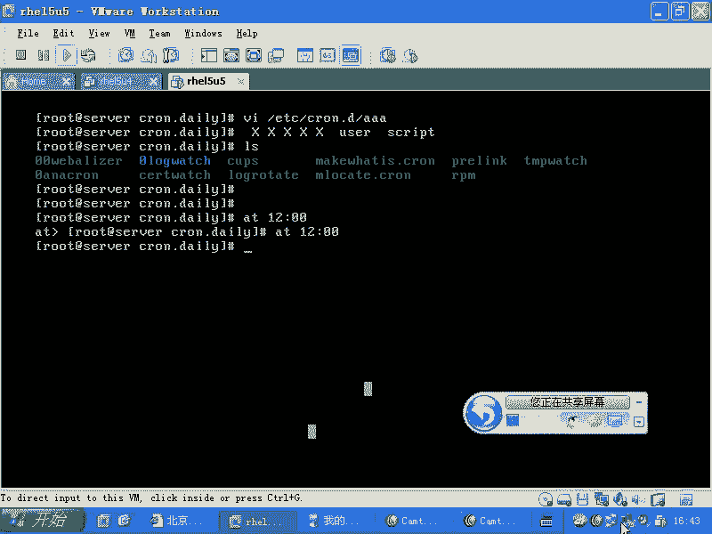

# Linux系统管理：第37讲：计划任务cron与anacron详解 🕐


在本节课中，我们将要学习Linux系统中至关重要的计划任务功能。我们将深入探讨`cron`和`anacron`这两个工具，了解它们如何协同工作，以确保系统任务能够按时、可靠地执行。课程内容将涵盖个人与系统计划任务的配置、备份策略的实现，以及相关日志的查看方法。

## 计划任务概述

Linux系统中的计划任务主要有两个体系，共包含三种工具。第一种是`at`命令，它用于执行一次性的轻量级任务。由于其功能较为简单，控制选项有限，在实际生产环境中较少使用。另一种则是我们重点学习的`cron`，它用于周期性地执行任务。

`cron`本身又包含两个子系统：`cron`和`anacron`。`cron`负责周期性的计划任务，而`anacron`则用于弥补因系统关机等原因而错过的任务执行。例如，如果计划每天凌晨4点02分清理临时文件，但你的台式机在夜间关机了，`anacron`就会在下次开机后自动补执行这个任务。

## 个人计划任务

首先，我们来看看如何配置个人用户的计划任务。个人计划任务使用`crontab`命令进行管理，但实际应用相对较少。

用户可以通过`crontab -e`命令编辑自己的计划任务列表。无论用户是否登录系统，这些任务都会在指定时间执行。

计划任务的格式由五个时间字段和一个命令字段组成，格式如下：
```
分钟 小时 日期 月份 星期 命令
```
时间字段遵循由小到大的顺序：分钟、小时、日期、月份、星期。星号（`*`）表示“每”或“任何”。

以下是几个时间字段的写法示例：
*   `*`：表示“每一”。例如，在分钟字段表示“每一分钟”。
*   `5`：表示具体时间点。例如，在小时字段表示“5点”。
*   `1-5`：表示一个范围。例如，在星期字段表示“周一到周五”。
*   `1,3,5`：表示枚举。例如，在星期字段表示“周一、周三、周五”。
*   `*/2`：表示间隔。例如，在小时字段表示“每两小时”。

一个完整的计划任务示例如下：
```
5 1 * * * /usr/local/bin/backup.sh
```
这个任务表示在每天凌晨1点05分，执行`/usr/local/bin/backup.sh`脚本。请注意，脚本必须具有可执行权限，并且最好使用绝对路径。

## 系统计划任务

上一节我们介绍了个人计划任务，本节中我们来看看更常用的系统级计划任务。系统计划任务不由特定用户所有，其配置文件位于`/etc`目录下。

系统的周期性计划任务主要通过`/etc/crontab`文件以及`/etc/cron.hourly/`、`/etc/cron.daily/`、`/etc/cron.weekly/`、`/etc/cron.monthly/`这几个目录来管理。

`/etc/crontab`文件定义了系统环境变量，并规定了每小时、每天、每周、每月执行任务的入口。例如，每天执行任务的配置行如下：
```
02 4 * * * root run-parts /etc/cron.daily
```
这表示每天凌晨4点02分，以`root`身份运行`/etc/cron.daily/`目录下的所有可执行脚本。`run-parts`命令的作用就是执行指定目录下的所有程序。

如果你想添加一个系统任务，只需将具有可执行权限的脚本放入相应的目录（如`cron.daily`）即可。这是最便捷的方式。

对于执行周期不规则（如每3小时或每10分钟）的任务，则需要将配置文件放入`/etc/cron.d/`目录。此目录下的配置文件权限必须为`600`（即`-rw-------`），只有`root`用户可以修改，这是重要的安全措施。

一个`/etc/cron.d/`目录下的配置文件示例如下：
```
*/10 * * * * root /usr/local/bin/monitor.sh
```
这个任务表示每10分钟以`root`身份执行一次`monitor.sh`脚本。

## 备份策略与cron实践

计划任务的一个核心应用场景是系统备份。这里我们结合`dump`命令和`cron`来讲解一个备份策略。

`dump`是一个传统的Unix备份工具，它能识别分区并进行增量或差量备份。其基本命令格式为：
```bash
dump -0uf /backup/full.dump /dev/sda1
```
其中，`-0uf`表示进行0级（完全）备份。`dump`支持0-9共10个备份级别，0级为完全备份，其他级别为增量备份。

理解增量备份和差量备份的区别至关重要：
*   **增量备份**：每次备份都基于上一次备份。例如，周日做0级备份，周一做1级备份（只备份新增内容），周二做2级备份（基于周一的1级备份，只备份周二新增内容）。恢复时需要按顺序恢复所有备份。
*   **差量备份**：每次备份都基于同一个基准（如周日的0级备份）。例如，周日做0级备份，周一至周六每天都做3级备份（每次都基于周日的0级备份，备份自周日以来所有的变化）。恢复时只需恢复0级备份和最新的一次3级备份即可。

以下是一个结合`cron`的备份策略示例，实现每月切换备份文件，每周日完整备份，工作日差量备份：
```bash
# 每月1号凌晨2点，创建以年月命名的新备份文件并做完整备份
0 2 1 * * /usr/sbin/dump -0uf /backup/data-`date +\%Y\%m`.dump /boot

# 每周日凌晨3点，对当月文件进行完整备份（覆盖上周的）
0 3 * * 0 /usr/sbin/dump -0uf /backup/data-`date +\%Y\%m`.dump /boot

# 周一到周六凌晨4点，对当月文件进行3级差量备份
0 4 * * 1-6 /usr/sbin/dump -3uf /backup/data-`date +\%Y\%m`.dump /boot
```
这样，每年会生成12个备份文件（每月一个），恢复任何一个月的数据都只需要恢复两次。

## anacron 机制

我们已经知道`cron`负责执行计划任务。但如果任务设定的执行时间点系统恰好关机了，`cron`就会错过这次执行。`anacron`就是为了解决这个问题而设计的。

`anacron`会检查`/etc/cron.daily/`等目录下任务的“最后执行时间戳”。这个时间戳记录在`/var/spool/anacron/`目录下的文件中。

其工作原理是：
1.  当`cron`成功执行了`/etc/cron.daily/`中的任务后，会更新对应的时间戳文件。
2.  `anacron`进程运行时，会检查这个时间戳。如果发现时间戳不是今天的日期（例如，还是昨天的），它就判断今天的任务因故未执行。
3.  于是，`anacron`会立即执行`/etc/cron.daily/`目录下所有相应的任务，无论当前是否是计划的时间点。

这样，就确保了即使系统临时关机，周期性的维护任务（如日志轮转、更新数据库）最终也会得到执行。

## 日志与查看

计划任务的执行情况对于系统管理至关重要，你需要知道任务是否成功运行。

`cron`服务的所有执行记录都会输出到系统日志中。在RHEL/CentOS系统中，你可以通过以下命令查看`cron`的专属日志：
```bash
tail -f /var/log/cron
```
通过查看此日志，你可以确认计划任务是否按时触发、执行过程中是否有错误输出等。这是排查计划任务问题的主要途径。

另外，计划任务中命令的输出默认不会显示在终端上，而是会通过邮件发送给任务所有者（通常是`root`）。你可以在命令中使用重定向将输出写入文件或特定的终端（如`/dev/tty1`），以便直接查看。

## 总结



本节课中我们一起学习了Linux计划任务的核心知识。我们首先区分了`at`、`cron`和`anacron`。然后，详细讲解了如何使用`crontab -e`配置个人任务，以及如何通过`/etc/crontab`文件和`/etc/cron.*`目录配置系统任务。我们还探讨了如何利用`cron`实现一个完整的系统备份策略，并解释了`anacron`如何作为`cron`的补充，确保任务在系统关机后也能被补执行。最后，我们学会了通过`/var/log/cron`日志来监控计划任务的执行情况。掌握这些工具和概念，将使你能够自动化许多系统管理任务，提高运维的效率和可靠性。