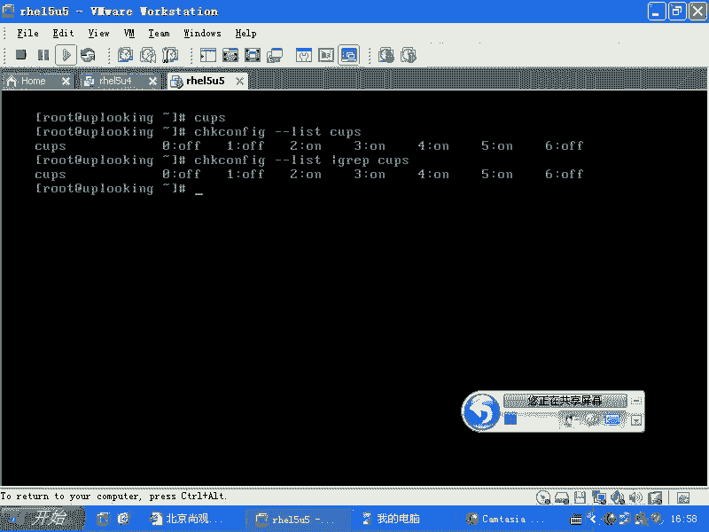
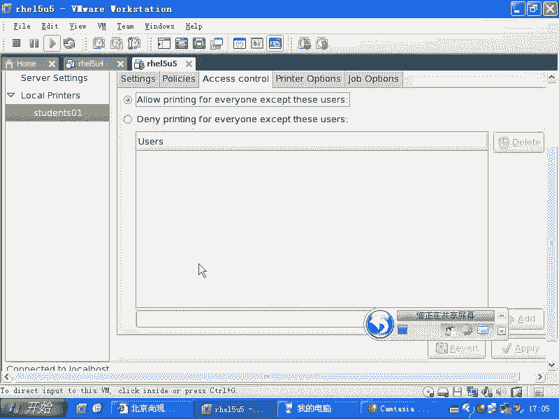
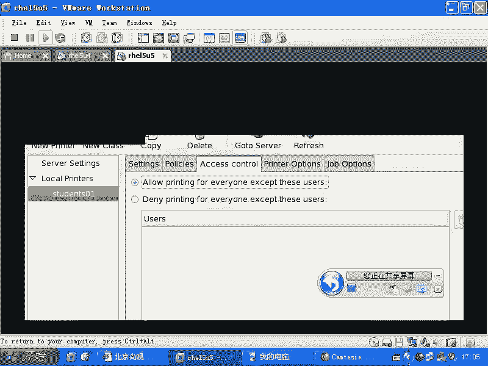
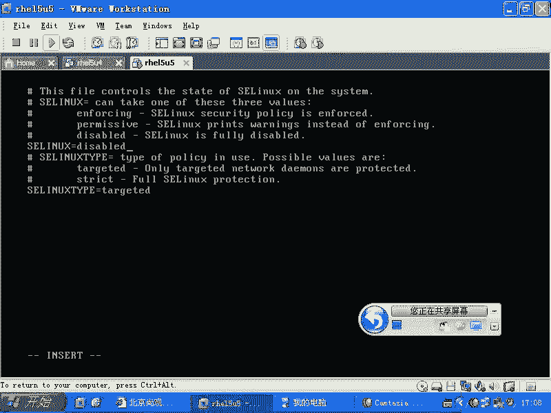

# 尚观Linux视频教程RHCE 精品课程 - P38：RH133-ULE115-3-3-cups-setenforcing - 爱笑的程序狗 - BV1ax411o7VD

跟大家说一下，就是说这点是比较重要。就是HCE考试的时候的话呢，他可能要一定要考到的就是什么呢？打印机系统。打印纸系统这个打印机系统的话呢，在windows里面可能不算什么。因为windows的话。

它有强大的什么用户群。所有的打印机厂商要想让自己的打印机卖出去，他肯定要支持windows，是不是？但是你lininux就不一定了。所以这时候他有一个厂家，他很早就看到了这个问题。这个厂商的话呢。

他就推出了一种通用的打印系统，叫做什么呢？caps。通用的unix打运系统啊，通用的unix打印系统叫做caps。那这个服务的话呢，你可以看一下它有没有。打开啊，刚刚list。CPS。

那么默认情况下的话呢，它是打开的。也就是这个服务打开的话呢，它就可以响应你的打印请求或者接收外界的打印请求。也就说你现在话想创建一个打印机，让别人可以什么打印到你这边来，或者你想创建一个打印机。

打印到别处那边去，别人那边去，也就共享打印机给别人，或者说使用别人的共享打印机都可以用caps。😡，明白了吗？那么cap4的话呢，还有一个服务啊，还有一个服务。😊，哎，这边没有装啊。

有一个服务的话叫做caps杠LPD啊LPD就是说我们的这个。😊，所谓的linux啊，我们所谓的这个linux，它继承于unix整个的一套打印系统，它全都继承过来。那那个打印系统叫做什么呢？

LPD但这个东西已经老掉牙了。老掉牙了。那么caps一出来以后的话呢，一脚就把什么这些老式的东西就踢开了是吧？因为caps的话，它是一个商业公司在运作。

它把市面上绝大多数的打印系统的驱动全部都囊括在其中。也如他可以跟佳能跟那个惠普的话去谈，说什么哎，你想支持让你的打印机支持什么吗？支持那个lininux嘛，是吧？加入我呀，是不是？但是这个公司的话。

它怎么样？这个公司的话呢，它有一个收费的版本提供的是最全的，也就是caps斯是有收费的版本。但是他现在给我们提供的是什么免费的版本。这个免费的版本的话呢，它可能有些打印机它是不支持的。

那么我们看到这个caps的话呢，它为了兼容于以前的LPD的打印机。也有一些老式的程序，它还总是调用什么LPR啊之类LPR之类的这些程序。所以这时候的话呢，它有个服务叫做什么呢？caps杠LPD。

那这个的话呢，在HC考试不用考，你们知道就行了。装这个包就有这个服务，明白吗？那么我默认用的还是什么caps，用了caps以后的话呢，你可以怎么样呢？你可以去配置它。一般我们在HCE考试的时候的话呢。

配置的话都是在同心界面上配置啊，你可以不用知道那么多，那你就运行一下什么系统的配置。

以什么开头啊？😡，C。是吧，杠config是不是我们记得有个config杠diplay是吧，就是图形是吧？那么我们想配置打印机的时候是什么？😊，printtter是吧，我们想配置网络的时候是什么？😊。

network是吧？所以大家有有规律了吧，你说哎还有些什么东西啊，我把这个删除掉，摁两下table键。😊，是不是都有了tages是吧？LVMlan是不是啊，然后这些东HTTPD是吧？啊。

date time是吧，这些东西都有。那么我们现在的话呢配置打印机。😊，打印机的话呢，在HCE考试的时候的话呢呃要考到啊。其实的话呢非常简单。那么一般考试的时候，或者说我们如果要是正常使用的时候。

远处远方有一台另外一台机上有一个打印机共享出来。那你这边的话呢点击什么？😊，new是不是newprint，那这个printer的名字，比方说起名呃，人家会要求你起名叫什么，你就叫什么，对不对？

那比方说我这个叫什么呢啊。😊，Students。Studdentent啊。要啊。或者01。然后呢，这边是个描述，这边的话呢是说呃这个所在的地方可选啊。点击点击forward啊。powerer的。

下一步这个时候的话呢，它会读取什么呢？caps打印机那些驱动啊等等这些东西。那么你如果要是选择这个类型的话，选择是一个网络打印机的话。咁啊慢。硬盘一直在亮啊，有可能是什么and Cr啊或者什么东西运行。

有很多人的话原来问过我。哎，我在运行一个我的笔记本的话，在运行这个lininux突然有段时间就特别慢是吧？那就是什么andch运行的一个下什么呢？upate DBupDB是不是把你所有的文件要搜搜一遍。

是不是？那就是那算那个的啊，你看这边的话呢，这个打印机的这个呃类型的话就全都出来了啊，打印机的类型的话就全都出来了。这时候的话呢，LPT的打印机就是传统的并口打印机。那么如果要是像什么。

这个就是串串口打印机，那是这样的，不要设置波特率等等。如果是惠普的什么什么打印机，那么就是说惠普的jedirect是吧？😊，呃，那么我们caps一般用的是什么呢？IP打印机。

这个internet打印协议，internet print什么pre practical明白吧？这时候的话呢呃你输入1个IP地址，比方说192168。0。254，我要打印到它的哪个文件里面去呢？

那打印到它哪个地方呢？printter什么呃01啊，比方打印到这里面，是不是？那这样的话呢，你添加完以后就OK了。😊，就是选择打印端口，那么还有windows打印机，还有就是传统的LPD的打印机。

是不是LPD打印机。那么现在的话呢，我们再去怎么样？点击。powerer的是不是？选择一下那个就是类型啊，这边是通用的这个就是通用的这个打印的。呃，系统。那么你当然也可以选择什么苹果打印机。

或者说其他品牌打印机。选择皮其他的品牌打印机。那么这个时候的话呢，选择好了以后，然或者brother之类的。选择通用打印机。审诺完以后的话呢。格式是什么？一般的话呢，比方说test only啊。

或者说呃什么叫做raw格式啊。这这边post post script script啊，还有什么这些的话呢都是通用的一些驱动程序。那么我们如果要是一般你拿了个打印机以后，你肯定知道它的类型是不是？

选择一下驱动。但是我们如果要是在实验室互相之间去用的时候，那么你可以选择什么呢？test only打印机啊，太松这种打印打印机，然后再点击下什么呢？点击。Nextex啊。然后呢，这样的话呢。

就打印这个打印机的话呢，就做好了，明白吧？这个打印机就做好了。它实质上的话呢是一个网络打印机啊，实质上网络打印机。当然了，你还可以去控制你的这个机器。

就是你你比方说你是否去把你自己的打印机去共享出去是吧？允许别人去管理，允许别人的话去打印啊，允许别人的话呢，去取消掉这个里面的工作是吧？这样的话呢，你就可以呃就是设置。

那么如果你设置一个本地打印机的话呢，你可以在这边的话呢，比如说访问控制这里面，那么允许谁访问，不允许谁访问，都可以去设置，明白吧？实际上的话呢，如果你会用windows它，这个地方就。就很简单了。

但是呢HCE考试的话呢，会考什么配置打印机。所以他我给大家走一轮，明白吗？明白，所以你要记下来啊，有没有问题？😊，打印系统这做caps啊打印系统这cs打印系统。那么另外的话呢，我提一点啊。

就是最后一点了，最后一点提一点。

最后一点就是你SElinux的开启和关闭。SE06的话呢，如果要是你现在在做一个新的服务。😊，怎么总是启动不起来，怎么总是页面不出现。那么你可以首先想到什么呢？你要看一下message文件里面的话。

有没有这种信息是吧？说为什么拒绝你访问，当你看到一个peration deny的时候，就说操作被拒绝的时候，你比方这样的啊。😊，你看s比站号，现在我去VI什么呢？ETC下的什么呢？sha的文件。😊。

他会出现哎。怪了啊，12个账号现在已经是那个什么管理员了，哎，不对吧。😊，没有啊。那这个VI的话呢是没有改，或者这个VI的话呢，肯定是。全年还是有那个。对，有粘贴位。啊，还真的是有。年贴位是吧？

那么假如说我去呃cat是吧，ETC下的shadow。这边的话应该是里娜啊，因为这个语言的话呢已经被我改成中文了是吧？那么我可以运行一个什么呢呃。LNG等于直接空格啊，这样它就把语言的话恢复成最初状态了。

然后我ca一下是不是本命身得。😊，commission deny原因可能是你没有权限。哎，还有原因就是什么呢？SE。还有原因，你们一定要记住啊，就是说这个权限很可能是什么？

因为SElinux导致你某个服务启动不起来，或者说peration顶单。这个时候的话呢，你要怎么样？你可以查看一下当前的这个状态，就是SElinux状态，你可以什么呢？get啊in。

这时候的话告诉你是inforcing状态，inforcing状态的话就表示它是什么它是起作用的啊，那么你可以setinfor0，这样的话呢，把它就是怎么呀？把它设置成permissive状态。

permissive就是说我允许你做任何操作，但是我警告你。我只是说做一个监视，明白吧？所以大家要会。那么如果要是set enforce force是什么呢？一那么就把它变成什么。

就变成infors状态了，是不是？这就是SE Linuxux的一些操作。所以的话跟考试可能是相关的。所以我这边的话呢又跟大家说了几句啊，有没有问题？SEinux的话是比较复杂。

我们会找专门的时间再给大家讲。但是这个地方的话呢，大家就知道这几个命令就OK了。那么你要想永久的关闭的话，应该怎么办？VIETC下的什么呃SEinux当中的卡fi，然后把里面的那个改成什么呢？😊。

diable啊像那个。enforcing哎是吧。忘了啊我你打开这个文件，我就能记起来。这边SE等于什么？inforscing是吧，那我把它改成什么呢？diableable的是吧，它下次启动的时候。

SE Linuxux就被关闭了。OK那么今天的话我们就讲到这边啊，大家可以下课了。😊。

