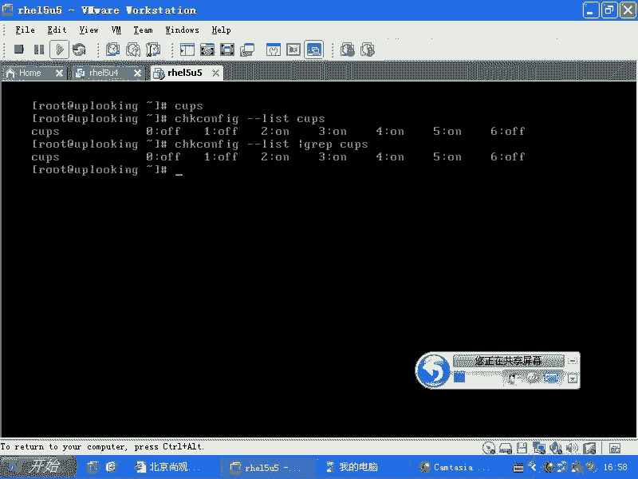
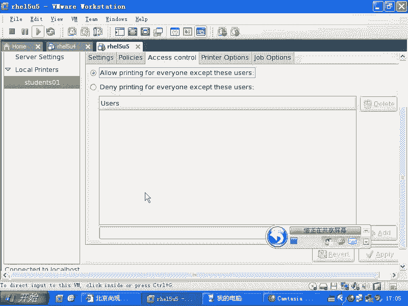
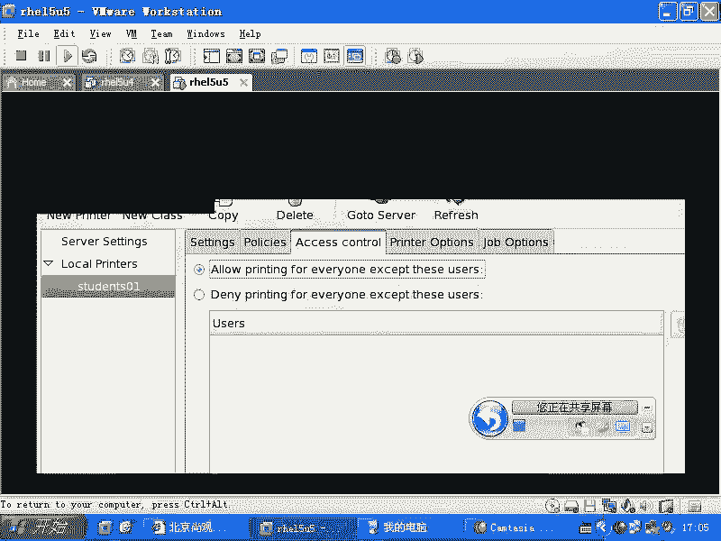
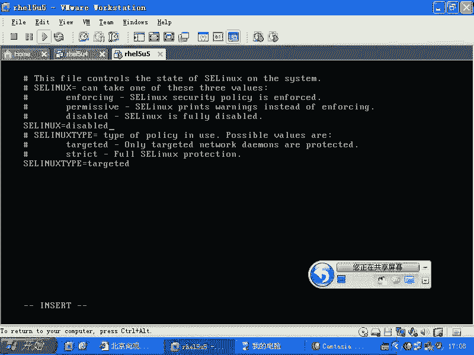

# 尚观Linux视频教程RHCE：P38：RH133-ULE115-3-3-cups-setenforcing


## 概述
在本节课中，我们将要学习Linux系统中的通用Unix打印系统（CUPS）以及SELinux的基本状态管理。CUPS是Linux下管理打印服务的核心组件，而SELinux的安全策略有时会影响服务的正常运行，了解如何检查和临时调整其状态对系统管理至关重要。

---

## CUPS打印系统介绍 🖨️
上一节我们介绍了各种系统服务，本节中我们来看看打印服务。在Linux系统中，打印功能不像在Windows中那样得到所有硬件厂商的广泛支持。因此，一个厂商很早就推出了一个通用的打印系统解决方案，称为CUPS。

CUPS的全称是**Common Unix Printing System**。它是一个服务，可以响应本地打印请求，也能接收来自网络的打印请求。这意味着你可以配置CUPS来共享打印机给他人使用，或者使用网络上他人共享的打印机。



默认情况下，CUPS服务通常是开启的。你可以使用以下命令检查其状态：
```bash
systemctl status cups
```

此外，为了兼容旧的Unix打印系统（LPD），CUPS还提供了一个`cups-lpd`服务。但现代Linux系统主要使用CUPS服务本身。

---

## 配置网络打印机 🔧
理解了CUPS的基本概念后，我们来看看如何配置它。在RHCE考试或实际工作中，配置打印机通常通过图形化界面完成。

运行系统配置工具的命令有规律可循，通常以`system-config-`开头。例如，配置打印机的命令是：
```bash
system-config-printer
```

以下是配置一个网络打印机的基本步骤：

1.  点击 **New** 按钮创建新打印机。
2.  为打印机命名（例如 `student01`），并填写描述和位置（可选）。
3.  点击 **Forward** 进入下一步。
4.  选择打印机连接类型。对于网络打印机，通常选择 **Internet Printing Protocol (IPP)**。
5.  输入远程打印服务器的IP地址和共享打印机的队列名称（例如 `192.168.0.254` 和 `printer01`）。
6.  点击 **Forward**，从列表中选择打印机品牌和型号以安装驱动。如果只是为了测试或实验室环境，可以选择 **Generic** 品牌下的 **Text Only printer** 等通用驱动。
7.  继续点击 **Forward** 或 **Apply** 完成配置。

配置完成后，你还可以在打印机属性中设置访问控制，例如允许哪些用户打印或管理打印机。

---





## SELinux状态管理 🔒
配置完打印机，我们转向另一个可能影响服务运行的因素——SELinux。当你发现新配置的服务无法启动或访问被拒绝时，除了检查常规权限，还应考虑SELinux的影响。

你可以通过以下命令查看当前SELinux的运行状态：
```bash
getenforce
```
该命令可能返回 **Enforcing**（强制模式，完全启用）、**Permissive**（宽容模式，仅记录违规）或 **Disabled**（已禁用）。

如果怀疑是SELinux导致问题，可以临时将其切换到宽容模式，此模式下SELinux只记录而不阻止操作：
```bash
setenforce 0
```
若要重新启用强制模式，则执行：
```bash
setenforce 1
```

请注意，`setenforce`命令的更改在重启后会失效。若要永久修改SELinux状态，需要编辑配置文件 `/etc/selinux/config`，将 `SELINUX=` 后面的值改为 `enforcing`、`permissive` 或 `disabled`。

---



## 总结
本节课中我们一起学习了两个重要的系统管理知识点。首先，我们了解了CUPS打印系统的作用和通过`system-config-printer`工具配置网络打印机的基本流程。其次，我们掌握了如何查看SELinux的当前状态，以及使用`getenforce`和`setenforce`命令进行临时状态切换，这对于诊断和解决因安全策略导致的服务访问问题非常有用。