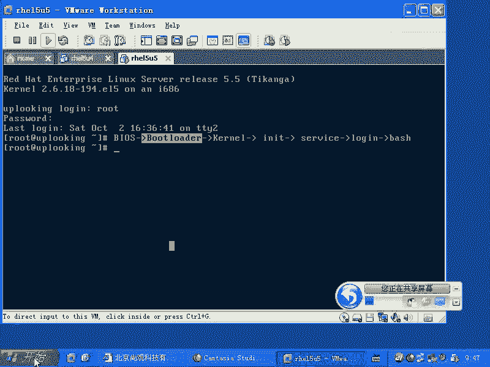
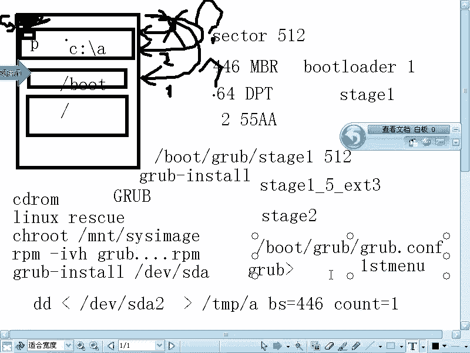

# 尚观Linux视频教程RHCE 精品课程 - P39：RH133-ULE115-4-1-grub-grub-troubleshooting - 爱笑的程序狗 - BV1ax411o7VD

来，OK我们现在开始啊那个。😊，今天的话呢，这个整个的启动过程的话呢，将会成为一个重点。那我觉得的话呢这一块可能对于开发的学员就是学开发，就是linux下开发啊，或者说android开发啊。

或者平时你喜欢烧把那个手机里面烧一个什么，烧一个rome是吧？更新一下智能手机。那这个的话呢也是lininux系统实际上windows系统公用的，或者说智能手机里面那些系统都差不多的这种东西。

只不过是什么呢？就智能手机的话呢，它没有bios。智能手机的话，它没有bios，没有bios的话呢，在我们呃。一般。往里面写东西的时候，要里面要先放什么东西啊？先放一个类似呃bios。

然后呢结合butloader整个打包叫做什么的butloader的东西。但是我们台式机做的非常规范，是不是每一个电脑拿过来以后，哎，大家习惯的去先设置一下bios是不是？但是智能手机没有啊。

也就这一块东西的话呢，是所有计算机系统，可能都都应该具备的。但是呢他们可能叫的名字不一样啊，那如果要是我们现在是普通的计算机的话，会是怎么样的？我们看一下啊，你比方说这样的。

任何的计算机的话都是从dos。开始是不是然后呢再去启动什么呢？再去启动一个叫做put loader的东西，对不对？put loader再去启动一个什么呢？再去启动一个 kernelnal。

是不是你就内核是不管是windows的内核还是linux的内核，是不是windows的内核文件可能有那么几个，对不对？那么linux的内核文件的话呢，可能是一个，但是它还有个配套的文件啊，然后呢。

 kernelel启动完以后，如果在linux里面，那么它会有一套机制，这套机制的话，就是IIT啊，IIT的话呢会启动各种什么呢？service服务？😊，各种服务。最后的话呢再去打开什么呢？

你的loging程序，然后再打开一个叫做ba笑的程序，对不对？这个过程的话呢，我想大家的话呢也都现在的话逐步怎么样呢？有较深的体会了，我们把它再写的再紧凑一点啊。service然后呢。

最后再启动一个呃什么mini get tTY是吧，打开终端是吧？然后呢，打开一个loging的程序。login如果通过的话，打开什么呢？dash啊，所以这就是咱们一般的话呢来看到的一个过程。

而在我们所说的智能手机里面的话呢，这两个部分合而为一。这两个部分合二为一，也就是bels加but loader统一叫什么bo loader。那这套体系的话呢，在呃嵌式里面的话呢。

比方说有很多软件可以提供啊，比方说叫做youbo啊，或者是其他的这种bo loader。然后呢 load启动完以后的话，该装载内核啊，内核的话呢。

在windows它可能是几个文件放在C盘下的windows里面，是不是？然后呢，如果要是reux的话呢，就放在什么but目录下有个叫做VMUZ的文件是吧？put目录下。

然后这个的话呢就是普通的一个启动过程。我们今天要做的是什么呢？把每一步的话呢给大家想讲清楚啊？首先bi的话呢，它比较简单，大家也用的比较多了，是不是我们PC机的bel的话呢，是一个非常标准的东西。

这个非常标准的东西它设置完以后啊，那么一般我们就很少去管它。那么这个bi的厂商是不是主要有两个厂商。😊，一个叫什么 word是吧？还有一个叫什么凤凰，是不是好像是这两个厂商啊啊。

他们这个厂商产生的这个bis的话呢，就够这两家吃了。如果要是还有人想进入bi这个软件的领域的话呢，它就这个市场份额没那么那市场空间没那么大，所以就没有人进入，所以它非常稳定。

那么你比方说VNV里面的话呢，也用到了什么那个凤凰公司的那个footloader，是不是？然后呢我们再看。😊，foot呃不是啊，put loader的话呢，它本身的这个内容这个东西有很多啊。

我们一般的话呢在windows里面懒得去管它，什么时候会用到，你们什么时候会用到。windows put什么时候会用的？双装进。装双系统的时候，你们能看得到，对不对？

windows里面的but loader的话呢，在哪儿呢？我们看一眼啊。

我的电脑我的电脑里面的话呢，这边C盘是不是C盘的话呢，大家看到有个叫LTD的呃LT呃NTLDR的这个东西，是不是叫做NTloader啊，实际上就是这个。但是在R呃在windows7里面的话，改掉了。

windows7里面的话呢，已经不用这套体系了，知道吧？那么这个还有就是说它的配置文件不点II大家可能经常用，是不是？那么你想引导两个你想引导两个那个就是windows的时候，那你该怎么做？😊。

引到两个windows的时候怎么办？怎么做？那你可以看到这里面。对，你看啊这个这个里面说你想引导第一个windows windowsdows的目录主目录在哪呢？

在哪个目录下去找windows的 kernelnal就是内核呢？在这个目录下对不对？说第一第一个硬盘的什么呢？第一个呃第二个分区啊，这好像第二个分区啊，这是第二个分区第一个分区啊，这个标号。

总之它能找得到是吧？相当于我们什么SBAE啊之类的这种这种内容，那么的什么呢？windows目录下，在windows目录下有它的内核是吧？或者整套的东西，这个的话就是它的不。

所以我是通通过大家的一个已知，然后的话呢，我们要引导到什么呃，reite系统里面来看reite系统里面的，对不对？那么它是不是也应该有个也应该有个什么这个配置文件对不对？就是gra点com啊。

或者说呃first menu啊，就叫这个名字。那么我们来看一下啊，给大家返回头来。😊，后呢看一眼什么呢？看一眼这个结构是怎么样的啊。O我现在的话呢把屏幕共享取消，然后我们现在新建一个白板，然后给大家看。

呃。正常的这个。正常的这个leux。他在安装的时候，实际上不涉及到太多putloader的东西，直接nex next就完事了。是不是？但是呢在你双启动的时候，大家一定要明白这个过程啊。

它是怎么样的过程呢？我们看现在的话呢有一块硬盘，这块硬盘的话呢，是所有硬盘出始出厂了以后，那么低格过以后的话都是这样的，是对不对？所以低格了以后的话呢，它的这个呃比较大的单位，比较小的单位都具有了。

其中最小的单位是什么呢？也如是在硬盘上最小的单位就这么一个小块，是不是？这个小块的话叫做什么呢？叫做sector是吧？😊，是吧sctor。是这样写是吧？扇区是吧？这一个扇区的话呢是512字节。

这512字节的话呢，就相当于我们建了一个什么呢？最小的这样的一个单位。我们现在的话呢，有一个仓库。这个仓库里面放东西的时候，肯定不能顺序的摆放，我们肯定是先把这个大的仓库。

比方说几千米的这个仓库划分成很呃很多很多小块，比方说一个小的单位最起码是什么2平米，对不对？所以的话呢我们这一个小块的话，最起码是多少512字节，对吧？这512字节的话呢，一个一个的话呢，顺序摆放。

那么他们几个512字节的话呢，将会组成一个柱面。😊，啊，组成一个柱面。那么我们看到这样一个块的话呢，第一个块是非常的什么？第一个块的话呢是非常的特殊的。这第一个块的话呢，它里面总共有512字节。

那么应该怎么样去摆放呢？其中446个字节叫做什么MBR是吧？然后呢，然后接下来是什么呢？64个字节的呃分区表，就是DPT标准分区表，分区表的话呢，存在在很多的这个就是很多地方。

那么其中我们说在最前面就叫标准分区表。另外有两个字节是什么呢？表示前面的数据是正常的，对不对？那么假如说你看啊你所那天的话，我们拿到一个U盘去把它加载到系统里面的时候，是不是那个U盘没有分区啊。😊。

是不是没有分区，那么我们直接把操作系呃，就文件系统的数据放在这个U盘，从最前面开始就放，是不是？那放的时候，那你说前面这个东西到底代表的是什么？是分区吗？还是操作系统数据，你怎么能说的清楚？

说不清楚是不是？那么当我们看到最后两个字节是什么？55。😡，AA的时候，有最后两个字节里面的数据啊，因为一个。十六进制的数据啊，它会占用4个字节是吧？两个16进制的数据是不是占用两个字节是吧？哎，不对。

不对啊，就是说1个16进制的数，就比方说这个五啊，这个5这样一个1六进制的数是占了什么？4个。对，是哎，我看。是四个位啊，不是四个字节，是四位。4位就是二的42的4次方嘛。二的4次方是16，是不是？

也就是说一个16进制的数，它最多占用什么四个位。一个字节是8位吗？是不是？一个字节是8位嘛，然后呢，那么我们说8位需要几个几个十六进制的数啊。两个。所以他呢你说55是不是占用了第一个字节？

AA是不是这第二个字节？也就是说你这个前面这个数值啊刚好是55A，那表示什么哦，我前面写的是什么？有but loader，有DPD是不是？那如果我不是55A的话，表示什么？😡，我前面根本就没分区的。

是不是？是不是这样？所以这个这个道理大家清楚啊，那么446个字节的MBR啊，它本身的话呢是做整个的系统最开始的时候启动用的，是不是？也就是说bius接下来干该干嘛？us也不知道，按照你的设置。

要么启动光盘，要么启动什么硬盘，要么启动U盘，要么进行什么络网络启动，是不是？所以这个时候的话呢，他按照你的方式定了以后，它启动硬盘，它该怎么启动，他也不知道。

所以他就直接跑到硬盘的最前面去找446个字节，说哎，你这446个字节是不是。😊，是不是已经编译好的CC语言程序啊，是不是是不是我的机器代码是不是是不是可以直接运行的？OK可以运行。😊。

我看一下55AA是吧，一看55AO那它是什么可以引导的，是不是？于是就开始引导。所以的话呢我们说整个but loader的什么第一个部分啊，比就是在这个地方的话呢，是什么？but load的第一个部分。

😊，foot load的第一个部分啊，第一个部分呢如果要是gub的话呢，它这个第一部分叫什么呢？叫做stage。😊，啊，应该是stage一啊，tage一。也就我们可以看一下啊。

就是说如果要是grab的话，那么它的它的这个文件的分布是什么呢？你可以看到boot loader呃，bo目录下有个grab目录，是不是grab目录里面的话呢，有个stage。😊，一啊这tage一的话呢。

它的字节数刚好是512字节，应该前面的话呢是什么？前面是正常的，后面的话呢可能是一些空的字符是吧？空的字符，也就是说tage一这512个字节会被什么呢？安装的时候会被写到MBR里面去。

也这个文件实际的文件也有，是不是？但是这个文件是没有用的，是不是？只不过在安装的时候，它会怎么样写到了。😊，MBR里面去。那么这个时候的话呢，我们看啊这个地方的话呢，一旦写了这个东西以后。

那么它的话呢就开始一个引导过程。但是这样的一个引导过程的话呢，它实际上并不能怎么样，并不能体现全部的功能。你即使是说你是一个非常强的一个变成天才，是不是？那么再厉害的一个天才，在446个字节当中。

你能折腾出什么东西来呢？是不是？所以它只是个开头。开头之后的话呢，在后续的sector当中的话呢，会有什么呢？会有。😊，一下划线5啊出现。那么stage一下划线5出现的话呢，它这个里面会有一个什么呢？

会有一个下划线。比方说EXT3，也就是说这个这个我们的这个就是说我们的这个but load啊，那么我们这边的话呢，假如说这是我们的but特分区，是不是？这个but特分区。😊，这个波特分区。

这个不的分区里面的话呢，有我们的内核，对不对？那么你得让我们的这个分区怎么样？就说是格式化是吧，格式化完以后，你要么用E3格式化，要么用什么fight32格式化是吧，或者要要么用其他方式格式化。

但是你格式化了以后的结果是怎么样呢？就是说所有的数据都放在这个文件系统之上，是不是？那么我们的put loader的作用，是不是要找到这个文件系统上的cl，是不是cl文件。

那么你是不是想让but loader支持这个。😊，文件系统是吧？所以的话呢我们的grab的话呢，它支持的文件系统很多，包括光盘的文件系统。比说grab可以装在什么光盘上，比如打成一个ISO镜像。

最后刻录在光盘上。那么这个ISO镜像里面的波 load就可以用grab，它也支持这种文件系统，只不过这个地方就是接下来的这个地方啊，就接下来的这个sector之后的这个地方。

那么我们说它就是什么tage一下滑线五的位置，这个地方它该装在哪种。😊，他应该装载哪种？Yeah。它应该装载哪种文件系统呢？那么根据需要安装的时候，它会自动往上放，对不对？所以这是一个地方。然后呢。

我们要知道这个stage一下划燕5。还有一个地方的话呢，就是说它还有一个部分叫做什么自然而然的就会有个什么。tage2是吧tage2的话呢，它的数量就会非常多。这个stage2所放置的位置就是什么呢？

就是在波ton目录下的grab目录。也就是说我们现在看到的就是说tage一和sage一下划线五都是放在什么分区之外。尽管分区里面也有这个文件是吧？但是你删除它以后，它没有用。

是不是它也不会影响你系统启动，因为它们只是文件方式保存在这个地方，但是他们已经被写到什么分区之外，一个在这儿一个在这儿，对不对？那么我们说这个文件，它就是什么？它就是在分区里面了，你要把它删除掉了。

系统就启动不起来了。😊，明白吧？也就是stage2的话呢，它是什么？在but目录下的gra目录里面，它就一直保存在那边。你要删除掉的话，它就没有了。

也就是说stage一加tage一下回原5找到了tage2，是不是stage2运行起来，okK完整的gra才运行起来。明白吧，整个的话呢大约有呃反正至少得几百K的数据。也就这个可执行文件的话呢，有几百K。

你不可能把几百K的话全都藏在两个字节当中是吧？几百K就是几百K是吧？那么它不可能压缩在两个字节，64呃，就是46个字节当中，不可能压缩在那么小的范围之内，所以它就是几百K啊。

也就这两个东西的话是放在什么？整个。😊，分就整个硬盘的最前面。然后这个的话呢是放在什么分区上啊，放在分区上，它是这样一个引导过程。引导了以后的话呢，他去找啊，也就是经过这样的这样的这样的过程了以后。

他开始去找谁啊，他开始去找我们的呃他的ETC下的哎，不是福特目录下的。😊，grab里面的grab点com。那么如果要是你是编译安装的，grab不是用的不是用的re自配的，而是编译安装的。

那么它叫做什么呢？first menu。啊，也就是说grab原本应该叫什么first venue，它的配置文件叫first value啊，它不应该叫什么？不应该叫grab点 co。但是reite的话呢。

因为它要把所有的这个软件都符合它的规范，是不是？所以它又给它创建一个叫做grab点 co的文件啊，或者是一个软链接或者是一个什么，就是直接就是把它copy过来啊，那么如果要是你去用susy啊。

你看到的就是什么first menu。明白了吧？这个过程清楚啊，清楚了没有？就是grab的这个整个的细节的这个启动啊，细节的启动。那么我们现在话呢来分析一下啊，就是说这个东西的话呢。

大家完全可以自己的话呢，看的看的非常清楚。但是如果要是出问题的时候啊，出问题的时候，你比方说我的这个stage stageage一出问题了。就是我的这个stage一假如说出问题了。

那么它产生的现象是什么呢？😊，s一出现问题了，那么他就根本就不会去引导。根本就不会去引导，也就是整个的系统会怎么样呢？它会出现说。😊，该硬盘是吧？不可引导是不是什么不可引导。

就是会出现一个提示说整个这个介指是吧？你CPU会说哎你在耍我的吧，是吧？你这个东西根本就没有引导数据嘛，没有任何引导的记录，对不对？这就不说了，大家经常能看得到，是不是？假如说你刚买了一个机器回来。

刚插上硬盘还没装系统，它就是这种错误。然后如果这个地方出现问题啊，就第二步随着一下方向5出现问题，它就会出现一个这样的一个情况啊，就是一般来说啊是这样的。😊。

GRUB啊出现一个大的GRUB整个系统的话呢，就在左上角出现1个GRUB然后就停下来了，就没反应了。或者是说什么呢？

全屏啊整个在刷GRUBgra grab没完没了的一直在那边写 grab grab就是一层一层一层明白吧？也就是我们在讲的这个地方的话呢，就是说系统还没有启动的时候，那么如果要是出问题的时候。

那么你要么系统的话就是告诉你说什么该介指没有引导记录，这是tage一是吧？tage一下划向5被你干掉了是吧？被你干掉了，会出现什么呢？gra一瓶一瓶的刷一瓶一瓶的刷，明白吧？但是呢如果要是tage2啊。

就是没有，就是tage一下划向5找不到的话，那就是大型的gra或者大 grab的话呢，一瓶瓶刷 stageage2要找不到的话呢，也是差不多这个样子，也是差不多这样啊，那么。😊，是的，就是说。

它会提示啊，有的时候会提示说stage2找不到啊，它有的时候会提示tage2找不到，就是你无意当中把什么what分区干掉了，他就找不到了，是不是他找不到了以后的话，他就会说什么呢？stage2找不到。

或者是也是grab在那边去大屏的去刷。所以如果要是这两个地方啊，就这两个地方出现问题的话，那么你需要运行什么命令的话呢，来进行修复呢？你需要运行grab。Inst。不行。Grab install。

grab instore来修复这两个问题。就是tage一和tage一相应5的问题，是不是？如果要是。tage2出现问题的话，那么你只能什么重新安装是吧？😡，CR出现问题的话，该怎么办呢？是吧。

把grab重新装一下，是不是？gra重新装下，也就是用光盘启动起来rescue模式啊，然后呢你可以用什么？光盘。启动，然后呢进入什么linux。是吧我们在安装的时候的话，有个let rescue是吧？

进去了以后的话呢，进去了以后啊，一般的话呢是这样三板斧是吧？😊，一般进去了以后，三板斧啊，resk模式进去了以后，然后呢先CH rootot change着rootMNT下的ss image啊。

也就是相当于我们的光盘启动的话，相当于启动了一个小lininux系统。启动完了以后，小雷的系统以后，它把整个的硬盘里面的根分区mount在哪呢？

mount在MNT下的ss image是不是s image目录下？也就是说我们访问这个根是光盘的根光盘上的什么呢？光盘上的MNT下的什么s image的目录的时候，访问的就是我们的。😊，跟踪区是不是？

然后接下来的话呢是什么？接下来的话呢，你cheroot过去以后，然后呢，再把光盘上你找一个grab点呃grab的那个RPM包，然后把这个RPM包怎么样？片包装上去。那这个时候的话呢，它就会自动怎么样。

自动的话把这个grab装上去，然后呢再去怎么样呢？再去直接再grab install store一下是吧？如果要是不需要grab install store的话，那就再说。

也就是说grab install store或者说grab install。他解决的是什么呢？grab它解决的是tage一和tage2的问题，是不是？或者说stage一tage2启动起来以后的话呢。

找不到什么找不到stage呃，不是stage一或者stage一下方向5。那么如果要是呃就是说tage一和tage一下方向5找到了以后，他们又找不到tage2了。那这时候你可能也要用到什么gra点com。

也就是总之上面两样东西出现问题的时候，或者上面两样东西跟第三样东西出现问题，出现衔接的问题的时候，那你就要什么grab int，对不对？但然如果你tage2丢掉了，那你就要用什么RPM。😊，对对？

去解决它。然后呢，如果要是这些东西都有了，这些东西都有了。结果的话呢，grab点cuff找不到了grab点cuff找不到了以后的话，你将会看到一个经典的画面啊。

这个经典画面你们可能经常见到就是在整个的画面的上两行有两行什么呢grab的这个提提示内容是吧？然后呢第三行的时候出现一个什么grab一个大于号啊，grab一个大于号。也就这个时候的话呢。

就是grab点cuff找不到了啊，grab点cuff找不到了以后，或者是个first menu找不到了以后，出现的这个错误的话呢，就是一个grab大于号，等待你输入命令。😊，这个时候的话呢。

你就重建grab点com就好了。呃，你可以完全可以手动输入什么呢？grab点comf里面那三行命令，对不对？也就是说你用手动方式来引导什么，我们接下来的内核啊，等怎么样手动方式去引导，等一下我们来看。

总之的话，我们把这个结构。和每个部分出现问题的时候，它的现象还要解决这个。问题的时候呃问题的时候该怎么样去解决是吧？给大家介绍一下有没有问题。有没有问题？没有，我看一下其他人有没有问题啊。

其人好像没有问题啊。好，这个过程的话呢，我们跟大家说清楚了以后啊，一般的windows是怎么样的呢？一般的windows是怎么样，我们把它涂掉啊。我给大家介绍一下双启动windows的话呢是这样的啊。

它的第一个sector的话，在这个地方。假如说它去分分区的时候，它是这样分的。那么我们说标准分区表，它最多只能有4个分区，是不是啊只能有四个分区。那么windows的话呢会把C盘变成第一个主分区啊。

第一个主分区。也就是说第一个分区里面的内容的话呢，这是P啊，主分区。😊，第一个分区的话呢，它是主分区，是我们的什么CC盘啊，这是windows。那么在第一个。主分区它会把它激活。激活了以后的话呢。

在第一个分区的第一个sector里面的话呢，还会有什么还会有一个区域啊，也是可以引导的。也就是说我们看到MBR在这个区域，对不对？MBR在这个地方。那么实际上的话呢，在这个位置的话呢。

还有另外一个引导记录。那么它叫做PDR叫做分区引导记录。PB啊。那么真正的话呢，在我们的这个就是说这个引导过程当中的话呢，我们的这个呃。就是windows系统的话呢非常聪明啊，他把所有的引导记录的话呢。

全部都放在PBR里面，让我们的MBR进行一个自动的引导，就相当于一个应用程序，调用另外一个应用程序。but loader互相之间是可以非常方便的去调用的。明白吧？那这个时候的话呢它是一个自动跳转的过程。

也就是从这边到这边的话，是个自动跳转的过程。这个过程的话呢就是windows主要的这个赖以什么赖以呃维系它接下来的后面的put load这个过程。那么windows的 boot是放在PBR里面。

但是现在windows7可没那么好整了，windows7可没那么好整了。windows的习惯的话呢是接下来怎么样呢？剩下的所有的分区啊，这整个的这个所有的分区全部都变成什么呢？叫做一个分区叫做什么呢？

扩展分区是吧？异形的扩展分区，然后在这之上的话呢，再去画什么呢？一个分区，这是逻辑分区，一般D盘的话呢，就是你的这个第一个log啊，就是逻辑分区是吧？也就是说实际上你创建两个分区，实际上最终是什么呢？

有三个分区出现，一个是C盘主分区，另外一个是你看不到的什么扩展分区，再有的话，你在扩展分区下会创建一个什么逻辑分区，这是你看到D盘，就是第二个分区，对不对？这是这样的一个过程啊，是这样一个过程。😊。

windows是这样的。那么实际上的话呢，我们linux如果要是跟windows混搭的时候，对不对？那么要怎么做？windows的话呢，它假如说我们装了一个windows又装了一个linux啊。

这个时候的话呢linux会有一个什么what分区，是不是？linux还会有一个什么根分区，对吧？那么这是不。这是什么呢？这是跟。😊，那么我们如果要是在这个boing呃，就是在在linux装的时候的话呢。

windows已经装好了啊，windows已经装好了。那这时候的话我们的grab的话呢会做一件事情，就是什么事情呢？就是说把我把这个地方替换掉啊，就是把这个地方替换掉。把这个自动跳转过程的话呢，替换掉。

也就不允许这个自动跳转过程了。那么这个时候的话呢，我们的stage一会取代什么呢？原本的。windows那个put loader啊渠到原文windows boot loader。然后这个时候的话呢。

linux可以选择什么？就是你想想去引导C方向的putloader吗？想吗？就是你想去引导吗？那么可以选择。当然你也可以直接选择什么呢？引导什么what下面的什么 kernel。

它这两个的话呢是可以选的。比如它有两个选择，这是第一号选择啊，这是这是第二号选择啊，这是第一号选择，所以这个时候的话呢，我们的linux就可以进行什么双引导。😊，双引导的话呢。

就是要么去引导什么真正的linlinux kernel，要么引导什么我们的windows的PBR当中的什么put load，对不对？叫做NTDLDR是吧？那个要么引导这两个的话呢，随你去选。

所以它就变成两个选择。这就是什么？你装完windows以后，再可以装什么linux，他们两个什么不冲突，是不是？因为linux的话只改动了windows的什么过程啊，就这个自动跳转过程给它废掉了。

对不对？其实的话呢，其他的东西还是怎么样还是保留的。就只有这个自动跳转过程的话呢，被它废掉了，只有这个地方啊，就这个地方就这个地方的自动跳转过程的话呢，废掉了。那么实际上其他的话呢都没有动。

但是如果要是你装了linux以后再装windows，那么它就会把这个自动跳转什么恢复起来，恢复起来以后的话呢，那你这个but目录下这个clel该怎么引导呢？你要么用光盘来引导，要么用什么软盘来引导。

也就是你还要再找个but loader去引导它，明白吧？啊，在这个windows的 boot load生效之前去引导的，所以这就是什么啊两个互相引导。😊，没有了吧。但是我的话呢经常做的一件事情是什么呢？

呃。我的话呢会我有我有可能会怎么样呢？我有可能会把这个446个字节啊，就是说我比方说我在装linux装linux的时候，那么我装这个bo load的时候，没有去装在MBR里面。我把它装在PBR里面。

也就是装在我们的这个bo目录下的什么这个分区啊，but分区的这个PBR里面。那么这个时候的话呢，这个PBR也是不会被引导的，不会被我们的这个windows的bo load会引导，不不会被它引导，是不是？

那么我一般的话会把它投446个字节，把它写成一个文件。😊，啊，通过DD命令去写成一个文件。我以前做过这个的话，对于你考试没有实际意义。我一般是DD啊输入重定向。

比方说DEV下的什么SDAR是不是这个分这个设备文件这个设备文件的什么呢？呃，头446个字节输出重定向到哪呢？然后说TMP目录下的AA文件，然后呢，BS等于等于446啊，COUN。😊，So。

OK这样的就是DD从SD2上来写到A文件里面去，然后呢，446个字节写多少块呢？写一块是吧？这样的话，我是不是把整个的stage一就备份出来了？Stage一备份出来以后。

把 stageage一 copypy到哪呢？copy到C盘下去，copy到windows的C盘下去。在这个下面的话呢，做一个什么A啊，做一个A文件，然后呢。

通过windows的什么bo load再去引导这个A文件。A文件是不是直接可以执行的，是不是？那么用windows的C呃呃windows的这个bo load再去引导这个A就相当于引导了什么这个bo目录下的这个。

😊，load是吧就分区下的什么那个PBR它就自动引导过程也是可以。所以我原来的话呢，我想我不破坏windows的 boot load的时候，我就这样装，也就是我装gra的时候，在安装界面下。

我选择的时候，我不选择安装到MBR而选择安装到什么第一个分区的什么PBR第一个linux分区的PBR啊，这是我以前做过的，但是windows7的话呢，我还真没有仔细琢磨过。

但我我知道就是说这些方法指在什么啊，那个windows XP里面可能升效啊，vista可能未必都能生降，是不是vista可能还是个就是 load还没有被替换。但是呢7和vista的话呢都会有问题啊。😊。

这就是我们的这个修复过程和双引导过程。这有没有问题啊？bb这个地方有没有问题？

没有问题啊。OK我们回过头来。😊。

