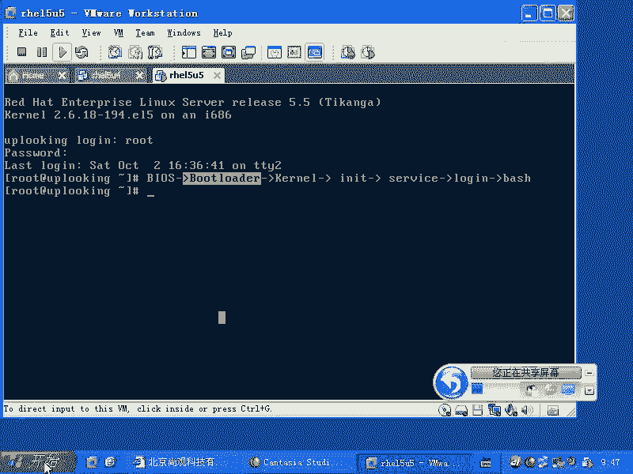
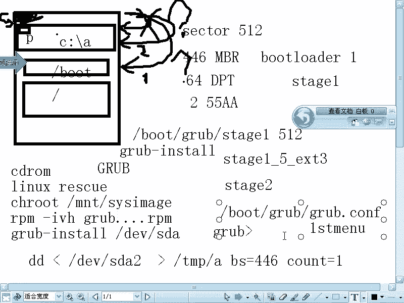

# Linux启动管理：P39：GRUB引导与故障排除 🔧

在本节课中，我们将深入学习Linux系统的启动过程，特别是GRUB引导加载器的核心原理。我们将详细拆解从BIOS到用户登录的每一步，并重点讲解当GRUB出现问题时，如何进行诊断和修复。内容将涵盖硬盘结构、GRUB各阶段的作用以及双系统引导的机制。

## 启动过程概述 🚀

任何计算机的启动都遵循一个基本流程。这个过程从BIOS开始，然后由引导加载器（Boot Loader）接手，接着加载操作系统内核（Kernel）。内核启动后，会运行初始化系统（如init），进而启动各种系统服务（Service），最后打开登录（login）程序和用户的Shell（如bash）。

我们可以将这个流程简化为：
**BIOS -> Boot Loader -> Kernel -> init -> Services -> login -> bash**

在智能手机等嵌入式设备中，BIOS和Boot Loader通常合二为一，但其核心原理是相通的。本节课，我们将聚焦于PC架构下的标准启动过程。

## BIOS与引导加载器

上一节我们概述了启动流程，本节中我们来看看具体的执行者。PC机的BIOS是一个标准化的固件，主要由AMI和Phoenix两家厂商提供，它负责进行最初的硬件自检和启动设备选择。

BIOS设置完成后，其核心任务是将控制权交给硬盘主引导记录（MBR）中的引导加载器。在Windows系统中，你可能通过`boot.ini`文件接触过其引导加载器（如NTLDR）。而在Linux世界中，最常用的引导加载器就是GRUB。

## 硬盘结构与MBR

要理解引导过程，必须先了解硬盘的基本结构。硬盘出厂并进行低级格式化后，会被划分为许多512字节的扇区（Sector），这是最小的存储单位。

硬盘的第一个扇区（即前512字节）至关重要，称为主引导记录（MBR）。其结构如下：
*   **前446字节**：存放引导加载程序的第一阶段代码（如GRUB的stage1）。
*   **随后64字节**：存放硬盘分区表（DPT）。
*   **最后2字节**：是结束标志`0x55AA`，用于标识这是一个有效的可引导扇区。

当BIOS选择从硬盘启动时，它会读取MBR的前446字节到内存并执行。这段代码会检查结束标志，如果有效，则继续引导过程。

## GRUB的引导阶段详解

GRUB的引导并非一步完成，而是分阶段进行的，这主要是受限于MBR空间太小。

以下是GRUB各阶段的分布与作用：
*   **stage1**：安装时被写入MBR的前446字节。它的作用非常有限，仅仅是用于定位并加载下一个阶段。
*   **stage1_5**：位于MBR之后的几个扇区。它包含了识别特定文件系统（如ext3, FAT32）的驱动代码，使得stage1能够找到存放在文件系统上的stage2。
*   **stage2**：这是GRUB的主体程序，通常存放在`/boot/grub/`目录下。它被加载到内存后，会提供一个图形或文本菜单，并最终负责加载操作系统内核。

简单来说，引导流程是：**BIOS -> MBR(stage1) -> stage1_5 -> stage2 -> 内核**。

## GRUB故障现象与修复

了解了GRUB的结构，我们就能针对不同阶段的故障进行修复。每个阶段损坏都会导致特定的启动失败现象。

以下是各阶段故障的现象与解决方法：
*   **stage1损坏**：系统提示“无引导设备”或“Missing operating system”。这表明MBR中的引导代码丢失。
    *   **修复方法**：使用`grub-install`命令重写MBR。例如：`grub-install /dev/sda`。
*   **stage1_5损坏**：屏幕可能卡在显示“GRUB”字样，或不断刷“GRUB”提示。
    *   **修复方法**：同样使用`grub-install`命令进行修复。
*   **stage2损坏**：可能提示“Error 15: File not found”或同样卡在GRUB界面。
    *   **修复方法**：需要进入救援模式（Rescue Mode），重新安装GRUB软件包。例如使用光盘启动，挂载根分区，然后执行`rpm -Uvh grub-*.rpm`或`yum reinstall grub`。
*   **配置文件丢失**（`/boot/grub/grub.conf`或`menu.lst`）：屏幕会显示一个`grub>`命令行提示符，等待手动输入指令。
    *   **修复方法**：在`grub>`提示符下手动输入引导命令，或进入救援模式后重新创建配置文件。

对于stage2损坏或配置文件丢失等复杂情况，通常需要进入救援模式。基本步骤是：用安装光盘启动到救援模式，挂载原系统的根分区，切换根环境（`chroot`），然后进行软件包重装或配置修复。

## 双系统引导原理

许多用户会在同一台电脑上安装Windows和Linux双系统。理解其引导原理有助于解决引导冲突问题。

Windows的引导方式略有不同。它除了使用MBR，还会在每个激活的主分区（通常是C盘）的起始扇区设置一个分区引导记录（PBR）。MBR中的代码会自动跳转到激活分区的PBR继续引导。

当在已安装Windows的电脑上安装Linux时，Linux的GRUB会替换MBR中的代码。新的GRUB的stage1会提供一个菜单，让用户选择是启动Linux（加载`/boot`下的内核）还是启动Windows（链式加载Windows分区PBR中的引导程序）。

**注意**：如果先安装Linux，后安装Windows，Windows的安装程序通常会覆盖MBR，导致无法直接引导Linux。此时需要借助Linux安装光盘进入救援模式，重新运行`grub-install`来修复引导。

一个高级技巧是：安装GRUB时，可以将其`stage1`安装到Linux`/boot`分区的PBR（而非整个硬盘的MBR）。然后，可以将这个PBR的引导代码保存为一个文件（使用`dd`命令），并配置Windows的引导加载器去加载这个文件，从而实现不修改MBR的双系统引导。

## 总结 📝

本节课我们一起深入学习了Linux的启动管理与GRUB故障排除。我们首先回顾了从BIOS到用户登录的完整启动链条。然后，详细剖析了硬盘MBR的结构以及GRUB引导加载器分阶段（stage1, stage1_5, stage2）工作的原理。基于此，我们分析了各阶段损坏时出现的不同故障现象，并给出了相应的修复命令和方法，特别是救援模式的使用。最后，我们探讨了Windows与Linux双系统共存的引导机制，理解了GRUB如何接管并管理多系统引导。掌握这些知识，将使你能够从容应对大多数系统无法启动的故障。