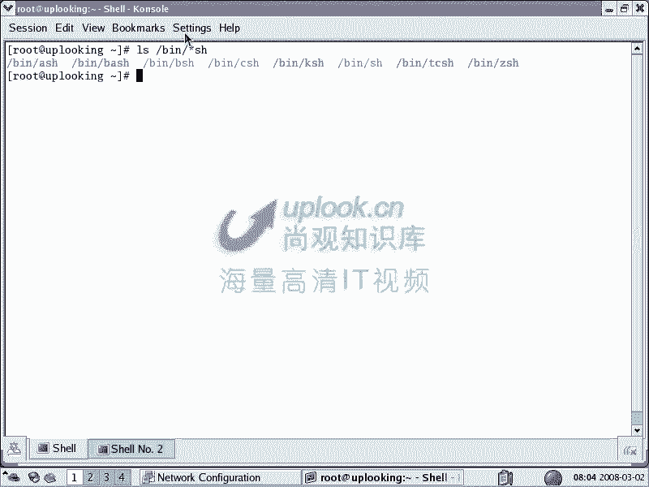

# 尚观Linux视频教程RHCE 精品课程 - P3：A-ULE-Linux-00-Linux学习建议2 - 爱笑的程序狗 - BV1ax411o7VD

我们现在开始呢就是具体的建议啊，学习部分的具体建议2嗯。然后呢，我们建议大家呢抛弃门户之见。很多人呢我们刚才说呃看google的这个招聘岗位，他并不是说要求你一定怎么样一定怎么样，连开发语言。

他都不是说你一定要熟悉java或者C加加或者C是吧？他说你熟悉其中一种就可以了。重要的是什么，你不管用哪一种语言，你都能解决你的问题，对不对？

条条大路通路呢。对，然后呢所以的话我们也是一样，你要做的是什么事情？你要做的是一个比方说网站或者一个集群，或者是一个大规模的电子商网站是吧？嗯，搭几层。那么这时候的话，你用windows能搭好。

ok那我也比较佩服你，但是windows的话它有先天的一些问题。啊，比方说它这个途形界面它去不掉。而linux里面那个途形界面的话呢，它是一个应层的，可以去掉的，就是你不运行它都可以，对吧？那么。

这另外一回事，抛弃门户之见的话呢，很多人都停留在这个上面。我我遇到很多人的话都是初学者都有这样的问题。

就说你到底是学windows还是linux啊学inux还是linux其实re还得还是无那可真是头大了。但是我告诉大家，就是说你最终学这个东西的话，哪种学好了都不容易。如果windows的话，那就算了。

如果windows你说我我会这个基本操作，那没什么好说。但是你如果会windows的这种比较驱动的编写，那也很厉害。这样的人的话也是其实很高的，是不是那么linux还是学windows。

我们说呢如果要是你想去深入到比较深就是比较那个底层，或者说想了解整个计算机系统是怎么回事。linux要学windows好为什么呢？因为windows它是全封闭的不告诉你这些事情到底怎么回事。

怎么去搭建的而linux的话，你连内核都可以随时拆开。我想签一个东西想改一个东西都可以我想重新编译一下内核，想看一下改完这个参数以后的效。

没有问题啊。这样讲的话，好像我听着感觉应该学linux更适合于初学者懂得这个事物的发生的本质。啊，如果windows的话倒是好学好用，是不是到最后的话，我只能是停留在这个一个用户的这样的一个位置上。对。

就是说你只是一个windows的用户，那么老大是谁呢？老大是微软嗯，如果要是学linux学的很好的话，linux很熟悉的话，老大是谁呢？啊，linux是为你服务的。

老大是你自己嗯你想把linux做成什么就做成什么，这就学linux的呃最根本的好处，你了解的很多，然后呢也非常熟悉这种技术是你自己的，不是跟着微软去跑。O明白了。嗯。

还有一个问题就是学unux还学linux。那么说呢学哪个都可以，但是呢unux有个问题，就比方说很多unux的培训地方啊，十多个人用一台机器，你在那边想去格式化硬盘。

怎么可能啊人家怎么可能让你去格式化呢？所以呢unux它呢必须。跑在特定的平台下，你接触的机会会比较少一点。嗯嗯，那么linux的话它可以用在什么呢？X86体系结构上，X86体系结构现在实际上是蛮强的。

比方说呃IBM或者惠普的机器，低端中低端的机器，很多都是装linux系统，而不是装他们自己的AX或者说呃HPUX。所以呢这种时候的话你用一个lininux系统。

它呢装在你自己的就是说笔记本上或者装在什么上的，那它接触的机会自然就多，那你进步的速度自然快。你说我就一定要unix，那我告诉大家。很多在跟你讲unix比linux好多少多少的这种人。

他未必知道unix真正比linux好在哪去。那么你可以问问，建议你去学unix的人，你可以问问他，你说unux到底比linux学的好在哪？嗯，那我可以很清楚的告诉大家。

unux它跟lininux的差距已经越来越小。lininux现在在po six的原生线程库上的性能还是要稍微差一些。但是呢从整体上讲，它的性价比要比unix的话要高很多，高的不是一点半点。

我们花10万块钱买一个呃就是买一个惠普的这样的一个。比方说两优的机器，它的性能相当于两就是说比方说2000年的时候买的那种惠普的那种小型机啊，小型机是一个机柜那种机器，比那样的一个机器的话。

处理性能都要高。那么你买两个这样的机器都比它的性能要高。那么为什么你要花几百万再去买小型机呢？所以呢真正强的公司，它比方说google它不在于他花多少钱去买多少个unux机器。

它是自己把廉价的linux组织起来X86平台下的廉价的linux组织起来。然后呢组成一个大的强大的东西，这是非常强的。所以呢很多不懂的人才会跟你说哦，unix有多么多么强，那是因为大多数人接触的少。

所以的话他感觉好像很好，感觉很专业。嗯，但其实的我话还是一样的。但是linux呢它的使用习惯跟unix啊是一样的。大多数东西都是一样。大家知道呢，就是说你比方说我们现在看这里面这里面的话。

我们现在看到的 shell啊，LS并下的新SH这些 shell有什么呢？ shell这是我们的操作平台。

就是我们现在这个提示服就是 shell给我们提供的 shell shell还有什么K shellTC shell shell。那比方说IX系统上用K shell你要说我现在想用K shellO可以啊。

这就是呃AX的这种提示服的界面啊。嗯，那AX上照样也有ba，所以呢它们都是相通的。那么unux和linux的话跟windows的差异比较大，但是unix之间它的差异较小。如果要是你想学unix。

那我想问你，你到底学哪种unixunix至少市面上见的最多的三种呢？IBM呃IBM的AIXAIX惠普的惠普HPUXX啊，sund是吧？SGI的er啊等等啊，还有sd就是scottunix这些系统很多啊。

你学哪种unix系统。你说学一种的话就会了就unix系统了，那我觉得未必。你自己买一个二手的呃IBM小型机，那么或者2BIBM的这种呃二手的比较差的设备，三四千块钱总是要的，能跑起来三四千块钱总是要。

所以呢这个问题的话，我觉得并不是说一定要建议大家去学呃linux。而是说你如果旁边就有unix，那你可以狠狠的去用它。但是如果你接触不到unixux重，你就学linux很好，触类旁通。

我们说呢还是立刻开始嘛，不在于你学什么，关键是学的怎么样。我们说学windows，如果让你驱动编的非常好，那我也很佩服。

这个道理就摆在那边，不信的话呢，你们问问业内的人士，问问真正懂的人士，真正在用unix的人士，看看unux性能到底到底比linux强在哪。那我告诉大家，真正懂的人的话，他是说不清楚的。

因为它有太多地方的话差异，嗯嗯明白吧？reite和得breite得b的话是两个发布完，得b的话是一个什么GU原创的unux系统呃，lininux系统它是什么呢？就是说那个包的呃带就是包的个数非常多。

但是reite呢它组织相对来说好一点，易学易用。所以呢两种的话都可以。如果要是你吃得了苦，那么得背用完了以后再去看reite也很简单。如果你reite深入的很深，再去看得b也不难。嗯，不在于你学什么。

关键是学的怎么样？OK我们再回过头来看。

学会lininux的话仅仅开始。我们刚才说了，lininux代表的是一大堆的OSS就是开源 software对open source software。

然后呢这个学会linux的话你只是相当于学会windows，你学会windows会干嘛？你可能只能去修修电脑传算机器，就是发生故障。这问题为什么这个端口怎么就那什么了呢？嗯那你只能干那事。

但是企业最需要的是什么？需要需要的是哎，你windows非常熟是吧？那么你要会photoshop，在windows上能给我把网页做好，或者说把那个图片做好平台设计做好。

或者你会windows又会什么3D maxax，然后又可以做一些什么3D动画，我不是学计算机，我成学设计的了啊，不是就是说我的意思就是说你会了windows以后。

那么并不代表你就会了这种用windows创造财富的这种技能，你必然是要什么windows只是一个平台，你要会在上面再去做一些什么其他东西。对啊，那么同样linux会完以后学完了以后你会该怎么样的。

你要搭建一些应用服务。比方说G two意的环境啊，acle啊，或者说需要编程啊，或者是网站啊或者集群呢，也也就是说你学会linux仅仅是一个开始linux很好，找工作不一定会找的很好。嗯嗯，明白吧？

你必然是会linux的话一些应用。所以的话我们教教的时候的话，一定要是从案例开始，你自己学的时候也是一样的。从开发者角度上去思考问题，这个是在linux里面学习的话，必须呃清楚的。

就是说学lininux的话，它相当于是怎么样的？就是住一个窝棚是吧？就很差的窝棚。那你去自然是站在建筑工人的角度上去考虑这个问题的话，会是呃就是相当于是事半功倍嘛。如果要是你不在他们角度上去考虑问题。

那么。呃，不从开发者的角度上考虑问题，那么你最终这个前进的幅度会有限。视角有限，所以导致没有办法去很多问题你就解决不了。因为微软的话，它已经帮你把很多问题解决掉了，屏蔽掉了。

你根本不知道里面到底是怎么回事。对啊，但是lindux的话，它的组织会相对来说差一些，经常遇到的问题就是典型的很多人的话，装软件不会装我下了一个点Z的包这个包的话该怎么装？

我说要点fi然后加一些参数make making store这三板斧嘛，就是inux用软件的话可能呃几乎是大多数人的话都是这样的，那么说为什么要这样，它实际上是涉及到一个编译过程编译的时候通常情况下。

在一个没有经过很好配置的机器里面，通常你来都会出现问题。这出现问题的话，那个我们的这种处学者的话，它很难去解决。那么多数都是些什么投文件等等这些问题。那么你怎么解决。

那么只能是从开发者的角度上这个投文件是干嘛我为什么要装我把它 copypy到哪的话，它能访问到等等。那这样的话就是说你能解决这问题。如果要是你在win。习惯了，那么遇到这种问题很头疼，特别讨厌啊。

但是如果要你换个角度去思考，哎，这个软件怎么开发出来呢，它就会好很多嗯。从unux历史触类旁通。也就是说呢你现在学会了一两种呃linux以后，然后呢你再看其他unix，或者你非常熟悉unux系统。

再去看linux。那么你要知道unux的理流派啊，大体上是有两个inix流派，一个是什么呢？sstem find，另外一个是BSDBSD的话有什么就是发布版的话有什么freeBSD等等这些东西。

open BSDn BSDdestop BSD等等。那么这两个楼流派。如果你都是熟悉系统5的话，你会发觉它的开开始的这个s的组织都是差不多的。所以的话你很容易触类旁通。但是如果要是片面的去什么？

我是学unux还是学linux，然后呢，我熟悉这个linux下的这种什么，就我们刚才看的那种图形界面，那你是不能触类旁通的。所以的话呢你要知道呃流派两个流派，那么我知道他们的特征以后。

其他的unux系统，你可能两三天的话就能上手了。然后还有我那句话，不在于你学什么，关键是学的怎么样。这点大家一定要记住。就是说呃抛弃原来跟大家说，就是大家一直门户啊什么的在考虑的我学哪个系统呢？

然后你还是开始了，现在就学，然后呢，把那个一开始的目标定好，就是我要做一个网站是吧？我立刻做一个网站，在几天之内，然后呢，我必须把这个知识的话总结出来，这样的话学的是最快，不在于你学什么。

关键是学的怎么样。好，那个小张的话还有什么问题没有，您可以再讨论一下。嗯，我现在的话就是想问一下，你刚才讲了一个问题里面说从unix的历史可以触类旁通。嗯，那这个里面的话。

那我干脆就是说我学了unix也可以很容易的。高懂linux那是肯定的个很多linux的就是linux为什么能发展起来？因为它有大量的熟悉unux人的话去支持linux呃，那么换句话说。

就是那我为什么不先学unix呢？如果你有环境，那你学unix也是可以的。但是你要知道unix可能就是six的话，它可以跑在X86上。但是呢其他的unux系统大多数都有专用的平台。呃，像索lar的话。

它有X86版本。我们现在CPU都是英特尔和AMD呢，有X86X8664是吧？那你在跑这个平台下，linux score，还有呢slars，它都可以跑在上面，但是呢如果要是你想。考AX那你虚拟机也不行。

你必须得真正搞一台什么IBM的二手小型机来跑AX。啊，你说它跟linux差异在哪呢？啊，差异还不多，可能AX的话用的submit多一些啊，就是这样的一个区别啊，明白明白，你如果能接触到unix。

那你接触的unix呃，利用这个机会的话，把unux搞懂也可以。但是学linux的话，那你随时随地都可以去学。所以你说选哪个好点。同样代码代码的这个多少，那么linux也是占优势的。

你方说你在linux set的话，想去完成一个什么事情，可能找到很多解决方案，但是unix会比较少。嗯。还有什么问题吗？没有了。嗯，好的，那么我们这节课呢先就先到这边。然后呢。

接下来的话是一些呃就是说我们的其他课程就是逐渐给大家引入过去。比方说unux历史啊，还有呢就是说呃linux怎么安装啊，怎么样快速上手啊，这样的一些视频。那么好大家继续来看嗯，谢谢史rack嗯，谢谢。

拜拜。😔。