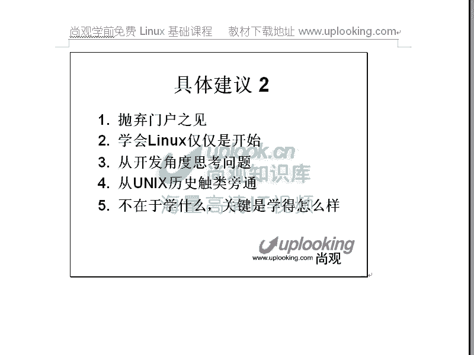
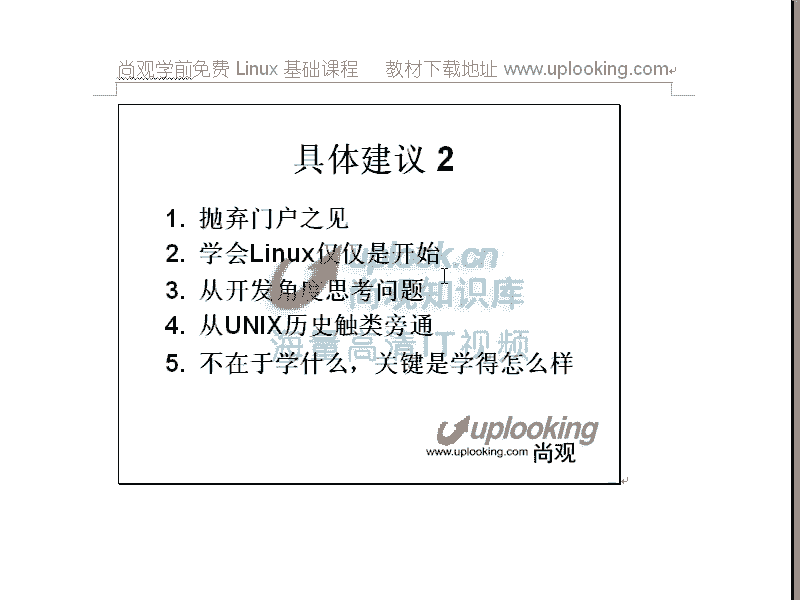
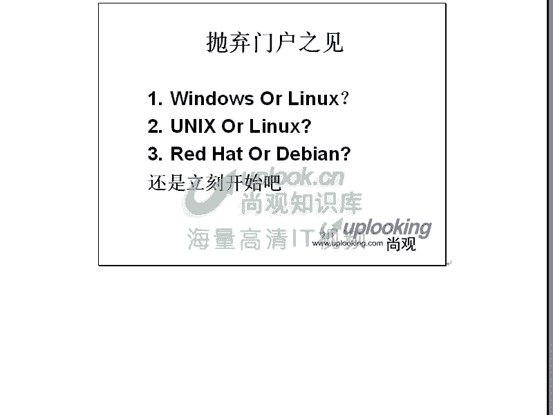
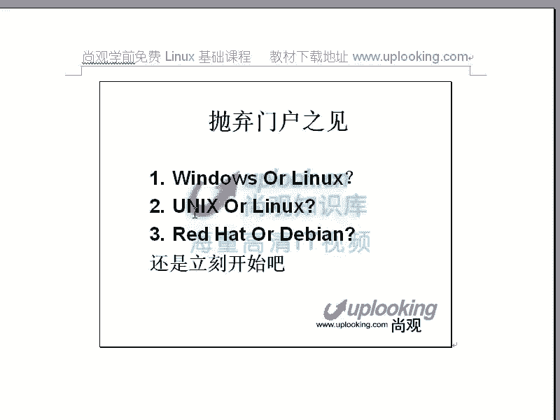
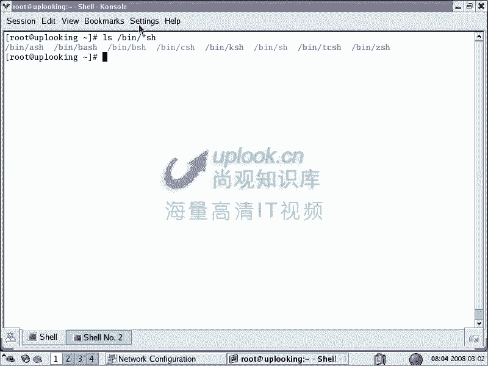
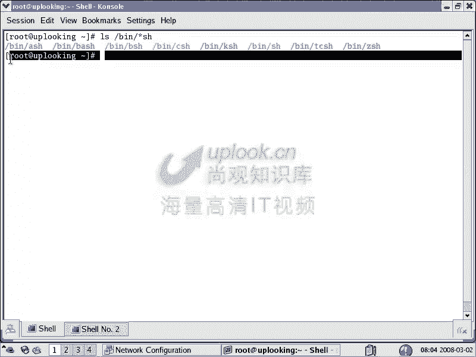
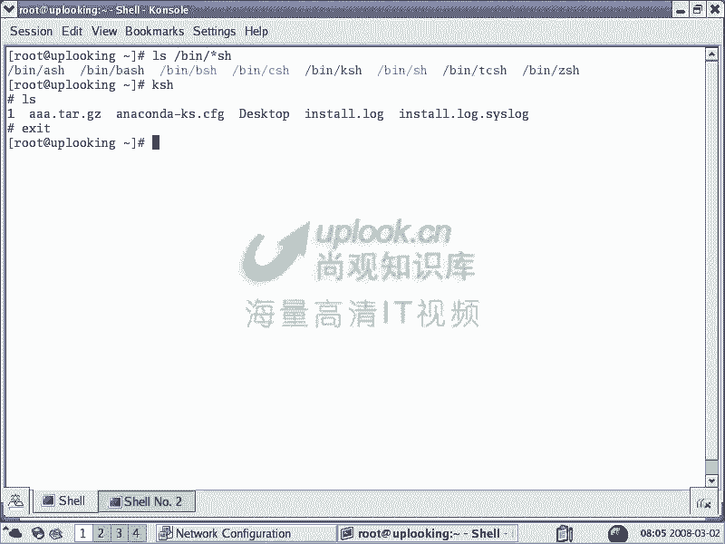
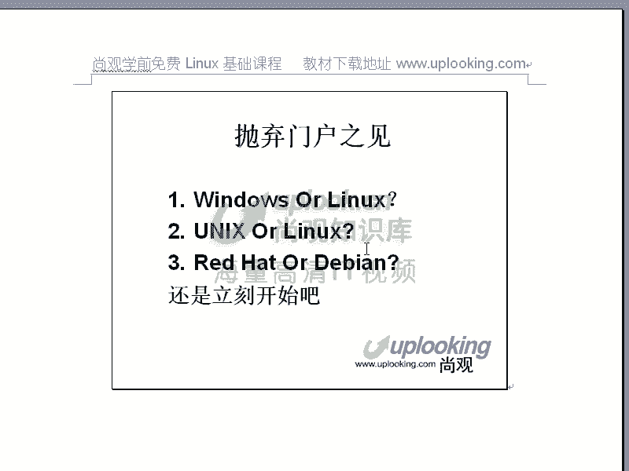
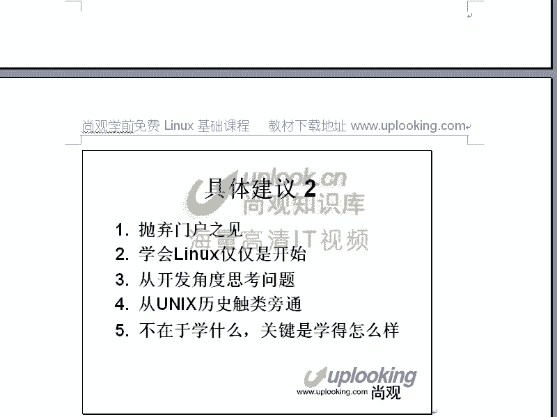
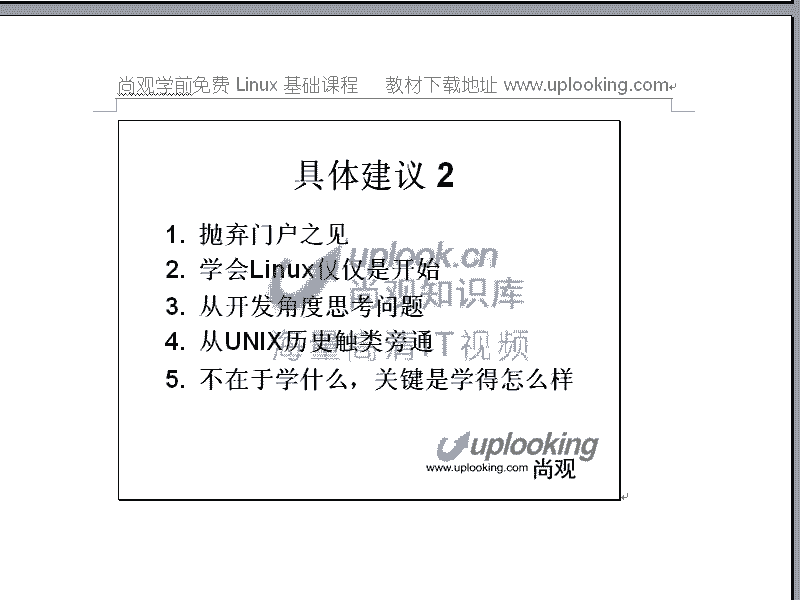

# 尚观Linux视频教程RHCE精品课程：P3：Linux学习建议2 🧭



在本节课中，我们将继续探讨学习Linux的具体建议，核心是**抛弃门户之见**，并理解学习Linux的真正意义。我们将讨论不同操作系统（如Windows、Linux、Unix）的选择逻辑，以及如何高效地开始并深入Linux学习。

---



## 抛弃门户之见

上一节我们讨论了学习心态，本节中我们来看看如何选择学习平台。首要建议是**抛弃门户之见**。这意味着不应局限于特定技术或系统的争论，而应关注**解决问题的能力**。

例如，许多公司（如Google）的招聘要求并非指定必须掌握某一种编程语言（如Java或C++），而是要求应聘者能**熟练使用其中一种并解决问题**。关键在于，无论使用何种工具，最终目标都是**有效完成任务**。



这个道理同样适用于操作系统。你的目标可能是搭建一个网站、一个集群或一个大型电商平台。无论是使用Windows还是Linux，只要能**成功搭建并稳定运行**，就达到了目的。

然而，不同平台有各自的特性：
*   **Windows**：图形界面是其核心组成部分，难以完全剥离。这可能导致在需要高性能、低资源占用的服务器环境中存在先天限制。
*   **Linux**：图形界面是一个**可选的应用层**。你可以选择不运行它，从而获得一个更精简、高效的系统环境。这为深入定制和优化提供了可能。

---

## 深入系统本质：Linux vs. Windows

如果你想深入了解计算机系统的底层原理和工作机制，**Linux是更优的选择**。

*   **Windows**：是一个**封闭系统**。其内部工作机制和构建细节对用户是隐藏的，你很难窥探和修改其核心。
*   **Linux**：是一个**开放系统**。你甚至可以查看、修改并重新编译其内核。这让你能够：
    *   理解系统工作的本质。
    *   根据需求定制系统。
    *   将技术真正掌握在自己手中，而不是被动跟随某个商业公司（如微软）的更新步伐。

简单来说，精通Windows，你是一个**高级用户**；精通Linux，你则成为系统的**掌控者**。

---



## 实践平台选择：Linux vs. Unix





对于是学习Linux还是传统的Unix（如AIX, HP-UX），我们的建议同样务实。

以下是选择Linux进行学习的几个关键原因：

1.  **接触机会多**：Linux可以运行在普及度极高的**X86体系结构**（如个人笔记本、台式机、主流服务器）上。这意味着你可以随时在自己的电脑上安装和练习，进步更快。
2.  **性价比高**：Unix系统通常需要运行在昂贵的专用硬件（如小型机）上。而基于廉价X86服务器组装的Linux集群，在整体性能和成本上具有巨大优势。这也是像Google这样的大型公司广泛采用Linux的原因。
3.  **技能可迁移**：Linux的使用习惯与Unix**高度相似**。它们共享相同的设计哲学和大量命令（如`shell`, `ls`, `vi`）。精通Linux后，再学习其他Unix系统会非常容易。
4.  **社区与资源丰富**：遇到问题时，Linux拥有更庞大、活跃的开源社区，更容易找到解决方案和代码示例。



**核心建议**：如果你身边有现成的Unix环境，可以充分利用它来学习。但如果缺乏接触Unix的机会，那么**从Linux开始学习是绝佳的选择**。关键在于**立刻开始并深入学习**，而不是在选择上犹豫不决。

---



## 学会Linux仅仅是开始



需要明确的是，**学会Linux操作本身只是一个起点**，就像仅会使用Windows一样。这并不能直接创造巨大价值。

企业需要的是**能利用Linux平台解决实际问题的人才**。因此，在掌握Linux基础后，你必须学习在其上部署各种应用服务。

以下是后续学习的关键方向：

*   **搭建应用服务**：例如Web服务器（Nginx/Apache）、数据库（MySQL）、编程环境（Python/Java）、网站架构或集群技术。
*   **从案例入手学习**：设定一个具体目标（如“一周内搭建一个博客网站”），在实践中学习和总结，这是最高效的方法。

---

## 培养开发者思维

在Linux学习中，**从开发者角度思考问题**至关重要。这与使用Windows的体验截然不同。

*   **Windows**：将许多底层细节封装起来，用户通常只需点击安装即可。
*   **Linux**：经常需要从源码编译安装软件，这个过程可能遇到各种依赖问题（如缺少头文件`*.h`）。

例如，安装一个`tar.gz`源码包通常需要三步：
```bash
./configure
make
sudo make install
```
如果编译失败，你需要像开发者一样思考：缺少的依赖是什么？它有什么作用？应该安装到哪个路径？培养这种解决问题的能力，是Linux学习的核心收获。

---

## 触类旁通：了解Unix历史与流派

当你深入理解一两种Linux发行版后，再去学习其他Unix系统会非常容易。了解Unix的**两大主要流派**有助于触类旁通：

1.  **System V 流派**：包括商业Unix如AIX、HP-UX，以及Linux发行版如Red Hat。
2.  **BSD 流派**：包括FreeBSD、OpenBSD等。

了解它们的**共同特征和组织结构**（如系统目录的布局`/etc`, `/usr`）后，学习新的Unix系统可能只需两三天就能上手。

**记住核心原则**：不在于你最初学的是什么系统，而在于你**学得有多深入**。技能深度决定了你的迁移和学习能力。

---



本节课中我们一起学习了如何以开放的心态选择学习平台，理解了Linux在深入系统本质和实践便利性上的优势，并明确了学会Linux基础后应向应用实践和开发者思维迈进的方向。关键在于**立即行动，深入学习，并在实践中构建解决问题的能力**。下节课我们将开始更具体的内容，例如Linux的安装与快速上手。