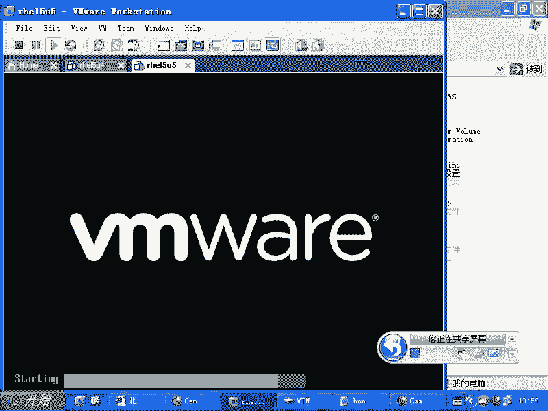

# 尚观Linux视频教程RHCE 精品课程 - P40：RH133-ULE115-4-2-grub-kernel-root - 爱笑的程序狗 - BV1ax411o7VD

阿那NT引导方式是不是。现在我们说到那。呃，我同学问什么，问那个网络上说的什么？NT引导当中。NT引导方式。那个是不是借我们？就是就是这个P就是这种方式是吧，把MBR呃把PBR保存起来。

PBR当中的那个数据保存起来，然后让NTloader来引导，是不是？呃，我我不知道我不知道你说的那个我没看过他的文档，我不知道他是怎么回事。那个有可能啊有可能，反正我觉得这个东西你只要搞清楚了以后的话。

你会非常非常的那个就是清晰啊。你比方说你现在装的是一个lininux，是不是你装的是一个lininux是吧？然后呢，你要再装一个linux，比方说你就装个红旗linux。😊。

你把红旗lininux的这个引导记录放在PBR当中。对吧然后你可以用一个这个windows的 boot load去引导什么这个地方的就是rehead这个这样的一个linux系统，是不是也可以去什么呢？

假如说有另外一个红旗的linux系统，它放在另外一个分区的PBR当中，那么你再去保存一个，然后让它也再去引导，或者是让什么呢？这个地方的grab再去引导这个地方的gb，这都是非常容易的。

所以现在我们要看到什么呢？grab的这些选项或者grab的这些命令，是吧？也就是说一个grab怎么去引导另外一个grab或者一个grab怎么去加载什么？我们的一个。😊。

内核是不是那这两种引导方式肯定不一样，是不是？所以的话我们来看一下grab它到底有些什么样的这个呃操作啊，有些什么操作啊。😊。

呃，停就是开机后停在grab rescue，我怎么没有见过gra grabb rescue这样的模式啊，我我没有见过，我只见过，就是说就一个grab这样的一个grab一个大写提示符。

这说明你的grab点cuff找不到了。但是tage2tage一age一下滑键5都是正常的，是不是嗯。😊，所以所以这个的话呢，我没有见过grab rescue这个地方我没有见过。那么。重建grab的话呢。

就是grab大于号出现这样的提示符的时候，那么你需要怎么样呢？需要重建这个grab点com，不是需要重建grab啊，重建grab就是RPM安装了。这个的话是说你的tage2没有了以后你这样做是不是？

那么grab install的话解决的是tage一和sage stage一项限5的问题啊？pve2。tage2是吧？我不明白，就是咱们那个就是一位同学的话，他说的是什么问题啊。什么问题我不太清楚。

就说你你可以再再多说一些啊。新版啊新版的grab，那可能是我没有见过啊。

那那新版就是H1515的话，用的是新版的grab吗？我们看一眼啊，不是。我看一眼啊。RPM杠QA是吧，GREP。是。呃，我我来那个共享一下啊，R716啊。O。看一眼啊，那么现在用的是grab杠0。97。

是不是？这样的话你可以看它的版本啊，看它的版本。RTL6啊，那那你研究的是比较深的。然后呃我们来看一下grab的话呢，细节的一些就是说grab内部的一些命令是吧？我刚才说graub点看复如果丢失的时候。

它是怎么样一种情况，它是这样的一种情况。就出现这样的界面，是不是？啊，就出现这界面，这个的话表示grab的程序已经完全什么运行完毕了，运行完毕了。

stage一tage一下划线5tage2都已经运行完毕了，对吧？你要想退出的话呢，QYT那就直接如果要是在启动时候启动不了QYT的话，那就直接什么重启了是吧？然后我们看一下啊，CD到什么呢？呃。

boom目录下的grab目录当中去。那么在这里面的话，你看到这边是不是有什么有。😊，有什么呢？有 stage一吧。有ate一是吧，多少字节啊？512是吧，然后还有什么呢？stage一下划线5是不是？

如果要是你是EX3的话呃，EXT2EX3的话都是一样，它会用e two FS stage一下滑线5来来写到什么呢？你的这个呃分区的前面去，对不对？然后呢，还有就是什么呢？

还有就是我们这个呃gra点com。那么它这边的话呢，哎呀错了啊，我刚才写的是firs menu是吧？它这边是manu first，是不是manu first，那么大家的话呢看一下啊。😊，这个文件的话呢。

实际上就是它的配置文件啊，这个就是它的配置文件grab。那么这个就是它的所有的文件所在的位置啊，所有的文件所在位置就是跟启动相关的那你像grabgrab installt这些东西。

它全部都放在什么B目录下或者SB目录下，明白吧？那么现在我们来看一下就是呃。我们的这个gub。他的话呢是怎么样去引导的这个过程。那么我们来看一下VI啊grab点com是不是？

那么也就是在那个命令里面的话呢，你可以运行什么命令啊，你可以运行什么命令。那么当你去引导科l的时候的话呢，实际上是这三行命令。也这三行的话呢，大家最好背会啊，简直太熟悉了太熟悉了。

但是呢这个东西的话呢稍微有点什么啰嗦啊。我通常情况下的话呢，在装完一个系统以后，我就会顺手什么把这些东西给它删除掉，没用的东西删除掉啊，这些东西是什么呢？一个RHGB就是re的话呢，在启动完了以后啊。

😊，它安装完了以后，它给你启动的时候，它会自动给你启动一个图形界面，对不对？啊，它会把你就说这个这个东西的话呢，就是reite的话呢，它会给你怎么样？他可以给你做一个呃遮盖。

就把ladux原本的那些内核的信息啊，还有系系统服务启动的信息啊，这些东西它给你美化一下，或者说不要看的东西，比方内核的这些东西的话就给它遮盖起来，美化一下，让你看着感觉就是什么？哎。

这东西比起windows来可是不次，是不是不差呀？它是这样的，所以我从来不喜欢用。因为我已经习惯使用原来的什么比较丑的方式了啊，我就想看它到底启动的哪个地方的时候有问题。

因为我们经常给学生去 trouble shootinging，是不是学生他有问题的时候，他给我遮盖掉，那么我不是就失去了看到最最本质信息的机会嘛？所以我一般不用它，而且加载它的话呢会比较慢。

你想加载一个图形界面，是不是？那么我们一般的话呢会。😊，直接把它干掉，quiet的话是什么呢？是内核参数啊，HGB的话呢是我们的reite自带的参数。那么quiet的话是什么呢？😊，让内核安静一点。

内核里面的话呢，你想啊我们如果要是装一个windows内核，windows一启动的时候，它是不是要驱动你的键盘鼠标，是不是要驱动你的P3设备是不是要驱动你的硬盘是不是要驱动你的这要驱动你那分配内存等等。

这些信息的话呢，在linux里面全都不全部都会给你显示出来。而windows啊会怎么样的，出现一个什么啊，一个小窗户在那边是吧？下面的话那个一个进度条在那边动动动，是不是这些过程它都不给你显示。

也就是话就是什么跟windows一样也别显示啊，但是我的话呢也习惯什么看一下那些东西，我觉得无所谓啊，挺酷的，是吧？所以的话呢这个时候我们就把那两个都删除掉，那么剩下的的话有用的。

也就是说grab它之所以能启动一个内核，它就这么来的。首先你得告诉他到哪个地方去找内核，对不对？所以这个地方的话就是roHD0逗号0啊，很多人的话呢欢。😊，把这个地方改成什么呢？HDA。啊。

你要知道啊HDA或者SDA。是。设备文件设备文件的话呢，是我们的驱动加载以后才会有的，是不是？也就是通过这个设备文件能访问到我们那个驱动程序，对不对？但是我们现在我lin能系统压根儿都没启动。

你从哪找驱动去，你从哪找设备文件去，对不对？所以我们现在讨论的不是linux，而是什么grabgra它怎么去找第一个分区呢？第一个硬盘，第一个分区呢？他认为第一个硬盘是什么呢？HD0。😡。

第一个硬盘向子，第一个分区是什么？😡，逗号一明白了吧？所以这个时候你要知道啊，它啊逗号0，它跟我们的linux系统没有关系啊，跟linux系统没有关系。所以HD0逗号0。

那么就是我们的第一个硬盘的第一个分区，到第一个硬盘的第一个分区去找什么呢？VMLINUZ对不对？😊，这边的话就是很多人困扰他的一个问题就是什么？哎，老师，我这个VMLINUZ啊，你看我给你看一下。😊。

这还在大呢。我这个VMLNUZ不是在不特目录下有个VMLNUZ吗？是吧？那你这个地方怎么给我变成了根下面的VMLRNUZ啊？😊，这个就相当于我们。grab它采用的是那种类似什么。

类似windows的那种方法。也就是说他找到这个分区了以后，他不是把这个分区加载到什么根分区下，在整个的一棵树当中去寻寻就是寻寻找这个文件，而是怎么样的？像windows那样，它先切换到什么？

你看到这边是不是先切换到C盘，是不是C盘是不是有个根呢？然后呢，我如果HD0逗号一的话是D盘，对不对？D盘上是不是也有个根啊，那么两C盘和D盘下都有一个A文件，那么它们两个都是在根下面，明白吧？

也就是它这个时候它相当于直接找到的是谁呀？这个根是谁呢？你看人家告诉你了，它的根是谁啊？根是分区是吧？波特分区下就有一个根目录下，波特分区的根目录下是不是就有一个这样的文件。

而我们现在看到的这个根是什么根呢？这个根是什么？是我们HD零逗号一的根是不是也就是这个根实际上是我们的根分区，然后呢，我们在根分区下怎么去使用不特分区里面的东西呢？是不是我们通常情况下它会怎么样？

mount第于下的SDAEmount在下面，是不是？也就是这个杠就是什么？根，那么我们访问杠的时候，实际上访问的是什么？😊，SDA1对吧？所以你要区分区分清楚啊，就是你的这个根。

实际上这个时候是不特分区，找到不特分区下的什么呢？这个根目录不特分区的这个根目录下的什么这个文件，对不对？然后以只读的方式去加载ro等于label等于根啊，就是加载。那么这边的话呢。

我们如果要是不习惯使用label等于根的话，那你直接加载成什么第于下在SDA2，也就是把SDA2变成是我们的什么根分区是吧？其实的话呢，你最终简化简化到什么程度呢？RO都可以不用。因为你不写RO。

它也是RO的。😊，明白吧？不写RO它也是指读的。所以的话呢最简化实际上就是这样到第一个分区下去找根这个第一个分区的根目录下的什么这个文件是吧？然后呢，这个文件加载了以后，告诉这个文件。

也就如它等于什么什么东西，是承上启下的，乘什么上起什么下呢？就是乘的是 kernelnal kernelnal引导完了以后，是不是它要找根分区啊。😊，你们看一下啊。

我们的foot loader就是grab是吧？grab它怎么找到 kernelel呢？是通过两个命令是吧？一个是routerHD0逗号0，是不是然后呢再去加载 kernelel命令。

 kernelel命令后面加的是这个 kernelel的文件，对不对？这边是不是这个过程过去了过去了没有？😊，但是呢科l加载完了以后，它怎么找到IIT呢？IIIT它可是一个实际的根目录下的一个文件。

是不是根分区下的文件，它要找根分区先。😊，对不对？找到根分区了以后，才能找到什么根分区下的什么IIT文件，是不是？所以的话呢他怎么知道哪个是根分区啊？😊，他怎么知道哪个是根分区？OK回过头来是什么？

哪个地方呢？是不是。😊，Yeah。是不是如特等于地面上的SDA。二是不是也就是说告诉科el说什么，科el，哎，那个是跟分区，我这个硬盘上有三个根分区，没有关系，你找SDNR作为你的根分区。

明白这个意思了吗？嗯所以这个地方是非常关键的一个什么承上启下的一个关键的内核参数。如这等于什么什么，就是一个非常关键的内核参数。明白了吧？当你的这个硬盘上，或者说你在做嵌入式系统，你刷了两个bios。

刷到什么呢？这个村组上，那么分了两个分区，第一个分区用什么呢？呃，也是一个根，第二个分区也是个根。那你怎么启动这两根？跟温区下的这个两个linux系统，那你就用什么？啊。用什么呢？这个这个方式来区分。

也就是说你还有个SDA比方说7上也有根分区，那你可以用什么DDV下的SDA7是吧？这样的话就启动了第二个什么linux系统明白了吧？OK那么这边的话呢会加载一个什么呢？

跟非常相关的IITRD的程序IITRD的话呢是给 kernelnal做什么辅助的啊辅助的。大家知道啊，我要编译1个VMLINUZ这个文件啊，我编译要编译多久。😊，要备多久？我至少30分钟吧。

一般的话是一个小时是吧，一个小时一个半小时。你前面的配置啊，后面的这个编译过程啊都要这么久，还要编译它的什么相关的模块是吧？一般编译这个内核的话呢，可能有个30分钟够了。那么你每次安装的时候。

总共用的时间是30分钟，是不是？😊，哦，那你再加上一个编译内核的时间，那总共一个小时是吧？你说这个lininux怎么那么烂，是不是？但是你说我不编译这个内核，它有个问题，我的机器是一个普通的台式机。

我装的都是最常用的软件呃，这个硬件是不是？结果的话呢，你拿了一个什么服务器过来，旁边的人拿了一个什么呢？拿了一个小的上网本过来，它的配置都是不同的，是吧？所以里面的这个驱动程序是不是可能不同啊。

那么我去编译这个内核的话，我就想选择不同的驱动程序？😊，因为我的安装的介指，一个是用什么SSD启动是吧？另外一个是用U盘启动，还有一个是用正常硬盘启动，还有一个用s硬盘启动。这个时候的话呢。

蝌le他怎么知道什么，他怎么知道。reite怎么知道你买它这个reite系统的人装在什么系装在什么硬件上，不知道是吧？所以这时候的话的内核要经过定制。如果不定制的话呢，它就不能驱动所有的东西。

我又不可能把所有东西全部都编译到内核当中，是吧？这样内核太大了。所以这时候问题就是什么？不同种的设备，我要装不同的内核，结果的话我编译内核的话呢，又花很长时间是吧？

所以的话呢我能不能这样把内核里面所必备的驱动分出一部分来放在哪了，放在IRTRD里面，让内核标准化，也就内核是不需要反复去重新编译的。那么我把可变的驱动程序，也就跟内核启动相关的驱动程序，放在哪呢？😊。

IRTRD里面这个时候的话呢，假如说你的SDAR是1个sga设备，那我就把sega的驱动放在哪？ITRD里面对不对？如果要是你是一个什么呢？U盘啊，不是你是U盘启动，那么这个U盘的USB驱动是吧？

我就放在哪儿呢？放在ITRD里面。如果你是一个普通的SATA的硬盘，那我把SATA的驱动放在哪呢？ITRD的明白吧？这样的话我就在定制不同种的系统的时候。

我的根温区放在U盘上放在光盘上还是放在什么上都不同是吧？但是呢我不需要重新编译内核，我只需要怎么样把它放在ITRD里面就好。这个的话就是IITRD的机里，明白吧？还记得我们说在安装的时候。

有个叫做linuxDD记不记得我们说先有机还是先有大的问题，对不对？那个linuxDD就是说你把那个驱动盘插进去以后，它会把那个里面的驱动打包在哪呢？😊，打包在IITRD里面。明白吧？

嗯也就是说你的硬盘是放在一个什么呢？放在一个sigga卡上，需要先驱动sga的芯片是吧？那这个sga的芯片并没有放在VMLINUZ这个文件里面。那它放在哪儿呢？放在这个里面，就是在你安装的时候。

你输入linuxDD以后，它会帮你打包在里面，对不对？😊，但是很多时候啊很多很多时候它都会怎么样呢，都会失败。就是说并没有真正给你打进去。或者说呢它这个打包的过程的话呢，不是特别智能，没有经过千锤百炼。

导致什么呢？IITRD并没有把那个驱动打包进去。这个时候的话要求你手动打包。啊，那要用什么命令呢？make INITRD啊，你们有这个命令的make INITRD啊，MKINITRD啊这个程序。

所以的话这个东西的话呢，我们等一下给大家再去演示啊。那么你要知道这三行命令都是干什么的，知道了吗？知道了吧。这三行命令的话呢，尽量的什么呢？都记备汇啊。那么如果要是你指定跟分区的时候，指定错了。

本来这个分区下。原来是有什么有根里面的那些东西的，对不对？嗯现在的话怎么样非机物物格式化了，或者是怎么样呢？或者说你本来你的ITRD里面是什么呢？有这个驱动程序，是不是有这驱动程序。结果的话呢。

你把它比方这个硬盘的话呢，换了一个接口啊，这时候都会导致什么呢？找不到跟分区是吧？不管是这个地方找不到根分区，还是这个地方找到找不到根分区都会出现一个什么呢？就是这两个因素啊。

找不到根分区两个原因找不到跟分区都会产生同样的一个错误，什么错误呢？😊，Colonlow panic。Clonnalpic kernelpic结果就是什么呢？你键盘上右上角的两个灯啊。

两个键盘灯就在那边哗哗闪，按什么键盘都没有反应。这时候你只能什么reset键，那叫reset键。😊，明白吧？就是colonnal panic。所以 kernellonnal panic的话呢。

就要么就是这个地方有问题，要么就是这个地方有问题，就没有加载合适的驱动。要么就是怎么样呢？要么就是说你的根分区没有指定队啊，根分区没有指定队的话呢，这个地方可能常见的一个问题是什么呢？就这样的。😊。

你看啊刚才我是把。😡，label等于根是吧，然后呢改成什么呢？改成SDAR了，是不是？那么SDR有什么不好的地方呢？就是它是按排队的顺序来的是吧？今天的话呢，我我在讲课是吧？哎。

我看到第二排的一个同学是吧？第二排这边的第一个同学是吧，欠我100块钱是吧？结果第二天我过来我找他要钱，不是你还给我钱，结果的话呢，他们座位顺序已经变了，对不对？所以这个时候的话你按排序的话呢。

来找跟他去很可能是不可靠的。😊，那我指什么方式比较可靠？我说你叫什么名字是吧？给我写个字据，你要签个字，我这时候找的是名字是吧？我管你坐在哪。所以这个时候的话，你看啊。

如果要是它是以这种方式的label等于根，就是说我事先要给这个硬盘的话，起个名字是吧？起个卷标。这个卷标的话呢很好起，怎么取呢？😊，e to label是吧？ewo label。然后呢。

我们DEV下的SDA1，你看一下它的卷标是什么呢？杠是不是那SDA2的卷标是什么呢？杠是吧，就是根是不是就是根。那么如果你想改它的话呢，你到时候我把它改成什么AAA啊，那惨了。

一会儿启动时候就启动不起来了。因为系统是什么呢？找。😊，卷标为什么根的这个分区作为什么根分区是吧？如果你装多个lininux系统，是不是就有多个根分区啊？那么软下的系统的话，它的办法是怎么样的？

它把第一个分区叫做根啊，第一个根第一个linux的这个根分区叫做根。第二个linux的根分区叫什么呢？杠一，后边加个1234的一，然后呢，第三个就是第三个就是杠2明白吧？

那么你相应的你在这边看到的它的这个加载坑的时候，就是杠杠1-2，这样就加载了不同的什么根分区了，明白了吧？就是linux的多启动的问题。我这个地方讲清楚了没有？😊。

想清楚了是吧？一定要注意什么呢？承上启下，要bi去启动波特 load，这个我们就不说了。波特 load是怎么去启动 kernell，是不是怎么启动的呢？通过三行命令，对不对？他先去给你怎么样呢？

到那个分区下，哪个分区下呢，有 kernell的那个分区下是吧？有 kernell的分区一般是什么？波特分区，对吧？在波特分区下找到波特分区的根目根目录下去找到这个文件，是不是找到这个文件以后的话呢。

告诉他一个内核参数，对不对？这个内核参数是kil去找什么IIT的时候所必须的内核参数，对不对？然后呢再给内核一个配套的文件，这个配套的文件是为了应付什么呢？尤其是。😊，对，尤其是服务器里面那种什么。

你把硬盘放在了什么一个。谁知道什么的这样的一个s的什么这列卡上是吧？就这列卡的驱动reite也不可能遇未卜先知啊，他不可能未卜先知把那个驱动程序放到了这个VMLINUZ当中，它不可能的，对不对？

所以他把这种类型的驱动都放在哪儿呢？放到这个地方，就是跟启动相关的驱动都放在这个地方。对不啦？所以这就是刚才的那个put loader怎么去启动的过程啊，那么我们的话呢要求大家怎么样呢？到什么程度呢？

到这个程度啊，就是你你自己的话呢，在这个提示如下，你能手动输入这三行命令，比方说root是吧？啊，可以用tableable键啊括号。HD0唉HD0这个硬盘上到底有多少个分区啊？

那么我按一下table键啊，HDN逗号，我按一下table键。三个分区HD0。逗号0逗号一逗号2是吧，他们都是什么分区呢？一个是EX三分区，你看这是83是吧？EX3分区，另外也是1个EX3分区。

还有一个的话是82号分区，应该是s外分区啊，s外分区。所以它呢HD0逗号0。然后呢，接下来的话呢是科l。😊，从这个分区的什么呢？根下这跟下有什么文件呢？摁下table键，它给你自动补齐，是不是？

那我说我要找的是VMLNUZ。😊，对吧。然后再输入一个什么呢？如er等于。比方说DEV下面的SDAR是不是？然后呢回车，然后再输入1个IITRD。RRTRD。系。II。RD是这个文件是吧？

然后再去回车OK那么我手动输入了这三行命令了是吧？我是通过按table键帮我补齐的是吧？然后最后我再输入一个什么呢？波特啊，一回车，这个时候系统就会自动启动了。😊，明白吧？这样的话呢。

你的g点com没有你能不能启动起来？没有问题。启动起来以后，你再去VI创建一个新的brab头，照着那个里面的话呢去改一下就OK了。明白吧？所以的话呢这就是什么呢？这三号命令一定要记住。

而且的话你要知道他怎么做，我为什么这样做。那么我一按不。按理说，如果要是这是在系统最开始的时候，它就会启动。那么我现在的话是没有用了。因为我现在的话呢。

这个我运行的这个grab实际上是在呃这个统一的这个内核的管理下是吧？也就是相当于有个大程序已经在运行了，这个程序是至死不会放弃自己的这个什么控制的，那这个程序的名字叫什么内核就是 kernelel。

明白吧？这个就是 kernel就是一个大程序，它不会像graub以后不不会让gb，我引导 kernel，我把自己就怎么样啊，就是说。传击力棒给下边我就退位了啊，他不会科呢不会退位啊，除非你把它关机。

我用不就跳出来，对吧？那么我在这个目录下的话呢，大家要习惯会使用。help命令啊HELP。他能告诉你所有的命令啊，如果你想知道某一个命令的这个特殊的用法的时候，你可以输入help。

比方说helll helpp kernelel啊，你看一下 kernelel它这个命令的作用，它可以加什么什么参数，对不对？😊，那么我们的话呢。再看一眼啊。如果要是你想启动的是什么呢？你想启动的是一个。

你将启动的是另外的一个but loader，就是另外的1个PBR上的but loader。对吧你要启动另外1个PBR上的put loader。

就像我们说一个不特 loader调用另外一个put loader的时候，那么你可以用什么命令呢？用另外两个命令啊，一个叫什么呢？😊，一个叫做。呃，ROOT什么呃，那位ERIFY啊，就这个。

你比方说我这样的啊，如果要是我现在。😡，我现在的话呢想启动另外一个分区，那么我就是什么如此NO是吧？VERFYTY是吧？然后呢，我这边加上一个什么呢？HD0。啊，逗号几呢？比方说我有另外一个分区。

比方HD0逗号5上是另外一个linux系统是吧？那个linux系统上面的话有个but loader，我要引导那个上面的另外一个but loader。

那个but loader可能是liow或者可能其他东西啊，也就 load不光是grab一种是吧？还有一种叫做老式的叫liowILO是吧？那么假如说我想引导那个地方的lilo，那我就这样回车。

回车完了以后的话呢，再输入一个什么呢？😊，啊，loader啊加一。一回车。这两行命令啊，那么它就怎么样的直接就引导，就是我用一个bo loader引导了另外一个put特 loader。

不管那个bo特 loader是graub还是little还是其他什么boto loader，它全都可以能，它都全都可以引导，明道吧？这就是一个分区引导另外一个分区，是。

就是一个一个bo loader引导另外一个分区上的put loader这个作用明白了吗？😊，明白了是吧。好，就下机退出。好。大家有什么问题没有？😡，有什么问题没有？咱们在这节里面的话呢。

学会了这个grab的这个几行命令是吧？引导 kernelnal几行命令，还引还给大家讲了，就是说呃 kernell是怎么承上启下的，对不对？因为我们的grab它可以给内核传递参数。

其中一个非常重要的参数是什么呢？ROOT是吧？如此啊好。😊，我们再看一眼啊。

回头再看一眼。这个时候的话，我们这三行命令清楚了，是不是一个title三行命令清楚了。下面这个地方的话是什么呢？这个前面这个地方的，我就没给大家讲，那么大家应该都差不多能看得清看得明白是吧？

default等于零表表示默认情况下，它找的是什么？第一个title，对不对？当然我可以有多个title，我想启动多个系统的时候，比方说4YY啊，我复制说四行，然后把它连接出来。

那么第二个title的话呢，我这边叫什么呢？😊。

叫做呃。😊，shack啊linux那么我这边的话呢可以引导另外的其他的哪个分区下的这个bo loader都可以。我可以把刚才的话引导其他put loader那两个那两行内容写在这个地方是吧？

什么一个root NOVER什么什么东西，然后还有一个什么呢chairloader加一是吧？把那两行东西写在下面啊，这样的话我就引导了另外一个linux系统，对吧？那么我还可以怎么样呢？我还可以这样。

😊，呃，比方说我想定制一下它啊，比方说我这边定制一下，我后面的话加我自己喜欢的参数。比方说VGA啊等于0X314啊，这样的话呢就是以这个frame bufferffer的这个驱动。

就是说让我们这边的话有一个。图形界面就是我们现在看的都是文本界面，是不是？嗯那么如果要是0S314的话，就是800乘600的分辨率。也就是在我们的这个控制台上有800乘600的分辨率。啊。

运行800的板就相当于加载了显卡驱动啊，VGA这个的话是什么的内核参数呢？这个是什么的内核参数呢？是我们的科l的内核参数。😊，那个参数啊，VGA等于什么？这是ner那一套参数。

如果要是我们现在想把SE的那关掉。😊，啊，SE6ux话很强大啊，强大到什么程度呢？就是有时候你改错了它的配置文件是吧？他说出错是吧？出错。我说我想改过来，把这个配置文件改过来。

结果这时候SEinux已经进入了保护模式是吧？他都不允许你改这个配置文件，你说我想改过来呀？我想我想改过来，那那你要事先改我的配置文件是吧？那我想改这个配置文件，那你先把我的模式先改过来。

你想我改改这个模式，你先改我的配置文件，你说最后的话你没有办法关掉SE明白吧？那这时候怎么办呢？😊，因为SEinux把它改成那个permissive那个模式以后，不是可以进行报警模式。但是它不限制你吗？

但是这是一个理论上，它有很多行为是限制，明白吧？所以这时候你可以加上一个什么SE Linuxinux等于什么？等于个off，好像是等于of啊，还是等于0啊，我记不太清楚。大家可以查看它的这个门配置。

就是 kernelel参数的门配置啊，也可以在网上去搜。还可以去加上什么呢？比方说我原来遇到一个bug啊，这个bug的话呢是什么？我的CPU占用率永远是百分之百。我就很纳闷啊，谁占我的CPU了。

是不是我一看内核进程，一个叫做ACPI就是高级电呃高级控制电源接口ACPI就是高级是吧adance是吧，控制是吧？电源就power是吧，接口啊， interface interface。

那么高级控制电源接口，它的话呢。😊，这个进程啊，它出现bug，可能是因为我的主板跟它不兼容，或者这个主板做的不规范，导致返回来的值化有问题。他一直在那边查查查查什么温度啊，CPU温度啊。

风扇转速之类的东西，查不出来，它就一直在那边死命的转。这是我加上一个什么ACPI等于什么off啊，我不要看风扇转速了，我不想进入休眠模式，我不想怎么样呢，我不想看系统温度了啊off这样的话呢。

这些内核参数都是 kernel。但是呢我们知道啊。我们经常在这个地方改的一个东西是什么呢？就是运行模式是吧？那么我们如果要是在这边写出来的东西，如果要是我们的 kernelel能识别。

他就把它当成自己的参数了，结果我们写了一个什么，随便写个东西，比方说hello是吧？😊，是吧hello kitty是吧？那这时候的话呢这个hello他不认识，那这时候他怎么办呢？

他这原封不动的内核会把这个参数传递给他的什么第一个进程。他打开的第一个进程叫做INIT啊，所以这个地方我如果把它改成什么，改成6，那么这时候呢内核不认识6，那他就会把它传给这样。IIT6是什么？

不断重重启是吧？它就会一看到6啊，重启，重启完了以后的话呢，内核加载一看哦，他不认识，又传给IITIIT一看哦，又重启，那就无限那的重启，明白吧？但是我们这边用的不是那么无聊的东西，一般会有一个什么一。

对吧这是单用户模式，对不对？单用户模式是不需要输入密码的，对不对？INIT1就是INIT进入什么单户模式，不需要输入密码。是吧这边的话我们可能常用。那么如果你去装的红旗lininux的话。

红旗的人的话非常聪明，他怎么样呢？他弄了个4啊，本来IIT4是没有人用的。🤧reite系统不用。reite的话有三是吧？有5三的话是文本的登录方式，6个文本控制台是吧？那么如果要是IIT5的话呢。

是启动一个图形界面，再启动一个什么6个控制台是吧？IIT4没有人用。但是红旗的话呢，把它做成一个什么安全模式。就windows里面的安全模式嘛，是吧？假如说你的显卡没有配置好的话。

它的安全模式会自动配置显卡。那这样的话呢，它就做了一个什么4啊4安全模式。那么它在这个title这个地方的话，改了一个什么呢？就是说啊。😊，linux是吧。sfe是吧 mode是吧直接哎加了这样。

那它就进入运行模式为4，你进入运行模式为4，我在定制什么IIT的4这个运行级别。我在里面的话，比方说自动执行sstem杠diplay是吧？s？假如说是这个命令啊，它就自动执行了一下安全模式明白了吧？

这就是你定制它的意义，听了吗？那最起码你可以在这边加上一个什么呢？我去加载什么windows是吧？我去运行windows让windows的话去引导什么那个让这个gra去引导windows那个PBR是吧？

就是PBR里面的啊，O这就是这个过程啊，等一下的话呢，我们来看一眼啊。😊，这个四的话，我就把它。去掉啊，那比方说。我这样保存命退出是吧？我保存命退出。那这样的话呢，我们这个这些东西是不是就清楚了？

两个title是吧？如果要default等于一的话，就是默认是这个了，第二个title了，是不是？然后呢，我们这边拍 out等于5，就是说我倒数5秒5秒钟之后的话，我就怎么样，我就自动啊，那么这个。😊。

这个就是说这个。之所以启动的时候会有个红色的背景，是因为你加载了这个文件，这个文件是一个红色的背景。那么handy menu的话是什么呢？就是把这个选项啊，就是两个title的话呢，不要给你显示出来。

啊，就是说这个的话呢，我就不太喜欢，我一般的话就直接删除掉。是吧我就不删直接删除掉，因为我喜欢看到什么我有的这两个选项是吧？我就不明白他怎么想的啊。😡，他可能是希望像windows那样，就是做到傻瓜化。

就让咱们越来越傻越来越傻傻瓜到什么呢？傻瓜到windows这么傻的程度的时候，那就不用培训HCE也能操作lininuxs，是不是？那这样的话呢，他就适用面是不是就很宽了，是吧？他就希望做到这样程度。

但是呢。😊，呃，linux可能还是比起windows呢还是要麻烦很多啊。除非你做到lininux有个出路是什么？😡，你把它做到什么？像手机系统那样子。手机系统我按一个按钮是吧，它打开一个程序是吧？

我根本就不用管foot，我甚至连开始菜单设置我都不用管，是不是我只知道把这个按钮往那边一拖是吧，然后扔掉了，又拖回来，对不对？点一下什么呢？点一下一个加号，然后呢可以把这个按钮拖上来，完事了。

这就是linux的未来。😊，那这就linux没了linux的话呢这样可以打败微软。那微软的话呢，你比方说在手机市场，微软的产品的话呢，就不是什么不是这种特别的强势是吧？

手机上你不是说是windows7吗？不是windows7，我可不用啊，然后你买了个水货，说给我刷个windows7，要不然我不买你自己没有到这种程度，对不对？大家的话那个手机的话。

直接按啊觉得好用就OK了啊。但是那里面的话东西也都是这些东西啊，只不过给你隐藏起来。password这一行的话呢就非常重要了。如果要是你没有pasword这行。

别人可以随便啊就在那个红色的背景下可以怎么样呢？按下C。😊，进入什么单用户模式是吧是？按下C以后的话，我手动输入那三行命令是吧？我想进哪个模式就进哪个模式，或者按下E是吧？编辑这什么已有的这三行是不是？

那么我在后边加上一个什么，加上一个一就OK了，对吧？所以这种单用户模式的话呢，就是人家说进就进你密码的话设置了什么100位的密码是吧？说哎呀这样在我们中国人登上月球之前，我的机器都是安全的，是吧？

因为这个密码特别复杂是吧？啊，然后呢，结果的话，人家什么进入单户模式，两分钟给你搞定了，这就非常讨厌了。所以这个地方的话加上一个密码，那么你看到这个东西以后熟不熟啊。😊，MD5单项加密的密码，对不对？

这就是你在安装的时候，你输入那个密码，单项加密的结果。那么假如说你在安装的时候没有去输入这个密码，那你说我怎么样去弄呢？那么我这样的啊，假如说我原来是这样的，那这样的话。

别人随便都可以进入什么单个模式在那个 load启动的时候，那我就可以进入，对不对？那现在的话我想自己来加到这样的。😊，PSSWORD是吧？这不是怕速PSWD的啊，然后加上个杠杠MD5，不加MD5的话。

那你是什么？123明白吧？铭文的别人的话呢，一看这个文件，你的密码就泄露了。😊，是不是？那现在的话呢，我把它加上一个杠杠MD5，后面的话呢加密码，单向加密以后的东西。😊，你要述这样的啊。

我现在grab杠MD5啊，cra，然后呢，这边我输入一个密码，比方说输入什么呢？呃一个。刚才的东西，然后把它这样的一回撤以后，就怎么样就。出现加密的这个单向加密以后的这个值是吧？用鼠标左键一选。

鼠标左键一选了以后的话呢，再回过头来啊，在这个地方的话呢，一定要在音色的模式下看啊，一定要在音色的模式下，鼠标不要动了啊，鼠标一直都没有摁啊，一直没有左键左键去选。那么在这个模式下按下中键。

如果中间不管用的话，你按两个键一块按左右键一块，或者没有中键的话，左右键一块。连接过来了是吧？嗯，这样的话就是说加密过以后的值就放在这边，这样的话可以保护你的系统，不让别人随便进入单红模式，对吧？

在那个红色的背景下，你摁C或者NE都是无效，必须得先摁P输入这个密码以后，你才能什么才能进入单红模式。那么我们所说的这个password啊，它还有一个用处，什么用处呢？你可以你到方说这样的。

我把pasword放在这个位置。就是说我想进入这个系统，不输入密码是不能进的。它既可以放在什么全局的这个地方做市置，是不是又可以放在某一个title当中加一行，这表示了我想去执行这三行命令。

必须得先执行什么，先去输输入密码。这个密码不输入，那你就没有办法执行这三行命令，也就进不了这个系统。这样的话可以保护你的系统什么啊。😊，就是没有你的许可的时候，他根本就连启动都不能启动。但是这行的话。

我们一般在服务器上是很少用。你比方说你打电话给IDC机房是吧？哎，帮我重新启一下系统。他要密码是吧？你还要他照私密码，这就很啰嗦。所以一般我们会控制什么呢？单用户模式的使用。

我会这样啊，所以这个时候的话我保存并退出啊，保存并退出。然后呢，我把系统的话呢重启一下。IIIT6重启一下，然后就可以。那么我在重启之前的话，我还要还是要给大家回顾一下。

回顾一下每一部bios是怎么找到bo loader是吧？bo loader它是怎么找到 kernell是吧？cl的话呢想找IIT的时候，实际上它是必须得要加载什么，加载一个。😊，根分区对不对？

这是一个关键性的环节，是不是找到根分区以后才能找到根分区下的一个文件，是不是？所以这个前面的话呢，就是我们给大家说过的啊，给大家说过的OK我们现在的话重启一下，看看刚才的效果。😊。

那么在重启的过程当中的话呢，我们要跟大家大致讲一下，就是说这个but loader也好，kl也好，还有后面的IIPRD也好，它都会让你的话呢在整个的开发生涯当中，或者说在整个的这个呃。

就是说这个管理的过程当中都会让你带入一个比较新的境界，就什么新的境界。原来windows的话你可以不管是吧？现在的话你就非常清楚。那么你甚至对反过来对windows本身的话也有一定深刻的了解，对吧？

所以他比较有有有用，原来我们这边的话呢，第二期的学生话，有一个就是搞那个嵌手开发的，嵌手开发的话呢，他他的话呢直接进了摩托罗拉啊，他一开始是外包进入摩托罗拉，后来转正，他进入摩托罗拉以后的话呢。

他那个时候的开发水平啊，就是还稍微有点差。因为摩托罗拉的那些人的话呢都是比较资深是吧？一般都有56年工作经验，他进去以后的话呢。

在里面当小弟，噼里啪啦成天敲东西，敲，就是可能写一些简单的模块，写一些简单去。然后呢，他们那些人。那些搞开发的，搞了几年开发的人人，然后呢说哎我的系统怎么启动不起来。

结果他他噼里啪啦上去一一通超不书定是吧？那个这套工西啊，哪个地方出现问题，哪个地方出现问题都非常清楚。然后人家说哎呀，你不错嘛，挺厉害说，虽然是个小B是吧？但是把我的这个问题哪个地方有问题的时候。

他都不给我解决非非常清楚，所以你总是能用得到啊，所以这个地方的话呢，下些功夫还是有意义的。我现在回过头来看这个呃界面啊，所以界面的话呢，刚才我说这个lininux安全的模式是吧？都有了，如果要是你现在。

😊，没有加密码的话啊，你看到这个地方。😡，这个地方就不是这个样子，不是说让你按P键输入密码是吧？那么他是说按C或者NE是吧？或者按啊，对，按其他键。那么这时候我先是按P输入什么呢？输入密码。

比方说刚才加密过以后的密码，这样的话呢，你看到的就是这个如果你没有输入过password这一行，那么它就直接是这样NENANC是吧？NC的话呢，就是看到的就是这样的一个界面了。😊，就这样的界面了，对吧？

如果要是你看到这个界面比像黑底的黑色的底。😊，黑色的底。就是这几行，那么说明grab点c丢掉。就是说。没有看到选单，直接进这个界面，那说明grab点com丢掉。那你要怎么样啊，如他是不是输入那三行命令。

我们就不说了。😊，后面这是个背景你可以随便换啊，后面背景你可以随便换。那么原来的话呢，我们国家的几个著名的lininux系统就是这么诞生的啊，也就是说换了一下后面的界面，把那个文本换了一下。

然后就诞生了。诞生了以后的话呢，咱们国家的拨款的话就源源不断的来了哈，所以的话呢这就是开源是吧？开源的好处。其实的话我觉得这也不是件坏事。因为我觉得这比你重新另起炉灶是吧？做一个全全新的系统要强多了。

我经常看到网上有人的话，这样大声疾呼是吧？😊，我就不相信微软那么好，我要立志开发一个什么呢？最强的一个系统，就是全新的操作系统。我要打败微软是吧？我们说精神好的。

我我说他有可能也能做得到开发的比微软的还要好，结果可惜什么呢？没人用，为什么没人用呢？你说我魔兽世界跑不在上面是吧？我网吧肯定不能用，对不对？然后呢，如果要是呃我的这个这个卡没有这方面的驱动。

我服务器也不会用是吧？那QQ没有在上面，那我这个系统我肯定也不会用，对吧？所以的话呢我们说拿这个现成的东西过来是一个好好的事情啊，所以的话我告诉大家自己要定这个linux系统时多么多么容易是吧？

把背景一换，然后呢上面什么re enterpriselin是吧？加上什么 enterpriseprilin那搞定了，对不对？但是呢这就是很多这个系统诞生的这个原因。当然了，一般的这个定制的系统。

它要重新编译所有的代码，这样的话它不会有把权的问题，你如果改一个背景改个这东西，里面到处都是re字样样，那就是侵权了啊。😊，好，在这个界面下的话呢，你可以摁下E是吧？进入单用户模式。摁下E的话呢。

你就可以对它进行编辑。通常我们进入单用户模式的话呢，在这个就是说我们在这个界面下摁一下E是吧？然后呢再到第二行去再摁下E是吧？在这个后面加上一个空格，加上一个什么E是吧？一回车。😊，是吧改改完了是吧。

实际上这个文件并没有改，这个文件并没有改，然后摁下什么呢？摁下B，它就开始什么呢？引导了。引导了以后的话呢，他就可以不去让你输入密码。😊，其实不去输入密码，是不是大家也都非常容易理解，是不是？对。

因为我们说为什么你要输入密码，是因为lockin你这个程序，它要你输入，是吧是？如果你直接打开微笑，微笑本身是不需要输入密码，你每次运行DASH，他有没有让你输入密码？😊，没有这个的话就相当于什么呢？

我不去运行login，我直接帮你运行一个是么？是就这么简单，明白了吧？实际上这个单用户模式的话，你也把它看开一点。实际上就是什么 kernelel启动完以后进行必要的初始化。

然后再帮你打开一个什么但只不过不打开什么login而已啊，这就是非常简单的。所以这个过程啊，你看这个地方一看到这个IIT啊，这个字样，表示什么呢？承上启下已经完成，也就加载了什么跟分区了。

如果要是在那个地方没有看到IIT没有看到这个东西，只是在这个地方出一个 kernel panic表示跟分区找不到了。😊，要么是你IRTRD里面没有必要的驱动。

要么是什么如才等于什么什么那个参数怎么样写错了啊。😡，O。我记得的话呢，某公司的一个最初的产品，连welcome to relinux他都不用改，他都不改了，还是welcome to relin。啊。

O到这个地方的话，你可以看到进入运行级别为一啊，这就相当于我们运行IIT1啊。那么在这个里面的话呢，你可以输入什么呢？刚才我们没有输入密码是吧？你可以直接PSSWB把如此的密码改掉，你还可以做任何事情。

对不对？😊。

然后呢，这是单用户模式。那么你当然可以运行什么呢？IRT是吧？3然后呢再进入正常的模式是吧？这是单用户模式。单用户模式的话，就是在你ro特密码没有了情况下，那么你可以进去是吧？

如果要是你那个那个地方不不输入password的那行，你就多危险，人家可以直接进来，对吧？把你的ro特密码改掉，或者我把你的数据全部都偷走，都没有问题。然后呢，这时候我的话呢再重启一下啊，我的话呢。

再去重启一下，我先我我想快一点，我给大家演示一下的话呢，最简练的一个lininux系统，最简练的linux。😊。

就是我启动Knel以后，我直接启动什么flash。😡。

我什么初始化的工作我都不干啊，给大家看一眼。😡，呀你意啊。那这个虚拟机就是这点好处。OK摁一下什么呢？这时候我摁E是没有反应的，是吧？必须得先输入密码一呃输入密码。😊，输入密码完了以后的话。

你才能NE进行什么NE进行编辑是吧，进入单口模式是吧？现在的话呢我的话呢就这样的，直接在这个里面的话呢，我加了一个什么加了一个呃INIT等于。😊，并且的DSH这个内核参数表示什么？

你启动完以后不要去启动。S并下的IIT这个地程，而且启动什么呢？而且启动非向啊，这样的一回车是不是改完了，但是那个文件并没有改啊，只是这一次生效，文件并没有改。我这样改完以后摁一下B是不是？

那么大家看一眼啊，这个最简练的比答应模式还要简练的这个系统。😊。

很多人说哎启动window4怎么能那么要那么半年，因为它启动的服务多，你不启动那么多服务，很快就启动起来。😡，这是前面内核初始化的过程，内核初始化的过程。然后呢一看啊基本上搞定了。

就这个地方的话呢SDA什么一出来，表示IRTRD里边的程序也运行了。然后呢，这边。😊，等一下。啊。稍等一下。嗯。完事儿了嗯。好。这就是我们的话呢最简的启动啊。OK我们先休息几分钟啊，休息10分钟啊。

等一下和一会儿来上课。😊。