# 尚观Linux视频教程RHCE精品课程：P40：RH133-ULE115-4-2-grub-kernel-root


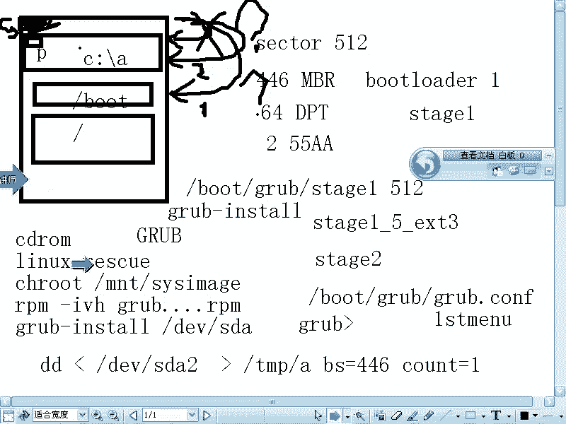

在本节课中，我们将要学习Linux系统启动过程中的关键环节，特别是引导加载程序GRUB如何加载Linux内核，以及内核如何找到并挂载根文件系统。我们将深入理解GRUB的配置文件、核心命令以及内核参数的作用，确保你能够手动引导系统并解决常见的启动问题。

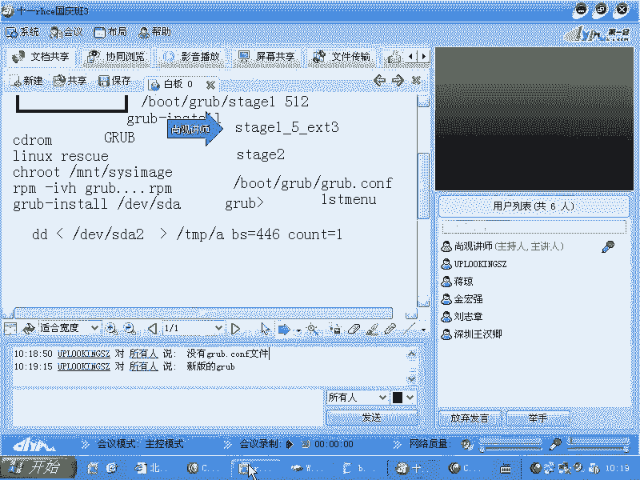

## 引导方式与GRUB的作用

上一节我们介绍了系统启动的基本流程。本节中我们来看看GRUB引导加载程序的具体操作。GRUB不仅可以引导Linux内核，还可以引导其他分区的引导加载程序，例如另一个GRUB或LILO，从而实现多系统引导。

## GRUB的内部命令与配置文件

当GRUB的配置文件丢失时，系统会进入一个基础的GRUB命令行界面。此时，了解GRUB的内部命令至关重要。

首先，我们查看GRUB相关的文件位置。

```bash
cd /boot/grub
ls -l
```

你会看到诸如 `stage1`、`stage1_5` 和 `menu.lst`（或 `grub.conf`）等文件。`menu.lst` 或 `grub.conf` 就是GRUB的配置文件。

使用 `vi /boot/grub/grub.conf` 命令查看其内容。一个典型的引导Linux内核的配置段如下：

```
title My Linux
    root (hd0,0)
    kernel /vmlinuz ro root=/dev/sda2
    initrd /initrd.img
```

以下是这三行核心命令的详细解释：

1.  **`root (hd0,0)`**：这条命令告诉GRUB，内核文件（vmlinuz）和初始化内存盘文件（initrd.img）位于哪个分区。`hd0` 表示第一块硬盘，`0` 表示第一个分区。**注意**：这里的 `(hd0,0)` 是GRUB自身的设备命名法，与Linux启动后的 `/dev/sda1` 等设备文件无关。
2.  **`kernel /vmlinuz ro root=/dev/sda2`**：这条命令加载内核。
    *   `/vmlinuz` 是内核文件在 `(hd0,0)` 分区根目录下的路径。
    *   `ro` 表示以只读方式挂载根文件系统，这是一个安全措施。
    *   `root=/dev/sda2` 是一个**关键的内核参数**，它告诉被加载的内核：真正的根文件系统位于 `/dev/sda2` 设备上。这是**承上启下**的一步，GRUB通过它告诉内核从哪里开始后续的启动过程。
3.  **`initrd /initrd.img`**：这条命令加载初始化内存盘。`initrd` 包含了启动早期所必需的核心模块（如特殊的磁盘控制器驱动），这些模块可能没有编译进标准内核中。内核在挂载真正的根文件系统之前，会先使用 `initrd` 中的驱动。

**常见启动故障**：如果系统启动时出现 `Kernel panic` 错误，通常有两个原因：一是 `root=` 参数指定的根分区设备错误；二是 `initrd` 文件中缺少必要的硬件驱动（例如，系统安装在SCSI硬盘上，但initrd里没有SCSI驱动）。

## 手动引导与GRUB命令模式

如果 `grub.conf` 文件丢失，你可以在GRUB命令行界面手动输入上述命令来引导系统。

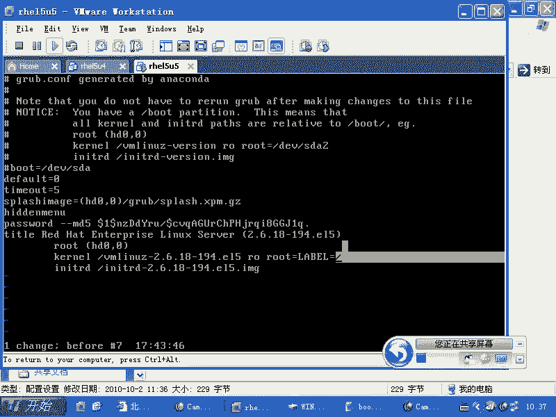

在GRUB提示符 `grub>` 下，可以按 `Tab` 键获得命令和设备的提示。

手动引导示例：
```
grub> root (hd0,    # 按Tab键，会显示可用分区，如 (hd0,0), (hd0,1)
grub> root (hd0,0)
grub> kernel /vml    # 按Tab键，会自动补全为 /vmlinuz-xxx
grub> kernel /vmlinuz-2.6.18 ro root=/dev/sda2
grub> initrd /ini    # 按Tab键，会自动补全为 /initrd-xxx.img
grub> initrd /initrd-2.6.18.img
grub> boot
```

输入 `boot` 命令后，系统就会开始引导。成功启动后，你可以再创建或修复 `/boot/grub/grub.conf` 文件。

使用 `help` 命令可以查看所有GRUB命令，例如 `help kernel` 可以查看 `kernel` 命令的详细用法。

## 引导其他引导加载程序

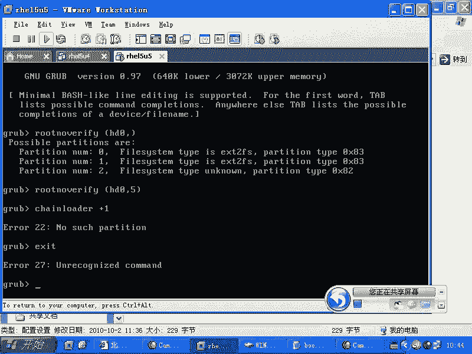

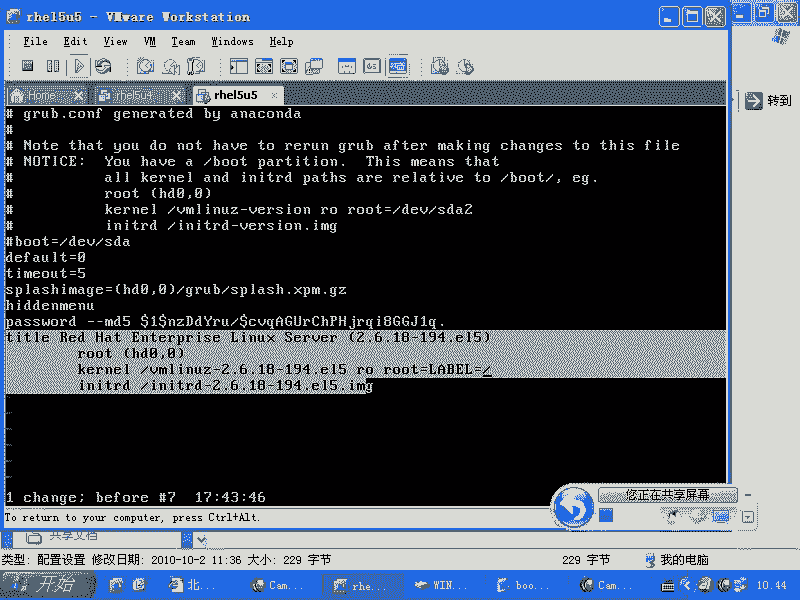

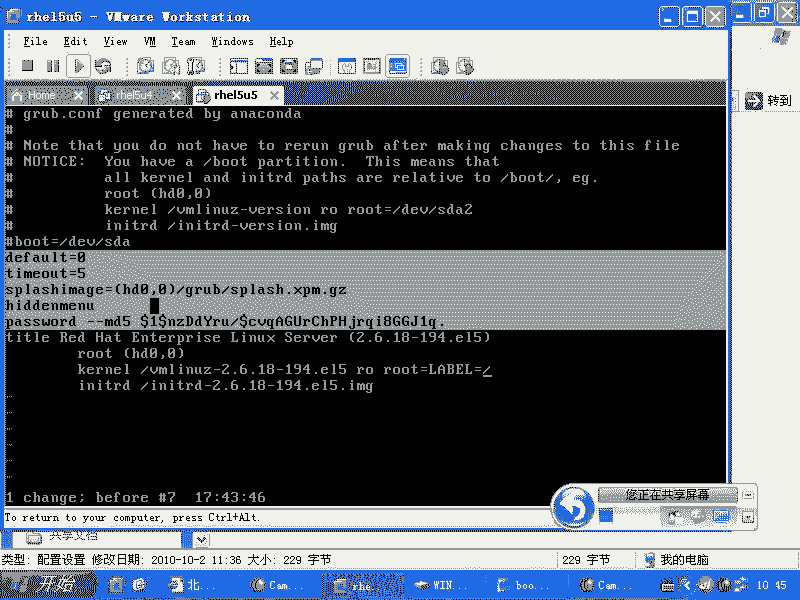

GRUB也可以引导安装在另一个分区上的引导加载程序（如另一个GRUB或LILO），这常用于链式引导。

以下是相关命令：
```
grub> rootnoverify (hd0,5)  # 指定另一个引导加载程序所在的分区，但不尝试挂载它
grub> chainloader +1         # +1 表示加载该分区的第一个扇区（即PBR）
grub> boot
```

## GRUB配置文件详解

现在，我们回头详细看看 `grub.conf` 文件的其他配置项。

一个完整的配置示例：
```
default=0
timeout=5
splashimage=(hd0,0)/grub/splash.xpm.gz
hiddenmenu
password --md5 $1$...（加密后的密码字符串）

title Red Hat Enterprise Linux
    root (hd0,0)
    kernel /vmlinuz ro root=LABEL=/ rhgb quiet
    initrd /initrd.img

title Windows XP
    rootnoverify (hd0,1)
    chainloader +1
```

以下是各配置项的说明：

*   **`default=0`**：默认启动第一个 `title` 定义的系统。
*   **`timeout=5`**：菜单显示超时时间，单位为秒。
*   **`splashimage`**：指定GRUB菜单的背景图片。
*   **`hiddenmenu`**：隐藏菜单，直接启动默认系统。按任意键可显示菜单。
*   **`password --md5 ...`**：为GRUB菜单设置密码。设置了密码后，在启动时按 `e` 编辑或按 `c` 进入命令行，都需要先按 `p` 输入密码。这能防止他人轻易进入单用户模式修改root密码。密码可以使用 `grub-md5-crypt` 命令生成。
*   **`title`**：定义一个启动项。
*   内核参数扩展：在 `kernel` 行可以添加多种内核参数来调整启动行为，例如：
    *   `single` 或 `1`：指定运行级别为1（单用户模式）。
    *   `init=/bin/bash`：让内核直接启动一个shell，跳过所有初始化脚本。
    *   `vga=791`：指定控制台分辨率。
    *   `selinux=0`：禁用SELinux。
    *   `acpi=off`：禁用ACPI（高级电源管理）。

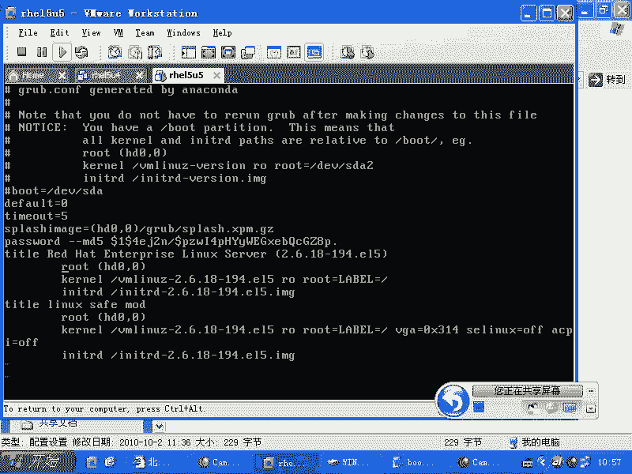

**重要提示**：内核不认识的参数（如 `1`、`3`、`5`）会被传递给第一个用户空间进程 `init`，从而改变系统的运行级别。

## 单用户模式与安全

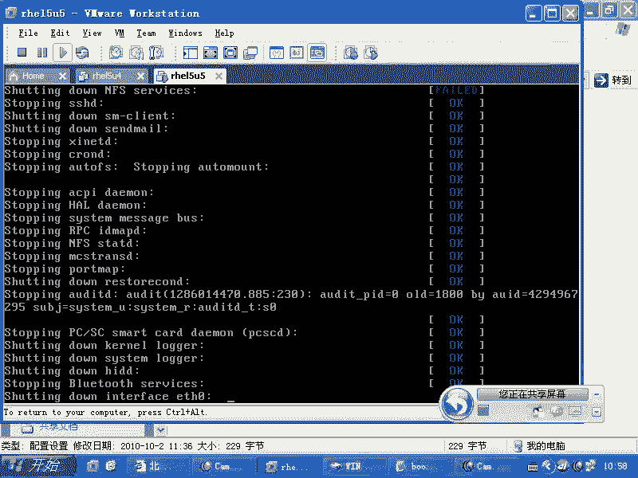

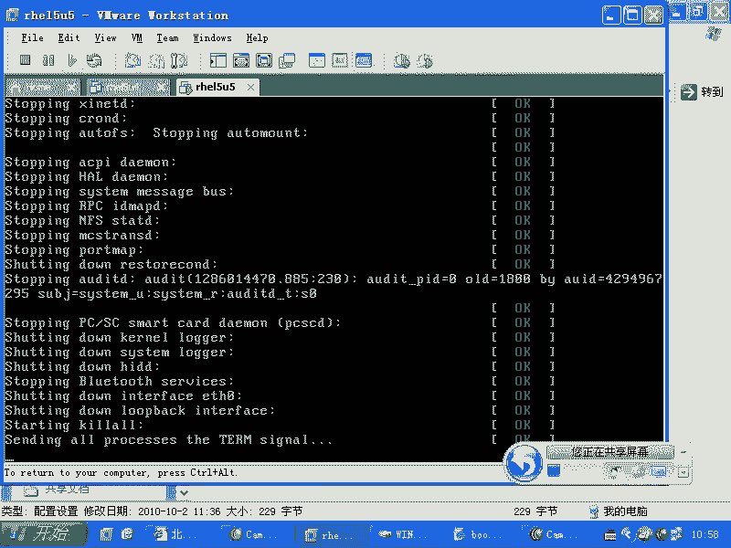

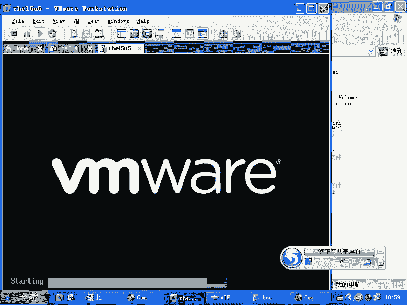

单用户模式是系统维护的重要入口。在GRUB菜单界面，选中一个启动项，按 `e` 进入编辑模式，然后在 `kernel` 行的末尾加上 `single` 或 `1`，再按 `b` 启动，即可进入单用户模式。

在单用户模式下，系统直接以root权限提供一个shell，无需输入密码，因此**非常危险**。在生产环境中，务必在 `grub.conf` 的全局或相应 `title` 内设置 `password`，以保护单用户模式的访问。

## 实验：最简系统启动

为了加深理解，我们可以尝试让内核启动后直接运行一个shell，跳过所有标准初始化过程。在GRUB编辑模式下，修改 `kernel` 行为：
```
kernel /vmlinuz ro root=/dev/sda2 init=/bin/bash
```
启动后，系统将直接进入一个bash shell，这是一个极其精简的“系统”。这演示了 `init` 进程的本质——它只是一个由内核启动的普通程序。

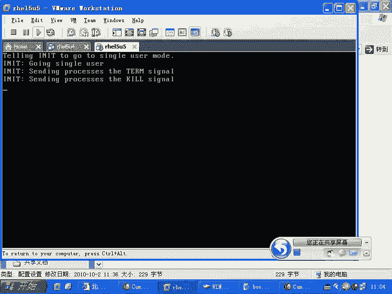

## 总结

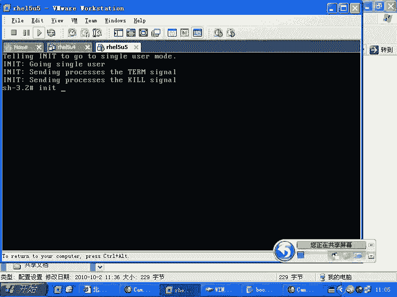

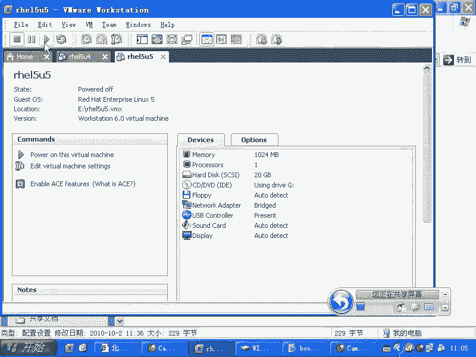

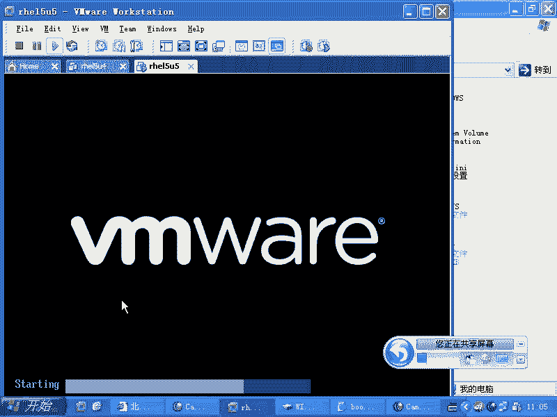

本节课中我们一起学习了Linux启动过程中GRUB引导加载程序的核心知识。我们掌握了：
1.  GRUB通过 `root`, `kernel`, `initrd` 三条核心命令加载Linux内核。
2.  `root=` 内核参数的**承上启下**作用：GRUB用它告诉内核根文件系统的位置。
3.  `initrd` 文件的作用：为内核提供启动早期必需的硬件驱动模块。
4.  如何在GRUB命令行手动引导系统，以及如何引导其他分区的引导程序。
5.  GRUB配置文件 `grub.conf` 的各项设置，特别是密码保护的重要性。
6.  单用户模式的进入方法与安全风险。
7.  通过修改内核参数可以定制启动行为，例如直接启动shell。

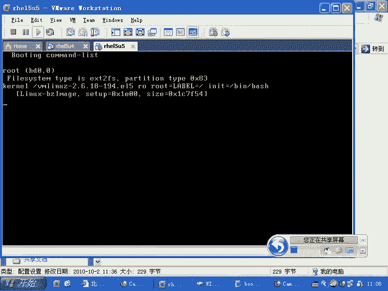

理解这些原理，将使你能够从容应对系统无法启动、root密码丢失等常见故障，并对Linux系统的启动过程有更深刻的认识。