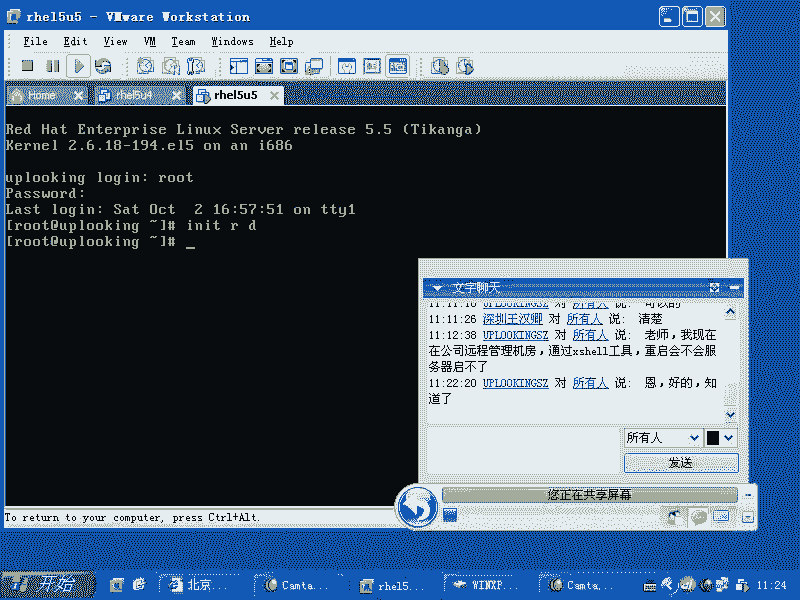

# 尚观Linux视频教程RHCE 精品课程 - P41：RH133-ULE115-4-3-initrd-usb-scsi - 爱笑的程序狗 - BV1ax411o7VD

好啊，我看声音还是正常的啊。😊，喂。刚才我们讲到blputlo，还有kidle，对不对？kidle的话呢，我们没有给大家的话呢，特别强调这个RIRT的作用。

RIRTRD的话呢就RRTRD啊RRTRD的这个镜像的话就是什么INIT是吧？init是吧？就是说初始化是吧？RDramRAM。😊，就是内存是吧，di这是它的这个缩写IITRD。

那么如果要是你想去往这个里面去添加一个驱动啊，这为什么要添加驱动？这个大家想一下，你想下为什么要添加驱动。我的硬盘在我的SAS硬盘就是串行的s硬盘是吧？在一个置列卡上，这个置列卡有驱动，是不是？

那么我当前的系统要装在我的这个串型的sga硬盘的这个。这个上面是吧，那么我要先驱动那个卡。是不是那我要先驱动那个卡，驱动那个卡。哎，我这边的话可能又没共享啊。

开始共享差点啊。差点又让大家就觉得。

好，那个如果要是我现在的话呢，想去驱动这个驱动这个卡，那么这个卡的驱动的话呢，又放在硬盘上是吧？那我要访问那个硬盘，又需要驱动这个卡，是不是要驱动这卡，这个驱动又放在硬盘上。

是不是你觉得我说的什么时候会是个头？永远没有讨论。所以的话呢机生蛋还是蛋生鸡这个问题的话呢，可能要纠缠很长时间。但是实际情况是什么呢？就是说我们的grab它是怎么样呢？它去读取到了 kernell。

是不是？那么你说这个 kernel是不是在硬盘上？那么grab的话呢，它怎么去读取这个克呢？它是用最原始的方式去读取。它读取的是整个存储当中的最前面那个部分，它能寻到是吧？所以它不需要加载这个什么呢？

加载这个驱动程序啊，所以的话呢驱动程序是针对谁的呢？针对操作系统grab是不是操作系统。所以它不需要linux的驱动啊，它需要自己带一种什么当原始的符。所以它能访问到 kernell，是不是？

那么同时的话能访问到 kernell平就是同样。存主介指下的什么？IRTRD对不对？然后呢，也就是说grab把这两样东西从硬盘当中读起来，放在什么，放在内存当中。放在内存当中以后的话呢。

他把引导权交给了Kel。也就是说啊我的任务已经完成了，是吧？你们在内存里面折腾吧。于是的话呢就告诉科el说什么，该你折腾了。然后这个时候内核一旦接管过来了这个。😊，权利以后，是不是他就开始。

访问文件了是吧？嗯他要访问，最起码他要访问他自己的根踪区，他一看跟踪区哦。根温区你是在硬盘上是吧？硬盘是在什么呢？在这个卡上是吧？我要访问这个卡需要驱动是吧？驱动又在硬盘上是不是这个时候呢。

这个内核的话就完全完蛋了。所以它这个时候只有 kernel panicic，因为它没有任何的方式去访问到什么？它的这个根温区，这就 kernel panicic。

那么这个时候你看到读在这词当中还有个IITRD是吧？那假如说我们事先在IITRD里面放了它的s卡的驱动。😊，和s的驱动。那这个时候是不是这个问题就迎刃而解？

因为的话呢这时候内核是不是它可以在内存当中找到IITRD啊？😊，是吧这就是它的基理，明白吧？所以的话呢，我们如果要是想让一个U盘能正常启动，那么你想U盘是USB接口的，对不对？那么U盘。

它作为一个根分区，就是U盘上有根分区，是不是？嗯，那么还是那个问题，内核启动起来以后，是不是它要什么？它要U盘上他要访问U盘上的根分区是吧？要先驱动U盘，U盘是个USB设备是吧？嗯USB设备的驱动。

假如说就在U盘上，那是不是又是个集中弹单生机的问题。嗯，所以的话我们要把USB的这个U盘的驱动放在哪？讲解怎么放啊，你看。lakeMK啊RRTRD。MakeIITRD然后呢加上一个杠杠位。啊。看看位置。

比方说USB。modode啊啊就是原来啊你们要知道USB它它有一系列的驱动，我们可以看一下所有的驱动啊。加载所有的内核驱动LS mode啊，你可以看到这个内核驱动。那么LS mode的话呢。

你比方说把GREP。

USB弄出来。那现在没有插任何U盘USB的这个设备，那么它就没有这个USB的驱动啊。那么我们看到的话呢，就是原来啊我我这边因为我原来研究过啊，那么它总共的话呢是USB驱动是分成三层的。

中间那层的话叫做USB call就是核心CORE是吧？USB call。上面那层的话呢，你比方说你是。U盘是吧U盘是不是把它模拟成了一个那个就是的存储，是不是啊？那它叫做什么呢？

叫做USB呃USB storage这样的一个驱动。USB storage下层的话呢，是不是有USB芯片啊，那叫做EHCUSB杠EHCIUSB杠OHC啊，还有USB杠USHCI3种EHCI是USB2。

0的驱动啊，那么这个大家可以看一下这个地方，所有的内核驱动在LIB下的model录像是吧？2。6就是你现在当前的内核版本，然后呢再加上一个什么呢？再加上一个啊。driver driver当中的USB。

啊，这是内核。如果你装了两个内核的话呢，这边就会有两个目录。你当前的内核版本是什么？你可以用U name命令来来看一看啊，你现在的话内核版本是2。6。18什么什么东西，那就找到相应的目录下什么呢？

相应的目录当中去。在这里面的话，你可以看到所有的USB的什么驱动。😊，现在颜色的话呢就比较比较难看，目录的颜色比较难看。然后呢再加上一个什么呢？再加上一个呃。比如说host啊主机。

那这边的话呢有OOHCIUHCI这是老式的两种芯片的驱动。还有什么呢？EHCI也就是说。想一下我们的USB的口是不是都连接在我们的USB的那个主板上的芯片里面，是不是？嗯那这个芯片的类型有多少种呢？

主要的话呢是有三种OHCIUHCI或者什么EHCI这三种EHCI就是USB2。0的驱动，知道吧？那么我们现在这三种驱动，是不是我如果要插上一个U盘的话，是插到这个里面，是不是需要这个驱动啊？嗯，那么。

USB的体系结构是三层的。第一层的话呢就是底层的芯片驱动。那么中间这层的话呢是负责衔接上面这层和下面这层。也就是我上层可能这个USB插了个鼠标是吧？鼠标的驱动是不是必须得要有啊？

那么鼠标是不是通过US去传输啊，USB协议去传输是吧？所以它呢US。也就是中间的话呢叫做USB call。但是这个东西的话，现在已经没有独立的驱动了，被编译到内核当中了。内核当中。明白吧？嗯那么我下。

三层明白吧？USB鼠标通讯的话是跟USB芯面积通讯，对不是？这两个驱动必须得要有。侧翼。所以我们现在看到了这个这个这些这些驱动的名字是不是？那比方说我现在UHCI的话呢，我知道我这个呃芯片的话是这个。

那么于是我加上一个什么杠杠位是吧？😊，USB。呃，UHCI杠HCD是不是？然后再加上一个什么呢？杠杠with。😊，那么我们叫做什么呢？USB杠storage。storage对不对？

然后再加上杠杠with。😡，呃，SD下划线moode，这是C的。硬盘S是吧，Ddi的硬盘的驱动是不是？然后还有加上什么呢？杠杠位啊，sga也有三层。那么你还有个什么SCSI是吧？s mode。

然后把这几款驱动的话呢，全都放上去以后，加上一个什么呢？在波om目录下创建一个A点image的文件啊，2。6。18杠多少呢？😊，194啊。好，现在回车。这个命令的话呢是说什么呢？这个地方写错了，2。6。

18-194，也就是它在L拉B项的model目录下没有找到这个文件，没有找到这个文件夹，也就没有这个版本的内核。为什么呢？因为我们少加了一个什么点EL啊。

它这个版本的话就是点EL表示re的企业版enterprilinux给你怎么样编译出来的。啊，他给你定义出来的，那么它定制过以后的特殊版本的内核跟2。6点什么18的这个内核是不一样的，明白吗？回去啦。😊。

Yeah。然后。ok现在的话呢看它就会把那5款驱动打到什么呢？A点以age这个。镜像里面来明白吧？他会把那5款驱动话呢打到A点也没指这个镜像里面来。😊，啊。他他找驱动的话呢，没找到啊。

就是说有个驱动没有找到，我把这个S的话去掉。看到这个。命令的这个就是说这个接带结构了吧。前面是说你要加载哪些驱动，是不是哪些驱动是吧？然后接着的话呢是写入哪一个什么呢？你位置镜像，然后呢，版本号是什么？

😊，对不对？你可以用刚刚help来看一下这个时候的话你再去看波特目录下是不是有1个ADS image的文件。是吧有个A点 image的文件，是不是？然后这个时候你要想用这个文件的话，那你就什么VI。😊。

bo目录下的grab当中的grab点com是不是在那个里面加载IITRT的镜像的时候，加载的是你自己这个A点以内。是吧不是加载原本那个IITRD镜像，对不对？你可以试一下啊。

然后呢把这个东西靠在你U盘上，那你就可以做U盘系统了。啊，这是非常关键的一个。那假如说你在公司里面，然后你的服务器有个有个那个sga卡。这个sga卡的话，你想怎么样呢？呃，让他就是。

硬盘挂在s卡上能启动起来，结果的话呢它总是什么原因呢？就是可能这个里面没有那个s卡的驱动，对吧？如果要是s卡驱动的话，你就把这些地方替换成s那个驱动。你道这边是SD mode，是不是还有什么呢？

 mode是吧？还会有什么呢？你的那个s卡的那个驱动的程序的名字，对吧？那么你怎么找这个驱动程序呢？怎么找这个驱动程序呢？你这边既然有什么USB，就应该有什么。是不是死家？啊，你那个s卡叫什么名字？

是哪个厂家的？你在这边能找到那个名字，对不对？是不是啊？就是我说刚才我是USB嘛是吧？那么假如说你是一个服务器，服务器导你的这个硬盘没有办法启动是吧？那你就可以把sga卡的驱动加上去啊。好。有没有问题？

不明白是吧？是不明白。是不明白是吧？啊，明白吗？不明白。哪个地方不明白，就是说这个RTRD的机制是不是不明白？他那个。怎么得到名字是吧？这是你要查的呀。你比方说我们听说过一个sga卡的著名厂商叫什么呢？

什么adap tag是吧？ADPADP吧A开头的ATP啊，你要这是它的这个驱动。对不对？那么现在的话呢，我再去加载那个加载这个的东西的时候，我就把这个驱动加上去。

那么假如说我现在的话呢去做的不是一个什么，不是一个U盘上的这个预需要用到的这个ISSRD那我就用这个命令是吧？这个命令的话呢，我这个叫B点image，B点 image。

那么我的驱动要有SD的驱动要有我还要有什么驱动啊，还有那个。这个scar卡的驱动是不是scar卡的驱动，还有scar的核心驱动是吧？还有scar的硬盘的驱动，是不是三层的？是不是三层？那么这样的话呢。

这三种驱动全部都加起来。那么创建这个名叫必点位置的文件，明白了吧？这就是你在服务器上可能经常用到。是不是？你要说你买这个戴尔的服务器，或者买这个惠普的服务器，它这个服务器比较新。

而你现在要装的这个版本比较旧，那么它给你附带的光盘上就应该有KO的文件。然后你把这个KO的文件的话呢，放在哪个位置，放在那个目录里面去啊，然后呢去把它。重新就是刷新一下，然后用运行这个命令就OK了啊。

好。这是重建makeNITRD还INID原先的哪些都。加上还还在是吧？对，默认需要的东西它会自动侦测，然后并且给你默认加进去。比方说ES3文件系统的驱动。啊，日志的驱动，软锐的的驱动啊都在里面。

实际上ITRD的话呢是一个什么呢？是一个压缩包啊，是一个压缩包，把它解开了以后，你会发觉那里面的话呢就是呃有很多的文件，把它一解开以后就发觉它是一个小的什么小的内。😊，小的这个呃linux系统。

小的跟温区啊，就是IITRD里面是个小的跟温区。有问题。啊。如果我觉。啊，这个K。呃IBM的s卡的驱动是吧？对对KO的话就是内内核模块。内核模块，如果他没有这。他就给了一块就是驱动原板，要编辑。

那他要给你他要告诉你怎么编译啊，驱动源码就是我们安装的时候的话呢，如果你拿到的是源代码的话，那你就什么你要解开了以后，你看它的read me，你知道吧？你问我的话是没有用的。

因为我不知道那个代码它到底是怎么要求编译是吧？那一般的话都是点杠confimake make install这样三步是吧？如果没有。呃，如果没有这个点杠卡fi这个命令的话，那你就怎么样呢？

你就直接make。或者make up或者make直接。直接回车，然后你看到最后生成的结果就应该是个点QO的文件。这个点QO的文件的话呢，你要copy啊，就是假如说人家给你一串代码，然后呢。

你把它编译出来了，你比方说。😊，你看那个目录下有没有readme文件，如果有的话，你看怎么编译。一般情况下是这样的，点个fi是吧？make，然后呢再有什么make installstore。

如果它这个安装过程不是自动的那怎么办呢？那你要看它的结果，结果，如果要是有1个Q的文件，你就怎么样copy一下。😊，copy，然后呢，什么什么什么什么点KO的这个文件copy到哪呢？

你当前内核版本当中去啊，model是吧？然后在2。6点这个 kernell当中，然后呢，driver当中是吧？😊，这当中，比方说copy到se目录下去。是吧。然后呢，拷py过去了以后，运行一个什么呢？

第一P mode。第一批 mode第一批 mode的话呢是把这个目录下所有的内核驱动全部都扫描一遍，并且给你怎么样的注册起况。注册是吧。就是放在一个注册文件里面，这样的话呢，你再去运行什么。

你再去运行这个的时候啊，就可以了。你再去运行这种东西的时候就可以了，明白吧？你就可以把那个呃XXX给它放到后面了。明白吧？就这么结果。听楚了吗？好，那么当然了，如果你的硬盘启动不起来，你说我该怎么做呢？

你用光盘启动啊，光盘启动的话呢，光盘里面做，或者在一台台式机上做，把它弄成1个QO文件是吧？就点QO的文件。你把这个文件copy到什么，就是用光盘启动起来以后，你把它copy到某个地方。

或者直接做成了IRTRD，然后把它把原来的IRTRD给它替换掉，对不对？就OK了。

好，这边的话呢就是我们的这个呃内容啊，就是我们这个内容。比方说你在安装的时候，在输入lininuxDD，然后有这个QO的文件，那就OK。这就是我们的makeIITRD。😊。

