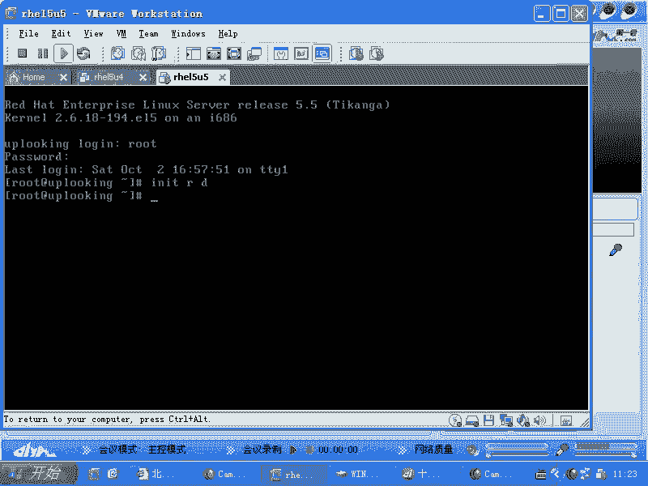
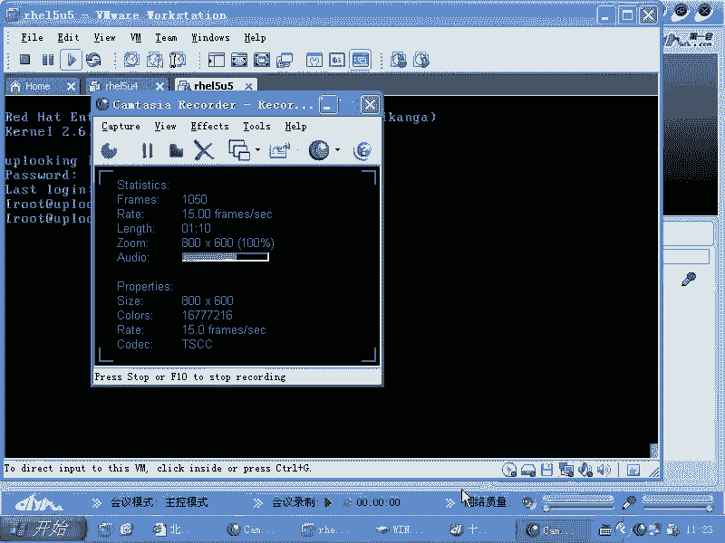
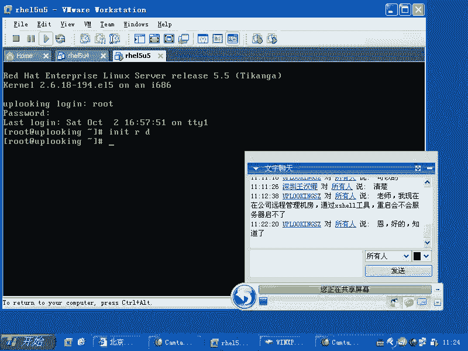
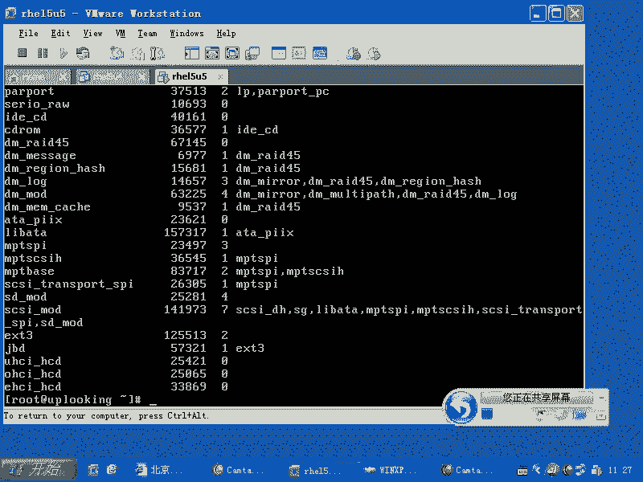
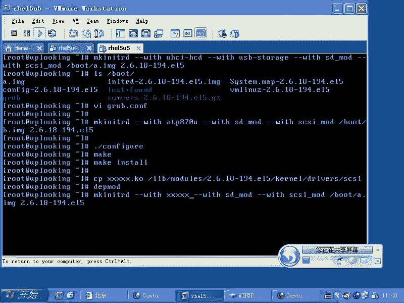

# Linux系统管理：P41：initrd与USB/SCSI驱动加载


## 概述
在本节课中，我们将要学习Linux系统启动过程中的一个关键组件——`initrd`（初始RAM磁盘）的作用，并掌握如何通过`mkinitrd`命令为其添加额外的硬件驱动（如USB或SCSI驱动），以解决系统启动时因缺少驱动而无法访问根文件系统的问题。





---



## initrd的作用与“先有鸡还是先有蛋”问题

上一节我们介绍了`blkid`和`fstab`，本节中我们来看看`initrd`。

`initrd`是“initial RAM disk”的缩写，即初始内存磁盘。它是一个在系统启动早期被加载到内存中的小型临时根文件系统镜像。

为什么要添加驱动到`initrd`？设想一个场景：你的系统硬盘连接在一块SCSI或SAS阵列卡上。这块阵列卡需要特定的驱动程序才能被操作系统识别。然而，这个驱动程序通常存放在硬盘上的文件系统中。这就产生了一个矛盾：内核启动后需要访问根文件系统（在硬盘上），但访问硬盘需要驱动阵列卡，而驱动又在硬盘上。这就像一个“先有鸡还是先有蛋”的死循环。

那么系统是如何解决这个问题的呢？GRUB引导程序使用其内置的、最原始的方式读取硬盘最前面的扇区，它不需要Linux的驱动程序。因此，GRUB可以顺利地将`kernel`（内核）和`initrd`镜像从硬盘加载到内存中，然后将控制权交给内核。

内核接管后，需要挂载根文件系统。如果根文件系统位于一块需要特定驱动（如SCSI卡驱动）才能访问的硬盘上，而该驱动又不在内存中，内核将因无法访问根文件系统而崩溃，即出现 **`kernel panic`**。



此时，如果我们在`initrd`镜像中预先放置了必要的驱动（如SCSI卡驱动），问题就迎刃而解了。因为内核可以在内存中的`initrd`里找到并加载这些驱动，从而成功识别硬件并挂载真正的根文件系统。

---

## 实战：为U盘启动系统添加USB驱动

理解了`initrd`的机制后，我们来看一个实际应用：制作一个能从U盘启动的Linux系统。U盘是USB设备，内核启动后需要驱动USB控制器和USB存储设备才能访问U盘上的根分区。同样，我们不能让驱动存放在U盘上。

以下是解决步骤，我们需要将USB驱动打包进`initrd`。

首先，我们需要知道USB驱动的构成。USB驱动体系通常分为三层：
1.  底层主机控制器驱动（如 `ehci-hcd`, `uhci-hcd`, `ohci-hcd`），负责驱动主板上的USB芯片。
2.  中间核心层（`usbcore`），负责协议处理，通常已被编译进内核。
3.  上层设备类驱动（如 `usb-storage`），负责驱动具体的USB设备（如U盘）。

此外，U盘通常被模拟为SCSI磁盘，因此还需要SCSI磁盘驱动（`sd_mod`）。

我们可以使用`lsmod`命令查看已加载的模块，或到`/lib/modules/$(uname -r)/kernel/drivers/`目录下查看所有可用的驱动模块。

现在，我们使用`mkinitrd`命令创建一个包含必要驱动的新`initrd`镜像。

```bash
mkinitrd --with=uhci-hcd --with=usb-storage --with=sd_mod /boot/newinitrd.img $(uname -r)
```

**命令解析**：
*   `--with=<模块名>`：指定要添加到`initrd`中的驱动模块。
*   `/boot/newinitrd.img`：指定生成的新镜像文件的路径和名称。
*   `$(uname -r)`：指定当前运行的内核版本，以确保找到正确的模块目录。

执行成功后，`/boot`目录下会生成一个名为`newinitrd.img`的文件。接着，我们需要修改GRUB的配置文件（通常是`/boot/grub/grub.conf`），将启动条目中`initrd`指向我们新建的镜像文件。

```bash
# 在 grub.conf 中找到对应的启动条目，修改 initrd 行
initrd /boot/newinitrd.img
```

这样，系统重启时就会使用包含USB驱动的新`initrd`，从而能够从U盘成功启动。

---

## 扩展：为服务器添加SCSI卡驱动

上述原理同样适用于服务器环境。如果你为服务器安装了一块新型号的SCSI或SAS阵列卡，而安装的Linux系统版本较旧，内核自带的`initrd`可能不包含该硬件的驱动，导致系统无法从新硬盘启动。

解决方法类似：
1.  获取该SCSI卡的驱动程序（通常是一个`.ko`内核模块文件）。
2.  如果提供的是源代码，则需要编译。
    ```bash
    # 典型的编译安装步骤
    ./configure
    make
    make install
    # 或者直接 make，然后将生成的 .ko 文件复制到模块目录
    cp xxx.ko /lib/modules/$(uname -r)/kernel/drivers/scsi/
    depmod -a # 更新模块依赖关系
    ```
3.  使用`mkinitrd`命令，将SCSI卡所需的驱动模块（可能包括核心层`scsi_mod`、中间层和具体卡驱动）添加到新的`initrd`镜像中。
    ```bash
    mkinitrd --with=scsi_mod --with=sd_mod --with=你的SCSI卡驱动模块名 /boot/backup-initrd.img $(uname -r)
    ```
4.  同样，修改GRUB配置，使用新的`initrd`镜像启动。

如果系统已经无法启动，可以使用安装光盘进入救援模式，在救援模式下执行上述步骤，替换原系统的`initrd`文件。

---

## 总结
本节课中我们一起学习了：
1.  **`initrd`的核心作用**：作为内核与根文件系统之间的桥梁，在内存中提供一个临时环境，用于加载访问真实根文件系统所必需的硬件驱动，解决启动时的依赖循环问题。
2.  **`mkinitrd`命令的使用**：掌握了如何使用`mkinitrd --with=`命令为`initrd`镜像添加额外的驱动模块。
3.  **典型应用场景**：
    *   **制作U盘启动系统**：需要添加USB主机控制器驱动（如`uhci-hcd`）和USB存储驱动（`usb-storage`, `sd_mod`）。
    *   **为服务器添加新硬盘控制器驱动**：需要添加对应的SCSI/SAS卡驱动模块。
4.  **问题排查思路**：当系统因缺少驱动无法启动时，可通过光盘进入救援模式，编译或获取驱动模块，并重建`initrd`来修复。



通过理解`initrd`的机制和掌握`mkinitrd`工具，你能够处理更多因硬件驱动导致的系统启动问题，增强对Linux系统启动流程的掌控力。