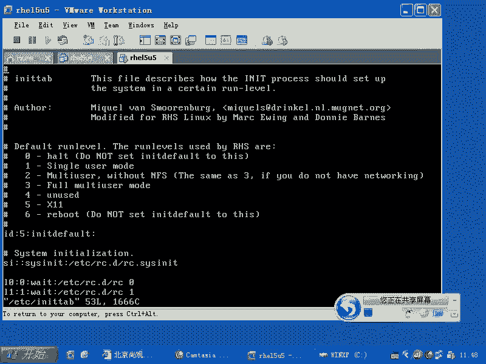
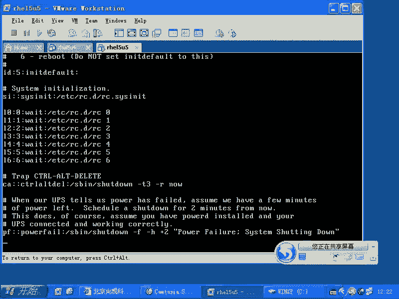
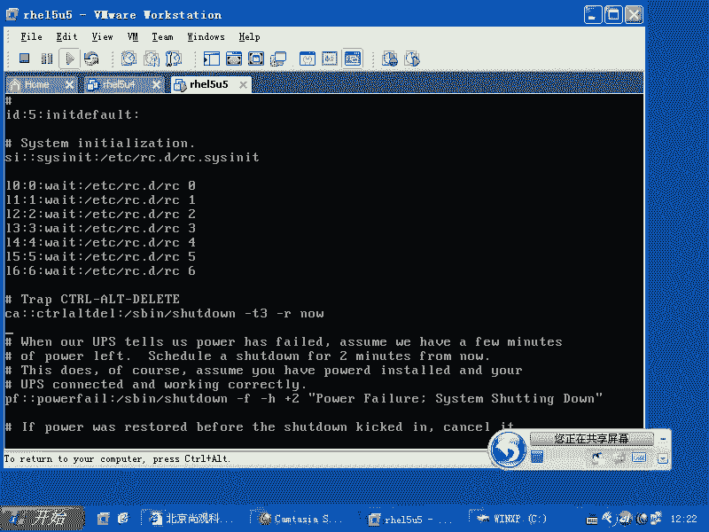

# 尚观Linux视频教程RHCE 精品课程 - P42：RH133-ULE115-4-4-init-chkconfig-rc - 爱笑的程序狗 - BV1ax411o7VD

现在的话呢我们要给大家再来讲，继续往下讲。也就是说。呃启动 load然后启动是吧？的话通过IITRD里面的驱动加载了根温区是吧？根温区下面的话就是什么？现在的话就好了，怎么好呢？

就是我们可以看到实际的东西了，对不对？LSS并下的什么IIT啊，这就是IIT那这个IIT的话呢，它是一个程序，这个程序是进行初始化啊，你比方说你现在系统启动完以后，你想让它做什么。

就是你windows启动完以后，你比方说你想看到一个桌面对不对？然后呢，想看到一个什么呢？几个图标是吧？然后呢，想自动运行起来，一开始系统启动的时候需要运行那些东西，比方输入法要加载，对不对？

还有什么呢？各种服务要载，那么让你一个一个你自己去折腾的话，那就费了鼻子劲。😊，这时候怎么办呢？那有一个管家，这个管家是谁呀？就是IIRT他实际上就是内核的走狗。对吧内核的话呢。

他不愿意管这些细节事儿的时候，他找内存，他找呃用户空间当中一个进程帮他打理所有的东西。这就IITIIT的话，它的主配置文件在哪呢？在ETC下的IITTAB。这是他的主配置文件啊。

OK我给我回过头来啊回过头来给大家看。😊，好，我们看一眼。首先的话呢是ETC项目的IRTTAB这是它的总配配置文件。那么这个配置文件的话呢，它会去调用啊，就这个文件里面的话呢，它是有固定的格式的。

我们可以根据它的格式的话呢，来看到它的脉络。它最开始访问的是什么呢？ETC下的RC点D当中的RC点s。😊，即线你。然后呢，还会去访问什么呢？就是这个的话是系统初始化。接着是访问RC点D当中的RC啊空格。

😊，X就是你进入运行级别为多少，它就会运行什么什么啊。如果要是你运行的级别是3，那就RC3。那么RC3运行的结果是什么呢？就是ETC下的RC点D当中的RC3点D啊，RC什么什么点D目录下的所有的文件。

就说这里面的什么文件呢，就是S开头的所有的文件后面的话加上一个什么呢？star就把这些脚本的话呢，去star起来。其实的话呢，这些文件本质上讲都是什么呢？

都都是软链接是RC点D当中的IIT点点D目录下的呃，什么什么什么东西啊，那么如果要是你现在的话呢，进入这个运行级别的时候，这些服务的话都会被启动起来。然后呢。

如果要是你现在这样的ETC下的RC点D当中的呃。😊，服务都启动起来以后，然后呢它会自动启动一个什么呢？自动启动一个。嗯。RRC点local啊local。对，会启动这个。也就是说这个文件的话呢。

实际上是在就是他们这个只要是正常的运行级别。比方说2345啊，这几个运行级别，他们最后一个脚本都会去访问这个啊，你看。这个地方就涉及到一个就是我系统的话，我想让系统每次启动的时候都会启动一个程序。

我是把它放在ETC下的profile当中呢，还是放在RC点local当中，你们想一下。大家记不记得我们在定义悲笑dsh的时候，是不是有4个初始化的脚本呢？是不是那个四个初入化脚本我们放进去以后。

是不是每次系统我们登录完以后的话，都会去运行那些脚本里面的程序啊。那么我放在那些地方好，还是放在这个RC点locgo里面好？有个你。放在四个脚本里面好吗？

这个时候的话大家可能就没有搞清楚那个脚本是非笑启动的时候会掉的四个脚本嗯。这个是系统，只要一启动，它就会肯定执行。那如果要是我不登录那个账号，我不以如此身份去登录那四个脚本运行不运行。

所以的话呢我们如果想要系统启动的时候，自动运行一个什么角，自动运行一个什么程序，我们就把这个程序放在什么RC点local里面。明白吧？而不会把它放在这个头fi脚本里面。以前的话我们都会把它混掉。

是不是现在我们把它明确说清楚，清楚了吗？然后呢，再接着的话呢，它还会再去运行。然后呢，这时候的话呢，它会去运行什么呢？呃。😊，他会去运行。mini getTTY啊。

然后呢TTDV下的TTY1一直到什么呢？TTY6打开6个控制台啊，打开6个控制台以后的话呢，如果你输入了正确的用户名和密码，就是说它会打开一个login进程。如果你输入了正确的用户名和密码以后。

它会打开什么呢？😊，A是吧，H是不是又有配置文件啊？😊，是不是那四个配置件ETC下的profile是不是？然后呢，主目录下的点但是。😊，fill profile是不是等等这些东西。

然后呢这个地方的话就是ba shell它本身的配置文件了啊，如果要是你启动的是运行级别V5的时候，运行级别为5的时候，它的话就会运行谁呢？运行GDM啊，运行级别为5的时候会运行GDM就是那个图形界面。

这就是整个这个体系结构，是不是？那么很多人都说你既然写就写完写完了。😊，我不信是吧，来看看啊来看看。😊，这有问题没有？😡，好，我们来看一眼啊。😊，这个记完了没有？😡，好，okK那么咱们看。😊。

一切的根源都是IIT table，是不是它是一个。总的蓝图是吧？是一个。由资本主义到社会主义到共产主义的一个总的蓝图是吧？那么具体的执行的话呢，每一个脚本的话呢，它是一个呃脚本。

那么我们看这个总的蓝图它是怎么去规定的，它的语法是什么啊？我们来看一眼。

好。那么假如说现在我们去看这个东西的话，看我们的这个IIT table的话，我们打开它啊。

来看它首先的话呢告告诉你，默认情况下，它有0到67的运行级别。其实的话IIT的话呢，它有更多的运行级。啊，789你完全可以自己定义，只不过它在这里面没有啊。也就是说这个地方运行级别的话呢。

就是所谓的这个运行级别实际上就是什么？就是我们的IIT后面跟的第一个参数是不是到了一呀，是不是？就RIT后面跟着运行参数。这个参数如果是一的话，那它就一如果要是5的话，就是5。如果要是什么都不填的话。

是什么？😊。

什么都不签的话，应该是9啊什么都不签的话，应该是9。那么它这边的话呢，告诉你说你应该用这个。其实你IIT9的话呢，应该也是可以啊，这是IITIIT的话呢，你想去重载的话呢。

还可以看IIT后面的这个参数啊，那么我们如果要是进入某个运行级别，它会执行这样的步骤啊，如果要是我们一旦去运行。你看假如说我们运行IIT3一回车它会怎么做呢？它会去查看什么？查看咱们的这个配置文件。

它开始看三，是不是啊？😊。

前面是不是都是注释啊，嗯没有用是吧？我们不管。那么他这个时候的话，首先看一下啊。😡，当他进入运行级别V三的时候，那么这个地方是不是有3啊？😡，那么他就会执行这一行。看到了吗？第一行有效的话是什么呢？

第一行有效的是说我如果要是IIT后面什么都没有填的时候，那它会去运行什么呢？它会进入运行级别为5是吧？就相当于我们运行的什么INIT5，那么它就会执行什么呢？下面这种有5的地方。

比就是说你看这样一行里面是不是分成几段啊，第一段是不是第二段是吧，用冒号隔开的是吧？然后第三段是不是第四段是不是总共有四段，它会看第二段里面有5的地方它就开始执行。而这一行就第二行的话。

不管你进入什么运行级别啊，那么它都会去执行。因为它是一个什么呢？啊，的系统初始化的东西啊，也就是说你进入运行级别只要是12345啊，这这几个运行级别都会去执行。我们看一眼啊，我们看一眼。

那么这个地方如果我们进入的默认运行级别为5的话，这个地方有没有5呢？😊。

有没有5有5是不是这行会不会被执行？😡，会被执行是吧？如果我们进入一级VV5，这个地方有没有5？😡，有，然后呢，这个地方也会被执行，是不是？所以的话这个间诈语法的话是不是清楚了？语法清楚了没有？😊。

预览清楚了以后，我们看啊我们看一眼。😊，进入默认运行级VV5，我们第一行已经解解释完了是吧？那我把这个地方改成6会怎么样？一直重启一直重启，不断重启。我只要运行级别我只要一进入NIT，我后面不加符号。

它就立刻进行运行级VV6是吧？运行级VV6，就重启，重启完以后的话呢，又看到这个文件又是6是吧？又去重启，对不对？😡，这个的话过程是自始至终都会有的。所以的话呢这个地方恶作剧的话呢，你会看到6。

以前的话那个HC考试还会怎么样？故意把它改成6或者改成0，改成0以后的话一启动就关机，一启动就关机啊，这是恶作剧是吧？但是我们知道它的作用啊，就在这个地方记住默认的运行级别。如果要是你是第一次启动系统。

它会去运行。😡，RC点s这个脚本基本上是系统初始化的脚本啊，就是sha脚本。你们可以想去把非 shell啊 shell编程的话学的更深入一点。要有个例子是吧？例子在哪。

在这里面基本上所有的用法它都在这里面有啊，你可以搜索这里面的语法，原来是怎么去操作什么循环的，怎么去判断一个文件存在不存在，如果存在的话，那么该执行什么什么什么东西，对吧？这些语法的话呢特别多。

这里面帮我们做的是什么呢？这里面帮我们做的是加载s的驱动，加载USB的驱动，加载你的呃字体。加载你的文件系统。也就是他帮你做了很多很多东西。也就是现在的话呢我们看这看一眼这个地方啊，那么。

你的RC。assessing it。这个文件里面的话呢，它做了一些什么操作呢？最重要的跟我们非常相关的一个操作就是什么呢？😊，它运行的一个命令叫做mount杠A。mountt杠A。

然后又用行个命令mount杠O。😡，RW。好，明白了吧？嗯，也就是在这个文件里面，帮我们加载了真正加载了所有的文件系统。你们回想一下，刚才grab grab里面是不是我们说 kernell什么什么东西。

后面加了个root等于label等根或者root等于D于下的SDA是吧？嗯我加了这样个选项以后，是不是只加了根分区啊？那你现在有三个分区，这三个分区怎么自自动加载？对对，谁帮你加载？2的74年。

那么你如果要是加载跟分区的时候，kil加载跟分区的时候，最开始加载它肯定是只读方式加的。但是你现在为什么可以在这个分区下去创建文件，可以去写入呢？是因为在这个里面，他帮你读写方式去加载了，嗯。

就是重新加载。明白吧？所以这就是为什么很多时候啊出错了以后，你会发觉你不能去改写这个文件系统。是不是为什么你不能改写文件系统呢？因为它系统启动到这一步的时候，还没有执行什么md杠ORW这步还没有执行过。

没有执行过的话，导致他什么呢？这个系统就停在只读加载跟才区。听楚了吧？嗯，比就说我们现在一直在顺这个系统启动过程。你现在看到的结果就是说系统的根本就是可写的是吧？

但是 kernel呢它是只读方式加载的是吧？那么哪儿给我变成读写的方式加载RC点啊，假如说在这个地方在执行这行之前啊出现问题了，执行这行之前出现问题的话呢，它就要进行什么FSCK系统检测啊。

就是这个文件系统检测点EF3。那么这个时候如果要是你检测。😊，的时候。读写方式加载，它是会破坏整个文件系统。所以的话呢它为了就是检测的时候正常，所以他在前面加载全部都是什么？只读加载。只读加载完了以后。

如果检测正常，也就是说你的分区是正常的，它就会读写方式把你加载。明白吧？所以当你如果要这个地方出现问题的时候，那么你看到的就是什么呢？读写方啊，指指读方式加载，你要手动运行这个命令，手动运行完以后。

你才可以修复错误，明白吧？如果要是你现在的话呢文件系统加载不上，你要先去检测，检测完以后再去读写方式把它加载起来，明白吧？检测文件系统必须得要什么只读方式加载，或者是说U加载，就是压根不加载。

这是最安全的。明白了吧？😊，而mount子杠A的话呢，它会用到我们的一个。😊，呃，用到我们的一个命令啊，就是mount杠A的话，它用到了另外一个参数啊，另外另外一个配置文件，这个配置文件叫什么呢？

ET私下的FSTAB。😊，这个文件实际上是在RC点s里面的话呢，被你就是使用的。比如这个文件如果有问题，那么你RC点se它就会出现爆错，明白吧？这个时候你所有的服务都没有办法都没有运行。

就在这个地方就停住了。他就告诉你说什么，某个分区没有加载，请检测，手动检测。这时候你在这个地方你出现问题的时候，就会看到一个典型的出错画面就是什么呢？一个大括号是吧？fix是吧？fill system。

😊，他是说什么呢？一啊他说请输入密码，输入完密码以后，请检测文件系统就停下了之后就不不自动启动了，明白吧？这个过程的话呢，就是呃就是说你可能会经常遇到啊，你可能不知道是怎么回事儿。明白了没有？😡。

所以这是文件系统这个地方，然后呢，它会帮你加在什么呢？swipe分分区啊，swipe分区，然后呢帮你进行一些必要的初化。😊，USB的驱动程序，也就是说你现在看到这些东西啊，你现在看到这些LS mode。

这么多的驱动是你加载的吗？😡。

你加载过这么多驱动吗？😡。

没有，谁帮你加载的RC点six。主要是他帮下来的，明白了吧？

好，我们的话呢RC点s基本上就给大家介绍到这边，你可以自己去改啊。就是刚才如果要是我们系统启动的时候啊，你看到前面的话是不是内核初始化。出现第一行大写的IIT字样的时候，那个时候就是LRC点s在运行。

RRC点CC它运行的一个最典型的标志，就是什么呢？welcome to红色的reite linux，那个地方就是它在运行。你要想把它改成什么自己的linux是吧？你说我想去创造一个呃。绿豹子系统是吧。

green hat是吧，然后呢，还有什么，你想称蓝鳍系统，是不是呃，blue什么flag。linux系统你就改这个文件。这个文件的话呢就是明文放在那个地方。你只要把那什么VI改一下。

然后你就立刻创造出一个。崭新的一个操作系统是吧？然后再加上blb那个界面后面的背景是吧？那个是SPM的格式的背景一替换啊，那我恭喜是吧？你已经创造出了一个崭新的系统。

那么你比原来某个公司做的还要还要更高级，还要更强。所以这边的话呢就扯得远了，改个改这个文件以后的话呢，你把那个welcome to right linux，你把它改成其他的。

那么那个地方它呢就相应的就会有变化啊。😊，嗯大家还是迷茫的看着我是吧？然后我来改一下啊。那么因为的话呢，你I口啊杠NE是吧？你可以加上一个数字啊，呃，你看man page置man啊。

不是VIETC下的C点打开这个文件以后的话呢，在这里面找找什么呢？😊，你找reite啊。这边是说什么呢？呃，echo是吧？e这算值，然后呢，e的是rightite是不是？那么你在这边怎么样？

你把它改一下吗？你把它改成什么呢？改成呃。blue head蓝帽子是不是blue head。啊。blue是蓝色的，是不是？呃，blue是蓝色的，那么你这个地方还是红色，是不是你把它改成蓝色嘛？😊。

我我输我看哪个是蓝颜色啊，我看哪个是蓝颜色。这红颜色是不是？是吧。是绿颜色是不是？这就green hat了是吧？绿帽子了是吧？然后呢，我们看4。这是蓝色是吧？

是吧是蓝色，那么就是34，那我就这样的，我去把它改一下啊，蓝帽子系统。保子命退出是吧是？如果要是这是windows系统，我们就犯法。是吧你番茄花园是吧。

人家window微软的windows系统变成番茄花园，windows系统就犯法。这个实际上也是犯法。但是我们现在在实验啊，并没有把它做商业用途，那就没有问题是吧？然后我是不再给大家去传传授知识，是不是？

这个不开玩笑，是真的，要不然的话，人家把我抓进去就惨了。然后我们看一眼啊，这个地方改完了以后啊，那么你在重启的时候，你就会发觉welcome to什么bluehead linux啊，这边就改掉了。

所以这个文件的话呢就是RC点CC做的。所以它的一个最明显的标志就是这个东西，明白吧？然后我们再看。😊。

再看好了，老师，我清楚了，扯的太远了是吧？给我扯到s里面扯了半天是吧？然后mount杠Amount什么东西又又扯了半天。那么现在的话呢，到底这个东西到底怎么样呢？前两行稍微有点特殊。

之后的话呢就非常具有什么规律了。那么它都是由四个段组成的，是不是？第一段是行号，行号的话呢，就意味着它没有什么太大的用，你可以随便去写。😊，行号可以随便写之后的话呢说运行级别。

那么你看这一行的话呢是不是一呀，是不是这行的这个运行级别是不是一？那么也就只有在运行级别为一的时候，它才会去怎么样执行后面这个命令，看到了吗？后面这是个命令，知道吧？

那么也就是说我现在运行级别为一的时候，以wa的方式去执行什么呢？RCE这个脚本wa是什么东西呢？wa的话实际上是进程调用子进程的时候的一个选项。wait的话就是说我去等后面这个进程去执行完，明白吧？😊。

我如果以wat方式去调一个紫禁程，就相当于怎么样？我现在在工作是吧？我以为t的方式去调一个紫禁程，然后我就什么形价手中的工作，我是怎么样。那等他执行。他执行完了以后，我再去怎么样，接下来再去执行。

明白吧？就是位置。但是呢这种类型的话呢，还有一种啊，就是你可能会用的比较多的叫什么呢？叫做。😡，Respon。这个东西是什么呢？就是说我就让它运行，我也不等他。就说我运行完这个脚本以后。

我不是我在干工作，然后呢，我运行那个脚本是吧，我就停下手中那个工作，等他干完我再接着干是吧？我不是这样，我是怎么样的？我是干着干着。以respond方式去调那个进程，我就运行它。

然后同时我在自己在做自己的事情，明白吧？嗯，那么我实时监视着它，就是我调那个子禁程有没有在运行。如果他被Q掉了，或者他已经退出了，或者他出错，退出了，不能运行了，然后我再去怎么样运行起来它。知道吧。

那我给大家做一个最简单的例子啊，你看一眼这个地方。😊。

你看看这个地方，现在的话呢，我在什么呢？alt加F7，我可以看到一个图形界面是吧？这个图形界面就是以respond方式去运行的。那么我现在的话呢，在另外一个机器上呃，另外的一个地方啊另外一个地方。😊。

那么我PSAXGREP什么呢？😡，GDM是吧，看到GDM了吧。然后呢，我去把Xwin杀掉啊，我去把Xwin杀掉。我把GDM所基于的那个Xwin这个serv端杀掉是吧？就是XRG是不是？😡。

大写的X，那么你可以看到XORG是不是在运行啊，是2680这个进程，是不是？那我这样的Q啊可以杀掉进程，它实际上给进程发信号，Q杠9强制杀掉进程啊，因为的话那个进程他不理你，你说我Q掉你是吧？

那个相当于Q直接加进程ID就是相当于告诉他说什么哥们儿你去自杀了，😊，结果的话他X window这个进程的话，他说什么？😡，什么破东西是吧？我不执行你的命令，有些进城听话，他会自己自杀是吧？

他就自个把自己的程序关掉，然后呢写好遗书是吧？通然后自杀。然后但是他的话呢拒绝执行。那我们这边的话就提把刀过去是吧？不是说你自杀吧，然后直接让他完蛋，那么2680，那这样的话，我就直接回车。😊。

一回车是吧，我再按2CF7。😊，没反应了是吧？

哎，怎么回事啊？怎么回事？又启动了是吧，这就是respon方式，明白了吧？他说死活才有这样预期。只要IIT在运行，它就要运行。明白吧？啊一直侦测到这个进头，明白吧？这个你清楚了吗？所以IIT的话呢。

你如果要深入进去，你会发现IITtable很好玩的。如果你说oracle，比方说oracle里面的话用RC集群集群，他们互相之间这个节点是不是互相要通讯啊？它的话就直接在IIT table里面写了两行。

就是oracle自己的通讯的进程写了两个，那就是respon方式，就你杀掉以后它又运行，杀了以后他又运行，很多人都不知道哎，我怎么杀掉它是吧？那么你只只要要想根本的杀掉怎么办？马上就以。😊，对。

那么就这样。那么你看到这个pre FDM了嘛，是吧？pre FDM就是运行GDM那个程序，你把它改成什么？😊，啊，wait肯定是不行啊，wait不行，wa的话它就一直等着执行了。怎么执行。

所以的话呢这个地方呃就是你可以试试看啊，我没有试过。总之的话repon的话就是造成刚才那个结果，是不是？嗯，那么如果要是你现在的话呢，直接啊比方说直接的话把这行删除掉会怎么样？

当你进入运行GVV5的时候，那个图形界面压根儿就不不出来。😊，是不是啊？那么之所以运行级别那V5的时候，它出来，就是因为有这样样运行级别为5的时候，以respond的方式去运行它。

所以的话就会有个突径界面，明白了吗？嗯，这就是这个根本的原因。所以现在大家要清楚啊，原来整个的世界都在我的掌握之中，是不是是吧？就跟你那个。😊，这个。是盗梦空间一样是吧？啊。

原来全都是那么在你的掌握之中的啊，虚假的是吧？所以这个东西就是这样啊，那么现在掌握了这个基理的以后，我们大致的话呢来看一眼啊看一眼。😊，哦，我明白了，当我进入运行级别V3的时候。

是不是它会去运行这个脚本，是不是这个脚本的话叫什么RC3，是不是RC3这个脚本的话呢，它会怎么样去做呢？它会去到。😊，RC3这个脚本的话呢。我运行下reset就完事了啊。RC3这个脚本的话。

我们到ETC下面的RC点D当中去。那么你会发觉的话呢有1个RC这样的一个脚本，对不对？这个脚本的话呢，它就是一个 shell要脚本。当你运行点杠RC空格3的时候，它就会怎么样呢？

它就会运行这个它会去访问啊RC3就是ETC下面的RC点D当中的RC3点D下面的所有的这个S开头的脚本。😊。

那么你看啊我现在ELS，你看它是不是里面有K开头，是不是还有S开头，对不对？😊，那么如果你运行RC3的话，它会先把K开头的脚本全部都怎么样，加上一个stoptop。加上一个stop。

也就是说我现在假如说有一个程序叫做NTPD就是NTPD正在运行，它的话呢会把NTPD关闭掉。也就是我进入运行级别的时候，我现在有100个服务是吧？有50个开启，有50个关闭。

那么我进入这个运行级别的时候，他就会把我这50个关闭的先关闭掉，然后再帮我开启那50个什么开启的，明白吧？嗯当时当我第一次启动的时候，有没有关闭的这个过程啊？有没有关闭过程？没有我第一次启动的时候。

这些脚本，这50个脚本都没有什么都没有开启过，是不是？所以他就没有必要运行什么stop了，明白吧？那么他会先判断你这个脚本有没有在什么有没有运行。如果运行的话，它就给你加了stop。如果没有的话。

就怎么样就帮你。😡，就是就不管了。如果要是你有一个S开头的脚本，这个脚本没有运行，它就把你什么加上一个star，就把它运行起来，明白吧？那你说哦你告诉我这个有什么用呢？那么你直接留下S开头就完了。

K开头反正又不用，是不是？但是呢当你这个时候用你运行个什么IIT是吧？IIT3，当你运行IIT3的时候，是不是你由IIT5运行到IIT3啊。那这时候你只要运行IIT3切换了一下运行级别。

它就要查看一下刚才那些脚本有没有运行。如果K开头的运行着，它就把它怎么样关闭掉。如果要是S开头的没有运行，它就怎么样开启，明白这个过程了吗？这就是IIT的切换过程。😡，一切东西都是在哪儿呢？

都是在这个里面。😡，明白了吧？嗯，那么我们原来说告诉家把SSH服务请打开，是不是请打开的话，让大家运行了个什么命令，cheairfi是不是？check然后SSHD是吧？啊。

我们一般让大家直接这样运行是吧？它这个地方的话，实际上是运行了直接4个级运行级别，2345这四个运行级别全部都帮你打开，也就是在RC2点D也就是这个结果就是什么呢？

它这个里面ETC下的RC什么点D当中的RC2点D啊，3点D4点D然后呢，5点D这个4个文件夹里面全部都什么呢？全部都是S开头的是吧？S比方说多少多少数字，然后SSHD就是说把这个文件名就改成什么？😊。

S开头。这四个地方全部都改成S开头，明白吗？嗯，那么如果要是我想去只在什么呢？三点地里面要把它off掉，是不是？那我这样的check onfi，然后呢，SSHDoff这样的话呢还是对四个脚本，是不是？

四个4个文件夹，那我加上个什么杠杠。Ll。3、那么他只会对三。有影响。那我们来看一下啊，然后SETC下的RC点D当中的RC3点D里面的什么新SSHD对不对？

然后再看一下ETC下的RC点D当中的RC什么呃，5点D当中的。😊，新SSCT那么大家应该推断出来，一个是什么？一个是S开头，一个是什么K开头K开头不车。😊，是吧三点D里面是K开头的。

那么5点D里面的话是S开头。那么假如说现在我们由运行级别为5切换成三的时候，是不是他要帮我把SSHT关掉对。对吧嗯。非常清楚。所以check on fake的机制是不是我们清楚了？

但是check on fake的话呢，它只是改这个文件，那它会不会立刻停止这个进程呢？不会，所以我们一般的话呢都是这样的check on fake啊SSHDR是吧？然后接下来怎么样？

serviceSSHDstar是不是star。那么就说我这边改一个文件名，难道就可以把这个服务启动或者关闭吗？这也太神了，是吧？你改一下文件名就可以启动或者关闭吗？它的机理是什么呢？

就是他他们这些东西啊实质上都是什么？😊，都是软链机，是不是这种天蓝颜色的都是软链机是吧？软链接指向的哪呢？指向的是上一级目录的IIT点D目录下的SSHD也就是他们两个指定的都是同一个脚本是吧？

嗯但是呢这些同一个脚本的话呢，全部都是可以怎么样。😊，就是我们这样运行IT点D目录下的什么呢？SSHD是吧？实际上他们都是在ETC下面的RC点D里面，是不是这个SHHD你直接回车的话。

它后面可以加star stop，也就是它既可以什么关闭掉，又可以加什么呢？又可以加star开启起来。那么到底是加star还是stop呢，就看你开头是K还是S。如果要是我们这个RC的脚本看到你是K开头的。

它就在这个脚本后面加上一个什么stop。如果是S开头的，所以会加上一个什么star，这样的话我们就可以让几十个服务，几百个服务开启或者关闭开启或者关闭是吧？😊，windows里面是怎么样？😡。

windows里面的话有众多的服务，这些服务的话呢是在注册表里面去记录是吧？它是在一个类似文本文档里面记录。他说某一个服务它是什么自动开启。那比方说它是on是吧？它自动关闭，那就是off，是吧？

禁止运行的，它是另外一个标记，对不对？那么我们不是用check out这个命令去控制它，而是通过什么呢？一个图形界面去让它开启或者关闭，但是机制是不是都是一样的。

对所以所有的服务就是当你的系统启动的时候开启或者关闭的程序，而不是你手动去开启或者开关闭。这个程序对不对？明白不明白什么叫做服务程序？我的服务器一启动，不管有没有人登录，它都运行，是不是？嗯。

所以的话咱们再控制这个地方的东西，是不是？然后呢，它到底是启动呢，还是不启动呢？是由这个地方这个机制说了算，看你是S开头的还是K开，明白吧？那么为什么这个地方S开头或者K开头，你说老师我清楚了。

S开头或者K开头我清楚了，但是为什么后面还会有个数字呢？😊，因为你想SSH服务，它是不是一个它是不是一个。网络程序啊，网络的这样的一个后台服务，是不是？SS是它是一个网络后台服务。

那么我们是先启动网络再让它运行，是不是？结果网络本身还没启动，你就先运行了，那是不是它就肯定出错了。那我们看一下是不是系统当中还有一个什么呢？是不是还有一个叫做ntwork的服务？😡。

对吧ntwork这个服务的话呢，它也是会启动或者关闭是吧？那你看它这是S10是不是？那表示它要比这个25啊哦，55的话要靠前还是靠后靠前靠前。那这样的话它运行，你白吧？就是说这个数字是调整先后顺序的。

有些服务必须得在另外一些服务前运行，我们就把它的数值的话呢变得非常的什么非常的小，这个数字变得非常小，明白吧？😊，所以的话呢这就是我们所谓的服务。也就是说总结一下。😊，我们实际上在某一个运行级别运行。

就是记住某个运行级别的时候，某一个服务运行它是关闭。它是有一套机制的。这套机制的话呢，执行者是谁呢？执行者是这个ETC下的RC点D当中的RC这个脚本是吧？这个脚本后面可以加上一个什么数字。

3或者4或者5是不是或者一或者0。那么当你的话呢是三的时候啊，运行级别为三的时候，那么它会去运行什么呢？ETC下的RC点D当中的RC3点D当中的所有K开头的脚本是吧？这些脚本的话呢。

后面加上一个什么stop对不对？实质上的话呢，加上个stop以后，它就相当于是什么呢？相当于运行了ETC下面的C点D当中的RT点D目录下的什么什么什么后面加了个什么stop，对不对？

那么只要这个服务是运行的，它就会帮你调一个什么stop，然后呢，它还会去怎么样呢？😊，S开头是不是？S开头的后面加上一个什么star。实际上的话呢，就是这个地方的这个脚本的话呢，加上一个什么？😊。

加上一个start。对不对？就这么简单啊，那么如果要是你想让它立刻启动或者立刻关闭，我不想等到系统重启才生降，那么我想让它立刻启动或者立刻关闭，那怎么办呢？那你完全可以怎么样呢？

运行ETC下的RC点D当中的IIT点D当中的什么呢？😊，什么什么什么什么是吧，加上一个start，或者加上一个什么stop，是不是？😡，那么你懒得去加这么长的路径，你不想加这么长的路径。

那么你就要怎么样呢？😡，明白了吗？像很多的unix系统里面，你们如果接触unix系统的话，你会发觉它可能没有RC这个目录目录。那么很多unux系统里面的话。

就直接是IIT点呃ETC下的IIT点D目录下的什么什么什么什么什么什么啊，什么什么什么什么stop star。😊，startop stop。但是呢这个东西的话呢是怎么样？这个东西的话呢是。

不同的unix系统不一样。如果要是现在linux系统的话呢，它两个地方都有。是不是也就是说这个什么什么什么什么的服务，它到底是。放在哪个目录下，由这个操作系统决定是吧？

但是呢他们要遵循一个统一的规则是什么？这个脚本要怎么样？后面加star，还是stop，还是restar，还是什么呢？reload，还是什么呢？还有这个像什么呃其他的个性化的参数都可以有。

但是star stop restart这些东西必须得要有啊，还有什么呢？就是状态。就是。Sts啊。你们可以看一眼啊。然后SSHD。我们我们这个地方是不是还有个目录啊，这个地方是不是还有一个？对吧有两个。

那么这个是一个是另外一个软链接啊，不用担心，都是同一个目录，它是一个是另外一个软链接。这些东西的话它全部都可以加上一个什么呢？star stop restar reload是吧？啊。

什么COD什么restar，然后还有standends这状态啊，这些参数是必须的。这个规范叫做什么呢？pos规范。啊，它是有规范的，这个规范里面的话呢规定就是所有的sstem five的这种。

这个守护进城啊都是这样，都必须这样写。那么他们这边叫做什么呢？DAEMON啊，咱们看到这边是不是有D啊，SSHD是吧？D的话呢表示它是守护进城。😊，没要了吧。现在有问题没有？这个。那当然了。

你也可以通过什么呢？叫做set up这个程序，是不是或者就叫做SOSV啊。6。没有了去掉了，原来的话呃或者没有装，有个叫4SOSV，然后加上一个什么什么这样的一个命令，它都可以去调这个东西。

实要你手动去调，也一点问题都没有。是不是有问题吗？很简单啊很简单。那么现在我给大家准备了一个问题啊，我给大家准备了一个问题，你们猜猜看LSBTC下的RC点D当中的RC0点D里面S开头的多还是K开头的多？

可以。零啊，那就是说我进入运行级别为零的时候，它怎么样？它运行的是吧？那么你说进入运行级别V0的时候，那些服务是关闭还是开启啊？关闭肯定关闭是吧？那么零开头都呃，就是K开头多，还是S开头多呢？😊。

全都是K，对不对？所以的话当我们进入预星级VV0的时候，它就一个一个关闭是吗。你给过。那么我们想把运行级别V0变成一个什么呢？一个正常的状态，我们可以不可以改啊？完全可以改一点问题都没，是不是？

所以的话呢这里面啊你看所有的服务全部都关闭，只有两个服务启动，一个叫做Q2Q2就是话就是说杀掉剩余的所有的能杀掉的进程。另另外一个是什么呢？执行关掉。😊，电源的命令，也就关掉电源的命令。

你你可以自己试一下啊，立刻关闭。😡，Ht杠P杠F。杠PF啊，直接一回车，那么你的这个机器立刻关掉这个，连那个服务什么的话都不会跟尬啊，不会悠默的掉进程，不会呃不会到幽邦悠邦掉。🤧咳这个。

就分区也不会去做什么其他的，直接就关掉也电电源了，就相当于你按了5秒钟那个。呃就是开机看电钮是一样的，开关是一样的。所以这就是机理，明白吗？为什么IIT零的时候它会关掉电脑？关掉计算机。

为什么IIT6的时候会重启？IIT6也是关掉所有的进程。最后的话它是什么运行reboot这个进程。关键源和重启。

他们都是这个程序运运行的。

像这个的话呢，一般的人的话呢，他会用惯了windows他不会去想是吧？不会去也不用去想。那么我们这边的话呢，讲了满头大汗，终于把这个位置讲完，是吧？

🤧。其他的话呢就很好很好说了。那么运行级别为12345的时候。或者说这边的话不管什么运行级别的时候，那么当你这边的话呢有一个支持IIT的什么UPS这个UPS的话呢。

它会把你的这个呃就是说断电的时候的这个信信息是吧？传递给你的IITIIT的话，一得到这个信息以后就开始执行什么命令啊。沙档杠F就立刻啊杠H。加二就是加2秒钟还是加2分钟啊，这个大家自己看一下。

我我不太清楚。也就是说两两秒钟或者2分钟之后的话呢，关机如果要是正在等候的过程当中啊，你方说我们正在等这两分钟或者2秒钟是吧？等呢。😊，不然的话呢，这边是吧。电源又OK了。

就是我们的UPS告诉我们的这个呃告诉我们的这个电脑说什么，告诉我IIT说什么。又有电了是吧？然后呢，这时候它会怎么样呢？输入一个命令叫做沙档杠C。也就是沙档命令的话呢。

它是等待指定时间去调用IIT就进程是吧？IIT0或者IIT6是吧？那么这个过程的话呢，后面可以加个时间。那么沙弹杠C的话就是停止这个等待时间，不要再去等了。不要再去等，听道吧？这个这是个UPS。

但是呢条件是你的这个程序是你的UPS是支持IIT的，有很多UPS都不支持。有很多UUPS的话，它都是自己去怎么样，自己去通过自己的后台手后进程，关电脑或者做什么，他不用IIT啊，这个是。之后再说。

你想多几个控制台或者少几个控制台吗？😡，啊，太容易了，你要是这样的啊。YY复制下，然后呢粘贴。然后呢，现在的话我把我想开一个名叫什么呢？12号控制台2345的时候，我想开一个什么呢？TPY12。

可不可以呢？可以啊，改完改完以后的话呢，等一下我们就可以让它生效了。😊，这是运行级VIV5啊，这个文件的话，我们终于是讲完了，对吧？然后现在我这样呢啊保存并退出。😊，把他命退出把这命退出了以后。😊。

我们看。没有生效，那么下次重新启动才会生效，有没有办法立刻让它生效呢？IIG啊慢看一下。😊，应该慢IIT杠Q吧，是不是？系。NQ啊RQ我输入完以后，然后呢，我再另外alt加F12。

奥德F12是奥德F12。你看下。诶。如果登录不进去的话呢，有一种可能性就是系统的话呢，有个机制，它会去验证哪一个控制台是是安全的。GDY12不在是之列，所以它就不允许登录。

但是大家已经看到IIT跟IIT已经没有关系了，嗯，对不对？所以我们可以再改回来啊。😊，我咋回来。删掉是吧？那么我当然可以去运行其他东西。我现在的话呢有一个，比方说哎。比方说有一个程序啊。

我现在想让他以respond方式去运行。然后这个程序的话叫什么呢？叫。VI啊。这个程序当然VI不会这样去用了。比方说我们去有个备份程序，或者有个实施通讯程序，是不是？那么这样的在运行。

我VI的话想让大家看效果啊。保存并退出啊，然后呢，我运行一个什么呢？IITQ。😊，啊，这边的话呢是说两个这个冲突了啊。

加个一吧。不能执行啊。

我它重新写吧，VI可能不行啊。大家看一下这个效果就好了，只要我可以写个脚本是吧，让他行啊。USR下的病箱。好。啊。执行不了，你是说是吧？定下走VI吧是吧，不是VI啊。啊。是吧。他总是在运行是吧，很怪的。

是不是？我把它改回来啊。😊，大家刚才看到也也看到这个出错画面是吧，他找不到这个文件的时候，他连续调用了很多次是吧？嗯那么重复了5次，然后他就停止执行这个脚的了，停止执行这个命令啊。

这边的话就是我们的什么呢？这边就是我们的IIT啊Q。

然后呢，回顾一下啊最后的一点内容。看那么RG table它的规则，大家知道了，是不是知道了以后的话呢，看它执行的第一个脚本，然后执行第二个脚本，然后呢去帮你打开控制台，是不是打开控制台以后。

打开控制台以后，它在这边运行个 login在你输入了这个用正确的用户名和密码以后，帮你打开 shell shell的话呢，有那4个脚本是不是？那还有个ETC下的但是RC之类的这些脚本啊。

那么我们说RC新的时候，这个地方可能是大家一般能比较麻烦的地方，觉得比较头痛的地方。这个地方的话呢，大家仔细琢磨一下，实际上就是说如果进行进入某个运行级别。

它就会到相应的RC什么什么点地里面去运行S开头的所有的脚本，后面加上一个什么？😊，大。就把它启动起来。如果要是那个脚本是K开头的，同时它正在运行，它就把它会把它Q掉。他们执行的最后一个脚本是什么呢？

就只要你进入这个运行级别，别管有没有人登录，记录的最后的这个脚本是什么呢？RC点locgo。所以我们一般会把什么呢？系统启动的时候，最后想执行的这个东西啊，就是每次系统启动，别管有没有人登录。

他总要去执行的一个任务，放在什么呢？RC点local里面，这是我们的一个习惯啊，其他的就没有了。OK有没有问题。你说。在80点。这不代表书。对我时是按照道。对，就是说S开头那个数字是吧？

比如说S00和S01，那么00先执行嘛。00假如说是thatwork01的话是SSH，它们不会有问题。那么如果关的时候，你会发现check on这一把它关闭掉啊，一旦把这个关闭掉的时候，变成K的时候。

它的那个00就会变成99。啊，01的话就变成什么呢？就会变成98啊，K98K99。那么也就是先关SSH就是K98先被关闭。K99的话呢，net后后关闭，明白吧？这就是SSH呃，不是，这就是那个脚本。

如果要是SS脚本，它关闭的过程。这套体系叫做什么呢？叫做C。system法。65。st方，这是unix里面的一个流派嗯，unix里面另外一个流派是什么呢？BSD。

BSDBSD的话呢跟这个用的就不是同一个体系结构了，这是ss five这个unix里面非常有什么划时代意义的一个版本。它从那个时候固定一直到下现在几十年的时间里面一直使用的一种方式，明白吧？

这套体系结构的话呢，像check out fake这套体系结构。那么我们还可以自己去定制啊，我们还可以自己定制。我们看一眼啊。

自己去定制的话是这样的，现在的话我有一个服务，这个服务的话呢是我自己创建的。比方说我去弄了一个叫做。啊。买sqcle8啊买sqcle8启动出来了，我自己去编译安装了一个买sqcle8。

它不在re的这个列表当中，是不是没有办法checkconfi。那么于是的话呢，我这样来做啊，大家看假如说我这个服务的脚本这样的。假如说我这个服务脚本，我这样copy啊，我的这个脚本的话呢，ETC下的。

我CD到CD到IIT点D目录下去PWD啊，我copy我的my circlecleD这个脚本copy成什么呢？呃，mycyclcle8啊，mycyclcle第8就是第八个myq版本，假设说这样。

那么假如说这个脚本的话呢已经有了，我们打开这个脚本看一眼。😊。

这个脚本的话呢，check confi前面就是这些东西的话呢，我们说尽管它是注释的，是不是？但是这个注释的内容，check confi这个命令它会看。😊，明白吧？那么现在的话我这样改一下。

前面的话呢是什么？前面是64，是不是前面64，我把它改成什么呢？55。😡，那么这个36我改成改成什么呢？45。

我这样改好了，那么这一杠的话是表示默认情况下它是不是打开的。啊，就是安装上去的时候，是不是打开的？那么杠的话呢表示不打开。那我现在改成什么呢？3。

啊，五表示三和五的时候是打开的。然后呢，这边描述是什么呢？是说my circlecle啊，比方说描述的话随便写啊。😊。

描述是mycicle8啊，这进程的名字是什么配置文件什么？这些这后面这这几项的话都是不用的。一般的话是保留这两项。也就是你想让你的启动脚本，你这个服务的启动脚本支持che那你自然是最少要有什么要这两行。

最少要有这两行明白了吧？那现在的话有这两行，要保证你的这个脚本怎么样呢？在这个脚本里面的话呢，有star有star有 restart等等这些这些这个什么呢这些函数这函数，那么有了以后的话呢，编好了。

假如说你照着编好了，编好了以后的话呢，你看这个这个脚本的话，你当然可以怎么样呢？service是吧？my circle8。😊。

不是哎买赛co第8是吧？可以把它关开启，是不是？当然也可以怎么样呢？😊，可以把它关闭，因为你service命令，它只是在那个目录下去找这个脚本，然后加后面加star或者stop是吧？service命令。

但是呢它下次启动的时候，你觉得它会启动吗？会启动吗？下次启动时候会启动吗？不会，因为为什么呢？你看啊，我下次启动时候，假如说运行级别为三的时候，那我一般怎么样ETC下的。😡，RRC。啊。

RC点D到RC3点D是吧？😊，这边有个什么？不是啊，不是K啊，这是买cicleD呀，这不是买cicleD8呀。😡，不是刚才我创建那个呀。😡，对不对？所以这个的话呢跟我刚才创建那个脚本是没有关系的。

对不对？比方说我那个脚本的话，我改个名字叫sck。😡，shack B是吧，shack d。那这时候的话呢，没有这个件没有这个文件吧。😡。

那这样呢木。

对吧那么现在的话呢，你再去看。😊，有没有？没有没有的话，下次启动时候，系统启动的时候，他凭什么给我启动我的服务？😡，那么我要么把这个小本放在哪，放到那个RC点local里面是吧？要么把它注册到什么？

che岗fi个那个列表当中是吧？嗯那么 check岗fi个可以支持这样的che岗fi个啊，然后呢。😊，刚告艾。然后呢，加我们那个脚本，那个脚本的话叫什么shack d是不是？😊，回车。

那么刚才我在那个脚本里面写的是55和45，是不是？我们来看一下啊。S55是不是它自动化在S后面加了1个55。然后呢，我如果要是把它怎么样呢？是吧off掉以后怎么样？😊，K45。是不是啊？

嗯所以的话呢这样的话就让我的这个自己写的这个脚本变到了整个体系当中的一员，是不是？嗯这样的话呢，你就可以用统一的这个过程的话来控制。明白吧？

但是条件是你的脚本要支持star stop restartstar这些这些参数，同时还要支持什么呢？同时还要支持check那两行，尽管是注释起来的，但是它实际上还是有用的。是不是这样的话。

把你自己定义的一个服务加入到整个的系统服务体系当中了，是不是？就 check out这个。那么其中的话有个非常特别的服务叫什么呢？叫做XIID是不是？😊，XYYD的话呢，它是一个特殊符。

它下面的话挂着一串小幅，这个我们原来给大家讲过。🤧如果你想让他下面的某一个服务启动。标准的做法是什么呢？生小肺梗。科ber45是吧，杠tnet。啊是不是？然后呢再去怎么样？service XLID是吗？

😊，restar这样的话呢，我们就是让XIYD下面的这个某一个服务启动或者关闭了，对吧？就是XIYD。

那么条件当然是什么呢？你要把什么chefi。😡，XND怎么样？啊，把它先按，然后你再check onfi个cur45，这个它下面的这个符啊它的有效是不是按了以后，然后呢你再去怎么样sors。

XLD restartstar是吧？对，这样的话呢就是XIID的服务标准的启动过程。是吧。呃，这就是我们所说的这个几样东西。刚才给大家演示的是check on fake的体系结构是吧？

check on fake怎么去加入一个新的服务是吧？然后呢，怎么样呃在check out费的体系当中有一种特殊。服务它是怎么样一个机理啊，给大家介绍清楚了。😊，然后呢，我们还有一个点啊。

还有点的话就是说XYD它所对应的配置文件都是在这个里面。也就是说我们的SSH等等这种后台守护进程，就是system file的服务，它的脚本都是放在ETC下的。RC点D当中的IIT点D是吧？🤧う。

当XMID的脚本它是另外一种脚本。放在这些目录下啊，OK那我们这部分呢就讲到这个地方。😊。

