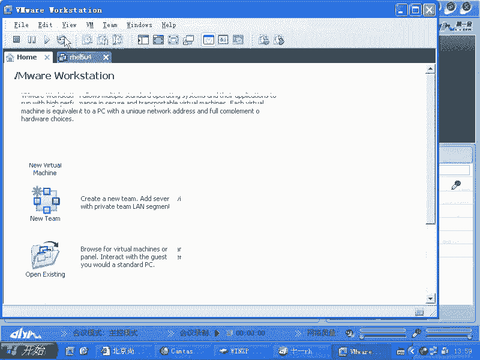
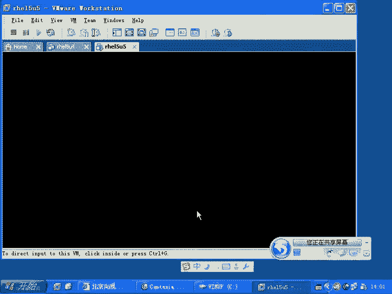

# 尚观Linux视频教程RHCE 精品课程 - P43：RH133-ULE115-5-1-proc-sysctl - 爱笑的程序狗 - BV1ax411o7VD

那么在。我们了解完linux整个系统启动结构了以后是吧？大家看到最大的感觉是什么？就是说这些结构是不是都是以什么以什么串起来的。

是要交的。是不是需要脚本。所以的话呢学习需要脚本以后的话呢，你可以自己做这种linux系统，也可以非常了解lininux整个的这个运作的东西。然后如果要是有出现问题的时候，可以把它解决掉是吧？

也就是说我们看到的一个一个组件是什么呢？是砖块，其中的话呢，把它们粘合在一起的东西什么呢？是需要脚本，对吧？那么我们如果要是细心的话呢，去研究这些脚本的话，最终你能把整个的系统重建或者说怎么样去添加呀。

怎么样去更改啊，怎么样去 trouble梳ing啊，全都可以搞定。那我们现在的话呢想进一步了解系统的时候，需要编程是必须要用的。但是呢我们现在内核本或者程序本身它如果在运行的时候，他想让你知道一个什么？

哎，我内核的话正在运行是吧？那么我现在缓存用了多少。然后我现在的话呢，这个呃文件系统绑定了多少，对吧？然后系统当中的话，系统当中的话呢，中断分。配了哪些资源，有哪些设备连接在机器上。这些信息的话呢。

统一都是由谁来处理，你们想都是由谁来处理？是由一个大的可执行程序来处理。也就是说你是要编程的话，你看到的都是一个一个程序互相之间连，是不是互相之间调用。但是这个程序怎么样呢？

我们说内核它就是一个大的可执行程序，你要想看它的内部啊，你要想看它的内部，因为它已经是一个编译好的程序，对不对？所以的话呢你直接想去看它，那么一般比较困难。尤其是内核，你要是个应用程序的话。

还可以在内存当中找到这个应用程序，找其中的值是吧？但是内核不可能把所有的东西都给你看。也就是你没有办法，你写对一个程序是没有办法访问到它的空间的，它就像一个特别大的程序，是不是本身你就在他生周围生活啊。

你就在地球上生活。那么你说我先把地球上的表层全部都挖开是吧？然后再拿这个里面去，所以放呢不能这样做。那么有一种什么办法呢？就是我这个应用程序，我给你提供接口啊，这个接口的话呢。

刚好是可以专门让你看你想看的东西，这个就是什么呢？我们所谓的PROC文件系统啊，PROC文件系统。

啊。共享了吧。没共享啊。好，我们看啊。好，那么我们看一下PLC邮电系统啊。😊。

POC文件系统的话呢，它是一个虚拟的文件系统，你可以自己去mount啊，我们mount一个杠T啊，PLOCmount在什么呢？mount在那啊，就是PLOC的话，它没有一个来源是吧？

但是内存当中那些数值，你也不可能去绑定另外一台机器上内存上所有的值，是不是？😊，所以的话就变成那mark在哪呢？AAA目录下。慢子完了。是不是再看。AA幕下跟PLC下一模一样的东西。

所以PLC这个目录啊，它本身只是一个入口而已。入口入到哪去呢？到我们的内存的结构当中去是吧？他给你准备了很多函数。你要访问某一个文件的时候。

后台的一个函数给你返回一个值或者内存当中的一些什么数值给你反反馈回来，这是PLCs的话呢，我们原来也给大家讲过，对不对？那么PLC和ss的话呢，他们有一个什么问题，就是说我如果要是看我是可以看的。

我们原来就给大家讲的是看怎么看是吧？现在的话我想改。我要怎么更改？那你看我如果要是现在涉及到PLOC文件系统下。现在的话呢。我想去改。看一下啊。这样吧。VI啊device。

是PLC文件系统下deices文件。这个里面的话呢是说装载的所有的驱动，每装载一个驱动，它就会注册一个什么主设备号在这里面。那我想改它VI它。在这里面的话，你说第一号啊是memory。

那我把它改成什么呢？😊，我则改成TTY。第4号TTY，我把它改成memory。

啊，这个时候你保存退出的时候，那么是保存不了read only啊，包括你去强制写入也不成。

什么原因呢？就是它本身这些文件都是不存在的，它可以提供的是一个什么一个文件的样子。你看到的时候是一个什么。实际上是一个值是吧？它并不是实际的文件。但是呢我们在写入的时候的话呢。

它大部分的文件都是不提供的。那么只有什么呢？在。

绝大多数都是不提供。那么只有在什么PROC下的。ss目录下的文件它是可以支持写入操作的啊，它是可以支持写入操作。那一般的话也都是什么ele这种方式去写入，那么不会让大家去用什么VI方去写入啊。

比方说我们看ss目录下的话呢，有众多的。文件夹啊，那么如果要是你想调整的是。想调整的是呃。你要想调整的是一个网络方面的，那么你应该到哪个目录下去啊？light是不是IPV4是不是？然后呢，到这里边去。

比方说啊我们系统当中的话呢，让大家去写一个就是我们的练习当中有一个就是说你怎么样把所有的 pin的这种请求啊给它关闭掉。因为别人聘你的时候是发一个ele request的请求是吧？

你现在不想请响用这个请求，通过改一下参数就好。我们看cat I呃catICMP啊，然后icle哎。😊，Icle ignore啊。2。那么一旦的话呢，你把这个参数的话呢改成一，你看这叫做ICMP的参数。

ICMP协议的参数。echo echo的话呢，就是说你聘我的时候，实际上就是发了一个e echole request的请求是吧？就是回应是吧？回声ele是回声，我发一下，那么你给我回应是吧？

这是个请求发过去。那么你是不是要把它全部都怎么样呢？忽略掉是吧？ignor是吧？R所有的ele请求全部都忽略掉。那么当我把它质一的时候，ele一个一输出重新一下到这个文件。😊，那这时候的话呢。

他就会怎么样？评我是拼不通的。听不通的，明白吧？所以这个值的话呢，改这个内核参数就这么简单。我们要改的内核参数的话，都是在什么PROC下的ss目录下。PROC下的ss目录下的话呢，多数的文件。😊。

都可以改，但是也有少数是不能改。少数是不能改。那这些改的这个文件的话呢，改完以后是立刻生效。但是下次重启动时候，生效不生效。我们都已经有习惯了是吧，不写入某个文件的话，它肯定不生效是吧？

那比方说我在改这个文件啊，我在改这个。Yeah。呀我继续死机吧。

啊。😮，好。F control。

等一下我的机器的话有些问题啊。

好。刚才这个程序的话有些问题啊。

让他重启了啊，完了是不是执行了什么命令是吧，没有吧。没有。咱这个系统的话呢，windows这个系统是经过定制的，我不知道它是到底怎么回事啊。就是犯迷糊者很正常。我看刘志章说这个清了这么多是吧？

有点迷糊是吧？很正常啊，很正常。就是说我说如果要是你细节的每一个点都知道，那你除非是背着极大的压力是吧？然后这个压力的话每天的话都要求你这么做，那么你会把它记得比较清楚。否则的话一般人的话都是。

学一点忘一点学一点忘忘一点。那么什么时候你会记起来呢？面试之前啊，面试的时候你会记起来，尤其是什么呢？那个呃面试的时候，人家问你几个问题，你垂心顿足啊，我怎么就不会呢？是吧？到底怎么回事？

这时候大脑一下就被激活是吧？回去找答案，这是一个。再有一个的话呢，是学就是在那个工作的时候，你用到什么，你会把它记起来，然后再去深入了解，而且比我还要深。但是呢。就是但是什么？就是这种机会的话呢。

还是要你。呃，就是自己去寻找是吧？那现在的话在没有压力的情况下，你可以把HCE当成一个什么任务是吧？这个任务的话呢，人家要考试了，我要达到考试的水平。然后呢，我要把这个有用的东西都学会啊。

这是你可能要做的。好，现在这个系统起来，看刚才那个blue hat是吧，改成蓝帽子了啊，没改绿帽子是吧？😊。

好，那么当我们把内核参数改了以后的话呢，它重启以后肯定是不生效了。那么我们怎么样去生效呢？更改内核参数的话呢，有一套机制，这套机制叫做ssCTL。

sCTL，你们看一下自己绩效的ETC目录下的sCTL这个文件。

那么我我的话就不进入运行模式为5了，我以后的话都进入运行模式为3，我不想去每次都打开一个大步头的东西啊。那么现在的话呢，我们看一下VIETC下的sCTL啊点com这个文件。

这个文件的话呢就是系统当中啊自动改内和参数的文件，这是自动改内和参数的文件。这里面已经有默认的好多更改，对吧？

默认了好多更改。问题就是说我现在想改那个内核参数号有很多，我想改其中的一个。其中一个，而这一个的话呢并没有出现在这里面，没有出现在这里面。那这个时候怎么办呢？我们看一下，就拿我们刚才的话呢。

把ele request那个请求全部都忽略的这个这个参数来说，它实际上的位置是在哪呢？POC下的ss目录是吧？还有在哪呢？在我们的呃net当中的IPV4，然后还有一个什么呢？还有一个呃ICMP啊ic。

😊。

ore all是吧？现在它又变成零了，但是我只要想改这个内核参数，那我每回的话ecle一个值过去就可以。想自动的更改的话，就要用到ssCTL啊这个机制。sCTL的话呢，它可以加上一个杠W这个命令来写。

写了以后的话，它可以这样的。😊，你把PLCPLC目录下，是不是不是说所有的内核参数都可以去写，是不是它只有ss目录下可以写是吧？所以你把这段的话怎么样？😊，给它省略掉，于是你剩下的就种n这些东西。

是不是？那你把它看看一下，就是说n当中的是吧，net杠IPV4是不是你把这一斜杠变成点。😊，因为的它斜杠在这里面不能用，是不是？比如说吧就是net点IPV4点ICMP是吧？然后下划线icical。😊。

然后呢，ign诺。哦，是不是？把这个值写成多少呢？等于。0那等于1，这样呢一回车是不是？写完了以后，你再去看这个文件。这回我没有用icle命令，是不是没有ic命令，是不是它写成一了？

所以的话用这个命令的话呢，可以写任何的ss目录下的那些内核参数啊，可以写任何的。那你说我icical不是也可以吗？为什么的话，你要用让我用这个命令呢？因为你可以直接把刚才写入的这个东西怎么样呢？😊。

copy到什么？offoffpy到ETC下的CCTL点com当中去。明看了吗？明白了吗？然后呢，V来这个文件把这个你刚才写的这个参数的话呢，添加到那个文件里面，每一次系统启动，它都会自动帮你设置这种。

每次系统启动都会把你是自动设置的。明白了吧？那这里面常见的内核参数就是我们要用的常见的内核参数有哪些呢？你比方说看这个啊cat就是PROC下的。交涉下的face当中的。mat当中的。IPV4当中的。

比方说呃IP。F了。IP forward这个参数的话，默认现在是打开是没有打开是零是吧？零是没有打开，为什么不打开的呢？因为IP forward它是把自己做成路由器的一个选项。

也就是说如果要是我想我有2块网卡，有一个人想把数据包啊发给我。但是这个数据包只是通过中转是吧？要从我另外一个网卡再发送出去是吧？我会帮他转发这个操作，那我就把IP forward怎么样？😊，打开。

如果要是你发给我数据包。我知道不是我的。我也不帮你转发是吧？这也可以啊，默认就是这样，因为我没有义务的话呢，立刻给别人做路由器是吧？做转发数计包这个操作，我可以不转发。所以这住IP forward。

但是反过来讲，如果你是一个什么路由器，是不是？你是一个大家共享上网的一个服务器，对不对？那你就应该把它什么制成一，是不是所以它呢你可以去VI这个文件，你看到VI这个CT要点com。

你看到那里面就IP forward等于什么，等于一啊等于一。那么当你改完那个文件以后，能不能立刻生效呢？不能生效，要重启是吧？那么你也可以不用重启有个命令啊，sixCTL啊，忘了叫什么杠。杠T。

杠P是吧。杠P这边的话呢，就是把那个文件里面的所有的选项的话呢，重新写一遍啊，重新写一遍，看到有IP forward吗？也就这些内容的话都是什么？都是sCTL呃，sCT点com里面的内容，对吧？

你要把你这行的话呢，添加上去以后，这行的话呢，也会放放在那里面。😊，CCT2杠PCCT2。CTL杠。杠W是吧，sCTL杠P对不对？还有什么呢？还有sCTL杠A啊，杠A是干什么呢？😊。

把所有的你现在可以设置的内核参数啊全部都怎么样，全部都显示出来啊，我们有一个我原来有个学那个学生啊，但是他现在水平的话，我觉得应该是比我强很多啊。他现在在百度，然后呢，他原来的话呢。

在这个什么网易什么的话都待过。他的话呢在做这个就是说这个选项的时候，他原来问我一个问题，特别急啊。他说哎不是你知道我不知道这个R715就是第一个版本，不是update一啊。

就是R715不是upate一就R715update一前面那个版本就R715。这个版本我刚用的话，我怎么有问题啊，怎么有问题呢？我插上网线以后哎，那个掉包率特别高，那个参数没调好。对，调包率特别高。

总是那个效率啊特别特别差是吧？明明反千兆网络，那么别的机器的话呢很正常，结果他的话呢就特别慢。于是呢他就问我，他说哪个内核参数决定的这些问题，我给他出了好多主意都不行。最后的话呢，他自己修好。

怎么修好的呢？他把HEL4里面的那个所有的内核参数。4CT号杠A啊。是不是所有的内核参数全都有了？嗯啊，他把这些内核参数怎么样呢？输出重定项程一个文件。啊。是吧。啊，输入成这个文文件以后。

把这个文件copy到那个R715那个机器上，然后输入什么呢？CCCTL杠P是吧，加上个杠F是吧？TM命目录下的ADCCT啊一回车。😊，把这个参数就全部都刷过去了，是不是按照R714的那个参数。

把R715的那核参数全部都刷了一遍，对不对？这样的话呢，他就把这个问题解决了。明白了吗？有用没有有用没有用啊，有没有用。啊。所以的话呢这个大家记一下啊。这个CCTL的一些使用。CCTL一些使用。

那么你如果要是想去设置的话呢，常见的参数啊就是常用的我们去呃就是说去设置的参数有什么呢？fe max啊在FS目录下就是ss目录下的FS目录下有个fell max啊，这个的话呢就是最大打开的文件的个数。

最大打开的文件的个数。还有什么呢？还有就是说我们的那个呃。😊，比方说那个就是说你现在看这个CT要点c里面的话有什么呃share memory max啊，就是共享内存的最大值啊。

共享内存的最小值等等这些内容。SHM啊share memory的max sharere memory all sharere memory mini啊之类的这些值，你可以调大。要装oracle的话。

可能要调。还有的话呢像什么S one cookie啊，S one cookie。S one cookie的话默认是等于一啊，这个的话呢是应付S one洪水攻击的时候的一个选项。还有什么呢？

还有像我们的呃。我想一下啊。什么SM backlog是吧？还有的话呢，像我们的这个ICMP的，就是说避免。避免那个ICMP的这个什么洪水攻击啊之类的这样的一些选项。你比方说ignore2是吧？

等于一就是说谁都 pin不通你了。但是呢你想让某一个人能拼通，但是广播的 pin的包，像你 pin的时候的话呢，像这个就是广播的 pin的包，就是icle的包的话呢，可以是一个广播包。

也就我可以拼整个网段是吧？我可以 pin网段内所有的机器，那么你可以加上一个什么呢？ pin是吧？19218。0。0是吧？这是一个网段的IP是不是加上一个什么呢？杠B参数杠B参数的话是广播是不是？

那这样的话呢，广播内这个广播域内所有的这个网段的人给收到这个书包以后给我回应。那实际上的话呢，这个参数就是把这个响应关掉，就是说它不响用这种广播的 pinwindows就不响应是吧？

windows就不响应像这样类型的包的话呢是不少啊，而我们一般查看的时候啊，我们一般查看的时候的话，查看哪些东西呢？😊。

你比方说cat啊PLC下的什么呢？memory info是不是？这里面的这些信息是谁的最爱呢？free命令的最爱它可以看现在共享，它现在可以看啊内存的话呢，用了多少是吧？还有多少空余的，对不对？

有多少做缓存，有多少做什么ca有多少做memory是不是？那么还有什么呢？像free命令的话，就查看这个数据，如果你不用你用忘掉PLC文件系统，free命令就不能用，明白吧？那么还有什么呢？

还有像什么VM state。😊，啊。然后呢，PS命令啊PS命令VM state的话是一定要会的。VM state前面加个间隔的秒述，比方间隔一秒做10次。间隔一秒做10次，这样的话呢。

它会把呃就是说你的这个系统状态的话给你显示出来。一般的话我们觉得系统慢是吧？哎，系统怎么那么慢？在windows下你会怎么样？conttrol加ele把这个任务控制任务控制器的话调出来是吧？

然后看谁占有内存，对不对？看到底系统的话是什么问题，内存有多少，然后硬盘有多少。但是呢我们在laux下，如果你在服务器里面，你看到这个速度特别慢，一般我的话会怎么样呢？我首先会看什么VM state。

我看慢的原因是因为内存耗尽啊，这边frreed的内存有这么多是吧？是因为内存耗尽，还是呃还是有大量的什么呢？IO产生BI和BOBI和BO的话呢，就是我们的那个brolock设备的。😊，读入和。写入啊。

读出和写入是不是这个数据是不是特别多。所以这时候我能基本上看判断出问题发生在哪。如果要是CPU占率特别高啊，CPU占率你比方说UUS表示的话是什么呢？用户空间当中的进程，比方说appache呀啊什么。

😊，呃，就是你执行的这个命令X window啊这些东西它所占用的CPU就是US。s就是说什么呢？系统空间当中进程。比方说我去频繁的去访问一个文件，尽管是我用户空间当中的什么进程。

但是它是不是涉及到文件的操作，文件的操作是不是要用硬盘的驱动去访问硬盘啊？那我问驱动程序，它是在哪运行呢？内核空间是不是？所以内核空间的话呢，它的这个数据呃它的这个CPU占有率高，也有可能是什么原因呢？

用户空间当中频繁去调用它造成的。对吧所以这个时候呢你要看用户空间当中这个CPU占率高不高，这就知道啊用户空间当中占用的比较高，内核空间当中也有，那说明是用户框空间当中的程序占主音。

你要我写1个1000呃1000万次的循环是吧？总是利变什么的，所有的目录，是不是？那我这样的话，我CPU占率肯定高啊。这是肯定的。但是呢这个占有率的话呢，是由用户空间和内核空间分摊开来。因为。

王呃就是因为我们的硬盘的驱动是不是运行在内核空间中。对不对？所以他这个的话呢就会看到这样线。而如果让你看到用户空间当中的进程啊，比占用的比较比较少，非常少。

但是呢主要是ssSYS这个空这个占用的这这些进程啊，线程内核线程占用特别多的这种什么原因呢？网络攻击。你想我给你发大量的数据包过去是吧？我给你一秒钟的话呢，发了几千万个几亿个这种数据包。呃。

当然就是就是你不一定能处理的哈。你这边的话呢，达到数据包以后，你要解包嘛？哎，这是什么东西是吧？嗯你。😊，公司里面的话呢，有一个人专门的话在前台负责什么拆解邮件是吧？这个人的话叫网卡。

是不是拆开他在运行的时候，他要告诉上面，告诉说声哦，拆开了给你上面内存，拆开了给你上面内存。这些操作都是需要什么CPU但是呢它是不是不涉及到你的那个用户空间当中那些进程？

因为这个包裹还没有投递到你的某一个员工手里面是吧？你的某一个员工还没有接到这个包裹，一直都是什么内核空间当中的线程帮你在做，是不是内核空间当中的线程的话呢，他会怎么样？他会拿着这个呃就说它它会解包啊。

把它放在哪个位置啊，看看这个包合理不合理啊，然后再删除掉全部都是内核空间当中当中的进线程的话在做。所以这时候会产生什么呢？大量的CPU的占略。所以的话你会看到有人在攻击你的手，这个地方非常高。

地方非常多，明白了吗？或者说我原来说过的。那个什么ACPI的那个驱动是吧？出bug。他出bug了以后的话呢，也会这非常高。但是你看用户空间当中就没有那么多程序占，明白了吗？

所以这个是这样RD的话呢就是adle就是剩余，就是那个相当于空余的这个CPU剩余的CPU啊。如果要是你想看一下，就是说你现在的话呢做某项程序啊，CPU占有率特别高。WA的话呢是表示。

因为IO方面的问题导致你CPU的占有率特别高啊，就是V呃WA就是waIO waitIO wait是怎么样的基理啊？我给大家举个例子。你的硬盘，你的硬盘寻道一次的话，是耗费什么呢？

最好的硬盘可能是6毫秒五六毫秒，是不是最好的硬盘？五六毫米。1毫秒。等于千分之1秒，是不是？嗯，那就一秒钟话呢，可以进行多少次寻道呢100多次是。而你的CPU的运算速度是一秒钟进行3亿次。

是不是3G的CPU嘛？嗯那么也就是说你的硬盘进行一次寻道，你的CPU你的CPU要等多少次呢？要等几千万，是不是？几千万次，然后呢才能等到一次什么渠道结束是吧？所以你想你的CPU辛苦辛。

一直在那边等着硬盘给他寻道完成，然后找到数据是不是？嗯，所以的话呢访问存储存储又没有什么呢？又没有太多的那个缓存的时候，导致你的CPU占率是非常的高。明白吧？所以访问存储的话呢是。

这个就是服务器最尽量要避免。你比方说你要写一个程序，这个程序的话，每秒钟的话呢，要访问硬盘当中好多好多文件，你就要尽量写不要去写这种程序，明白吧？它会耗费大量的CPU是不是？如果要是你写个程序。

那你说尽量避免的话呢，写那个硬盘或者读硬盘。然后呢，大量的数据的话，你都从内存当中缓存起来，这样的话就会非常不错。那么我们再传。我们的服务器或者说买服务器的时候，首选的就是什么呢？

把服务器的内存配到尽量大。啊，这是我的一项的原则。我。你们看这个啊。我运行一个什么呢？呃。😊，Fe。总共有这么多内存是吧？已经用的有这么多内存是吧？已经有剩余的有这么多内存，是不是？

下面的话呢是说咔呃这个buffer加cash，他们总共的话呢占用了多少呢？占用这么多内存。😊，这是什么意思呢？就是说你的内存如果足够大的话，它访问硬盘上的一个文件是吧？这个文件就一直放在什么？

一直放在我们的内存当中了。也就是你内存足够大的话，它就减少了访问硬盘的机会，是不是？这样的话你的整个的系统的机器的性能是非常高的。也就是内存的话呢，你要投入这个内存条的这个价格。

肯定要占整个的这个机器的价格的好几分之1是吧？但是呢你装多装一倍的内存，它的性能反而什么？相当于你多装了。半个什么机器，那半个机器的话，可能要投很多机器很多钱是吧？所以你不如把内存条都加满，明白吧？

这的性能会高很多。啊，这是我的一些经验。当然有很多人可能未必会认同。就是我说在性价比这个你关注的情况下，我可能会把内存加满，我一律是把内存加满。我有多少内存条是吧？我问这个主板支持最大内存是什么？

12G是吧？嗯，加满好。我一下都是这样。那你说让我去配什么特别多的。这个这个那个什么CPU啊什么，我觉得啊一般般就好了，没有必要去太多这种。但是说内存的话呢，我是非常关注的，因为内存一旦没有。

或者说变少了，那它就会造造成你的硬盘频繁读取的。命硬盘一开始你看我们这边是不是有swipe。你做这个优化的原则就是不要用swipe，千万不要用到swipe，你要用到swipe的话，相当于什么？

你这个系统就基本上是完蛋了。是吧不是说一点都不用啊。你比方说你用的话，你用了个512，它一直都不动是吧？你用VMstate一看啊，你用VM state看VM state看的话。

你看到这个swipe in和swipe out一直都是0，这就是OK的是吧？就表示你的内存是够用的是吧？结果的话呢总是swipe inswipe out的话，那说明你的系统的话，你就赶快换机器。😊。

因为swipe inswi out的话呢，会加重你的CPU负担，是吧？那这样的话，你的机器性能会非常大，明白吧？好，这边的话就是有关那个系统的状态的监视的这个命令啊，1个VM state。

那么我一般会经常这样用，还有就是top。现在的话你知道了系统当中占CPU占有率特别高，谁站的是吧？找出元凶来，元凶是谁啊？我们看吧。对吧我们看。不管CPU也好啊，我们默认情况下是按照CPU来排序。

你看那个CPU的占用率是什么？top占用率是67%是是？嗯那这就元凶是吧？我CPU的话呢，占用率特别高，那么就是它还有可能是其他的默认是以CPU的占有率来。然后呢，我们想看谁使用的内存特别大。

那么s加M。😊，shifted加M。就是大写的M大写的M的话就是以内存来排序。啊，你说我这边第一。看不看不完，我想看下一页的内容。大于号小于号。大于号小于号就是来回看。大于号小于号。

NK你可以杀掉一个进程。NN可以re nice一个进程，就是调整进程的优先级啊。这些操作的话呢，大家看一下那个视频，就是原来的给大家录的视频。那里面的话呢说的非常清楚。按Q的话，那肯定就退出了是吧？

按Q的话就肯定退出了，这是top命令。那么PS命令的话呢。PSA是吧，就显示着所有的在这个终端上打开的程序AU显示的就是说更长的信息，就是显示的项目更多了。X的话呢，就是说不止把这个。

就是终端上打开的程序显示，同时还把什么？还把那个后台的首部进程全部的进程都显示出来。这个时候你看到啊有很多进程的话呢，它所占用的C它所占用的内存为0啊，而这种这种进程的话呢，加了个方括号。

是不是加了方括号，这个方括号表示什么呢？它们是内核县程。他们是内河县上。不是竞争，是内核现城。也就是说，它并不是不占不占内存，而是不占用什么呢？用户空间当中的这个内存，它是内核当中的一个线程。

因为我们在2。6内核里面的话呢，出现了一个什么呢？就是可抢占式那个。可抢占式内核的话就是什么呢？就是我们的这个内核当中的线程啊，它也可以跟用户空间当中的线程的话呢呃进程的话呢互相比较。

CPU的话呢可以去使用，呃，可以优先去执行。用户空间当中的进程，他可以不用去理会内核线程是吧？所以它这个优先级的话就要调整。以前的话优先级调整不了。就是说我要去有个内核线程要运行。

我一定是先满足什么内核用户空间当中什么进程我都不管。对吧但是呢在2。6以后的话呢，就是可抢占式内核内核里面的内核线程的话，它在这边是不是有一个有一个这个相当于优先级是吧？这优先级的话，你可以去调整。

调整完以后的话呢，用户空间当中程序可以抢它的CPU。😊，啊，这样的话就不会变成什么呢？你死活就抢不到那个呃就是那个内核里面那些抢不过他们。这样的话你就感觉你自己操作非常慢。你为什么会感觉计算机慢呢？😡。

我点了一下鼠标是吧，半天才给我回应是吧？这是慢是吧？这就是说你在用户空间当中的一个操作，CPU没有及时的去跟进，对不对？嗯，它缓存起来了。所以的话呢以前的lininux系统都是特别慢。

现在的话呢你去点击一下X window里面的一个事件，它可能会强调什么呢？内核空间当中的一个正在运行的线程，明白吧？那这时候它的响应速度就会快一些。相反。

那就是什么内核空间当中那些县城执行的效率是不是就变低了呀？这都是有有利就有弊。但是呢利大于弊是吧？毕竟你在这个。服务器上操作的机会特别少，你把用户空间当中的程序结束的多一些，就不会有这些问题了，对吧？

这是这些操作啊，所以的话呢你看啊，那么一般来说你通过这些命令，你比方说PS命令，还有什么呢？PS tree。这些命令的话呢，都是去查看什么PLOC下的这些什么数字啊，这些数字的话呢，每多一个进程。

你要是进程的话呢，我有一个叫做1万号进程。这1万号进程就是它的PID就是它的进程ID进程ID是1万号，它在这边就会有一个1万号的目录产产生，是不是？所以本质上讲。

PS命令top命令PS tree这些命令全部都是在什么？😊，全部都是在查查PLC下的那些文件或者文件夹，是不是？所以的话呢如果要是PLC没有去运行的话呢，PLC没有去加载的话，没有加载到这个目录下的话。

这些命令一概全部都是失效。他们根本就北都找不到，明白吧？这就是这些命令啊，那么当然了，像什么文件系统啊，然后呢还有就是我们的up time啊，还有就是VM state这个数据啊。

还有我们的这个spe的那个内容啊，还有我们的这个CPU的状态，CPU的这个呃就是这些特性啊，还有我们的内存的情况，还有我们加载的这个设备啊，这些东西大家都可以分分别类的去看是吧？

去查看s目录下是可以更改的是吧？那么这些目录，这些普通文件都是什么都是直接去就是查看的，明白吧？这就是我们这些内容啊。😊，好，我们再看一下还有些什么东西的话呢，需要补充啊。

DF命令查看我们的磁盘使用是吧？这些的话呢都是查看系统状态的，大家都要用一下啊，自己用一下。host name啊hos name。ho name也是设置在内核当中的啊。

ho name也是设置在内核当中的。有一个内核文件就叫hos name，你可以查看，也可以更改。更改完了以后，你像我想改主机名是吧？ho name，然后呢改一个名字，然后3W点uplook点com是吧？

这样的话就立刻更改改的结果是什么呢？实际上就是内核当中那个。文件啊就是这个PLC文件系统下，某个文件被你改动。那你也可以直接ecle一个值过去改是吧？当然改完以后生效吗？不生效，那你要想永久的更改。

那就是ETC线的ss con当中的什么nwork是吧？然后永久的动感啊。U name。you name的话呢是看的内核版本，是不是？一 name内核版本的话呢，我们这边要提一点，当你去装载的是。

32G呃，就是装装载的是4G以上的内核的时候，你需要装个内核叫什么呢？ kernell杠PAE的内核。PAE内核就带物理地址扩展，也就是它可以支持着内存的数目的话呢大于4G。呃大于4G。

但是呢如果要是你去采用的是什么呢？就是比较大内存，而且又在什么服务器端用，最好采用什么呢？X86就是X8664，就是64倍的什么H115，64位的H15的话呢会更快。

因为64位的H115理论上的话可以支持R的64次方这么大的内存，对吧？那你大内存支持当然不是问题了。你说我去调用32位的PAAE内核也可以啊，为什么的话，你不让我用这种的，因为这种的话呢，它效率会更低。

没有完全发挥出什么64位的这个优势了。它的寻址是什么呢？是一种软件的这种算法，而不是硬件支持的，明白吧？所以的话你要支持大内存的时候，最好用什么呢？X8664的这个专门的HEL就是reite企业版。

那么不要去装1个PAA就完事儿。那么我我们如果要是反时想去，我们对性能无所谓啊，就是说但是我要支持那么大内存是吧？只要4GB以上的内存，那你要装什么呢？Kl杠什么大写的PAE的内核，明白了吧？明白了吗？

然后呢，我们去查看这个系统状态的时候，你可以用up time。ipad的话呢，你看系统的话呢，启动了多长时间啊，开了多长时间机，负载的情况是怎么样？负载的话呢，这边是呃。买。呃。

就是每一分钟、5分钟和15分钟等待执行的任务的个数。1分钟、5分钟和15分钟等待执行的任务的个数。你比方说这5分钟的话呢，一直有一个程序是吧？抢不到CPU他在排队。那这个程序的话呢。

就是这个地方就应该看到的是什么？一是不是？结果在这5分钟里面的话呢，它等了2。5分钟，另外2。5分钟它就执行完了是吧？那这时候它的这个负载值是多少？0。5是吧，所以这个地方的话呢。

应该啊这边的最大的值应该不多于你CPU的个数。就是说你如果要看到这个零点多少多少，这还比较正常。如果你看到什么十几、二十几、五十几啊，通常的情况是什么呢？通常的情况就是说你的硬盘啊特别慢。

导致你的大量的程序等待着什么那个硬盘的数据的访问。我原来见过50多。老师，你不是说这个应该小于CPU的个数吗？你看这我我这50多，你看着怎么看着办嘛，是吧怎么怎么怎么折腾。

我说那个你看一下I wait是不是特别高，I wait特别高的话，导致你大量的进程的话被堵塞啊，也就是人家访问网页的时候啊，等了一两分钟才能看到一个什么看到一个bantter出来啊，这个就是什么呢？

这种问题，明白吧？就up time实际上top里面的话也能看得到。我们这个那个就是专门讲PS啊，top这个地方的话呢，给大家讲的很清楚啊。大家仔细看看那个。那么VM states的话呢给大家介绍过。

然后还有就是什么呢？哎呃还有就是swipe。啊，swipe2，这就是打开swipe。那么加上杠S的话呢，可以看一下swipe这个目前的所有的swipe空间，就是虚拟内存空间啊，使用情况。

P map可以查看某一个进程，某个进程它的这个内存的情况啊。系。就是说它这个内存结构，比后它掉了哪些库啊，在哪个地方映射的是什么什么东西，这样内存的这个使用情况的话给你显示出来。

DF是查看什么这个硬盘的使用情况，是不是DU是吧？杠S我们经常是吧看一个目录多大，对不对？

看一个目录多大，那么DFDU杠SH就是说看这个目录的话呢，到底有。多大，然后呢，以多少兆多少K的形式的话显示。我们一般想看系统当中有哪些硬盘可以用硬盘上有哪些分区啊。

F disk杠L是不是它会查它会把所有的硬盘，所有的分区显示出来。那么IO state的话呢是显示IO的情况。那么假如说你有2块硬盘到底哪块硬盘在访问，哪块硬盘有数据量。

那么IO state的话能看得出来，一般的话操作也是一样，110。没有装啊，I state呢你要装一个包s。state这个炮。这 states这法。好，这些常见的文件，还有就是使用CCTR的话呢。

去控制内个参数。我就给大家介绍到这个地方啊，我就给大家介绍这片。

如果要是你想看PCI设备有哪些是吧？那么你可以查看什么呢？catPROC下的呃P。PCI。咦。这样的deices是吧？这些文件那么你可以看看不看不明白，没有关系，有一个专门的程序LSPCI。

是吧它可以列出所有的话连接在PCI总线上的设备。是不是？LSUSB是吧，LSUSB那么可以查看你现在的话能有哪些USB设备的话呢去连接。他们都是从PO呃PLC目录下去找相应的文件。

像这样相应的命令的话是有很多的是吧？比方说还有什么呢？我们的书上还有DMI啊decode它可以查看的话呢，你的这个bi给你返回过来的这个直接的信息啊，返回过来的直接信息。比方说。

呃，某一个硬件它的版本号啊，然后这些信息。X86info的话呢，是看CPU的这个标准的这些特性，哪些是支持的。比方说SSE1是吧？SSE2这些这些这个指令级的支持等等。好。

我们这部分的话呢就给大家介绍到这个地方啊，那么大家可以看一下PRO呃PROC和什么呢？和ss目录啊，这两个目录的话都是差不多类似的。就给大家介绍的这个地方。

