# Linux系统管理：第43章：proc文件系统与sysctl内核参数管理 🔧


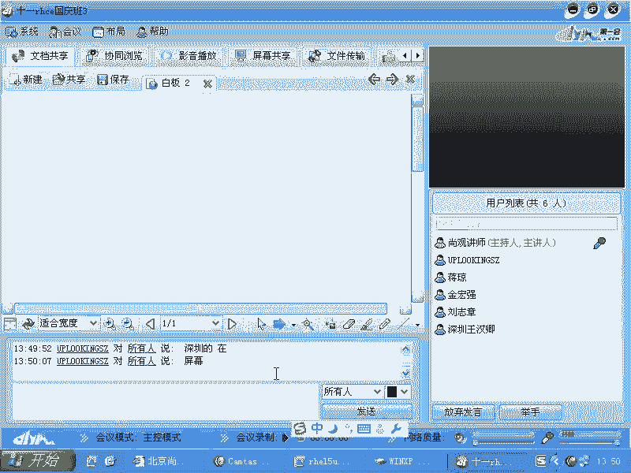

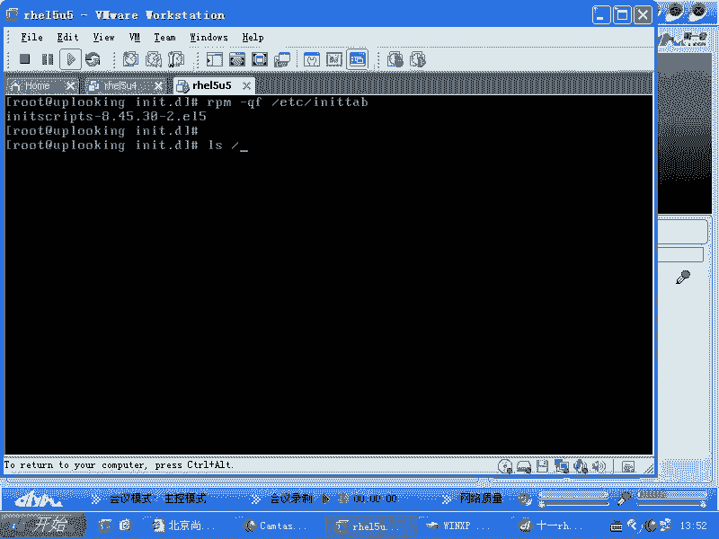

在本节课中，我们将要学习Linux系统中一个非常重要的概念：`/proc`虚拟文件系统。它就像一扇通往内核世界的窗户，允许我们查看和调整正在运行的系统内核的各种参数。理解`/proc`和`sysctl`是进行系统监控、性能调优和故障排查的基础。

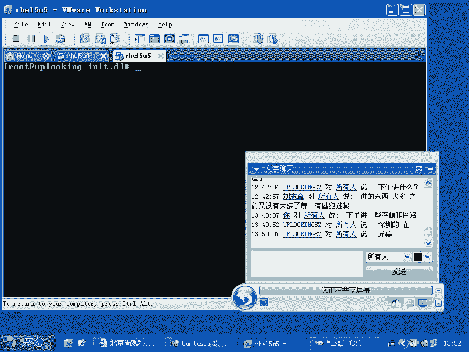

上一节我们介绍了Linux系统的启动流程，其中各个组件通过Shell脚本粘合在一起。本节中我们来看看如何与正在运行的内核本身进行交互。

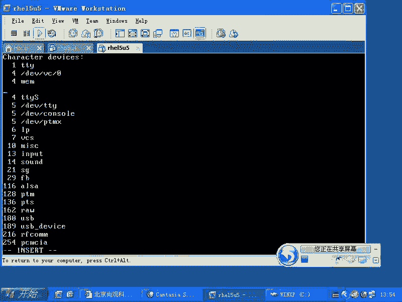


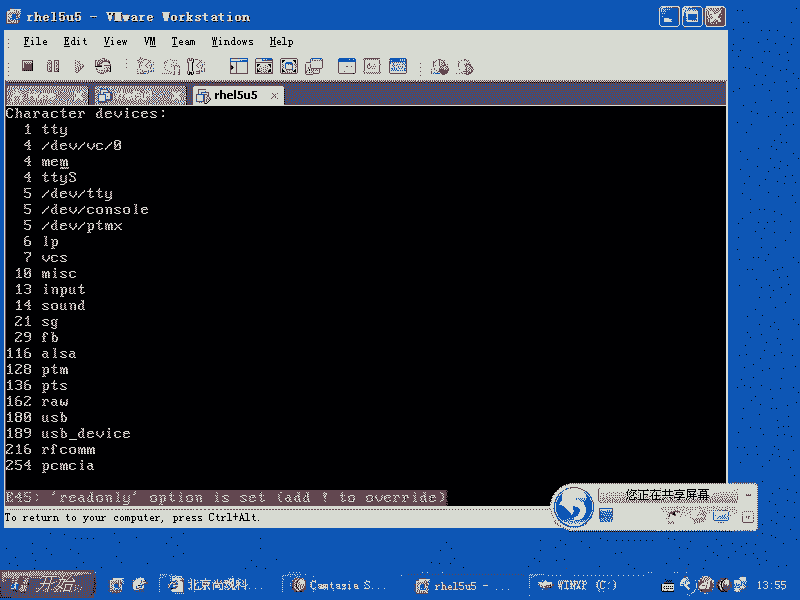

内核本身是一个庞大的、编译好的可执行程序。我们无法像查看普通文件一样直接窥探其内部状态。因此，Linux内核提供了一套接口，以文件的形式展示其内部信息，这就是`/proc`文件系统。它并非真实的磁盘文件，而是内核数据结构的动态映射。

## 探索 /proc 文件系统 📁

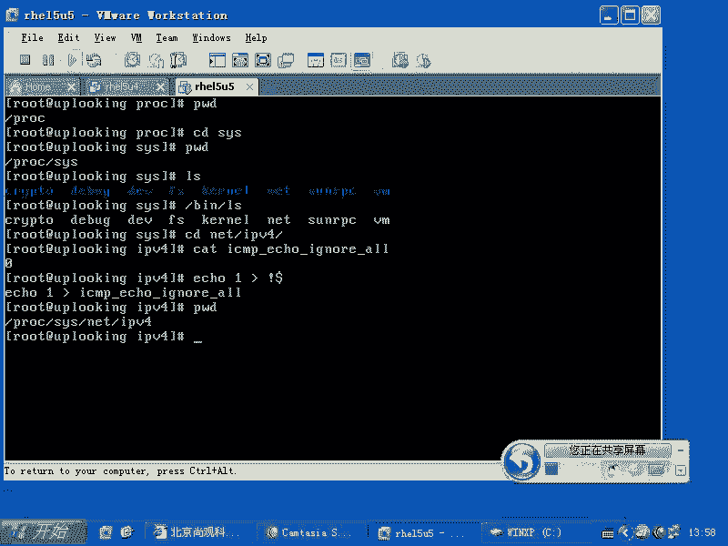

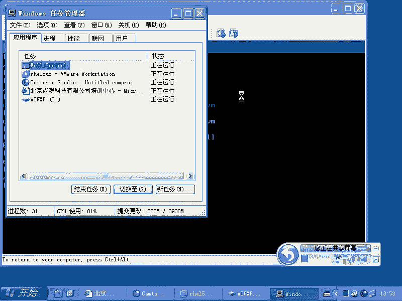

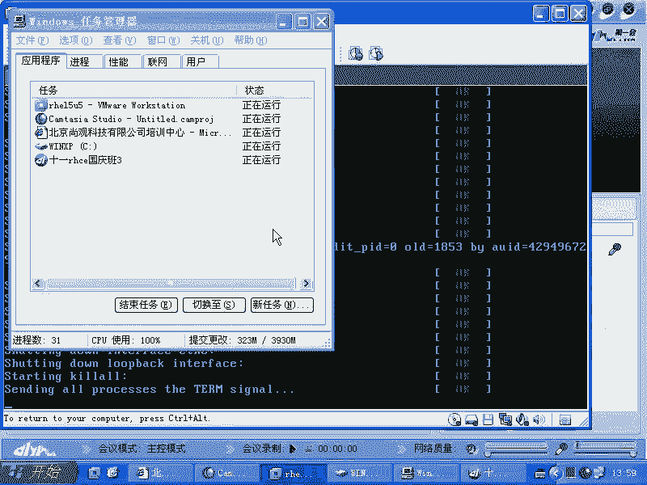

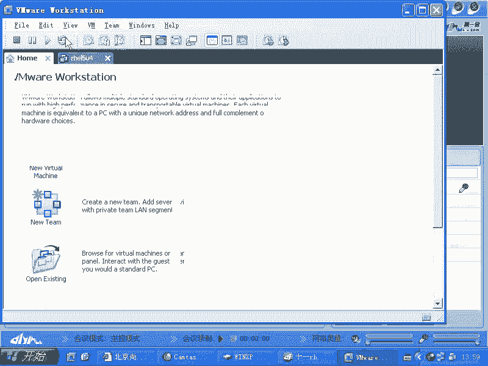

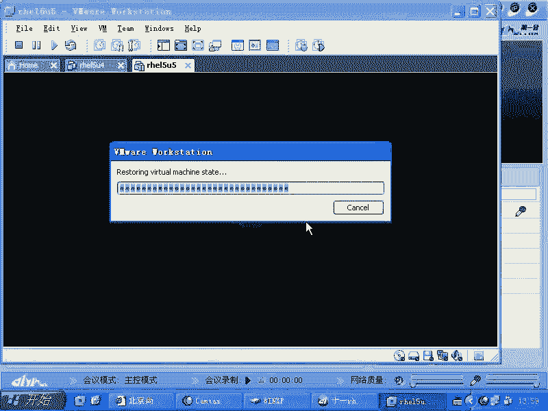

`/proc`是一个虚拟文件系统，需要挂载后才能访问。通常它被自动挂载在`/proc`目录下。

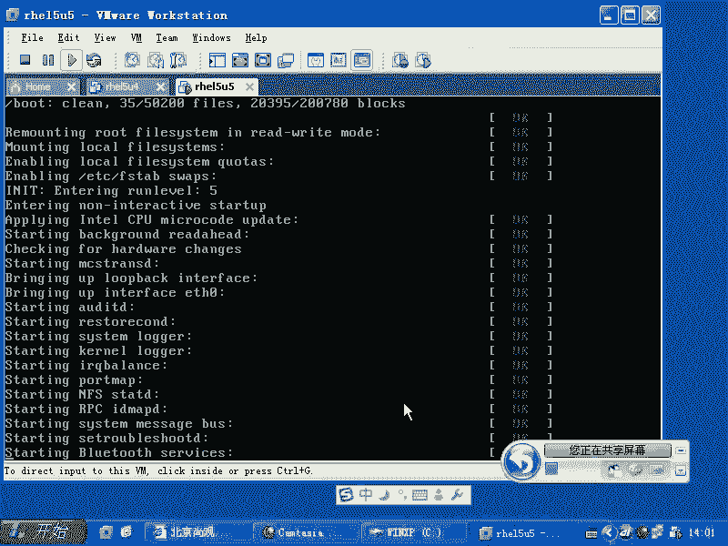

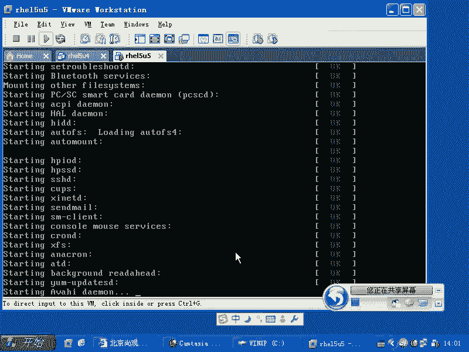

```bash
mount -t proc proc /proc
```

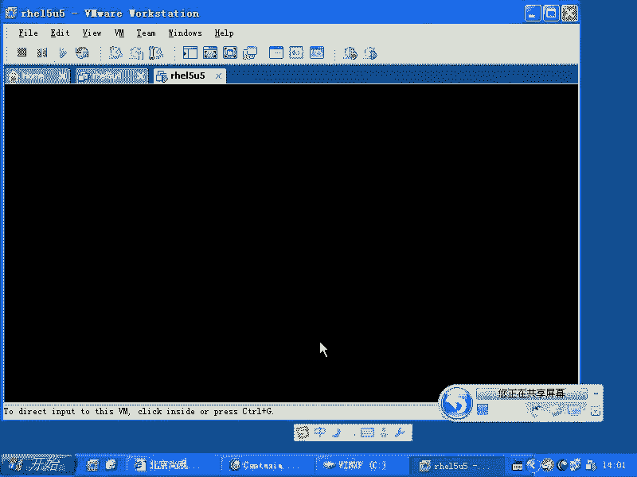

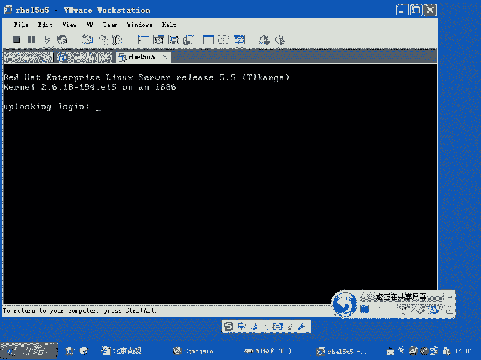

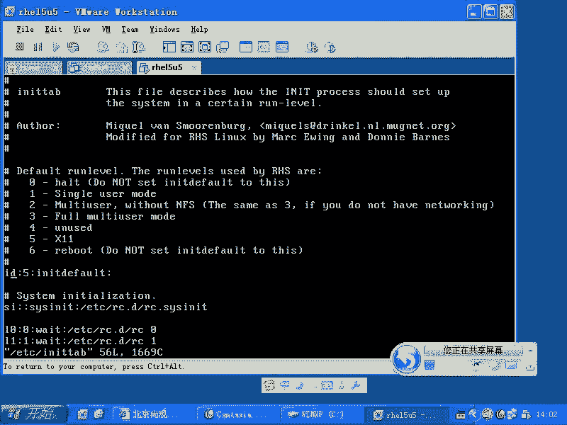

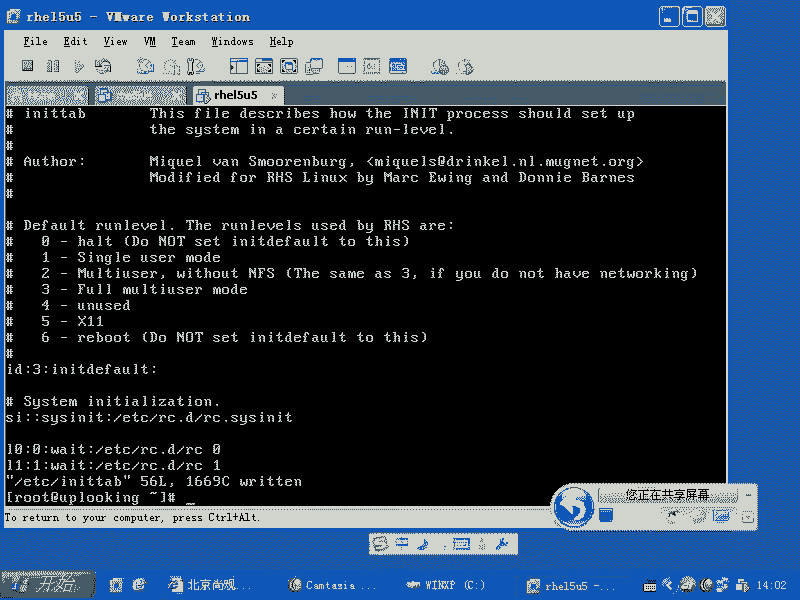

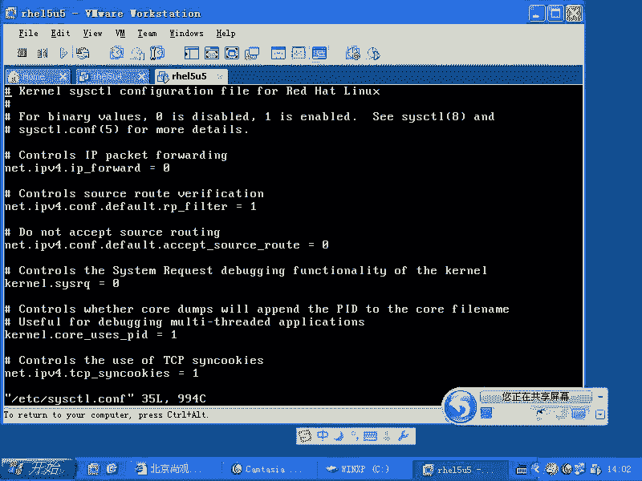

进入`/proc`目录，你会看到许多以数字命名的目录（代表进程ID）和一些特殊的文件。这些“文件”实际上是访问内核信息的接口。例如，`/proc/cpuinfo`包含CPU信息，`/proc/meminfo`包含内存信息。

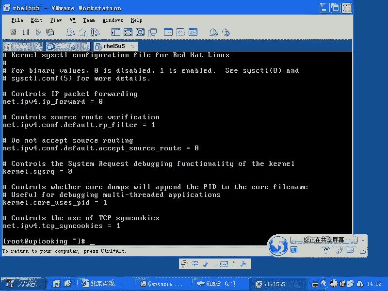

绝大多数`/proc`下的文件是只读的，用于查看信息。例如，尝试用文本编辑器修改`/proc/devices`（设备列表）会失败，因为它是只读的。

## 可写的内核参数：/proc/sys ⚙️

在`/proc`文件系统中，有一个特殊的子目录支持写入操作，用于动态调整内核参数，这就是`/proc/sys`。

例如，网络相关的参数位于`/proc/sys/net/`下。一个常见的调整是关闭系统的ICMP回应（ping响应），这可以通过修改`icmp_echo_ignore_all`参数实现：

```bash
# 查看当前值，通常为0（响应ping）
cat /proc/sys/net/ipv4/icmp_echo_ignore_all

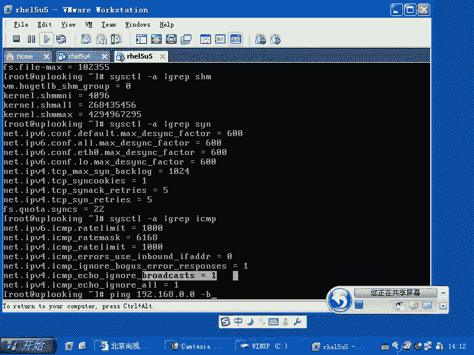

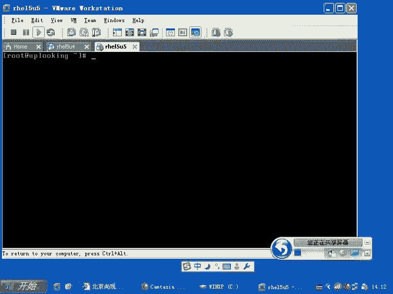

# 将其改为1，忽略所有ping请求
echo 1 > /proc/sys/net/ipv4/icmp_echo_ignore_all
```

通过`echo`命令写入后，更改会**立即生效**。但这种方式是临时的，系统重启后会恢复默认值。

## 永久配置内核参数：sysctl 🔄

为了使内核参数的更改在重启后依然有效，我们需要使用`sysctl`机制。其配置文件是`/etc/sysctl.conf`。

**sysctl命令的基本用法如下：**

*   **临时设置参数**：使用`-w`选项，参数路径中的`/`用`.`代替。
    ```bash
    sysctl -w net.ipv4.icmp_echo_ignore_all=1
    ```
*   **从配置文件加载并应用所有设置**：
    ```bash
    sysctl -p
    ```
*   **查看所有可设置参数**：
    ```bash
    sysctl -a
    ```

**永久配置的步骤：**
1.  使用`sysctl -w`命令测试并设置参数。
2.  将成功的设置行（如 `net.ipv4.icmp_echo_ignore_all = 1`）添加到`/etc/sysctl.conf`文件中。
3.  以后每次系统启动时，`sysctl -p`会自动执行，应用配置文件中的所有设置。

一个常见的重要参数是`net.ipv4.ip_forward`，它控制IP数据包转发功能（用于路由器或网关）。在`/etc/sysctl.conf`中启用它的配置是：
```
net.ipv4.ip_forward = 1
```

## 系统监控实用工具 📊

许多常用的系统监控命令其数据源就是`/proc`文件系统。如果`/proc`没有挂载，这些命令将无法工作。

以下是基于`/proc`的常用监控命令及其用途：

*   **`free`**：查看内存使用情况，数据来源于`/proc/meminfo`。
*   **`vmstat`**：报告虚拟内存、进程、CPU活动等整体状态。常用用法是间隔采样，例如`vmstat 1 10`表示每秒采样一次，共10次。
    *   **`us`**：用户进程CPU时间。
    *   **`sy`**：系统（内核）进程CPU时间。如果`sy`异常高，可能受到网络攻击或内核驱动有问题。
    *   **`wa`**：等待I/O的CPU时间。此值过高通常意味着磁盘I/O成为瓶颈。
    *   **`swpd`/`si`/`so`**：交换分区使用量及换入/换出情况。应尽量避免频繁的交换（`si`, `so`不为0），否则会严重拖慢系统。
*   **`top` / `htop`**：动态查看进程状态和系统负载。
    *   默认按CPU使用率排序。
    *   按 **`Shift+M`** 可按内存使用率排序。
    *   按 **`k`** 可终止指定进程，按 **`r`** 可调整进程优先级（renice）。
*   **`ps`**：查看进程快照。常用组合：
    *   `ps aux`：查看系统所有进程的详细信息。
    *   `ps -ef`：以完整格式列表显示所有进程。
    *   方括号`[ ]`内的进程是内核线程。
*   **`uptime`**：查看系统运行时间及平均负载（1分钟、5分钟、15分钟内的可运行进程平均数）。负载值持续高于CPU核心数通常意味着系统过载。
*   **`df` / `du`**：查看磁盘空间使用情况。
    *   `df -h`：查看文件系统磁盘使用量。
    *   `du -sh <目录>`：查看指定目录的总大小。
*   **硬件信息查看**：
    *   `lspci`：查看PCI总线设备（来源于`/proc/bus/pci`）。
    *   `lsusb`：查看USB设备。
    *   `dmidecode`：查看BIOS提供的硬件信息。
    *   `fdisk -l`：查看磁盘分区信息。

## 性能调优经验谈 💡

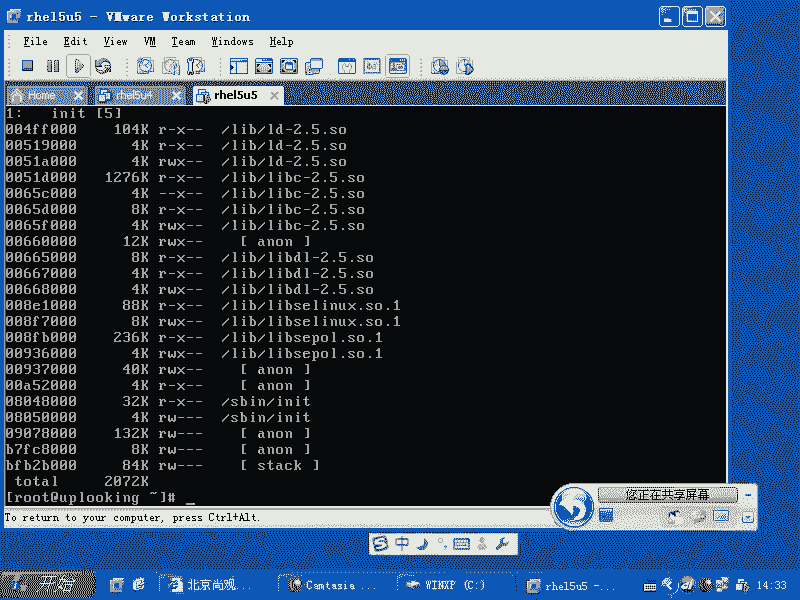

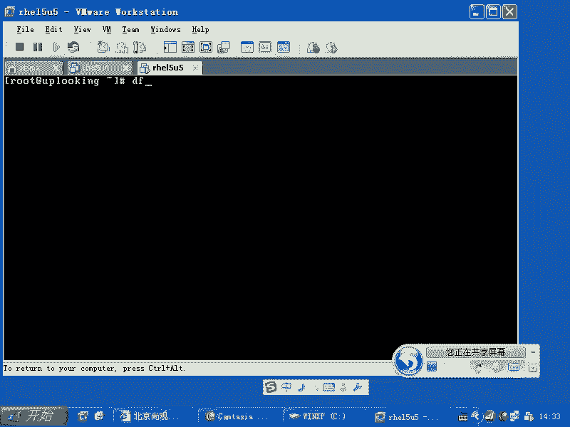

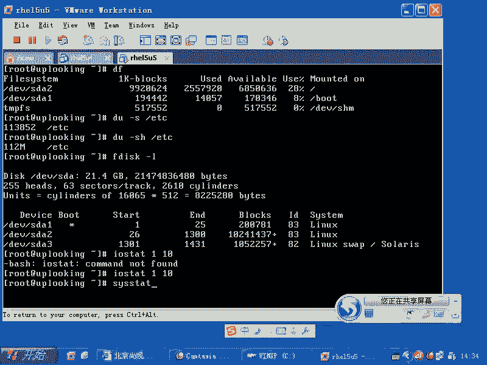

在实际的系统管理中，有一些经验性原则：
1.  **内存为王**：在预算允许下，尽可能配置大内存。充足的内存可以减少磁盘I/O（通过缓存），这是提升系统性能最有效的方式之一。
2.  **避免交换（Swap）**：时刻监控`vmstat`中的`si`（swap in）和`so`（swap out）。频繁的交换操作会极大降低性能，是系统需要扩容或优化的明确信号。
3.  **关注I/O等待（wa）**：`vmstat`中的`wa`值过高，表明磁盘速度跟不上CPU处理需求，应考虑使用更快的存储（如SSD）或优化应用程序的I/O模式。

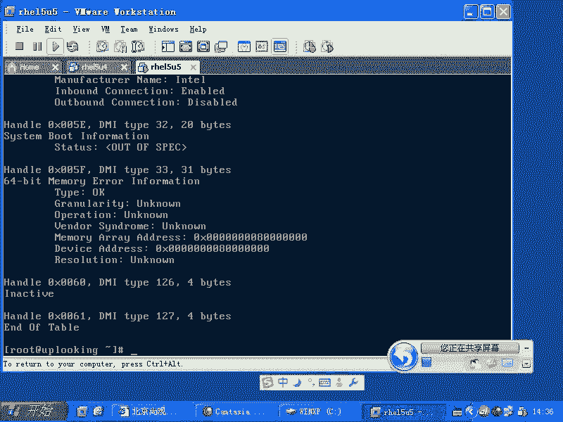

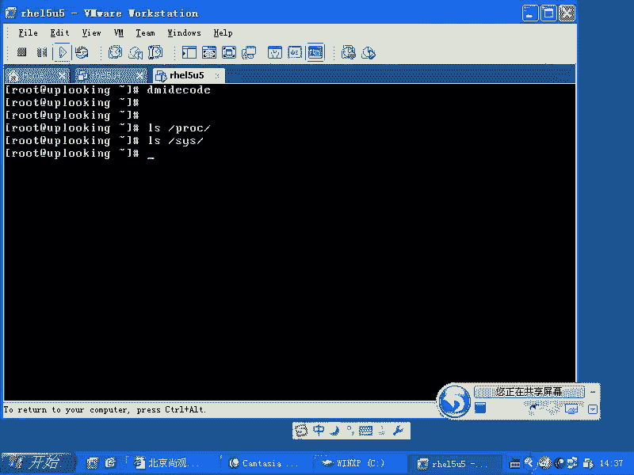

本节课中我们一起学习了`/proc`虚拟文件系统的作用，掌握了通过`/proc/sys`目录和`sysctl`命令动态查看及调整内核参数的方法。我们还回顾了依赖于`/proc`的各类系统监控命令（如`vmstat`, `top`, `ps`等），它们是诊断系统状态、分析性能瓶颈的利器。理解这些工具和概念，是成为一名合格的Linux系统管理员的重要一步。