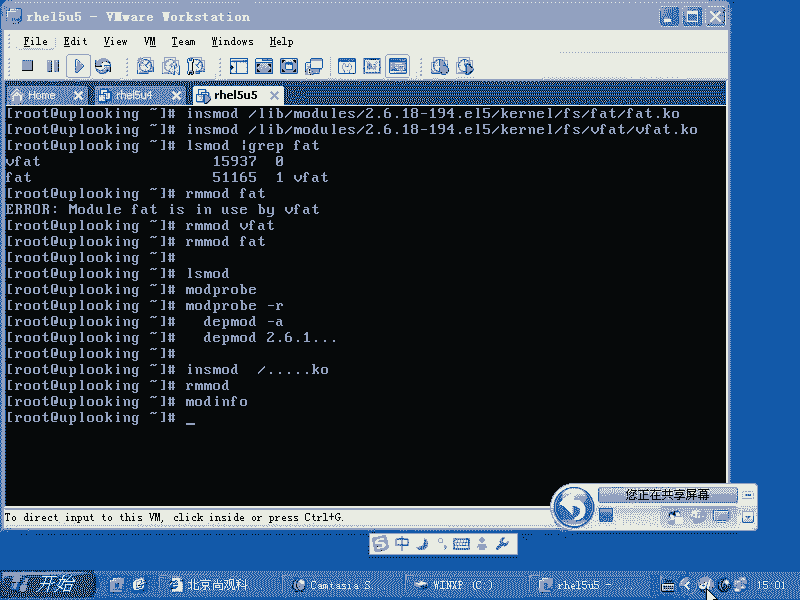
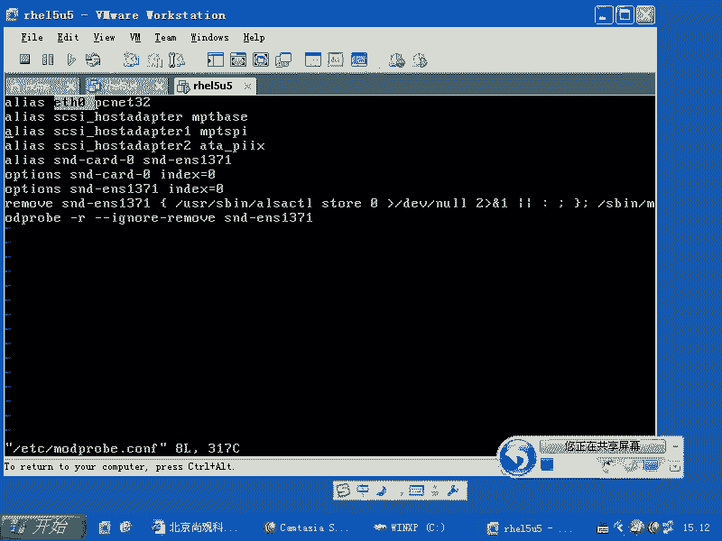
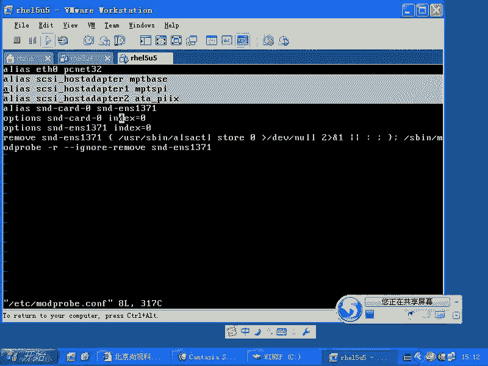
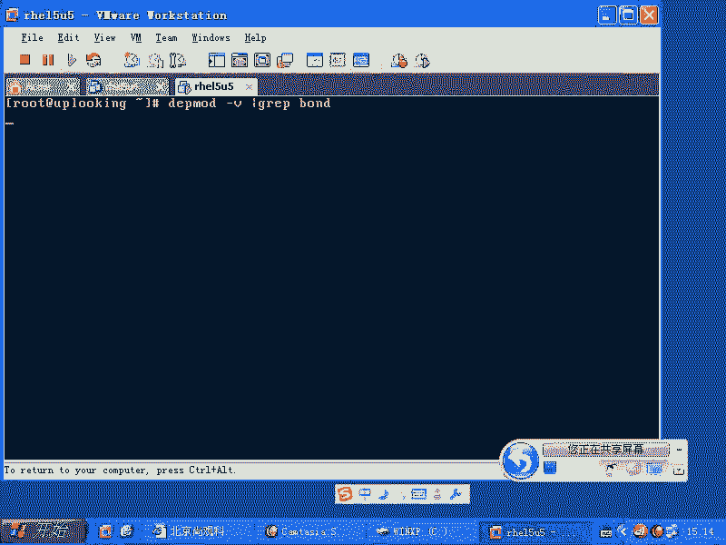
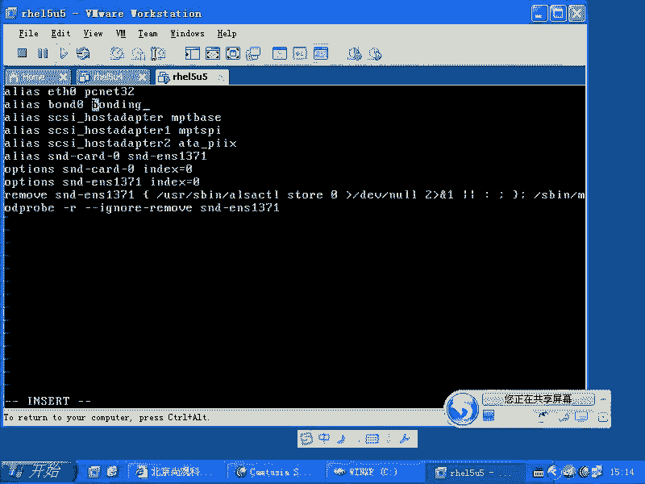
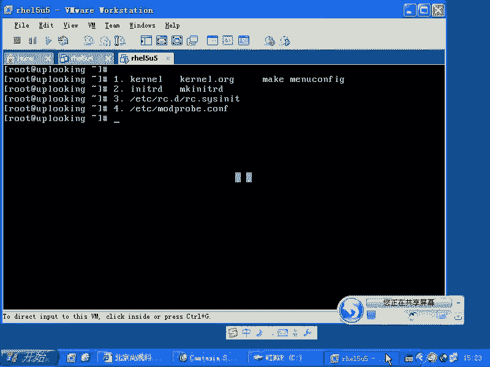
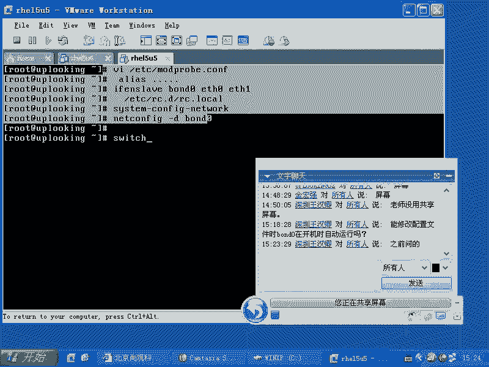

# 尚观Linux视频教程RHCE 精品课程 - P44：RH133-ULE115-5-2-modprobe.conf - 爱笑的程序狗 - BV1ax411o7VD

系。

我们再来看一下，这回看一下什么呢？看一下我们的这个。就是说这个模块完了以后的话，我们来看一下，就是当我们想去把内核模块的话呢去加载的时候，我们知道用这个命令。但是一般咱们操作的时候。

是不是没有加载过内核模块？你看你们用了那个可能用了很久是吧？哎，我一拍大腿。😡，我怎么没有加载过呢？😡，是吧为什么没有加载过呢？😡，🤧咳。3。到四个地方可以帮你自动加载内核模块啊。

第一就是说你的内核模块，大家知道所有的驱动程序啊，所有的这个系统当中的驱动程序除了图形的驱动程序，多数都是什么内核模块，知道吧？所以边驱动和边应用是不是不一样，边应用程序的话。

就说我从头写一个什么hello word是不可以是不是？然后呢，但是我在内核里面去写个hello word，是不是我已经写好了一个很长很长的程序了，你把你的hello word加在这个里面，对不对？

所以的话写内核一般要比写什么写那个应用程序的话，要稍微麻烦一点，明白这个意思了吧？明白了，那么我们现在的话呢要写一个内核的模块，然后要把它加载起来，那么我们加载的方式的话呢，跟普通的执行程序就不一样。

普通的程序我们直接输入命令，一回车就完事了，是吧？但是在这里面的话呢，我们有加载了很多地方。第一种啊，就是我们这个内核模块，它的话呢呃有一般的话呢是有好几种加加载方法。😊，第一的话呢就是在嗑肉当中。

我本身这个驱动程序就是在克勒当中啊，你可以看一眼这个。😡，看一眼叫做D message。我们是不是给大家说过内核的日志是不是就D messageage来看，它实际上是一个buffer，是一个缓存。

我们看一眼，你看到这个前面啊。😊，这样的D message加上一个什么呢more是吧？你看前面前面的话呢，内核被加载的这个时候的情况的话呢，都有内核被加载了。加载完了以后的话呢。

他查看到了内存当中的bios已经给你放好的这个信息的位置，是吧？bios的话呢，他已经帮你把这个信息拿出来了。然后内核的话呢，看到哦，我总共有这么多的这个内存，对不对？开始内存初始化。😊。

触发完了以后的话呢，开始驱动CPU是不是发现SMSMP啊SMP的话是什么？😊，是啊。对称多处理器。啊，对称多处理器。比方说发现S呃SMP的这个呃这个就是说这个MP多处理器的表，对不对？

这是不是CPU在处始化？😊，是不是嗯那么其实这个东西就是CPU的驱动了。是不是CPU的驱动进同调度这些东西，就是CPU的驱动啊。那么这时候的话呢，他开始发发现这些内容，然后呢，再开始看什么呢？

ACPI是不是我们原来说的高级控制电源接口，是不是？然后呢，再有什么呢？再有像什么呢？PCI总线啊，呃，不如说SE那个。😊，啊。SED还有conil就是控制台，是不是控制台这样初始化。

这些这个是不是驱动程序啊？是吧SEn然后我们再看下面啊。😊，PCI的驱动是不是出来了？在PCI总线上，在PCI总线上开始找内容呃，开始找东西了。你方说又找到什么呢？USB的这个call是吧？

USB核心是不是？😊，是不是这些程序是不是都是驱动程序啊？是。那我没加载过，没有音色的mo子过，那他怎么在面？在你编译内核的时候用明白了吧？嗯，这周我想告诉大家的啊，就是你能看得到这个内容。

也就第一部分。😊，l当中 kernell当中的话，你要重新编译内核，你要下载下来什么呢？内核的语代码内核的话语源代码在哪个地方？😊，克点ORG下载回来以后的话呢，一般要编译。

编译的话呢就是说我们有一套编译内核的过程，是不是啊？那这个过程的话呢要要讲的话呢，至少要。一个小时左右啊，我们到时候给大家一套视频，让大家看一眼啊。对，编内核的话呢，在HC考试的时候是不需要考。

不需要考，因为他呢太麻烦。而且现在编缘内核的话呢，不算太难啊，从这边下载过来内核以后的话呢，再去这个make。😊，Make。呃，manual configurefi。

make metal config或者make卡 K config或者make机 config的时候，你可以进行配置。说我要把USB的那个call驱动并到内核当中。当它大家看到了有。😊。

看到那个信息了吧？嗯那个那个驱动就被编编成什么呢？编到内核当中了。原来那是单独的一个模块。但是刚才有位同学问的好，他说所有的驱动程序都可以编译到内核当中吗？不是的，有些一定要编译成内核模块。

就是点QO的模块，明白吧？有些是有些是可以编译啊，然后呢，第一点是这个蝌蚪，是不是？第二的话呢，我们在前面讲的时候，我们跟大家讲鸡生蛋蛋生鸡的时候，是不是告诉过大家。

你现在有个sic卡卡上面的一个s的硬盘，是不是？那这个时候的话呢呃对啊，你要把这个系统装在这个硬盘上，那你就先要驱动sic卡，是不是s卡的驱动又在什么硬盘上。那你这不是转不出来了吗？

所以我们找了一种机制，你要么把这个s的驱动啊，编到哪呢？编到 kernelel当中去，是不是？但是你重新编译内核的过程又很长，是不是？然后呢，你可以怎么样呢？你可以在makeIITRD是吧？

做一个内存磁盘，对不对？而内存磁盘的话，就是什么？😊，就是我们的一个内核加载完以后，直接在内存当中就能找到的什么内核模块的地方，我不需要到硬盘上去找，对不对？嗯，这是这个地方。所以这第二个地方。

第三个地方加载驱动的是哪呢？就是我们的ETC线的RC点D当中的什么呢？RC点，也就是你现在用LS node看到的那些东西，百分之八九十都是来自于那个地方。😊，李亚吧。那么于是的话呢。

这时候我们理所应当的话呢有一个问题。诶。😮，系统这个机制不合理啊，为什么不合理呢？我shall编程又不会，对不对？我sell编程，我用winux系统一定要会编sll编程吗？是不是一定要会撤要赔成？

不是啊，你一拍大腿不对呀，我都用了半年了是吧？需要编程我一直都是什么，心中永远的痛是吧？结果我照样用的还不错呀。所以系统的机制啊就是说它在用的时候不会让你怎么样。

不会让你一定要属于需要编程才能改这个脚本，是不是不一不用，所以它可以给你准备出一个配置文件来。这个配置文件可以让你什么呢？自己手动去改改完了以后的话呢，它还生效。所以这个文件叫什么呢？

就是我们的常见的装驱动的这个文件，就是ETC下的什么modode pro。😊，mpro点com啊，这个文件的话呢，就是我们一般放跟启动无关的驱动。跟启动无关的驱动，典型的就是什么呢？

声卡驱动和什么网卡驱动。这两个驱动的话呢，一般都会放在这里。明白了吧。那么跟启动相关的驱动呢？跟启动相关的驱动发展呢。内核或者内核D对内核或者IITRD。所以的话呢这里面的话呢是放跟启动无关的驱动。

比方说USB的驱动，或者说什么呢声卡驱动或者网卡的驱动，对吧？常见都放在这里面。那么这个文件的话呢，是被RC点C去加载。😊，RRC点snet里面有个命令叫做mpro杠A。😊，好像的岗位我记不太清楚。

你可以去筛选一下。GREP是吧，mod的。pro是不是空格杠是不是我们用用单引号引起来，是不是单引号引起来，引起来以后的话呢，加上一个什么ETC项目的。😊，RC点D当中的RC点s image。

呀你杠没有。那就mpro吧，咱们看看mpro的话，它是怎么加载的。这边的话是加载的这些驱动是吧？我还没找到。就是说我这个的话呢可以详细的再找一下，有可能是什么呢？

他把这个monpro命令是不是变成了一个变量是吧？然后执行那个变量。对吧嗯有可能这样，但是我记得的话呢是在这个里面的话呢，会去调用mod呃modpro点com。

但是你整个搜索modpro点com在这个文件里面你搜索不到。哎，那mpro点com到底是谁调鱼？它是通过mpro的一个参数，就跟那个mount那个一样。你在这里面去搜索FS table啊，也搜索不到。

但是呢它是通过mount子杠A调。BTC下的FS table明白吧？嗯它是这样方式。但是大家的话呢要知道我刚才写的这四点啊，在这里面就是什么？在这个位置它去调用modpro啊，我们再看这个文件。

详细的看一眼。VIETC下的morepro啊点com。打开这个以后的话呢，你看。给这个模块起个名字叫做什么呢？ETH0。这就是ETH0的由来，是不是我们给一个内核的一个网卡驱动。

起了一个别名叫什么ETH0。如果你有2块网卡，有个ETH0，有1个ETH1是吧？哎，他怎么我想让这个叫ETH0，那个叫ETH1，那你就把那个名字改一下。

，把的名字改一下，在这里面改一下一下，它这边还加载了什么呢？sac的驱动啊，但是呢这边加载s驱动的话呢，是比方说你本身的话，那个机器已经启动起来以后，还有块s卡，它是放数据的，就是跟启动没有关系的。

跟分区不在上面，那它会在这边加载一个驱动，明白了吧？😊。

然后呢，还有就是声卡看到声卡了吗？😡，看到了吧。那么我们有的时候的话呢用到了这个就是网卡的叫做什么呢？帮定功能，就是绑凳绑绑定功能。就是我们可以把两个网卡绑定成什么呢？一个网卡用。

也就是两个千兆网卡绑在一块，就是2000兆是不是？嗯那这个帮定的话呢，它是怎么用呢？它是这样的，它首先的话呢是。AS是吧。帮的零是吧？是不是有这样的一个驱动啊，我看一眼我看一眼啊，我总是不确定是吧。

为什么不确定呢？因为需要记忆的东西太多了，是不是？那么我在这边，但是我找到了一种什么呢？寻求帮助的方法。那我这样的。😊，DEP mode是不是显示所有的内核模块啊啊，不是。

就是他会帮我搜索所有的内核模块是吧？那我如果直接回车的话，他会帮我去注册所有的内核模块。但是我这边加上个杠V的话，就是说他把这个所有的内核模块给显示出来。😊，我加了个GREP。BOND。

我看有没有这样的一个内核模块啊。

也就是这个地方。有没有啊帮顶点扣KO看到了吗？我是不是找到这个内核模块的名字了？😊，那么我在这边boundunding，这是它的这个内核模块的名字是吧？表示我要加载这个内核模块，加载完了以后的话。

给它起名叫做什么？😊。

放的零是吧？然后呢，这个地方的话呢，我们可以加上一个什么？这边就是非常多的时候要用到啊，大家一定要注意，就是HC考试不会考。但是呢你工作的时候可能会用到，你要输入一个什么呢？输入一个option。😊。

options是吧，然后呢加上一个什么呢？😊，当棒的零加载的时候，那么加载这个内核加载它的时候的话呢，有几个呃就是说这个几个参数你要设定，一个是什么呢？modode。等于多少？modode等于0的话呢。

表示着我我记不太清楚，大家可以看它的regme文件，放的等于零的时候，它会怎么样呢？它会是以负载均衡的方式的话呢去去去用。也就是说一个网卡是1000兆，两个网卡2000兆是吧？我2000兆。

这两块网卡都一块去用我给办了零兆榜，一个IP也就是这2块网卡上是一个IP地址，是不是？那么这样它的寸储能力就加强了是吧？还有个modode等于一modode等于一的话呢，就是高可用方式。

也就是当我侦测到一个机器，它的这个链路啊断掉了以后，它会再怎么样呢？再去。启动另外一个链路，明白吧？这样的话呢就是高可用方式。所以它这个模式的话呢，到时候大家可以去查出来。

也就是通过option这个地方的话呢，可以加载某一个模块的时候，给它传递什么参数？这是常见的用法，知道吧？所以这边是典型的一个。那你这边做完了以后啊，就是我这边就不保存了，因为我只有一个网卡。

我如要是做完了以后，我可以输入一个什么呢？输入一个呃。😊，RFin啊。slaveRF in slave这个命令的话呢，可以把放在零上绑两个什么？一T之1一TH之1都绑在棒到0上，明白吧？

也就是说我一定要怎么样呢？改完那个文件了以后是吧，就成功了吗？没有你还需要运行这个命令。这个命令的话，你看。就这样。似乎是这样的啊，因为因为我现在两个有有一块网卡，但是没有第二块网卡。

所以的话呢用起来可能呃不方便。没有加载那个模块，当我把那个模块加载上去以后的话呢，就就是可以这样用。也就是说我在那边加载了这个模块以后，输入这个命令的以后才能真正去生效，是不是？然后呢。

我还可以再把ETH1再加载上来。你有4块网卡的话呢，把4个网卡全部都绑成什么呢？ETH呃棒的0都可以，就一个命令，一个命令这样去加，或者是把它们加到后面ETH1ETH2ETH3明白吧？

加载完了以后的话呢，这4个网卡就不能独立用了。你一旦运行完这个命令以后，你再去用它们去拼，拼不通了。😊，必须要怎么样呢？给棒的0整个来加一个IP地址。人家访问这个IP地址之后，就访问到什么？

访问这4个网卡，明白吧？四个网卡。但是同时的话条件还是什么呢？在你的交换机上要什么呢？要设置一下，比如你的交换机要支持什么？就是多链路是吧？嗯，多链路要设置你的交换机。这样的话呢，这个模式的话就成功了。

因为有很多人他愿意用。你现在见过万兆以太网吗？10万兆以太网。这些倒是都有啊都有。但是呢万兆以太王肯定是光纤。肯定是光纤。所以的话呢你要想把这个网网卡的这个速度的话呢，提上去。比方说你这个机器的话呢。

是一个做maask存存储。希望别人的话呢访问的时候在网络上没有瓶颈，这时候你可能就要多链路，是不是让多个网卡同时的话提供服务，同时设置这个交换机。那么我们现在看到的这个。呃。

RF呃in slavelave。这个命令的话呢，每一次启动的时候都要运行。那么我应该把它放在哪？就是刚才你看我想设置多电路的时候，我首先改的是什么文件，改的这个文件是不是改的这个文件的话。

就是加了个A是吧？😊，是不是啊？然后呢，我又运行了IF这个命令，是不是ETHE那么这个命令是我执行的，下次启动的时候生效不生效。互生一下是吧？所以我应该把这个文这个命令放在哪儿呢？😡，对。

ETC下的RC点D当中的RC点。Local。对不对？然后呢再去怎么样呢设置它的IP地址，怎么去设置呢？你给输入一个system。😊，呃，system杠confi杠。

network是吧也可以加上一个什么呢？TUY啊，就是TUI啊，也可以加TUY这样直接回车也可以。然后呢，把bound0的话呢，设置1个IP地址。下面以前的话呢，我不知道现在有没有啊。

以前的话我们用的最多的就是net confi是吧？用net用最多net confi加上一个什么呢？杠D啊，bound0，也就是说如果你有net config的话呢，用这个命令也可以。如果你没有的话呢。

就用这个命令，然后给它加1个IP地址。😊，起火。这个多链路就可以了，在你的迹算上就可以了。然后剩下的话就是配置什么配置那个switch。😊，对吧把switch的多链路，然后呢这个功能化配起来。

明白了没有？明白，我们由这个模块，然后呢到加载模块的四种方式是吧？然后再给大家找到了一个例子，是不是这个例子的话呢，就是网卡的多链路，它需要用到这个驱动，怎么去加载驱动这个过程的话给大家说了。然后呢。

加载驱动的时候，是不是还可以加载什么？这个驱动时候的这个选项是不是options，是不是offs那个modode模式到底是高可用模式还是什么呢？还是。复载均融方式是吧？那么你可以在那个地方去设置。

这就是典型的一个例子。听楚了没有？那么我们还有什么呢？还有一些就说这个呃用法。那么像我们想去。呃，想去把这个。就是说比方说你现在的话呢，有我我这个就是用过的啊，用过的。原来的话呢他们。

用装就是在lin下装的oracle，然后呢，他们找了两台机器啊，两台做rack，做那个呃高可用，呃，就不是高可用re就是real application class是吧？就是oracle那个集群。

两台机器要访问同一个什么呢？同一个存储，是不是？那么他们每一个机器的话呢，有2块HBA卡，2块光纤的HBA卡HBA卡就是访问那个光纤存储的那个HBA卡，这2个HBA卡的话。

他要求每一个的话是两2G还是4G啊，当时我记得买的是2G的，现在都是4G的是吧？但是他们想用2G实现4G的通路。那么就是2个HBA卡绑成什么呢？绑成。负载均衡方式啊负载均衡方式。

它跟这个网卡是非常类似的。那么当时的话惠普给的驱动，他就告诉你，你要在modpro里面这样配，这样配完了以后就是什么负载均衡方式。但是那个的话就不涉及到什么啊什么ERF什么inin之类的东西。一样吧。

明白了吗？就是说你用的机会是很很多的。像HBA卡，他想合并这个呃容量时候，它也有它自己的驱动，不是不用棒的了，不是用棒的零了是吧？他是用它自己的这个参数，但是也是要改这个文件，你们清楚了吧？啊。

改改哪个文件呢？就是说modpro点com，是不是？然后options加载这个驱动时候要加什么什么选项，明白了吧？好，那么这边的话呢就是我们的这个呃内核模块这个操作啊。

那么如果要是你想去定制IITRD的话，我们已经给大家讲过了是吧？用makeIITRD来去定制，是不是？其实IITRD的话呢，是一个压缩的一个包。你把它解开了以后，你能看到里面的东西啊。

能修改配置文件时，fo0在开机时自动运行。就是我就是刚才跟大家说的，就是你要首先要改什么呢？modultpro是吧，mpro点com是不是？

就是像刚才这样的morepro点com加上这样一行AS什么什么东西，对吧？我刚才给大家演示的，然后呢再用R呃if en slave这样的方式的话呢，去加把两个以太网卡加到一个b0里面去，是吧？

如果你想系统每次启动时候自动做，那你就怎么样呢？你就添把这个命令添加到这个文件里面，是不是？添到这个文件里面以后。😊，b的零是有了，但是呢它还没有配IP地址是吧？

那么你应该怎么用net config命令给他配IP地址，或者用sstem杠config杠network命令给它配个IP地址。这样的话，每次系统启动时候，它就b的0就自动绑2块网卡就开始用用了，明白吧？

那么如果要是你配置好本机了以后就完事儿了。但是呢需要你的switch的话呢，再去支持打开它的多链路是吧？经过配置就好啊，OK。

好，那么我们这个这这个内容的话就到这儿，还有还有没有问题？还有没有问题？没有问题的话，我们先到这呃，就是说这个呃这块内容的话就先到这儿啊。

