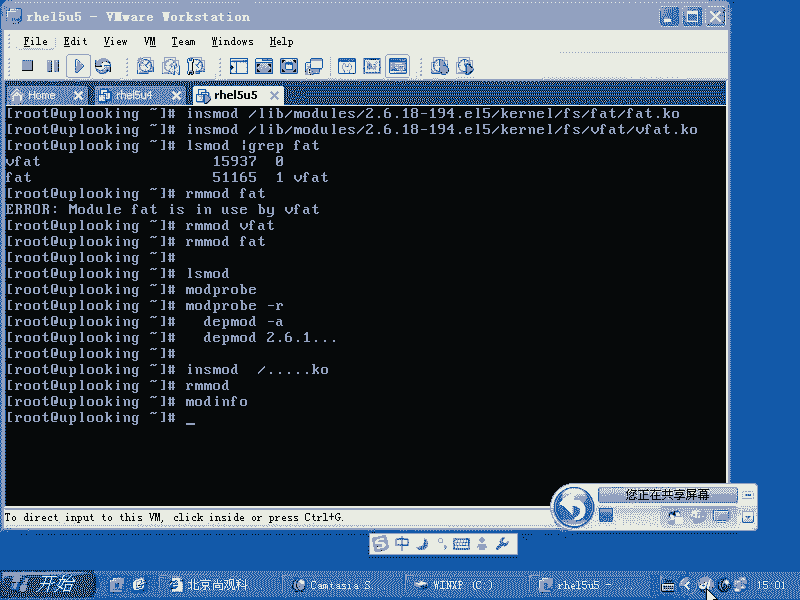
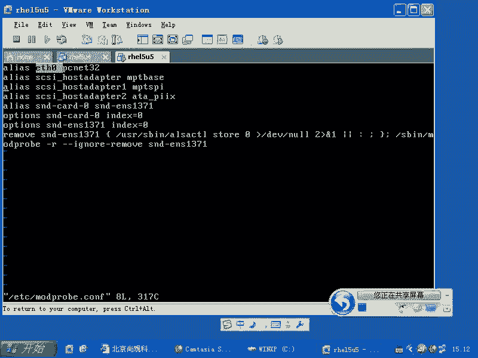
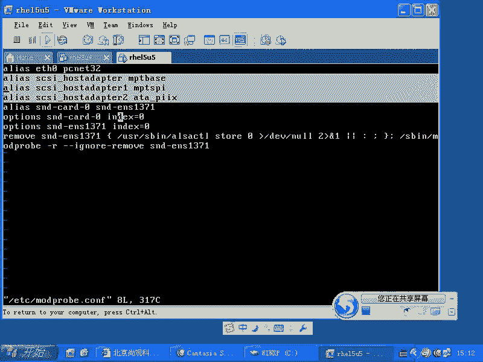
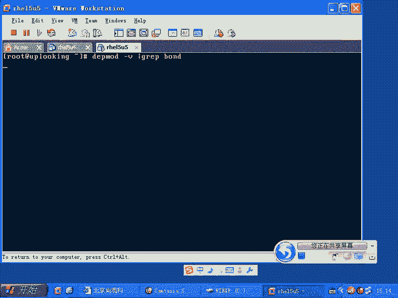
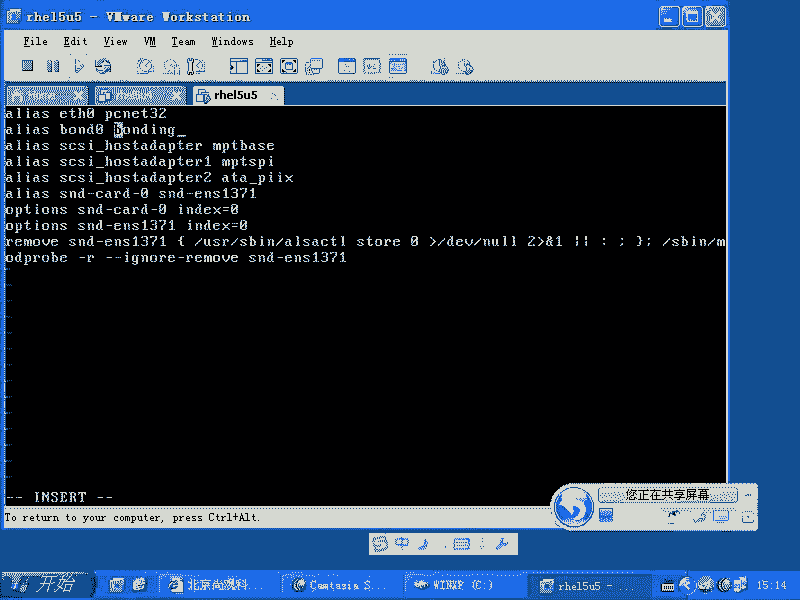
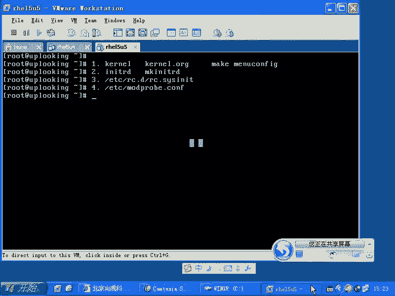
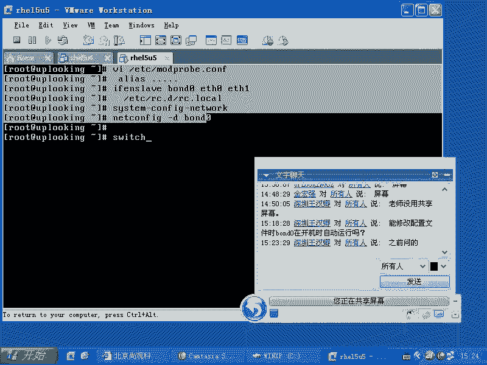
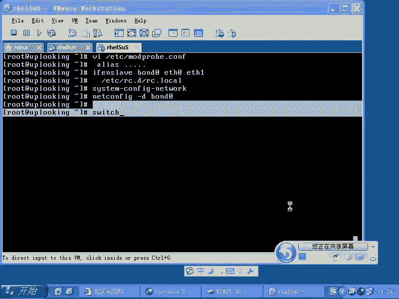

# Linux内核模块管理：P44：RH133-ULE115-5-2-modprobe.conf




## 概述
在本节课中，我们将学习Linux内核模块的加载机制，特别是如何通过配置文件 `/etc/modprobe.conf` 来管理模块。我们将了解系统自动加载模块的几种方式，并通过一个网卡绑定（bonding）的实际例子，演示如何配置和使用这个文件。

## 内核模块的加载方式
上一节我们介绍了内核模块的基本概念。本节中我们来看看系统在何时、以何种方式加载这些模块。通常，我们并不需要手动加载模块，这是因为系统提供了多种自动加载机制。

以下是内核模块的四种主要加载方式：

1.  **编译进内核**：在内核编译阶段，可以将驱动程序直接编译进内核镜像。这样，系统启动时，这些驱动会随内核一同加载。查看 `/var/log/dmesg` 日志，可以看到内核启动时加载的各种驱动信息，例如CPU、PCI总线、USB核心等。
2.  **初始内存磁盘**：对于启动时必须的驱动（如SCSI卡驱动），可以将其放入 `initrd` 或 `initramfs` 镜像中。内核启动后，会先在内存中加载这个镜像，从而获得必要的驱动来挂载根文件系统。
3.  **系统启动脚本**：系统服务启动脚本（位于 `/etc/rc.d/rc*.d/` 目录）会在启动过程中加载许多模块。这些脚本通常由系统管理员或软件包安装程序配置。
4.  **`/etc/modprobe.conf` 配置文件**：这是管理非关键启动驱动的主要方式。系统服务（如 `rc.sysinit`）会调用 `modprobe -a` 命令来加载此文件中配置的模块。典型的例子包括声卡驱动和网卡驱动。

## 详解 `/etc/modprobe.conf` 配置文件
上一节我们了解了模块加载的几种途径，本节我们重点看看如何通过配置文件进行管理。`/etc/modprobe.conf` 文件允许用户以声明式的方式配置模块，无需编写复杂的Shell脚本。

该文件的基本语法是为模块指定别名或加载选项。例如，系统为第一块网卡驱动赋予别名 `eth0`：

```bash
alias eth0 e1000
```





这行配置表示，当系统需要 `eth0` 设备时，会自动加载 `e1000` 这个内核模块。





## 实战案例：配置网卡绑定（Bonding）
为了更直观地理解 `modprobe.conf` 的用途，我们来看一个高级网络配置的例子——网卡绑定（Bonding）。网卡绑定可以将多块物理网卡虚拟成一块逻辑网卡，以实现负载均衡或高可用。

以下是配置网卡绑定的步骤：

1.  **确认绑定模块**：首先，需要确认系统是否存在 `bonding` 内核模块。
    ```bash
    modprobe -v | grep bond
    ```
    如果看到 `bonding.ko`，则表示支持此功能。

2.  **编辑配置文件**：在 `/etc/modprobe.conf` 文件中添加配置，加载 `bonding` 模块并为其设置参数。
    ```bash
    alias bond0 bonding
    options bond0 mode=0 miimon=100
    ```
    *   `alias bond0 bonding`：为 `bonding` 模块创建别名 `bond0`。
    *   `options bond0 mode=0 ...`：为 `bond0` 设备设置参数。`mode=0` 表示负载均衡模式，`miimon=100` 表示每100毫秒检查一次链路状态。

3.  **绑定物理网卡**：配置文件生效后，需要在系统启动时执行命令，将物理网卡（如 `eth0`, `eth1`）加入绑定组 `bond0`。可以将这些命令加入 `/etc/rc.d/rc.local` 文件，使其开机自动运行。
    ```bash
    ifenslave bond0 eth0 eth1
    ```

4.  **配置IP地址**：最后，需要为逻辑网卡 `bond0` 配置IP地址，可以使用 `system-config-network` 工具或直接编辑网络配置文件。

5.  **配置网络交换机**：要使负载均衡生效，连接这些网卡的交换机端口也需要配置为聚合（Trunking/LACP）模式。



这个案例不仅适用于网卡，类似的原理也用于配置光纤HBA卡的多路径，以合并带宽或提供冗余。





## 总结
本节课中我们一起学习了Linux内核模块的管理。我们首先了解了系统自动加载内核模块的四种方式：编译进内核、通过initrd加载、由启动脚本加载以及通过 `/etc/modprobe.conf` 配置文件加载。随后，我们深入探讨了 `/etc/modprobe.conf` 文件的结构和语法，并通过配置网卡绑定（Bonding）这一实际案例，完整演示了如何利用该文件加载特定模块、传递参数，并配合启动脚本完成高级功能配置。掌握这些知识，可以帮助你更灵活地管理系统的硬件驱动和网络配置。