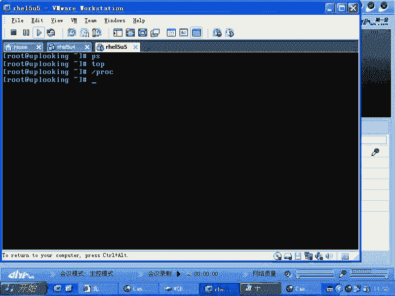
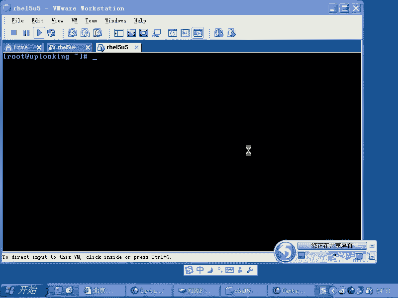
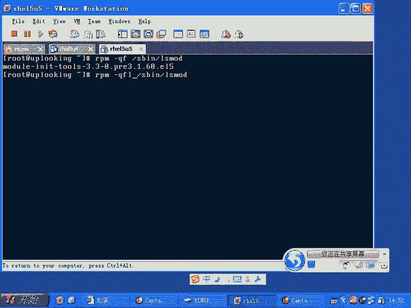
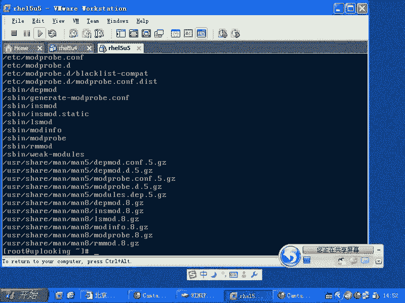
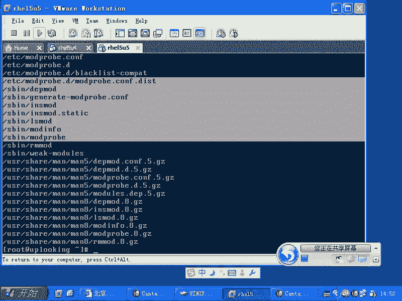
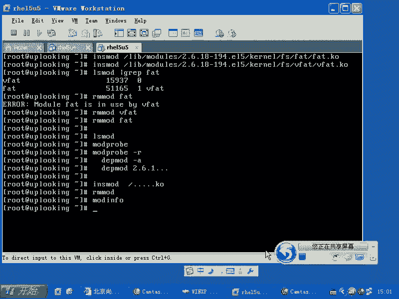

# 尚观Linux视频教程RHCE 精品课程 - P45：RH133-ULE115-5-2-mod-tools - 爱笑的程序狗 - BV1ax411o7VD

那么我们一般来说啊，大家都知道就是在用到这个。这呀天哪。哎呀，谁在骂我？用到这个lininux系统的时候，我们都很容易理解，就是我们打开一个程序，对吧？没有问题。运行一下命令，对不对？没有问题。

但是呢大家很难去理解，就是说这个内核模块到底是什么。内核到底是？现在我举个例子。比方说咱们打一个打开一个大步头的程序，比方说word或者说IE是不是IE里面是不是可以加那个百度的搜索，搜索那个插件是吧。

或者那个工具条是吧？然后你又加了一个什么google的，是不是？那你说。到底有几个程序运行？1个IE运行的是不是一个进程百度的搜索连栏也在里面。那么google的搜索的搜索这个栏也在里面。

还有几个什么迅雷之类的东西全都花花哨哨的全都在里面是吧？那你说到底有几个程序？一个是吧？那有一也有可能是一个也有可能是多个，是不是？但是呢咱们看到的是表象。表象的话呢，咱们确实看到的是一个窗体。

但是实际上实际的话呢会有好多个线程的运行，是不是？我们每加载一个功能的话，很可能就多一个线程。所以的话呢我们打开一个内核以后，这是一个程序，是不是？但是它里面的话呢，可能要完成呃PCI总线的这个驱动。

是不是还有USB的驱动，是不是还有其他驱动？这个时候的话呢，它整个这个空间里面可能是按照一定的模式啊，就是它有规范的。然后呢，在那个内核里面去注册一个模块，但是呢整体看来的话是一个什么大的进程。

所谓的进程的话，就是说这个进程它是占有CPU要执行任务的，是不是？那么我们都知道用PS命令可以看得到，是不是？然后呢，还可以用什么呢？top命令等等，都可以看得到。在PROC文件系统下是吧？

有那种以数字开头呃数字命名的文件夹，这里面都是每个进程的信息，是不是每一个进程的话呢，它要有独立的内存空间，从哪个地方开始从哪个地方结束，然后呢，互相之间是不能访问的。如果能访问，那就变成什么呢？😊。

变成share code，就是说缓冲溢出了，对吧？所以的话呢这就是进程。但是呢我这个进程想去执行两个任务的时候，该怎么办？一个进程执行两个任务。这时候的话，我是不是要求CPU按照我两条代码练的话来执行。

是不是？嗯那这时候的话可能就用到了多线程。是不是？所以我们把这个内核的话呢，看成是一个大的可执行文件以后，那么我们可以把它额外的部分一点点往里面去添加啊。那么如果要是有一个模块。

它也要始终要求这样有CPU，那就是一个什么内核线程。对吧但是对我们来说看到的时候就是一个整体，对不对？所以他呢我们现在要把内核怎么样去加模块减模块，它这个机制是什么？告诉大家告诉清楚，明白吧？

OK那么你可以知道啊。

刚才没有操作啊刚才没有操作那个OK我们现在话呢开始。😊。

看一下有关内核的所有的操作啊，有关内核模块的所有操作都是在一个目录呃一个文件当中呃，一个文件一个包当中啊，QF比方说我们的S并且的LS mode，这是一个命令是吧？叫做mododeIIT to这个包。

😊，这个包有哪些文件，还记不记得我告诉过大家还记不记得我告诉过大家怎么样去触类旁通呢？还记不记得？我们应该怎么样看这个包里面拥有的其他的文件呢？RPM命令。用哪个用哪个。QL是不是？然后呢。

我们可以这样的，那么QF什么？😊，加上1个L，是不是？这样的话呢，这个文件对应的这一系列包里面的其他文件是不是全都显示出来？讲到这儿啊。如果你们的linux这个恐惧心理已经没有。

或者说陌生的感觉已经没有了话，那么你们基本上就可以自己学下去了。

你说是不是？你看啊。有这么多文件是吧？这些在SB目录下的这些文件，你们是不是可以寻求到帮助啊？😡。

一下都全都学会了。对不对？你像没有人教我的时候，我要怎么做，我就要这样做。是不是？那么我的话呢，那我的作用是什么呢？就是我告诉大家一个方法，但是呢我还得给大家再继续讲的，就说哎，你们自己看去吧。😡。

其实的话呢，如果你在公司里面工作的时候，就没有办法的时候，也就这样了，你就开始自己吭哧吭哧了，是吧？但是呢如果要是我在这边的话，我要给大家更高效的学习是吧？

所以就要我把我的这个思维过程或者已经看的过程跟大家再多说一说是吧？这样的话呢，你就学的更快啊，OK那么我们说LS mode，那么它可以列出所有已经加载内何模块，然后呢，你要想加载某一个模块的话。

可以用什么呢？mod。😊，probing啊mopro以前的话是用INSMOD就是iner mode。但是那种方法的话呢，太生硬啊，太生猛了。它怎么样呢？特别。特别的粗鲁啊，他经常有些问题的话。

他不会去处理。所以modpro的话呢就是比较温柔是吧？说哎把模块加到内存当中去，是不是哎，不行，是不是不行，他不是告诉你不行，是吧哦。啊，不行，为什么不行呢？它依存于其他的两个模块啊。

那我把你其他的模块也加载上去吧，这就是modpro是吧？INMOD的话，就是管你三七二1上不去，然后我就告诉你多错就完事了，是不是？所以的话呢就是mpropro要想加载一个内存内存模块。

比方说我们说的USB是吧？杠tor。是不是那这样的话呢，这个内核模块的话就加加载上去了，就加载上去了啊，我们可以加载一个什么呢？mopro，比方说啊81339。哎，我看啊。算了，V fight啊。😡。

Vfi这个模块的话是非常好玩的啊，我们先我们先这样的，我先这个命令，我先不执行，先运行个什么呢？呃，先ctrl加C啊，我这样的LSMOD我们看一下Vfi有没有加载上去。😊，没有是吧，然后呢。

我这样的modpro。😡，Vfi是不是我加一回车，然后呢再去看。😊，是不是自动加载了两个模块？对吧哎，我怎么加载一个，他怎么帮我加载两个呢？因为Vfi是一存以fin。是不是？fa是什么呀？😡，胖是吧。

是不是他。开玩笑，就是windows的那个fin16文件系统是吧？Vfi时fin32是吧？😊，所以你要加载U盘的时候，通常会加载这个。驱动程序。那这边举一个例子，那我们看一下他们的区别啊。

现在的话呢我RMMOD。可以删除，也可以用什么呢？mod的。proby杠R啊V fight。mopro比杠RV fight。那这样的话呢，它自动把相关的两个模块全部都什么删除掉了，是不是？

那么我们来看一个生猛的啊，生猛的就是INSMOD是不是INSMODV fight。😊，他说耶。啊，你必须得加，就是说必须得输入完整的文件名。他们这些模块啊，你看modpro你只要告诉名字。

它就自己去找了，是不是？因为它有个注册文件。但是呢ISMOD的话，它不管这个注册文件，它就必须得加载这个模块的这个呃就是就是目录啊，这也是好事，什么好事呢？比方说我们讲过。

如果你买了惠普公司的一个呃小型机是吧？或者说这个服务器，它给你配这一张光盘，这光盘里面有个KO的这个模块是吧？那就是内核模块，这个内核模块并没有注册是吧？它不是系统自带的。

那这时候你只能用ins mode加上这个模块怎么样去加载上去是吧？你要么就怎么样呢？把它copy到系统的这个目录里面来用什么呢？用modpro呃用第一批modode，然后把它注册一下，否则的话呢。

mpro是不能用的，是不是？😊，pro不能用，所以我们就按ins mode。那么所有的内核模块我们都知道放在LRB目录下的。😊，mododeels当中是吧？models目录当中还有个什么呢呃。2。

这个内核版本是吧，科当中的呃driver是吧？😊，哎，sver当中有没有啊，应该是FS啊，文件系统是吧？文件系统当中的wefi。😊，当中的Vfi点KO文件是吧？哦，in mode就要这么麻烦。然后呢。

我们一回车，他还告诉我说什么有错误是吧？他也不管什么错误，他说什么呢？al是吧？😡，再往里面去inser的时候出错了，他告诉我这么多的什么smble是吧？就是说我们的这个符号没有。

实际上就是说这个模块的话呢，它在加载了以后啊，他在加载的时候的话呢，它依它依存于一些系统当中已经有的一些这个功能，这些功能是另外一个模块提供的是吧，他也不知道这个另外这些功能是哪个模块提供的。

他就说这些功能没有。😊，明白了吧？所以他我们不得不怎么样。😡，把这个地方改成什么？如果我知道，那我可以这样的，先把fin加上去是吧？再把什么呢？inside加进去是吧？呃，Vfi加上去。

然后我们再去LSMODfin这两个都在了。这就是什么？它们两个的区别是不是？那么如果要是你不想温柔的把它卸载卸载掉，或者彻底卸载掉，智能的卸载卸载掉。那么智能的卸载掉的话是modpro杠杠R是吧？

那么如果你想自己卸载RMMOD啊wifi。😊，这样回车就可以。那么我现在mod probably fight。这个时候的话，他说这个模块不能被删除啊，那么你要先去把wifi删除掉。

然后再把什么fi删除掉这样。这就是两套命令，是不是两套命令？LSMOD啊，这是列出。然后呢，一个是modpro。然后呢，一个是mod的。prob杠R是不是modpro之所以能智能的去添加删除模块。

是因为什么呢？所有的模块的依存关系和模块的位置全部都被放在了什么呢？一个注册文件里面。这个注册文件是谁帮他放的呢？叫什么呢？DEP mode啊，DP modeDP mode的话呢。

你可以输入1个DP mode然后呢，杠A啊，我忘了可不可以用啊。😊，第一批modode杠A的话呢，就是把所有的系统当中装的所有的那个内核版本。比方说你装了三个内核版本是吧？

他把三个目录下所有的这个内核模块全部都梳理遍，分别注册在三个什么三个文件当中啊，那如果要是你加杠A的话呢，就是所有的。那么第一批mod的话呢。加上内核版本，就2。6点呃。2。6点什么18是吧等等等等。

这样添加上去，就是搞定一个目录就好了。明白了吧？所以的话呢，他们都依存，就是modpro是依存于DP mode产生的那些文件是吧？那么换句话说，如果要是你现在的话呢，想cooffpy一个文件过去。

cooffpy一个新的内核模块过去，你是不是需要输入第一P mode呀？是吧自己输入地 mode来注册一下。那么另外一系列的话就是INMOD还有什么呢？它是点点点点点点。😊，KO的文件啊。

你要把这个路径的话呢输入完全。那么RMMOD那么这是也是删除是吧？也是删除模块。所以的话这就是什么呢？他们之间的这个呃就是两做相同作用是两套人马。那么一个是比比较基层的，另外一个是比较智能的啊。当然了。

你要想看这个模块的信息，你可以用一个命令叫什么mod。in。啊，mod info。这样的话我们就把这个命令的话呢，就大致介绍清楚，介绍清楚了吗？清楚了没有？大俩自己琢磨一下。如果要是想智能的去。

添加in色的模块是吧？映色的模块，那就morepro。智能删除modpro杠R。对吧嗯如果要是想野蛮的去加添加，不想要那么多智能的因素，你自己也能搞得定。你知道这个目你知道这个模内核模块在哪个地方。

你也知道他们的一存关系，是不是，那你就iner mode也没有问题。其实的话modpro它是调用什么iner mode那些方法啊都是差不多的。好，这个地方的话呢，我们先告一段落啊。

就是说内核模块的这相关的命令话呢，跟大家说一下啊，说清楚了。😊。

