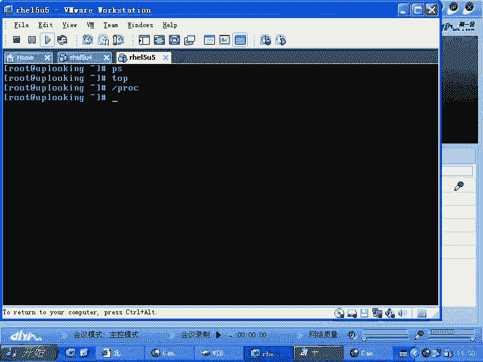
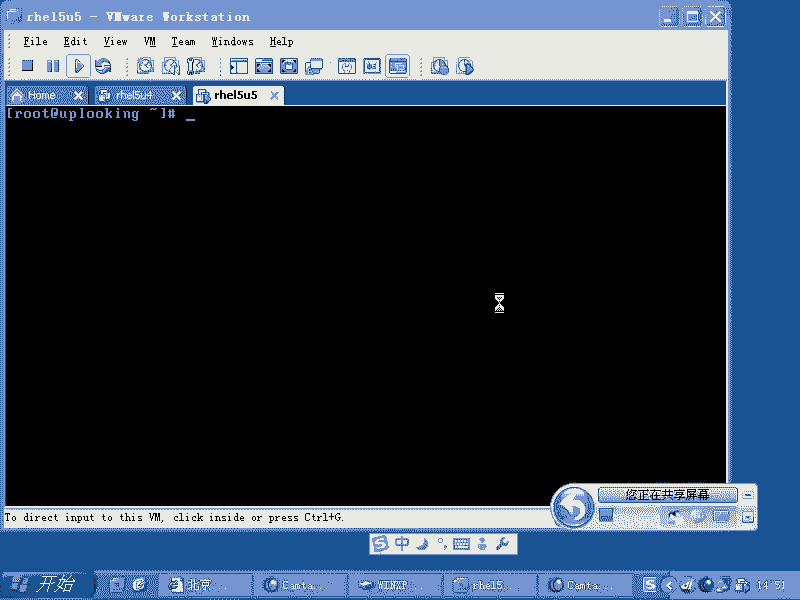
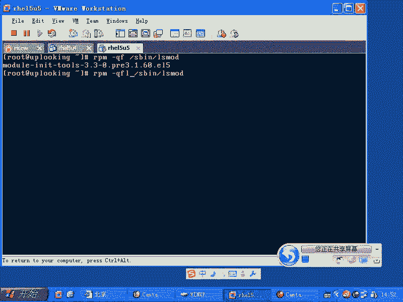
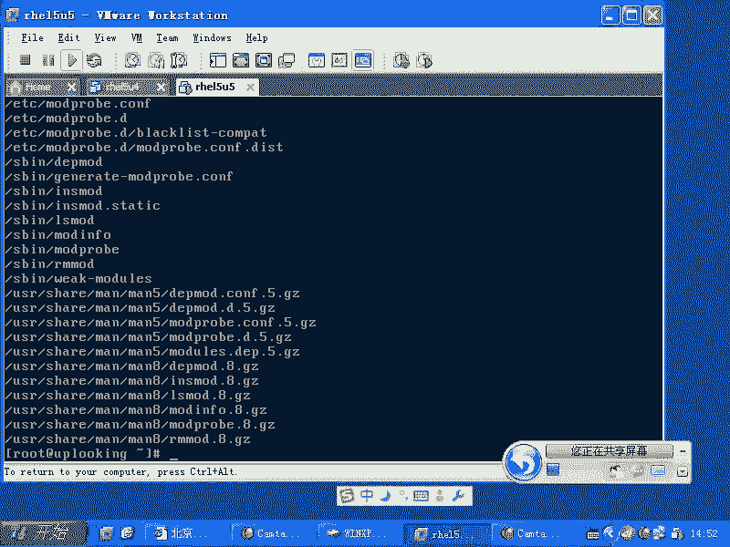
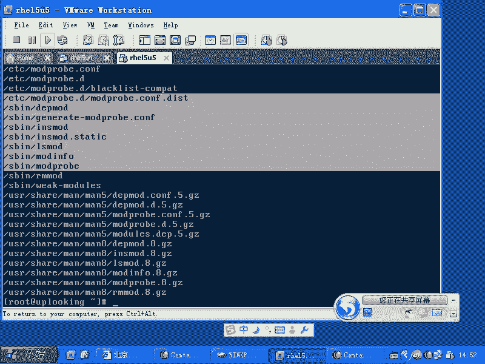
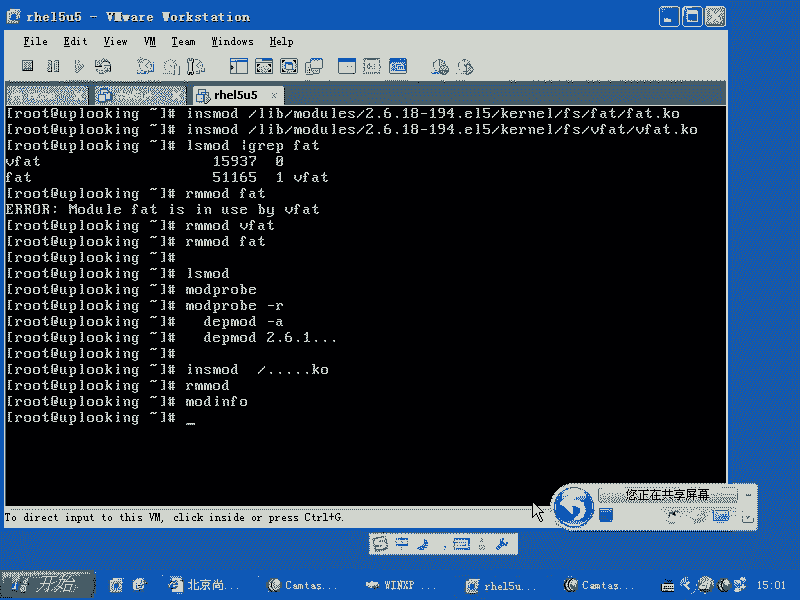

# Linux内核模块管理：P45：RH133-ULE115-5-2-mod-tools 🔧


在本节课中，我们将要学习Linux内核模块的基本概念以及如何管理它们。内核模块是Linux内核的重要组成部分，理解其工作原理和管理方法对于系统管理员至关重要。

## 内核模块的概念

上一节我们介绍了内核模块的基本概念，本节中我们来看看如何具体操作它们。

内核可以看作一个大型的可执行程序。当我们运行一个应用程序时，例如一个浏览器，它可能只是一个进程，但内部可能运行着多个线程来支持不同的功能，如搜索栏、插件等。类似地，Linux内核在运行时，也需要加载各种驱动和功能模块来支持不同的硬件和功能，例如PCI总线驱动、USB驱动等。这些额外的功能组件就是内核模块。

内核模块允许我们在不重新编译整个内核的情况下，动态地向运行中的内核添加或移除功能。每个模块在加载后，会占用独立的内存空间，并通过内核定义的规范进行交互。



## 内核模块管理工具



理解了内核模块是什么之后，接下来我们学习管理它们的工具。所有与内核模块相关的操作命令都包含在 `kmod` 软件包中。

我们可以使用 `rpm` 命令来查看这个包提供的所有工具：





```bash
rpm -ql `rpm -qf /sbin/lsmod`
```



执行上述命令会列出 `kmod` 包安装的所有文件，它们大多位于 `/sbin/` 目录下。掌握这些工具的使用方法，是管理内核模块的基础。

以下是管理内核模块的主要命令及其功能：

*   **`lsmod`**：列出当前已加载的所有内核模块。
*   **`modprobe`**：智能地加载一个内核模块。它会自动解决模块之间的依赖关系，并加载所有必需的模块。
*   **`modprobe -r`**：智能地卸载一个内核模块。同样，它会处理依赖关系，安全地移除模块。
*   **`insmod`**：直接加载一个内核模块文件。此命令比较“生硬”，不会自动处理依赖，需要用户指定完整的模块文件路径。
*   **`rmmod`**：直接卸载一个已加载的内核模块。同样不处理依赖。
*   **`modinfo`**：显示指定内核模块的详细信息。
*   **`depmod`**：生成模块的依赖关系文件，供 `modprobe` 命令使用。当手动向系统添加新模块后，需要运行此命令来更新依赖数据库。

## 命令对比与实践

现在，我们通过一个实例来对比 `modprobe` 和 `insmod` 命令的区别。

假设我们要加载 `vfat` 文件系统模块（用于支持FAT32格式的U盘）。

**使用 `modprobe`（智能方式）：**
```bash
# 1. 查看vfat模块是否已加载
lsmod | grep vfat

# 2. 加载vfat模块
modprobe vfat

# 3. 再次查看，会发现vfat及其依赖的fat模块都被自动加载了
lsmod | grep -E “vfat|fat”

# 4. 智能卸载
modprobe -r vfat
```

**使用 `insmod` / `rmmod`（手动方式）：**
```bash
# 1. 尝试直接加载vfat.ko文件（通常会失败，因为缺少依赖）
insmod /lib/modules/`uname -r`/kernel/fs/vfat/vfat.ko

# 2. 错误信息会提示缺少某些“符号”（即依赖的功能）。因此需要先加载依赖模块fat
insmod /lib/modules/`uname -r`/kernel/fs/fat/fat.ko

# 3. 再次加载vfat模块
insmod /lib/modules/`uname -r`/kernel/fs/vfat/vfat.ko

# 4. 手动卸载时，必须按依赖相反的顺序进行
rmmod vfat
rmmod fat
```

通过对比可以看出，`modprobe` 简化了操作，而 `insmod`/`rmmod` 则提供了更底层的控制。`modprobe` 的智能性依赖于 `depmod` 命令生成的模块依赖关系文件。当你从外部（如硬件厂商提供的光盘）获得一个内核模块（`.ko`文件）并复制到系统目录后，需要运行 `depmod -a` 来更新依赖信息，之后才能用 `modprobe` 加载它。

## 总结



本节课中我们一起学习了Linux内核模块的管理。我们首先了解了内核模块是内核功能的动态扩展组件。然后，我们重点介绍了管理内核模块的两套命令工具：智能便捷的 `modprobe` 系列和底层手动的 `insmod`/`rmmod` 系列。理解它们之间的区别和适用场景，能够帮助我们在不同情况下高效、安全地管理系统的内核功能。记住，`modprobe` 依赖于 `depmod` 生成的依赖数据库，这是实现其“智能”的关键。