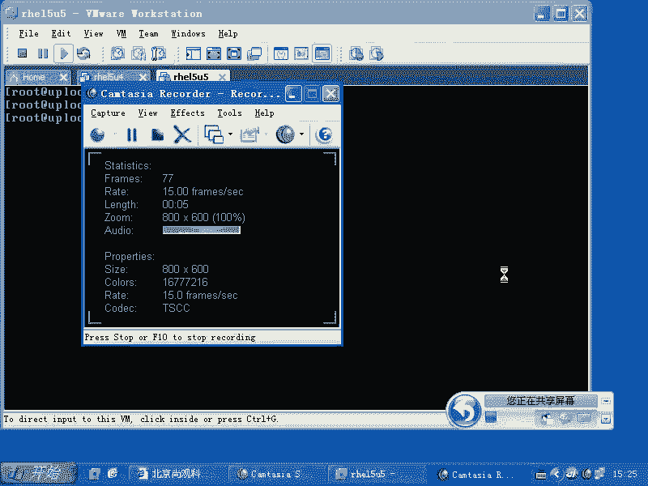
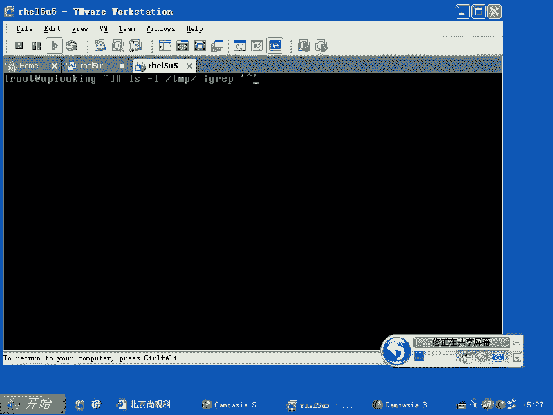
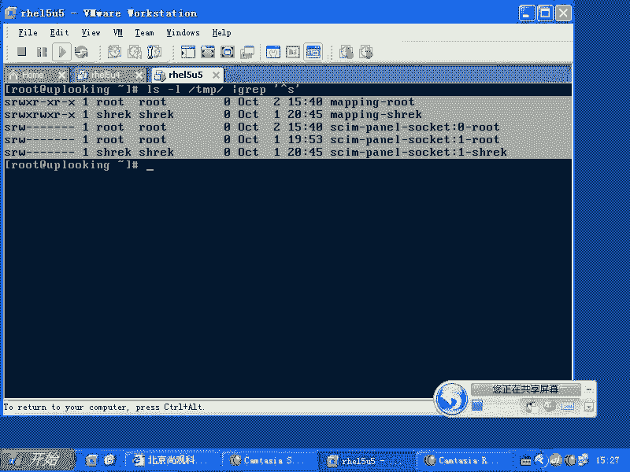
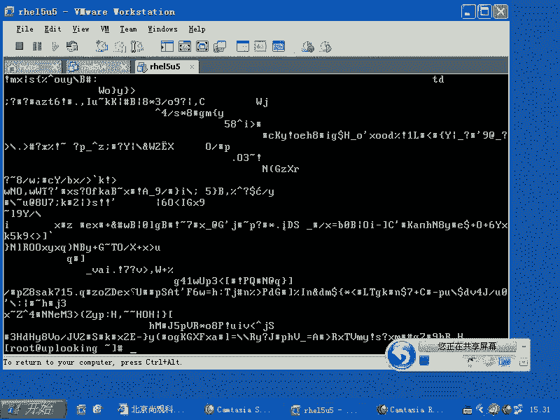
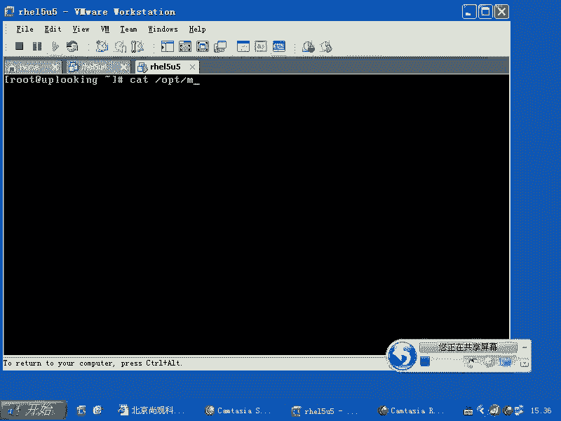
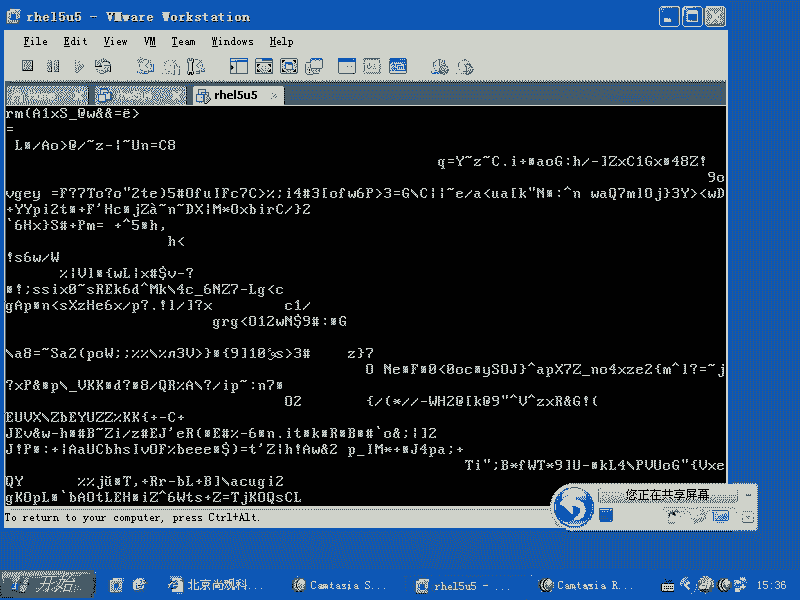
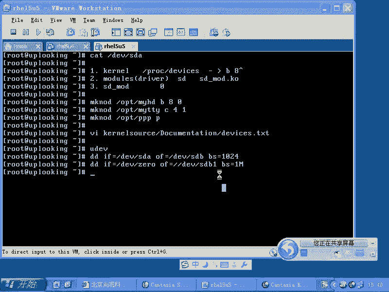
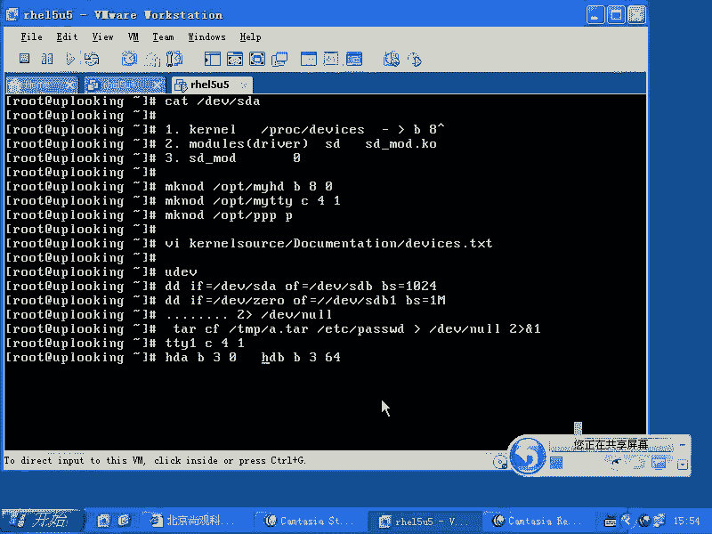

# 尚观Linux视频教程RHCE 精品课程 - P46：RH133-ULE115-5-4-devices-file-dd - 爱笑的程序狗 - BV1ax411o7VD

我们的话呢把这个比较麻烦的地方，就是说设备文件这块的话呢，给大家再来讲一下设备文件是什么东西啊。我们在lininux里面，我们告诉大家一切接文件，是不是一切接文件。其实大家现在已经是有一点这个认识的。

比方说我们给大家看过的就是说PLOC目录下的这些文件，实际上是。

虚拟出来的一些接口是吧？只不过给你提供文件的这种操作而已，对吧？那么你访问他的时候，你不忘它的时候，里面是什么东西都没有。是不是那也就是说这个文件可以假冒。哎，这个文件可以假冒。对不对？那这样的话呢。

我们能不能做出另外一种文件来？这个文件也是假的。但是我们看到它，但是我们访问它的时候，它是另外一些操作。这个的话呢，我们系统当中的话呢，在unux那个地方来一直传到呃linux这边就会有一个传统。

就是什么呢？设备文件这个传统，也就是它是另外一种文件类型。那么我们可以看到啊，在我们LS一个一些一些文件的时候，LS杠L的时候，你可以看到文件前面的话呢会有这个第一个字节是吧？第一个字节的话呢。

一杠这表示什么呢？普通文件。😊，D表示什么呢？目录文件。目录文件是不是？然后呢，还有什么呢？还有CC表示什么呢？字符型设备文件。😊，呃，B的话表示block型设备文件啊。

block型设备文件这两种设备文件。就是我们要讨论的。其实还有一种社备文件叫什么呢？网络设备文件S开头的。S开头的啊，你在那个里面可以看到啊。GRLS杠L。TMP目录下是吧？然后呢看所有文件。

看所有文件的话呢，GREP然后呢以。大家你看啊，以。

S开头的。看到吧？这种sockcket类型的文件。

啊，sockcket类型的文件明白吧？是网络类型的文件。所以呢我们再来看一下什么呢？看一下D一V目录下。😊，有C开头的文件，是不是？还有什么呢？还有B开头的文件。😊，还有B开头的文件。

B开头的是呃是那个block类型，C开头的是character型目设备文件，就是说字符性设备文件，还有S开头的文件，就是sockcket类型的文件是吧？这样的三种设设备文件，明白了吧？

还有什么类型文件呢？还有P类型的文件。管道管道管道类型文件。管道类型文件的话呢，在DV目录下也有啊。看到吧？啊，所以的话呢这四种文件是不刚才都给大家看到过了？这些文件的话呢，它本身是什么？

它本它本身的话呢有文件的类型。但是呢我们的内核，你们想我打开一个文件到底是谁打开的？你看我现在word是吧，打开一个文件，是不是我们感觉好像word打开的，是不是其实呢。其实是谁打开的？其实的话呢。

是你给。操作系统下了一个命令，说什么给我把它打开是吧？操作系统滴滴哒跑过去以后一看，咦，这个是一个B类型的文件是吧？那么我就要用一种B类型的处理方式来处理它，对不对？😡，所以本质上讲。

打开这个文件的时候，不是应用程序，而是谁呀，而是操作系统，明白了吧？所以操作系统的话呢，在打开的时候看到这四种类型，它的处理方式是不一样的。这四种方式的话呢是怎么样？我们说不管S啊S的话呢。

因为是编程时候需要用的。我们配置的机会的话呢比较少是吧？然后呢，P类型的话呢，基本上现在用的是特别少，因为P类型的话是管道咱们现在是不是那个本身的话呢，我们的应用程序可以支持管道操作是吧？

比说我们内核当中可以用不用设备文件来操作管道可以用什么呢？内核直接提供的功能来操作管道是不是不用创建一个管道文件，除非是有特别必要。所以管道类型文件很少啊，那么我们另外一个B和C就是我们讨论的重点。

B和C类型的设备文件的话，我们看一个是什么呢？一个是。最典型的就是SDA另外1个C类型的话呢，就是最典型的就是TTY1啊，这两个问文件的话，一个是B类型，一个是C问C文件类型。B类型文件的话呢。

它在最前面的话呢，会有一个什么主设备号为8，复制设备号为0。也就是本来的话呢，它们是放文件大小的位置是吧？结果它变成了什么？😊，两个数字是吧，两个数字这两个数字代表什么呢？

其实的话呢就是相当于你把它理解成什么呢？我写了一个文件是吧，这个文件是空的是吧？然后我往里面添加两个数两个数字，一个81个0。😊，制度简单，你知道吧？也是这个设备文件，你觉得它。😡，很神秘。

是不是是不是很神秘，很很很沉重，是吧？让人感觉哎这个东西。😊，挺珍贵的。其实的话呢就那么简单，你创建一个文本文件里面的话呢有1个8X个0。但是这个文件肯定不是这么创建啊。我是说大家可以把它想象成这样。

也就是它本身的内容是很少，这个文件的内容很少，只不过是在你去打开它的时候。😊，我们的。操作系统核心处理的方式就不一样了，它是怎么处理的？我们看一下，假设说我们看到SDA是吧，然后呢。

我们这样的cat第EV下的。SD a。那可麻了烦了，是不是我哟，这个转到什么时候都不一定是吧？有空，然后有一些阿斯克码，还有一些二进制，还有一些乱码什么什么东西。这个的话呢搞的是晕头转向。

那么你打开这个文件真的是太神秘了，太神秘了，这个文件太了不得了，不是那么回事，当你去ca它的时候啊，我们的话呢，内核它会去搜寻一个文件。当你ca的时候，第一。😊。

我们的科l，他会去找一个文件。这个文件的话呢是给你以文件的方式显示，实际上是内存当中的一个什么一个表。这个表是什么呢？就是在这边。Cat。我们内核当中的一个文件。这个文件的话呢。

你也可以看到在PLC下的什么呃PLC下的deices。😊，Devices。这个里面的话呢，他去找啊找什么呢？他这个文件里面找。😡，B类喜茶。主设备号为8。明白吧？主找B类型主设备号为8。

那么我们来帮他找一下好不好？我们来找一下。😡，就是说GREP是吧，然后呢，B空格8。哎，我看。一样。算了，我们直接打开吧。我们直接打开VI啊，POC下的。😊。

DEVI devices是不是打开它以后的话呢，找B类型，最上面的话这是C类型，是不是character型是不是就是我们的字符型设备文件。下面的话呢是不是block类型啊？😊。

blog设备类型的主设备号为8的驱动是谁呀？SD。也就是系统当中会有1个SD的驱动，是不是？这个SD的驱动就是sga的di。sega的驱动的话呢会响应主设备号为8。block类型的这种什么访问，是不是？

于是的话呢，这个时候我们的科l的话呢说哦，我找到了，就是你小子是吧，注册的主持备号为8，找谁呢？找相的什么models。😊，哎，是这样写。是吧models，那么也就是什么呢？也就是dver。

是吧那这时候呢他找到了谁呢？SD是不是这个SD它所对应的驱动程序，实际上就是什么SD mode点KO的这个模块。😊，这个模块的话呢，他找到了说。由你小子来负责是吧？你不是注册的8吗？是吧，你注册的8。

你来负责。😡，那这时候的话呢，他就开始怎么样？他就开始把控制权交给谁啊，交给我们的这个内核线程，就是我们的这个模块了是吧？我们这个内核模块它接过来以后一看，哎，主设备号为8是吧？

那么我是一个sga的硬盘的驱动，我管理着四五块硬盘，每块硬盘上还有七八个什么分区是吧？那你到底问的是哪一个，这时候辅助设备号就生效了。明白吧？我管你那么多，那你到底访问的是哪一个？这时候要辅助设备号。

辅助设备号的话呢，就是说他在处理的时候，就是SD modeode的话，再去处理的时候，他就要看到什么呢？他就要看到你的这个辅助设备号，也就是说这个0啊，也就是这个文件的话呢，实际上是B80，是不是？

也就是这个零的话呢，是由谁来负责的呢？是由SD modeode他来看哦。😊，零是吧，零哦，你原来找的是第零标号的这个设备，那么我管理的什么呢？这么多设备，第零标号的设备是谁呢？是它啊。

于是的话呢我就照着你的访问要求来把整个的硬盘开始往外输出，明白了吧？我这时候给你输出这些东西。然后这就是我们所谓的这个整个对设备文件的访问过程，明白吧？那么你可以按照自己的需求设立任何的一个设备文件。

你可以这样的make node啊，B是吧？80是吧？创建个这样的文件，那么这个文件的位置在哪呢？在我们的比方说。😊，嗯。比方说PT呃POT目录下，我随便在哪创建都可以啊。然后myHD。😊，那这样一回车。

那你会发觉你去caOPD下的myHD的时候一模一样。😡，因为的话呢你想并不是因为我叫做SDA，所以我就给你显示硬盘是吧？而是因为你的标号是B80，是不是？那我创建另外一个文件，它的标号B801样。😡。

是不是这样一样？所以他我们现在看啊，我们看。😊，我们看。DV下的什么呢？myFOPT下的。

卖HD是吧，一回车一样。😊。

是不是一样的？所以它的这个设备文件就是这么一个用法。就这么一个用法啊，那么这样的创建的话呢很容易。那么你当然了可以创建一个什么卖。TTY是吧是？那么我们是C41，就是我创建那个TTY1。

是不是这个TTY1的话呢，我们跟DV下的TY1一模一样。😊，只要什么？只要这个设备文件怎么样，是标号相同就可以，是不是？嗯但是大家一定要注意什么呢？这个设备文件的权限。你看你创建了一个什么呢？

myHD是不是默认你创建文件的时候，它的权限是什么？ro它账号设计创建的文件，root账号创建的文件，它的权限应该是644是吧？你说普通用户他也是可以读的，是不是？本来我是。

shack账号shack账号是没有访问什么ETC下的sle文件的权限，是不是？三的文件是不是放在什么？删个文件是不是放在硬盘上，是不是？嗯嗯，然后呢，我突然对你创建的这个设备文件有了访问的权限。

那我不太开心了，我直接cat这个文件，然后输出到什么呢？输出到另外一个镜像里面去。然后到时候我再把这个镜像写成一个硬盘，是不是？我这个硬行在挂在这。这样的话你的数据就被泄露出去。你明白这个意意思吗？

我本来通过正常的文件访问，我想去访问ETC下的筛的文件，我是访问不了的，对不对？但是呢我可以访问这个硬盘，硬盘里面有这个文件是吧？那我把整个的硬盘都读出来了。

我还不能拿到这个硬盘里面的某一个文件的内容吗？肯定能拿得到，我管你权限不权限，我把它导出来以后，我直接cover到另外一台机上，再去怎么把它mark不上去，是不是？就成了。所以这就是什么呢？

这就是我们所说的这个呃设备文件啊，还有它带来的什么安全性的问题，明白了吧？好，这个文件的话呢，我要这样的回车啊，我这个TTY就创建好。😊，很容易，是不是？然后呢，make note还可以创建什么呢？

make note还可以创建一个呃。😊，比方说啊PPP啊是1个P类型的什么管道文件，它可以创建广管道文件。大家可以创建管道管道文件。那么呃像socket文件，我就不知道怎么创建，可能是程序创建啊。

但是也有可能命令，但是我不知道命令了，所以我这很少我没有创建过。那么make note的话呢，它可以创建各种类型呃，各种类型的这种呃block类型的文件啊，caract型设备文件，还有什么？

还有我们的这个呃P类型的是吧？PIPO的这种类型的文件啊，那么这种文件的话呢，你可以通过这样的方式。给他创建出来。有没有问题？所以这个过程清楚了没有？😡，清楚了是吧？那么多数人的话还有个问题。😊。

凭什么你小子就占用8。0是吧，凭什么你占用的block类型的？😡，八和零这两个数字这个八这个数字多好啊，是不是我也想占是吧是？我写了个模块，我也想占。😡，这个有个约定俗成啊约定俗成。这个约定俗成的话呢。

你要看什么呢？你如果要是有内核的这个内核的这个源代码，你把这个内核源代码解开了以后，它有个什么呢？dices点TFT文件。就是说你可以去VI啊，你的这个内核 kernell的这个source。

curl source这个目录下就解开了以后，它有个documentation。刀Q。mentation。是哎。documentation目录下会有个什么呢？DVICES点TFT的文件。当然了。

我们现在看呢，这个系统当中也应该有啊，它应该是在哪呢？VIUSR下的share。DOC当中的圈ello。是科了吧，可是2。6点。前议有个还本号。没反应。もめかわない。啊。

它有个叫做 kernelnal杠DOC的文文件啊，这个 kernelnalDOC的RPM包你装上去以后的话，就会有啊，也就是也会有这个什么deices点TSC那里面的话呢就是什么？就是约定俗成。

主设备号为4，辅助设备号为一，应该是什么文件，主设备号为4，辅助设备号为二，应该什么文件啊，这个大家都要清楚都要清楚。所以的话呢你自己看一眼就清楚了啊，看一眼就知道了。所以丢掉文件以后的话也没有关系。

你自己可以创建这个时候可就麻了烦了。原来RRTER3rightite9的时候啊，在DV目录下，它为了让你用什么呢？让你用驱动的时候，别还我有这个驱动结果，没有设备号是吧？没有设备文件是吧？

于是的话他给你创建了4000多个设备文件。在DV目录下创建了4000多个设备文件，那么我是宁愿多是吧？但是不要没有，是不是？所以这个东西的话呢，在在我们的这个所谓的这个手机里面。

就是像我们的这个手机啊或者7设备里面，它就是一场灾难。我本来的话那个内存的话才多大十几兆或者几兆是吧？O你一创建4000多个文件你给我照几百K或者说几千K出去。所以这所以这时候的话就有问题。

那后来的话我们2。6内核里面的话呢，因为引入了ss文件系统。所以我们有个跟ss文件系统像配套的东西叫什么呢？叫做UDEV啊，UDEV这个机制的话，就是立刻搜索你系统当中。

所有的内核模块已经加载的内核模块，当你把设备文件重建自动建立，这个就是UDV明白吧？它这个机制的话呢，就是这样，你可以输入一个什么呢？输入1个UDEV。😊，start啊。Start有的意味。Yeah。

哎。没有啊。我记得原来有的呀。有下华店。钱。UDV是吧？这样一回车的话呢，它就会搜索那个加载的模块，还有ss里面的这些数据，帮你重建那些设备文件。在DEV目录下，明白吧？按照约定俗成的话呢去去创建。

所以这个UDV的体系结构就这么来的。明白了吧。明白了吗？好，大家的话呢可以自己去创建，也可以自动创建，也可以查看一下创建的设备文件到底代表什么，对吧？然后呢，这个设备文件到底是怎么回事。

我们也跟大家说过了，所以的话呢你在lininux里面想去变成硬盘对卡容易不容易啊？😊，弟弟是不是？RF就是从哪来呢？RF等于DV下的SDA来是吧？OF到哪去呢？DV下的SDB去是不是？

然后呢呃SBS块的大小等于什么呢？块的大小也就是一次操作多少多大呢？那么你比方说1024是吧？然后呢，我一回车，它就从头操作到尾。😊，什么时候结束，什么时候算完，对吧？但是你说我只想备备份前面的什么呢？

投20G是不是，那你就是20G除以什么1000是多少个数数字是吧？COUNT等于什么什么什么东西，是不是？如果要是从头备份到尾的话，那你就怎么样？根么就不用加。是吧。这就是什么BD直接硬盘对卡啊。

像这种操作的话呢，在windows里面是不允许你操作的。那我想格式化C盘都不允许是吧？你还能做成什么呀，什么都不允许。那在windows里面轻而易举的是吧？你把整个硬盘全都归零是吧？

那么艳照门是不可能出现的，是吧？DD是吧？😊，我们把硬盘直接啊，不是把硬盘直接归零啊，我这个不是教大家怪干坏事啊，你们要这样做的话，那就太太变态了是吧？那么要RF等于什么呢？

从DEV下的zero来是不是？然后呢，OF想把整个的这个比方某一个分区全部都变成零，让联邦调查局都没有办法把你的数据弄出来是吧？那么OF等于什么呢？DEV下的SDAR。

比方说你这个分区里面数据都不想要是吧？那么你把它全部都变成0。😊，啊，那么当然也可以加上什么呢？BS等于什么一兆啊一次一兆。那么你一回车，整个这个分区全部都归零，是不是啊？你比方说你现在的话呢。

是一个什么是个U盘是吧？SDBE是吧？这是你的U盘，你要把U盘上的数据全部都抹掉。让别人没办法恢复回来。你像那那天的话，我是不是把我是不是把我那个删除掉的文件恢复回来了，是吧？嗯。

因为windows的话呢，它是。他那个文件系统删除文件的话，是把前面那个文件名的话改一下是吧？改成一个什么井号，还是改改成一个什么。到了说号。反正总之的话呢，把文件名改一下，这个文件就算删除了。

所有的I know block这个对应关系还是存在的。所以你一恢复的话就能恢复出来啊，但是你要这样的话呢，就肯定没戏。因为你把那个硬盘的全部清掉，你说好我们这这这条命令跟那个m。格格式化是一样的。

那不是格式化，是格式化是什么呢？就是你原始有什么数据，他也不管。格式化的话是说我把你的这个就是说。我把文件系统的这个数据重建。啊，咱们举个例子啊，就是相当于我现在有一个仓库是吧？

这个仓库原来第一个区域就是我把它画了成一个格，分成A一区，A2区，A3区，我画成格是吧？第一个区域我放了两个2块砖头，第二个区域我放了什么？两袋大米第三第四个区域，我放了什么呃。

三个显示显示器或者三个电视机放在那边是吧？嗯那我格式化的话就是什么呢？我才不管你原来放了什么，我把你这个所有的区域的话，我重新规划。A一区A2区，我这是上一次格式化的时候，会划定的区域是吧？

我全部都给你改名叫什么B1B2B3。这个原来里面放了大米还是放了什么东西，我根本就不管。当我规划好了以后，我在前面那个本子上写什么呢，我这个里面是空的，什么东西都没有，实际上那个数据还是在里面的。

对不对？这个时候的话，我又推一辆汽车过来，我要占领B1B2B3B4B5，这5个区域我全都要用。但是他不管那个汽车直接往上去放。你那原来的大米也好，还是什么砖头也好，还是什么显示器也好，全部都没有了。

被替换掉了，知道吧？他不管原来区域里面有什么。但是呢你格式化的操作是什么呢？就是告诉前面的那个控，就是前面的话呢，咱们在这个仓库最前面有个登记的单子是吧？

说我把这个区域分成B1B2B3B1B2B3一直到最后什么内容都没有，你们随便占用。这个这就是格式化，但是这个内容实际上有没有？他看都不带看，他根本就不看，你知道吗？管你有没有有好没有好，我也不去验证。

所以他这时候我一旦把那个区域全部都变成什么呢？可以使用的状态的时候，你再往过来copy文件，就直接把原来的东西全部都替换掉。所以他呢你如果不用滴滴命令也可以，你要让你在windows下是吧？

然我滴滴命令没有是吧？我的艳照该怎么办，对吧？你已经删了，我担心别人恢复回来，那你就怎么样呢？你就copy一个一两个大电影过来。那电影的话呢，往这边一放，是不是把你的艳照全都遮掉了？😡。

是吧所以的话那天我在恢复我的数据的时候，我就担心什么呢？我删掉这个文件以后是吧？然后我又copy了一个文件，这样的话呢，我会把原来那个数据替换掉，尽管我还能恢复起来原来的块里面的数据。

但是这个块里面数据已经怎么样，被替换掉了变了，那它就可能就是乱七八糟的东西了，明白吧？😊，这个过程清楚吗？啊，怎么防止验照门的发生是吧？就是我们刚才讲的内容，开个玩笑，就是说就是数据存储就这样。

你们看那个24小时反恐里面是吧？然后呢，他那个手机怎么样，手机已经烧掉了，但是把里面的那个模块拿出来以后，存储模块拿出来以后，它分析里面的数据是吧？那个数据管你格式化过，还是没有格式化，那。

就是有没有重新格式化过，即使删除掉的话，它都能把那个数据分析出来，是吧？就是说你没有替换过那个数据，你把那个数据全部都归成零，那就无所谓了。😊，所以的话呢我们这里面用到了一个设备文件，就是什么？

DV下的zero是吧？D一V下的zero的话呢，就是无限的0元，无限的0。就是你从这边读数据的话呢，一直都是0。😊，嗯。就相当于有个纸杯的桶是吧？你从那里面揪揪揪，哎，一直揪揪多少的话。

都有那个纸杯无无穷无尽的，是不是？这就是这个东西。😡，那么还有一个东西是什么呢？还有一个东西是。

还有一个东西的话呢，是NULL这个垃圾桶啊。那么如果要是你现在的话呢，想去把一些乱七八糟的信息扔掉，不想要了。你比方说呃。我想让硬盘动一下，是不是我这样的cat是不是低域下的SDA是不是我这样的话呢。

默认情况下这个输出是在哪呢？输出到屏幕上，对不对？但是我这个输出我实在不想看。😊，有很多时候的话，我们感觉好像很简单的东西是吧？我不看不就完了吗？他说计算机他总不能不看嘛。😡。

你总体告诉他这个数据该往哪儿传，所以他这有的时候我们就需要一个什么系统的垃圾桶。当你不想要这个数据的时候，或者说这个数据的话呢，对你来说没有用，但是干扰你的时候，那你就把它输出重影响到什么呢？地位下的。

😡，呃，NULL就是空是吧？那么你把它重递向过去，就相当于不要了。这个怪怪的是吧？我们人的话说，哎，我这个东西不要，我往那边一扔就完了。但是你扔的话，总有个地方扔，手里面有个垃圾是吧？😡，我扔了地下。

那地下也是一个地方，是不是？所以的话呢那个的话就相当于一个垃圾桶，就是你这个东西的话总是有个地方扔进去多少就没有多少，就全部都丢掉了，是吧？所以这个的话就是什么NUL。所以通常情况下的话。

我们的操作是什么呢？是呃做一个什么什么命令，是不是啊？那么二大于号，就是说我把错误的信息从定向到哪儿呢？NULL去，对不对？😊，或者说我去执行一个命令，我执行个命令。比方说。😡，啊。我执行个命令啊。

比方是这样的ta是吧，C。CF。呃，我要创建一个文件是吧？创建文件叫做TMP下的A点t这个文件，我少了一个V是吧，我就不想看是吧？嗯，然后呢呃把ETC下的pasword的被封过去。你看他是不是有输出啊？

😡，那么这时候我就讨厌输出，我就说我执行这个命令的时候，我不想有任何输出，别管是正确的输出还是错误的输出我都不想看。那这样的话呢，我就一般是这样的大于号是吧？第EV下的。NULL是吧？

那么在unix里面常见的写法是什么呢？再加个二大于号，什么呢？再加上一个and一。😊，就是说我正确的信息重定向到这个位置了是吧？错误的信息也重定向到这个位置上去，那么我就什么都看不到。

但是这个命令是不是成功执行完了？所以的话就是连连接的话，用两个这样的东西啊，连接用两个这些东西。明白了吧。这就是我执行某个命令的时候，什么都不想看。一般的话呢。

会不会把它重输出重定向到那个NULL当中去。所以我介绍了两个常见的什么设备文件。你可以看这两个设备文件，它的设备号是多少，你可以自己建立，是不是？那么我们常见的什么呢？TTY1应该是什么呢？41啊。

C类型的41啊，TTY2就是C类型的42是吧？TTY343是吧？然后还有什么呢？TY0就是当前的控制台，那么就是什么呢？😊，40啊40。然后呢，还有就是说HD设备就是我们的呃IDE的光盘，IDE的硬盘。

那应该是什么30是吧，3132这个样子啊，就是说我们的这个HDA应该是B是吧？30是吧？那么HDB呢是B。3。6464还是6065啊，64。也就是说你的分区最大可以多少个呢？

就是从就是不是说你真正能进创建60多个分区啊，而是说从设备号上的话呢，它可以你。留了什么63个分区，63个分区号。明白吧？你最大的分区数目的话，应该不超过63个。就是你即使再多的话。

也它就它就不能区分了，是不是？所以这就是常见的几个呃设备文件，你们可以自己去看啊。OK还有问题没有？设备文件创建设备文件，然后还有一些常见的这种滴D啊，滴滴命令是吧？还有呢我们的这个呃就是输出重定向。

不想看这个结果啊，把错误的输出重定向到哪个地方，这个有没有问题？

没有问题是吧。好。

