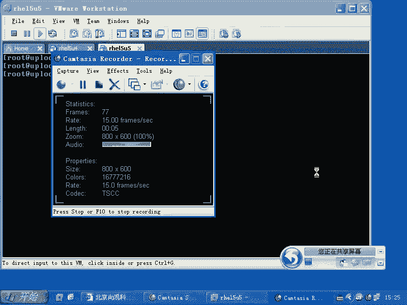
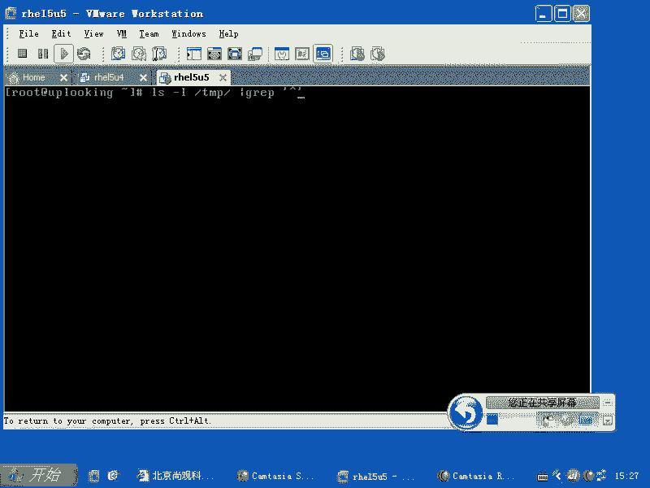
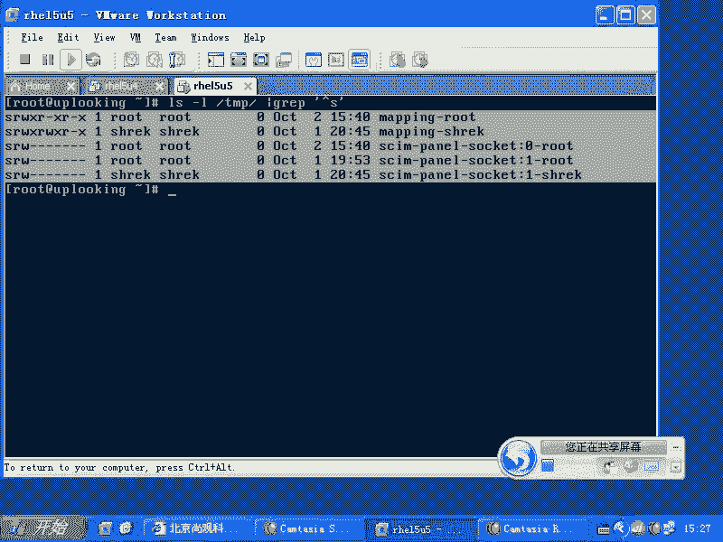
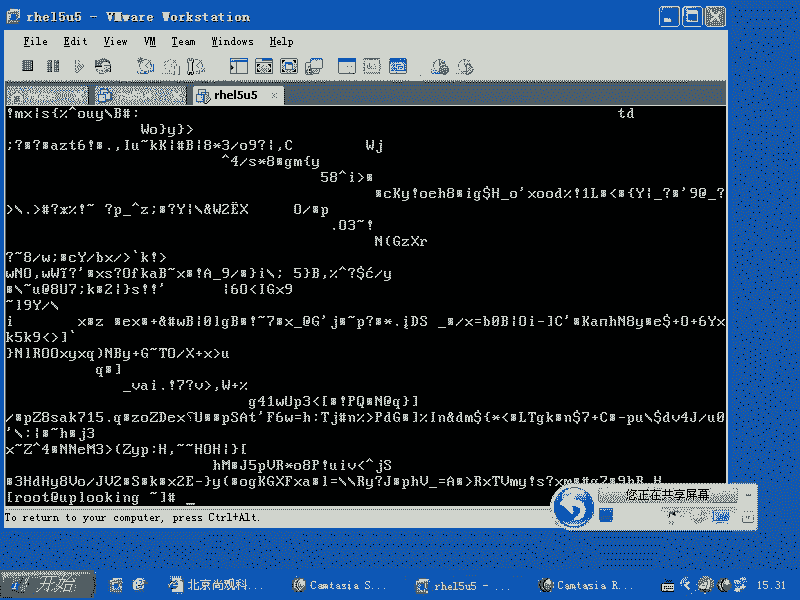
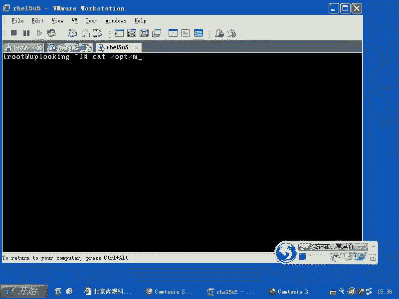
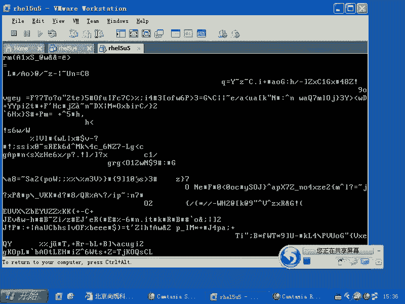
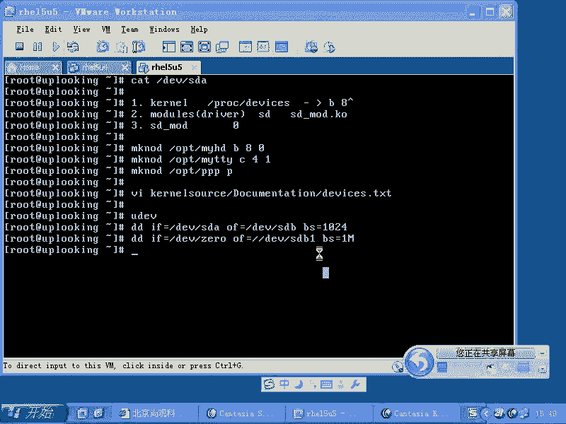
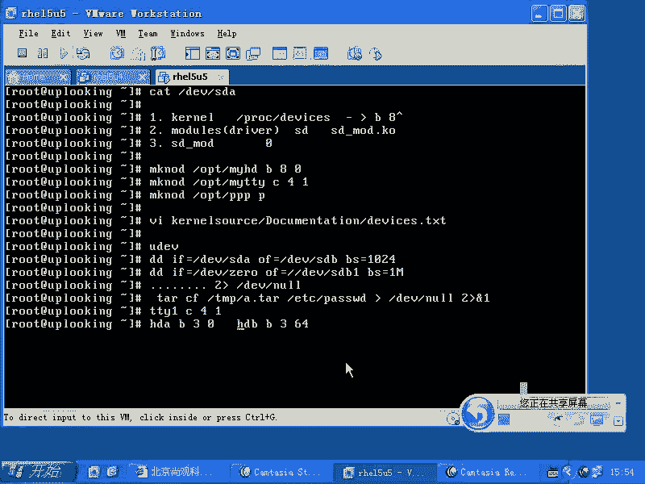

# Linux设备文件管理：P46：RH133-ULE115-5-4-devices-file-dd







在本节课中，我们将要学习Linux系统中一个核心概念——设备文件。我们将了解设备文件的类型、工作原理、如何创建和管理它们，以及如何使用`dd`命令进行底层数据操作。通过本课的学习，你将理解“一切皆文件”这一哲学在设备管理上的具体体现。



## 设备文件概述

上一节我们介绍了Linux文件系统的基本概念，本节中我们来看看一种特殊的文件类型——设备文件。

在Linux系统中，我们常说“一切皆文件”。这意味着许多系统资源，包括硬件设备，都被抽象为文件进行访问和管理。例如，`/proc`目录下的文件实际上是内核提供的虚拟接口，它们以文件的形式呈现，方便我们通过文件操作的方式来访问系统信息。当我们访问这些文件时，内核会动态生成内容。

基于这种思想，系统能否创建另一种“假”文件呢？当我们访问这种文件时，它触发的是对硬件设备的操作。这正是Unix系统传承到Linux的一个传统：**设备文件**。它是一种特殊的文件类型。

## 设备文件的类型



当我们使用`ls -l`命令查看文件时，输出结果的第一列第一个字符代表了文件的类型。

以下是常见的文件类型标识：
*   `-`：表示普通文件。
*   `d`：表示目录文件。
*   `c`：表示**字符型设备文件**。
*   `b`：表示**块设备文件**。
*   `s`：表示套接字文件。
*   `p`：表示管道文件。

在`/dev`目录下，我们可以找到`c`开头的字符设备文件和`b`开头的块设备文件。套接字文件（如`/tmp`目录下的）和管道文件则相对少见，尤其在配置层面。本课我们将重点讨论**块设备文件**和**字符设备文件**。

## 设备文件的工作原理

上一节我们认识了设备文件的类型，本节中我们来深入了解一下它们是如何工作的。





最典型的块设备文件是`/dev/sda`（第一块SCSI/SATA硬盘），最典型的字符设备文件是`/dev/tty1`（第一个虚拟终端）。使用`ls -l`查看它们时，你会发现在文件大小原本的位置，显示的是两个数字，例如：
```
brw-rw---- 1 root disk 8, 0 Mar 1 10:00 /dev/sda
crw--w---- 1 root tty 4, 1 Mar 1 10:00 /dev/tty1
```
这里的`8, 0`和`4, 1`就是设备号。**主设备号**（如8或4）用于标识设备类型或驱动程序，**次设备号**（如0或1）用于标识同一驱动程序下的不同具体设备。

你可以简单地将设备文件理解为一个内容极少的文件，其“内容”就是这两个数字。它的魔力在于，当应用程序（如`cat`）尝试打开这个文件时，内核会识别其文件类型（`b`或`c`），并根据其主设备号去寻找对应的驱动程序。

内核会查询`/proc/devices`文件，这是一个记录了已注册设备驱动的列表。例如，它会寻找块设备（`b`）中主设备号为`8`的驱动。查询后发现，主设备号`8`对应的是`sd`驱动（即SCSI磁盘驱动）。内核随后将控制权交给`sd`驱动模块（如`sd_mod.ko`）。

`sd`驱动接管后，再根据**次设备号**（如`0`）来确定具体操作哪一块硬盘（`sda`）。最终，驱动会将硬盘的数据流输出，这就是`cat /dev/sda`会看到大量二进制数据的原因。

## 创建设备文件

理解了设备文件的工作原理后，我们可以手动创建设备文件。

创建设备文件的核心命令是`mknod`。其基本语法为：
```bash
mknod [选项] 文件名 类型 主设备号 次设备号
```
其中，类型可以是 `b`（块设备）、`c`（字符设备）或 `p`（管道）。

以下是几个创建示例：
*   创建一个与`/dev/sda`相同的块设备文件：
    ```bash
    mknod /opt/myhd b 8 0
    ```
    执行`cat /opt/myhd`，其输出与`cat /dev/sda`完全一致，因为它们指向同一个硬件设备。
*   创建一个与`/dev/tty1`相同的字符设备文件：
    ```bash
    mknod /opt/mytty c 4 1
    ```

**重要提示**：设备文件的权限管理至关重要。例如，如果你创建了一个任何人都可读的硬盘设备文件（如`/opt/myhd`权限为644），那么普通用户就可以绕过文件系统权限，直接读取整个硬盘的原始数据，造成严重的安全隐患。

## 设备号分配与UDEV机制

你可能会问，主设备号`8`为什么就代表硬盘？这是由内核约定俗成的。具体的映射关系记录在内核源代码的`Documentation/devices.txt`文件中，或者系统中安装的`kernel-doc`软件包里。

在早期的Linux系统中（如RedHat 9），`/dev`目录下会预先创建数千个设备文件，以确保任何驱动加载时都有对应的设备文件可用。但这在存储空间有限的嵌入式设备上是一种浪费。

现代Linux系统（2.6内核以后）引入了`sysfs`文件系统（挂载在`/sys`）和`udev`机制。`udev`会动态监测系统中加载的内核模块，并根据`/sys`提供的信息，**自动地**在`/dev`目录下创建和管理对应的设备文件，使得设备管理更加高效和灵活。

## dd命令与特殊设备文件

设备文件的一个强大应用是结合`dd`命令进行底层数据操作。`dd`命令可以用于复制文件、转换数据、备份磁盘等。

以下是`dd`命令的一些常见用法：
*   **整盘克隆**：将`/dev/sda`整盘克隆到`/dev/sdb`。
    ```bash
    dd if=/dev/sda of=/dev/sdb bs=1M
    ```
    *   `if=`：指定输入文件（input file）。
    *   `of=`：指定输出文件（output file）。
    *   `bs=`：指定每次读写的数据块大小（block size）。
*   **安全擦除数据**：用零填充整个分区，使数据无法恢复。
    ```bash
    dd if=/dev/zero of=/dev/sda1 bs=1M
    ```
    这里用到了一个特殊的字符设备文件`/dev/zero`。当你从它读取数据时，它会提供无限的空字符（ASCII NUL，数值0）。
*   **丢弃命令输出**：将命令执行过程中产生的输出（包括标准输出和错误输出）丢弃。
    ```bash
    command > /dev/null 2>&1
    ```
    这里用到了另一个特殊的字符设备文件`/dev/null`。任何写入它的数据都会被系统丢弃，它就像一个“黑洞”或“垃圾桶”。



**注意**：`dd`命令功能强大，但使用需极其谨慎，错误的参数可能导致数据丢失。

## 总结

本节课中我们一起学习了Linux设备文件管理的核心知识。

我们首先了解了设备文件是Linux“一切皆文件”理念的体现，它分为**块设备文件**和**字符设备文件**等类型。设备文件通过**主设备号**和**次设备号**与内核驱动程序关联，当访问设备文件时，内核会调用相应的驱动来操作硬件。

我们学习了如何使用`mknod`命令手动创建设备文件，并强调了其权限安全的重要性。同时，我们也了解了现代Linux通过`udev`机制动态管理设备文件的原理。




最后，我们探讨了`dd`命令结合特殊设备文件（如`/dev/zero`和`/dev/null`）的经典用法，包括磁盘克隆、数据安全擦除和输出重定向。掌握这些知识，将帮助你更深入地理解Linux系统底层的工作机制。