# 尚观Linux视频教程RHCE 精品课程 - P47：RH133-ULE115-6-1-network-fconfig-ip-route-config - 爱笑的程序狗 - BV1ax411o7VD

好，我们呢来看一下，就是说lateux里面最强大的部分，什么地方呢？网络部分。你现在会发现啊，linux的话呢用的最多最多的就是就是干什么呢？做网络的。服务器啊。路由器呀是不是？然后呢，网络设备呀。

网络终端呀，他就干这个。因为的话呢一个很小的内核里面，它居然什么呢？有很多很多网络的这个协议站，是不是？它完整的一套，这个的话呢就是连cisco之类的巨人啊，他们的话呢都不得不什么呢？

就是要看这个lininux的发展，因为一个公司最头痛的是什么？你们不要想到这个公司的话很美好，就是一个非常强的公司它的研发速度非常快是吧？噼里啪啦成现在那边研发。但是呢他再快，也没有谁啊。

没有linux快。lininux不是一个公司或者几个人在那边做是吧？一堆公司，一堆人在那边做事情。所以的话呢有很多公司连这个项目部还没成立的时候，哎。

人家lininux那边有世界上有一个项目组决定把自己的什么这部分的这个项目的代码共享出来了啊，这个时候你比方说比方说啊我这边不是不是那个在就是不是在说人家就我假如说我是cisco我要的这个入侵检测系统。

人家写好了是吧？我能不能拿过来直接用呢？不能你要拿来直接用，你要把你自己的代码也供享。对不对？所以很多公司的话呢，因为它本身是封闭的开发体系，它的话呢享用开源的时候。结果就是什么受到了很大的问题。

但是他又不能他又不能落后太多是吧？人家有一个公司用的开源东西，非常快的把这个这个软件就弄出来了。结果我还吭哧吭哧还没做出来，项目组刚成立是吧？别别说这个测试等等。但是呢这一点在中国没有问题。

因为中国人的话不怕什么，别人说的盗版，也不怕别人说的什么，这个呃就不遵守开源是吧？这个确实是。就是咱们。中国人他也觉得理所应当是吧？我用你是看得起你啊，是吧？开开个玩笑。

但是很多中国公司啊都会有这个问题，就是他用的是开源，但是他自己不开源。😊，呃，他理直气壮了，我这是自有支撑和产权的是吧？前段时间的话呢，据说有一个就是国家的这个申请核高基是吧？核还有什么高科技。

还有什么基础，什么什么这种核高基的这样一个项目，然后有个公司就落马了，为什么落马呢？因为他拿的是什么开源的东西改的东西。然后人家的话就不让他就是不给他这笔钱。他说你没有自主知识产权啊。

其实干这事儿呢不是一个公司啊，基本上上去的公司全都是干这种事情。但只不过可能是关系没有做好或者什么，那其实也挺冤的啊。所以这边的话呢可以看到开元啊，它最终的话就有有点像什么呢？

有点像就是说特别符合中国人的这个脾气是吧？价格便宜料又足，对吧？然后呢，我们用了它倍儿开心，对吧？那种感觉。但是呢。这个带来的就是说带来的问题就是以后的话，你要想让公司有一定的这个影响。

或者说不要被别人戳几量股的时候，只要你这个公司再面对海外反海外的时候，那么你可能就会遭到什么诉讼。因为你用的是开源是吧？你自己没有开源，是不是那就违反了我这个协议，你就侵犯了我的版权。

那么任何的一个公司都可以去起诉他。任何公司起诉，遭到起诉的一个公司是谁呢？大家都知道华硕它的那个产品的话也大家也知道叫什么EPC。原来那个EPC的话呢，上市最开始第一款上市的时候是1900块钱啊。

我在徐家汇的时候看到就上海徐家汇啊，我说这些人买什么东西呢？这么热情是吧？人人的话，其实小本一看，哎，1900块钱一个笔记本，很多人都愿意买1900块钱那个是带linux系统，不带windows系统。

那个linux系统里面的话，有个ACPI的模块。因为linux本身那个模块写的太烂了，就跟大家说是不是有bug是吧？他的话呢就改一下，把它改好了，跟他笔记本的话，兼容性特别好。😊，结果的话呢。

他开源的时候，他就不把那个部分开员，结果直接被一个公司的话就扔上法庭啊。就是说在这样的压力下，他不得不把ACPI这个模块又放在什么开源的那个呃地方，让人家去下载，说我也开源了，那最后免于诉讼啊。

是这样一个问题，明白吧？所以的话我们从侧面上告诉大家的话呢，就是说有很多的网络公司啊，他如果离开lininux，它基本上是活不了。你们看到的很多很多设备可能都不会出现。很多很多设备都不会出现，明白吧？

很可能你们用的最常用的说无线路由器里面可能就是lininux。那么有很多公司卖的是特别特别贵的设备，几十万1个啊，这个可能也是在企业看来是中不溜的设备，几十万一个里面用的就是lininux。

你像F5F5的话呢是负载军容器是吧？嗯负载均容器，很多人的话非常happy的拿着一个硬壳子是吧，觉得这个东西多贵是吧，多好是吧？结果里面就是lininux系统。😊，那个cisco那个cisco的话呢。

倒是用的是BSD的电种，是他自己开发的，是吧？但是他有款设备的话也是用lininux。它一开始的话呢可能没有注意，但是在欧洲的话就被引起诉讼。他那个设备的话，你说一个黑壳子，一个防火防火墙也好。

还是一个什么也好，里面可很很可能就是linux。啊，这个做这个事儿的人太多了。我们来看一下linux网络功能啊，lininux的网络功能的话呢，它实际上是分成呃。就是说基本上是它的核心优势啊核心优势。

那么从我们的 kernelel当中，我们的TCPIP的洗击站就在这里面，还有什么呢？各种安全组件，比方说IP tables是吧？ARP tables啊，ARP table。

AARP tables加不了SO忘了。ARP就是那个ARP防火墙之类的这些东西是吧？还有的话呢，像我们的什么呢呃。😊，代理上网是吧，mcu。😡，LastQ。好像这么拼吧。我我总是忘啊。

我一般的话会查一下等等这个 kernelnal当中的话就带这些呃 kernelnal当中不带，就是内核模块当中带啊，内核模块当中带。还有的话呢像这个网络当中的一些属性啊，像什么bound啊是吧。

bounding啊之类的这些，它带的很多，那么这是驱动部分。还有的话呢，最起码还有什么呢？还有driver。😊，枉法驱动。drivers比方说网络设备的驱动是吧？网络设备的驱动。

这些驱动的话呢有一个什么好处？你如果要是有一个显卡或者有一个声卡，你不一定能找到lininux的驱动，是不是？但是网络网卡的话。

它一定是找lininux一定会这个这个公司会把这个lininux驱动和windows的这个驱动并排来放。因为话呢它的这个高端的网卡在服务器上肯定用的可能性是最大的，对不对？

所以的话呢服务器用的linux的份额是非常大。那我不可能不出什么linux的驱动是吧？我肯定要出。所以的话呢这种驱动的话，你肯定是非常多啊，而且非常及时，非常轻。网络设备。那么还有什么呢？

还有就是说这些命令啊。应用程序。应程序还有什么呢？命令。这些东西的话呢，构成网络的这个体系结构。那么从内核当中的这些组件就是这些协议和规范的支持到驱动的支持啊，到一些应用程序。

你比方说我这边加载了什么呢？加载了7层分发是吧？NG的7证分发，那这应用程序也有很多是吧？我就可以直接拿过来用，还有的话呢，各种命令测试命令啊什么的，都不需要你去自己写有大量的东西，那么我们的话呢。

一般配置的东西是什么呢？假如说你学咱们在过几天的话呢，有安全部分是吧？Itables要给大家讲，对不对？然后呢，我们可能要配置的是什么呢？配置的是应用程序和呃命令要执行一些命令。

那么我们的话呢先给大家讲就是内核里面，那么你要想去加载网卡驱动的话，那网卡驱动应该是在哪个地方。😊，阿拉B下的models当中是吧？然后呢以你的内核的版本号命名是吧？

然后呢在 kernelel目录下是吧？traver里面是吧n啊，有多少种网卡，那你在这边自己看从网上下载过来以后，编译成KO的文件，丢到这里面执行一下第一批modode。😊，让他注册一下就可以用了是吧？

或者你直接inser mode加那个网卡的点KO的文件的位置是吧？嗯也可以直接用。那么我们系统当中是怎么样呢？系统当中是VIETC下的什么modode。Probin。

是不是点com在这个里面是不是放的是网卡的驱动的位置，是不是这个网卡驱动是在这里面，那这里面怎么写呢？你加个AN是不是？然后呢，ETH几，你如果要是第二块网卡ETH1是吧？那你这个网卡的名字叫什么呢？

比方说。😊，8139TOO的这个驱动是不是就是最最便宜的最经济型的8139驱动是吧，放在这里面。熄关了是不是？😡，这样的话，你的网卡驱动就加载起来。然后呢，你写过去以后的话，你可以输入一个什么。

这样的话呢，它自动就加载到你的当前的系统当中。然后呢。你就可以使用它了。但是呢你加载完了以后，你用RF config啊来看看不到它。因为的话呢我们的网卡啊加载了驱动以后，你没有配置它的IP地址。

RF config就不给你显示了。明白了吧？啊，所以的话呢你要找到合适的驱动。如果你现在的话呢默认的驱动有问题，那你就从它的厂商那个地方去什么下载过来驱动，重新编译安装，然后放到这里面。总之的话呢。

你要用modpro还是用in mode，你总要把它什么加载上去，加载上去了以后的话呢，不要指望它的IP地址会自动出现，用IFfi看不到，你要用什么IFfiETH1是吧？然后把它设置1个IP地址以后。

它就能看得到。听楚了吧？那么Rfi我们刚才这上面的这个驱动的话呢，相关的东西我就跟大家说完了，是不是驱动这个相关的东西就跟大家说完了。那么你用RFfi可以显示所有的网络设备是不是？但是是已经配置好的。

是不是已经配置好IP的，没有配置好IP的话，你显示不出来。那么你可以试着给它加1个IP，然后呢再用RFfi来看，但是RFfi这个命令的话呢，是基本上所有的unix系统里面通用的，它支持的规格都非常的老。

😊，现在的话呢linux它有自己独特的一套东西。这套独特的东西的话呢，功能要比RF configurefig的话要强很多。这个命令就是我们隆重推出的什么IP命令。IP命令能看到的。

IP地址IF卡费未必能看得到。F卡fi未必能看到你用IP命令这个接口添加的IP地址RF卡fi也未必能看到，明白了吧？那么我们可以看啊RF卡fi你可以添加1个IP地址ETH0呃ETH1是吧。

冒号一再加1个IP地址，是不是？😊，给它再加一个没有问题。那么你还可以怎么样呢？RF confiETH0大是吧，让它关掉是吧？当然也可以怎么样RF configETH0R是吧？唉，是up吧。😊。

12伏是吧。啊，然后呢把它打开，然后呢把它关闭掉，是不是？那么我们如果要是用IP命令的话呢，IPADs啊，你看IPA命令是一个命令是不是它可以加个参数叫做addressaddress就是IP的地址。

但是呢我们懒得去写address那个英文单词是吧？那么我们就填写到它前面的两个字母IPAD是吧，address的缩写s sHOW是吧？我们把后面两个也给它省略掉了，所以你有时候看到这个命令就很奇怪。

IPAD show是不是？那么当然了，我们还可以去给它添加IP地址，是不是我们看一眼。😊，IP命令啊，我们看一下IP命令IPAAD啊杠杠help。我们可以看一下IP的AD命令里面的话呢唉。啊。

这样的就不能这个地方就不加杠杠help了，不加杠杠了，就是IPAAD help。你看IP address添加一个是吧，添加1个IP地址是吧，给设备是不是添加个IP地址。明白了吧。IP。

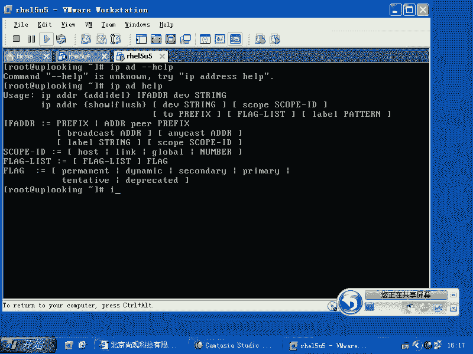

啊，我们这样的啊RF config。然后呢我们看一眼，现在我ETH0创有个0。254的IP地址，对不对？然后现在我们看。PADADD是不是？哎，不是。

是啊IPAaddress就是添加1个IP地址是19218。1。254，是不是？然后呢，DEV什么呢？ETH0是不是这样回车添加上去了是吧？然后我们再来看一下。有没有多？没有多是不是哎。没多他。没多呀。

IP。AD售啊，那么你再看这边的话呢，有1个0。254的IP，还有个什么1。254的IP是不是？这边的话呢就有两个啊，就有两个。

所以的话呢我们在这边就是用RF卡fi未必能支持它的接口啊RF卡fi未必能支持它的接口。

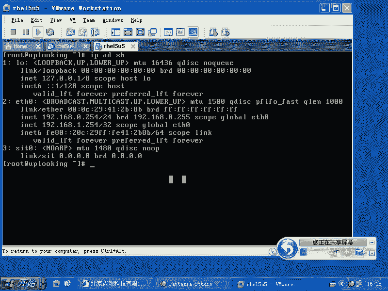

明白了吧？那么IP命令的话呢，还可以做什么？那么加上一个help。😊。

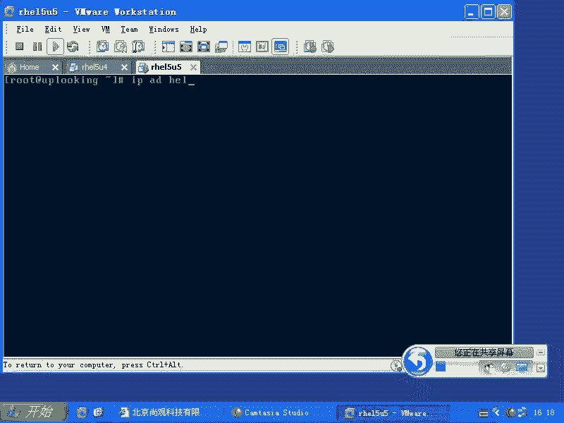

这样都能看，那么这边是添加是吧？你还可以去删除是不是删除某1个IP。但是呢大家注意啊，就是说你添加了以后，你要注意你的同事认不认识这个命令。如果他不认识的话呢，他很可能说哎，你在哪添加的IP是吧？

我没看到呀，对不对？那么你们两个兼容性就有问题了。你们两个同事之间兼容性就有问题，是吧？所以你不是说你懂这个命令就一切全都用，你要考虑一下你在这个环境里面有没有告诉别人是不是？

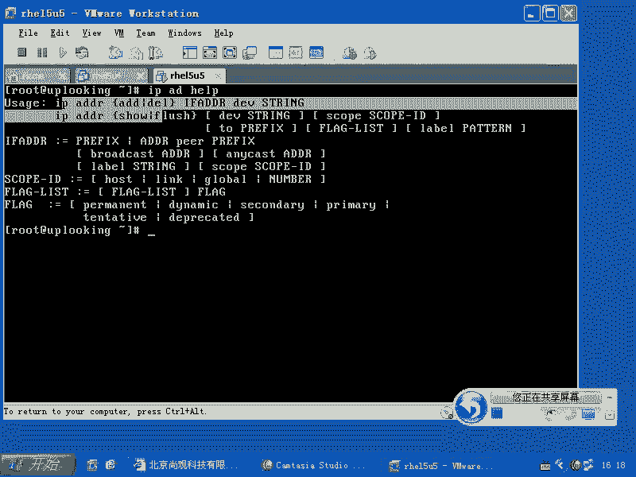

好，那么还可以怎么样呢？IP命令可是太强大了，基本上lininux里面最强大的网络命令就是它了。IP还可以加上一个什么te。我们刚才只是看到一个分支，就是IP地址的。分支。我们可以看其他分支。

还有什么呢？你看IP help它可以在什么呢？以太网这个层次进行操作，可以在什么呢？可以在呃就是地址这个层次是吧？还可以的话呢去添加什么标记，还可以去。添加路由。它这个路由的话呢，还可以去添加什么呢？

策略路由啊，什么叫策略路由呢？就是原来的我就觉得我自己也挺丢人的。人家问我说，哎，老师，你这个策略路由学过没有？什么策略路由，不就是路由吗？对吧？策略路由是什么呢？就是说我现在有2块网卡。

是不是这2块网卡都是以太网都可以去上网，是不是？比方说我都可以去播ABS要上网，😊，那么现在我怎么样去我怎么样去让我通过我上网的人分割流量呢？对吧嗯这个时候按照一般的路由规则，那么你想访问外网的时候。

是不是我只有一个网关生效是吧？尽管我添加两个网关，但是生效的只有一个，是不是？嗯那就意味着你只有1个ADSL不断有什么这个数据出入，是不是？所以策略路由的话呢，就是说我把百分之多少的流量，然后呢。

留给这个链路，把百分之多少流量留给那个链路。但是他们的话呢，目标什么？就是说生效的实际上是两个路由表，明白吗？那么这个linux内核的话可以支持多少个路由表呢？200多个路由表。250多个路由表。

250多个路由路由表，那么默认只生成一个，只生效是一个，这就是我们平常所使用的路由表，是不是？但是IP命令的话呢，它可以设置这200多个路由表。它可以设置的话呢，跟IP tables的话呢。

连用IP tables是说我这边有100个包过来是吧？我把其中50个。打标记为A，另外50个打标记为B。标记为A的，用第一个路由表，标记为B的，用第二个路由表，是不是这样的话我就可以分割流量了。

是不吧他就这样的机理。所以这个东西的话呢就是策略路由。所以它的功能的话呢要比那个普通路由的话呢要强很多，明白了吧？还有的话呢像调节等等啊，调节啊等等这些东西。那么它甚至什么呃。以太网以太网6啊，不是。

就是那个呃TCPIP协议啊，IPV4IPV6啊，包括什么IPX啊，这种link的状态。我也没有用过IPlink啊。啊，IP linkIP link，然后呢你可以s某一个设备。

比方ETH0或者ETH1是吧？up还是down是吧？就跟跟那个IF config是一样的，是不是？然后呢，还可以怎么样呢？设置它的ARP。广播开还是关，是不是？是吧2还是of。多波的话是否支持？

这些功能的话呢，就是我们所谓的这些呃IP里面的话呢，比较多的这些功能。所以大家的话呢要呃就是一定要找时间的话呢，去把它熟悉一下。像我的话呢，用的最多可能就是添加个IP地址，减少IP地址，对不对？

IP啊address show啊IP address add啊之类的这个命令。那么这个命令的话呢，我就需要IP命令的话呢，一定要清楚是吧？IP help啊，IP help你可以看看它支持哪些东西。

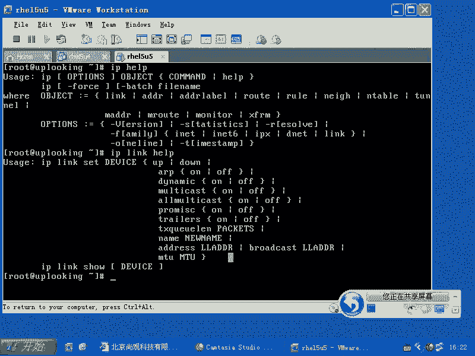

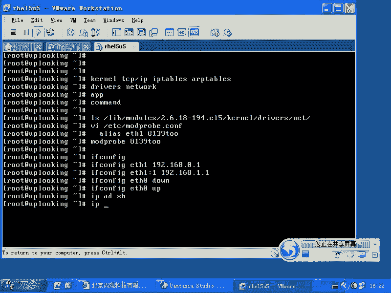

这个的话就是我们的设置IP地址，对吧？设置好IP地址了以后啊，我们想不想知道你这个网络的话呢有没有连接啊？你们正在连机啊，是不是？有个有个人的话呢，他的机器上有2块网卡。插了一根网线。哎。

我到底插的是ETH0还是ETH1啊？你们有没有遇到过这种问题？啊，有肯定遇到过是吧？那么输入一个什么呢？MII杠two啊，杠t two你就可以看到MII杠t two的话呢，你还可以用MII杠t。杠V。

那么你可以去怎么样呢？查看你的这个网卡还支持哪些模式啊。首先的话呢你运行MI杠two。然后呢，杠V你。OK这边的话呢也是一个典型的问题啊，就是有些网卡是支持MII的方式的话呢，去查看有些网卡是不支持。

当不支持的时候的话，它就会出现这样的情况。明白吧？如果支持的话呢，他就会告诉你这个网卡是link的，还是什么？没有link的啊，那么这个MII的话呢是做这个。那么IMI杠t two的话呢。

它还可以加上一个。参数啊。比方说他可以加上一个呃。杠F啊杠F它可以强制你的网卡运行于什么十0兆以太网还是百兆以太网，十兆半双攻还是十兆全双攻？百兆半双攻还是百兆全双攻。

你可以让它规定的话呢运行在某个模式之下，我们的交换机的话一般都是什么？十兆百兆自适应是吧？实际上是十兆百兆全双攻半双攻自适自适应。当你的网络线路有问题的时候，你就想让它工作在十0兆。结果他有时候的话呢。

他又觉得自己这个线路不错，又工作到百兆是吧？结果受到干扰又大了，又变成十0兆是吧？这样的话呢，导致你的链路总是通断通断是吧？那么你把它强制工作在什么？十兆上。有些网卡支持，有些网卡不支持。

就像咱们看到的，现在我这个PCPC night这个这种网卡驱动，它就不支持。你像8139，它就支持8139这个驱动要加载的时候，它必须得加载一个叫做MII的模块。它依存于MII的模块，明白吧？

也就是说这个功能的话呢是需要网卡支持。

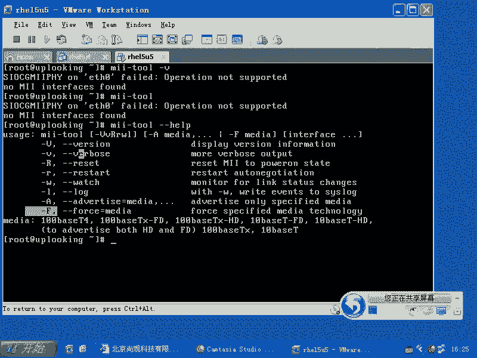

这是我们可能常用的一个命令啊常用的命令。那么如果要是现在我们设置好了IP地址以后啊，设置好IP地址以后呃就是说。

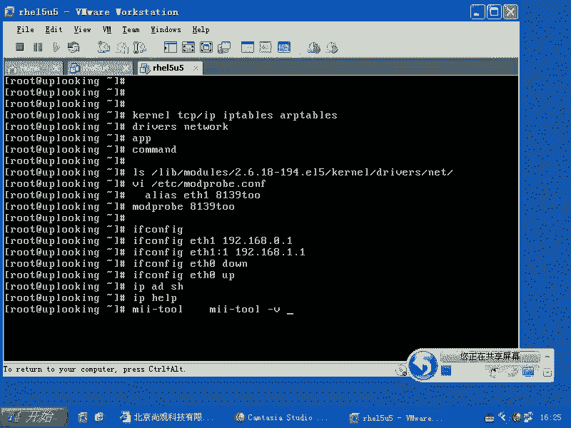

这样的设置完了以后，那么他。他怎么样呢？他启动以后生效不生效。不生效啊它不生效不生效的话呢。没有写到一个文件里面，是不是？那么所有的这些设置IP地址的话呢，这些文件到底在哪呢？

在ETC下的ss confi当中的night。walk是吧，杠 strip。这个目录下RFCF呃RFG。啊，RCFG开头的ETH0或者ETH1是不是这样的这个这个地方的话呢，放置了我们。

放置着我们刚才设呃就是我们要设定的IP地址。那么你可以自己的话呢，在这边去改写一下。比方说我现在想把它改成一啊1。254，那么你就可以去改下次重新启动的话呢，它就生效，下次重新启动的话，它就生效。

就是说我把这个IP地址改掉以后的话呢，它下次重新启动时候就会生效。那么我想给它添加1个IP地址啊，也就是说大家要知道这个规则是什么？我想给它添加1个IP地址的话，我一般是这样做。😊，然后呢。

我去copyIFC。RFCFG啊，ETH0是吧？我拷py成什么呢？RFCFG。😊，ETH0。冒号一是不是我随便起名字无所谓啊，这个起什么名字，你比方冒号0ETH8是吧，一是H0逗号呃。

冒号8都可以copy成这个文件以后的话呢，我去VI这个文件。就是我想给这个网卡添加第2个IP，对不对？我去VI这个文件。VI这个文件的话呢，我把这个deevice这个地方一定要改成什么？冒哈。

比方说一啊添加了一个你要是还是ETH0的话，那它就是刷了2件ETH0是吧？只留下最后的1个IP地址。😊，对不对？所以这个地方的话呢，你要给它改成什么呢？冒号一或者冒号2，对吧？然后呢。

再把这个自己的IP地址的话呢，改成什么？😊，你想要的IP地址。啊。你想要的IP地址。保存并退出，下次启动的时候，它就会生效。也就是说device等于什么？表示的是它针对哪个接口设定IP地址，是不是？

然后呢，还有就是说呃不pro等于。静态的就是说如果要是我是自动获取IP地址，就是DHCP了，就不是静态的。那么我下面这边的话呢，就可以直接删除掉了，我就不用设置IP地址。

就直接是什么DHCP一般DHCP的话呢，会有啊会有三个三个选项，一个是dice等于什么是什么？还有一个是什么onput等于什么什么onput等于yes的话，就是说我系统启动的时候，网卡。😊。

网络的这个服务一启动，他就开始读这个文件是吧？读这个文件一看到on不等于no，那他就不会去把这个接口启动起来。明白了吧。所以这边的话呢是这样几个选项啊，那么我这样WQ妈WQ写入了以后啊，写入完了以后。

这个网卡自动就有这个IP地址吗？没有，那么你需要怎么样？sorice might work是吧？re star是不是把它重启一下，这样的话呢，你设置的那个。配置文件它就有效了，它就生效了。

然后我再askconfig。这边的话呢就会多了1个ETH0冒号一。是不是？因为的话我在这边的话添加了个IP地址是怎么来的呢？我在这个目录下先去怎么样cooffpy这个文件。

是不是cover完这个文件以后的话呢，去VI这个文件，是不是？VI这个文件里面的话呢，改那个。😊，device等于什么？一定是你想给谁赋予IP地址，那你就什么加上这个名字。因为原来是ETH0。

那么ETH0是0。254，你想给他多加个IP地址，那你就给它改成什么ETH0冒号。是吧不要去重复，不要去跟原来的ET是零冲突，对不对？这样设置完了以后的话呢，再去怎么样呢？再去其他地方它改完啊。

其他地方改完，改完了以后的话呢，再去service network restartstar它就会生效。是吧这是你永久更改IP地址，通过更改文件的方法。当然了，你要更改IP地址的话呢，可以怎么样输入。

system。到。卡费个杠。network是吧？一般来说，我们在文本界面下需要输入的是什么呢？杠TUI如果要是图形界面下输入什么呢？GUI是吧？那你如如果直接输入network的话。

它会判断你是G还是T啊，所以直接的话呢，TUI的话呢，它可以直接配置。但是reite的话呢，现在啊。他习惯怎么样呢？他喜欢啊让所有的人的话呢就符合一定的规范，这个是好事儿。但是呢。

就说他把原来那种大家也搞不清楚到底是谁写的命令全部都删掉了。因为原来的话我们用的最多的命令是谁呀？卖可fi啊。现在这个文件的话没有了啊，这个命令默认是不装的。我记得以前默认不装。

但是还是有这个命令的是吧？就是有这个包的。现在的话呢，我不知道这个包还有没有，因为它呢已经不得不什么给它踢掉了，就是不怎么用它了。那么let它的话呢可以就是直接设置IP地址。在以前的版本当中。

那么它设置IP地址的话呢，非常简单。杠D啊，你现在的话想给ETH0多加1个IP地址什么？杠DETH0是吧？冒号2，你再添加IP地址，直接一回车它就可以。添加1个IP地址，永久添加，是不是？

那么如果要是你想改ETH1的IP地址，那么你就ETH1给ETH1再加个IP地址冒号一啊，这样一回车添加什么呢？IP地址添加网关，然后添加什么呢？这个DNS就跟我们的windows下那个配置是一样的。

是不是？当然现在的话这些东西都被什么替替代掉，被我们的sstem杠confi杠什么network替坏掉。😊，那么reite的话，希望我们怎么样规矩一点，是吧？当你想配置什么的时候。

直接输入stem杠confi杠什么什么就完事了，这是这是他的期望啊。那么把以前的话呢都改掉了，这是永久的配置IP地址和IP地址的一个机理，是不是啊？有没有问题？我一兴奋的话呢，讲话的速度就特别快。

然后讲跨速度快了以后的话，说有没有问题啊，有就就没反应了。没反应的话，实际上大家都什么。😊，在睡觉是吧，睁着眼睛在睡觉是吧？反正的话呢就跟唐僧一样，然后一直有个声音在那面嗡嗡嗡嗡我慢慢的话也就不关注了。

对吧？嗯。咩你们都动啊。

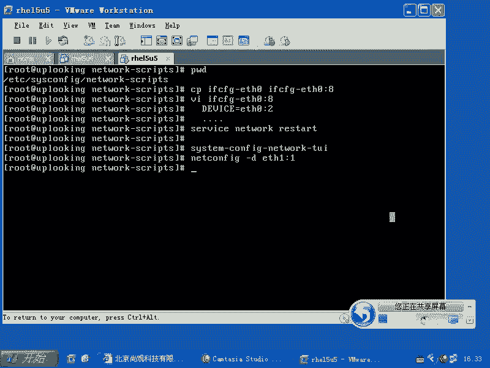

啊，这个问题非非常好啊，IP address add是吧？它添加的这个IP地址到底能看到吗？我刚才也在想这个问题啊，以前我听说它是就是说它是下次重启动还是会生效的，是吧？但是呢我也不太确定。

我也不太确定我这样试一下啊。😊。

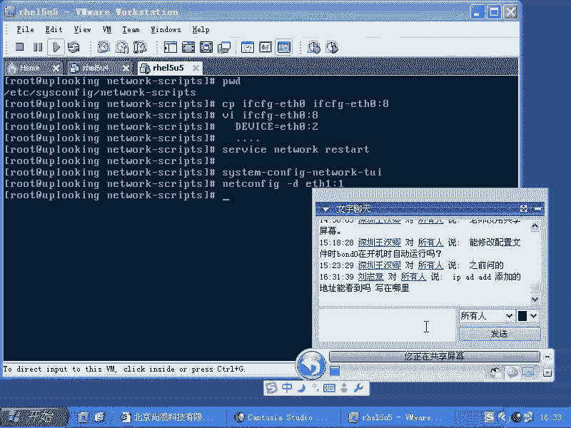

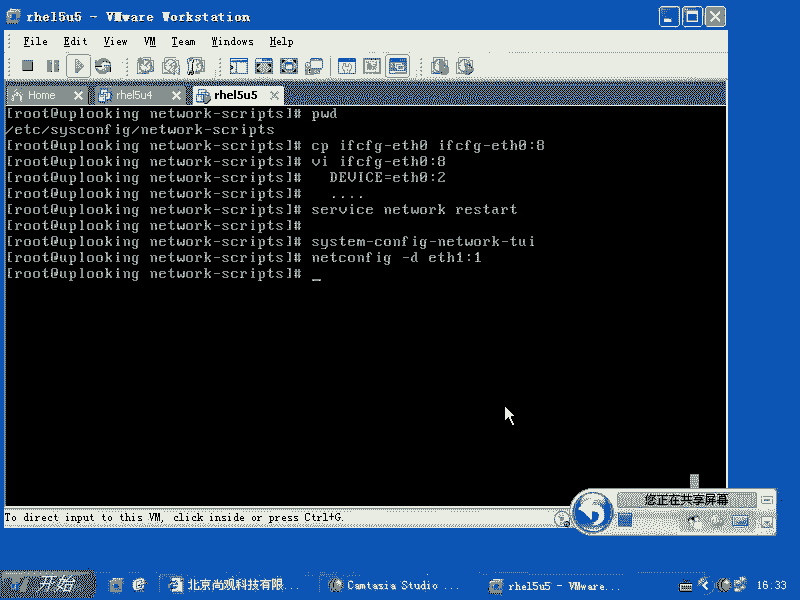

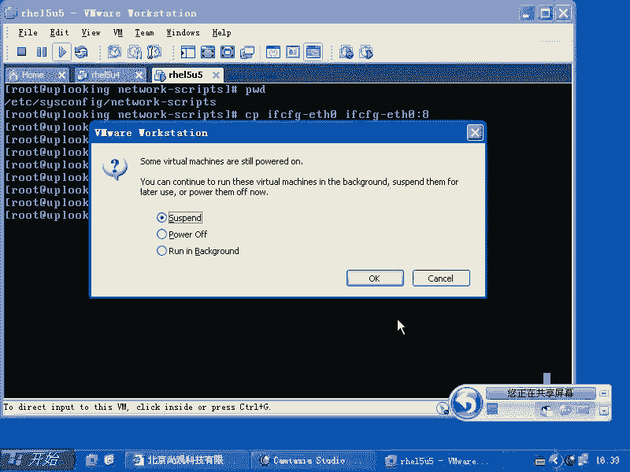

我再试一下。如此啊呃。我输入密码啊，然后呢，我在这边的话呢是IP是吧，AD什么ad是吧？添加IP地址要求2呃10吧，10。0。0。1是吧，DV是吧？ETH0我在ETH0上的话，添加IP地址，对不对？

那么现在的话我用IPAAD受。啊，DEVETH0它应该是什么？它应该是有4呃3个IP是不是3个IP吧？那么如果要是我现在把服务啊，servnetre一下。如果要是它没有了，那说不明下次启动的时候。

你的这个添加的这个IP地址就是什么丢掉了，是不是？如果要是有的话，那说明它还是保持在某一个文件里面，对不对？啊，那这个文件是什么，我不知道啊，我可能要查一查才知道，查一查IP命令才知道。

那么现在我重启了，然后我们再看。

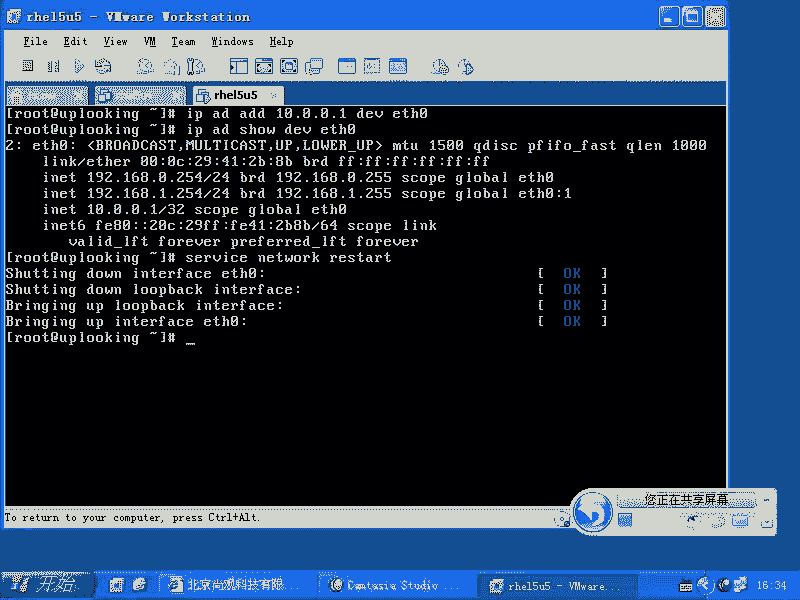

没有了是吧，证明这个命令是什么？需要你每次去输入一下的啊，当然这个咱们整个的这个测试的话，还有个漏洞，就是你重启一下，看一下有没有是不是重启一下，要是还是这样2个IP地址，那说明IP命令。

你需要把它写到哪呢？写到那个RC点local里面去，它就会生效，是不是？如果要不写到RC点loc里面去，它就不生效，是不是不写到配置文件里面就不生效。所以的话我们现在看到了实验的结果就是什么？

你要不写到一个配置文件里面，它实际上不会自动保存的，只是当次生效，就跟IF一样，是不是？你现在IP地址以后，你不一重启它就又丢掉了。除非是你创建出来配置文件。

或者用sstem杠杠network来重新添加是吧？否则的话就没有，所以这边这边的话呢，就是刚才我们那位同学问的问题啊，这个问题问的非常好，我刚才还在什么呢？心里面打鼓，但是大家可以自己去测试一下。

其实的话试一试就知道了。好。那么我们来继续啊，这边的话呢就是告诉大家怎么样去添加IP地址了。那么当然了，我可不可以这样的VI是吧？ETC下的RC点D当中的RC点。local是不是？

然后在这里面的话添加什么IFfi是不是ETH0冒号几，是不是冒号一，然后呢给它加上1个IP地址，可不可以呀？那不是当然可以了啊，当然你也可以在这个里面去添加什么IP是吧，AD是吧？😊，ADD是吧。

address什么什么东西，这样的添添加是吧？那么我添加这个格式的话呢，可能未必对啊，就是我刚才这样添加这个格式的话呢，可能是未必对的。这个格式未必对，那么你是不是需要加上一个什么？我先把它删除啊。诶。

ad是吧，我是不是需要加上一个子网掩码之类的东西？IP address这个IP address是不是？10。0。0。1是吧，杠255。0。0。0是吧？然后呢，DV什么呢？ETH是0，是不是这样的话。

不行是吧？啊。😮，我看哦。Prefix。我看一眼啊，这边是什么。啊。😮，这边的格式是。反正我肯定可以通过设置什么广播。呃，广播。IP呀或者说。这些方式的话呢去设置好。那我说这个子网炎吧该怎么设？这鞋带。

啊，这写到大或者写到。哦，这样的啊。哦。我我就是刚才添加完了以后啊。

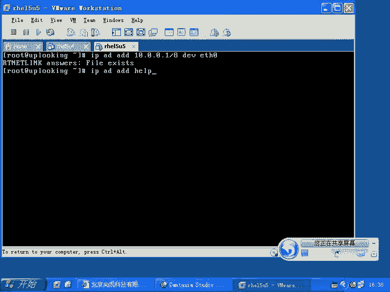

我刚才添加完了以后的话呢，瘦的时候的话呢，看到它跟其他的那个阿卡菲添加那个不一样。现在不一样。啊，这样的话这边还是不一样。一样。还是不一样，就这边的话呢。

没有那个就是这个就是广广播的这个IP地址没有自动设定是吧？广播IP地址没有自动设定，可能还是要输入完全一点。这边可能还是要输入完全一点。这边是正常的，我看一眼上面啊。啊。😮，等一下，我看不加杠8的话。

它能那是不是一样的？因为我以前的话是没有没有那么麻烦啊。默认是32。32位的资源码。就是一个主机的IP是吧？那这个肯定不对了，还是应该把昨网源码添加到后面是吧？也就是说我们去添加IP地址的时候。

还是应该怎么样？这个。啊，IPAAD是吧，ad是吧，1个IP地址这边要加上子网源码，我不加子网源码的话，它就自动给你24呃32位子网源码是吧？这肯定不行，不能这样用。好。

我们看到刚才的话呢自动设呃就是设定IP地址，让它重新启动的时候，照样有这个IP地址的这些操作是吧？同时验证了什么呢？我们是初步验证了IPAD这样的方式添加的IP地址。

没有自动记录在每一个某一个文件里面是吧？如果重新启动的话，它还是没有自动记录，那我们就可以很确定的说IPADad再添加1个IP地址的时候，它不会自动记录，它跟I贝是一样的，对吧？等一会儿的话。

我们自己来试一下，因为我还要再继续把那个命令命令列表写一下啊，这个的话呢，我们跟大家说说的差不多了以后，放到我们现在在看。

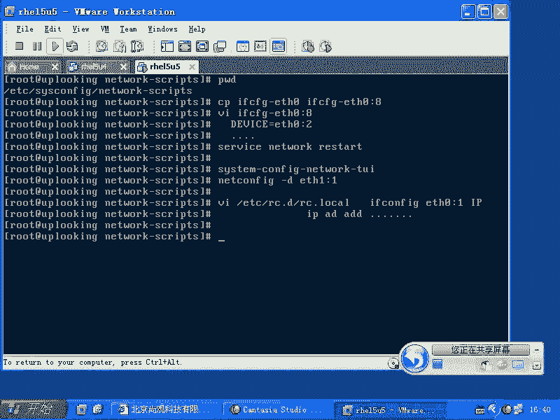

啊，我们在现在看。稍等一下。

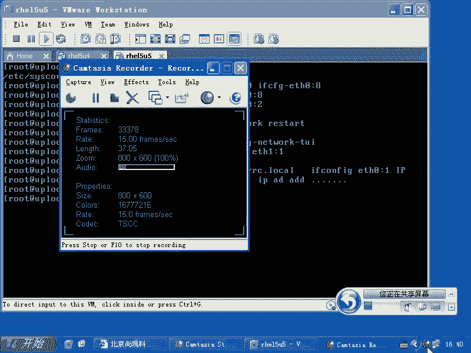

喂啊好。啊。秦强的话呢，刚才也告诉我啊。好。呃，我们现在的话呢基本上把设定的话呢告诉大家告诉清楚了，是不是？那么根据它根据网络的话呢，网络相关的服务，大家应该知道有一个服务是一定要打开的，是不是？

是不是？这个服务一定要打开啊，那么一般来说的话呢，我们知道在。运行级别就是IIT的运行级别，零是关机，一是单用户是吧？二是什么呢？没有NFS的。就是多用户模式是吧？那么三的话呢就是完整的多用户模式。

四的话是没有人用，是不是？五的话是什么呢？五的话是有图形界面是吧？完整的多用户模式六的话就是重启，对不对？那么我们的话呢check on fake on的时候，那么2345这4个运行级别的话呢。

全部都会打开，但是一般情况下的话，我们会把二什么呢，可能就不打开它了啊，这是一个。但是这个都无所谓。因为我们运行级别为二基本上是不用的，是不是？2那么但是我们这个服务要打开，如果要是你想启动什么呢？

IP tables IP tables要 on的话呢，就是check onfi IP tables on是不是？但是呢默认情况下，我们如果没有设置IP tables的话。

IP tables它是非常的什么就说。😊，rehead给你定义的规则是不符合你的要求的，是不是？所以它我们一般都是怎么样要把它什么off掉啊，或者是怎么样呢？

用IP tables是怎么样大F清掉所有的规则。所以当我们呢在测试某一个服务的时候，觉得可能IP tables会影响我们的时候，就直接ip table大，然后把这个影响去掉，是不是？

这样的话你SI的时候可能不会有问题是吧？访问那个加密通道的时候，那可能也没有问题是吧？这样的话呢就是我们测试的时候，或者说我们想去用这个避 table影响你的候，这样来做的。

那么同样如果要想让他们立刻启动或者立刻关闭serv是吧？work是吧star是不是serviceI tables star是吧或者等等这些命令的话呢，大家就会比较常用。

我们有了这些东西以后基本上就可以了。如果要是你再去设置的时候，还是想设置IP地址呃，还是想设置网络相关的东西，还有一个东西要设置什么东西呢？你的S地址和网关要设置是吧？

地址和网关我们这样的I下的SCO呃RESOV呃OLV是吧？😊，RESOLV点COM。这个文件里面的话呢，就是说它会有这样的一排是吧？name是吧？s是吧？是比方说啊我最常用的211。91。120。

129。因为原来的话在干项目的时候，他们经常用这个IP地址，就是他们内部的。然后我也老用。那么我会把这个I就是DNS服务器的地址的话呢，顺序放在上面，我可以放两三个是吧？第一个失效的时候，再用第二个。

第二失效再用第三个，对吧？非常简单。那么在这里面的话呢，会有一个有时候会有这样的一个东西啊。search啊search一个域，比方说uplook点com是吧？这个色侈是表示什么呢？

当我想去拼一个主机的时候，原来我想拼3W点。C娜点com是吧，西浪点com。我可不可以聘什么呢？聘3W。我拼3W一回车，它就会自动把这个域名加到后面。明白吧？就是他去自动的去搜索这个域里面的东西。

它的这个域就是DNS的域，这就是设置。它默认情况下跟你的主机名的后面是相关的。你的主机名不是个长的吗？local host点local等待是吧？默认是这个。如果你设置主机名，比方说uplo点com。

它就直接什么搜索com。如果你设置是server一点uplo点com，它就搜索什么uplo点com，它是这边的。但是这个的话我们一般用的非常少，是不是很少去用。因为这样的话会带给你太多的麻烦。

一般你都是直接指定一个完整的主机名。让他去解析，是不是？那么这是设定IP地址。那么设定你的网关在哪设定呢？VIETC下面的什么呢？ss confi当中的什么network。啊，不要。

就是说ETC下的ss configurefi当中的network。这里面的话呢有一个什么网关默认网关。我们看一眼啊。VI。ETC下的ss当中的什么？打开这个文件以后啊。

你看一下这边的话呢会有个gateway，是不是？😊，是不是？还有一个地方说是什么呢？还有一个地方是。Mt work。杠script当中的什么IFCFGDTH0是吧？这种地方的话呢也可以设置网关。

也就是你有几个IP地址，你就可以设置几个网关，是不是？但是啊。你假如说我有2个IP地址是吧？有2个IP地址，两个都能连接外网，或者两个都不能连接外网。那你这个默认网关的话，应该设置几个？

就说我有2个IP地址都能连接到外网是吧？那么每个IP地址设置一个网关，然后呢让我访问你比方说我我去访问呃。我如果要通过我的一块网卡发送出去的数据包，它的网关是那边是吧？我通过另外一个网卡发送这数据包。

它的网关是这边，是不是啊？是吧这是我们一般的话呢，人类是这样想的，是不是人类是这样想的，明白吧？我的意思就是什么呢？假如说我有2块网卡，一个是ETH1，是不是一个是ETH0是吧？我们设置2个网关。

就是在这个文件里面就会有两个文件，1个ETH0，1个ETH1，是不是这两个文件里面是不是能设置两个网关啊，各设置一个是不是我们想的是什么呢？如果要是我这个数据包是通过ETH0发送的。

那么它的网关是这个是不是？😊，通过呃ETHE发送的它的网关是那个是吧？这是我们人类理所应当的想法。但是呢计算机完全不是那么回事。千万要注意啊，任何时候设置一个网关。一个网关千万不能设置两个网关。

设置两个网关的话呢，你要没有配置什么策略路由的话，它生效肯定就是一个，它肯定生效的是一个，明白吧？也就是不管你有几个文件设置了几个网关，在哪去设置的，生效最终是哪生效呢？最终的话呢。

你比方说我配置了两个网关，最终的话呢只有一条生效。比方说在这个地方的话添加了一个，它只有一条生效。另外两条的话是备用的，就跟那个DUSS一样，它是备用的，明白吧？它绝对不会像你想的那样一个网卡出去的。

通过这个网关，那个网卡出去的，通过那个网关没那回事，生效的只有一个，也就是说我的相同的路由的话呢，有多条的时候，它就会发生冲突，谁生效呢？上面那条生效，明白我的意思吧。😊，也就是说我这样的啊。😡。

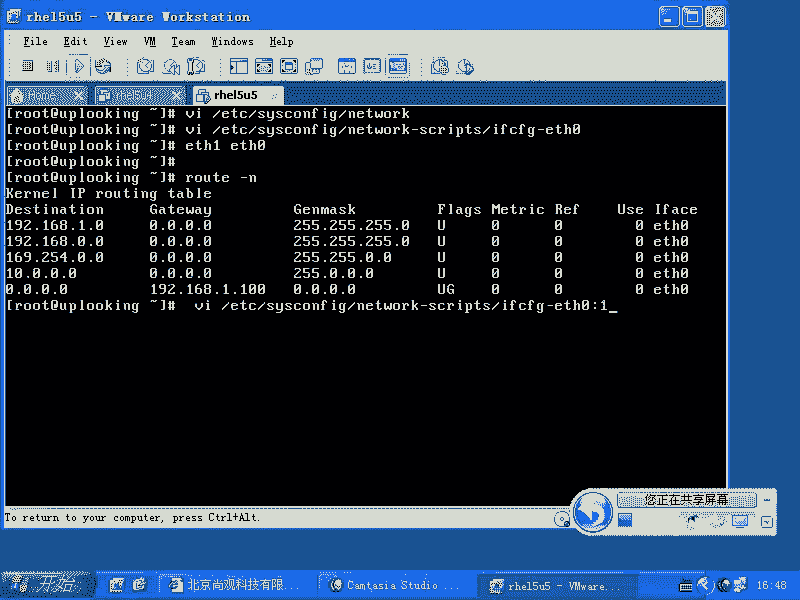

Yeah。盲打还不行啊。Yeah。😊，睁着眼睛也不行。😊，这太丢人了，这个地方的话我加了一个什么，我加了一个。😊，加异议是吧？gateway是吧，等于192。点168点。比方说这样的啊，就是等于12啊。

假如说是这样保存并退出，保存并退出了以后的话，我这样的service啊network。Re star。也就是我添加了另外在这个配置文件里面，添加了一个网关是吧？我重新启动了这个网络服务了以后。

咱们再看一眼。😊，root杠0。啊，他只他只给我生效了一个是吧？我再去添加一个吧。Well。哦，他可能是就是网卡不同啊。我看如果要是设置的网卡可能相同的话，它可能就会给我替换掉，是不是？

他可能是自己内部的这个脚本的话，它会处理。但是呢我有1个ET是011个ET是一的时候，它肯定会两个两个都出现。

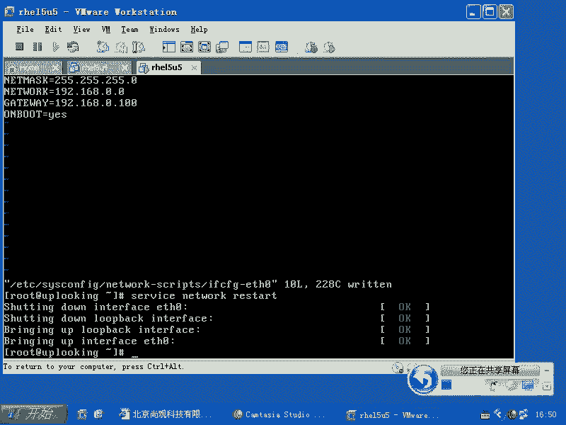

啊，OK这回的话是按照我的要求出现的。大家看现在的话是有两个网关，对不对？生效的是谁？谁排上面谁生下。因为计算机很简单。他并不会判断说哪个数据包是ETH0出去的，是不是他只会判断先去看什么路由表。

说我这个数据包要发送，我是通过ETH0发送，还是通过ETH1发送是吧？我一看路由表，OK我下面的话呢，如果要是访问一点什么什么的时候，是不是第一条路由啊，那么我就会让ETH0帮我发，对不对？

如果要是我看到什么呢？零这个网段也是ETH0帮我发，如果要这个网段，那么也是ETH0发，那么看到什么呢？看到。不是这些网段的其他网段，只要是其他任何的1个IP地址，我是不是就发给他呀，发给这个IP是吧。

发给这个IP谁发呢？通过一些这能去发，是不是？那么你们说第二条默认路由，还有。😡，还有成功就是使用的机会吗？没有任何程度使用地况。所以大家千万不要什么呢？设着多个网关啊，千万不要设置多个网关。

除非是你配置高级路由或者策略路由，明白吧？除以呃其实高级策略高级路由的话和策略路由也不是这样配，也不是这样添加两条路由。也就是你只要生效，它就肯定是什么，只有一条生降，不会说你想象的那样。

从哪个地方来的，通过哪个网关，不会有这样的情况。它这个路由表就这么简单，我是先去决定这个路由这个包怎么发，然后才去选定什么，选定这个网卡，不是先选定网卡，再去什么决定怎么发。明白吧？

他说看路由表来决定哪个网卡发看这样的一个路由，这样的一个数据包，目标地址是这个地方。那么我就通过什么ET是零去发。如果要是这个地如果要是这样的1个IP地址，这样的IP地址，这样的IP地址段。

我就通过这边发，是不是？不是他们不是他不是他也不是他的其他的IP地址，就通过默认路由来发，就说通过默认的ETH0发给谁啊，发给这个IP地址，对不对？所以第二条是永远不会生效。😊。

你们千万不要设置多个IP地址啊，设置多个网关。还有一点是什么呢？大家一定要记住啊，一台机器上有两个两个网卡。如果不是你们特殊要设置，比方说策略路由啊等等这样特殊设置。你们一定不要把它设置成同一个网段。

我一个网卡ETH呃，就是192198。0。1，另外一个网卡0。2是吧？我好记呀，1个ETH是0嘛，是吧，一是吧，ETH2。呃ETH1是2啊0。2。多好记啊，是不是？

但是呢只要这两个网卡不是插到同一个交换机上。是吧那你最后生效的是不是只有一个呀？你想啊，如果我有2块网卡，都是1。0这个网段的，是不是都是1。1。0这个网段的那这样的路由是不是会有两条？😊。

一个是ETH0，1个是ETH1，是不是？那么剩下的是什么？只有一个。啊，只有一个。那这个时候的话呢，你如果要发生这种情况就惨了。你说我这边有2块网卡，一个的话是连什么以以太网交换机是吧？

另外一个的话是做HA是吧，新跳线是吧？连接另外一个机器，是不是两个的话是同一个网段。那么我去想跟所有的零这个网段的人去通讯的时候，结果通过心跳线发给谁啊，发给那个直连线发给另外一台机器人。

那我始终都会连不到大家，所有的人都连不到，是不是？所以记住了，一个机器上2块网卡，不要设置什么同一个网段的IP不要设置两个什么。不要设置两个或者网。啊，这是一个最基本的常识，是不是？

那么你之所以愿意那样做，是因为你愿意的话呢，以自己的人的这种思维方式去想象电脑。但是电脑很傻，他没有那么聪明，不会去判断那么多东西。所以这个路由的话呢，我们跟大家说的比较清楚了。

那么路由操作的话怎么办呢？root啊root。Add。啊，比方说我现在想的想反问2。😊，20。0。0。0这个网段是不是m mask。是什么呢？255。255点。255。0啊，想访问他的时候。

那我这知道这是一个A类网嘛，是吧？但是我们就因为现在的话，A类网，B类网C类网实际上都没有什么太大区别了，是吧是？都已经那个早已经废除掉了，不是说我A类网，一定子网源码是1。

是不是啊一定是一定是25255。0。0。0是吧？那么这个早已经就废掉了。所以的话呢，现在我们用这样的这个方式添加一个什么呢？默认网关，当我访问它的时候，我把这个IP地址发我把这个数据包发给谁呢？

我没有办法直接连到这个网段，那么我把我的数据包发给谁呢？发给0。😊，啊。20呃200嘛，0。200这个IP地址对吧？那么这样一回。真是。这里边少了一个杠 night啊，杠 night这样添加啊。

杠 night这样一回车是不是添加上去了？然后呢，我们这样一看。是不是我这条路由就贴加上去了？对不对？这要路由就添加上去了。那么我这边是添加说当我想发送数据包给20。点0。0这个网段。

它的子网掩码是什么呢？3个255的时候，也就是相当于发送给20。0。0。120。0。0。2。0。254的时候，是不是这样的一个网段的时候，那么我就把数据包先发给谁啊？发发给0。200这台机器。

192168。0。20这台机器，对吧？让他帮我转发，他是我针对那个。那个区域的一个什么？网关是吧，是一个路由器，我要发给他，让他帮我转发，这是添加。那么想去删除的话，那怎么删除啊？

那你怎么写的就怎么删除嘛，对吧？如果要是你你现在的话呢想简写一些。😡，还是不行。删除掉了，是不是？出这了。那么如果要是我现在的话呢，想去调整默认路由怎么办呢？那么root。哎呃DEL是吧。

我觉得这两条默认路由的话太。太太差了是吧？那么DE呃EFAULT是吧，default。啊，然后呢，GW我把这个192。168。1。12这个。12这个删除掉是不是？然后呢，我还想删除另外一个，那么10。

100的话也想删除掉，这样的话就直接删除了啊。显示的话是这么显示，明白了吧？default当然了，你想去添加的时候，呃，或者删除的时候，删除默认路由的时候，你也可以这种方式到n是吧，0。0。0。0是吧？

net。mask是什么？2呃0。0。0。0，是不是？然后呢，这个GW这是新加坡认路由跟那个是一样的，192。168。1。12，这照样可以唉。这照样是可以的。刚才输错了啊，这样也行。

也就是说这个地方这么写，就相当于default，就等于default，这么写就等于default。对吧。清楚了啊，OK这边的话呢是有关路由的这些东西有关路由的东西。还有默认网关默认网关的话呢。

有好几个地方可以设置，是不是？但是我们建议大家只设置一个，对不对？只设置一个。好，回头的话呢，总结一下，看一下设置IP地址，设置DNS服务器，设置网关是吧？这些东西分别放在哪个位置，分别放在哪个位置。

放在哪些文件里面。啊，相关的命令是什么？我们跟大家说了一下，在讲到默认网关的时候，我们告诉大家，默认网关最好设定一个多个网卡也设定一个默认网关是吧？

多个网卡最好不要设置成同一个网段的IP那么除非是你有非常充足的理由。比方说你有两个网卡，两个网卡接到同一个交换机，对不对？这样的话呢，我们就没什么好说的了。或者你做了策略路由是吧？或者高级路由，对不对？

那这样的话呢，是你额外的这种需求，但是一般情况下千万不要设置成同一个网段。好吧。反正我原来的话呢犯错误的时候啊，就是说出来不怕大家笑话是吧？反正我在原来做项目的时候。大约2001年吧。

我在这边噼里啪啦敲，哎，我说怎么回事啊？我设置了1个IP地址，设置什么东西呢？我有。不太不太记得。反正犯了一个非常愚蠢的错误啊啊，我设置IP地址，我设置成200点200点200。1啊。

或者200点200点什么，反正这个IP地址不是保留地址。我们一般就是在内网是吧，我们要用保留地址是吧？要不然会跟外网的IP冲突，是不是？我说我设置这个IP地址，又不会跟别人。

就是我感觉好像当时设置的没什么，是吧？然后呢，旁边一个同事啊，我们的同事也很委婉的这样说。哎，你在哪学的网络是吧？他也不说你怎么不用保留底人，你在哪儿学的网络，后来我才慢慢明白说人家说话是什么意思。

但是后来的话呢，我说这个设置多两个网卡设置同一个网段啊，那我也在那边吭哧吭哧一半天的话，不知道该该怎么做啊啊，我怎么老是连不上啊，这都是原来做项目的时候的一些傻乎乎的教训，是不是？

但是呢没有人会跟大家直接这么说啊，慢慢的话自己出现几次错误以后才会琢磨过来。😊，好，这边的话呢就是这个路由方面的问题是吧？我们可能还要再坚持一下啊。

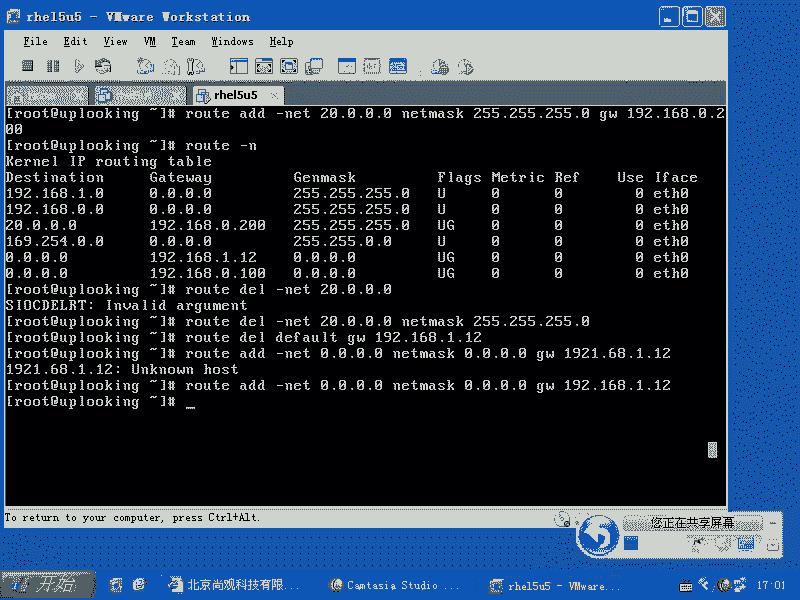

好，稍等一下。