# 尚观Linux视频教程RHCE精品课程：P47：RH133-ULE115-6-1-network-ifconfig-ip-route-config


## 概述
在本节课中，我们将要学习Linux系统中网络配置的核心知识。我们将了解Linux强大的网络功能，并学习如何使用`ifconfig`、`ip`和`route`等命令来配置网络接口、IP地址和路由表。课程内容将涵盖从驱动加载到IP地址设置的完整流程，旨在让初学者能够清晰掌握Linux网络管理的基础操作。

## Linux网络功能概述
Linux系统的核心优势之一在于其强大的网络功能。Linux内核中包含了完整的TCP/IP协议栈以及各种安全组件，如`iptables`。此外，系统还提供了丰富的网络设备驱动和应用程序。许多网络设备，如无线路由器、负载均衡器甚至高端防火墙，其内部运行的操作系统很可能就是Linux。

## 网络驱动加载与查看
上一节我们介绍了Linux网络功能的整体架构，本节中我们来看看如何加载和查看网络接口。

网络设备驱动通常以内核模块（`.ko`文件）的形式存在，位于`/lib/modules/{内核版本号}/kernel/drivers/net/`目录下。要让系统启动时自动加载驱动，可以编辑`/etc/modprobe.conf`或`/etc/modprobe.d/`目录下的配置文件。

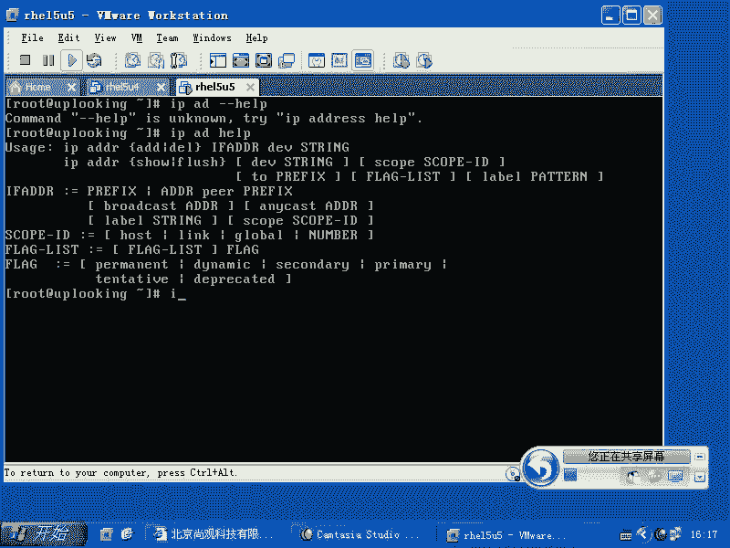

**示例：加载网卡驱动**
```bash
# 将驱动模块名写入配置文件，例如使用8139too驱动
echo “alias eth1 8139too” >> /etc/modprobe.conf
# 让配置生效
modprobe 8139too
```
驱动加载成功后，使用`ifconfig`命令可能仍然看不到该网卡（如`eth1`），这是因为`ifconfig`默认只显示已配置IP地址的网络接口。需要先为接口分配一个IP地址，它才会显示出来。

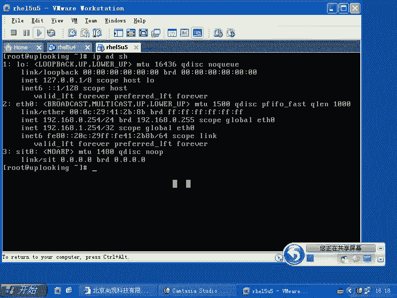


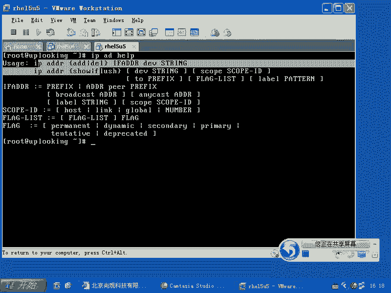

## 配置IP地址：ifconfig与ip命令
网络接口驱动加载后，下一步就是为其配置IP地址。Linux提供了传统的`ifconfig`命令和功能更强大的`ip`命令。

`ifconfig`命令是Unix系统通用的网络配置工具，但功能相对老旧。`ip`命令是Linux特有的工具集，功能更为强大，某些由`ip`命令配置的接口或地址可能无法被`ifconfig`识别。

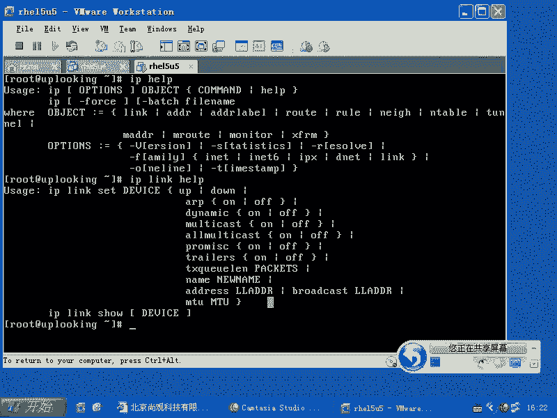

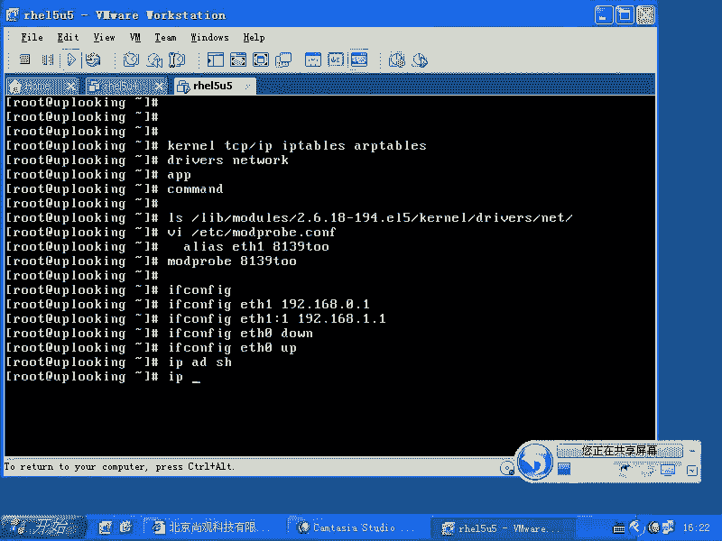

以下是`ifconfig`的常用操作：
*   **查看已配置接口**：`ifconfig`
*   **为接口配置IP**：`ifconfig eth1 192.168.1.100 netmask 255.255.255.0`
*   **启用/禁用接口**：`ifconfig eth1 up` 或 `ifconfig eth1 down`
*   **添加虚拟IP**：`ifconfig eth0:1 10.0.0.1 netmask 255.255.255.0`

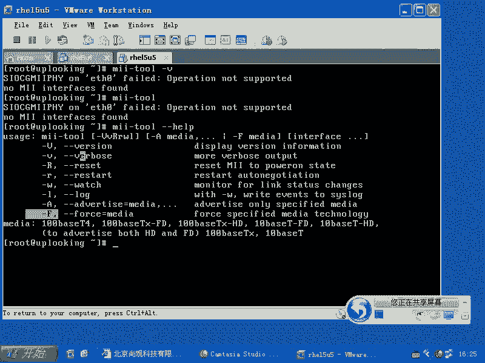

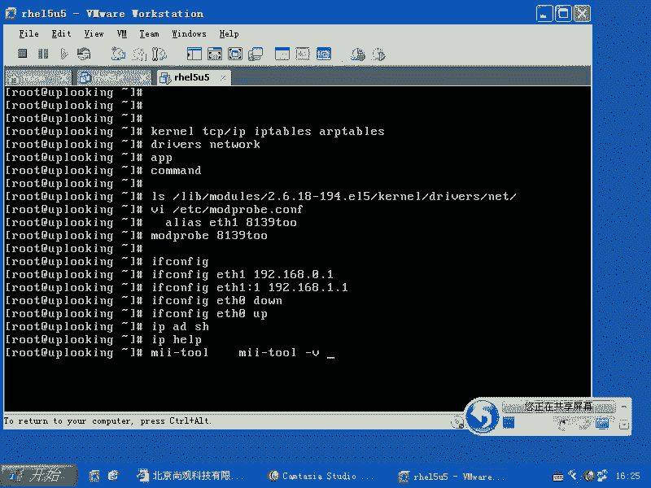

`ip`命令属于`iproute2`软件包，其功能以子命令形式组织。最常用的是`ip address`（可简写为`ip addr`或`ip a`）子命令。

以下是`ip address`命令的常用操作：
*   **查看接口地址**：`ip address show` 或 `ip addr show dev eth0`
*   **添加IP地址**：`ip address add 192.168.1.254/24 dev eth0`
*   **删除IP地址**：`ip address del 192.168.1.254/24 dev eth0`

**注意**：使用`ip address add`或`ifconfig`命令配置的IP地址在系统重启后会失效，属于临时配置。

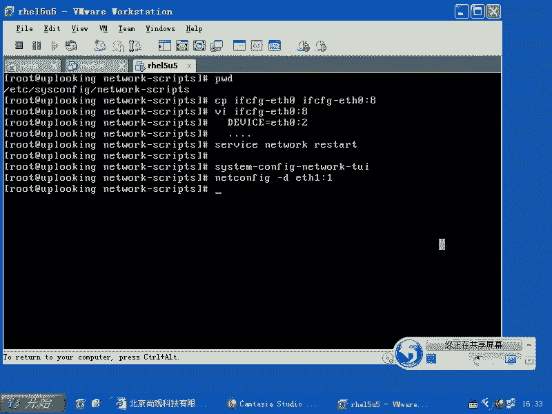

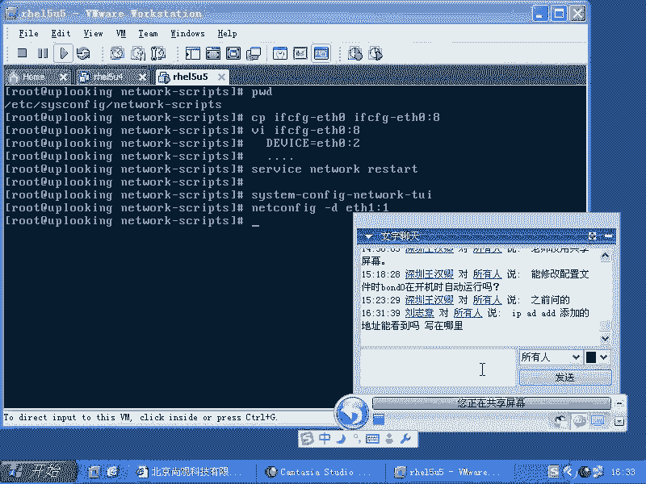

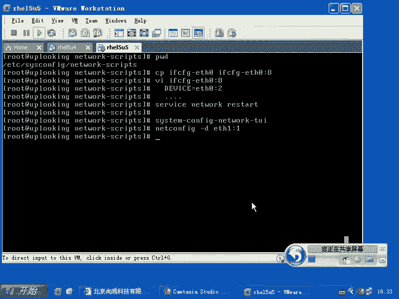

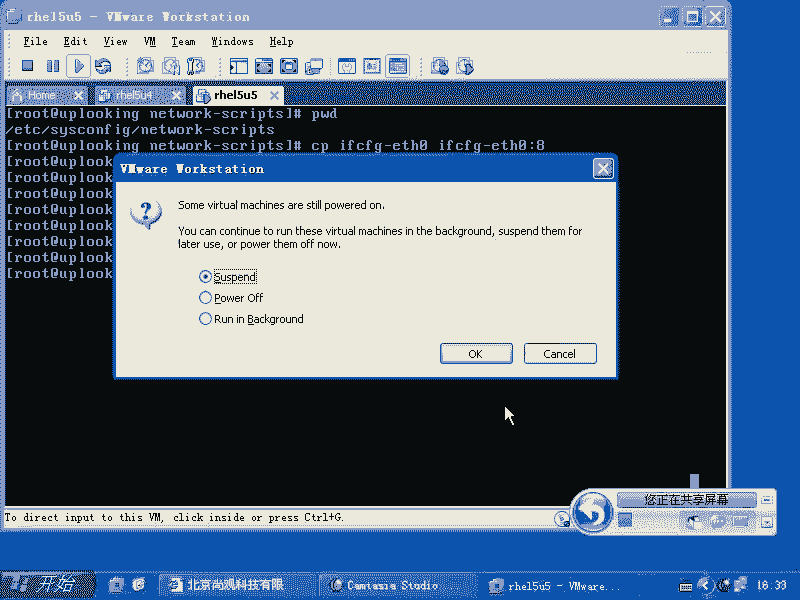

## 永久网络配置
为了使网络配置在系统重启后依然生效，需要修改配置文件。网络接口的配置文件位于`/etc/sysconfig/network-scripts/`目录下，命名格式为`ifcfg-{接口名}`。

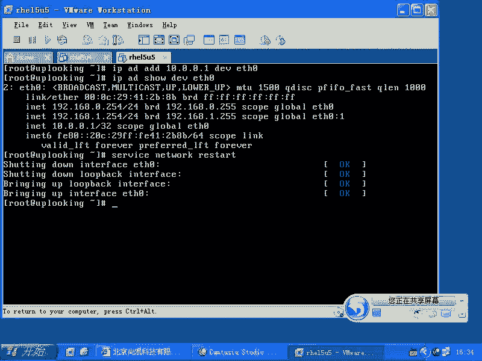

例如，为`eth0`配置静态IP，需编辑`/etc/sysconfig/network-scripts/ifcfg-eth0`文件，内容如下：
```bash
DEVICE=eth0
BOOTPROTO=static
ONBOOT=yes
IPADDR=192.168.1.100
NETMASK=255.255.255.0
GATEWAY=192.168.1.1
```
若要为`eth0`添加第二个IP地址（别名），可以复制配置文件并修改：
```bash
cp /etc/sysconfig/network-scripts/ifcfg-eth0 /etc/sysconfig/network-scripts/ifcfg-eth0:1
vi /etc/sysconfig/network-scripts/ifcfg-eth0:1
```
然后将`DEVICE`改为`eth0:1`，并修改`IPADDR`为新的地址。修改完成后，重启网络服务使配置生效：
```bash
service network restart
```
或
```bash
systemctl restart network
```

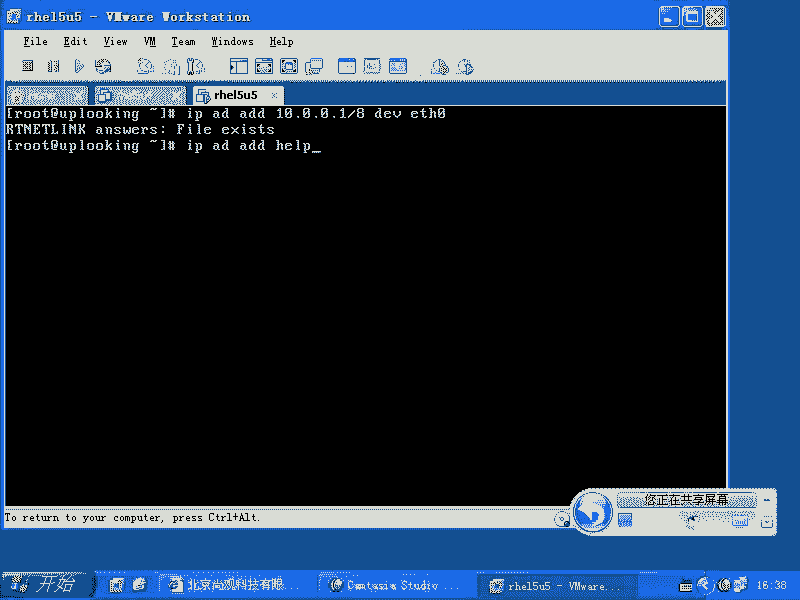

## 路由配置与管理
配置好IP地址后，我们还需要管理路由表以确保数据包能被正确转发。Linux使用`route`命令来查看和修改内核路由表。

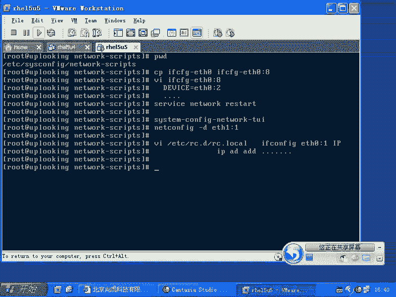

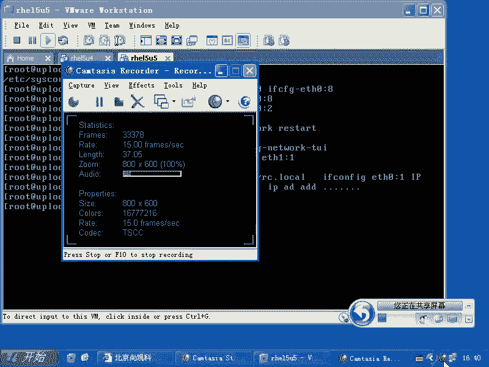

以下是路由管理的基本操作：
*   **查看路由表**：`route -n` （`-n`参数表示不解析主机名）
*   **添加路由**：`route add -net 20.0.0.0 netmask 255.255.255.0 gw 192.168.1.200`
*   **删除路由**：`route del -net 20.0.0.0 netmask 255.255.255.0`
*   **添加默认网关**：`route add default gw 192.168.1.1` 或 `route add -net 0.0.0.0 netmask 0.0.0.0 gw 192.168.1.1`
*   **删除默认网关**：`route del default gw 192.168.1.1`

**重要注意事项**：
1.  **避免多个默认网关**：在有多块网卡的情况下，系统通常只生效一个默认网关路由。在多个接口配置文件中设置`GATEWAY`会导致路由冲突，应只在一个地方设置。
2.  **避免同网段IP**：同一台机器上的不同网卡，尽量不要配置同一网段的IP地址，除非有特殊需求（如做链路聚合或策略路由），否则可能导致路由混乱，网络不通。

## DNS与主机名配置
除了IP和路由，域名解析也至关重要。DNS服务器地址在`/etc/resolv.conf`文件中配置。

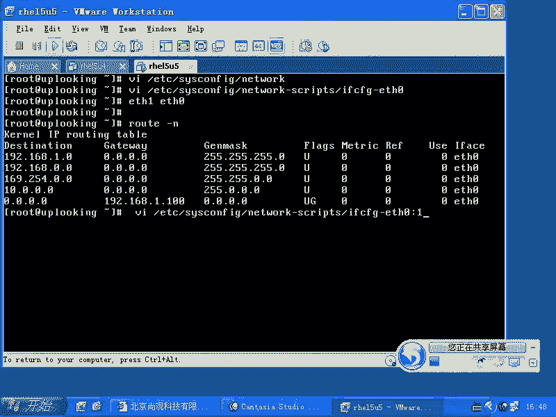

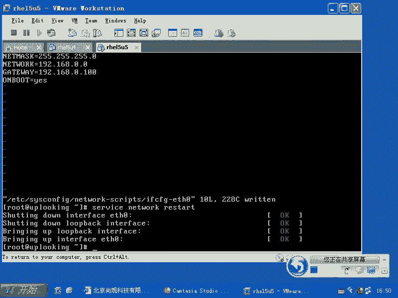

**示例：/etc/resolv.conf**
```bash
nameserver 8.8.8.8
nameserver 114.114.114.114
search example.com
```
其中，`search`参数指定了域名搜索后缀。当解析不完整的主机名时，系统会自动尝试加上该后缀。

主机名和默认网关的全局配置可以在`/etc/sysconfig/network`文件中设置。
```bash
NETWORKING=yes
HOSTNAME=myhost.example.com
GATEWAY=192.168.1.1
```

## 网络服务管理
Linux的网络功能由`network`服务管理。需要确保该服务在合适的运行级别下自动启动。

以下是服务管理的常用命令：
*   **设置开机自启**：`chkconfig network on` （SysV Init）或 `systemctl enable network` （Systemd）
*   **启动/停止/重启服务**：`service network start/stop/restart` 或 `systemctl start/stop/restart network`
*   **清空iptables规则（测试时）**：`iptables -F`

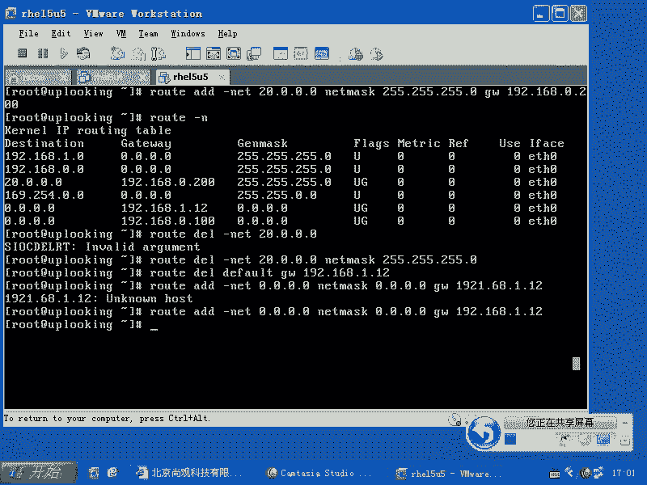

## 总结
本节课中我们一起学习了Linux网络配置的核心内容。我们了解了Linux强大的网络地位，掌握了使用`ifconfig`和功能更强大的`ip`命令来配置网络接口和IP地址。我们重点学习了如何通过编辑`/etc/sysconfig/network-scripts/`下的配置文件来永久保存网络设置，以及如何使用`route`命令管理路由表。最后，我们还介绍了DNS配置、主机名设置以及网络服务管理的基本命令。记住关键原则：谨慎配置默认网关，避免为多块网卡设置同网段IP，这是保证网络畅通的基础。