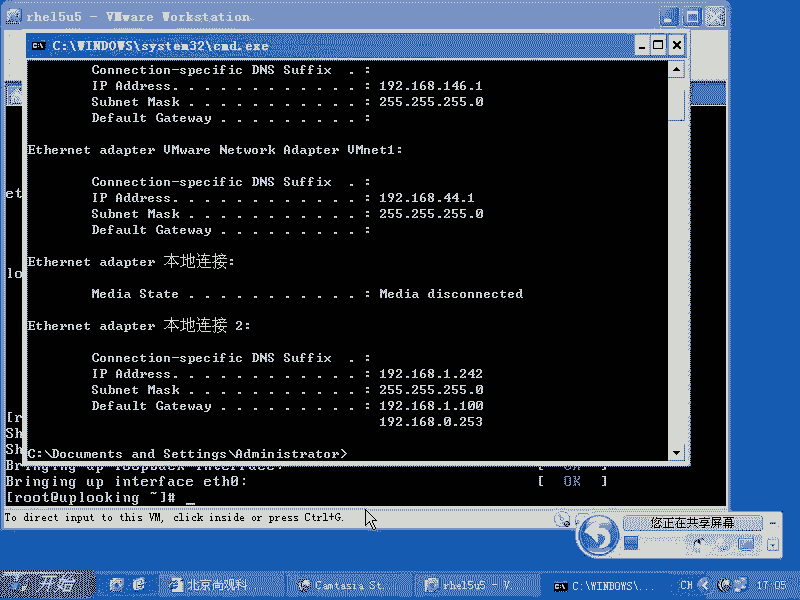
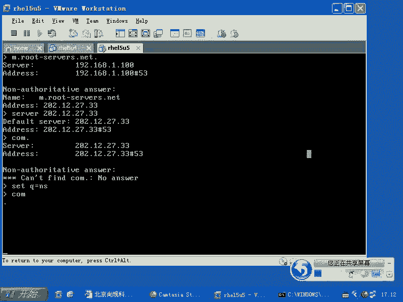

# 尚观Linux视频教程RHCE 精品课程 - P48：RH133-ULE115-6-2-network-command-troubleshooting - 爱笑的程序狗 - BV1ax411o7VD

好。好，我们看一眼啊，就是说当我们现在的话呢这个系统啊想去进行调整的时候，就是说我们刚才都是在配置是吧？配置完了以后，我们现在想去测试，或者想去确定问题在哪的时候，大家看我们这样几个命令啊。

那么首先你们知道P命令，是不是？😊，那么在linux里面的话，在以前H14里面的时候，我还经常用什么呢？pin杠B就是pin个广播包，是不是？这样的话呢？你要说我拼不通，你是点对点拼不通是吧？

到底是你没连接到网络还是我没到连接到网络，我可以拼个广播包是吧？假如说有人给我回应，说明什么，说明我连接到网络了，你没连接到是不是？随以说聘广播包的话呢，后面加上一个什么呢？1918。0。

01个网段的IP地址。这样的话，你可以拼个广播包，这是拼。当然了，拼命令的话，你加上杠杠help的话，你可以看。😊，我拼了包。可以控制大小，我可以拼一个大包是吧？我看网络的这个延迟怎么样等等啊。

我还可以拼个什么呢？小包看一下速度，然后呢，我还可以怎么样呢？呃有其他的选项，比方说设置它的什么跳数啊，最大的跳数等等。那么如果要是你现在觉得这个命令。听不通。那可能的结果是什么？可能的结果是什么？

有可能是中间哪个地方断了，是不是？那么你可以用什么呢？traro啊不是不是ter的是吧？traer是windows下的命令是吧？那么ch root，然后呢加上1个IP地址，比方说3W点c点com。

你看哪儿不通，对吧？但是这个命令的话呢，没有另外一个强，另外一个是什么MTR啊，就是说呃某某人的这个ter是吧？这个人的话又把traer上写了一下，他那个表可是太强大了，强大到什么程度呢？😊。

我这个网络我不知道现在通不通啊，我可能只要把它调通的话，大家才能看得到。我要看一眼啊。はん。就大家一定要我强烈推荐啊。强烈推荐。

我再看一眼windows下这个。windows下是一啊1。100。

0。2541。254啊。看能不能听能1。1版能听懂网关是吧？那我现在需要做的是什么呢？root add哎，root杠嗯我看一眼，看一眼哎1。100是吧，只1。10版。然后呢。

我再去VIETC下的RESORESOLV点com这也是1。100是不是？那么这样的话呢，我来。😊。

看下MTR是吧，3W点。

C娜点comM。那么你能看到你在这边到那边所有的跳数，就是经过哪些路由器，每个路由器的什么掉包率是多少，强不强？超强啊。真的超强。你现在的话呢，以前的话你只知道通不通是吧？现在你不只知道通没通。

哪个地方不通，还知道哪个路由器它的负载过高。原来的话呢，我在这边我们我们经常上网觉得怎么那么慢是吧？为什么那么慢？我一看。网通的那个就是那个ADSL还是什么？我们这边还有个小区宽带啊。

那小区宽带连上去以后，调包率是50%。也就是说它的那个线路啊，它是怎么给你调包的，他就直接把你的包乱扔，你知道吗？扔50%，扔50%的话，你觉得你那个数据数据能快吗？那肯定很慢。

所以这边的话你能看到你看现在这个掉包率是不是零啊？那表示网络线路非常棒，是不是非常棒。然后呢，这边就是说最后一个数据包，它的速度是多少，到那个点的话，速度是多少是吧？然后呢，你如果要是看google啊。

你们要看google，你还能经常或者雅虎啊，你能看到什么呢？到底哪个地方是岳阳的，就是跨过太平洋海底电缆在哪？😊，看到了吗？你看这边的话呢还都是什么？比方说58是吧，一下变成200多了，是吧，说明什么？

这段时间它这个数据胞在传输通过什么太平洋。ふふふふ。大。真的合。那为什么有些有些IP地址的话，能反向解析出域名呢？这就是国外的话呢做的比较规范，他把路由器也注册成什么，也去就是创建那个DNS的反向解析。

也就是能通过IP地址反向解析出什么？域名了，这个域名它不是给主机的，而是给路由器的，让你知道这个路由器到底是干什么用的。但是咱们国家的话呢，就是这种政府的这种企业的话呢，他不愿意让你知道太多是吧？

认为这是国家安全是吧？或者说呢没有必要去告让你告诉，所以他就没有去注册这些，所以说不太规范啊，但美老美的话呢，他可能是愿意这样做啊。你像这个IP地址的话，反向解析出了这么多域名是吧？

那这个地方是不是非常好？这个ter的话呢相对来说就会什么呃，tce rot的话呢，它就会就是简单一点，明白了吧？这命令好不好？😊，非常好啊，强烈推荐啊强烈推荐。然后呢，这就是链路上到底通没通。

是不是链路上到底通没通？那么如果要是你DNS解析的话呢，那怎么样？你首先可以聘一个什么域名是吧，你看它能不能解析出来，是不是？还可以怎么样呢？还可以用dig啊dig来解析这个域名。😊，还可以用什么呢？

还可以用呃。对NS lookup还有什么呢？hos是吧， host。还可以用什么呢？NSlook up。Look up。但是NS lookup的话呢，它本身的话呢是一个交互式的命令。

比如这个交互式的命令的话呢，它可以让你你比方说呃曾经有过这样的事情。我记得在02年的时候，那个时候google还没进来是吧？google还没进来，但是google总是发表一些反动的这种信息是吧？

然后让咱们国家的政府很火。然后呢，当时我记得大家访问3W点google点com是吧？它就被转到百度那个IP去了。啊，也就是说人家直接的话呢，就直接把这个域名怎么样给你就是截截掉。

然后直接篡改了这个记录了。但是这时候你说啊。那我的DS为什么它能这样做呢？因为这个DS的话是受那个网通或者说电信的这种控制，是不是？所以的话呢当我们想去换1个DS服务器，想解析一个结果的时候。

那你可以用NSlookup你要说我到两个服务器上去，我看一下哪个这个服务器的话，解析的结果有没有不同，对吧？那么我想到google自己的DS服务器上去解析这个IP地址，对不对？那你想这样做的时候。

那么你就可以用NSlookup怎么用呢？这样子用Nlookup它默认情况下登录到的是就使用的这个呃服务器的话呢，是你自己本身那个服务器是吧？那么你可以输入一个什么。对吧他帮你解析出来。

是吧然后你还可以用什么呢？server命令啊，server命令。呃，你比方说你这样的啊，先set呃server。211。连91。120。129，我访问另外一台DS附近，是次我去查询另外一个地址是吧？

我看他能不能帮我查查询出来是吧？他如果要是能帮我查询出来，那么这就说我是从他那边获得的数据。他如果本身没有这个数据的话，他会帮我递归。他如果不愿意帮我递归，就是这种结果。啊，或者是什么呢？

或者这台服器已经挂了啊，我不知道到底能不能用啊，我因为我一直没有拼通过它。但是我们的话呢一般就是我现在找几个靠谱的DNS服务器啊。你看。我这样的setq，我要查询的不是A记录。

我们一般3W这种记录都是A记录是吧？setq等于什么呢？N。NNS啊NS记录。然后呢，我这边查找什么呢？查找点就是root就是DNS里面的根，是不是？我们一般3W点C纳点com后面还有个什么点是吧？

那么现在告诉你世界上的这种DNS就是说这种根服务器的话呢，实际上是有这么多啊，我们找出其中一个来，然后呢输入什么呢？setq等于A啊，我们查询的是A记录，然后呢，我们这样的。

把这个记录填在上面，他告诉我这这台服务器是什么呢？这个是不是？然后呢，我自己来做递归setq呃，不是soer。是不是我现在要查这个D端服务器，是不是？查这个DNS服务器，查到了以后。

我这样的回车查到这个DNS服务器了以后，那我问他什么呢？

点这个地方点的下集是什么？come night。😡，CN是这的是吧？我现在说的是又是s呃，又是什么呢？查询come一点，come一点是由哪个服务器负责？😊。

哎？siteQ等于NS啊，然后呢，我这边再去怎么样呢？看。你又没反应了。好吗。

是网络不通还是怎么样？这个IP地址，要么就是这个服务器不不响应我的请求。啊，有这么多啊。上面这个哎。上面这些是吧，它它是速度比较慢，是不是？😡，你看我们查的是com是吧，com的服务器是由这么多负责的。

是不是com的服务器由这么多负责，我们找出其中一个来，比方说要求2。33。14。30，是不是找这台机器。然后呢，我们这样的ser是吧，我再去查那个机器，是不是查那个机器，我问他什么呢？google。😊。

点com是不是嗯，我说google点com是由哪个DNS服务器负责的，是不是？然后这样直接回车。他告诉我，google点com它有google公司有4个DNS服务器。这个DNS服务器的地址是？😊。

那么于是的话，我查到这个了以后，我把它。

选择下来，然后我再输入什么呢？ser，然后再加上什么这个IP址一回车，哎，我就找到了真正google自己的BS服务器是吧？嗯这时候我再去查询3W的记录，它还能有错吗？

谁能篡改吗？因为我不是查询网通的DS服务器，也不是查询什么哪个哪个地方DS。我是直接查询google的DS服务器，是不是？然后这时候我说什么呢？3W的主机是吧？3Wgoogle点com啊。

他到底有哪个IP地址，他告诉我说。😡。

是这个IP地址啊，那么它是一个什么呢？别名记录是吧？那么我这边的话呢是setq等于A啊，然后呢我还是查询刚才那个就是google。

3W点google点com它是多少呢？它还是这个别名记录。这个别名记录的话，我再去查询他的什么A记录，是不是我再去查询他的IP地址多少，他告诉我。

IP地址是这个啊，那我就找到了真正的google它自己的服务DS服务器上设置这个IP地址，是不是？所以NS lookup它比起dig来比起host的来强是强在这个地方，绝不是后面加上1个IP地址。

直接回车就完事。明白吧？这是整个的一个过程，大家到时候的话呢可以自己来看一眼啊，自己来看一眼。

好。我们的话呢基本上讲的差不多了，呃，还有一些什么命令啊？呃，你要想用FTP的话，LFTP啊，这是1个LFTP的非常好用的构端。当然了，你可以用什么FTPFTP的话呢就是特别麻烦。你连命名账号。

你都要输入匿名账号的那个名字，密码为空，然后登录进去，明白吧？所以的话这个FTP直接用的话是不好用的，你不如用什么LFTP是不是？还有什么呢？你要想SSHSSH是不是S copy对不对？net是不是？

那么我们通常情况下的话呢，如果想测试对方的一个机器能不能通，是用pin是吧？我想测试对方的一个机器上的一个端口，能不能通，应该怎么办？😊，是不是对方的IP地址是吧，加上一个什么端口，哎。

我怎么老SSA是不上的？我想看能不能访问到对方的22端口，对不对？te到他的22端口去，如果有反应，那说明什么？那说明对方是通的是吧？如果要是返回的结果超时，那就说明什么不通，对不对？

这是t这是测试对方的IP地址的这个端口有没有打开啊，那么如果要是你有没有收到对方的包，别人怎么连接不到你，你说你发包了吗？是你的问题，然后呢，你说是你的问题，他说什么呢？是你的问题是吧？两个人打起来了。

那你要验证一下怎么验证呢？用TCP啊，你抓包在你的迹像监听什么呢？比方说22端口，看他发的数据包到底你能不能收到。如果你收不到，说明这个链路中间有哪个地方有问题是吧？你收到了没有回应。

说明你的应用程序有问题。😊，所以总是化呢再去确定这些问题，是不是我们知道IP是不是通，就链路有没有通。DNS解析有没有问题？对方的端口有没有打开？😡，对方有没有收到这个数据包？😡。

是不是这几个命令是不是都跟大家说清楚了？啊，如果要是你想在文本界面上去访问对方的什么呢？访问对方的这个web服务器，用什么呢？Elinks啊，elink或者什么呢？

原来的话有一些什么linkux之类的命令啊，你可以直接访问对方的网站啊，在文本界面上去访问。😊，再稳稳接外翻还可以怎么样呢？就是当你的话呢想去下载的时候，W get。😊，啊。

直接加FTP啊、HTTP呀等等。那么它支持断点续传，它可以把整个的一个网站全都抓起来。从首页开始抓抓三层。首页上不是有很多链接吗？嗯全都抓下来。首页上第二级的页面再去抓啊，抓三层，你可以抓四层，抓5层。

把整个的整站都荡起来。W get非常强的一个东西，更别提什么下载FTP下载HTTP断点续传啊，它全都可以搞定。这个W get它是在文本界面上运行的。明白了吧。好，OK那咱们的这个网络命令这个地方的话呢。

就给大家讲到这边。那么同时的话刚才我们给大家介绍了什么？就是traubble shootinging网络的troubble shootinging的时候的一些问题，是不是？

那么你可以去判断你的哪个网卡link了，哪个网卡没有link，用MII杠two，是不是你可以拼，你可以pin对方，你可以看整个的链路哪个地方断了，是不是？😊，然后呢用traro或者MTR是吧？然后呢。

你可以看域名解析是不是有问题，哪有问题，对不对？你可以用什么呢？就是说pin也可以用host，也可以用这个。如果你要交互式的去寻找这个DNS体系里面的真正的问题所在。

你可以用NS lookup来交互式的去寻找，对吧？然后呢，如果要是你拼得通对方，就是连接不到对方的某个服务，你可以tellnet到他的那个端口去，看有没有打开。那么对方的话到底有没有收到你的视包。

可以用TCP当口来抓这个包，如果抓到有说明什么？你的视标发过去了，但是他没有响应，但是应用程序的问题，对吧？所以在咱们这一个地方的话是一步一步一步一步判断问题所在，是不是判断问题所在。

所以这个地方的话呢，希望大家那个就是搞清楚以前的咱以前的以前的HCE这个考试的话呢，还有个 troubleing，它就自动把你的什么IP地址改掉了啊，你的IP地址那个IFCFG那个文件。

比方杠ETH0哪个IP地址改掉，然后你再把它改回来就好。也就最终的话你要确定你的IP地址到底是怎么样的，实际上用一个sstem杠卡这个杠network可以把自己的IP地址搞改回来，是不是？然后呢。

你还要注意什么呢？就是在那个目录下。😊，在这个目录下。这个IFCFCG开头的文件啊到底有多少个？1个LO回还设备就是127。0。1的是吧？一个你自己这个自己这个网卡的是吧？假如说他又给你设定一个。

每次的话都把你的设定那个网卡给你怎么样自动替换掉是吧？那你不管怎么设你的IP地址是不是都会被别人替换掉。所以这个时候的话呢你要注意，你要保证的话，在这个目录下，每一个文件你都清楚啊。

确确实实知道它是什么，就是给你这个东西做配置是有用的，是吧？别人家给你超过数定是给你搞了一个这个文件，然后呢，总是替换掉你的什么IP地址，比方说我把ETH0冒号8这个地方的dice也改成ETH0。

那你只要一启动这个服务，你尽管你设置了无数次ETH0的IP地址，对吧？但是他总被什么ETH0冒号8怎么样替换掉，所以你要保证这些文件的话呢，都是在你的控制之内。😊，对不对？

OK那么今天的内容的话就到这儿。