# 尚观Linux视频教程RHCE精品课程：P48：网络命令与故障排查 🛠️


在本节课中，我们将学习一系列用于网络配置测试和故障排查的Linux命令。我们将从基础的连通性测试开始，逐步深入到DNS解析和端口检查等高级诊断技术，帮助你系统地定位和解决网络问题。

## 网络连通性测试命令

上一节我们介绍了网络配置，本节中我们来看看如何测试网络连通性。以下是几个核心命令。

### Ping命令

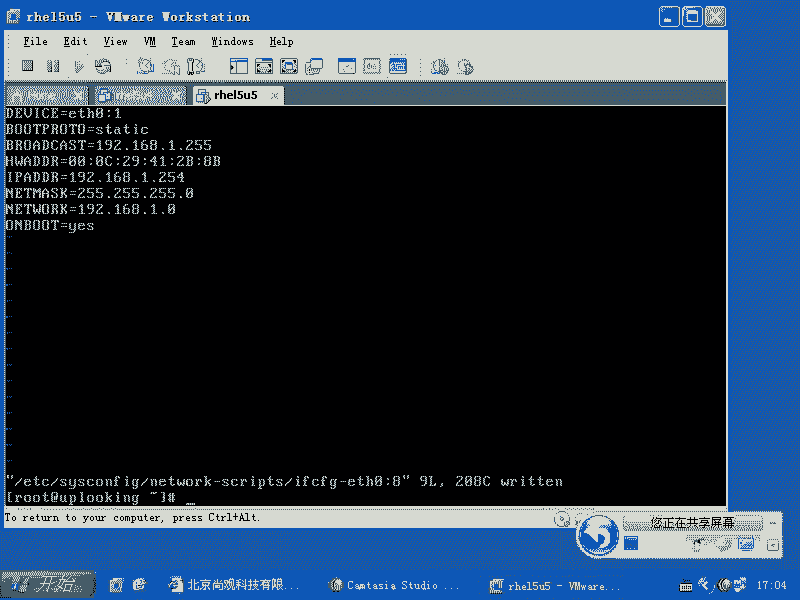

`ping` 命令用于测试与目标主机之间的网络连通性。其基本语法是向目标IP地址或域名发送ICMP回显请求包。

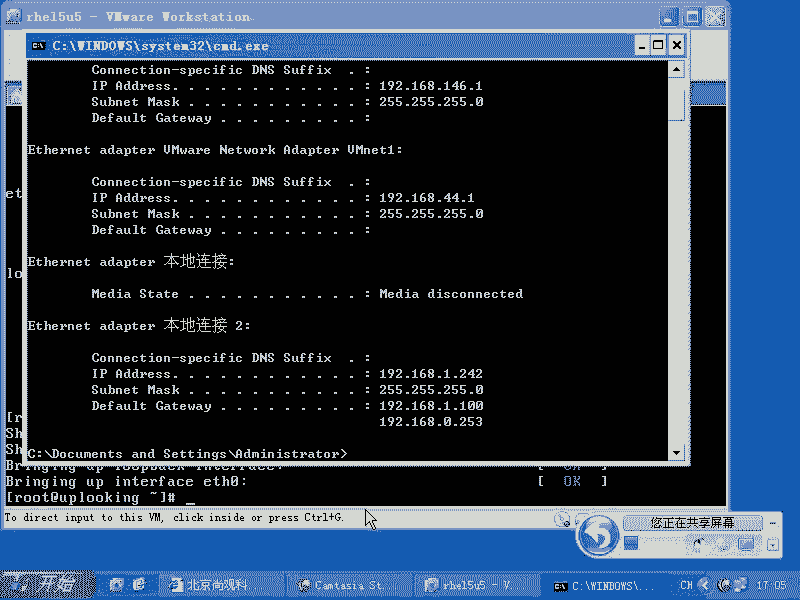

```bash
ping [目标IP或域名]
```

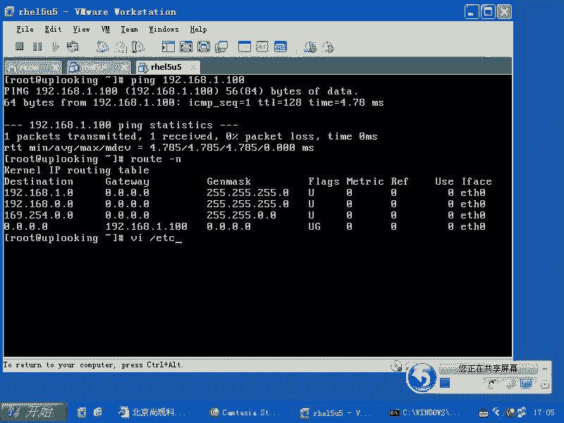

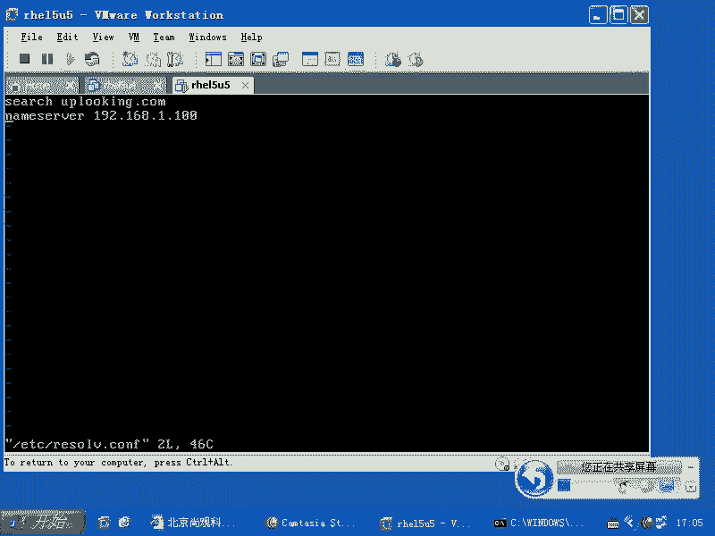

你可以使用 `ping -b` 选项发送广播包，例如 `ping -b 192.168.0.1`。如果网络中有主机响应，则表明你的主机已连接到网络。`ping` 命令还支持其他选项，如 `-s` 控制数据包大小，`-t` 设置TTL（生存时间）以测试路径。

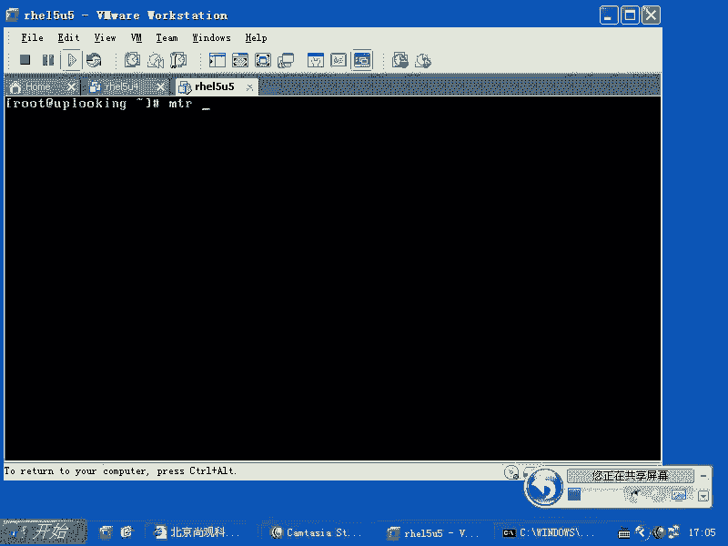

### Traceroute与MTR命令

如果 `ping` 不通，可能是网络路径中的某个节点出现了问题。`traceroute` 命令（在Windows下为 `tracert`）可以显示数据包到达目标主机所经过的每一跳路由。

```bash
traceroute [目标IP或域名]
```

然而，一个更强大的工具是 `mtr`，它结合了 `ping` 和 `traceroute` 的功能，并能实时显示每跳路由的丢包率和延迟。

```bash
mtr [目标IP或域名]
```

运行 `mtr` 后，你将看到一个动态更新的表格，清晰展示到目标地址路径上每个路由器的丢包率和响应时间。这对于诊断网络缓慢或中断问题极为有效。

## DNS解析问题排查

网络链路通畅后，下一步是检查域名解析是否正常。以下是用于DNS诊断的命令。

### 基础DNS检查

首先，你可以尝试 `ping` 一个域名，看其是否能被正确解析为IP地址。

```bash
ping www.example.com
```

此外，`dig` 和 `host` 命令可以直接查询DNS记录，获取更详细的信息。

```bash
dig www.example.com
host www.example.com
```

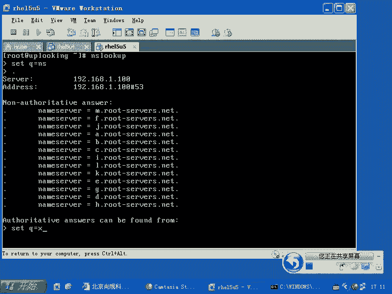

### 交互式DNS查询：nslookup

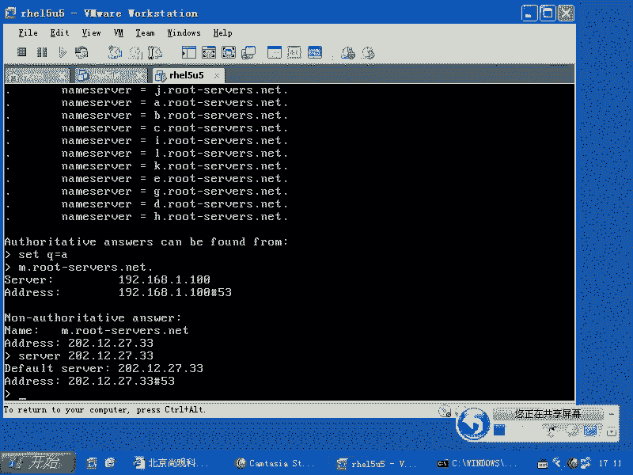

`nslookup` 是一个交互式命令，功能更强大。它允许你指定查询的DNS服务器类型和记录类型，并手动进行递归查询，以验证DNS解析链的完整性。


进入 `nslookup` 交互模式后，你可以执行以下操作：
*   使用 `server [DNS服务器IP]` 指定要查询的DNS服务器。
*   使用 `set q=[记录类型]` 设置查询的记录类型，如 `A`、`NS`、`MX`等。
*   通过从根域名服务器开始，一步步查询权威DNS服务器，最终获得最准确的解析结果。这个过程可以帮你判断是否是本地ISP的DNS服务器篡改或缓存了错误记录。

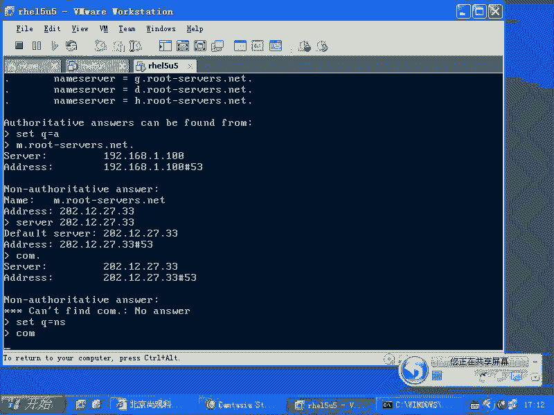

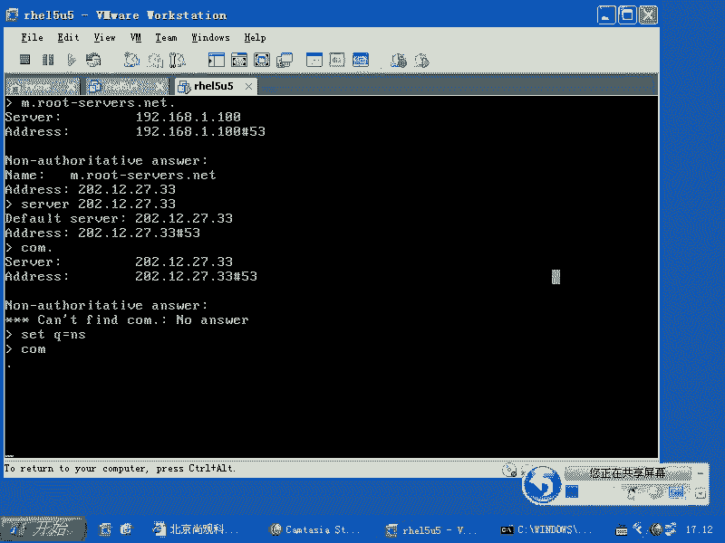

## 服务与端口可用性检查

如果网络和DNS都正常，但无法访问特定服务（如Web或SSH），则需要检查服务端口。

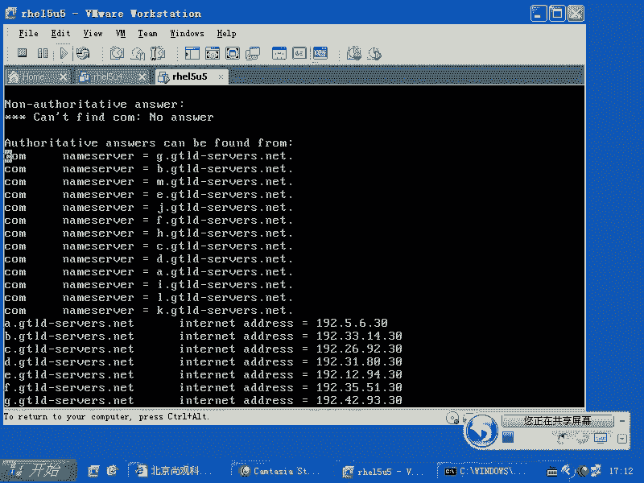

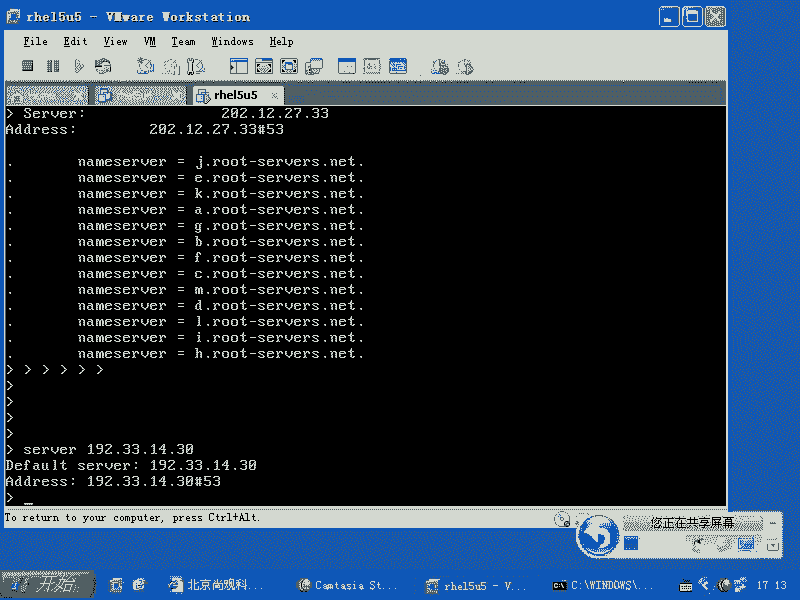

### Telnet测试端口

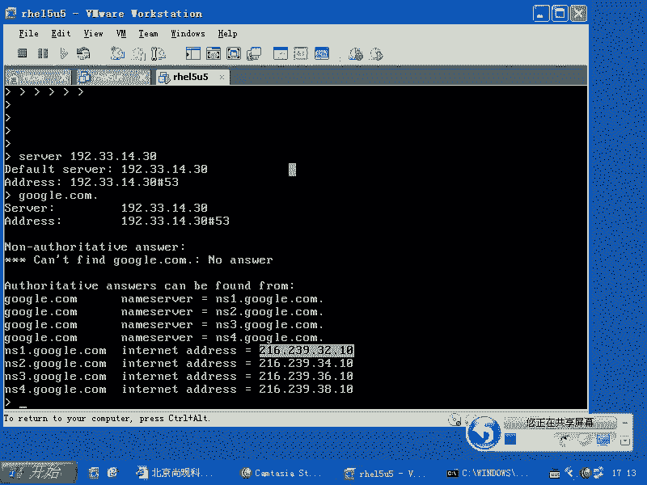

`telnet` 命令可用于测试到目标主机特定端口的TCP连接是否成功。

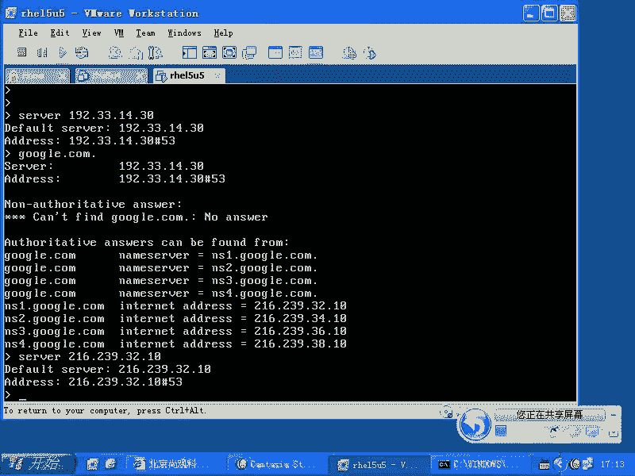

```bash
telnet [目标IP] [端口号]
```

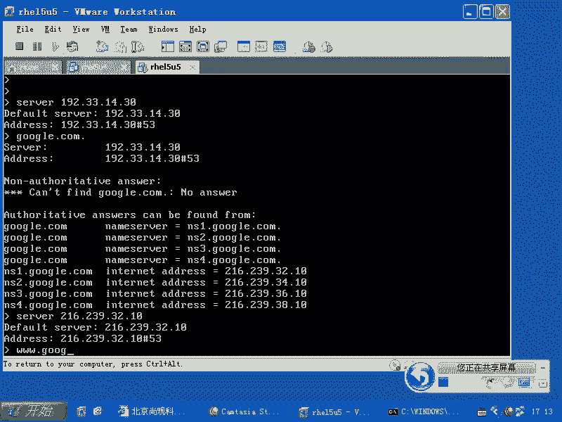

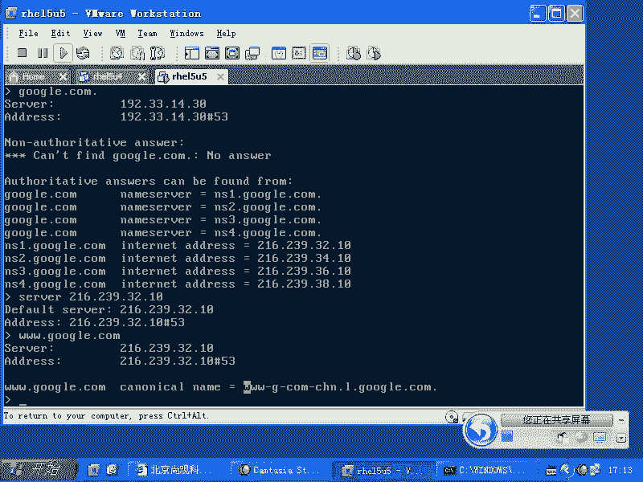

例如，`telnet 192.168.1.100 22` 用于测试到目标主机22端口（SSH服务）的连接。如果连接成功，会显示欢迎信息或建立空白会话；如果失败，则会提示连接超时或被拒绝。

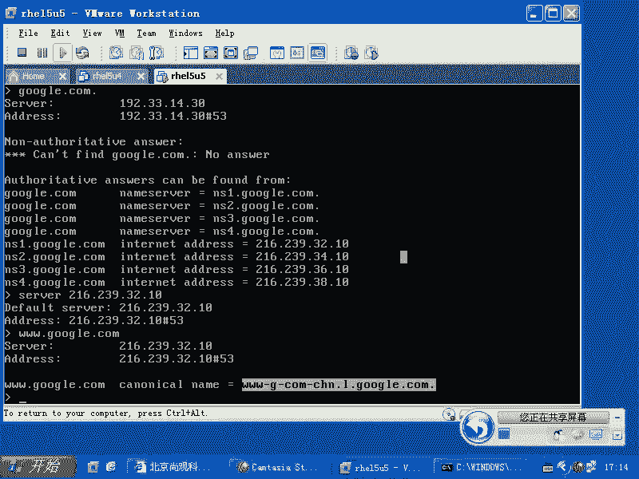

### 使用tcpdump抓包分析

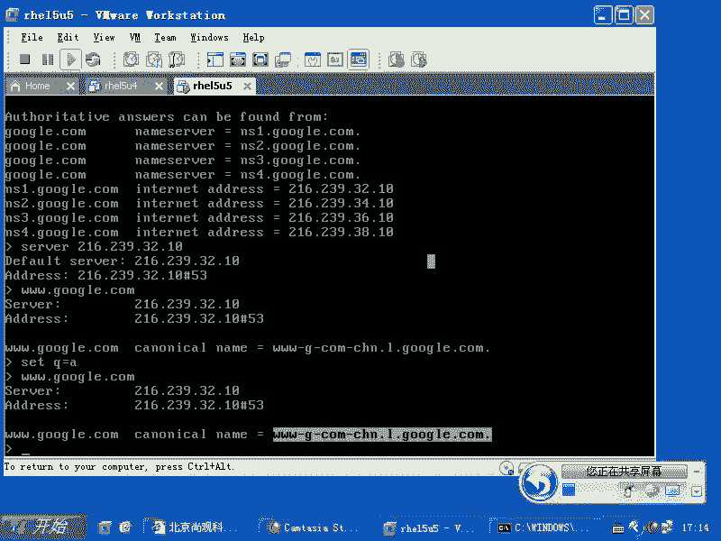

当双方对问题责任有争议时（例如，客户端坚称已发送请求，服务器坚称未收到），可以使用 `tcpdump` 在服务器端进行抓包分析。

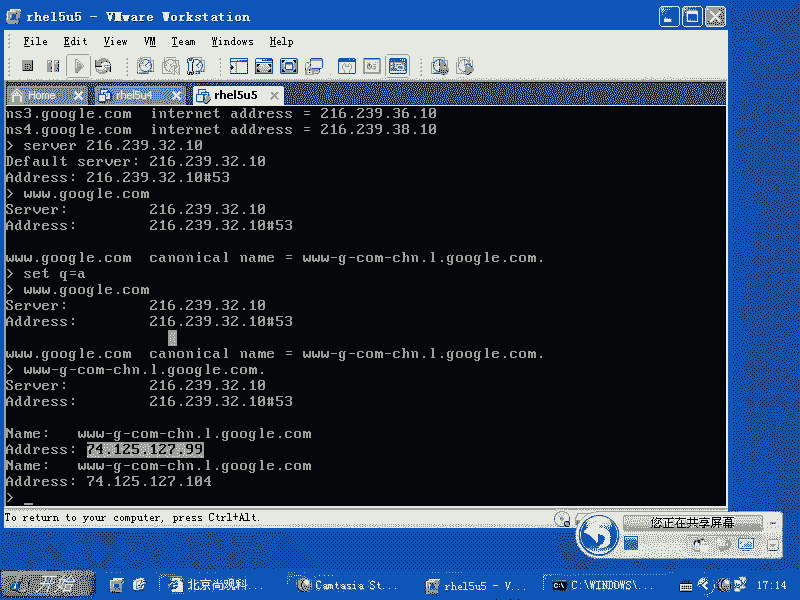

```bash
tcpdump -i [网卡名] port [端口号]
```

例如，在服务器上运行 `tcpdump -i eth0 port 22` 监听22端口的流量。如果客户端尝试连接时，`tcpdump` 抓取到了相关的SYN包，则证明客户端的请求确实到达了服务器网卡，问题可能出在服务器防火墙或服务本身；如果抓不到包，则问题可能出现在网络链路上。

## 其他实用网络工具

除了故障排查，还有一些日常实用的网络工具。

### 文本模式浏览器与下载工具

*   **elinks/lynx**：在纯文本终端中访问网页。
*   **wget**：强大的命令行下载工具，支持HTTP、HTTPS和FTP协议，并具备断点续传、递归下载整个网站等功能。

```bash
wget -r -l 3 http://www.example.com
```
以上命令会递归下载 `example.com` 网站，深度为3层。

### 网络接口状态检查

使用 `mii-tool` 或 `ethtool` 命令可以检查物理网卡的连接状态（如是否插好网线）。

```bash
mii-tool eth0
ethtool eth0
```

## 故障排查流程与注意事项

在本节中，我们一起学习了从底层到高层的网络故障排查方法。现在我们来总结一个清晰的排查流程：

1.  **检查本地连接**：使用 `mii-tool` 或 `ip link show` 确认网卡物理连接和状态是否为 `UP`。
2.  **检查IP配置**：使用 `ip addr show` 或 `ifconfig` 确认IP地址、子网掩码、网关配置正确。
3.  **测试网络连通性**：使用 `ping` 测试网关或外网地址。若不通，使用 `mtr` 定位中断节点。
4.  **测试DNS解析**：使用 `ping 域名`、`dig` 或 `nslookup` 验证域名是否能正确解析。
5.  **测试服务端口**：使用 `telnet [IP] [端口]` 测试特定服务是否可访问。
6.  **抓包分析**：如有必要，在服务端使用 `tcpdump` 确认数据包是否送达。

**重要提示**：在RHCE考试或实际运维中，可能会遇到网络配置被自动脚本修改的情况。请务必检查 `/etc/sysconfig/network-scripts/` 目录下的所有 `ifcfg-*` 文件，确保没有多余或冲突的配置文件（如 `ifcfg-eth0:1`）在重启网络服务时覆盖你的正确配置。

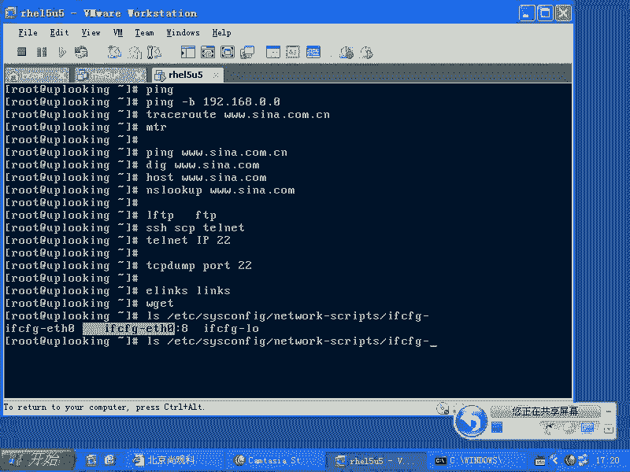

本节课中，我们一起学习了 `ping`、`mtr`、`nslookup`、`telnet`、`tcpdump` 等关键的网络诊断命令，并梳理了一套从链路层到应用层的系统化故障排查思路。掌握这些工具和方法，将使你能够高效地定位和解决大多数网络问题。