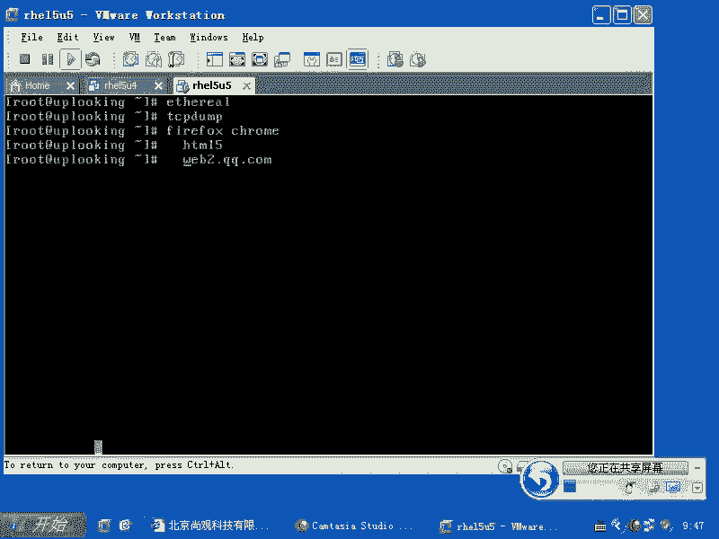
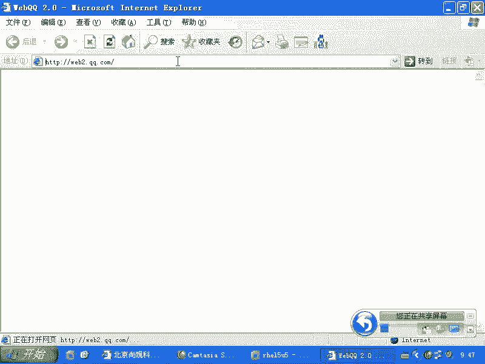
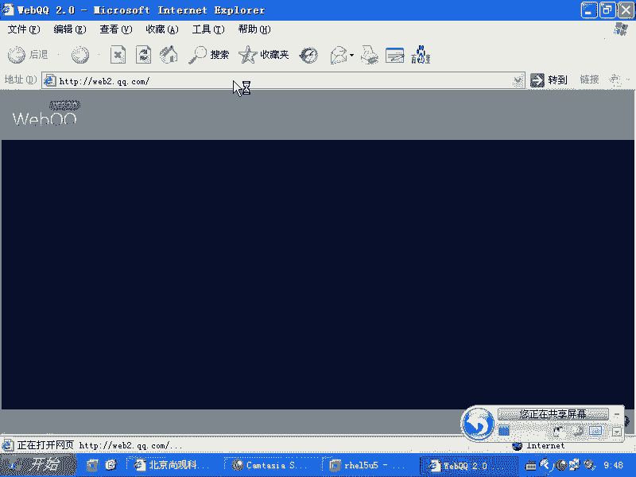
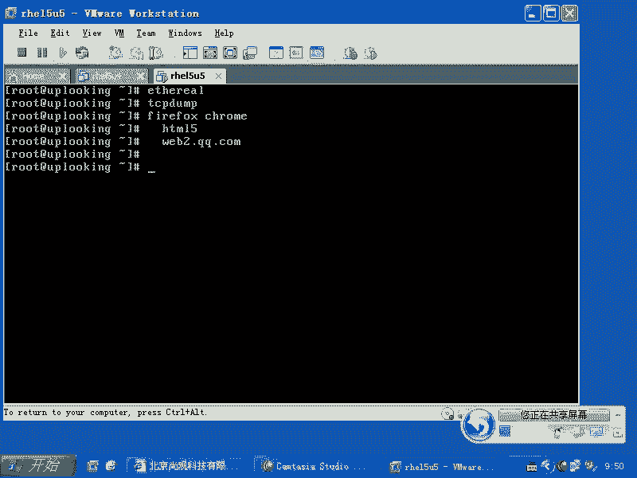
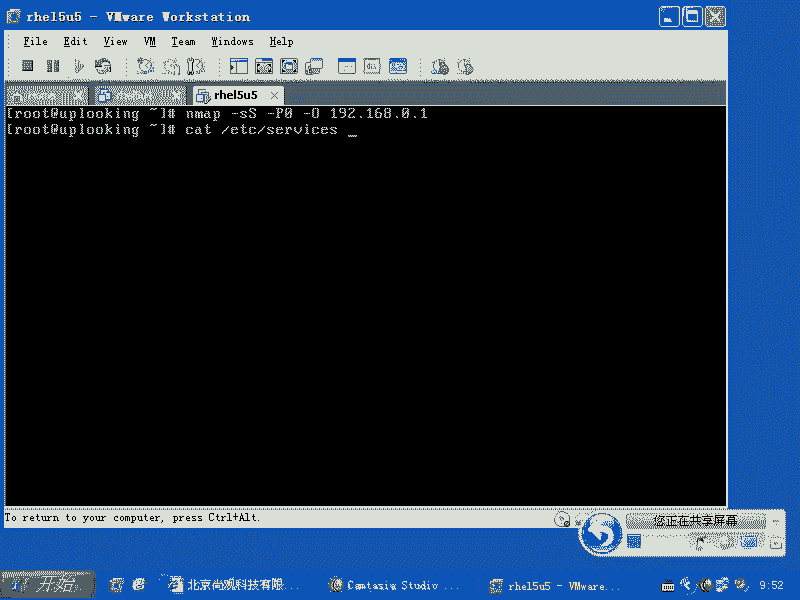
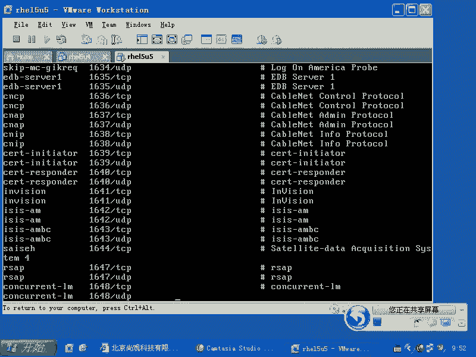
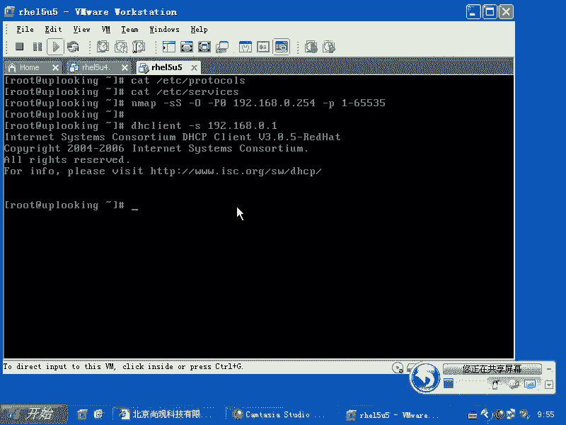

# 尚观Linux视频教程RHCE 精品课程 - P49：RH133-ULE115-6-5-dhclient-nmap - 爱笑的程序狗 - BV1ax411o7VD

我们的话呢来继续来看。当网络当中我们需要去侦测数据包的时候，也就是说抓包的时候，那么以前的话有个叫做as real是吧？以前的话呢程序是这个啊，后来的话呢它改名了叫做什么什么shark啊。

就是鲨鱼SHARK大家装住那装上这两个软件以后的话呢，你启动重新界面，一运行它它就开始抓包，他告诉你，你整个收到哪些包。然后呢，这些包都是干什么的。把这些包的话都记录出来。它跟TCP当很像。

只不过说吧是图形界面啊，is real什么let啊，那么我们这种软件的话呢，大家装上去以后的话呢，就会有相应的程序的话，可以运行图形化。那么如果要是文本的话呢，就是TCP。down对吧？

T当如果要是你现在在图形界面下，那么想去用呃就是说访问网页访问网络的话，那么以前的话叫做moz了啊，某z了。后来某z了基金会的话呢出了一款大受欢迎的浏览器，叫做什么呢？fireair fox是吧？火狐。

那么火狐浏览器的话呢，它的好处是在于linux平台，windows平台它都有它的版本，对不对？那么但是你看你像你看网上有很多什么360浏览器啊，什么搜狗浏览器啊，什么这种乱七八糟各种各样的浏览器。

很多浏览器的话呢，是基于IE的内核，也就是给IE内核上面包了一个壳子，对不对？但是呢我们说呃真正主流就是自己全新去写内核的浏览器的话，有什么fireairf是吧？还有google的chrome，对不对？

fireairf。啊，Chrome。Cme的话呢将会变成一个上网本的操作系统。也就是说平板电脑或者上网本的操作系统啊，不是操作系统这个浏览器。现在的话呢这个趋势是什么啊？

就是说他们的话呢浏览器的趋势都要支持HTE。ML5啊，大家可以看一下webQQ啊，就是WEB你们用过webQQ吧。web2点QQ点com啊，大家可以访问这个网站。

也就是说这就是HTM25的这种网站的话呢，才是真正啊大家看到的未来。就是说我们的电脑以后是怎么样的，都是通过浏览器去访问。你访问we to点QQ点com啊，给大家演示过是吧？嗯。

那么像支持HTML5的这种浏览器访问出来以后，如果要是我们的crorome，它的方向是什么呢？它就是系统一打开以后就打开一个什么浏览器，是不是？打开这个浏览器以后，你看到的是web to点QQ点com。

对不对？

也是这样的。我想给大家演示的是什么呢？就是假如说你的操作系统一启动啊，你的操作系统一启动。

就启动一个浏览器，桌面没有。是不是桌面没有，但是呢在浏览器里面有个桌面，是不是你看到的感觉好像就是个桌面，对不对？明白我的意思吧？就是我们系统现在启动的话，有开始菜单，有下面任务条，有后面的桌面背景。

还有几个我的电脑之类的图标，对不对？那如果要是这些图标都是放在哪呢？都是放在浏览器里面，放到IE浏览器，或者说 chromrome浏览器里面，对不对？然后我系统一启动起来以后就打开IE别的我就不打开了。

没有这种窗口，没有窗口，没有这些标题，是吧？只有一个个的什么标签，是不是？那这样的话呢，我们看到的就是一个操作系统。启动起来以后就打开IE。

那么桌面是通过什么IE或者是fairfox或者是说chrome给你显示出来，是不是这就是所谓的什么呢？webOS是真正的webOS。但是我们说原来惠普收购的什么呢？呃是吧？pm啊那个惠普收购的pm公司。

他也有外部OS。但是他那个外部OS的话呢，我觉得定义上跟这个是不一样，对不对？这个的话是真正什么把所有的操作全部都放到一个什么web浏览器里面来。所以chrome就是做这个用，听住了吗？

可以我们就做这个。所以你也可以装一个坑啊。TCPdTCP dump的话呢，就是给大家讲过啊，就是我最常用的功能是一个什么呢？port是吧？那你还可以用什么呢？杠I来指定接口，对不对？

其他的看一下蛮配置就好了，其他看一下门配置好了。我不知道用TCP当的话呢，大家还想做一些什么功能，关键你有需求的话，我们在门配置当中可以查找到，对不对？在门配置当中可以查找到。你比方说。

MTCPUMP啊，那么我们常用的话呢，有什么杠I指定interface是不是杠I指定interface，然后输入一个什么port，输入一个port，就是指定监听某一个端口的，比方port22，是不是？

那么监听22端口，那么22端口过来的数据包，我全部都显示出来，其他数据包我就不显示，对吧？但它非常复杂。那么有很多呃？比方说它可以去存储到某一个文件里面，把它变成日志啊，它就跟snt一样。

它把它变成日志。它的这种日志的话呢，就是以二进制的方式储存所有收过来的数据包。那它跟snt的话很像啊，就是snt实上就种抄袭它的这个呃就是储存的这种方式啊。呃，杠LF啊，我看。

就是我不知道大家需求是什么，如果需求有需求的话，我们可以找相应的命令啊，来把它用起来。好呃。我用TCPd幅的话呢，可能像杠I杠啊，就是再加个port会用的非常多，对吧？那么大批量去抓包的话呢。

我一般呃不会用它，就是抓很多很多包，然后再去分析的话呢，我们不会用它啊。OK我们再看一下，就是其他的就是我们现在看一下N map啊，N map的话呢是扫描工具，扫描端口是不是N map。

那么原来我给大家用过一个什么用过一个参数，就是杠小S大S是吧，进行SYM的半开扫描杠P0，就是说不要拼对方，对不对？杠大O，就是猜测对方的操作系统的类型，是不是操作对方的操作系统类型。

然后加上对方的一个什么的IP地址。这样的话呢，它是扫描什么呢？扫描指定的就是说我们约定俗成的那些端口。那么默认情况下，系统当中打开的端口，它都是有约定俗成的一些应用在占用了。那么我们这些应用的话呢。

可以在ETC下面有一个什么呢？呃proical是吧？啊。Ptocle和service。那么里面的话都可以看到service里面的话呢，就是对这个TCP啊或者UDP的这几千个端口的这种默认的这种。

定呃，就是应用是吧，谁到底用这些端口啊，proractical的话应该是。是一些就是说一些比方说。啊就是说一些我们呃把这个协议的话呢定义出来这样的一些。internet的协议的一些内容啊。

这样两个命令的话，呃，这样两个这个文件的话，里面是约定俗成的一些东西啊，就是有关网络的约定俗成的一些东西。那么我们可以看到的话呢，就是说用呃。用我们的这个工具啊，就是像我们的恩脉。

刚才的话呢就是说N map去小S大S杠P0是吧？杠大O扫描的时候的话呢，它只扫描我们很就是说用的很多的那几个端口。那么如果要是你现在想去。想去扫描。更多的一些机呃更多的一些端口的时候。啊。

然后加上一个什么呢？杠P啊，1至什么65535，这样的话呢就是全部端口都扫描。全部端口都扫描，6万多个端口全部都扫描。否则的话呢，他只扫描。就是说前面的话呢。

像service命令里面呃service文件里面那大致的那些端口。咩。还有一个的话呢，是我们的。呃，DH client。DH client的话一般我们用的比较少啊。

也就是说我们DHCP服务器想去获取IP地址的时候，是不是？那么他的话呢会在网络上广播。第一个给他这个IP地址的这个server的话呢，他就拿到他的地址。假如说我们现在网络里面的话，有2个DHCP服务器。

他到底拿哪个IP地址先接到广播。先接到广，那有两个的话，它是先接到广播包是吧？那现在我就想要指定的一台机器，我就不想要最先得到反应的那个就是接到那个回应的那个DHCP的包，对不对？我不想要那个服务器的。

我想要另外一个服务器。那个服务器的话呢，虽然说慢一点，但是呢它是正规的，有另外一个这个服务器DHCP服务器，它是我们一个员工不小心给他装出来的，对不对？

它扰乱了所有的什么这个这个大家获取IP地址的这个过程，对不对？所以这个时候的话呢，DHCPDH client，我经常用来做什么呢？就是说获取指定的服务器的这个IP地址啊。那这样的话呢，他就会怎么样？

他就会获得指定的服务器的I这个给你的DHCP。信息那么而不会什么呢？得到的第一个响应，那么他拿只拿第一个响应。啊，这就是我们的DHplan，这是我们网络部分的话呢的补充。

