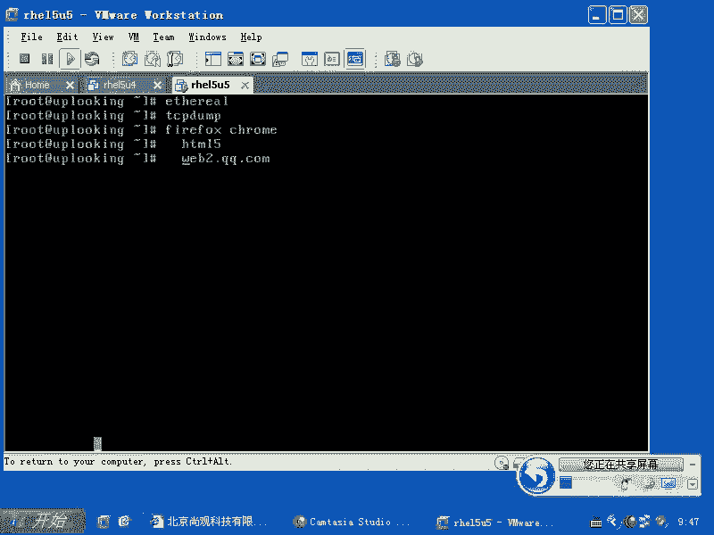
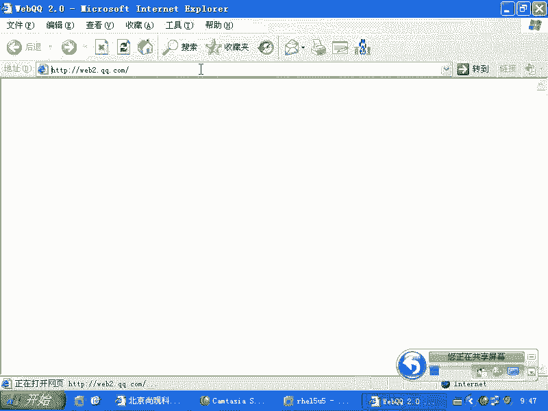
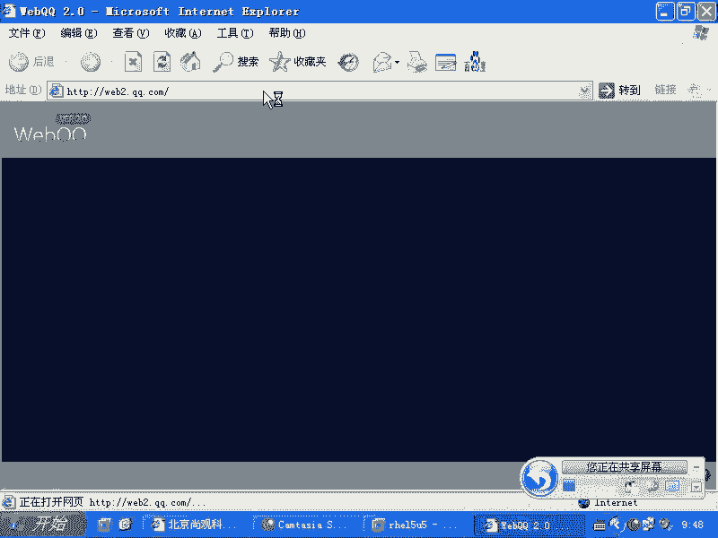
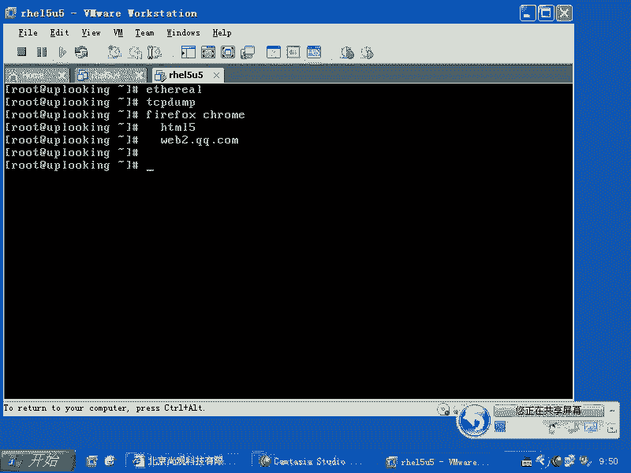
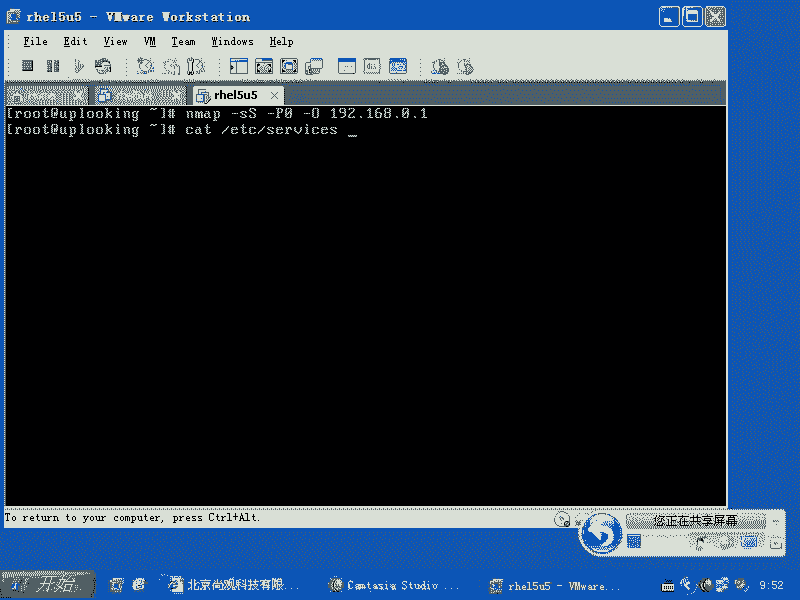
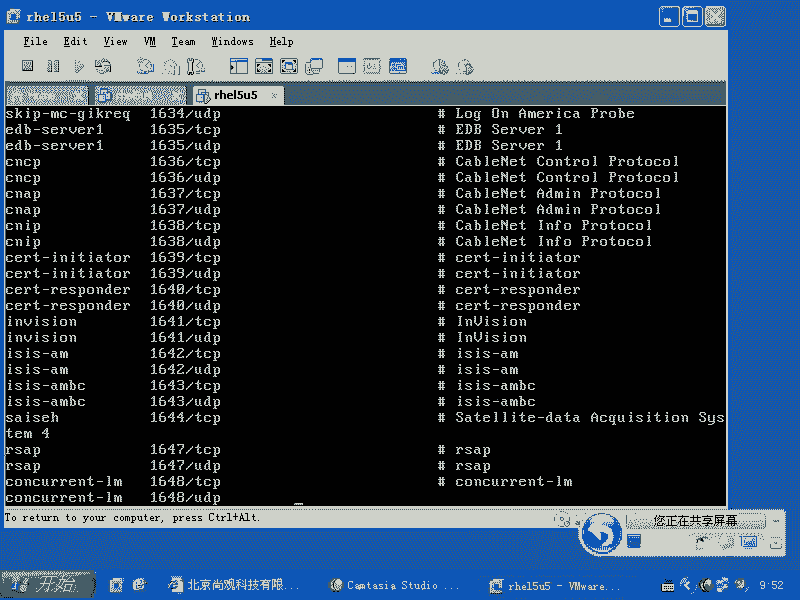
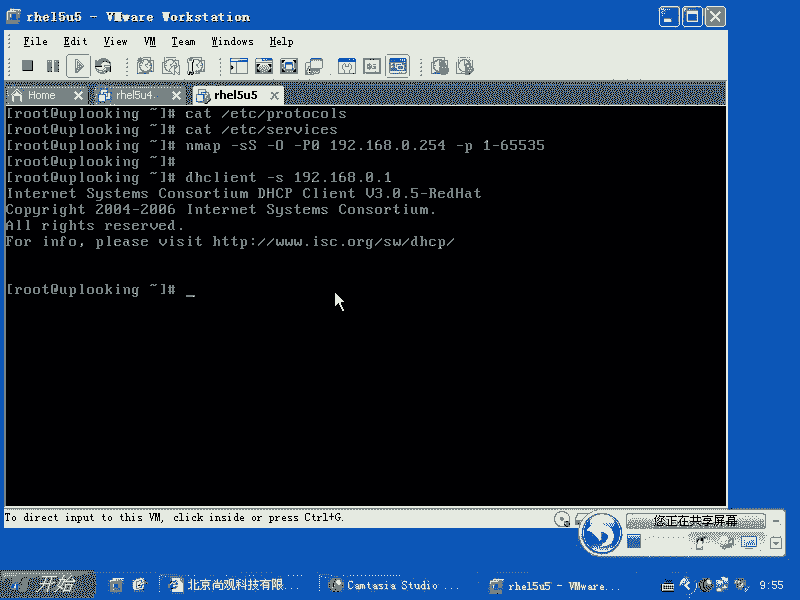

# 尚观Linux视频教程RHCE精品课程：P49：RH133-ULE115-6-5-dhclient-nmap 📡


在本节课中，我们将学习Linux网络管理中的几个实用工具，包括用于抓包的`tcpdump`、用于网络扫描的`nmap`以及用于DHCP客户端管理的`dhclient`。我们将了解它们的基本功能和使用场景。

---

上一节我们介绍了网络配置的基础知识，本节中我们来看看几个用于网络诊断和分析的高级工具。

## 网络数据包捕获工具

当我们需要侦测网络中的数据包时，就需要使用抓包工具。过去有一个工具叫做`ethereal`，后来它改名为`Wireshark`。





安装这两个软件后，启动其图形界面并运行，它就会开始抓包。它会显示你收到的所有数据包，并解释这些数据包的用途，将它们全部记录下来。它的功能与`tcpdump`很相似，区别在于`Wireshark`是图形界面工具。



如果你在文本界面下工作，或者偏好命令行，那么可以使用`tcpdump`。

以下是`tcpdump`的一些常用参数：
*   `-i`：用于指定要监听的网络接口。
*   `port`：用于指定只监听某个特定端口的数据包，例如`port 22`。

`tcpdump`的功能非常复杂。例如，它可以将数据包以二进制格式存储到文件中，类似于日志功能。这与`snoop`工具很相似。如果你有特定的抓包需求，可以查阅其手册页来找到对应的命令。

## 网络端口扫描工具



接下来我们看看`nmap`，它是一个强大的网络端口扫描工具。

之前我们使用过类似`-sS`（SYN半开扫描）、`-P0`（不发送ICMP ping包）和`-O`（猜测目标操作系统类型）这样的参数，再配合目标IP地址进行扫描。这种扫描方式主要针对系统约定俗成的一些常用端口。

在Linux系统中，这些端口与服务的对应关系定义在`/etc/services`文件中。`/etc/protocols`文件则定义了一些互联网协议的相关内容。这两个文件包含了网络相关的约定信息。

默认情况下，`nmap`只扫描那些常用的端口。如果你想进行更全面的扫描，可以使用`-p`参数指定端口范围。



以下是`nmap`扫描全部端口的命令示例：
```bash
nmap -p 1-65535 <目标IP>
```



## DHCP客户端管理工具

最后，我们看一下`dhclient`工具。它通常用于向DHCP服务器请求IP地址。

当`dhclient`运行时，它会在网络上广播请求。第一个回应它的DHCP服务器所提供的IP地址，就会被客户端接受。

但在某些情况下，网络中可能存在多个DHCP服务器。你可能不希望客户端接受最先响应的那个服务器（例如，一个员工误配置的、会扰乱网络的正规服务器）。这时，`dhclient`可以用来指定从某个特定的DHCP服务器获取地址，而不是接受第一个响应。这就是`dhclient`在网络管理中的一个补充用途。

---



本节课中我们一起学习了三个重要的网络工具：用于抓包分析的`tcpdump`，用于探测网络和端口的`nmap`，以及用于管理DHCP客户端行为的`dhclient`。掌握这些工具将有助于你更深入地进行网络配置、故障排查和安全评估。