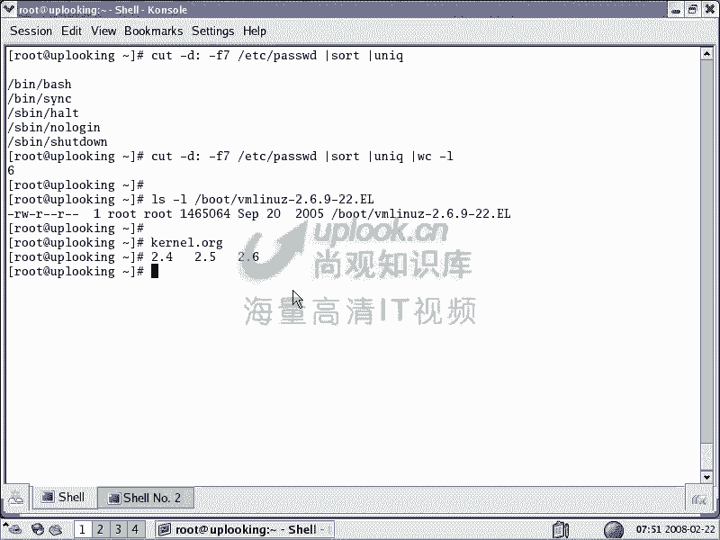
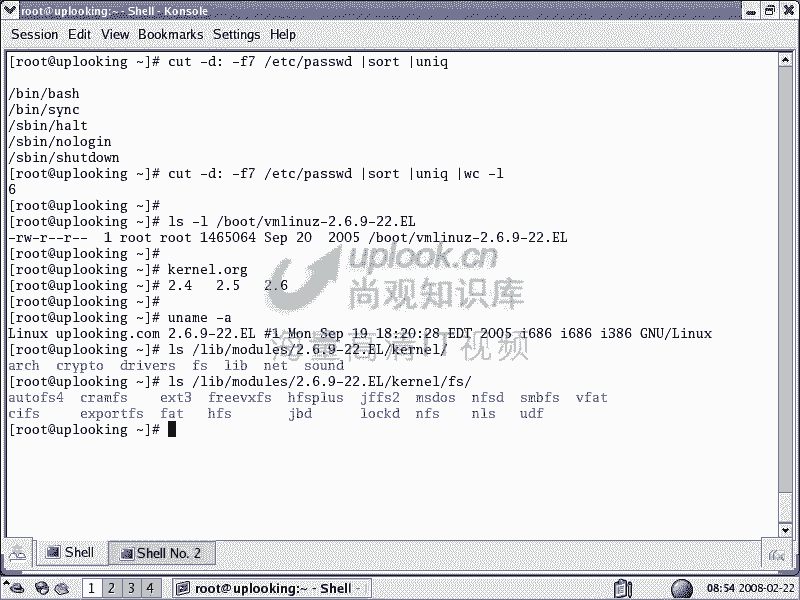
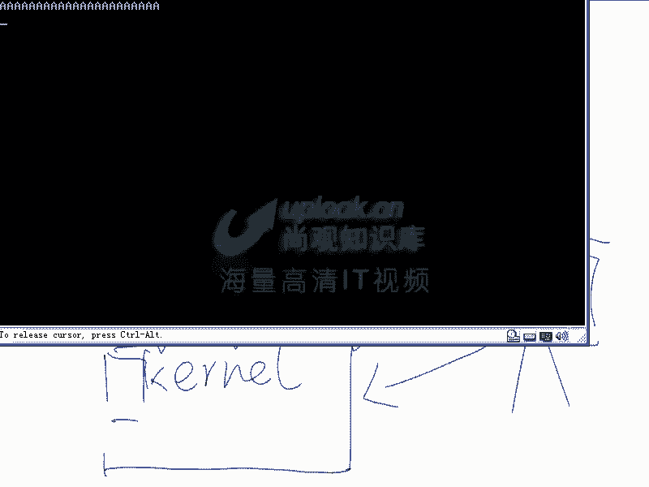
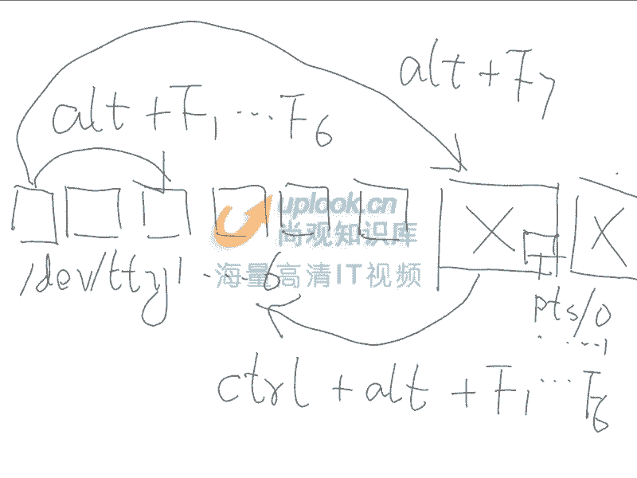
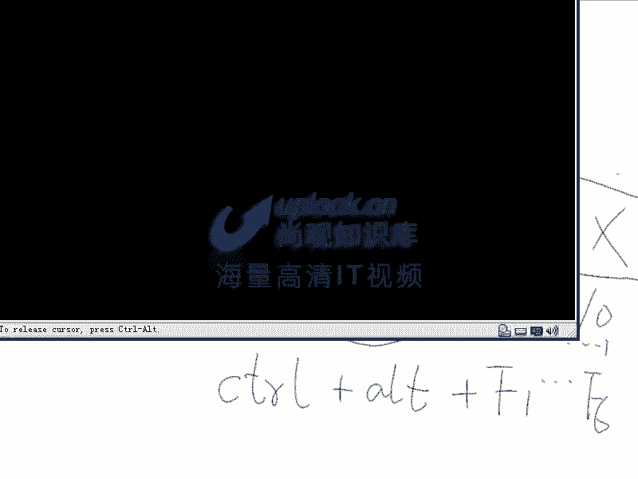
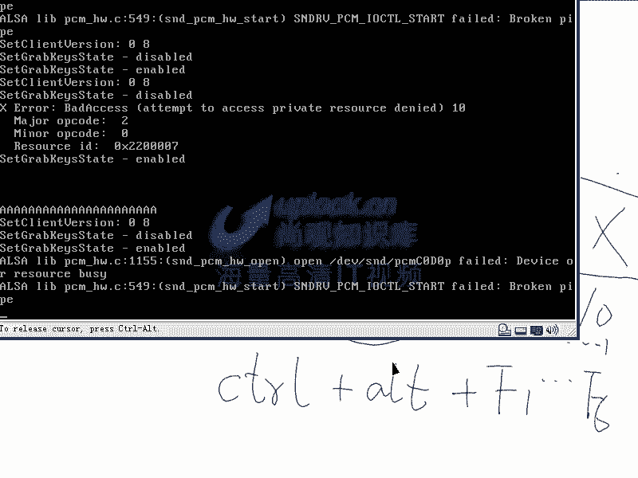
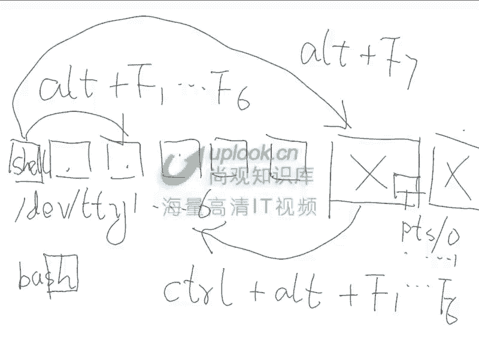

# 尚观Linux视频教程RHCE 精品课程 - P4：RH033-ULE112-02-1-系统结构与终端控制台 - 爱笑的程序狗 - BV1ax411o7VD

啊。OK我们现在开始，就是我们看一下呢linux操作系统的基本结构。如果理解的基本结结构以后呢，再操作起来的话，可能会更得心应手一些啊。你比方说这样的，就是我们现在操作一个。lininux。

那么在里面的话发生一些问题，这问题到底发生在哪个地方？ kernell里面模块里面还是在哪个地方。那么一般来说我们说操作系统，那么分成很多个级别啊，比方说有啊内核内核的话还有不同的级别。

那么们说lininux系统是怎么样的。我们给大家看一下，它首先有 kernel。有模块，有库，有hell，有各种各样的应用程序，或者说工具。那么实际上就是什么四个部分。

就是shall和tth这些东西的话，实际上都是一个什么都是同一个级别的应用程序，是吧？可以把它归结成一个什么呢？APP就是说应用程序这个级别。OK我们现在看lininux系统的基本结构。

那么现在的话呃看看这个图啊，那么现在假如说有这样一个系统，这个系统是这样的。操作系统，那么跟windows也差不多。我们知道呢在底层的话。在底层的话是有很多的硬件，是不是？对。

硬件的话有包括我们的呃CPU是吧？嗯，然后呢有我们的各种板卡，是不是有我们纵各种的什么呢总线是吧？对，还有呢我们的什么桥是吧？还有我们的那个芯片组等等。那么比方说。IDE啊等等这些东西。

这些东西呢在操作的时候呢，一般我们的硬程序的话，它不会直接去操作。它都是通过一个什么呢？操作系统。操作系统的话一般是在这个启动册上。这就是软件了，这上面都是软件了。这比方说是我们的科。

就是我们lininux的 kernel，就是内核。那么如果要是你在系统一开始启动的时候，最开始是什么东西启动？最开始什么东西启动，操的就是我们计算机啊一家店以后，最开始看到的是什么？

是是bios对bibios在启动时候是不是有很多种bios啊，嗯是吧？那么bios的话，它跟我们的 kernelel的话呢也是同一个级别的。

那么一般的 kernelel最后的话是由呃最初的话是由bios引导了but load，然后 load有装载的 kernel。那么在这一种类型的程序的时候，这种类型的程序的话，它是直接可以操作硬件的对吧？

你比方说很多就是说嵌入式的系统，它是直接可以跟我们的CPU进行沟通。那么CPU跟我们的 kernelel之间的话，沟通是靠什么呢？是靠机器代码机器代码沟通啊，那么。我们现在看啊。

假如说现在我们呢有一个应用程序，那么在之上啊我们又有一个层次。那么我们的 kernelnel呢，它会有一些呃程序啊，它就是有一些它有很多层次。那么有一些代码的话是基础性代码，不不能没有的。

不能没有的这种代码。嗯，还有一些呢是内核模块，内核模块的话，就是我可以后天的话来装载上来。那么后天来装载下来的。比方说那我这边有个什么呢？8139的模块啊。网卡的模块，但是在这个里面。

它是后来装载上面的这些东西的话叫做什么呢？models模块，那么整个的这个空间的话都叫做什么呢？是不是叫内核空间嗯，是吧？对，那么在这之上的话，会有用户空间。那么我们的Kel。

或者说我们的整个的操作系统会对上的话有一些什么？API应用程序接口是吧？那么还有一些呢像我们的什么基本的G map C。库的接口啊库的这种调用。那么它最上的话还有一些接口。那么我们的应程序的话呢。

可能调用什么呢？最基本的操作系统给他的接口，或者说什么呢？库给他的接口，这就是我们的什么。应用程序。这是我们应用程序。所以呢它整个的话是区分这么多层次的对吧？对，如果要是我现在有加va程序会怎么样？

java程序是不是会它自己本身类似的一个什么？它是不是相当于一个类似的应用程序，那么这是什么呢？GBMjava的讯拟机。那么在这之上的话，又跑什么呢？点GAR的那种java的程序包，对，对吧？

那么也就是java的话呢，在这里面的话又做了一个层次，所以的话java才可以跨平台。明白吗？明白，你比方说java什么是p平台，我在lin上也可以跑java。怎么的算也可以跑这些家务程序。

爽不爽感觉很很爽是吧？对啊那为什么就为什么你这个java的话可以毫不更改的话，就可以在上面跑。因为啊因为。😊，我的这个操作系统不同，是不是我这个java的虚拟机不同啊？那我加了虚拟机的话。

在上面所提供的API是不是都是相同的呀？对。是不是这部分的这个API是不是相同的？是啊，那么所以我这个java的话，程序可以不用变，但是我的GBM必须变。明白吗？你java的程序的话。

它在整个的这个操作系统。应用程序这一层的话，又加了一个层次，它自己的java虚拟机这个层次，这就是javajaGBM的这个原理，明白了吗？明白。然后呢APP就是application就是我们的应用程序。

我们的应用程序呢调用各种各样的API那么其中有一种应用程序叫做什么呢？有一种应用程序叫做什么呢？shall。有一程程序的话叫做sll这种应用程序se这种应用程序的话，是提供给人进行交互的。

也就是我们的人类human是吧？人类的话，它不可能直接去操作这种API刚才我给大家已经演示过这个API是什么样子了。是不是对这I是什么样子？大家可以看一下。API是这样的呀。open是吧，打开文件是吧？

然后呢，这边什么访问什么read啊，读取，然后呢，或者说写入也是read，然后呢，这些都是API那么这些API然后呢，就是我们刚才看到的那些东西，就是我们刚才看到那些东西啊。

人的话可能不可能去操作这些API呢？可以可以吗？人的不可以人类是操作什么sell shellll人的话呢是操作hell。 shellll的话呢，再去什么呀，再去跟我们的科l跟酷啊交流。

或者是说呢跟我们的科l提供给他的API进行交流。然后呢通过他们再访问到我们的硬盘硬盘是不是IDE总线的硬盘，或者是说SATA的硬盘，是不是啊嗯？那么这些硬件是不是只有操操作系统内核的话，可以直接访问的？

那么你自己访问的话是不是很费劲啊？所以的话呢，人最终能看到这个硬盘上的数据或者文件，它是通过什么访问sll shellll的话，再调用箱的API再由科呢再去完成的。对样吧？嗯。

那么整个这个结构清楚不清楚清楚啊，所以呢我们现在看啊，那么你至少应该分成几个部分操作系统操作系统是吧？操作系统当中，我们说这是第一部分科，是不是啊？对，这是第二部分是什么？模块是吧？这是第三呃。

这是第三部分，是我们的什么呢？我们的这个呃应用程序是吧？那么有一些应用程序的话呢呃。是库是吧？各种各样的库，比C加加的库啊，标准C的库啊等等，有很多很多种。那么这些呢层次的结构的话是否都清楚了？嗯。

明白，那我想问你一下啊，就说我们可以大家可以想象一下探讨一下。有没有可能一个程序啊，一个东西。他他怎么样呢？只有 kernelle和模块在运行，没有其他东西在运行，也没有可能。

可nal和model是在一形。或者非常简单，就是说我这个操作我这个系统一启动起来以后，你人的话没有办法进行干预，他就自己在那边运行着，可不可以啊？可以吧？可以，因为我只要不运行这个se。

你人是不是就可能就不能干预了。对，那我当然还可以通过其他的什么呢？其他的这种呃就是说其他的这种GUI或者TUI去干预，是不是啊？嗯，对啊，所以的话我可以不用那个东西。

那么也就是现在我给大家再画的清楚一点啊。我们先把各种层次的话呢先分清楚，比方说这是我们的什么呢？这是我们的下面是我们内核空间。那么其中是不是有个基本的 kernel？对，是不是这科呢在需要的时候。

是不是可以加各种各样的模块？是不是啊嗯各种各样的模块。那么这些模块呢在加载了以后，它就起到相应的作用。那么最底层的话呢是我们各种各样的硬件是吧？对。可以供我们去访问。

那么其中呢我们的呃API有一些系统自带的这种API是吧？嗯。API层次，然后呢可以做各种各样的系统调用。对，同时的话呢我们可能有一种什么呢库，是不是各种各样的库是吧？提供一些额外的。API是吧。

这个API的话呢，是这个库提供给他们的这个调用。是啊对，比方说什么呢？G lab C。啊，那么这些呢啊是我们的库。然后呢，我们的应用程序的话可能去调用其中的某些东西。

那么比方说这个应用程序的话是一个appartache。他是不是可能直接调用这个API啊？嗯，是不是？对，那么有一种程序的话，是不是叫做什么呢？hell？

是不是对这种类型的程序是不是由人的话跟他们进行打交道？嗯啊然后呢人的话呢调这个 shell要 shell要的话可能去直接调用这个API可能调用系统的API肯定调酷的API最终完成这个任务是吧？

那么还有可能是什么呢？我们现在执行的是一个什么呢？KDE一个桌面环境，这个KDE的话呢，它可不可以调这个API然后呢完成某一种任务，可不可以可以啊，也可以。

所以的话呢人的话还可能呢通过呃其他的比方说这是GUI是不是图形用户接口是吧？对，这是命一行是不是com line是不是CL command line是吧？对，那么通过这些方式的话呢进行沟通。

OK这就是整个的这个呃lininux系统的这样的一个结构。那么人的话可以通过KDE可以操作系统，也可以通过什么呢？视要操作系统。也就是说你平时所接触的这个操作系统。如果要是windows出现错误的时候。

你可能看到一个蓝屏，点什么都没有用了，是吧？对，那时候操作系统可能还在正常运行。明白吧？嗯他跟你提供的这个接口，你提供这个接口只是一个小的程序而已，看到了没有？这只是一个小的程序而已。这些都是小的程序。

明白了吗？明白啊，OK现在我们看那假如说我们经常呢看到一些什么，看到一些防火墙或者入侵检测系统。那么这些系统的话，它可能根本就不提供给你试药，可能吗？不可能可能呀？你刚才不是说了，就是人的话。

不通过这个试项的话，是不是呃就是说我不打开试药，你人的话就可以不用去接触它，嗯，是吧？那我如果要是这是一个专用的防火墙，就是黑匣子，然后花几万块钱买回来一个黑匣子。嗯，那么它需不需要给人提供命行接口啊？

😊，需要。😔，你一般如果要是要对它进行控制，是不是就需要？嗯，如果你要不对它控制，是不是就不需要。嗯，那么很多的你看到就大家可能会经常用到的宽带路由器，你经常用宽带路由器吧ADS和拨号的宽带路由器。

对你是不是通过一个外部界面对它进行控制了。对啊，那个东西就没有需要。你除非改他的系统。😡，那个东西它就没有效，明白吗？它底面就是一个lininux内核。清楚没有清楚。

所以的话呢我可能是运行了一个非常简单的东西。比方说我这边的话有个路由模块是吧？我在这里面加载了网卡的驱动，是不是？嗯然后呢还有一些什么网络路由的东西啊，然后呢在上面跑了一个什么呢？入侵检测系统。

比方说1个IDS跑在这个地方，然后呢，我提供个ache给人的话，通过外部网页进行交互，是不是也可以，可以啊，OK那这就是我们非常灵活的可以定制这个系统，您明白不明白，明白。

那么假如说我们是一个什么宽带路由器，是不是它就只包含这些部分。😊，是不是啊？对啊，他可能就不打开设项，不打开KE。所以的话一切的话呃都是一些小的程序，你不运行它就无所谓了。那么只不过你看到的命。

就是平时的这个接口的话，是一个什么，是一个shall而已，是一个特殊的程序而已。清楚了吗？清楚了。OK理解的很清楚，然后呢，你才能继续往下学，然后呢你才能比较清楚。啊，这就是我们刚才说的这几种部分啊。

一般来说的话呢，我们说的是84种部分，像我们刚才说的hell和toth的话，实际上同一种东西，什么东西啊？应用程序。对对吧适用程序。然后呢，这些东西的话呢，大家可以呃自己呢去仔细看一下啊，仔细看一下。

OK我们现在呢再看一下cl的版本。也就是说呢等一下呢我们继续我们会仔细的给大家讲怎么样去操作一个系统。然后呢，包括安装或者说呃整个这个过程怎么样的。那么现在我们现现在继续的话来给大家讲述一下。

如果要是你在这边用到这个 kernell的时候，这个 kernell是怎么样一回事。那么 kernell的话呢，实际上是包含着什么？ kernelnal实际上包含着呃，就是说呃一些版本号，对吧？

那么我们刚才看到这个 kernelnal呃，小芳，你还记不记得就是说我们那个 kernelel的话是在哪个位置。能不能说一下路径嗯，不一下哦LL跟L。或像对，然后。然后IVVM。啊。MM科和版本号啊。

然后呢这是它的 kernelel的位置是吧？在波om录像，那这时候呢你看到这样一个 kernelel，它是有2。6开头，是不是？对，2。6的内核的话呢是比较新的内核啊，2。6内核的话是比较新内核。

那么现在呢就是说呃有2。32。42。52。6。那么在整个的这个内整整个的这些开源程序里面，我们是不是都知道每一个程序的都可以下载到相应的，就是每个程序都可以下载到源代码。对，那元代码在哪下呢？

在这地方下坑呢。点ORG。大家可以访问这个网站，下载到最新的源代码，就是说你要想找 kernelel，最新的内核，源代码从这个地方去找。那么我们这个 kernelel是已经编译过的内核。

已经编译过的内核。cl点ORG啊 kernell点ORG里面的话是最新的内核。然后呢，这些内核的话呢是包含着不同版本。我们说呢你现在看到能变的版本，2。4的内核在变，2。5的内核在变，2。6的内核在变。

那么也就是多条内核的话，它是并行发展。明白吧？明白？就是说这些内核的话同时呢都在都在开发，然后呢都在完善。那比方说呢我们看到这个内核的话，有基数版内核是吧？2。5的内核是吧？对，那么2。5的内核的话。

它是实验型的内核，为2。6内核呢做实验的。啊，那么现在你看到2。4内核2。6内核，两个两个偶数版的版那个内核是吧？对，这两个偶数版的内核的话呢，它们是都是稳定版本内核。那么为什么我有2。6内核以后，2。

4内核还在开发呢？因为2。4内核还有很多的用户有很多的用户是不是有出现bug的时候，我要修正它？嗯，对，所以呢2。4内核2。5内核和2。6内核的话是并行发展，多条线和并行发展。

那么大家可以呢在 kernell点ORG上呢看到这些呃最新的这个呃最新的这个内核。我们可以看一下呢最新版的内核啊。2。6。24是最新版的是吧？对，然后呢还有就是说2。4。36是吧？还有2。5点什么呢？

啊啊，然2。5点。该事。看一下啊。我可以看到2。5我的内核。OK看一下2。5的内核，2。5点多少呢？大家看2。5的内核已经达到2。5。75，看到吗？嗯，为什么2。5。75就这么高呢？

因为它是测试型的内核，最激进的测试的话，我全都在2。5内核当中测试出来。测试完哎，大家反应不错，我再拿到2。6内核当中去。明白我的意思吗？明白，所以的话他的测试次数的话非常高，22。6那和是2。6。

24是吧，大家能看到。这个内核的话是并行发展。啊，这些内核的话是并情发展。大家呢可以仔细去看一下。🤧就是说这些内核的这个。呃，就是说哪些变化，就是chro的话在这里面。如果要是想download的话。

你可以 downloadload的。比方说2。5。2的什么点card点BZ two是吧？BZ two压缩的download下来，把它解开的话就可以用了。那么在这个网站上的话呢，是最权威的内核。

同时我一定要提醒一下大家。你们认为哎小芳，你认为linux安全还是说windows安全？蛮勒你的感觉嗯，为什么呢？这windows我用的经常中病毒嗯。其时的话这是一个误区。

很多人的话都是这样有这样的一个想法，linux安全，为什么linux安全呢？lininux话好像没有那么多木马，没有那么多病毒是吧？实际上呢从搭建服务器的角度上来讲。

linux未必会比windows安全。为什么呢？因为lininux是开源的，是不是？那假如说我是黑客，我想攻击你的系统，windows是不是没有开源嗯啊没有开源。那么它的代码是不是我不知道。对。

那么lininux是不是代码我全都能看到。可以，你看那么这时候是不是我多了一种途径去了解你的系统啊？对你想是不是？对，那我攻击那个系统。那个系统的话什么呢？没有呃就是没有源代码，我不知道。

我只能去摸索我是黑客啊。假如说哎这个linux系统，我一看哎2。6。9是吧？哎，这个内核的代码是怎么写的，我直直接看一下它的TCPP协议站的这个实现，或者是什么呢？RPC通讯的实现等等。

那这时候呢我可以有相应的手段去攻击，是不是？所以呢对于很多的lininux管理员来说，他认为搭建起来一个lininux系统是万事大吉的，这是非常大的误区。所以我们一定要提醒大家呃。

一定要注意lininux的安全性。那么同时的话，我为什么扯到这个地方来呢？因为你看到刚才那个curl点ORG可以下载内核是吧？对，但是你千万不要从别的地方去下载，从别的地方下载。

很可能这个代码是被别人改动过的，我给你个坑？我说这是2。8的内核开心吗？开心啊？然后装完了以后，有我的有我的病毒或者有我的木马，你只要一启动，你的这个系统自动从curl当中给我发一封email过去。

那你说我开心吗？我是我是黑客啊，你说我开心吗？那么这个事情的话呢，是有两次非常狠的教训，这应U的服务器和科l点ORG的服务器都被别人黑过。如果要是呢你登录的这个源代码，找的位置不对。

很可能这个源代码是被别人改动过的，嗯，你一边一成功一执行，是不是你的病你的这个机器上就有木马嘛？对，所以的话一定要注意下载开源程序的时候，一定要从什么呢？指定的这种系统上去下载。

千万不要指定的这个网站上。😊。

官方网站上下载，千万不要随便找一个快一点的站点，然后就下载。如果不是官官方网站提供你的下载地址，千万要注意，明白吗？明白。啊，OK还有呢就是说我们的这个科l点ORG啊，科点ORG是内核的源代码所在地。

那么多条。内核代码并行发展，他们都是并行发展的，2。4内核它也在发展。2。5内核也在发展，只不过2。4内核的话，支持的人少了，只是在修修补补罢了。而2。5内核的话不断在实验最新的东西。2。6内核的话。

把实验出来的东西到往往了放。2。6内核的话，据说就是是由linux towards的话直接去负责的。然后呢，不少人的话呢也在帮他啊。😊，好，其实这就是我们的蝌啊，这就是我们内核。

那么现在我们再看一下这个内核搞清楚了以后，版本号，我们说呢标志它它是一个成熟版内核还是什么内核。那么你看一下现在是2。6。9是吧？对，2。6。9，就是2。6的内核的第九个版本了。

然后杠22就是第22次修正是吧？那么这个时候呢，这后面的这个基数还是偶数就没有无所谓了。😊，嗯我原来还在想，我很久以前的话，刚接触lininux4的时候，98年的时候。

我说不是说基数版的内核比较不稳定吗？我说为什么是6。1，我当时拿到的系统是reite6。1啊，嗯我说6。1的这应该是不稳定，我已经把reite的版本跟科勒的版本都混掉一起了。

所以科l就是科l科l就是科l，你也可以用什么呢？you name是吧？😊，name到A来看一下呢，你自己的内核现在是哪个内核，你现在用的是哪个内核。大家看我现在用的2。6。9-22。EL。

然后呢是一个什么呢？呃是呃就是说是X86686下的这个内核，就686平台内核用到的是686处理器的这种指定机啊这个内核，这个呢就是我们的呃RH就是说我们的这个啊，这个版本号的问题。那么不要认为什么2。

6之后的这个版本号基数数还是对这个稳定不稳定，千万不要认为这个版本号的话，对什么对这个是测试版的，还是不是测试版的，只有前面2。6还是2。52。5是测试版，2。6是什么稳定版啊，这就可以了。

然后点EL的话呢，这表示是re官方发布的什么呢？自己改动过的以后的enterpriselin企业版的linux独特的改动过的以后的内核也就是它不是官方的内。了它跟真正的2。6。9-22的内核一样不一样。

不一样啊，没关系，也就是说呢它是基于原来的那个内核去改动过了，改动了好几百的这种修复，或者说几千个这种漏洞啊，什么什么东西。😊，改完了以后，然后呢标识叫点EL。

那么大家不要认为就是说reite这个内核的话呢，呃就是不要认为它跟普通内核是一样的。那我告诉大家，reite内核的话，一般都是经过上百次上千次的这种修复的修正的，一般它的性能的话呢。

要比普通内核的话要好点。也就你要拿2006。9的内核跟它去对比的话是不行的。直接去拿来用很多代码都是不同的。所以我们说呢一个公司的实力，它是看对内核和对驱动这方面的造造诣的。然后呢。

千万不要认为所有的linux系统都是一样的。你最终这个linux厂商它最到底厉害不厉害，主要是看它的内核。你知道现在全国就是不是全国去了，就是说整个的世界上的话呃有哪些linux的发布版。

就我们知道linux它是一个 kernell是吧？那了linux这些东西呢，按照不同方式传起来，有很多厂商按照自己的方式去传，这叫linux发布版。那么reite是其中一家是吧？你还知道有哪些。书醒。

嗯，对。W to。对吧susy to redhead这些呢都是我们的linux发内核的这个呃linux的发布版厂厂商。那么还有很多很多linux的这个呃厂商。那么但是有人说有实力的。

你要看他对内核的这个理解程度啊，那么rehead呢他把这个内核的话改动一下。然后呢，它性能的话会好一些啊，我们倒不是为他做广告，你也可以看到就是说苏usy的内核也是经过调整的。

susy的话也是蛮有实力的公司啊，他呢是nowell苏usy不是被nowell收购了嘛？那么nowell的话直接支持susie的话呢，再去抢rehead的份额啊，他们两个两家的话是同行是吧？

互相之间争抢。那么大家可以呢仔细看的比较清楚啊，可以自己在网上的话呢，去看一下susie的下载下来以后呢，也是这种他不是官方内核还要加个点什么什么东西啊，那么他们的内核也不是官官就是官方那种内核。

OK现在我们再看。😊，那么2。4内核2000年发布，它标志着linux正式呢向什么进军呢？向我们的这个呃正式向我们的那个就是说企业领域进军。也就是说2。4以后的内核的话，它真正不是一个玩具了。

是可以供大家去使用的了，这个是蛮蛮强的啊，就是说以前的话，linux它不管怎么折腾，都是一个小玩具，它不可能就是不能当大任啊，到2。4以后的话，逐渐趋于成熟，就相当于2。4是他的一个什么20岁的生日。

它已经可以做一些事情了。以前的话都是在玩。那么像2。6内核的话，有点像什么呢？25岁以后的生日，那么这个人的话，他已经可以什么呃，担当一面独挡一面了，尽管肩膀还有一些稚嫩是吧？

还比不上老油条什么unix。但是呢它还是有很大的潜力发展潜力。那么这个时候呢呃2003年发布了以后reite的这个。业绩啊是看涨。那么你看2002年reite好像是呃就是说还在亏损，亏损还是说盈利一点。

2003年是盈利几百万美金了。2004年是上千万买金。那么2005年的话就是更多。你会发觉的话呢，它的业绩呢是从2003年开始有个分水岭往上翻的。而且现在说话是净利的话是几亿美金。

那么这个呢就是它不一样的地方，就是说 kernelnal整个主导着lininux的这个发展，知道吗？科nal主导着linux发展，明白？好，那么这个就是我们的这个系统结构。

然后呢讲到了这个 kernelel这个地方啊，由系统结构讲到了这个 kernelel这个地方。我们刚才画的话比较吵啊，这个呢大家可以呃看清楚。然后呢我们看那么 kernel的话，现在我们用的是2。6。

9-22，这是H1L4的那个内核HEL4内核比较老了。现在的话是HEL5，还有呢susie呃呃就是斐道啊是ca7。呃，辅要抛漆。sus苏usy的话是1吧，susy那个企业版已经出到1了。

那么这些操作系统的话呢，大家可以从网上呢很多都能 download到装上去以后呢，是大同小异呃，略微点差别。但是呢很多东西都是相同的。别说linux了，就是unux的话都有很多东西是相同的。

但是说你在操作的时候，一开始总有个熟悉的过程。所以我们建议大家在学习的时候呢，一定要精通一种。触类旁通，千万不要什么都去学，都学的皮毛啊，你会发觉他自己对这个系统的理解是很很弱的啊，所有的模块在哪儿呢？

在这个地方RIB下的models以你的内核的版本号命名的这个目录当中啊。c到里面，那么放在这里面。比方说你现在支持哪些文件系统，在这个地方都能看得到。嗯啊搞清楚了吗？嗯，明白。好。呃。

这个呢就是我们的这个。这样一些内容啊，这就是我们的这个系统结构这样一些内容。OK我们继续呢看一下呢lininux的基本的使用环境。就是说我该怎么去用它们。那么在你默认情况下装完reite系统以后啊。

其他系统也是大体类似的。reite系统呢会给你准备6个文本的这个控制台。那么文本控制台的话呢，一般是这样，你默认装完了以后，它自动启动到一个X window界面当中。什么是Xwindow界面呢？

就是我们再给大家画下图。啊，在linux里面跟windows里面最大的一点不同是什么呢？在linux里面，X window就是图形界面是可有可无的，还记不记得刚才我们给大家画那个图？

我们这样的话画一个 kernell是吧？对，这是一个 kernel。然后呢，这是一些models。这是一个 kernelle是吧？对它提供给上面的话很多很多的API是不是还有一些类似的库等等这些东西啊。

这些库，然后呢提供另外一些库的调用。那么我们的应程序是不是就跑在上面？对对吧我们的应用程序的话就跑在上面。那么在linux里面，它呢有一点跟windows不同的是什么呢？它的图形。

不会放在 kernelnel和models当中，它是作为一个应用程序呢跑起来的。也就是在这下面的话，有很多的API。那么有一些库，比方说呢有一些X window的库。

X window啊千万不是X windowswinow和window是两码事。window的话是说X window的体系是吧？对，是它的图形体系，就是显示界面。

那么X windows windows是微软的注册商标，那，你就侵犯微软的注册商标了。嗯你就找麻烦嘛。所以呢这是不对的。那么X window呢，它呢是独立于linux系统之外的。

也就是我们不启动它行不行啊？可以完全可以啊，一点问题都没有。一点都一点问题都没有，也就是Xwin的话不运行，你的系统的话是没有任何问题的。所以呢这点的话跟windows不一样，windows是怎么样的？

windows这样的，我们看一下啊。windows的话也有内核。也有Knal，那么它也有什么呢？各种各样的这个程序。那么nwindow的这个 kernel的话呢，它呢是一个微内核设计。

它大量的程序呢都是变成它的一些服务。明白吧？嗯，有一些服务。那么这些服务的话呢，是跟我们的应程序是不一样的。那么这些类似这种我们可以称之为服务的东西的话，实际上就是呃内核态运行的程序。

那么它的图形显示体系的话。它的图形显示体系的话是什么呢？是跟 kernell非常非常紧的。也就是说呢，实际上相当于是在内核空间当中运行的程序。嗯，那么你想把它去掉行不行呢？不行。

只要windows一启动，那它这个图形体系的话必须得要启动。对，明白了吗？明白，那么跟window跟那个linux就不一样。lininux的话，那个图形是在什么？是变成一个应用程序放在之外的对啊。

这就是说为什么你在windows下去跑程序的时候呢，就是跑图形的程序的时候呢，感觉会慢一点。而linux下的话，那就是windows下是快快一些。linux下反而会什么慢一些，因为为为什么呢？

因为windows下的那个是在内核当中啊，就是内核空间当中，而我们的linux里面的话，是一个应用程序，它是可有可无的，明白吗？明白啊，OK那么回过头来我们再继续看啊，回过头来我们再继续看。

那么你看到这个图形界面它是怎么出来的呢？我们是默认情况下啊，呃你可以按conttrol，就在如果在图形界面下，就任何一个图形界面下，你可以用conttrol加F1，然后呢切换到。切换到。

切换到我们的这个文本控制台下，这个这是第一个控制台，这是第一个控制台。alt加F2是第二个控制台。因为我是在windows下进行录像啊，windows下的软件功能的话，要比lindowux下要丰富很多。

alt加F一是第一个控制台，alt加F2是第二控制台，alt加F3是第三个，那么比方说我在这个地方用shack用户来登录哎那个用户的话是不能进去啊。那么这时候我用root账号登录啊。

那么我是在第三个控台下登录。那我这边运行一个什么呢？who啊I。哎，然后呢，你看你是如此是吧？he is。He？那么是说你是如此登录在什么呢？第三个空制架下，然后你摁一个W。

你看呢你现在是在第三个空台上登录是吧？对，那么你在运行什么呢？摁运行W这个程序是吧？是是我刚才运行下W。对啊，那么这个TTY3下，这是你。嗯，那么我按一下alt加FF6是吧，alt加F6到第六个空台上。

我输入一个root啊，我登录进去再按下W。那么现在我是在第几个空台上运行第6TTY6是吧？对。😊，TTY6代表什么呢？TTY6代表文本的第六个控制台。那么实际上呢在这个linux系统里面。

我们说一切接文件记不记得这连设备都是文件是吧？对，那TTYTTY的话，就相当于是呃虚拟的这个呃控制台。那么它呢实际上是模拟的是什么呢？它实际上是模拟的呃就是那种串口，原来的终端呢都是接到串口上。

你现在在接触大型机的时候呢，这些终端也是插到它的串口上进行通讯的，也就是有输入，有输出是吧？插到串口上。那么我们在linux下的话，TTYS是表示呢串口一串口2。TTYS0是串口一是你的串口。

第一个串口。那么TTYS呃一的话是第二个串口。嗯，明白吧？对，那么你看这个TTY和TTYS是不是很相近啊？对，也就是说它是模拟自己，把自己模拟成一个终端。什么叫终端呢？一个输入的鼠标，一个输入的键盘。

然后一个输出的屏幕，这就叫终端了。对，明白吗？明白。OK好，那么这个我们就搞清楚了。TTY啊TTY那么实际上呢就是虚拟终端，就是把那个就是说我模拟自己是一个串口。

如果要是你现在找一个设备直接插到那个串口上去。比方说大型机里面，比方说呃我们的一些整个的一个机会，就是一个小型机是吧？或者一个什么中型机，那么你插这样的一个终端上去了以后。

是不是可以用这个终端上的键盘去对这个系统进行操作，是显示器看到这个键盘那个显示器的输这个输出，是不是比如是一个输入输出的这样的一个终端是吧？那么你现在的这个TTY一，就相当于是第一个模拟出来的终端。😊。

那你现在相当于什么？有6个终端插到了这个系统上，再对它进行操作，你明白吗？它是虚拟出来的那你按alt加F1，是不是就是第一个啊，就是第一个终端，是不是是。

2加F1第一个2加F2是第二个2加F3第三个是吧？2加F4第4个2加F5第5个2加F6第6个。是不是啊？那么我现在这样的，我现在想给第一个控制台上的。

就是第一个虚拟终端上的这样的一个东西发一串消息怎么办呢？ele这样一串东西。你看我爱靠这样转值，然后输出重进向到什么呢？第一下的TTY1是不是第一个中端啊，那么直接回车。那么你看这串东西到哪儿。

按alt加F1。是不是到这儿来了？是啊，好玩吧？所以的话呢这就是一切借文件啊，一切借文件。那我这边的话呃弄到TTY11上就会怎么样？我们刚才不是说有TTY1TY22一直到TY6吗？对。

是不是完善的给大家准备了6个控制栏啊？一摁二t加F1到F2F3一直到6，是不是能切换的吗？对，那我弄到11上就会怎么样？😊，22加F11。看看吧。嗯，好玩吧。

所以的话这种虚拟的终端是这样来的那我按在按刚才按W以后，我们看TTY1TTY2TTY3一直到TTY6是吧，我是不是在三个地方登录了？对，那么这三个地方是不是全部都是root账号在登录。

按W的话就是看谁在你的机器上登录了。😊。

明白吗？明白，那么你看到这边是不是还有什么PTS0看到了没有？嗯，PTS0表示它是用的什么呢？就是说不是实际的这种TTY的这种终端了，而是用的另外一种虚拟的终端。那么另外这种虚拟终端的话。

都在低域下的P呃TS这个目录下有相应的设备文件动态的创建。如果要是我呢在X window下，X window是不是一个。😊，图形界面啊。对，那么在这个图形界面下创建一个终端的话。

它就会自动创建一个虚拟的这样的一个控制台。那这个虚拟控制台的话，它是动态创建的，都是在DV下的PTS这个目录下嗯，明白吧？那么现在我这样的这样它值是吧？留给谁呢？PTS杠1是吧？给它然后输出重新向过去。

那么我们按alt加F7啊，刚才按alt加F1到F6是不是切换0个控制台。对alt加F7就是我们的那个图形的这样的一个图形的那个界面，嗯，你就切换回图形界面了。然后回来以后。

你看到这边是不是有AA是好玩吧，好玩吧？嗯那么在这两边的话，你看摁下W是不是都是。😊。

相同的东西啊。对。所以的话我们再重新画一下图，就相当于怎么样呢？呃这样的啊。我们重新画一下图，就相当于这样。也就是windows啊，总是出现交互是吧？那么我们看一下这个图是这样的，我们的系统呢。

如果是reite的系统，那么在一开始启动的时候呢，它就给你打开6个。6个终端是不是啊？对，让你提供用户名和密码，然后呢进行登录是吧？对，默认情况下，rightite一启动以后呢，它会打开第7个。

这个呢是一个X window啊，这个的话呢是X window，这个X window。如果要是想切换过来的话，切换到任何的一个终端上，那么必须得摁什么呢？contrl加out是吧？嗯，加out。

然后再加上什么呢？F1或者是什么F2或者是F3或者是F6。嗯，你要想切换过去的话，如果要是想在这个空台上呢，切换你本来就在这个控台下，想切换到其他控台下，那么比方说想从这边切换到这边，那么应该摁什么呢？

应该按out。加F一或者是F2或者是F3或者F4，一直到F6是吧？对，如果你想切换到我们的X window界面下，那么应该怎么做呢？那么应该是摁al加什么？F7对，明白吗？明白？

那么你可以打开多个X window，明白吗？嗯，你可以多打开多个X window。然后呢，你这样的话，它就会切换到一个哎第一个X window下。如果你按alt加F8，我这边还打开一个X window。

是不是它就会切换到alt加F8会切换到这个地方去。嗯，会明白吧？只要你在X window界面下，那么你就切换回来的时候，必须摁什么呢？ctrl加，它们对，明白没有？明白。好，这个搞清楚以后。

那我们看他们的设备文件。如果要是你在第一个空台下，它默认用的设备文件是什么？DV下的TTY1是吧？对，然后呢一直到TTY什么6对吧？如果你在这里面打开了一个什么？打开了一个终端是吧？

那么这个终端会占用什么呢？PTS杠0PTS杠1对不对？对啊，好玩吧？那么现在我们来演示一下啊，再演示一下。OK回过头来再看。那么现在我是在我的X落下，然后呢，我现在按cttrol加F3。😊。

切换到第三个终端上，然后呢我star X的时候是启动X window啊，这个相当于呢就是你X window默认没有启动，我要启动一下X window。也就是说呢，很多的系统一开始进去的时候。

那么如果是HDL4或者H。5，它默认启动完以后的话，就是一个什么图形界面是吧？嗯那么如果要是你是自己定制的系统，那么启动了以后，它可能不是在X window界面下，你是不是要启动X window啊？嗯。

那么启动X window的命令是什么呢？star x，那么你现在star x的话，你会发觉它启动不起来，为什么启动不起来，他说已经有一个。😊，已经启动了已经已经启动了。

那么是不是刚才我们已经有个X window档啊？对，那么所以的话它是启动不起来，所以3X不行。那么你想启动第二个Xwin，3X杠杠啊，空格冒号一，这就启动第二个X。给你看。其他了吧嗯。

大家看下。

是不是这个X都启动了？对。

GX温动启动了。那为什么我们要在。为什么我们这要在windows下录像呢？因为我要我要录整个的这个lininux启动啊，这些空白的时候，是不可能没有这个不可能去用linux本身去录的，对不对？

你说lininux系统还没启动的时候怎么录啊，所以他们只能在windows下录啊。OK呃，大家刚才已经看到呢就是说又启动了一个X window是吧？对，又启动一个X window。

那么我们现在从这个X window上呢切换到第一个空台上，ctrl加F1，是不是？嗯，如果要是我现在想切换到第一个X window上，刚才是第二个X window是吧？第一个X window的话。

我是alt加F7就可以切换过去是吧？对，那我要alt加F8的话，是不是切换到第二个X window是这第二个X window。对，那我在这个第二个X window下想切换到第一个X window上去。

conttrolcttrol加F7，是不是对。😊。

怎么样是切换到这个第一个X window上了。嗯，所以的话一个系统的话可以打开多个X window啊，也可以呢自如的去切换，明白了吗？明白，那么呃想回顾一下刚才的命令是怎么启动的？

第二个X window是怎么启动的？😊，用什么命令st。然后呢。空格杠杠空格冒号一这是启动第二个X分度是吧？如果我想启用第三个X window度呢。佢姨嘅到身。把一改成2啊三倒是也可以。

但是说呢一般的你要注意啊，这个地方要有空格，这个地方也要有空格。linuxinux系统里面的话是大小写区分的。😊，大还有区分的，你写大写的和小写的它不一样。同时的话呢该空格的地方一定要空。明白吧？

明白啊，OK好，就是这样，那么star X空格杠杠空格冒号2就启动第三个啊X window啊，那么你可以启动多个，对不对？对，那么现在我们看啊回过头来看是不是这样，在X window下想切换回控制台。

或者是在互相之间切换的话，要用ctrorl加alt加F1到F6或者F7或者F8是不是？对，如果要是呢你在这个界面下，就在我们的文本控制台下，想切换到X window当中。

那你可以按alt加F7是第一个是吧？对，alt加F8是不是第二个X window对啊，O就这么简单，清楚了吗？这个环境是不是清楚了，清楚了啊，那么现在的话我们教大家也想招啊，教大家想招。

那假如说你现在看按W。😊，NW那么大家可以看到呢，TTY1上和TTY3上是吧，都有人在登录是吧？还有TTY6上都有人登录是不是？嗯，那么现在我想把TTY6上，或者说我这个PT呃。

就是说我们的这个这个上面，就是说这个呃PTS杠2这个这个地方的这个人的话，杀掉它，就是说把它这个进程杀掉，就是他登录到我的系统上了是吧？对，我不想让它登录到系统上，怎么办？你可以用这个名字SQ-9。😊。

啊，PTS杠2，我还没有回车啊，大家看这个地方，这个呢应该是我们所说的那个PTS杠2是吧？对，然后我们这样看啊，SQ杠9PTS杠2这个具体的语法为什么要这样写，我们以后再讲。但是呢我们告诉大家。

如果要是你想让某一个空盘上的人调掉，或者说呢不想让他登录你，你可以用这个命令，你要这样一删，看到了吗？刚才那个那个是不是？是不是没有了？对啊。那么这就是。这就是我们杀掉某一空篮上的所有的进程。

用这个命令。刷掉我们控台上所有的进程，用这个命令清楚了吗？嗯，好，OK我们整个的这个环境呢给大家介绍了一下，同时呢介绍了一下怎么样去互相之间切换这个控台。这控台的话到底是怎么回事，就相当于是多个终端。

你想一下，假如说你的机器。😊，我们有6套键盘和鼠标，还有显示器，是不是可以6个人同时操作这个机器啊？可以啊，那就是6个终端，明白吧？所以的话我们刚才开到了，就是说总共有多少个终端呢？1234567是吧？

7个终端，对，明白吧？这个意思，这就有多少个终端。那么你在哪一个上面都可以去看。那么我遇到的一个经典的问题是什么？我们有一个同学曾经问过这样的问题啊，说老师我要那么多终端干嘛？😊，你要不想要啊。

那很容易，很简单。你可以这样的，你说老师我现在不想要那么多中单，我就想要两个就够了，够我玩了是吧？那么我就VIETC项目的什么呢？IITtableIITTAB。😊，啊。

看清楚ETC下的IIT table在这里面呃，你可以呢把这个终端的话删掉呃，往这边上面移的话，你可以看到123456是不是对，6个。然后呢，你现我就要要两个。

那么你就摁DD删掉这个DD再删掉这个DD再删掉这个滴D再删掉这个摁DD不是删除一行吗？对啊，然后呢按一下ESC嗯，然后按下冒号啊，WQ，那么这样一保存，它呢就会怎么样，它就会呃下一次启动的时候。

只有两个终端了。😊，嗯，明白了吧？明白，那么还有一招是怎么样的？还有一招是这样的。😊，就是说现在的话你让滴D把它删除掉啊，滴D删除掉了以后，那么它下次的话就启动只有两个终端了是吧？

然后按冒号WQ这样保存退出，它下次成功启动两个终端。然后呢，现在我们看这样的，我我现在的话是不不这样保存。如果要是你现在系统一启动就进入了X window界面，你知道X window界面的话。

至少要花多少精力吗？就是说系统至少要花120多兆以上的内存去完成这个X window至少要花这么多，你想你的这个server啊，我们说为什么linux。😊。

它的是就是说它的很少运行的就是很少运行Xwinow的。因为你想一下google啊有几百万台机器，有一两百万台机器，它每一台都跑Xwindow，是不是每一台都要耗费120兆内存。对。

而且耗费你的CPU那么我请问一下谁成天待在机房里面，还拿个键盘鼠标在那边乱晃，你会吗？那机房里面你也知道window多少啊？小芳的话原来是呃IDC机房的。😊，那么就是说小芳肯定也知道，那么在机房里面。

呃，没有人会在那边长时间待着18摄氏度以下是吧？嗯底下冷风呢呼呼的吹着，然后谁愿意在那边。所以的话呢，一般X window界面的话，它都是不开的。那么默认情况下，H14H15装上去以后。

它都是自动打开X window界面，你不想让它自动打开。那么我们呢告诉大家，那么你可以呢也是VI这个文件IIT table是吧？然后呢，打开它以后，在我们的这一行。在我们的第第一行啊。

第一井号的话是注释嘛，是吧？那么第一个非井号开头的这行，现在是三嘛。如果要是你原来你是五的话呃，那么每一次启动的话都是X window界面。😊，如果要是你把它改成3，摁一下R，再摁下三，摁下R再按下三。

那么是不是把它改成三了，改成三了以后，那么每次系统启动，它就不会打开X window度界面了。那你怎么样打开X window度界面？😊，就说每次我改成三以后，是不是下次成功启动的时候。

它就是直接进入文本界面了。对啊，那么怎么打开X文的界面，在你有需要的时候。还是切换ct20加F7，那你还没有启动它呀，怎么启动Xwin啊？start X忘了吗？啊，对。

start X就是说你现在呢如果要是把这个地方改成三了以后，它每次启动的时候都不会自动启动X window了。那么之后的话，你就可以怎么样登录进去以后，输入start X。

那么让它启动一个X window了。明白吗，明？OK那么这就是呃我们给大家最后讲的一些东西啊，给大家总结一下总结一下。那么第一。就是说我们的系统的话是由什么 kernell啊，还有什么呢？

models是吧？还有我们的库是吧？还有我们的各种的什么应用程序组成的，是不是？在其中应用程序当中的话，有一种叫做什么呢？hell的应用程序是吧？这个应用程序的话，提供跟人的什么。跟人的交互是吧？对。

跟人类的交互。那么这个呢就是我们的呃这一种特殊的应用程序。那么这个呢是系统的结构呃。我想问一下小方啊，那么你知道哪些程序是运行在内核空间当中，哪些是运行在用户空间当中吗？刚刚我们不是画了个图吗？

应该是kil和什么model啊，那么酷和硬程序的话，是不是都是在用户工间当中，对对吧？然后呢，大家要知道啊就是学习lininux的时候，如果要是你越学习进去，你会觉得你越有想做开发者的冲动。

你会发觉你最后的话不得不什么就特别开心的拿着一本什么APUE啊，就是环境高级编程在那边发啊，这个这个你就对了，这种这种情况就对了。因为它越专业，你的发展才会越大，如果要是你去搞一搞什么平民化的是吧？

我会用QQ啊是吧？那你说你只能教教美眉了是吧？然后呢，你说你怎么平它去谋生呢啊，就是扯得远了点。然后呢再有一点呢，就是说呃我们希望大家呢以这种编程者的眼光的话呢，去看待整个的这个系统。

否则的话你有很多东西是搞不清楚的啊，为什么说学习lininux啊，那个比较难呢？因为它都是一些专业人士在做。那么他做出来的东西很专业，很专业就不太在乎用户的体验，那么你用户体验上就差很多。

但是它确实是管用的，明白吧？明白O再继续啊，那么刚才我们又跟大家说了这个图啊，这个图画。😊，错啊，这个。这是我们的class suit啊。最后的话我们就跟大家说了， kernelnal是吧？

 kernel话从哪能拿到 kernelnal的版本？ kernell点ORG。😊，那么它有这样的基数，就是第二个版本号的话，是基数的话，代表它是什么呢？测试版本对测试版本。如果2。4和2。6内核是吧？

那么他们两个都是稳定版本是吧？对，我想问你2。4版本有没有在更新。有嗯，因为它要补齐补一些bug对啊，把改进一些呃基本的系能还有很多人在用2。4内核，呃，你信不信就是说像那个什么新浪啊。

搜狐之类的这些公司，他肯定还有一些机器是用2。4内核的，而且呢在服务器端很少有那么追星的啊，我这边新版本出来了，呃，公司里面几千台服务器，我就热情的把它全部都平台都更改一遍，这样的我是没有见过的。

我们接触过那么多公司，那么一般用的系统的话，2。4内核还是很多很多的。那么一般呢我在做这个应用的时候，比方说呃我们刚刚给。😊，呃，一些公司啊就是说呃公司名字不好说了，我们去给他们做这个就是培训的时候。

我们了解到啊，因为程序的话大多数都跑到2。4内核去。我们为什么不升级到2。6内核。如果要是我升级的话，我的应用跑不起来，谁负责？我网站突然塌了两天啊，你说这个负责谁谁负责，这是很要命的是吧？对。

所以它一般应用一旦固定了以后，他很少再去改。所以这就是2。4内核为什么还在更新的原因，多条内核并行发展，2。6内核是2003年出的，那么2。6。24，刚才我们看到是不是？对，那么刚才我还提到一点是吗？

就是说如果要是你想下载开源的程序，一定要在官方网站上下载是吧？否则的话，你的系统会怎么样？会有被重木马的危险，是不是？对，那么实际上开源的软件不一定会比什么呢？闭源的安全多少。那么大家一定要提这个醒。

我一定要提这个醒。😊，啊，包括什么呢？网站程序、建站程序，还有呢就是说carel，还有什么apache之类的，那么千万不能随便找个地方下载就要就来用了。如果要是你是生产系统的话。

一定要找最就是说我们给人家做了那么多技术支持。我们你看每当他拿出一个软件的时候，我都要问清楚他们这个软件从哪来的。嗯，那那么如果来路不明，我们觉坚决不用的。那么这个就是我们的 kernelel。

然后我们又给大家呢描述了一下这个环境啊，描述了一下环境。就是说你怎么样去在这些空台上互相之间呢去切换，是不是对这个描述了一下。然后呢，我们还告诉大家，那么实际上呢，在这个控盘上。

你就可以呢打开一个shall，是不是？那么在我们这个shall，就是我们一般常用的shall叫做什么呢？飞翔。fsh也叫啊SH结尾的都是shall的程序，一般都是 shell的程序。

我们现在呢在这个上面运行个背 shell，在这个上面运行ba shell，在这个上面运行背 shell。只要你登录进去以后，你都会打开一个背 shell，这是默认的 shellll。清楚了吗？清楚O好。

那么这就是我们刚才给大家介绍的内容啊，还有一点呢，最后一点啊。就是说如果要是你现在想去打开X window的话，那么你可以什么startX打。如果想打开第二个X window。

start X什么空格杠杠空格冒号一在这个下面的话，大小写要区分啊，大小写要区分打开第三个X window的话，sX空格杠杠空格冒号2对吧？很简单吧。很简单吧？嗯嗯OK好，那我们这节课的话就到这儿。吓。

好。