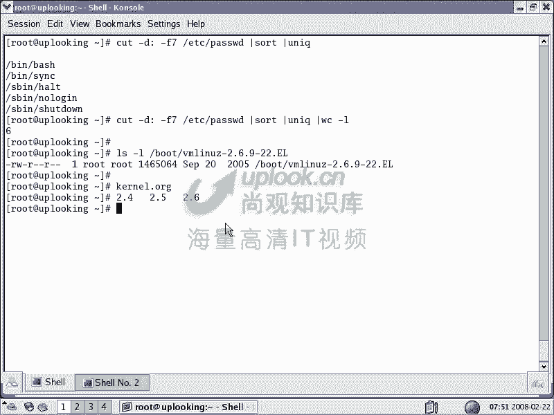
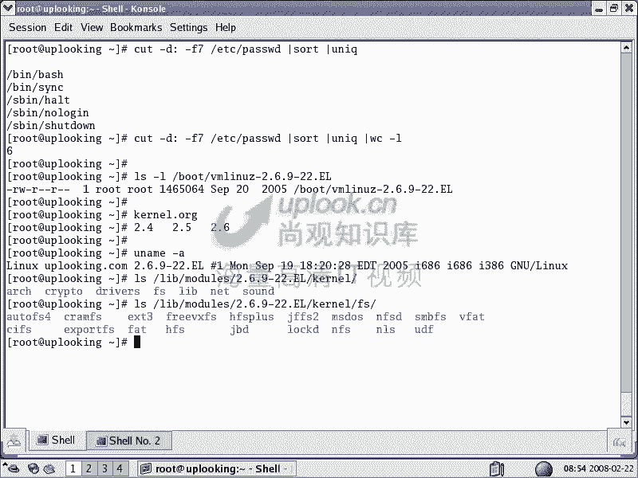
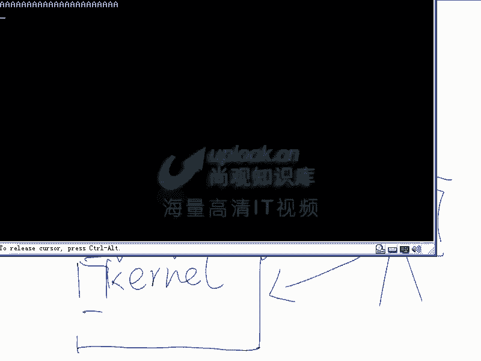
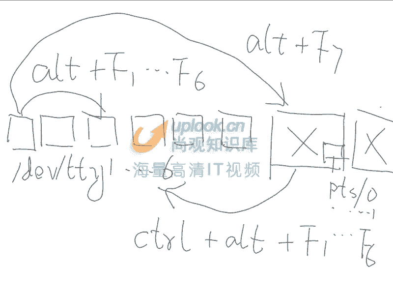
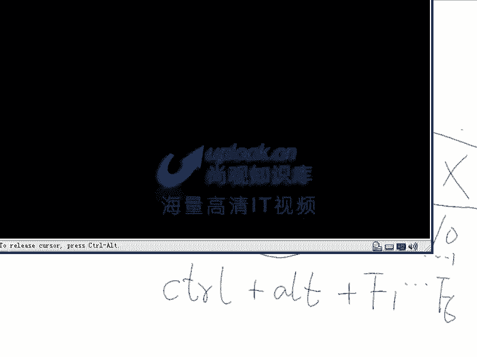
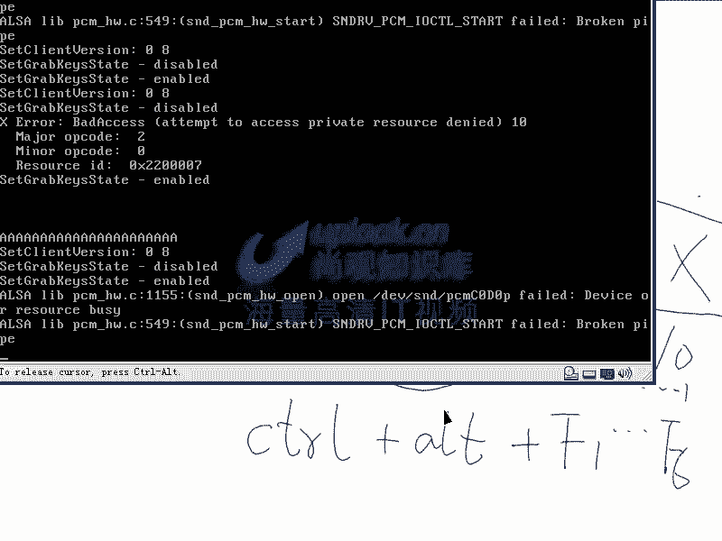
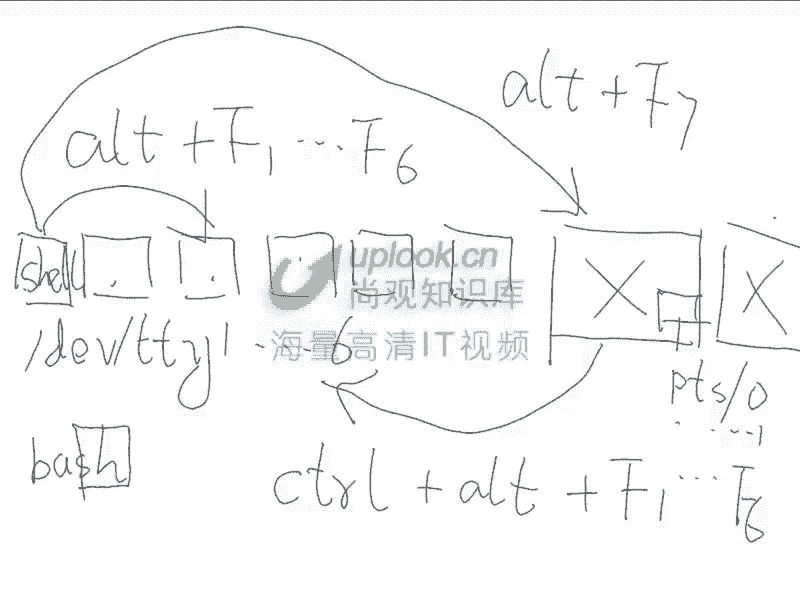

# 尚观Linux视频教程RHCE精品课程：P4：RH033-ULE112-02-1-系统结构与终端控制台

## 概述
在本节课中，我们将要学习Linux操作系统的基本结构，理解其核心组成部分的层次关系。同时，我们也会学习如何操作Linux的文本控制台和图形界面，掌握它们之间的切换方法以及基本的环境配置。

---

## Linux系统基本结构 🏗️

理解Linux操作系统的基本结构有助于我们更清晰地定位和解决问题。Linux系统可以划分为几个主要层次。

### 系统层次划分
Linux系统主要由以下四个部分组成：
1.  **内核**
2.  **内核模块**
3.  **库**
4.  **应用程序**

其中，Shell和各种工具都属于应用程序级别。

### 详细层次解析
我们可以通过一个分层模型来理解Linux系统。

*   **硬件层**：这是最底层，包括CPU、各种板卡、总线、芯片组等物理设备。
*   **内核空间**：这是操作系统的核心。
    *   **内核**：系统启动时加载的核心代码，直接与硬件交互。
    *   **内核模块**：可以动态加载到内核中的代码，例如网卡驱动。
*   **用户空间**：这是应用程序运行的环境。
    *   **系统调用接口**：内核提供给上层应用程序的编程接口。
    *   **库**：例如Glibc标准C库，提供更丰富的函数接口。
    *   **应用程序**：用户直接使用的程序，例如Apache、Shell、KDE桌面环境等。

应用程序通过调用库函数或系统调用接口，最终由内核完成对硬件的操作。Shell是一种特殊的应用程序，它为用户提供了一个与系统交互的命令行界面。

### 跨平台程序的原理
以Java程序为例，它之所以能跨平台，是因为它在操作系统和应用程序之间增加了一个**Java虚拟机**层。Java程序运行在虚拟机上，而虚拟机针对不同平台有不同的实现。这样，Java程序本身无需修改，只需在不同平台上安装对应的JVM即可。

**核心概念公式**：
```
用户操作 -> Shell/图形界面 -> 应用程序 -> 库/系统调用 -> 内核 -> 硬件
```

---

## 内核详解与安全警示 ⚙️




上一节我们介绍了系统的整体结构，本节中我们来看看核心部分——内核。

### 内核版本
内核有其版本号。在Linux系统中，可以通过以下命令查看当前内核版本：
```bash
uname -r
```
输出可能类似于 `2.6.9-22.EL`。

*   **版本号含义**：主版本号.次版本号.修订号-定制后缀。
*   **开发模式**：次版本号为奇数（如2.5）是开发测试版；为偶数（如2.4， 2.6）是稳定版。多个稳定版内核会并行维护和更新。
*   **内核源代码**：官方内核源代码可以从 `kernel.org` 获取。Red Hat等发行商会基于官方内核进行定制和优化，因此其内核（如带 `.EL` 后缀）与官方版本并不完全相同。

### 重要的安全提醒
**开源不等于绝对安全**。正因为代码公开，攻击者也可以分析代码以寻找漏洞。因此，在下载和使用开源软件（尤其是内核、Web服务器等核心组件）时，务必遵循以下原则：

> **必须从软件官方的、可信的网站下载源代码或安装包，切勿从不明来源的第三方站点下载，以防代码被植入恶意程序。**

---

## 终端控制台与环境操作 🖥️

理解了系统结构后，我们来看看如何实际操作它。Linux提供了多种交互环境。



### 文本控制台与图形界面
Linux默认提供了多个**虚拟终端**。

*   **文本控制台**：通常有6个（tty1 到 tty6），通过 `Ctrl + Alt + F1` 到 `F6` 切换。
*   **图形界面**：即X Window，是一个运行在用户空间的应用程序，通过 `Ctrl + Alt + F7` 切换（通常是第一个X会话）。

**关键点**：Linux的图形界面是可选的，不像Windows那样与系统深度绑定。这使服务器可以完全不启动图形界面以节省资源。

### 终端设备文件
Linux中“一切皆文件”，终端也不例外。
*   文本控制台对应设备文件 `/dev/tty1` 到 `/dev/tty6`。
*   在图形界面中打开的终端窗口，对应动态创建的 `/dev/pts/0`、`/dev/pts/1` 等。




你可以直接向这些设备文件写入数据，信息会显示在对应的终端上。例如：
```bash
echo “Hello from another terminal” > /dev/tty3
```
这条命令会将消息发送到第三个文本控制台。

### 查看与管理系统登录会话
使用 `w` 或 `who` 命令可以查看当前所有登录到系统的用户及其使用的终端。
如果想强制注销某个终端上的用户（结束其所有进程），可以使用 `skill` 命令。例如，结束 `pts/1` 上的所有进程：
```bash
skill -9 pts/1
```



### 启动额外的图形界面
如果系统默认启动到文本界面，或者你想开启第二个图形桌面会话，可以使用 `startx` 命令。
启动第二个X会话：
```bash
startx -- :1
```
启动第三个X会话：
```bash
startx -- :2
```
之后可以通过 `Ctrl + Alt + F7`、`F8`、`F9` 等在这些图形会话和文本控制台之间切换。




### 系统启动环境配置
你可以控制系统启动后是进入图形界面还是文本界面。



1.  **修改虚拟终端数量**：编辑 `/etc/inittab` 文件，找到类似 `1:2345:respawn:/sbin/mingetty tty1` 的行，删除或注释掉不需要的终端行。
2.  **修改默认运行级别**：在 `/etc/inittab` 中找到 `id:5:initdefault:` 这一行。将数字 `5` 改为 `3`，系统下次启动时将直接进入文本模式。运行级别 `5` 代表图形模式，`3` 代表多用户文本模式。

修改后，若需要启动图形界面，只需在文本模式下登录后执行 `startx` 命令即可。

以下是 `/etc/inittab` 中关键配置的示例：
```
# 默认运行级别：3为文本，5为图形
id:3:initdefault:

# 定义6个文本控制台
1:2345:respawn:/sbin/mingetty tty1
2:2345:respawn:/sbin/mingetty tty2
# ... 可以在此添加或删除 tty3 到 tty6 的行
```

---

## 总结
本节课中我们一起学习了Linux操作系统的核心知识。

我们首先剖析了Linux的系统结构，明确了**内核**、**模块**、**库**和**应用程序**的层次关系，并理解了Shell作为特殊应用程序的角色。

接着，我们深入探讨了**内核**的版本规则、开发模式，并强调了从官方源获取软件的重要性。

最后，我们掌握了Linux的**多终端环境**操作，包括文本控制台与图形界面的切换、终端设备文件的概念、如何管理用户会话、启动多个图形界面以及配置系统的默认启动模式。



这些基础知识是后续深入学习Linux系统管理、故障排查和性能调优的坚实基石。