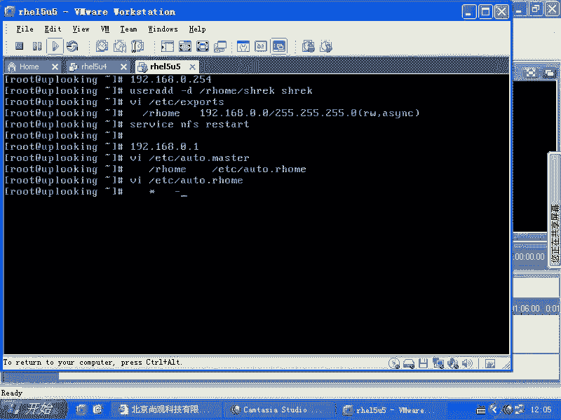
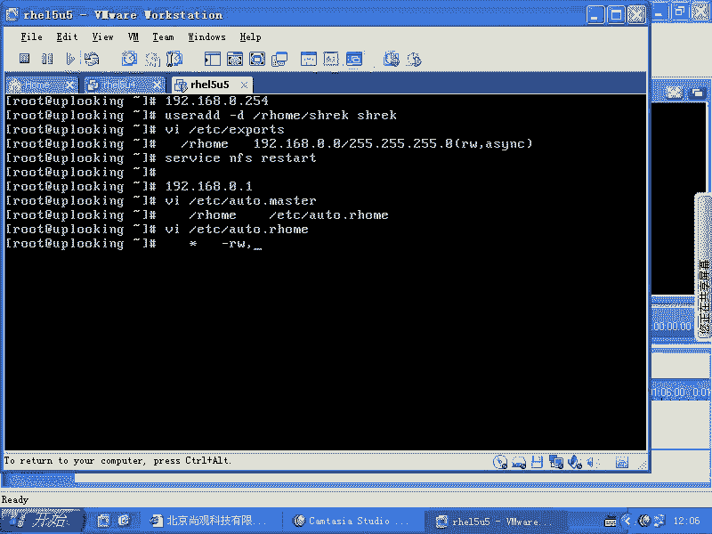
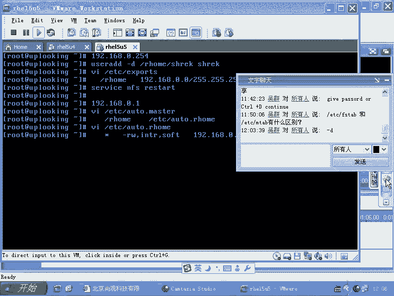
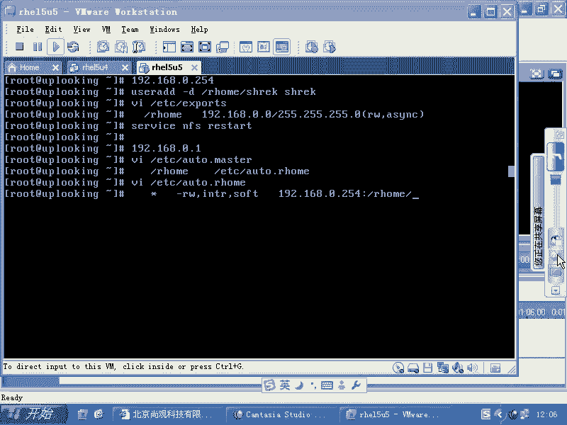
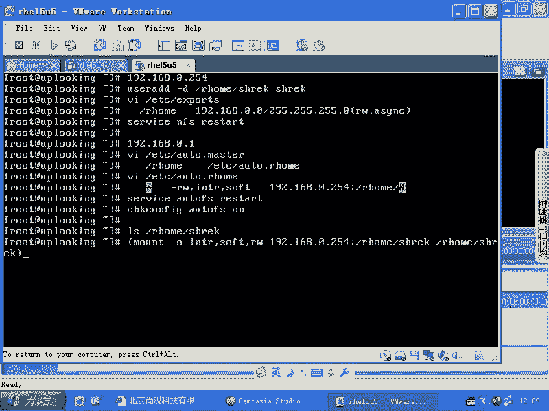
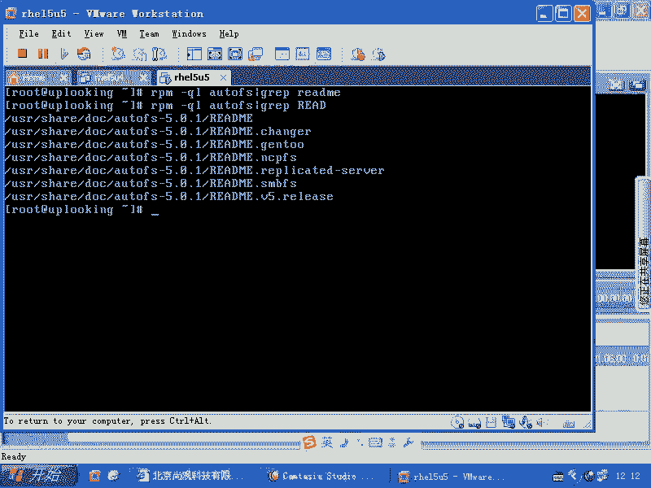
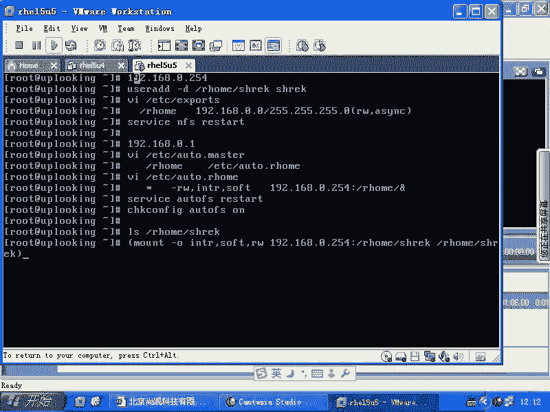
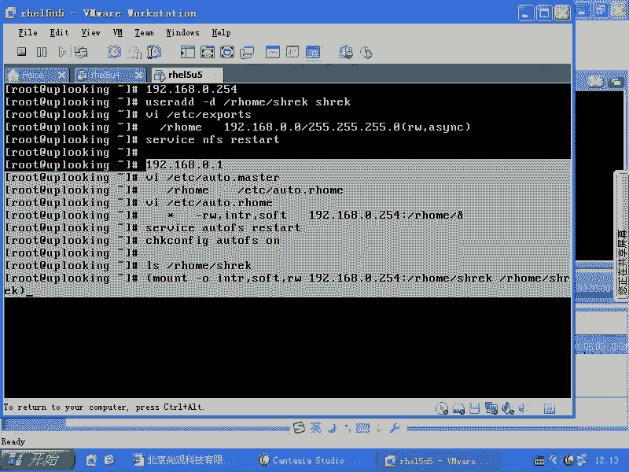
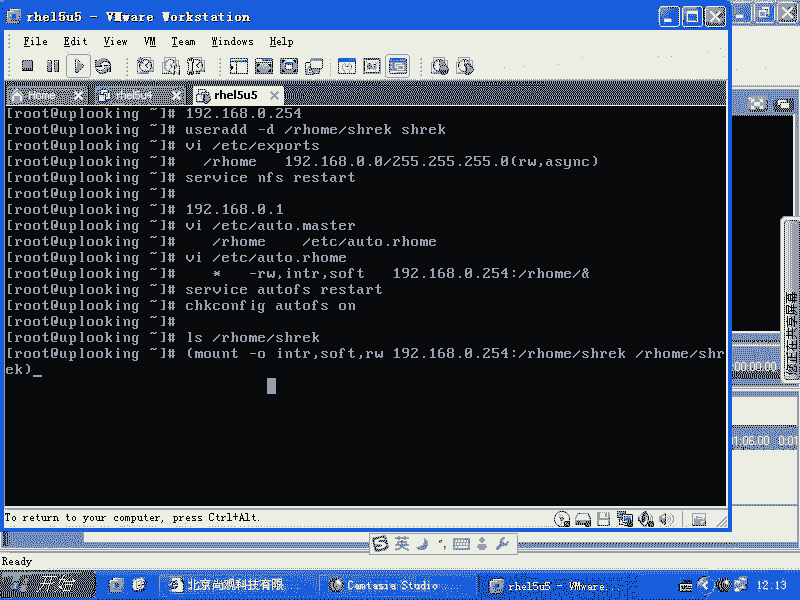
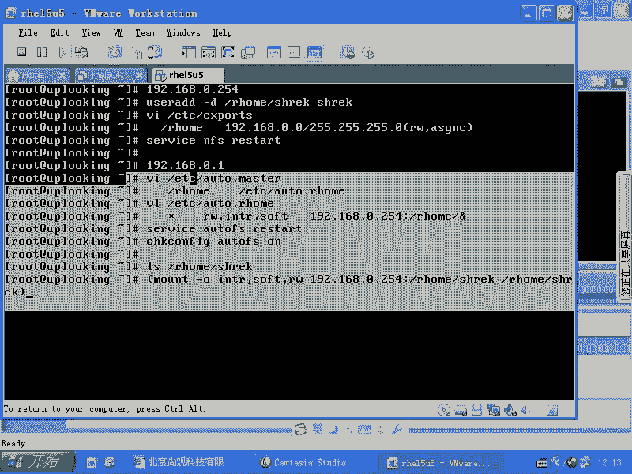

# 尚观Linux视频教程RHCE 精品课程 - P50：RH133-ULE115-7-1-autofs-nis-ruser - 爱笑的程序狗 - BV1ax411o7VD

看一下的话呢，就是系统。自动加载加载的时候啊，还有一个东西的话呢，是大家需要明白的，就是。FS table它我刚才说它很受限制，很受限制，受什么限制呢？就是说你系统不启动的话，它是不能去正常运行的。

是不是？那么如如果要是我们现在的话呢，想呃。就是想去怎么样呢？就是呃访问某一个点。而这个点的话呢，又是所有人都访问的。就是说如果我是如此账号，我就没有问题，我忘了账A，重新加载一下就可以了。

但是呢现在我这个机器的话呢，不是一个人去使用，一堆人去使用。我希望呢别人的话呢想去自动加载。他想去访问某个点的时候，在我允许的时候，它可以自动加载，是不是？这个时候的话我们用到另外一种题制叫做什么呢？

au to FSau to FSau to FS的话呢，它本身是一个就是考试的时候，HCE考试的时候也会考到的一个知识点啊，考到的一个知识点。那么这个课知识点的话呢，我们说在现实当中也是非常有用的。

它就特别像windows里面那个F盘，就是那个光盘啊光驱，你想光驱是怎么回事？我把光盘放到光驱里面去，是不是平时他就在那边放着，当我仿F盘的时候，是不是就会听到光驱呜这样的运运转起来是吧？

然后呢再看到里面的东西要过一段时间是吧？linux能不能实现？很容易实现。默认情况下用out to FS就可以实现它怎么实现的？大家看啊，我们看到它的配置文件。

一个是ETC下的all to点master。一个是什么呢？ETC下的out to啊，你就out to点星嘛啊。凹to点星啊凹to点master和auto点MISC就完全可以实现你想要的那个功能。

这个功能怎么样呢？你要想使用一个光盘的话，你是这样的mount第一下的CDro是吧？mount在比方说MNT目录下是吧？那我现在假如说把它mount在。MISC目录下的什么CD目录可不可以呢？没问题啊。

是不是？但是这个命令如果要是由你每次去执行的话，你们公司的话10个人在维护这个计算机是吧？说哎管理员过来给我输入一下mount子命令。然后呢，你刚出去吃饭没多久是吧？接到一个电话，哎，不行了。

我这边的话呢，赶快要用mount子命令过来再输一下。你把如如册账号给你，你自己去输，这也不可能，对不对？所以的话呢这时候我们想让它自动去运行的时候，就像windows里面那样的时候。

我们可以用auto f。那么怎么改这样改系统当中的话已经默认有了啊，你可以看一下VIETC下的au to点。😊，Master。啊，outto的话呢怎么去改呢？这样改在这里面加上一个什么呢？

杠MISC让它监视什么呢？这个目录auto F监视这个目录，它的配置文件是凹 to点什么MISC这个文件，是不是？然后呢再去VIETC下的au to点MISC在这里面的话呢，加上那个目录下的子目录。

就是MISC下的子目录MISC下的子目录是谁啊？CD是不是那我这边的话就添这个CD是不是？那么这个语法是什么呢？它还好有例子啊？VIETC下的auto点MISC你可以看它的例子，如果是CD的话。

它是这样。😊，看到了吧？他已经默认有这项了。所以的话呢我们看到这边啊。😊，就是说你把这个你把这个行默认在auto点呃MISC当中。那是表示首先的话呢，它前面那个就是那个大的目录下的子文件夹。

是不是大的文大的下面的子文件夹，也就是说MRSC下的什么文件啊？😊，CD文件夹是不是它以什么格式呢？ISO9660ROno SUIDnoDV为什么要加noDVno SUID？😊。

因为担心有人干坏事儿是吧？因为你现在是普通用户都可以去访问普通用户一访问什么呢？这个。呃，一访问这个目录的时候，它就会自动加载，这就有点像windows上那个F盘那个点一样，一访问F盘它就自动加载光盘。

对不对？这个过程的话呢是自动完成的，条件是什么呢？只要你把什么。outto FSrestar是吧，然后再去怎么样？对不对？你只要改好这两个文件，系统只要一启动。

那么别人任何人都可以去访问什么这个目录自动加载工区清楚了吗？听楚了是吧。我们常见的应用的话呢，不只是这个啊，我们还可以有其他应用。你想自动加载呃，你想自动加载，比方说NF共享是吧？那它这边也有例子。

你看一下。这边是不是也有例子啊？看这个是加载软盘，是不是加载硬盘，加载什么其他东西啊，那比方说我这样的加载一个。NFS共享。如果我想加载个NF共享的话，那我们看一眼。那我就去改凹凸点MRSC是不是？

在这里面，如果要是一个呃NF共享，那我就这样说了。访问。在这里边添加，比方说我这个是server一的。呃，就是比方说ser一是吧，ser一是吧，我访问。😊，MRSC下的server一这个目录的时候。

以只读的啊soft的方式就是软的方式，还有就是说可以中断的方式去访问哪个呢？访问server一是。192。168。0。1下的什么这个共享目录是吧？Y下的FTP。FTP下的POB是不是反正这个共享目录。

起火了吧。简单吗？就OK了。然后呢，一重启伏，一重启auto F它就会生效。当你访问这个点，它就自动加载。当你访问这个点，它就自动加载，明白吧？我们的话呢还有一个应用啊。

这个应用的话呢是稍微有点额外的功能的。这个额外的功能是这样的。你看我现在想访问的是什么呢？all to呃就是MRSC下的什么呢？一个已经定制好的名叫server一的这样的一个目录，对不对？它自动去加载。

这个我很好理解。但是呢现在我有一些目录的话呢，我也不知道名字，它该怎么做。你要不知道名字，你怎么去写这个地方呢？啊，我们来看一下这个应用的话呢，最广泛的应用在什么呢？最广泛的应用在我们的那个呃就是远程。

就是相当于分布式管理。就是呃我们有一个用户啊，他是在其他机器上。这个其他机器呢在那台机像有它的主目录，是不是？嗯，但是呢这个用户想在我的机象上来登录。我的迹象有没有他的主目录呢？没有是吧。

没有它的主目录。那我访问我本机的时候，即使能登录上来。用户每份密码都对，能登录上了，结果他主目录没有，是不是这个过程没有办法自动进行是吧？嗯所以这个时候我怎么样做？那我们知道。

我们的目录啊就是用户的主目录都是在哪？都是在一个服务器上呃，在一个服务器。比方在这里面啊呃比方说我现在的话在配置服务器，比方0。254这台机器啊，我怎么配呢？那么我去。我去添加。

我去添加我的这样的一个用户的时候，我可以设置它的主目录是在哪呢？比方说user add添加一个账号的时候是吧？然后呢，是用杠H文件是吧？啊，杠H参数是吧？我把一个用户的主目录放在哪呢？放在。😊。

R home目录下知道吧？R home目下的比方说shack，添加一个名叫shack的目录，可不可以？是杠H是不是做这个参数，我忘了。杠D啊。是干地吗？我记不清楚，其实我查一下栏配置可以查出来是吧。

是杠D是吧？啊。😮，刚闭刚毕啊。咁 b 啊。但大地啊。不是啊，当弟小小弟。那小弟呀。啊，现在我把它设置好一个主目录，是不是？也就是它的主目录在这个地方。那么我在这个服务器上的话。

我要VIETC下的exports，是不是我要改它这个文件，让NFS的话，把R home下面的所有文件夹是不是共享出去啊？那么我用什么呢？192呃，我去共享给192。168。0。0这个网段是不是？😊。

对吧共享出去以后是读写方式共享，是不是？然后呢，ASYNC。我这样供养出去了以后，然后呢，我再去怎么样，我再去service呃service NFSrestar是吧？我这时候我是不是就把它供养出去了？

共享出去了以后，那么我在客户端上啊，比方说192。168。0。1这台机上，我怎么配置呢？我先去VIETC下的all two点master是不是？然后呢，我在这里面添加的是什么呢？让它监视什么呢？

R home这个这是我0。1是我本机上的0。1，是不是本机上就0。1这台机上的R home目录，让它所对应的文件的话呢，我随便提一个，比方说叫做ETC下面的啊all two点R home。

比方说随便写啊，其实你不写Rho也可以，是不是然后呢，我再去怎么样？VIETC下的R home，是不是VI呃凹 to。😊，凹 to点are home在这里面的话呢，让他监听的。

你比方说你现在是创建了一个sh，我怎么知道你以后还要创建什么其他的，对不对？我现在没有办法预测我以后要加载的是哪个具体的目录，我可能有1000个目录是吧？1000个用户目录。所以这时候的话呢。

我不能去一个一个去指定，你添加个账号通知我，我再去添加一下，把au重启一下，这样太麻烦。所以话我有一种方法就是怎么样的？我把这个地方加上一个星。是吧嗯星就是所有的就是这个目录下的所有的子文件夹。

我全部都自动加载，怎么加载呢？那么这边就是杠什么杠。😡。

我忘了啊，应该放。RO呃ROoft INTR是吧？那我这边的话呢，我肯定就不能RO了吧。不能RO了是吧，RW是吧，逗号。😡。

INTR是不是soft是不是这是NFS共享的时候的三个参数，是不是？NF共享的时候是三个参数，也就是mount杠O。softNTR还有什么？还有RW是不是？那这样的话我去加载什么呢？192168。0。

254下的什么呢？Rho下的。哎，R后备箱的哪个呢？而后面要哪个呢？诶。

啊，刚才有同学告诉我杠D啊。

太丢人了是吧？老师脸皮特别厚，然后的话呢这个东西记不住也不脸红是吧？开个玩笑，就是说确实是这样的，就是有时候我是倒不是说不想记啊，是记不住，我记不住的话，我就知道怎么查，当然这是狡辩了是吧？

还是应该更更更清楚的知道啊，那么看R后面的什么呢？这边应该and。😊，没有吧。也就是说我现在的话呢，这个星是什么？这个and就是什么，明白吧？如果我去冒的前面是sharack的时候。

我我只要这样的改完了以后啊，我这样改完了以后，sorry是什么all to FS restart star是吧？然后呢check confi什么all to。😊，FS。2是吧我这样做完了以后。

只要有人什么他一访问啊，他LSRhome下的什么。😡，它就会自动把这个地方替换成什么？😡，Sck。自动往这个地方替换成什么？😡，是，这就相当于每次一访问的时候。

它就自动去运行什么mount啊杠O啊INTR逗号soft。逗号RW是吧，冒的192168。0。254。当中的。R home当中的什么shackmat在R home当中的shck，明白了吗？

它就相当自动在运行了。你去LS的时候，它就相当于自动在运行这个命令。明白了吗？有没有问题啊？没有问题是吧？所以这个新。还有这个and符号是字，就是它是什么样子，它是呼应的啊。

它是呼应的这两个符号是必须得要这样这样去写的。啊，必须得要这样去。有问题吗？那个案子的。好，案子应该放在前面是吧？我用那个。谢谢里面的好像他这后。chell里面它就是引用的意思啊。

但是它是auto FS配置文件，它跟视要编程应该没关系。

你觉得呢？这个的话你看啊。可以这样查啊。慢凹 to。FS。是吧在这里面的话，你找那个星。诶。找兴。Yeah。没有啊。啊，这确实没有。咩。auom mount啊man auto to mount。

也是没有。这边的话就是比较复杂的几个例子啊。哎，我记得以前我查过星河那个and符号啊，就是能查查到的。我现在如果要再继续查它，就是这样的RPM是吧，杠QL是吧。

all two FS是不是我看一下有哪些文档。这边的话呢是有3呃4个man配。4个man配置，然后呢，我这样的man5啊all to FS man6了。这第五号文档，是不是？哎，这儿的。看一眼啊。好。

看到吧？你说这个东西它是 shell要编程里面的吗？不是，就是它这个文档里面规定的，对不对？它不是 shell要编程，是不是？所以这个这个的话你能查到啊，这边刚才的话我给大家演示了。

就是说你怎么样去在linux里面查东西，看到了吧？呃，我也不知道该怎么查，但是我就查出来了，是不是，那么先是怎么样呢，先是呃几次man是吧？然后呢，我看了一眼这个看了一眼这个的话，怎么看到那个呢？

你看这边的话，我是不是看到它有两个8号文档，两个5号文档，是不是刚才我manau时候，它自动给我调出来的是什么8号文档啊，没有告诉我5号文档，所以的话呢我也不知道有5号文档。

然后我又man5au来是不是如果这个文档里面再没有的话怎么办？你再去看这些什么patch呃 patchch不用看看readme文件。你这样的加上一个什么呢？GIP。哎，如果没有的话。

那就可能是大写的这个面啊。没楚。是吧大read me，然后你再看readme文件里面怎么写。是不是这个案例啊我不需要多说了，一定要记住。

一定要记住什么意思啊？一定要记住。是不是怎么。明白吧？明白啊，把它记下来。然后呢，这个用法怎么样，到底是为什么这样的啊，那么这个前后的呼应为什么要要这样签，它的基理是什么啊？最后执行的时候。

它本质上讲是怎么怎么样过程是吧？一定要记住啊。😊，清楚了吗？好，上面的话是在服务器端做的啊，下面的话呢是在客户端做的啊，像下面是在客户端做的。

一般的话呢，你如果要是再去配置的时候，可能就配置的是什么。

服务器呃就是客户端是不是？

好。

