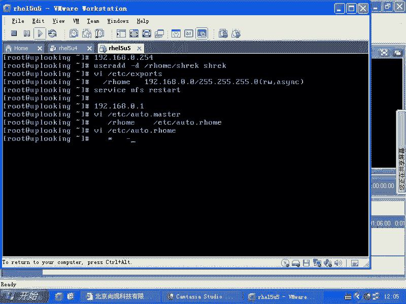
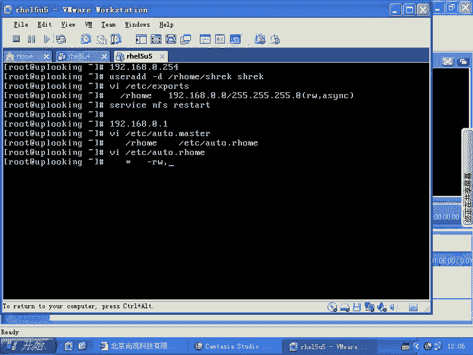
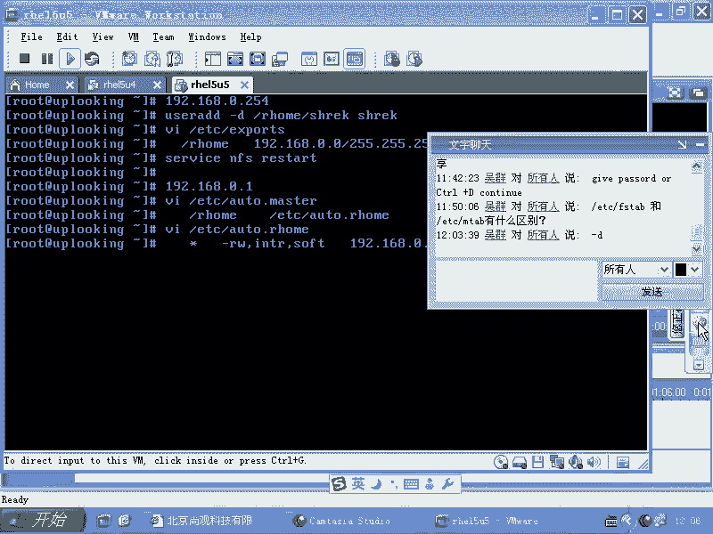
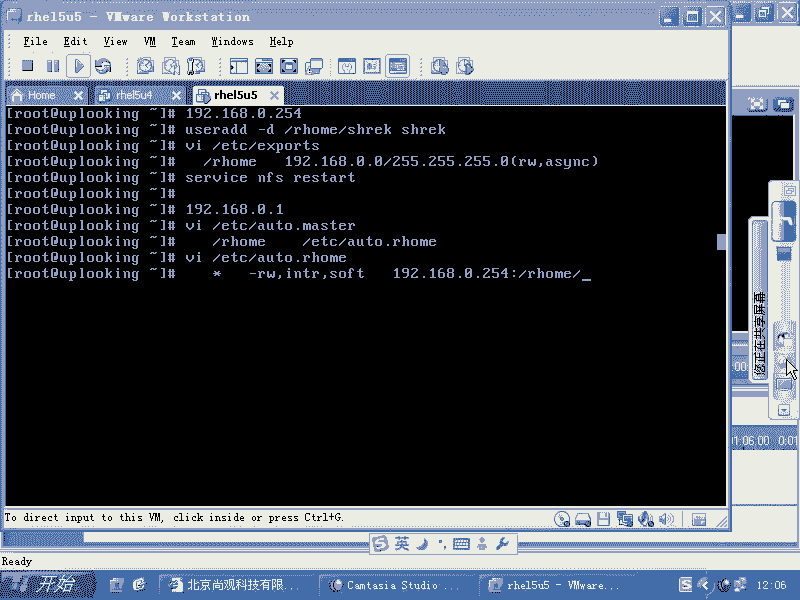
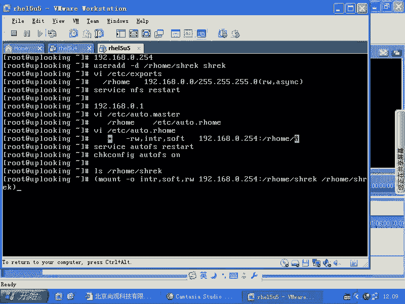
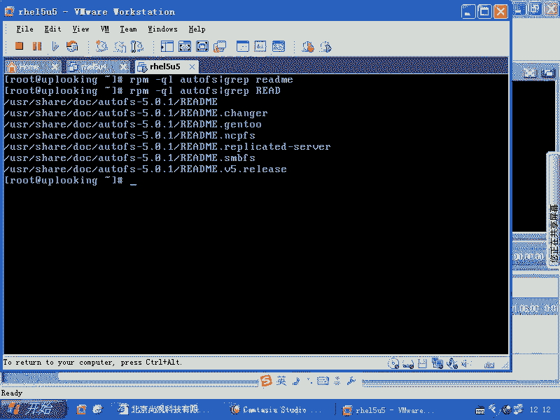
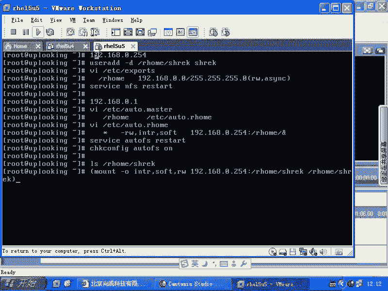
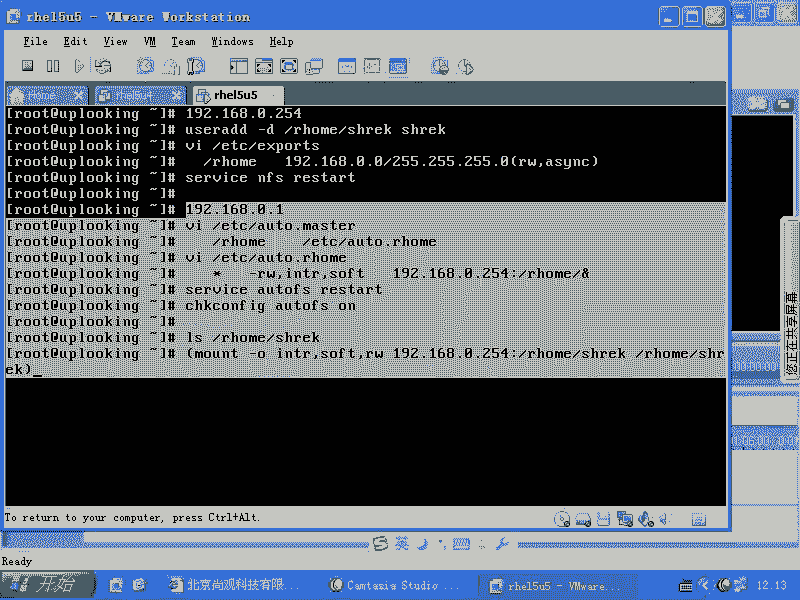
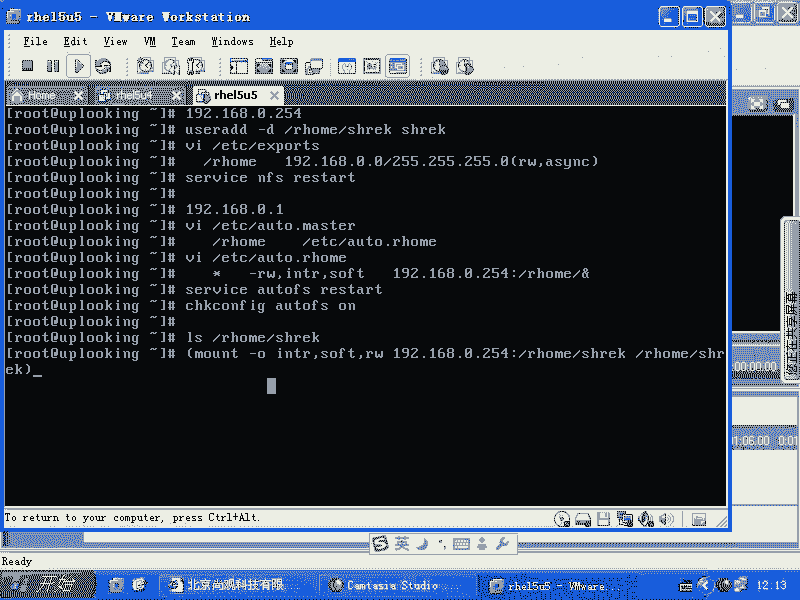
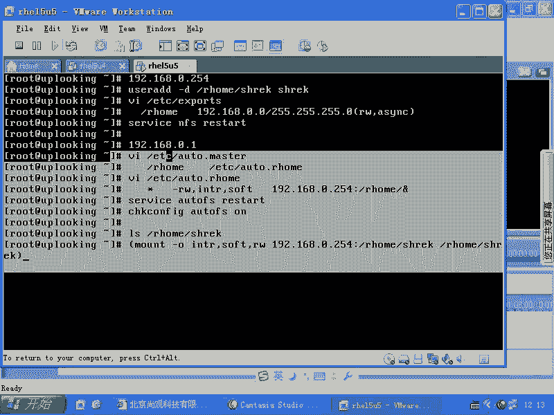

# 尚观Linux视频教程RHCE精品课程：P50：RH133-ULE115-7-1-autofs-nis-ruser 🚀


## 概述
在本节课中，我们将学习 `autofs` 服务。`autofs` 是一种自动挂载文件系统的机制，它解决了传统 `/etc/fstab` 静态挂载的限制，能够实现按需自动挂载，类似于 Windows 中访问光驱的行为。这对于多用户环境或需要动态挂载远程共享的场景非常有用。

---

## 传统 `/etc/fstab` 的限制
上一节我们介绍了静态挂载，本节我们来看看它的局限性。`/etc/fstab` 文件虽然常用，但存在一个主要限制：它依赖于系统启动过程。如果系统没有启动，或者挂载点对应的服务器不可用，那么挂载就无法正常进行。

在多用户环境中，如果每个用户都需要管理员手动执行 `mount` 命令来访问特定资源，效率会非常低下。因此，我们需要一种更智能、按需触发的挂载机制。

---

## 什么是 `autofs`？ 🤔
`autofs` 服务就是为了解决上述问题而设计的。它能够监控指定的目录，当用户尝试访问该目录下的子目录时，`autofs` 会自动触发挂载操作，访问结束后在一段时间后自动卸载，以节省资源。这在 RHCE 考试和实际工作中都是一个重要知识点。

它的工作原理类似于 Windows 中的光驱：插入光盘后，只有当你访问“F:”盘时，光驱才会启动并读取数据。

---

## `autofs` 的核心配置文件
`autofs` 服务主要依赖两个配置文件：
1.  **`/etc/auto.master`**：主配置文件，定义监控的挂载点目录和对应的映射文件。
2.  **`/etc/auto.*`**：映射文件（如 `/etc/auto.misc`），具体定义在挂载点下，各个子目录应如何挂载。

以下是配置文件的示例结构：
```bash
# /etc/auto.master 示例
/misc   /etc/auto.misc

# /etc/auto.misc 示例
cd      -fstype=iso9660,ro,nosuid,nodev :/dev/cdrom
```

---

## 基础配置示例：自动挂载光盘 💿
让我们通过一个简单的例子来理解如何配置 `autofs` 自动挂载光盘。

1.  **编辑主配置文件 `/etc/auto.master`**：
    添加一行，指定监控目录 `/misc` 及其映射文件。
    ```bash
    /misc   /etc/auto.misc
    ```

2.  **编辑映射文件 `/etc/auto.misc`**：
    添加一行，定义子目录 `cd` 的挂载参数。
    ```bash
    cd      -fstype=iso9660,ro,nosuid,nodev :/dev/cdrom
    ```
    *   `cd`：用户在 `/misc` 目录下访问的**子目录名**。
    *   `-fstype=iso9660,ro,nosuid,nodev`：挂载选项，指定文件系统类型为只读，并禁用 `suid` 和 `dev` 属性以增强安全。
    *   `:/dev/cdrom`：要挂载的设备。

3.  **重启 `autofs` 服务**：
    ```bash
    service autofs restart
    ```



配置完成后，当任何用户执行 `ls /misc/cd` 时，系统会自动将光盘挂载到 `/misc/cd` 目录下。



---





## 进阶应用：自动挂载 NFS 共享 📡
`autofs` 更常见的用途是自动挂载 NFS 网络共享。以下是配置步骤。

1.  **在 NFS 服务器端**：
    确保已共享所需目录。例如，在 `/etc/exports` 文件中添加：
    ```bash
    /shared/data 192.168.0.0/24(rw,async)
    ```
    然后重启 NFS 服务。

2.  **在客户端配置 `autofs`**：
    *   编辑 `/etc/auto.master`，添加监控点。
        ```bash
        /nfs   /etc/auto.nfs
        ```
    *   创建并编辑映射文件 `/etc/auto.nfs`，定义挂载规则。
        ```bash
        data   -rw,soft,intr   192.168.0.100:/shared/data
        ```
        这表示访问 `/nfs/data` 时，会自动以读写、软连接、可中断的方式挂载服务器 `192.168.0.100` 的 `/shared/data` 目录。



---

## 高级应用：动态挂载用户家目录 🏠
在分布式环境中，用户的家目录可能集中存储在 NFS 服务器上。我们无法预知所有用户名，因此需要一种动态挂载机制。

1.  **服务器端准备**：
    *   创建共享目录，如 `/home/users`。
    *   使用 `useradd -d /home/users/username` 命令创建用户，并指定其家目录。
    *   在 `/etc/exports` 中共享 `/home/users` 目录。

2.  **客户端配置 `autofs`**：
    *   编辑 `/etc/auto.master`：
        ```bash
        /home   /etc/auto.home
        ```
    *   编辑 `/etc/auto.home`，使用通配符 `*` 和 `&` 变量实现动态映射：
        ```bash
        *       -rw,soft,intr   192.168.0.254:/home/users/&
        ```
        *   `*`：匹配 `/home` 目录下的**任何子目录名**（即用户名）。
        *   `&`：在挂载时会被自动替换为访问的**子目录名**（即 `*` 匹配到的内容）。

    当用户 `alice` 登录并访问 `/home/alice` 时，`autofs` 会自动执行等效于以下命令的操作：
    ```bash
    mount -o rw,soft,intr 192.168.0.254:/home/users/alice /home/alice
    ```



---





## 总结
本节课我们一起学习了 `autofs` 自动挂载服务。我们从传统 `/etc/fstab` 的局限性出发，引入了 `autofs` 按需挂载的概念。通过三个由浅入深的示例：自动挂载光盘、自动挂载静态 NFS 共享以及动态挂载用户家目录，我们掌握了 `autofs` 的核心配置方法。






关键点在于理解两个配置文件的作用：`/etc/auto.master` 定义监控点和映射文件，而具体的 `auto.*` 映射文件则定义了挂载细节。对于动态场景，灵活使用 `*` 和 `&` 通配符可以极大地简化管理。记住，配置完成后务必使用 `service autofs restart` 命令使配置生效。