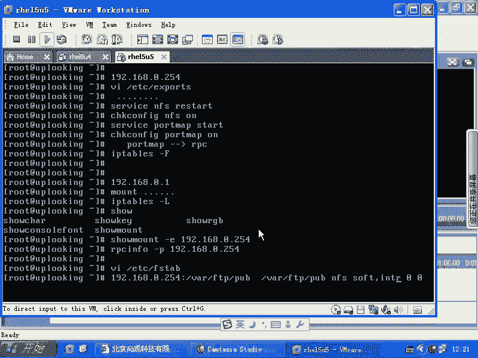

# 尚观Linux视频教程RHCE 精品课程 - P51：RH133-ULE115-7-2-autofs-nfs-showmount - 爱笑的程序狗 - BV1ax411o7VD

如果是我们再去做auto FS的时候，大家刚才看到我们怎么样让它自动加载一个远程账号的主目录，是不是那个过程的话都写清楚了是吧？假如说我们想进行一下这样的tro播 shootingoting。

那么有些什么内容呢？那我们知道在服务器那端，比方说192168。0。254这个地方，是不是0。254上，我们会把一个目录共享出去，是不是？但是它共享了，你这边得不到。这到底是什么原因？

是不是我们在讲网络部分的 trouble播数ing的时候，要大家先去pin，是不是？然后呢再去看对方的端口，是不是？那其实的话呢，对方如果要是配置好了VIETC下的export以后啊，export以后。

然后呢，比方说共享了这个目录以后，service nFS restartstar以后，比方说又check onfi个NFS on了以后是吧？是在服务器端进行的，是不是？😊，你连接不到对方。😡。

那是什么原因？到底怎么样去确定我这个auto FS明明配置的好，怎么最后它就登录不上去，或者没有自己的主目路，是不是什么原因造成的？那么我们可以看一下，你要想去确定这些点的时候，我们原来告诉大家。

你可以te端口，是不是？那么它在这边启动了NFS服务以后，实质上它会怎么样呢？去必须得要启动什么呢？一个叫做port map啊， star。这个服务要启动。也如在服务器端的话，你应该先去启动什么？😊。

port map这个服务啊，port map服务的话呢，它是远过程调用的一个支持服务。NFS就基于什么远过程调用。也就是说，port map。😡，他是支持谁呀？他是支持RPC通讯的。

你应该在启动NFS服务之前先把什么port map服务先启动，明白吧？然后呢，在服务器端的话，你还应该运行什么呢？IP tables让大F把所有的规则的话呢清空掉，是不是把这个规则清空掉。

让别人能访问到，就是你出现问题的时候，你要先看这个规则是不是阻挡了你的这个数据包进入，是不是？好，这边是在服务器端。如果别人反复不到你，你应该自查的东西post map启动目标。

app table有没有阻挡，是不是？然后呢，在客户端的话呢，他比方说现在我在192。168。0。1，我死活mount不上，又mount不上。那么你首先应该怎么样呢？

如果你auto fS auto F Smount不上是吧？那你手动去mount一下，是不是手动去mount一下，看成不成。如果要是不成的话，什么原因造成的那可能你连接不到对方的那个应用，是不是？

那你也应该怎么样先去看一下i tables什么有没有有没有规则是吧？呃i tables的规则的话，用个大F的话也可以清掉。然后呢，你可以这样的用收。Mo子。啊。Show mount。杠1。

然后加对方的IP。你看一下他那边有哪些共享能不能去加载。就是说你如果能看到对方有共享是吧？那你去加载应该是没有问题。如果你压根看不到他有共享，那说明这个通道就不通，是不是？然后如果要是不通的话。

什么原因不通呢？😡，就是说你去访问对方的时候，你看到的是一个结果，就是说不通是吧？不通的话呢，按理说对方应该已经打开这个服务了。但是他为什么就是他到底有没有打开NFS服务比较麻烦的是什么呢？

他用的端口不是一个啊，它不是一个端口。所以你要先看它前面的这个协议到底有没有支持NF你怎么样去确定他前面这个协议有没有支持呢？那你要用什么RPC通讯的相应的命令是吧？RPC是吧infoRPCin杠P。

然后加上对方的IP地址。明白吧？这样的话，你看一下列表当中有没有NFS字样，也就是NFS服，我知道你启动了。但是呢在port map当中有没有这个NFS字样的支持。

那么你要看一下对方有没有这个NFS服务放在RPC通讯当中，是不是就是用RPC info啊来做的这就是。S的一个什么呢？一个确定啊。对NFS的一个确认，就是NFS呃RPC info啊RPC info。

当然autoFS的话，那那边是远程的这个用户是吧，让他漫游在你的机器上来，是不是？嗯那你自己的机器的话呢，每次系统启动的时候想去自动加载1个NFS共享。

当然可以去什么VIETC下的FSTAB是不是在那里面的话加上1921的8。0。254，然后呢，下面的什么目录呢？比方说下的FPP啊POB目录是吧？mount在你的下的FTPR的POB目录是不是然后呢。

是以什么方式呢？比方说杠呃，比方说是以呃。😊，NFS方式是不是NFS方式，然后呢加上一个什么呢？比说soft啊，逗号INTR是吧是？然后00这样子添加到这个文件里面。每次系统启动时候，它就自动去加载。

每次系统启动的时候，它就自动去加载。明白吧？啊，默认是读写。那么你这边要只读的话，就是逗号RO。是不是？其他的没有什么太多的好说的了啊，这就是有关auto FS和NFS连用的时候的一些补充是吧？

troub疏oting是不是？那么NF的超波书ing也是这个过程。port map不启动，你的NF就不启动。以前的HCE考试的话呢，有trouble shootingoting。

就是说你要把NF启动起来，结果NFNF一启动就出错是吧？什么原因呢？port map没有启动，也就这是一个典型的服务之间的依存关系。是不是以前我们说你如果要是SSA想启动network没启动。

你SSC是启动什么？是不是？所以的话我们就是先启动network再启动SS这个是一样的。你的NF依存于什么RPC通讯，RPC通讯还没有启动，也就是port还没有启动。那你的NF何谈启动呢。

所以这也是一个典型的依存关系，明白吧？

