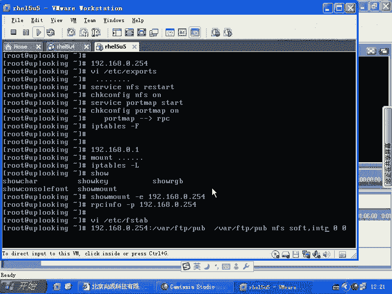

# Linux系统管理：P51：AutoFS与NFS故障排查


在本节课中，我们将学习如何对AutoFS和NFS服务进行故障排查。当配置了自动挂载远程主目录，但客户端无法成功访问时，我们需要系统地检查服务器端和客户端的配置与状态。

## 故障排查概述

上一节我们介绍了AutoFS与NFS的基本配置。本节中，我们来看看当配置看似正确，但客户端无法挂载远程目录时，如何进行系统性的故障排查。

排查的核心思路是分层验证：从网络连通性开始，逐步检查服务状态、端口开放和防火墙规则。

## 服务器端排查

如果客户端无法连接到NFS服务器，首先应在服务器端进行自查。以下是服务器端需要检查的关键点：

1.  **检查Portmap服务**：NFS服务依赖于RPC（远程过程调用），而`portmap`服务是RPC通信的支持服务。必须在启动NFS服务之前启动`portmap`服务。
    ```bash
    service portmap start
    ```

2.  **检查防火墙规则**：服务器的防火墙（`iptables`）可能阻挡了NFS相关的数据包。在排查时，可以临时清空防火墙规则以确认是否为防火墙导致的问题。
    ```bash
    iptables -F
    ```

## 客户端排查

在服务器端自查无误后，如果客户端（例如`192.168.0.1`）仍然无法挂载，则需要在客户端进行排查。以下是客户端排查步骤：

1.  **尝试手动挂载**：首先绕过AutoFS，尝试使用`mount`命令手动挂载远程目录。这有助于判断是AutoFS配置问题还是基础的NFS连接问题。
    ```bash
    mount -t nfs 192.168.0.254:/shared/dir /local/mountpoint
    ```

2.  **检查客户端防火墙**：同样，客户端的防火墙规则也可能影响连接。可以临时清空规则进行测试。

3.  **查看服务器共享列表**：使用`showmount`命令检查是否能从客户端看到服务器提供的NFS共享列表。如果看不到，说明NFS服务通道可能不通。
    ```bash
    showmount -e 192.168.0.254
    ```

4.  **验证RPC服务注册**：NFS服务启动后，会向RPC的`portmap`服务注册。使用`rpcinfo`命令可以查询服务器端是否成功注册了NFS服务。
    ```bash
    rpcinfo -p 192.168.0.254
    ```
    在返回的列表中查找是否有`nfs`相关的服务条目。

## 服务依存关系与开机自动挂载

NFS服务对`portmap`服务的依赖是一个典型的服务依存关系案例。如果`portmap`未启动，NFS服务将无法正常启动或工作。这类似于`network`服务未启动时，`sshd`服务也无法正常工作的情形。

此外，如果希望每次系统启动时自动挂载一个NFS共享，而不是依赖AutoFS，可以将其配置写入`/etc/fstab`文件。例如：
```
192.168.0.254:/ftp/pub /mnt/pub nfs soft,intr 0 0
```
*   `soft`和`intr`参数允许软挂载和中断挂载操作。
*   如需只读挂载，可添加`,ro`选项。

## 课程总结



本节课中我们一起学习了AutoFS与NFS服务的故障排查方法。关键点包括：确保服务器端`portmap`服务先于NFS启动；检查服务器与客户端两端的防火墙设置；在客户端使用`showmount`和`rpcinfo`命令诊断连接与服务状态；理解NFS依赖于RPC通信的服务依存关系。掌握这些排查步骤，能够有效解决大部分NFS共享访问失败的问题。