# 尚观Linux视频教程RHCE 精品课程 - P52：RH133-ULE115-8-1-fdisk-mkfs-fsck - 爱笑的程序狗 - BV1ax411o7VD

哎，我们看一下啊，那么当我们现在有一个。就是说有一个需求，就是说想用一个新的存储的时候，看到我们那个体系结构的以后，我们就知道啊我们怎么样去使用它呢，我们就应该mo它，是不是加载它。

那么典型的一个过程是什么？这就是我们马上要讲的这个过程。也就是说现在我现在有一个新的硬件。我首要的任务是什么呢？先FD把它格式化，是不是格式化完了以后再去怎么样呢？把它加载到VFS的体系当中去。

是不是然后呢再去怎么样呢？再去使用它，对吧？这是我们一般的话呢操作的操作。那么我们首先看一下。

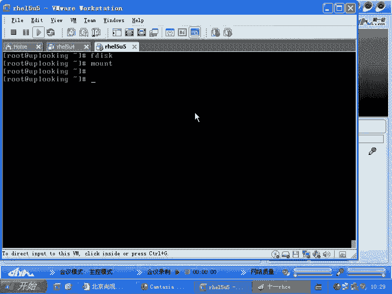

刚才没有共享啊。我们首先看一下。我们首先看一下。呃，F disk啊F disk。起到分区作用的。就是说你现在要知道你不分区有没有关系啊。部分去实上也能直接用的。明白吧？就我有块硬盘，这块硬盘的话，一T。

那我这一T的话就整个做成一个大的券，是不是？我可以不用分区，我许直接慢的，就跟你的U盘是一样的。我直接FD呃，就是makeFS的时候，我直接对这个什么这个硬盘整个进行格式化。

我一连SDA1SD2我都不一要，行不行？行啊，你这硬盘的话，你又不想分区，那无所谓啊，对不对？只不过这个没有分区表而已。是不是？O我们现在的话呢想去分区的时候，这是我们一般要做的是吧？

当我们想去分区的时候，用什么呢？F disk或者什么，或者说party。是吧还有其他的很多的这个工具，你比方说光盘启动的时候，是不是它有一个工具叫磁班德鲁伊，是不是啊，这种类型的工具太多了。

就是分区格式化的工具太多了。那么你还可以有什么Pq magicic是吧？说哎PQ magicic是windows平台的是吧？那你用这光盘引导有个PQ magicic，它把它格式化的1个EX3稳件系统。

这有什么关系呢？没有任何关系啊，说还有人说什么啊，这个ghost有没有linux版的是吧？那你这个ghost用着光盘引导起来以后的话，那个ghost。呃，你还有什么版本之分呢？是吧？

你用windows版的也没有关系，它是最直接对硬盘进行操作嘛，对吧？所以Fpart都是一样啊，那么我们一般的话呢会讲Fdi的话呢会讲很多啊，因为Fdi的话最老牌用的也最多是吧？那么触类旁通，一般的话呢。

我们可以常见的参数有个杠L杠L的话，是列出所有已经加载的就是已经就是装上的这个硬件的什么分区表是不是那么当然你想看指定的时候，那就怎么样杠L。

然后加上一个DV的SDAE是不是SDA这样的话就很就能看指定的这个硬件的分区表。那么我们如果要是想去对它进行分区的时候，FDD的SDA啊，这样一回车以后的话，我们将会对它进行什么分区是不是？

那么我们进去以后的话呢，大家可以先记一下笔记啊，就是说它有些什么参数，你可以按N创建分区是吧？可以摁D删除分区是不是可以摁P打印分区是不是？那么不管你是创建了还是删除了。那么最终的话呢，你不摁一个W。

你是没有办法写入分区表，是明白吧？所以这就是基本的一个过程。当然了，你还可以按L来列出什么呢？这边的话呢就是对分区的。叫什么呢？叫分区的类型编号，是不是我们知道ES三分区，我们看另外一边啊。

我们看一眼F disk是吧，杠L。那么他这边的话呢，会告诉你说这个分区是一个lininux的分区，是不是嗯他凭什么告诉你是lininux分区？你刚格式化完是吧，还没有人任何人用呢。

是不是他告诉你是linux问具，这很正常是吧？😊，那凭什么是因为什么呢？前面这个标号就是分区的话，它有编号的83是表示的是EXT2或者EX3的分区。是不是那82表示什么呢？swipe分区啊。

如果你有一个wifi的分区的话呢，它应该是什么三还是5，我忘了啊，这个大家可以自己看一下，就是F disk呃 air的时候，或者是用什么呢？用其他工具的时候，你都能看到，还记得那个。呃，G。

grab那个grab的话呢，它就会有这个就是说gra进去以后，你比方说我找一个分区是吧？他会告诉你此分区的类型为什么0X83是吧？0X表示16进制是吧？83标号啊，83标号的话。

就是ESER或者EX3分区，明白吧？那么我们想改的时候是怎么改呢？你可以按L看到所有的分区的标号啊，约定俗成这个编号到底代表什么分区啊，还可以按T来改它的编号，但是这个操作的话呢，现在我们已经不怎么用。

以前的话我用过，以前我用过来是干什么呢？它用来就是用T的话呢，改某个分区，那么是用来把一个分区给它变成什么呢？变成呃就是PV啊，就是你不把这个分区的编这个类型改成PV的这种类型的话。

LVM拒绝使用这个分区。嗯，你比方说你刚分了个分区是吧，摁N是吧？我假如说Fdi低V下的SDA以后，我摁N新添加一个分区是吧？这个分区的话呢画了多大呢？比方说500500兆啊。我画了这个分区以后。

它是什么类型的？分区刚分怎么会有类型呢？我还没有格式化它呀。是不是啊我刚分分区，然后没有格式化，它他怎么会有EX3类型，EX2类型的？没有吧，所以它有个默认的类型是什么？83。呃。

就是在linux里面啊，它就用了83的类型，用83的类型以后，我的PVc就是我去创建一个。物理卷的时候，这个LVM就拒绝执行，他什么？哥们，你搞错了，这个分区是什么？是ES3类型，不是我的PV类型。

是不是？所以他就拒绝执行。但是现在的话LVM没那套了，他才管理三七21是吧？直接83就83来吧，是吧？PV就PV直接我把你转成PV明白吧？就是原来我改这个东西是做这个用啊，但是现在的话呢。

你只要知道用T可以改什么分区的类型就好了啊，改完类型编号了以后，他只是改类类型编号并不会给它格式化了，明白吧？就在有些操作的时候是需要的。所以我们现在看到这个简单不简单。😊，如果你FD测完了以后啊。

W写入了以后，你需要输入一个什么呢？part。pro是不是partpro这个命令的话呢，就是说我如果要是现在在使用SDA啊，SDBSDC这倒是无所谓啊，就是我我现在发觉是无所谓。以前的话也不一定。

就是以前的话呢，你不管弄哪个硬盘的话，你必须得运行一下partpro，你新分的那个硬分区的话，才能被。我们的操作系统所使用。你比方说我新分了一个分区，新分了一个分区，你用FD杠L也能看得到这个分区。

但是你去格式化它的时候就怎么样，它就不允许了吧？为什么呢？因为他觉得这个分区是没有存在的。你说我明明可以按用FD看到，但是你要知道FD跟内核是两码事，是不吧？内核加载这个硬盘的时候。

他还用的是老的分区表。所以part probably的话就是说。内核你去看一下这个分区表有没有变。如果有变的话，你就把你那边的分区表更新一下。明白了吧？有了这步以后再去怎么样呢？

这时候新的分区是不是可以用了，新的分区可以用了以后，你再去怎么样？make FS点EX3把它格式化。格式化以后，比方说第一片SSDA是吧，5是不是把它格式化格式化完了以后的话再去怎么样呢？

再去加载D下的SDA。😊，5、然后呢加载到比方说某个目录下，对不对？那么mark命令是不是一个命令啊？我们说过一个命令一执行以后，是当次生效，下次启动的时候生效不生效，不生效。于是的话呢。

我们想让它自动去加载时候叫VIETC下载FSTAB让这个里边的话呢加上一行什么呢？就是把DU下载SDA5加载到date目录下去是不是它的类型是什么呢？EXT3类型是不是然后呢。

DEFAULT就是默认的方式去加载是吧？😊，哎，deface嘛？然后呢加上一个什么呢？1一是吧？还是要检查的，是不是？如果要是有问题的话，还是要检查是是？那么这样的话呢，就是我们所谓的什么呢？

这就是被这个第一个一的话是表示呃第几个检查是吧？哎，当第一个第一个数字表示每多少天当一次是不是？后面这个一的话是表示零的话是表示第一个检查这个磁盘是吧？然后一的话表示第二个来检查这个磁盘是不是？

有好几个一编号的时候，它就是谁排在前面谁先检查。😊，所以这样的话呢，我们就可以看到就是这个文件的话呢，是怎么那这一行的话是添加到FI table当中。这样的话加上去以后。

还记得FS table是由谁来调用的吗？😊，就是我们系统启动的时候，IIT启动的时候，是不是它有个叫做RC点ss这个脚本的话呢会调用FS table。

对吧会把FRStable下所有的这个它默认默认的能装载的这些呃分区全部都装载起来，是不是在RC点s当中，它会被装载啊。对对，mount杠A命令就会访问ETC下的FStable。明白了吧。也就是说。

在RC点s这个脚本里面会调mont杠A。mon杠A的话呢就会去访问这个文件，访问这个文件按照里面的格式化，把它什么加载起来。清楚了吧，这就是我们的整个体系结构啊。其实我讲到这个地方。

如果有一点工作经验的人，有一些工作经验人，他就可以了不用再说了，是不是？就非常简单了。当然我们给大家演示一下啊，演示一下。好，我们看这另外一边，首先呢我看一下文件系统的格式。

是不是看呃看一下文这个分区的这个呃有哪些分区，就是这个硬盘的分区。然后呢，我们这样的DV下的SDA是不是我现在的话呢想去把它进行什么进行分区。那么当然了，你可以NM获得帮助，是不是？

那现在我想新建一个分区的时候，NN新建。😊，因为。我先干样拿。然后NP打印一下是吧，现在有三个分区是吧，分别是SDA1、SDA2和SDA3还记不记得我跟大家说过SDA就说我们这样的一个硬盘。

不管是哪个硬盘，它的分区表默认是成纳容纳4个分区是吧？因为标准分区表是不是64个字节啊？64个字节，每个分区占16个字节，那他总共就会有4个分区。当是很多人说，哎。

我这起话十几个分区我都分过什么四个分区胡扯是吧？那是因为你创建第一个分区的时候是主分区，第二个分区就会把所有的剩余的空间全部都变成一个什么扩展分区。然后你再去创建分区的时候，这个分区的分区信息。

它不会放在EPT当中，而放在哪啊？放在扩展分区的活动分区表当中。明白吧？那这时候的话呢，你可以怎么样呢？你可以在我们的这个呃就是说相当于我如果要是创建一个N啊，我创建个分区，这时候我创建一个扩展分区。

N一下E啊。你看按下E这个E的话呢，我要创建它是一个扩展分区。这个时候的话呢，我可以把默认大小啊，你说这个分区从第几个柱面开始回车就是从默认的第一个空闲柱面开始，明白吧？

他说从103啊1432号这个柱面开始，可不可以，你要回车的话，就是可以，除非你有其他需求。你说我要空余段空间出来以后再用，那我可以怎么样呢？我可以在这边加上一个数字，这个数字就是说从第几个柱面开始。

那么我默认情况下就是回车，就是从第一个空余的柱面开始，对吧？接下来我这个分区要分多大呢？如果要是我现在已经。

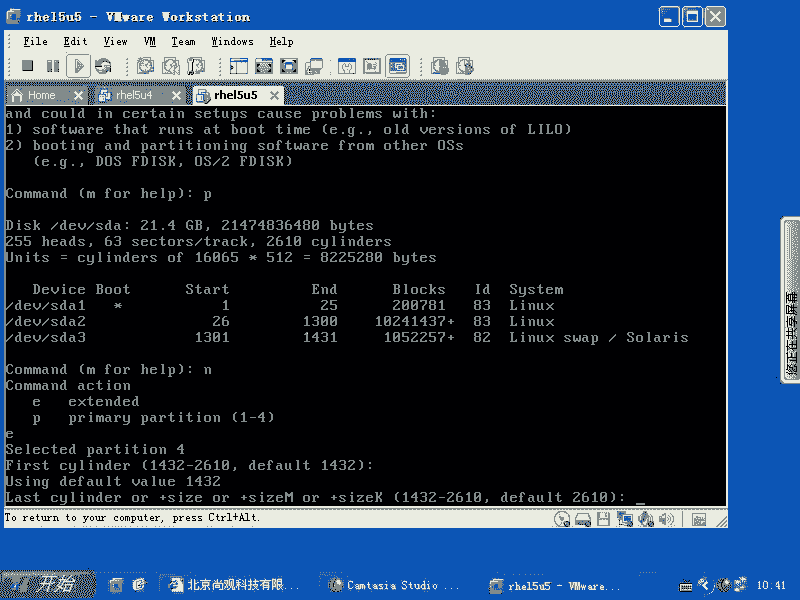

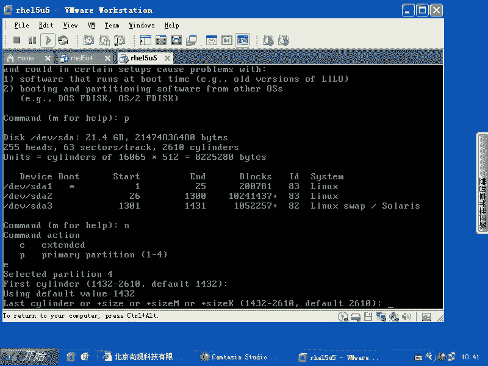

我现在总共能创建4个主分区，主分区加扩展分区，我总共能创建4个是吧？他们都放在DPD当中。那么我如果要是这四个就是这第四个分区，如果我只创建什么呢？很小的一段，是不是？

那么我其他空间是不是没有办法再创建分区了？因为我四个名额已经占满了，是不是？所以我创建这个扩展分区的时候，我就是按最大的来，从第一个空余开始到最后一个空余结束，是不是？所以这个时候我就怎么样直接回车。

也就是我现在创建了一个扩展分区，这个扩展分区就是SDA4，是不是这个扩展分区的话呢，占用了剩余的所有的空间，是不是这样？

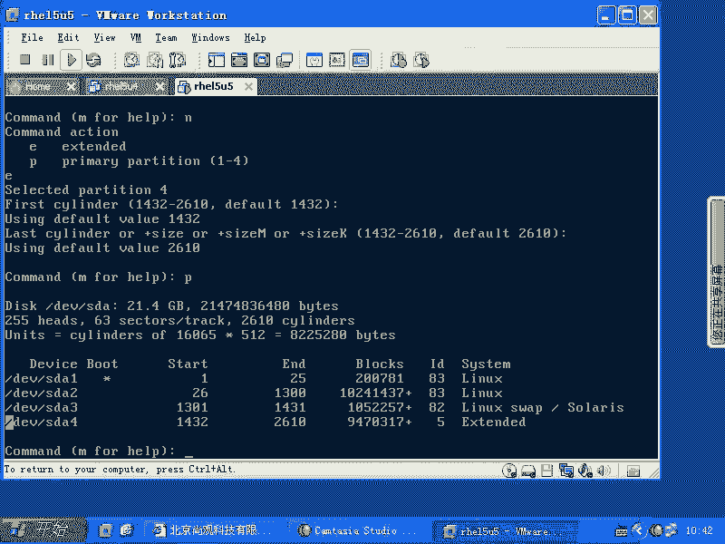

对吧对从这个柱面开始到这个柱面结束，也就是刚才你看到的这个空余的柱面全都给我做成什么扩展分区了，而扩展分区是不能直接使用的。你必须得在扩展分区下创建什么逻辑逻辑分区。那这时候我再去摁N啊。

这个时候你写入的这个分区的信息将会写在哪呢？扩展分区的最前面有一个活动分区面，它有两个分区表，明白吧？这个时候它就不占用什么那个MBR后面跟的那44呃664个字节了啊，现在我要N。

然后这时候他说第一个剩就是空余的柱面是1432还是空余的，刚才我已经把它分到扩展分区里面了是吧？现在我是在扩展分区下面再去创建什么逻辑分区。那么第一个柱面开始啊，我要创建1个500兆的分区。

那我这边的话呢加啊，500兆啊。

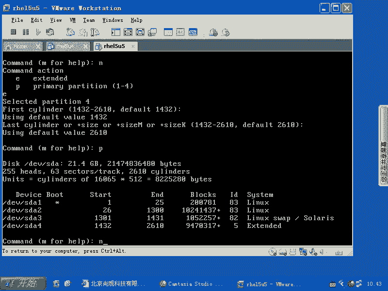

Yeah。家务外罩。啊，你可以用多少K多少兆的方式来创建。多大的分区加多少兆是吧？也可以用指定柱面的方法，一个柱面大约是8兆。一个柱面是88应该是8兆啊，8兆，你可以算下多少，大约是那么多啊。

这样的话呢我可以加500兆，这样直接回车。我创建了1个500兆的分区。然后呢，你再按P，这时候的话，你的SDA5就会出现。它的话呢，起始的柱面跟你的扩展分区的起实柱面是一样的，是不是？那么结束柱面的话。

就是刚才你加了多少啊？然后我再按N。这时候的话呢，因为我们的主分区的名额和扩展分区的名额都用光了，是不是？所以他就不再问你说你创建一个主分区，还是创建一个扩展分区，还是创建一个逻辑分区了。

它默认就是逻辑分区了，明白吧？然后呢，在我在NN。创建一个从第一个空余的柱面开始，再做一个什么呢？500兆的。

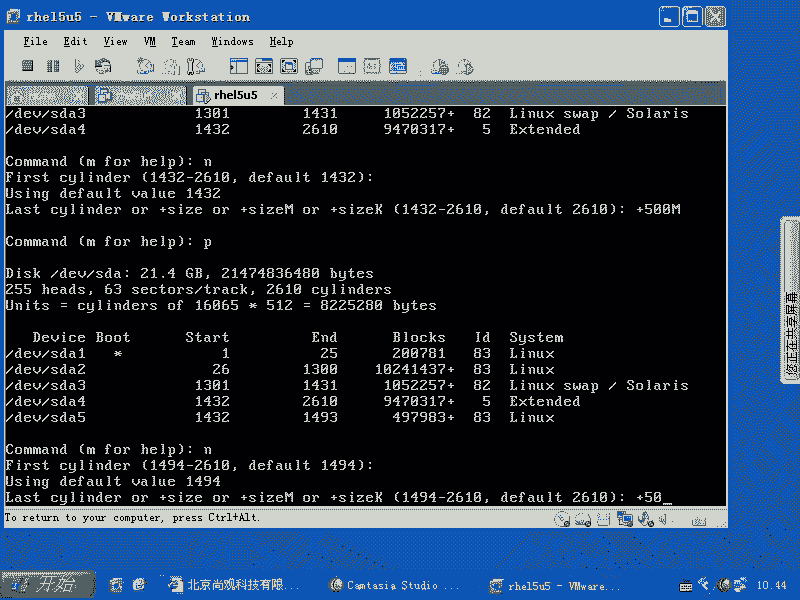

分区是不是再做1个500兆的分区，然后呢，我再去创建一个。

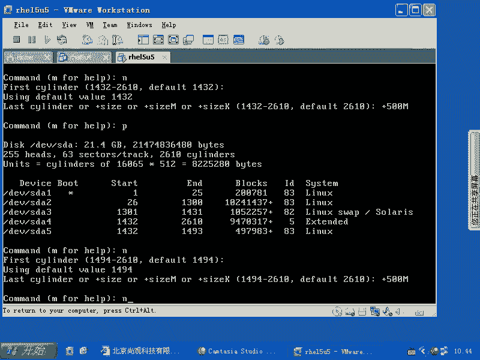

啊，我再从第一个剩余的开始，然后呢再去加上一个什么500兆。

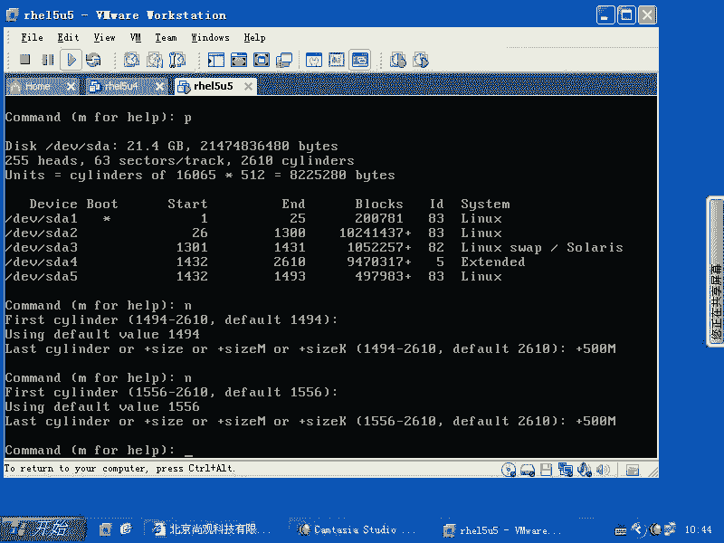

然后我再按P，那这时候我又创建了什么三个分区SDA5SDA6SDA7是不是这样的话呢，我的这三个分区就创建起来了。然后呢，如果你不摁W啊，不摁W写入，那它就不会生效。

你刚才做的所有操作都没有真正去写入硬盘，明白吧？按一下W写入啊，这个时候的话呢，写入完了以后它会自动什么呢？退出出来，明白了吧？退出出来了以后啊，我们可以用什么呢？Fdi杠L。

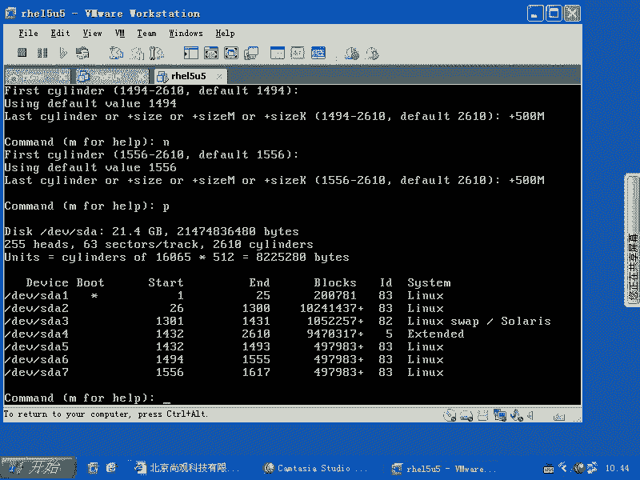

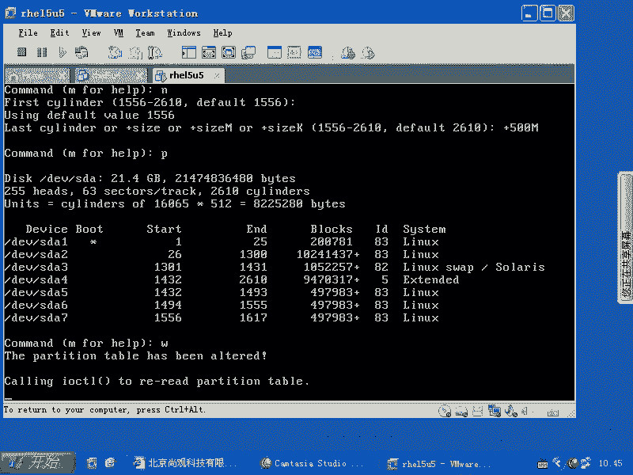

来打印分区表，对不对？你看这个分区表现在已经有了是吧，但是你去加载啊，我们现在这样的啊，我们看一眼啊make。😊，除非是什么呢？我们当前的系统已经改掉了这个bug啊，自动运行什么partpro。

要不然的话呢他就是找不到啊，这ET3是吧，DV下的SDA5。说什么？没有这个文件是吧，或者目录，它可能这个设备文件没有创建是吧？也有可能是系统上呢，还加载的老的什么老的分级表，是吧？

所以这时候我们输入一个什么part。pro对吧？然后呢直接回车，这样的话呢让他同步一下，然后我们再去执行这个命令，可不可以啊？所以part copy的话呢，可能是你需要输入的啊，这边的话就是这样的。

对吧。FD4个杠L已经能看到了，但是没有输入partspro的时候，执行上面那个命令是不是就失败啊？然后呢，再去运行什么呢？呃，part probably以后再去make。呃。

make up faster其三明白吧？O这地方有没有问题啊？啊。格式化文件系统的话呢，就用make呃，当然你看可以用什么parted，是不是party的话呢去格式化。party格式化的话。

你可以运行一个什么help来看一下里面的帮助啊，细节我们就不说了。大家现在是不是也有经验了，你想要记住所有东西是是不是基本上不可能的。😊，大家可能就是看个热闹啊，哎，老师的话，这行命令做出来了是吧？

能做出来。我感觉很欣慰，是不是？然后呢，你过一段时间说哎，老师当时好像演示过这个东西到底是什么来着？你还是得要自己去运行tell，对不对？嗯，你说一进去以后，我记得叫做make FS是格式化。

make part是什么？是分区是吧？但是具体这个语法该怎么样的时候，我还是得要用什么 help面去看是吧？所以这个的话呢，可能你还要自己去做啊，好像make makeake part是创建分区啊。

make FS就是什么呢？创建就是文件系统，它可以格式化什么呢？分区全部都一块做啊，这是partypart本身的话呢。是一个。想在文本镜片给你提供一个非常强大综合功能的一个磁板工具。

他是想提供这个工具啊，提供这样功能。但是后来的话大家一般不怎么用它，因为这个工具的话可能停止开发或者开发有问题。以前的re9的时候，我还用它怎么样的挪过分区。呃，比方说我现在有个分区吧。

我这个分区的话呢，我觉得。前面那个分区太小了，是不是？我想把前面分区删掉以后的话它变大一点，结果或者说把它那个前面分区扩大一些。那么你可以用什么呢？party的把它扩大。但是party扩大的时候。

这个分区它后面也已经有一个。就是接着的分区了。那就没有空余剩余空间了是吧？我可以把这个后面这个分区移动到某个位置，把它移一下。移动到后边就中间的话呢，有个空空空给它空出来。

然后呢再把那个分区变大或者变小party的原来都能做。但是在后来啊party的停止开发里头，就这个工具的话就不提供这个功能了。他后面还说什么呢？不支持ES3文件系统。那你说我要它干嘛？

所以它原来shop里面你可以看还有这些功能啊，但是这个功能的话你运行的话它就失败，就不允许运行。所以party的是这样一个角色，明白了吧？嗯所以一般我们就F disk就好了，F disk就好了。

然后我们之后的话呢想去运行呃，想去格式化的时候，格式化就有很多操作了。makeFS。点EXT3是不是或者什么呢？makeE two FS杠J是不是？或者是什么呢？或者是说make FS。

杠T啊ES3这都可以这都可以。但是我们这样操作，其实都是在调用相同的功能。啊，都是调有相同的功能。格式化的话呢都是格式化ES3的分区。当然现在还有什么EST4的分区。EIT4的话，它的功能啊就比较强。

速度会快一些。同时，EIT4最大的功能是什么？支持更大的分区。因为现对以前的话呢一个分区啊它不能超过。不能超过2T啊不能超过2T。你想现在我买1个两T的硬盘很容易，是不是？更别提服务器了。

我服务器我可能用两好几个2T的这个硬盘是吧？给它组成一个大的券，是不是？这时候EIT3文件系统就不能用了。所以EIT3文件系统原来有这样的限制，明白吧？原有这样限制。现在EIT4文件系统的话。

它可以支持到多少亿的。E的分区啊，我觉得T之上是什么？P是吧？是什么？P是吧。P值上是E是吧？它可以支撑到几亿的分区啊，也就是说特别大的分区。所以的话呢这个EST4的话是做这个用EATT3的话呢。

我们用的已经很长时间了。ES3实际上是等于什么呢？等于EXT2呃ES3等于EST2加上一个什么呢？是吧加journal。那么ETR加Jurnal。仅仅是加一个知道就可以吗？确实是。

所以的话我们可以把1个EST2的分区加一个Jurnal以后，立刻变成EXT3。所以怎么样去变呢？那就是用turn e to FS是吧？加上一个什么杠J是不是？然后DV下的SDA2。这样的话呢。

我们可以把1个EST2的分区，立刻升级成什么EX3啊，turn e to FS就是调整文件系统的什么。属性啊没事干，千万别拿来在生产系统上玩。我们告诉大家是有这个命令，你除非是必须啊，你去执行它。

如果要是不是必须的话，拿来去玩，你的数据有可能就会丢。因为你操作文件系统一不留神就玩完了。一不留神就完了，明白吧？一丢的话，丢多少文件呢？9。80%的文件，你最后的他就看到凤毛麟角的文件啊。

不是说丢失数据了，是说那就相当于找回数据是吧？找回了20%是不是？所以的话呢很少，文件系统的话千万不要随便玩啊，当然了，也支持从EX3到EXT2的降级，就说我不想要什么EXT呃，删了，我想回到EXR。

当然这种人的话，一般都比较少见了，是吧？怎么样降级呢？成。e two FS是吧，杠大O是吧，然后呢，has。あは。pa journal，然后呢，第一位下的SDA2。我们记住一点啊，所有的文件系统。

文件系统级的这种调整或者文件系统的操作啊，备份啊，不是就是不是备份啊，就是恢复的不是恢复，不是备份恢复是呃就是说你去检测文件系统的错误，或者说想去调整它的属性的时候，一定要怎么样。优慢的叫。😡，有吗？

不you amount到啊，这边强调了一点，一定要什么you amount的情况下去操作。如果不you amount，你的文件系统可能就坏了。因为操作系统的话呢，它在加载这个文件系统的时候。

它有些部分是什么锁定的。锁定完以后，你比方说我正在用这个文件系统，我这些数据不允许你动，结果的话你去动其他数据，导致你这些数据全部都丢了。本来我大计划的话，改10个数据，但是我只改了两个。

那8个数据全部都什么失效，知道吧？所以的话呢要怎么样呢？Umount掉，实在不行的话，再怎么样，实在不行，你比方说根分区，我又mount掉根分区，那不是胡扯吗？我怎么Umount？

我这个文件的话都是在根分机下，是不是所以的话你要怎么样呢？mount杠O是吧？RO只读方式去加载。某些分区啊某些分区或者是要么用m，要么youant，要么就m告ORO只读方式加载。否则的话呢。

你这个文件系统的话呢是。不管检测也好，还是调整它属性好，都会有问题啊。还有一种方法的话呢，还有一种就是对这个这个我们这个东西的操作是什么呢？你可以用down。

e two FS当e two FS可以查看什么呢？我们的这个分区的super block啊，就是我们整个分区的一个属性啊，在super block。

down toFS可以看你的super block里面的属据。那么我们FSCK点EXT3，它可以去什么检测你的分区。检测你的分区。他可以检测你的分区。检测分区的话呢是一个非常危险的活。非常危险的过。

我去曾经无数次啊检测分区，最后的结果是什么呢？只剩下几个文件。只有大部分。所以检测分区的话呢，你一定要这样来啊，就是说当你去检测分区的时候，你就你要保证你的分区是怎么样一 amount状态。

或者说什么只读方式加的。再去检测的时候，你先不要摁Y去修复啊，因为他查出一个错误以后，他会让问你说NY修复吗？那你都摁NNNN是吧？当你看一看错误很多的时候就不要再动了。

你就退出ctrl加C结束FICK明白吧？也就是说，FSCK默认情况下应该是不去修复你的错误的，除非是等的超时，就是他等你要不要修复，那么你半天没有动作是吧？它就怎么样，他就直接修复了。

那你全部都要嗯N嗯啊，一直嗯N，它就不会修复，那你先看一下错误有多少，错误非常多，比方说几千个几百个，那噼里啪啦一瓶一瓶的出，那就是什么问题呢？大面积的问题。这时候你一修复。

你基本上能找回来的文件就很少。明白吧？所以的话呢在你去检测到看到文件系统有很多已经没有了，就是有很多很多错误错，你就直接ctrl加C，不要让它再检测了。然后你把这个硬盘怎么样呢？你用光盘启动。

或者用其他把这个硬盘拿到其他的机器上去，怎么样呢？把这个里面的数据啊开始能考多少。就考多少，因为有文件系统有错误是吧？但是它并不一定什么就不能去mount，我可以去mon，mon的上去了以后怎么样呢？

我把这个文件系统里面的数据我能考多少考出来。而且你要跟你的上级说什么。不好意思啊。这不是我的错误。现在文件硬件有问题是吧？这个硬件你看一看有问题。咱们应该每一天的话呢，每一天晚上都做备份的。

咱们现在能恢复到的数据就是那个数据，咱们需要验证一下什么呢？那个备份的介指好不好，能不能用是吧？如果要是验证的备份戒指可以用，然后你才开始什么修护这个系统。怎么去修复呢？先用光盘启动或者用其他介指启动。

启动完以后，把这个数据全部都。尽量copycopy到哪呢？copy到一个呃就是一个硬盘，或者是你插到额外的硬盘或者硬盘盒里面去，明白吧？嗯，这个时候的话呢再去。想办法再去修复，你再去修复。

就是已经挪完数据，已经备份完，看能拷贝出来的，都拷贝出来以后，再把当前已经破坏的这个东西再做一个什么呢？再做一个镜像。你可以用DD命令是吧？把当前硬盘或者镇列柜里面的数据全部都怎么样的。

传输到另外一个硬盘当中去，是吧？传输到另外一个硬盘当中去以后，把它做成一个镜像。也就是说我如果要是恢复失败，我是不是还能回复到什么最初的状态，对不对？啊，所以的话呢尽量什么呢？

把2块硬盘或者是两个镇列柜的话呢，变成一模一样的，然后呢再开始修复什么呢？就是你镜像过的这个东西，如果要是你恢复的时候失败，那你拿着这个镇列柜，还可以跑跑到什么数据恢复公司去，让它去帮你读出来数据。

所以你破坏掉了原始数据以后，这个数据很可能找不回来。而且一定要注意什么呢？就是说写详细的报告啊，写详细的报告。因为这方面的话，老美的话呢做的是非常好啊，中国人的话喜欢什么？我这个事事情出来以后。

我要找个责任人是吧？这个人跟我关系不太不太好是吧？我就直接把你K掉。那么老美的话是怎么样呢？别管是呃多大的问题，他事先写好这个详细的任务描述报告以后。

会有一个独立的中间的委员会来评估说这个责任是归谁的是吧？只要你这个报告有是吧？你把每一步的话呢写清楚，那这个事情的话，最终是什么呃不是你的责任，那就不是你的责任。但是呢在咱们这些公司里面是吧？

你需要先跟你的上级的话说清楚，哥们是吧？这东西是吧，你坏了，我要修修复，你说修复不修复，他说你修复吧，然后这个这这个任务的话就是谁啊？这个责任就是谁的？上面所印上子最好签字，明白吧？要不然的话。

最后找责任人的时候就找到你。这个不是让你推卸责任啊，这是确实是企业的数据是命脉是吧？你后突然啊呃你存了2万块钱是吧？哎，变成200万了是吧？哎，那不错，结果变成负的200万了。

那你你不是你不不找这个银行的麻烦才怪这个银行很可能就完蛋了。相关责任人都要怎么样扔到监狱里面去，因为你把国家的财产什么弄丢了，是不是？好，这边的话讲了那么多，先看一眼，对不对？看完以后的话呢。

做好什么呢？备份。😊，做好什么呢？啊，不是不是做好备份，是做好什么呢？备份原来备份的介指的什么模拟恢复是吧？看那个备份的介指成不成。然后呢，再把当前坏的东西做一个什么镜像，然后才开始修复。

把里面的东西能靠背多多少就靠背多少，是不吧？然后才开始修复，修复的话是怎么去修复呢？修复是怎么修复呢？我们要啊就是说FSFS。FSCK点EXT3是吧？那么你可以加上一个什么杠Y这边的话呢。

就是修复几千个问题啊，这边就是修复FF是什么呢？强制着以EFT2的方式去修复。大家知道那个 journalnal功能到底是干什么的吗？知头就是。日志不是磁案检测，日志是从。数据库当中学过来的技术。啊。

数据库也会面临这种问题，就是数据丢失的问题。但是它有个非常好的日志机制啊，就比方说有个人。他取钱。取钱的时候突然宕机了，那他这个数据啊，到底有没有写到数据库当中，这个是谁都不知道的，对不对？嗯。

所以后来的话呢，他们有个机制，这个机制是什么呢？我要去写入数据库的时候，我先写到日志里面说我要写哪个地方的什么什么数据写在内容是什么是吧？我先把这个东西记录在日志当中，那么最后如果要是他这个钱。

已经准备好是吧，已经发给那个取款机命令说什么吐钱吧，是吧？在吐钱之前，他就说什么呢？我此项任务就是我取钱的减少1000块钱的这个任务是吗？已经什么。提交是吧，已经提交了，一提交是不是他就开始写数据库。

但是你这个提交这个操作，一旦写一旦一旦写完以后就怎么样呢？就会开始那边开始吐钱，这边开始写数据库是吧？嗯写的过程当中突然断电。对吧那么也就是提交完以后的话呢。突突然断电了。

你在写数据库的时候是不是突然断电。那这个数据库到底有没有写完呢？那你一开数据库以后，它就开始怎么样？他就开始检测一下，有没有写数据库完成的标记是吧？如果没有他们要么就是什么。

redo是不是就把这个任务再重新重做一遍是吧？要么就什么日志回滚，是不是？也就是说我把你回复成什么最初的这个状态，对不对？所以这个操作的话呢就是日志的功能。那么我们现在的文件系统也是这个问题。

我现在在写一个文件，这个文件的话呢，我我本本来占用了10个block，10个block，10个block。我在写到第五个的时候，突然怎么样？昨天，那你说我到底写完没写？我的iow定制的是什么？

说我这个idow定制说我要占用15了，我写了5个。那5个的数据到底是。用了还是没用是吧？是不是我的数据，这个谁都不知道，对不对？所以最终的结果就是什么呢？我们如果要是想保证这个文件系统呢。

就是说这个一致性或者说这个正常或者可用性。那我必须得要检测每一个idow的对应每个block的对应关系。而且对应完了以后的话，你这个数据可能也是不完整，是不是？

所以我们默认情况下这个jonal功能又是怎么样的。我们在写入这个文件系统的原数据的时候，比方尤其是新创建文件的时候，或者说更改原来文件的这个大小的时候是吧？那这个时候我们先把这个更改的内容提交到哪去。

提交到我知道。啊，日志当中去。然后呢，我们日志如果完成的话，他就。它就完成了。如果你这个时候检测文件系统时候，他就会帮你把日志怎么样重做一遍是吧？日志当中记录说没有完成的标记。

那么他就把什么这个内容重做一遍，就是相当于日志功能，redo一遍，对不对？我就遇到过这样的情况，我像我原来在考2C的时候，我那个机器特别困，我改一个配置文件，但配置文件哦呦就死在那边了，我特别紧张。

然后呢，重启一下，重启一下的话，他要检测文件系统，我担心太慢了，然后我就直接过去就跳过检测文件系统直接进去进去以后的话，我再去VI那个文件，别。我明明已经保存并更改这个文件了是吧？嗯，结果的话呢。

我再打开这个文件，还是原来的样子。那就相当于block里面实际的数据并没有给我更新，是不是？于是的话，我这时候想着哦，别有太多的磁盘错误错误。于是的话我运行什么FSCK。啊，重新检测一下。

这个时候的话呢检测完以后，我再去打开的时候，就发现那个文件已经变成什么我更改之后的样子。检测之前和检测之后，文件的内容完全不同，知道吧？这就相当于这个数据保存在哪日志里。

是吧那跟我现在检测文件系统化有什么关系呢？你看啊，如果要是你不加杠F参数的话，你比方说我可以单独用杠F。我不加杠F参数的话，那么它就只检测日志，看日志里面那些工作有没有做完。明白吧？做完就OK。

所以现在检测文件系统非常快，包括NTF就是windows下的文件系统一样。我记得我原来第一块硬盘是5。1G的硬盘。啊，大约是98年配的5。1G啊，5。1G啊，不是5。1T啊，5。1G5。

1G的硬盘检测2G的一个分区，就是windows9598那个分区啊，95那个分区要检测好久。特别长时间，他要把每一个idow和block之间对应关系全部都检测一遍。

是不是那种方式就是EXT2文件系统的检测方式。而EX3的话只检测什么jonal。那么你现在如果要是有一个坏的，就是有个store坏了，那这时候你怎么办？那你就要用EXTR的方式去检测，是不是？

嗯这个时候的话就是杠F参数的作用，明白吧？他要检测每一个I know和block的对应关系，管你日志当中怎么写，日志当中写的说提交完成了都没有问题。但是我还是要细节的检查一下。所以杠F参数的话。

它的检测时间非常长。但是呢。如果真的有问题的时候，你要加杠S3数5。明白吧？杠外的话是什么呢？就是不要问我修不修复废话，当然修复了，全部都修复，明白吧？这就是文件系统的相关的操作啊。

文件系统相关操作OK。😊，有没有问题？有问题的话可以提啊，有问题可以提。你说我跟那个win7下面现现在已经那么。用的那个。歌。他那个也不要检查该怎。NTF啊。

你是说他是不是用EXT2的那种传传统的方式去。存储的是不是那是你硬盘太慢吧。不会啊，他那个也也是减的非常久，1块1块。那是说你硬盘可能是它侦测到是有深层次问题。你像XP啊、windows2000啊。

甚至windows98是吧？它检测都非常快，是不是？它就是那个时候已经开始用journal了，已经用日志了。就是说现在的话呢没有日志。功能的这个文件系统是吧？你都不好意思跟其他的文件系统打招呼。明白吧？

就是这是最必备的功能。肯定是志型文件系统啊，日志型文件系统太多了。比方说我们很多unix系统里面的GFSGFSwo就是。AX系统的文件系统啊，还有什么呢？UFS，还有我们的那个什么XFS啊。

这些文件系统的话很多都有这些功能啊，绝大多数都有这些功能。那你说那个问题的话，我就不是清楚，你可能看windows7的这个手册啊什么才清楚，它不可能回退到90年代啊，不可能颓退到那个时候。嗯。

那你这个问题问的太大了。你你你问我哪个文件系统有优区点？原告上那该。还有家。就是咱们同学在问这个文件系统的，就是说这个好坏是吧？就是我到底该选用哪些文件系统，是不是？是吧。就比如说什么经。啊。

就说比方说你现在说的有个F呃，就是EXT3是吧，EXT4是不是？还有的话呢，raer是吧？reer的话呢也是呃就是linux原生的文件系统，就是lininux平台独有的文件系统，它非常快，是不是？

还有什么呢？就是JFStwo是吧？还有XFS。是吧还有什么联系统UFS还有什么？这样。ZFS。上公司上公司是UFS吧，ZFS我我我不知道是不是更新的啊。原来是用UFS。这些文件系统的话呢。

你要想去对比哈，那么你肯定是在一定环境下是吧？你用的是windows呃，你用的是HEL就rehead版本，那么你就不用去考虑了。这些文件系统都不支持。明白吧？这文件系统话呢都是某一个公司做支持的。

也就是说。re太的孩子是谁呢？那么多孩子是吧？re都在托儿所里，re太的亲生的骨肉是谁呀？😡，EXT2EX3EX4知道吧？那么苏usy的亲身骨肉是谁啊？谁也不是啊，但是跟他比较亲的是谁呢？

是raser啊，raer的话呢是一个人的姓啊。reer的话呢，他把他老婆给杀了，然后呢进入了监狱里面。所以reer FS曾经啊05年的时候，reer4是全世界最快的稳件型统。他的话呢直接把传统的文件型。

你别看这些文件系统种类多，但是基本的算算法的话都是什么b这种类型是吧？但是它的话呢是用平衡数的另外一种算法的话呢来解决这些问题。所以的话呢，raer的话呢是一种非常快的文件系统。

它是从根本上颠覆了原本的文件系统的那种传统结构啊，所以reer的话是不错。所以苏usy的话用raer以后的话呢，当时苏usie我记得明显要比re要快很多啊，你去启动X就启动起来。

启动起来以后做什么操作都没有那种迟质感，就跟windows差不多啊，所以raer的话是不错的。它尤其对小文件的话非常好，但是E3的话呢，每一版都在改进。每一版都感，这就有点像大公司和小公司的区别。

小公司的话，他可能一开始做了一个非常不错的产品，对不对？非常好的产品。那么异异军突起是不是？但是呢大公司总能通过持续性的投入来改进它比较烂的一个破东西，是不是逐渐改的什么呢？大家也都逐渐接受。

所以EX3就是这种性质。那么像GFSwo啊，原来就GFS是IBM的AX系统上的文文件系统，但是现在我们好像只能是用GFS吧，GFSwo能用吗？GFSwo是AX系统上主流的文件系统。

但是呢我们现在当中还是GFS。因为IBM的话呢，在2000年前后的话呢，决定投入10亿美金来支持lininux直接诞生了什么呢？reite就是这个就是让lininux系统它进入企业级应用。你们要知道。

2000年之前没有企业敢用linux。意维的话LAM不支持。啊，大型文件系统不支持，这里面代码的话是急剧的匮乏，特别匮乏。所以没有人敢去用它。后来的话IBM的话呢真的是真金白银往里面投。

大量的代码无偿的就往里面一塞，结果塞到里面去了以后，还引发了跟那个sck US呃unix sockunix SOC是吧？unix的官司。因为unix这套系统的版权最终是握在谁啊呃。就是啊core啊。

不是sSOC是吧？score Uniux手里一直握在他手IBM把这份代码直接扔到那里面，linux里面去以后，他就告IBM他不敢告IBM，他就告使用IBM共享出来代码这。

所以最终的话这个公司就被大家什么搞死了，是吧？谁也不买他东西了。s un原来也是一军，那就是非常不错的。score unix，我记得可以装在X86上。以前的unix很少装在X86上。

除了fed BSD是吧，但是co Uniix之外，它是可以装在X86上，有X86版本啊，这就是他们的之间恩怨。但是呢IBM的话呢，在一段时间之后啊，他就把GFS的话呢，它就开始怎么样血藏了。

就是GFS第一个版本我可以共享出机是吧？但是GFS2很久以前就传出在linux下要开发，但是一直没有现发布出来，这体现了一个意思就是什么呢？就是他们对这个linux的支持也是什么？

怕把他们自己的份额怎么样吃进去，也就说IBM是不是有X系列的机器是吧？这是最低端的X86的服务器，是不是还有P系列的，是不是P系列是终端的是吧？它还有大型机，那么它怕什么呢？我支持的特别好。

把lininux支持的特别好，这个X系列影响它的什么P系列。你白吧？他是怕这个，所以的话呢他不敢提供特别先进的这种技术。但是原来2000年左右的时候，那一波支持的话。

你立刻让lininux拥有了什么LVM啊等等这些企业最关心的技术。清楚吧？所以的话没有，就是咱们现在感觉好像接触的这些电脑是吗？戴尔的是吧？哎那边接触的这个lininux是reite是吧？

实际上没有后面的这种大公司的支持，这些东西是不可能什么特别好用，明白了吧？没有英特尔投入大量的精力，在这里面开发这些代码。那么你的这个英特尔的X86什么CPU啊，什么这些体架构怎么能跑的那么好。

怎么可能在企业里面用的那么多啊，但是呢你又考虑到这个大公司的策略。所以的话你敢用它吗？JFS你敢用它吗？反正GFSwo已经用了好多年了，GFS已经被IBM淘汰了，是不是？

所以这里面的工具相对来说也比较匮乏。比方说d普命令，它肯定不支持JFS，它肯定支持的是EX3，明白吧？XFSUFSZFS我觉得都是差不多的。这些文件系统的话呢，像GFS和XFS它最大的优势是什么呢？

它最大可以支持到呃。500多。好像是。512GB的文件。文件的大小是512GB。如果这文件的话呢，最大可以到512G啊，对，原来的话EATT3支持的最大文件大小是多少呢？2G。R7L3第一个版本。

后来可以支持到4G。啊，还有支持到8G的。再往上的话呢，没有见多少。因为的话GFS和XXFS他们都是64位文件系统，他们不可能支持什么，就是它可以支持很大的文件系统。性能的话呢就是非常平庸的性能。

但是呢它支持大文件系统大分区是非常好，明白吧？这就是他们这个东西。那么现在的话呢，我们还好有什么EI4啊，这可是的亲儿子是吧？所以的话呢我们用它的话呢，可能一脉相承下来的话，可能会感觉比较好啊。

感觉比较好，明白了吧？好，这是多种文件系统的对比。还有就是说咱们刚才分区和格式化，还有检测文件系统的一些内容，是不是？

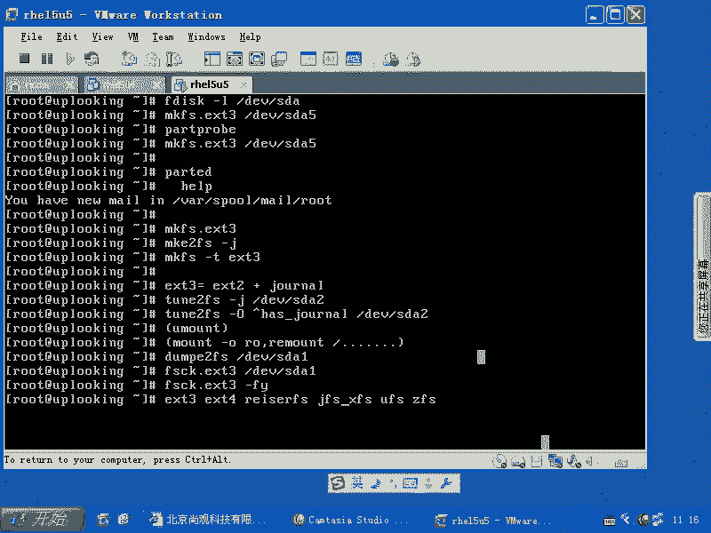

O。