# 尚观Linux视频教程RHCE精品课程：P52：RH133-ULE115-8-1-fdisk-mkfs-fsck


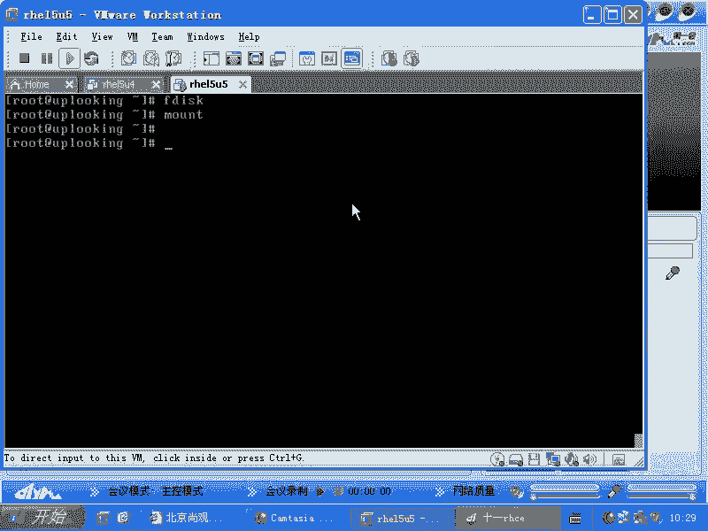

在本节课中，我们将要学习Linux系统中管理磁盘存储的核心流程，包括如何对硬盘进行分区、创建文件系统以及检查和修复文件系统。这是系统管理员必须掌握的基础技能。

## 磁盘管理概述

当我们获得一块新的存储设备（如硬盘）并希望使用它时，需要遵循一个标准的流程。这个流程的核心步骤是：首先对磁盘进行分区，然后格式化分区以创建文件系统，最后将文件系统挂载到目录树中，使其可供访问和使用。

上一节我们介绍了存储体系结构，本节中我们来看看如何具体操作一块新硬盘。

## 使用fdisk进行磁盘分区

`fdisk`是一个经典且常用的磁盘分区工具。它的主要作用是在硬盘上创建、删除和管理分区表。值得注意的是，一块硬盘可以不分区而直接格式化为一个大的卷使用，就像U盘一样。但通常，我们会根据需求对硬盘进行分区。

以下是`fdisk`命令的基本用法：

*   **列出分区信息**：使用 `fdisk -l` 可以列出所有已识别硬盘的分区表。若要查看指定硬盘（如 `/dev/sda`），则使用 `fdisk -l /dev/sda`。
*   **进入交互式分区界面**：要对硬盘（如 `/dev/sda`）进行分区操作，需运行 `fdisk /dev/sda`。
*   **常用交互命令**：
    *   **n**：创建新分区。
    *   **d**：删除分区。
    *   **p**：打印当前分区表。
    *   **t**：更改分区的类型ID（例如，83代表Linux文件系统，82代表交换分区）。
    *   **l**：列出所有已知的分区类型ID。
    *   **w**：将分区表写入磁盘并退出。**注意**：在交互界面中的所有操作，必须输入 `w` 才会真正生效。
    *   **q**：不保存更改并退出。

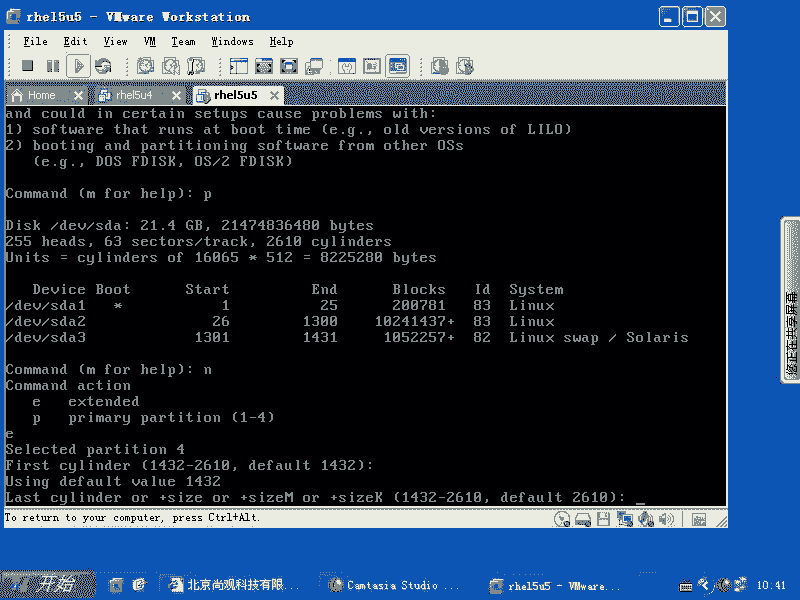

在Linux中，标准的分区表（MBR）最多只能容纳4个主分区。为了创建更多分区，通常的做法是创建一个**扩展分区**，然后在扩展分区内创建多个**逻辑分区**。在`fdisk`交互界面中，创建分区时选择 `e` 即可创建扩展分区，之后创建的分区默认即为逻辑分区。

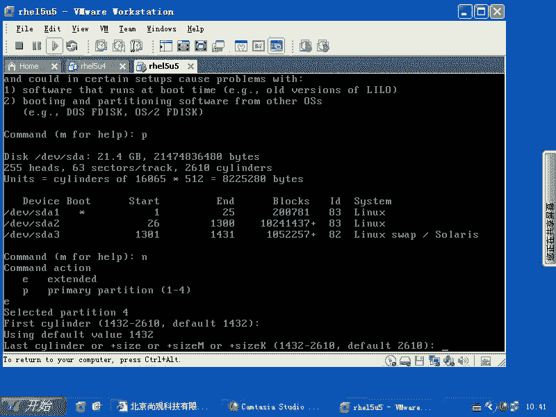

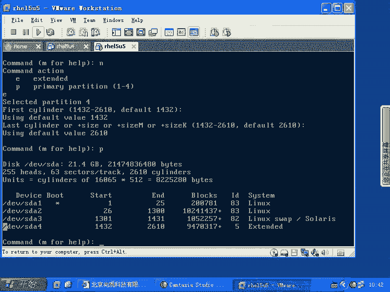

## 更新内核分区表与格式化

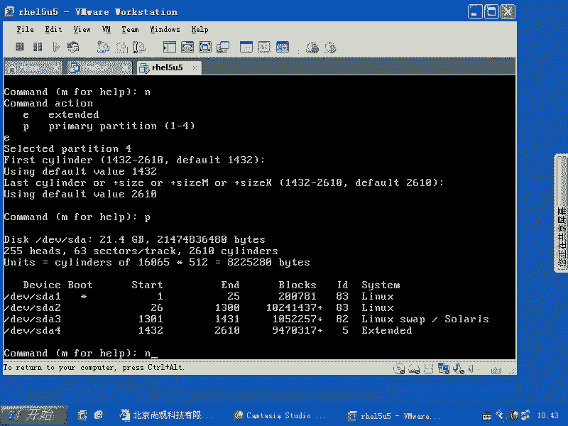

使用`fdisk`写入分区表（`w`命令）后，操作系统内核可能还未识别到新的分区信息。此时，需要使用 `partprobe` 命令通知内核重新读取分区表。

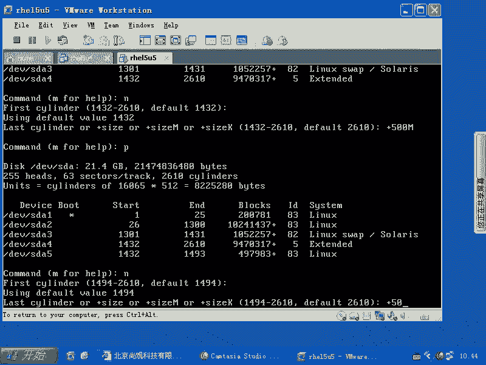

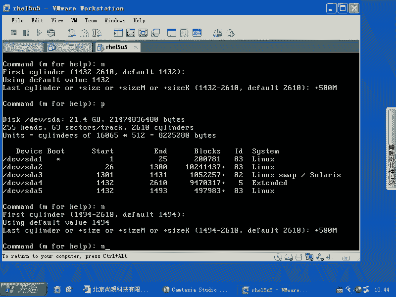

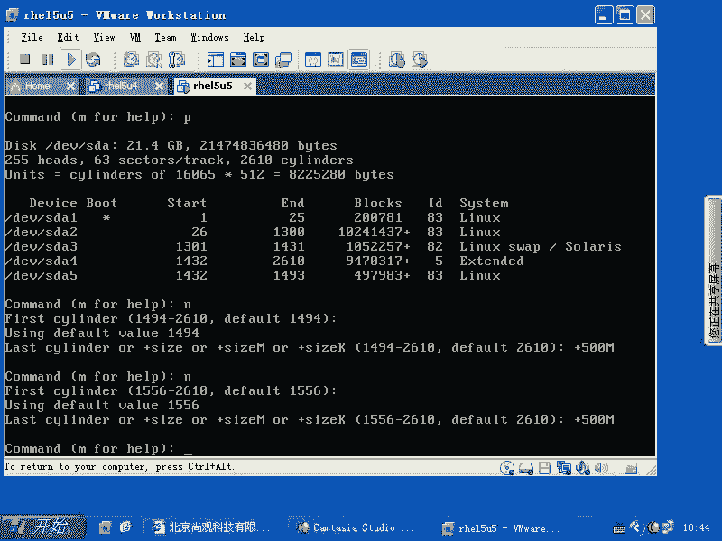

```bash
partprobe
```

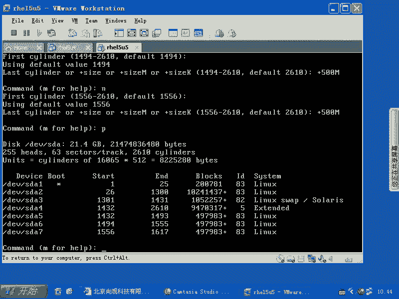

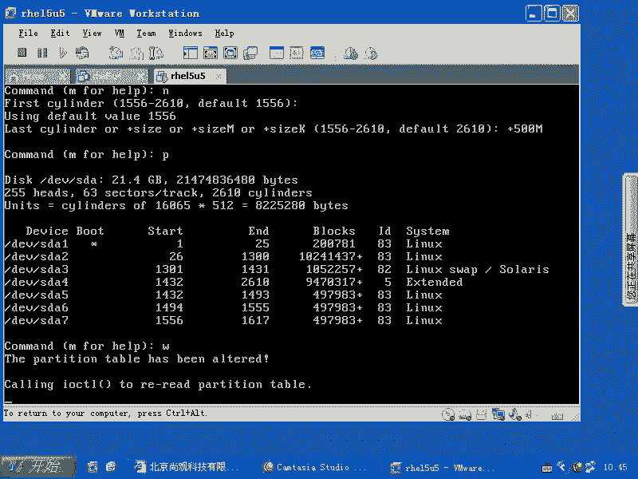

内核识别新分区后，就可以对其进行格式化，创建文件系统了。格式化命令是 `mkfs`。

以下是创建ext3文件系统的几种等价命令：

```bash
mkfs.ext3 /dev/sda5
# 或
mkfs -t ext3 /dev/sda5
# 或
mke2fs -j /dev/sda5
```

**重要提示**：`ext3`文件系统本质上是`ext2`加上日志（journal）功能。可以使用 `tune2fs -j /dev/sdaX` 为`ext2`分区添加日志，将其升级为`ext3`。反之，使用 `tune2fs -O ^has_journal /dev/sdaX` 可以移除日志，降级为`ext2`。**所有文件系统级别的操作，务必在分区未挂载（`umount`）或只读挂载的情况下进行，否则极易导致数据损坏。**

## 挂载文件系统与开机自动挂载

格式化后的分区需要挂载到目录树（VFS）的某个空目录下才能访问。使用 `mount` 命令进行挂载：

```bash
mount /dev/sda5 /mnt/data
```

`mount`命令是临时生效的。为了让系统在每次启动时自动挂载，需要编辑 `/etc/fstab` 文件，添加相应的挂载配置项。

`/etc/fstab` 文件的一行典型配置如下：

```
/dev/sda5  /mnt/data  ext3  defaults  1  2
```

各字段含义为：设备名、挂载点、文件系统类型、挂载选项、dump备份标记、文件系统检查顺序。

系统启动时，`init`进程会执行 `mount -a` 命令，该命令会读取 `/etc/fstab` 文件并挂载其中列出的所有文件系统。

## 使用fsck检查和修复文件系统

`fsck`（File System Check）用于检查和修复文件系统错误。这是一个高风险操作，操作不当可能导致数据丢失。

**操作前必须遵守的准则**：
1.  **务必在文件系统未挂载（`umount`）的状态下执行**。对于根分区等无法卸载的分区，应进入单用户模式或使用Live CD启动盘进行操作。
2.  执行`fsck`时，默认会交互式询问是否修复每个错误。**切勿直接全部同意修复**。应先观察错误数量，如果错误非常多（成百上千），很可能发生了大面积损坏。此时应按 `Ctrl+C` 中断检查。
3.  在尝试修复前，**务必先备份数据**。能拷贝多少数据就先拷贝多少。如果条件允许，甚至可以使用 `dd` 命令为整个损坏的设备创建镜像，以便在修复失败后还能恢复到原始状态。

以下是`fsck`命令的常用参数：

```bash
fsck.ext3 /dev/sda5
# 强制检查（即使文件系统标记为clean）
fsck.ext3 -f /dev/sda5
# 自动修复所有错误（危险！仅在确认操作后使用）
fsck.ext3 -y /dev/sda5
```

对于`ext3/ext4`这类日志文件系统，`fsck`通常只检查日志（journal），速度很快。`-f` 参数会强制进行完整的、类似`ext2`时代的深度检查，耗时较长，一般在怀疑有严重底层错误时使用。

## 文件系统对比与选择

Linux支持多种文件系统，各有特点：
*   **ext2/ext3/ext4**：Linux“亲儿子”系列，应用最广，工具链最完善。`ext4`支持超大分区和文件，是当前主流选择。
*   **ReiserFS**：对小文件处理性能优异，曾以速度快著称，但近年来发展放缓。
*   **XFS/JFS**：64位文件系统，擅长处理大文件和大分区，性能稳定。
*   **Btrfs/ZFS**：下一代文件系统，提供高级功能如写时复制、快照、池化存储等，但成熟度和生产环境适用性需评估。

对于RHEL/CentOS系列，选择`ext4`或`XFS`通常是稳妥的方案，因为它们能获得最好的原生支持和兼容性。

## 总结

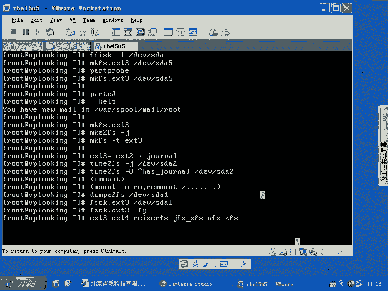

本节课中我们一起学习了Linux磁盘管理的完整流程。我们首先使用 `fdisk` 工具对硬盘进行分区，然后通过 `partprobe` 让内核识别新分区，接着用 `mkfs` 系列命令格式化分区创建文件系统，再通过 `mount` 命令挂载并使用，并通过编辑 `/etc/fstab` 实现开机自动挂载。最后，我们了解了如何使用 `fsck` 工具检查和修复文件系统，并强调了操作时的风险与数据备份的极端重要性。掌握这些步骤，是进行Linux系统存储管理的基础。