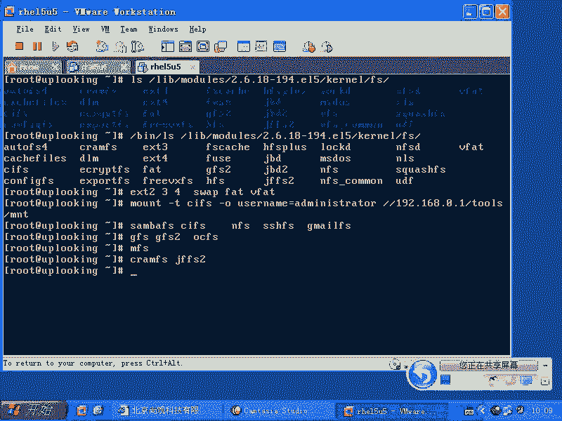
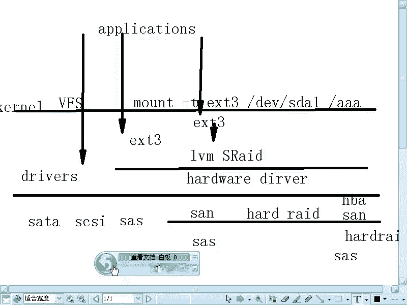

# 尚观Linux视频教程RHCE精品课程：P53：RH133-ULE115-8-1-file-system


## 概述
在本节课中，我们将要学习Linux系统中的文件系统。我们将了解什么是文件系统、Linux支持的各种文件系统类型、文件系统的层次结构，以及如何加载（挂载）文件系统。理解这些概念对于管理和使用Linux系统至关重要。

## 文件系统简介
文件系统是Linux、Windows以及任何操作系统中必须使用的组成部分。要加载一个文件系统，必须指定其类型。

即使是Windows也有多种文件系统类型。而Linux支持的文件系统数量至少是Windows的十倍以上。为什么这么多呢？

我们可以查看Linux内核中已编译支持的文件系统驱动程序。它们位于`/lib/modules/`目录下，具体路径类似于`/lib/modules/$(uname -r)/kernel/fs/`。这里存放着系统已安装的文件系统驱动。

但这并不是Linux支持的全部文件系统类型。Red Hat等发行版在编译内核时，只会选择性地包含一部分文件系统驱动。即便如此，其数量也已远超Windows。

## Linux文件系统类型众多的原因
以下是Linux支持众多文件系统的主要原因：

**1. 网络文件系统**
除了像EXT2、EXT3、EXT4、NTFS、VFAT这类常见的本地文件系统，Linux还将许多网络访问协议视为网络文件系统。
*   **CIFS/SMBFS**：用于访问Windows网络共享。
    *   挂载命令示例：`mount -t cifs -o username=administrator //192.168.0.1/share /mnt`
*   **NFS**：Linux和Unix系统间常用的网络文件系统。
*   **SSHFS**：通过SSH通道访问的远程文件系统。
*   **GmailFS**：一种可以将Gmail邮箱挂载为本地目录的文件系统。



这些网络文件系统极大地扩展了Linux的文件访问能力。

**2. 集群文件系统**
当多台服务器需要同时访问同一个存储设备（如SAN存储阵列）时，普通的单机文件系统无法协调写入，会导致数据损坏。集群文件系统专为此设计。
*   **GFS/GFS2**：Red Hat开发的集群文件系统。
*   **OCFS2**：Oracle开发的集群文件系统。

**3. 分布式文件系统**
用于云计算和大数据场景，将海量数据分散存储在成千上万台服务器上，并提供冗余和高可用性。用户无需关心文件具体存储在哪个物理位置。
*   例如：**MooseFS (MFS)**、**Google File System (GFS)**。

**4. 嵌入式文件系统**
Linux广泛应用于嵌入式设备（如路由器、智能电视）。这些设备存储空间小，可能需要文件系统自带压缩功能。
*   例如：**CramFS**、**JFFS2**。

此外，许多商业公司（如Veritas）会开发自己的文件系统并贡献驱动给Linux内核，以促进其技术的广泛应用。正是由于Linux从嵌入式到云计算的全领域应用，才使其需要支持如此多样的文件系统。

## 文件系统的层次结构
上一节我们介绍了文件系统的多种类型，本节中我们来看看文件系统在Linux系统中的层次结构。理解这个架构有助于我们深入定位和理解各种存储技术。

整个存储访问的层次结构如下：

1.  **硬件层**：包含实际的物理存储设备及其接口，例如SATA、SCSI、SAS硬盘，或更复杂的SAN（存储区域网络）设备。
2.  **设备驱动层**：内核中直接与硬件通信的驱动程序。例如SATA驱动、HBA卡驱动、RAID卡驱动等。
3.  **逻辑卷管理层**：在物理硬件之上创建的抽象层，用于提供更灵活的磁盘管理。例如**LVM**或**软件RAID**。它们将多个物理存储组合成逻辑卷，供上层使用。
4.  **文件系统层**：在逻辑块设备（如普通分区或LVM逻辑卷）上创建的结构，用于组织和管理文件。例如**EXT3**、**EXT4**、**XFS**。
5.  **虚拟文件系统层**：**VFS**是内核中的一个抽象层，它为上层应用程序提供统一的文件访问接口，无论底层是何种具体的文件系统。`mount`和`umount`命令的操作对象就是VFS。
6.  **应用程序层**：用户程序通过标准系统调用（如`open`, `read`, `write`）访问文件。

**重要概念**：
*   每一层通常只关心与其直接相邻的上下层。
*   数据写入时，会从上到下经过这些层次，每一层处理自己负责的部分（如分块、映射、记录元数据等）。
*   有些特殊应用（如Oracle数据库）可以使用“裸设备”访问，绕过文件系统层直接操作块设备，以追求极致性能。但绝大多数应用程序都依赖于文件系统层。

## 挂载文件系统
理解了层次结构后，我们来看看如何让文件系统可用。文件系统必须被“挂载”到一个目录（称为挂载点）上，才能通过常规路径被访问。

**挂载的意义**：
可以将存储设备想象成一个空仓库，文件系统就是仓库管理员建立的货架编号和库存账本。不挂载文件系统，就像直接往空仓库里扔东西，无法有效记录和查找。挂载文件系统，就是启用这套“货架管理系统”，所有通过该挂载点的访问都会按照指定文件系统的规则来读写底层设备。

**挂载命令**：
使用`mount`命令进行挂载。基本语法为：
```bash
mount -t 文件系统类型 设备路径 挂载点目录
```
例如，将一个EXT3格式的分区挂载到`/mydata`目录：
```bash
mount -t ext3 /dev/sdb1 /mydata
```

**VFS的作用**：
当你执行`mount`命令后，VFS会记录这个关联关系。此后，所有对`/mydata`及其子目录的访问，都会被VFS重定向，使用`ext3`的驱动去操作`/dev/sdb1`设备。执行`umount /mydata`后，该关联被移除，`/mydata`恢复为原目录。




## 总结
本节课中我们一起学习了Linux文件系统的核心知识。我们首先了解了Linux支持远超Windows的丰富文件系统类型，包括本地、网络、集群、分布式和嵌入式文件系统。然后，我们深入探讨了文件系统的层次结构，从硬件驱动到VFS，理解了数据访问的完整路径。最后，我们掌握了文件系统挂载的原理和基本命令，明白了VFS在统一管理各种文件系统中的关键作用。掌握这些基础概念，是成为合格Linux系统管理员的重要一步。