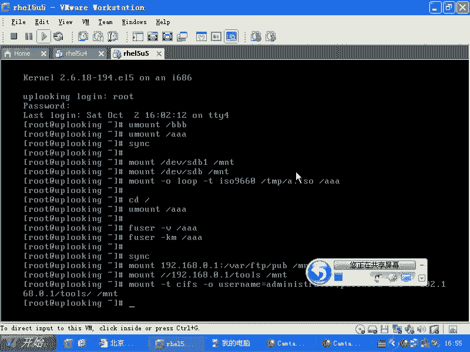

# 尚观Linux视频教程RHCE 精品课程 - P54：RH133-ULE115-8-3-mount-usb-fuser - 爱笑的程序狗 - BV1ax411o7VD

好，我们看一下啊，那么看到这个啊，你是U3啊，R7R5U3啊，不不是上面这。存在一个那个。啊，他们见他存存这个东西，我不是我做的哦。名字同。那可能还不行，就是说这个镜像的话呢，它可能我们先打开看一看啊。

就是我刚才mount了一个U盘是吧？这个U盘里面有个ISO的镜像是吧？这个ISO的镜像是不是可以直接mount在你的机器上？😊，ISO镜像就是把光盘从第一个字节开始读，一直读到末尾生成的一个文件。

是不是？那这个的话呢，就相当于你直接刻成光盘以后，它就是一个光盘。那么我刻成光盘以后再mount啊，跟我这样去操作是一样的。😊，是吧然后我们去mount是吧，杠O加上一个什么lo啊，然后呢。

你可以加上一个什么呢？这种文件系统的格式，文件系统格式一般是杠T是吧？ISO99660或者是什么呢？直接就是什么CDFS之类的这种东西。那么ISO9660，然后呢加上一个什么呢？

D呃就是AAA目录下的啊。😊，HEL5U3是吧？ISO然后呢mve在某个目录下，千万不要用TMP目录。很多人以为TMP目录临时文件目录就没有用啊，那简直是。人家买circle是吧。

比方说正在往里面写一个临时文件，你啪把人家的根儿都断掉了，是吧？😊，监然屏目录都不让访问了，那这样的话就麻烦。所以千万不要认为它是可有可无的。我们叫要拿makeDR一个什么呢？😊，啊，BBB吧啊。

这边是我忘的1个ISO镜像啊。BBB啊这样来做。然后呢，我在CD到什么呢？BBB目录下去，还说S还有这么多文件啊。还真的是优3哎。还真的有3，但是我们就不能装它了，我不能装它。

因为我一旦的话呢去装这个RP包什么的话，是不是就产生那个问题了？两系列的RPM包是吧？它互相之间冲突啊，就是说呃你是R7R5U5，那你就装的包的话呢，尽量都是U5的，不要再产生什么呢？

U3啊或者U4混在一起。这样的话RPM它解决不了这些依存关系的。啊。好。然后呢，在youmount的时候，如果你这样youmount的话，那肯定是不行的，对不对？为什么呢？因为你现在就是在这个目录下。

你现在就是在这个目录下，对不对？你在这个目录下，你在桥上能拆桥吗？😊，你在桥桥上肯定不能拆墙，所以的话你要什么CD坑，然后呢再去怎么样，再去U啊。但是呢当多个人或者多个进程在使用这个计算机的时候。

你根本就不知道谁踩在这个桥上是吧？youmount时候总是unmount不掉。这个时候的话呢有一个非常好的命令啊，这个命令大家可以记下Fus是吧？😊，然后呢，杠。V啊。哔哔哔。

它可以查看连接在BBB这个点上的所有的进程的名字。你可以一个一个的Q掉他，杀掉他。😡，啊，你方说Q是吧，杠9，如果我在这个CD，我在这个BBB下啊，你看一眼是什么样子。😡，他说。

BBB这个目录下有个傻蛋在上面是吧，谁呢？微笑。😊，你一看这个背 shell就知道有人CD到那个目录下了，是不是CD命令是不是就悲 shell里面的子命那个就是内部命令啊。

那么这时候呢你想把这个桥拆掉怎么办呢？你可以让它早点走人是吧？说去一边去是吧，我要把这个U忘掉它不听你的，或者这是一个傻乎乎的进程，那这时候怎么办呢？你可以用一个命令啊，Fus杠KM。😊，然后呢。

BBB把这个加载点下的所有的进程全部都干掉。啊，就说。我要拆桥了是吧，你们愿爱走不走是吧？😡，反正先把你们推下去再说啊，找推土机来把你们推下去再说。这样的话呢。

直接我这样EFuser杠TME回车就把我自己干掉了。😊，把自己这个悲事要干掉了，于是我又回到登录提示服下。是不是？OK我看一下啊，那我再重新登录过来，然后呢再输入一个you什么？😊，BBB是不是。

然后呢再去什么呢？youmount。AAA啊，这样的话呢就齐活了，是吧？如果要是你担心这个U盘啊，它呢他写往往里面写东西的时候，没有写到U盘，因为U盘传输速度慢是吧？有的时候你往上一拷贝数据。

它实际上并没有写进去。那这时候的话呢，你要用一个命令叫做什么呢？SYNC它就是把缓存当中的数据全部都同步到这个磁盘上去啊，这样的话呢，你会发觉如果你要拷贝了几G的文件拷py到U盘上，你运行这个命令以后。

你要等很久的，那个U盘的话写东西特别慢，是不是所以的话呢这个命令就是做这个用啊，它可以同步缓存，就是内存当中的这个数据到哪去呢？到你的硬盘上去不会产生数据丢失的这个情况啊，所以刚才我们看到的是什么呢？

啊，几个命令，是不是一个是。😊，几种mount是不是mount第EV下的有SDBE是吧？mount在比如说MNT目录下，这是U盘是不是或者是SDA1是不是？但是刚才我们看到一个特殊的情况是什么？

DEV下的SDB是吧？整个一块硬盘mount过去了，是吧？如果要是我们想mount一个ISO的镜像文件，到一个目录下的时候，要加杠O什么。然后呢，最好还是加上什么ISO9660。如果你不加的话呢。

你看它会不会出错。如果它其实说你要指定文件系统类型，那你就加如果要不需要，那你就直接就可以过去把一个镜像，比方说TMP目录下的一个A点ISO的镜像mount在了一个什么AAA目录下啊。

那么你要想去想去把它Umount要的时候，你要什么跟下面去啊，不要再去什么在这个目录下，然后Umount掉那么你可以再去Umount什么AA如果要是你不知道是谁在那个在用那个目录下的文件。😊。

究什么Fuser什么杠V哎呀如果你想不客气的把它干掉，管你谁在上面是吧？那就怎么样？Fuser杠KM。😊，A哎A啊，然后呢你还可以怎么样呢呃。啊，你如果要是杀掉以后的话，你就可以Umount。

但是如果要是你的这个U盘拷py了大量数据，你也不知道它到底有没有写到这个U盘上。那你可以保险一点SYNC是不是？然后呢再去Umount啊，这就是我们的一些有个U盘啊，移动介指的一些东西，对不对？

那么你还可以怎么样呢？mount。😊，192168。0。1下面共享的什么呢？Y下的FTP下的POB当中啊，mount子在MNT目录下，这个的话就是什么mountNFS共享。然后呢。

如果要是mount一个什么呢？windows下的共享杠杠啊，192168。0。1下面的什么呢？名么叫tos的共享mount子MNT目录下。如果要是连接windows的共享的时候，需要输入用户名和密码。

加什么呢？杠。😊，啊，就是如果上面这个命令不成的话啊，不成的话呢，你可能要指定一下文件系统类型，杠T什么CIFS。啊，然后呢杠杠Ouser name等于什么啊 the mini。

是吧然后呢你还可以加个逗号，pass word等于。比方说123，你不加pasword了以后，他回过一回车以后，他会要求你输入pasword是吧？然后呢去。对吧这样也可以，就是mount子的一些用法啊。

我们顺手把它讲。对吧。哪个地方有问题？哪个地方有问题？啊。没有问题是吧？好。

