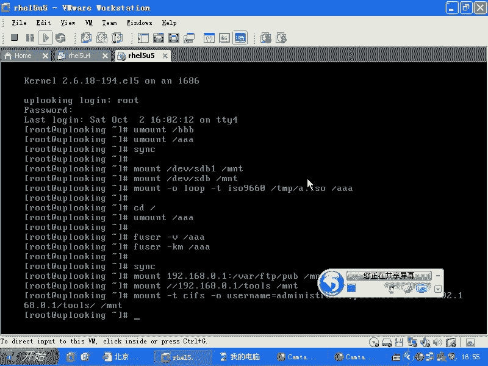

# Linux系统管理：P54：挂载USB设备与fuser命令


## 概述
在本节课中，我们将学习如何在Linux系统中挂载USB设备、ISO镜像文件以及网络共享。同时，我们会介绍一个重要的命令 `fuser`，它用于查看和管理正在使用某个文件或目录的进程，这对于安全卸载设备至关重要。

---

## 挂载ISO镜像文件
上一节我们介绍了挂载普通设备的方法，本节中我们来看看如何挂载一个ISO镜像文件。ISO镜像文件是光盘内容的完整副本，可以直接挂载到系统目录中，就像插入了一张物理光盘。

挂载ISO镜像需要使用 `-o loop` 选项，并可以指定文件系统类型。命令格式如下：
```bash
mount -o loop -t iso9660 /路径/到/镜像.iso /挂载点目录
```
例如，将 `/aaa/hel5u3.iso` 挂载到 `/bbb` 目录：
```bash
mount -o loop -t iso9660 /aaa/hel5u3.iso /bbb
```
**注意**：请勿使用 `/tmp` 这类系统临时目录作为挂载点，因为其他程序可能正在使用它，强行卸载会导致问题。

挂载成功后，你可以通过 `cd /bbb` 进入目录并访问其中的文件。

---

## 安全卸载设备与fuser命令
当你尝试卸载一个设备时，可能会遇到“设备忙”的错误。这通常是因为有进程正在访问该挂载点目录下的文件。

以下是解决此问题的步骤和方法：

首先，使用 `fuser` 命令查看哪些进程正在使用目标目录。
```bash
fuser -v /挂载点目录
```
例如，查看 `/bbb` 目录的使用情况：
```bash
fuser -v /bbb
```
该命令会列出所有相关进程的PID和所属用户。

如果确认需要强制卸载，可以使用 `fuser -km` 命令终止所有访问该目录的进程。
```bash
fuser -km /挂载点目录
```
例如，强制结束所有使用 `/bbb` 的进程：
```bash
fuser -km /bbb
```
**警告**：此命令会强制终止进程，可能导致未保存的数据丢失，请谨慎使用。

进程终止后，即可正常卸载设备：
```bash
umount /挂载点目录
```

---

## 数据同步与卸载U盘
在卸载U盘等移动存储设备前，为确保所有缓存数据都已写入设备，避免数据丢失，可以使用 `sync` 命令。
```bash
sync
```
该命令会将内存缓冲区中的数据强制写入磁盘。对于U盘，写入可能较慢，请耐心等待其完成后再执行卸载操作。

完整的U盘使用流程示例如下：
1.  挂载U盘（假设设备为 `/dev/sdb1`）：
    ```bash
    mount /dev/sdb1 /mnt
    ```
2.  进行文件操作（复制、编辑等）。
3.  操作完成后，执行数据同步：
    ```bash
    sync
    ```
4.  确保没有进程占用 `/mnt` 目录，必要时使用 `fuser -km /mnt`。
5.  卸载U盘：
    ```bash
    umount /mnt
    ```

---

## 挂载网络共享
除了本地设备，Linux系统也可以挂载网络共享。

**挂载NFS共享**：
```bash
mount 192.168.0.1:/shared/path /mnt
```

**挂载Windows共享 (CIFS/SMB)**：
基本命令格式如下，系统会提示输入密码：
```bash
mount //192.168.0.1/sharename /mnt
```
如果需要指定用户名和密码，可以使用以下格式：
```bash
mount -t cifs -o username=your_username,password=your_password //192.168.0.1/sharename /mnt
```
为了安全，也可以不直接在命令中写密码，命令执行后会交互式提示输入。

---

## 总结
本节课我们一起学习了Linux中多种资源的挂载与管理方法：
1.  使用 `mount -o loop` 挂载ISO镜像文件。
2.  使用 `fuser -v` 查看占用文件的进程，使用 `fuser -km` 强制结束进程以卸载繁忙的设备。
3.  使用 `sync` 命令确保数据写入磁盘后再安全移除U盘。
4.  掌握了挂载NFS和Windows网络共享的基本命令。



熟练掌握这些命令，能够帮助你在Linux系统中更高效、更安全地管理各种存储设备和网络资源。