# Linux系统管理：P55：文件系统挂载与卸载详解 🖥️


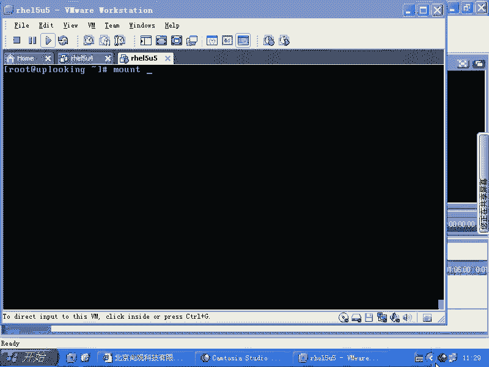

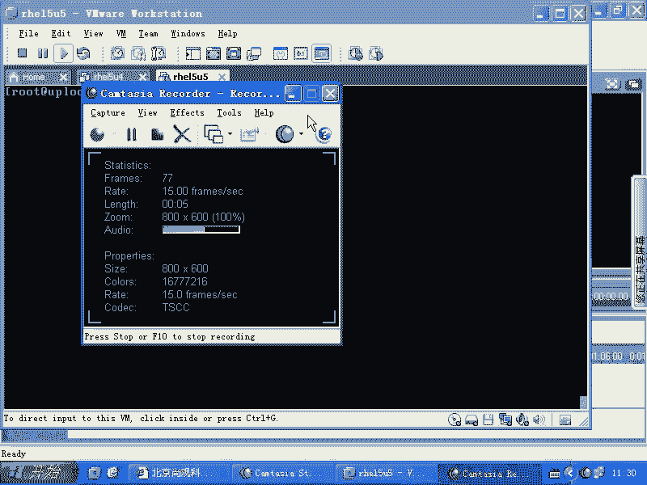

在本节课中，我们将学习Linux系统中至关重要的文件系统管理操作，包括使用`mount`命令挂载各种存储设备、网络共享，以及使用`umount`和`fuser`命令安全卸载。理解这些命令是管理服务器和日常运维的基础。

## 挂载（mount）命令基础 📌

`mount`命令用于将存储设备或网络共享连接到Linux文件系统的某个目录（挂载点）。上一节我们介绍了文件系统的基本概念，本节中我们来看看具体的挂载操作。

其基本语法是：
```bash
mount [选项] <设备或资源> <挂载点目录>
```

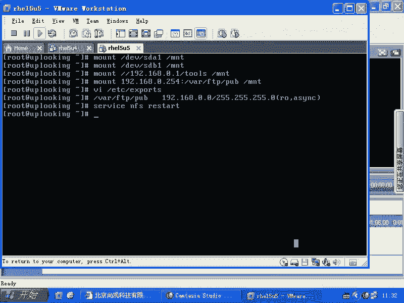

以下是几种常见的挂载场景示例：
*   **挂载本地硬盘分区**：`mount /dev/sda1 /mnt`
*   **挂载U盘分区**：`mount /dev/sdb1 /mnt`
*   **挂载Windows网络共享（CIFS）**：`mount -t cifs -o username=admin,password=123 //192.168.0.1/share /mnt`
*   **挂载NFS网络共享**：`mount -t nfs 192.168.0.254:/var/ftp/pub /mnt`
*   **挂载光盘**：`mount -t iso9660 /dev/cdrom /mnt`
*   **挂载ISO镜像文件**：`mount -o loop /tmp/a.iso /mnt`

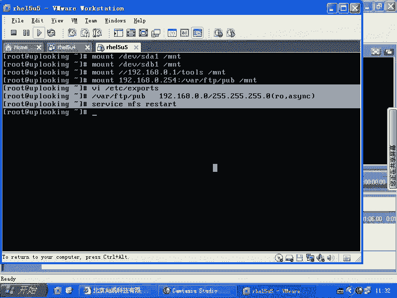

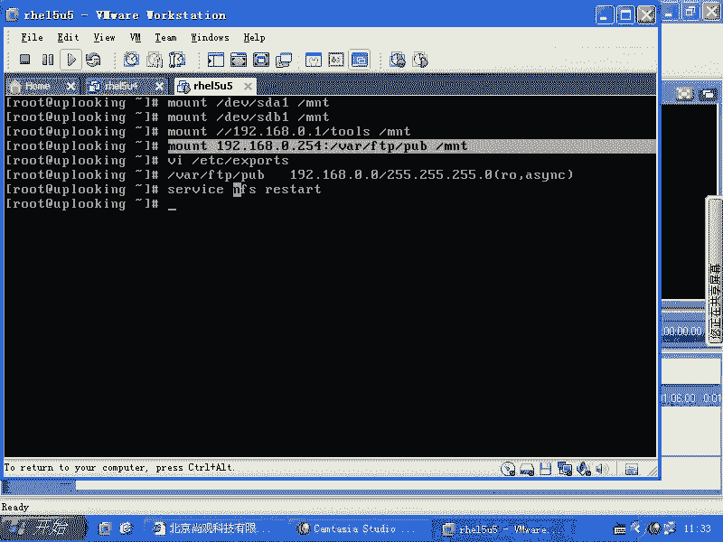

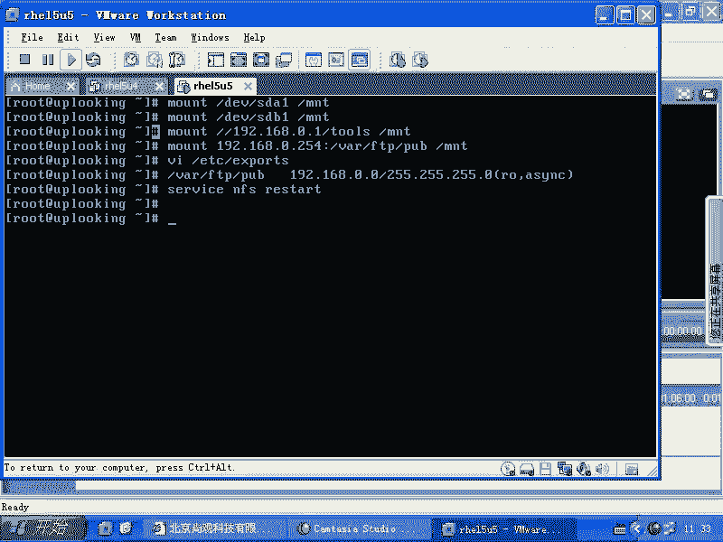

> **注意**：对于SATA接口的光驱，设备文件可能是`/dev/sr0`。图形界面（如GNOME）会自动将可移动介质挂载到`/media`目录下，这依赖于系统的热插拔（hotplug）机制。

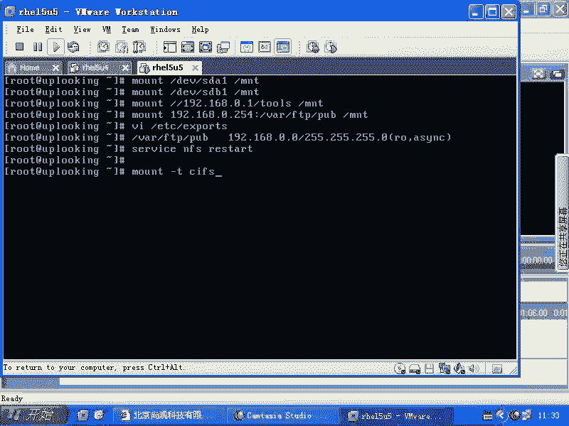

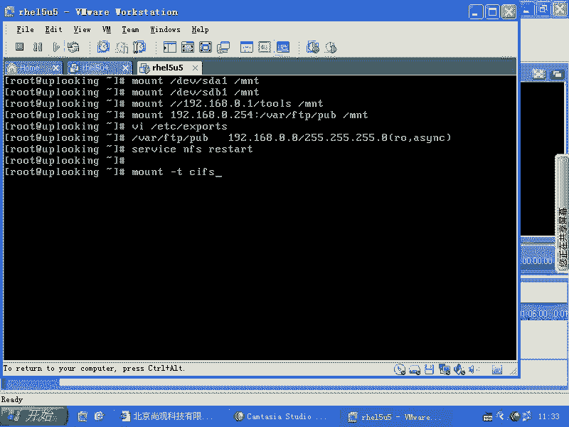

## 使用卷标（Label）挂载 🏷️

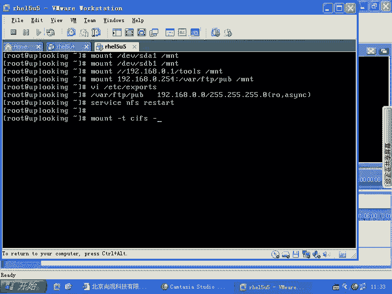

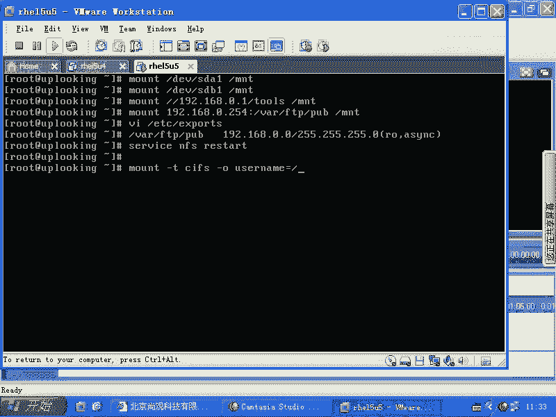

直接使用设备名（如`/dev/sda1`）挂载存在局限性，因为设备名可能随硬件顺序改变而变化。更可靠的方法是使用文件系统的卷标。

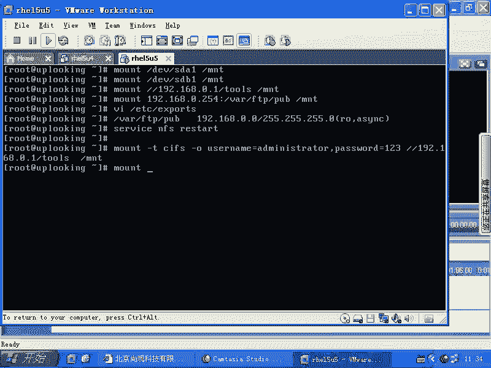

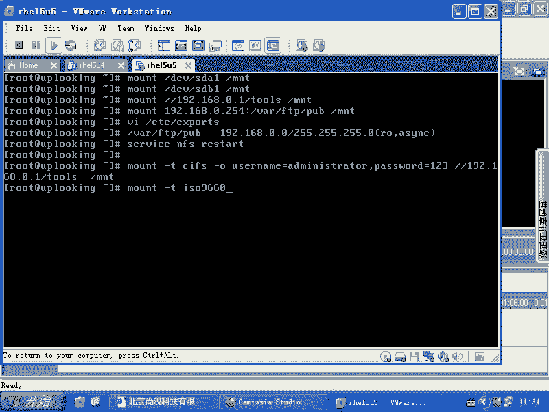

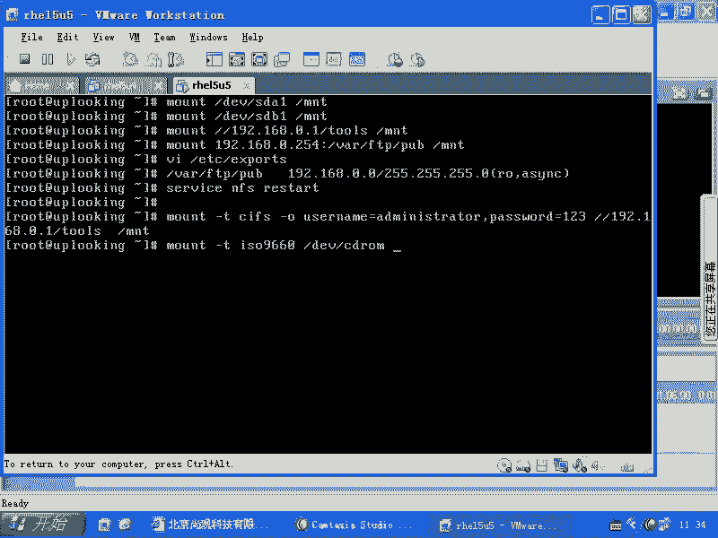

我们可以使用`e2label`命令为分区设置卷标。例如，系统的根分区或启动分区通常有默认卷标。挂载时可以使用`LABEL=`参数：
```bash
mount LABEL=/boot /boot
```
此命令等同于`mount /dev/sda1 /boot`（假设`/dev/sda1`的卷标是`/boot`）。

系统启动时自动挂载依赖于`/etc/fstab`配置文件。该文件通常使用卷标（`LABEL=`）或UUID来标识分区，以确保唯一性。如果无意中修改了分区的卷标，导致`/etc/fstab`中的条目无法匹配，系统启动时可能会失败，进入紧急修复模式，提示输入root密码进行维护或按Ctrl+D重启。

## 自动挂载与卸载 🔄

`/etc/fstab`文件是`mount`命令的配置文件。系统启动时会读取此文件并自动挂载其中定义的所有文件系统。

使用`mount -a`命令可以手动挂载`/etc/fstab`中所有未挂载的文件系统。
```bash
mount -a
```

卸载文件系统使用`umount`命令，后接设备名或挂载点。
```bash
umount /mnt
# 或
umount /dev/sdb1
```

## 处理“设备忙”问题与fuser命令 ⚠️

卸载时若遇到“device is busy”错误，通常是因为有进程正在使用该挂载点下的文件。

首先，确保当前工作目录不在要卸载的挂载点内。如果仍然无法卸载，可以使用`fuser`命令来查看并终止相关进程。

以下是`fuser`命令的常用方法：
*   **查看占用进程**：`fuser -v /mnt` 显示正在使用`/mnt`目录的进程详细信息。
*   **终止占用进程**：`fuser -km /mnt` 发送SIGKILL信号终止所有使用`/mnt`目录的进程。

> **重要提示**：`fuser -km`只能终止用户空间的进程。如果在一个已挂载的目录（如`/mnt`）内部，又嵌套挂载了另一个资源（例如一个ISO文件），那么内核本身会占用顶层目录。在这种情况下，`fuser -km`可能无法成功卸载，你需要先卸载嵌套的挂载点。

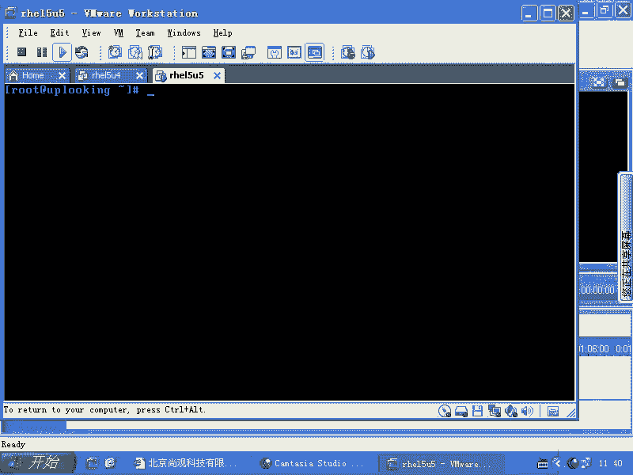

## NFS服务器配置示例 🌐

为了能让客户端挂载NFS共享，服务器端需要进行配置。以下是配置NFS服务器共享目录的基本步骤：

1.  编辑NFS配置文件`/etc/exports`。
2.  添加共享条目，格式为：`<目录路径> <客户端IP或网段>(选项)`。
3.  重启NFS服务使配置生效。

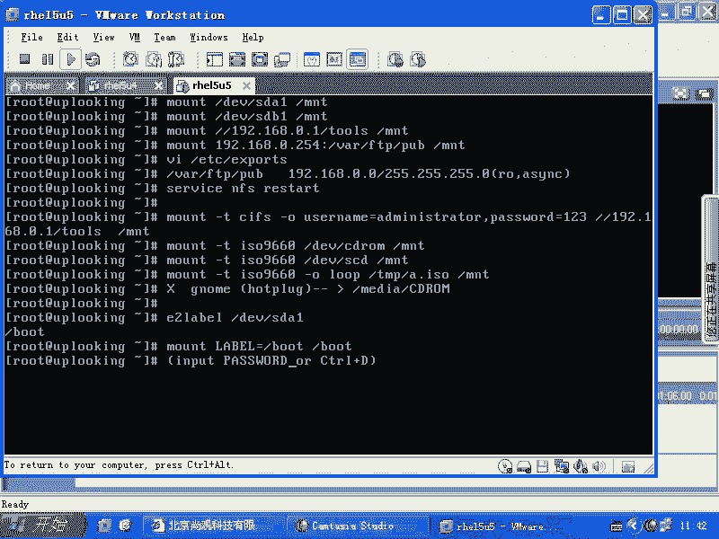

例如，将`/var/ftp/pub`目录以只读（ro）方式共享给`192.168.0.0/24`网段：
```bash
# 在NFS服务器上执行
vi /etc/exports
# 添加一行：/var/ftp/pub 192.168.0.0/255.255.255.0(ro,sync)
service nfs restart
# 设置NFS服务开机自启：chkconfig nfs on
```
之后，客户端即可使用`mount -t nfs 192.168.0.254:/var/ftp/pub /mnt`命令进行挂载。

---

本节课中我们一起学习了Linux文件系统的核心管理操作。我们掌握了使用`mount`命令挂载本地设备、网络共享和镜像文件的方法；理解了通过卷标挂载的可靠性以及`/etc/fstab`配置文件的作用；学会了使用`umount`卸载设备，并运用`fuser`命令解决“设备忙”的卸载问题。此外，我们还简要了解了NFS服务器的基本配置。这些技能是进行系统管理和维护的坚实基础。